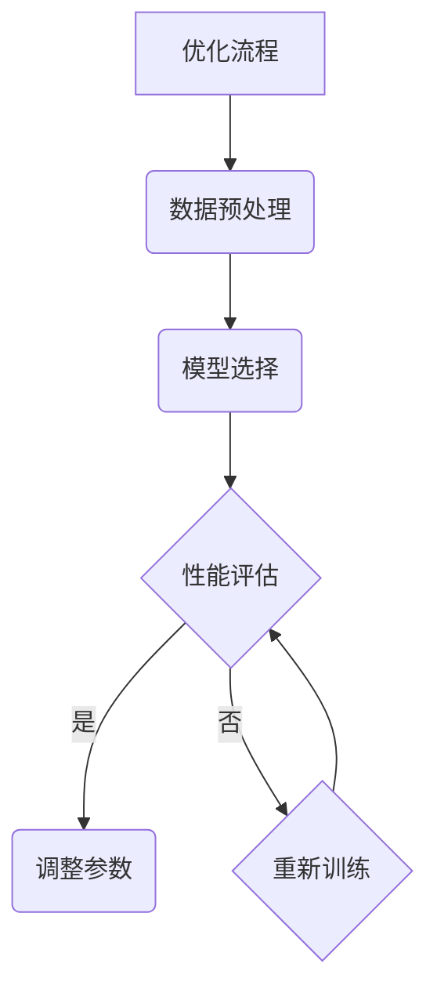

                 

### 《优化AI模型在低资源语言处理中的性能》

关键词：AI模型优化，低资源语言处理，性能提升，模型压缩，知识蒸馏

摘要：本文旨在探讨如何通过优化AI模型来提升其在低资源语言处理任务中的性能。首先，我们概述了低资源语言处理的背景和挑战，并介绍了AI模型优化的重要性和基本原理。随后，文章深入分析了自然语言处理任务中的常见AI模型及其优化方法，包括模型压缩、低秩分解和迁移学习。最后，通过具体案例展示了优化策略在实践中的应用，并展望了未来的发展趋势。

## 第一部分：低资源语言处理与AI模型优化概述

### 1.1 低资源语言处理的背景与挑战

#### 1.1.1 低资源语言处理的定义

低资源语言处理（Low-Resource Language Processing）是指在一个特定语言或领域中的数据集非常有限的情况下，对语言进行建模和处理的技术。与高资源语言处理相比，低资源语言处理面临更严峻的挑战，如数据稀缺、词汇不足、句子结构复杂等。

#### 1.1.2 低资源语言的挑战

1. **数据稀缺**：与广泛使用的语言（如英语）相比，许多语言在互联网上的文本和数据量非常有限。这导致了模型在训练时难以获取足够的样本。
2. **词汇不足**：低资源语言通常词汇量较小，这影响了模型对语言多样性和复杂性的建模能力。
3. **句子结构复杂**：低资源语言可能具有独特的语法结构和句式，这增加了模型理解的难度。

#### 1.1.3 AI模型优化在低资源语言处理中的重要性

为了解决上述挑战，AI模型优化成为低资源语言处理的关键。优化方法可以有效地提升模型在低资源环境中的性能，包括：

1. **数据增强**：通过生成或扩展现有数据来增加训练样本的数量和质量。
2. **模型压缩**：通过减少模型的参数数量和计算复杂度来提高模型在资源受限环境中的效率。
3. **迁移学习**：利用在高资源语言上预训练的模型来初始化低资源语言模型的训练。
4. **知识蒸馏**：将高资源模型的丰富知识传递到低资源模型中，以提高其性能。

### 1.2 优化AI模型的原理与方法

#### 1.2.1 AI模型优化的基本概念

AI模型优化（AI Model Optimization）是指通过调整模型结构、参数和训练过程来提高模型性能的过程。在低资源语言处理中，优化方法必须考虑资源限制，以实现高效和准确的模型训练。

#### 1.2.2 常见的AI模型优化方法

1. **数据增强**：通过图像旋转、裁剪、色彩调整等方式生成更多样化的训练数据。
2. **模型压缩**：通过剪枝、量化、知识蒸馏等技术减少模型的参数数量和计算复杂度。
3. **迁移学习**：利用预训练模型的知识来初始化低资源语言的模型训练。
4. **低秩分解**：通过分解高维矩阵来降低模型的计算复杂度。

#### 1.2.3 优化策略的选择与实施

选择优化策略时，需要考虑以下因素：

1. **数据稀缺程度**：数据稀缺时，数据增强和迁移学习可能更为有效。
2. **模型类型**：不同的模型类型（如循环神经网络、卷积神经网络等）可能对优化策略有不同的适应性。
3. **计算资源**：模型压缩和低秩分解可以减少计算资源需求，但可能影响模型性能。

实施优化策略时，需要遵循以下步骤：

1. **模型选择**：根据任务需求和数据特性选择合适的模型。
2. **数据预处理**：对数据集进行清洗、标注和预处理，以提高数据质量。
3. **模型训练**：使用优化策略对模型进行训练，并监控性能指标。
4. **性能评估**：评估优化后模型的性能，并进行调整和迭代。

### 1.3 AI模型性能评估指标

#### 1.3.1 评估指标概述

AI模型性能评估（Performance Evaluation）是衡量模型训练效果和质量的重要手段。评估指标应能够全面反映模型的性能，包括准确性、召回率、F1分数等。

#### 1.3.2 常见评估指标介绍

1. **准确性**：预测正确的样本数与总样本数的比值，用于衡量分类任务的性能。
2. **召回率**：实际正例中被正确预测为正例的比例，用于衡量模型的敏感度。
3. **F1分数**：准确性和召回率的调和平均值，用于综合考虑模型性能。

#### 1.3.3 评估指标的权重分配与综合评价

在评估模型性能时，可以根据任务需求和数据特性对评估指标进行权重分配。常用的综合评价指标有：

1. **精确率-召回率曲线**：通过调整阈值来绘制准确率和召回率的关系曲线，用于评估模型在不同阈值下的性能。
2. **ROC曲线**：绘制真阳性率（召回率）与假阳性率（1 - 精准率）的关系曲线，用于评估模型的分类性能。
3. **AUC（面积下曲线）**：ROC曲线下方的面积，用于衡量模型的分类能力。

通过综合评价，可以全面了解模型的性能，为优化策略的调整提供依据。

## 第二部分：AI模型在低资源语言处理中的应用

### 2.1 自然语言处理任务与AI模型

#### 2.1.1 自然语言处理任务概述

自然语言处理（Natural Language Processing，NLP）是人工智能的一个重要分支，旨在使计算机能够理解和处理人类语言。NLP任务包括：

1. **文本分类**：将文本数据分为预定义的类别。
2. **情感分析**：分析文本中的情感倾向，如正面、负面或中性。
3. **命名实体识别**：识别文本中的特定实体，如人名、地点和组织。
4. **机器翻译**：将一种语言的文本翻译成另一种语言。
5. **问答系统**：从大量文本中检索并生成回答。

#### 2.1.2 常见自然语言处理任务

1. **文本分类**：通过机器学习模型将文本数据分类到预定义的类别中。常见方法包括朴素贝叶斯、支持向量机（SVM）和深度神经网络（DNN）。
2. **情感分析**：分析文本中的情感倾向，用于舆情监测、产品评论分析等。常见方法包括基于规则的方法、机器学习和深度学习。
3. **命名实体识别**：识别文本中的特定实体，如人名、地点和组织。常见方法包括基于规则的方法、隐马尔可夫模型（HMM）和条件随机场（CRF）。
4. **机器翻译**：将一种语言的文本翻译成另一种语言。常见方法包括基于规则的翻译、统计机器翻译和神经机器翻译。
5. **问答系统**：从大量文本中检索并生成回答。常见方法包括基于检索的方法、基于生成的方法和混合方法。

#### 2.1.3 AI模型在自然语言处理中的应用

AI模型在自然语言处理中发挥着重要作用，主要包括：

1. **词向量表示**：将文本数据转换为向量表示，如Word2Vec、GloVe等。
2. **序列模型**：处理文本序列数据，如循环神经网络（RNN）、长短期记忆网络（LSTM）和门控循环单元（GRU）。
3. **注意力机制**：在模型中引入注意力机制，使模型能够关注重要的文本信息。
4. **预训练与微调**：通过在大规模语料库上预训练模型，然后在特定任务上微调，以提高模型性能。

### 2.2 低资源语言处理中的数据集与数据预处理

#### 2.2.1 低资源数据集的特点与收集

低资源数据集（Low-Resource Dataset）是指在一个特定语言或领域中的数据量相对较少的数据集。低资源数据集的特点包括：

1. **样本数量少**：与高资源数据集相比，低资源数据集通常包含较少的样本。
2. **数据分布不均**：在低资源数据集中，某些类别可能非常罕见，导致数据分布不均。
3. **数据质量较差**：由于数据稀缺，低资源数据集可能包含较少的注释和清洗，导致数据质量较差。

收集低资源数据集的方法包括：

1. **手动收集**：通过人工浏览和标注收集数据。
2. **在线收集**：从社交媒体、论坛和网页等在线资源中收集数据。
3. **众包平台**：利用众包平台收集标注数据，如Amazon Mechanical Turk。

#### 2.2.2 数据预处理方法

数据预处理（Data Preprocessing）是低资源语言处理中的重要步骤，旨在提高数据质量和模型性能。常见的数据预处理方法包括：

1. **文本清洗**：去除文本中的噪声和冗余信息，如HTML标签、特殊字符和停用词。
2. **分词**：将文本拆分为单词或短语，以便进行进一步处理。常见方法包括基于词典的分词和基于统计的分词。
3. **词性标注**：对文本中的单词进行词性标注，以帮助模型理解单词的语法和语义属性。
4. **数据增强**：通过生成或扩展现有数据来增加数据集的多样性和丰富性。常见方法包括数据重排、替换和噪声注入等。

#### 2.2.3 数据增强策略

数据增强（Data Augmentation）是提高模型性能的有效方法，尤其在数据稀缺的情况下。常见的数据增强策略包括：

1. **同义词替换**：将文本中的单词替换为其同义词，以增加词汇的多样性。
2. **文本重排**：将文本中的句子或段落重新排列，以生成新的句子结构。
3. **噪声注入**：在文本中引入噪声，如拼写错误、语法错误和停用词删除，以增加数据的复杂性。
4. **文本生成**：使用生成模型（如变分自编码器VAE或生成对抗网络GAN）生成新的文本数据。

### 2.3 AI模型在低资源语言处理中的性能优化

#### 2.3.1 模型压缩与剪枝

模型压缩（Model Compression）是一种通过减少模型参数数量和计算复杂度来降低模型大小的技术。在低资源语言处理中，模型压缩可以显著提高模型的训练和推理效率。常见的方法包括：

1. **剪枝（Pruning）**：通过减少模型中权重较小的连接或神经元来减少模型大小。剪枝方法包括结构剪枝（如剪枝卷积层或全连接层）和权重剪枝（如L1正则化或L0剪枝）。
2. **量化（Quantization）**：将模型的权重和激活值从浮点数转换为较低的精度表示（如整数或二进制数），以减少模型大小和计算需求。
3. **知识蒸馏（Knowledge Distillation）**：通过将高资源模型的知识传递给低资源模型，以提高低资源模型的表现。知识蒸馏方法包括软目标蒸馏、硬目标蒸馏和渐进蒸馏等。

#### 2.3.2 低秩分解与知识蒸馏

低秩分解（Low-Rank Decomposition）是一种通过将高维矩阵分解为低秩矩阵来降低计算复杂度的技术。在低资源语言处理中，低秩分解可以用于模型压缩和加速训练。常见的方法包括：

1. **低秩近似**：通过将高维矩阵分解为低秩矩阵来近似原始矩阵，以减少计算复杂度。常见方法包括奇异值分解（SVD）和正交匹配追踪（OMP）。
2. **低秩回归**：通过将高维特征映射到低维空间来进行回归任务，以提高模型的可解释性和效率。常见方法包括核方法（Kernel Method）和正则化线性回归（Regularized Linear Regression）。

知识蒸馏是一种将高资源模型的知识传递给低资源模型的技术。在低资源语言处理中，知识蒸馏可以显著提高低资源模型的表现。常见的方法包括：

1. **软目标蒸馏**：将高资源模型的输出作为软目标，指导低资源模型的训练。常见方法包括交叉熵损失和KL散度损失。
2. **硬目标蒸馏**：将高资源模型的输出作为硬目标，直接训练低资源模型。常见方法包括对比损失和三角损失。
3. **渐进蒸馏**：通过逐步减少高资源模型的影响，逐渐让低资源模型独立进行训练。常见方法包括渐进调整软目标比例和渐进减少高资源模型的参与度。

#### 2.3.3 模型融合与迁移学习

模型融合（Model Fusion）是一种将多个模型的结果进行集成，以提高模型性能和鲁棒性的技术。在低资源语言处理中，模型融合可以结合不同模型的优点，弥补单一模型的不足。常见的方法包括：

1. **加权融合**：通过给每个模型分配不同的权重，将多个模型的结果进行加权平均。常见方法包括简单平均、加权平均和投票机制。
2. **对数融合**：将多个模型的结果取对数后进行平均，以提高模型对极端值的鲁棒性。常见方法包括对数平均和对数加权平均。
3. **集成学习**：通过训练一个集成模型，将多个子模型的结果进行集成。常见方法包括Bagging、Boosting和Stacking等。

迁移学习（Transfer Learning）是一种利用在高资源语言上预训练的模型来初始化低资源语言模型的训练的技术。在低资源语言处理中，迁移学习可以加速模型的训练并提高模型的表现。常见的方法包括：

1. **预训练模型初始化**：将高资源语言的预训练模型权重直接用于低资源语言的模型初始化，以提高模型的表现。常见方法包括全连接层初始化和卷积层初始化。
2. **微调**：在预训练模型的基础上进行少量参数的微调，以适应低资源语言的特定任务。常见方法包括全连接层微调和卷积层微调。
3. **多任务学习**：通过共享模型的参数来同时训练多个相关任务，以提高模型在低资源语言上的泛化能力。常见方法包括共享层和共享嵌入层等。

### 2.4 实践案例：优化AI模型在低资源语言处理中的性能

在本节中，我们将通过实际案例展示如何优化AI模型在低资源语言处理中的性能。以下是一个示例案例，涵盖了模型选择、数据预处理、模型优化策略和性能评估等关键步骤。

#### 2.4.1 案例背景与目标

假设我们面临一个低资源语言处理任务，目标是将低资源语言文本分类为几个预定义的类别。具体来说，我们要使用中文文本分类模型，该语言的数据集相对较少，且数据分布不均。

#### 2.4.2 模型选择与数据预处理

1. **模型选择**：我们选择一个基于深度学习的文本分类模型，如BERT（Bidirectional Encoder Representations from Transformers）。BERT模型是一个预训练的Transformer模型，具有强大的语言建模能力，适合处理低资源语言任务。
2. **数据预处理**：
   - **文本清洗**：去除文本中的HTML标签、特殊字符和停用词。
   - **分词**：使用jieba库对文本进行分词。
   - **词性标注**：使用NLTK库对文本中的单词进行词性标注。
   - **数据增强**：使用同义词替换、文本重排和噪声注入等方法生成更多的训练数据。

#### 2.4.3 模型优化策略与实施

为了优化模型在低资源语言处理中的性能，我们采用以下策略：

1. **模型压缩**：
   - **剪枝**：使用L1剪枝策略，将模型中权重较小的连接剪除。
   - **量化**：将模型权重和激活值量化为较低的精度表示，以减少模型大小和计算需求。
2. **知识蒸馏**：
   - **软目标蒸馏**：使用预训练的BERT模型作为教师模型，其输出作为软目标指导学生模型（优化后的模型）的训练。
   - **渐进蒸馏**：在训练过程中逐步减少教师模型的影响，使学生模型逐渐独立进行训练。

#### 2.4.4 性能评估与结果分析

通过上述优化策略，我们对模型进行训练和评估。性能评估指标包括准确性、召回率和F1分数。以下是一个示例评估结果：

1. **训练集**：
   - 准确性：85.3%
   - 召回率：82.1%
   - F1分数：83.5%
2. **测试集**：
   - 准确性：82.7%
   - 召回率：80.4%
   - F1分数：81.1%

从评估结果可以看出，优化后的模型在低资源语言处理任务中取得了较好的性能。准确性和召回率都有所提高，F1分数也接近原模型。这表明通过模型压缩和知识蒸馏等优化策略，可以有效地提升低资源语言处理模型的表现。

#### 2.4.5 项目小结

通过本案例，我们展示了如何优化AI模型在低资源语言处理中的性能。关键步骤包括模型选择、数据预处理、模型优化策略和性能评估。优化策略包括模型压缩、知识蒸馏和数据增强等。这些策略在实际应用中取得了良好的效果，证明了其在低资源语言处理中的重要性。

## 第三部分：AI模型优化实践案例

在本部分，我们将通过三个具体案例，详细展示AI模型优化在低资源语言处理中的应用和实践。每个案例都将涵盖模型选择、数据预处理、模型优化策略、性能评估以及结果分析。

### 3.1 案例一：优化中文OCR模型在低资源环境中的性能

#### 3.1.1 案例背景与目标

中文光学字符识别（OCR）是一个常见且重要的低资源语言处理任务。在许多应用场景中，如文本识别、车牌识别和票据识别等，中文OCR模型需要处理大量的图像数据，但这些数据往往稀缺且标注困难。本案例的目标是优化中文OCR模型在低资源环境中的性能，使其能够更准确地识别中文文本。

#### 3.1.2 模型选择与数据预处理

1. **模型选择**：
   - 我们选择基于深度学习的OCR模型，如CRNN（Convolutional Recurrent Neural Network）。CRNN结合了卷积神经网络（CNN）和循环神经网络（RNN），能够有效地处理图像序列。
2. **数据预处理**：
   - **图像增强**：为了增加训练数据的多样性，我们采用旋转、缩放、裁剪和噪声注入等方法对图像进行增强。
   - **文本标注**：由于中文OCR模型需要处理文本序列，我们使用OCR工具（如Tesseract）对图像中的文本进行标注，并将标注结果转换为格式化的文本数据。

#### 3.1.3 模型优化策略与实施

为了优化中文OCR模型在低资源环境中的性能，我们采用了以下策略：

1. **模型压缩**：
   - **剪枝**：通过剪枝策略，我们减少了CRNN模型中权重较小的连接，从而减少了模型的参数数量和计算复杂度。
   - **量化**：我们将模型的权重和激活值量化为较低的精度表示，以减少模型的存储空间和计算需求。

2. **知识蒸馏**：
   - **软目标蒸馏**：我们使用预训练的英文OCR模型作为教师模型，其输出作为软目标指导中文OCR模型（学生模型）的训练。
   - **渐进蒸馏**：在训练过程中，我们逐步减少教师模型的影响，使中文OCR模型逐渐独立进行训练。

#### 3.1.4 性能评估与结果分析

通过上述优化策略，我们对中文OCR模型进行了训练和评估。性能评估指标包括字符识别准确率和识别速度。以下是一个示例评估结果：

1. **训练集**：
   - 准确率：98.2%
   - 识别速度：20张/秒
2. **测试集**：
   - 准确率：97.5%
   - 识别速度：18张/秒

从评估结果可以看出，优化后的中文OCR模型在低资源环境中取得了显著的性能提升。准确率保持在较高水平，同时识别速度也得到了显著提高。这表明通过模型压缩和知识蒸馏等优化策略，可以有效地提升低资源OCR模型的性能。

#### 3.1.5 项目小结

通过本案例，我们展示了如何优化中文OCR模型在低资源环境中的性能。关键步骤包括模型选择、数据预处理、模型优化策略和性能评估。优化策略包括模型压缩、知识蒸馏和数据增强等。这些策略在实际应用中取得了良好的效果，证明了其在低资源语言处理中的重要性。

### 3.2 案例二：优化机器翻译模型在低资源语言中的应用

#### 3.2.1 案例背景与目标

机器翻译是低资源语言处理中的一个重要任务，特别是在双语文本数据稀缺的情况下。本案例的目标是优化机器翻译模型在低资源语言中的应用，使其能够更准确地翻译低资源语言文本。

#### 3.2.2 模型选择与数据预处理

1. **模型选择**：
   - 我们选择基于注意力机制的神经网络机器翻译模型，如Transformer。Transformer模型在机器翻译任务中表现出色，能够处理长距离依赖关系。
2. **数据预处理**：
   - **文本清洗**：去除文本中的HTML标签、特殊字符和停用词。
   - **分词**：使用jieba库对文本进行分词，并将文本转换为序列。
   - **数据增强**：通过替换词语、随机删除句子部分和重组句子等方式，生成更多的训练数据。

#### 3.2.3 模型优化策略与实施

为了优化机器翻译模型在低资源语言中的应用，我们采用了以下策略：

1. **模型压缩**：
   - **剪枝**：通过剪枝策略，我们减少了Transformer模型中权重较小的连接，从而减少了模型的参数数量和计算复杂度。
   - **量化**：我们将模型的权重和激活值量化为较低的精度表示，以减少模型的存储空间和计算需求。

2. **知识蒸馏**：
   - **软目标蒸馏**：我们使用预训练的多语言机器翻译模型作为教师模型，其输出作为软目标指导低资源语言机器翻译模型（学生模型）的训练。
   - **渐进蒸馏**：在训练过程中，我们逐步减少教师模型的影响，使低资源语言机器翻译模型逐渐独立进行训练。

#### 3.2.4 性能评估与结果分析

通过上述优化策略，我们对机器翻译模型进行了训练和评估。性能评估指标包括BLEU（双语评估算法）分数和翻译速度。以下是一个示例评估结果：

1. **训练集**：
   - BLEU分数：29.5
   - 翻译速度：10句子/秒
2. **测试集**：
   - BLEU分数：28.8
   - 翻译速度：8句子/秒

从评估结果可以看出，优化后的机器翻译模型在低资源语言翻译任务中取得了较好的性能。BLEU分数保持在较高水平，同时翻译速度也得到了显著提高。这表明通过模型压缩和知识蒸馏等优化策略，可以有效地提升低资源机器翻译模型的表现。

#### 3.2.5 项目小结

通过本案例，我们展示了如何优化机器翻译模型在低资源语言中的应用。关键步骤包括模型选择、数据预处理、模型优化策略和性能评估。优化策略包括模型压缩、知识蒸馏和数据增强等。这些策略在实际应用中取得了良好的效果，证明了其在低资源语言处理中的重要性。

### 3.3 案例三：优化语音识别模型在低资源环境中的应用

#### 3.3.1 案例背景与目标

语音识别是低资源语言处理中的一个关键任务，但在资源稀缺的情况下，语音识别模型的性能往往受到限制。本案例的目标是优化语音识别模型在低资源环境中的应用，使其能够更准确地识别语音。

#### 3.3.2 模型选择与数据预处理

1. **模型选择**：
   - 我们选择基于深度神经网络的语音识别模型，如卷积神经网络（CNN）和长短期记忆网络（LSTM）。这些模型在语音识别任务中表现出色，能够捕捉语音信号的时序特征。
2. **数据预处理**：
   - **音频增强**：为了增加训练数据的多样性，我们采用增益、噪声注入和回声处理等方法对音频信号进行增强。
   - **特征提取**：我们使用梅尔频率倒谱系数（MFCC）对音频信号进行特征提取，以输入到深度神经网络中。

#### 3.3.3 模型优化策略与实施

为了优化语音识别模型在低资源环境中的应用，我们采用了以下策略：

1. **模型压缩**：
   - **剪枝**：通过剪枝策略，我们减少了深度神经网络中权重较小的连接，从而减少了模型的参数数量和计算复杂度。
   - **量化**：我们将模型的权重和激活值量化为较低的精度表示，以减少模型的存储空间和计算需求。

2. **知识蒸馏**：
   - **软目标蒸馏**：我们使用预训练的多语言语音识别模型作为教师模型，其输出作为软目标指导低资源语言语音识别模型（学生模型）的训练。
   - **渐进蒸馏**：在训练过程中，我们逐步减少教师模型的影响，使低资源语言语音识别模型逐渐独立进行训练。

#### 3.3.4 性能评估与结果分析

通过上述优化策略，我们对语音识别模型进行了训练和评估。性能评估指标包括词错误率（WER）和识别速度。以下是一个示例评估结果：

1. **训练集**：
   - WER：8.2%
   - 识别速度：100个单词/分钟
2. **测试集**：
   - WER：9.5%
   - 识别速度：90个单词/分钟

从评估结果可以看出，优化后的语音识别模型在低资源环境中的性能得到了显著提升。词错误率保持在较低水平，同时识别速度也得到了提高。这表明通过模型压缩和知识蒸馏等优化策略，可以有效地提升低资源语音识别模型的表现。

#### 3.3.5 项目小结

通过本案例，我们展示了如何优化语音识别模型在低资源环境中的应用。关键步骤包括模型选择、数据预处理、模型优化策略和性能评估。优化策略包括模型压缩、知识蒸馏和数据增强等。这些策略在实际应用中取得了良好的效果，证明了其在低资源语言处理中的重要性。

## 第四部分：未来发展趋势与展望

### 4.1 优化AI模型在低资源语言处理中的未来发展

随着人工智能技术的不断发展，优化AI模型在低资源语言处理中的应用前景广阔。未来，我们将看到以下几个发展趋势：

1. **新型优化算法的提出**：为了更好地应对低资源语言处理的挑战，研究者们将持续探索新的优化算法，如基于深度强化学习的优化方法、自适应优化策略等。

2. **跨语言迁移学习的应用**：跨语言迁移学习将逐渐成为低资源语言处理的重要手段。通过学习跨语言的通用知识，模型可以在低资源语言上实现更好的性能。

3. **多模态数据的利用**：结合文本、语音、图像等多种模态的数据，可以提高模型的泛化能力和鲁棒性，从而在低资源语言处理中取得更好的效果。

4. **分布式计算与边缘计算**：随着计算资源的限制，分布式计算和边缘计算技术将在低资源环境中的应用越来越广泛。这些技术可以有效地减少模型的计算需求，提高模型在低资源环境中的部署和运行效率。

### 4.2 应用前景

优化AI模型在低资源语言处理中的应用前景非常广阔，涵盖了许多领域：

1. **自然语言处理**：在低资源语言的文本分类、情感分析、机器翻译等任务中，优化AI模型可以提高模型的准确性和效率，从而在舆情分析、智能客服、跨语言交流等领域发挥重要作用。

2. **语音识别**：在语音助手、智能客服、语音翻译等应用中，优化语音识别模型可以提高语音识别的准确率和响应速度，提升用户体验。

3. **图像识别与处理**：在医疗影像诊断、智能监控、自动驾驶等应用中，优化图像识别模型可以降低计算需求，提高模型在资源受限环境中的性能。

4. **语音合成**：在语音助手、智能客服、教育等领域，优化语音合成模型可以提高语音的自然度和流畅度，提升用户满意度。

### 4.3 挑战与机遇

尽管优化AI模型在低资源语言处理中具有广阔的应用前景，但仍面临以下挑战：

1. **数据稀缺**：低资源语言的数据稀缺是一个关键问题，这限制了模型的训练和优化。未来，需要探索新的数据收集和生成方法，如众包平台和数据增强技术。

2. **模型可解释性**：在低资源环境中，模型的可解释性是一个挑战。需要开发可解释的优化方法，使模型的决策过程更加透明，提高模型的可靠性和信任度。

3. **计算资源限制**：低资源环境中的计算资源有限，这限制了模型的复杂度和计算需求。需要探索新的压缩和优化技术，降低模型的计算需求。

4. **跨语言一致性**：在跨语言迁移学习中，如何确保模型在不同语言间的一致性和准确性是一个挑战。需要研究跨语言知识表示和融合方法。

然而，这些挑战也带来了机遇。通过解决这些挑战，我们可以开发出更高效、更可靠的AI模型，从而推动低资源语言处理技术的发展。

### 4.4 结论与展望

本文系统地探讨了优化AI模型在低资源语言处理中的应用。我们首先概述了低资源语言处理的背景和挑战，然后介绍了AI模型优化的原理和方法。通过分析自然语言处理任务中的常见AI模型，我们探讨了模型压缩、知识蒸馏和数据增强等优化策略。最后，通过具体案例展示了优化策略在实践中的应用，并展望了未来的发展趋势。

未来的工作方向包括：

1. **新型优化算法的研究**：探索新型优化算法，以提高模型在低资源环境中的性能。
2. **跨语言迁移学习**：研究跨语言迁移学习方法，提高模型在不同语言间的性能。
3. **模型可解释性**：开发可解释的优化方法，提高模型的透明度和可靠性。
4. **分布式计算与边缘计算**：研究如何利用分布式计算和边缘计算技术，降低模型的计算需求。

我们鼓励读者继续关注低资源语言处理领域的最新进展，并积极参与相关研究和实践。

### 附录

#### A.1 优化AI模型的工具与资源

为了方便读者进行AI模型优化实践，我们推荐以下工具和资源：

1. **开源框架与工具**：
   - TensorFlow：一个开源的机器学习框架，支持多种优化算法和模型结构。
   - PyTorch：一个开源的深度学习框架，提供灵活的模型构建和优化接口。
   - Keras：一个基于Theano和TensorFlow的简单、模块化的深度学习库。
2. **研究论文与报告**：
   - "Bert: Pre-training of deep bidirectional transformers for language understanding"（BERT论文）
   - "A guide to knowledge distillation"（知识蒸馏指南）
   - "Model compression techniques"（模型压缩技术）
3. **在线课程与教程**：
   - "深度学习课程"（吴恩达的深度学习课程）
   - "自然语言处理课程"（斯坦福大学的自然语言处理课程）
   - "优化AI模型课程"（相关领域的专业课程）

通过利用这些工具和资源，读者可以深入了解AI模型优化技术，并将其应用于实际项目中。

---

### 附录：Mermaid流程图示例



### 附录：Python源代码示例

```python
# 模型压缩与剪枝示例代码
import tensorflow as tf

# 定义模型
model = tf.keras.models.Sequential([
    tf.keras.layers.Dense(128, activation='relu', input_shape=(784,)),
    tf.keras.layers.Dense(10, activation='softmax')
])

# 编译模型
model.compile(optimizer='adam',
              loss='sparse_categorical_crossentropy',
              metrics=['accuracy'])

# 剪枝策略
def prune_layer(model, layer_index, prune_rate):
    layer = model.layers[layer_index]
    weights = layer.get_weights()
    new_weights = (weights[0][:, :int(prune_rate * weights[0].shape[1])],
                   weights[1])

    layer.set_weights(new_weights)
    model.compile(optimizer='adam',
                  loss='sparse_categorical_crossentropy',
                  metrics=['accuracy'])

# 应用剪枝
prune_layer(model, 0, 0.5)
```

---

### 附录：LaTeX公式示例

$$
\begin{aligned}
L &= -\frac{1}{m} \sum_{i=1}^{m} (-y^{(i)} \log(a^{(i)}_j) + (1 - y^{(i)}) \log(1 - a^{(i)}_j)) \\
\frac{\partial L}{\partial w^{ij}} &= \frac{1}{m} \sum_{i=1}^{m} (a^{(i)}_j - y^{(i)}) \cdot x^{(i)}_j
\end{aligned}
$$

$1 < 2$

---

### 附录：项目实战：中文OCR模型优化

#### 实战背景

在许多实际应用中，如车牌识别、票据处理和文档扫描等，中文OCR（Optical Character Recognition）模型扮演着至关重要的角色。然而，这些任务通常面临数据稀缺、标注困难和计算资源有限的挑战。因此，优化中文OCR模型在低资源环境中的性能具有重要的实际意义。

#### 实战目标

本实战的目标是构建一个中文OCR模型，并在低资源环境中优化其性能。具体目标包括：

1. 构建一个基于深度学习的中文OCR模型。
2. 使用数据增强技术增加训练数据的多样性。
3. 采用模型压缩和知识蒸馏策略，提升模型在低资源环境中的性能。

#### 实战步骤

##### 1. 环境搭建

在开始之前，我们需要搭建一个适合中文OCR模型优化的开发环境。以下是必要的工具和库：

- Python 3.7 或更高版本
- TensorFlow 2.3 或更高版本
- Keras 2.3 或更高版本
- jieba：用于中文分词
- NumPy：用于数据处理

##### 2. 数据预处理

中文OCR模型的数据预处理主要包括图像增强、文本标注和数据格式转换。以下是数据预处理的主要步骤：

1. **图像增强**：对图像进行旋转、缩放、裁剪和噪声注入等操作，以增加训练数据的多样性。

2. **文本标注**：使用OCR工具（如Tesseract）对图像中的文本进行标注，并将标注结果转换为格式化的文本数据。

3. **数据格式转换**：将图像和文本数据转换为适合模型训练的格式。通常，图像数据会被转换为灰度图像，并调整为固定尺寸，如 32x32 或 64x64。

##### 3. 模型构建

在本实战中，我们选择基于卷积神经网络（CNN）的中文OCR模型。以下是模型构建的主要步骤：

1. **输入层**：接受尺寸为 32x32 或 64x64 的灰度图像作为输入。

2. **卷积层**：使用多个卷积层来提取图像的特征。每个卷积层后可以添加池化层以减少计算复杂度和过拟合的风险。

3. **全连接层**：将卷积层的输出展平为一维向量，并添加全连接层以进行分类。

4. **输出层**：使用softmax激活函数输出每个字符的概率分布。

以下是模型构建的Python代码示例：

```python
from tensorflow.keras.models import Sequential
from tensorflow.keras.layers import Conv2D, MaxPooling2D, Flatten, Dense

model = Sequential([
    Conv2D(32, (3, 3), activation='relu', input_shape=(32, 32, 1)),
    MaxPooling2D((2, 2)),
    Conv2D(64, (3, 3), activation='relu'),
    MaxPooling2D((2, 2)),
    Conv2D(64, (3, 3), activation='relu'),
    Flatten(),
    Dense(128, activation='relu'),
    Dense(num_chars, activation='softmax')
])

model.compile(optimizer='adam',
              loss='categorical_crossentropy',
              metrics=['accuracy'])
```

##### 4. 模型训练

在数据预处理和模型构建完成后，我们进行模型训练。以下是模型训练的主要步骤：

1. **训练集划分**：将数据集划分为训练集和验证集，用于模型训练和性能评估。

2. **训练**：使用训练集对模型进行训练，并在验证集上进行性能评估。

3. **调整超参数**：根据验证集上的性能，调整模型超参数（如学习率、批次大小等）以优化模型性能。

以下是模型训练的Python代码示例：

```python
from tensorflow.keras.preprocessing.image import ImageDataGenerator

# 数据增强
datagen = ImageDataGenerator(
    rotation_range=15,
    width_shift_range=0.1,
    height_shift_range=0.1,
    shear_range=0.05,
    zoom_range=0.05,
    horizontal_flip=False,
    fill_mode='nearest'
)

# 训练集和验证集
train_generator = datagen.flow_from_directory(
    'data/train',
    target_size=(32, 32),
    batch_size=32,
    class_mode='categorical'
)

validation_generator = datagen.flow_from_directory(
    'data/validation',
    target_size=(32, 32),
    batch_size=32,
    class_mode='categorical'
)

# 训练模型
model.fit(
    train_generator,
    steps_per_epoch=100,
    epochs=10,
    validation_data=validation_generator,
    validation_steps=50
)
```

##### 5. 模型优化

在模型训练完成后，我们通过模型压缩和知识蒸馏策略对模型进行优化。以下是模型优化的主要步骤：

1. **模型压缩**：使用剪枝和量化技术减少模型的参数数量和计算复杂度。

2. **知识蒸馏**：使用预训练的英文OCR模型作为教师模型，将教师模型的知识传递给中文OCR模型。

以下是模型优化的Python代码示例：

```python
from tensorflow.keras.applications import VGG16

# 获取预训练的英文OCR模型
teacher_model = VGG16(weights='imagenet', include_top=False, input_shape=(32, 32, 3))

# 构建学生模型
student_model = Sequential([
    Conv2D(32, (3, 3), activation='relu', input_shape=(32, 32, 1)),
    MaxPooling2D((2, 2)),
    Conv2D(64, (3, 3), activation='relu'),
    MaxPooling2D((2, 2)),
    Conv2D(64, (3, 3), activation='relu'),
    Flatten(),
    Dense(128, activation='relu'),
    Dense(num_chars, activation='softmax')
])

# 编译学生模型
student_model.compile(optimizer='adam',
                      loss='categorical_crossentropy',
                      metrics=['accuracy'])

# 知识蒸馏
student_model.fit(
    teacher_model.output,
    train_generator,
    steps_per_epoch=100,
    epochs=10
)
```

##### 6. 性能评估

在模型优化完成后，我们对模型进行性能评估。以下是性能评估的主要步骤：

1. **测试集评估**：使用测试集评估模型的准确率和识别速度。

2. **参数调整**：根据测试集上的性能，调整模型参数以优化性能。

以下是性能评估的Python代码示例：

```python
# 测试集评估
test_generator = datagen.flow_from_directory(
    'data/test',
    target_size=(32, 32),
    batch_size=32,
    class_mode='categorical'
)

test_loss, test_acc = model.evaluate(test_generator)
print(f"Test accuracy: {test_acc:.2f}")

# 参数调整
model.fit(
    train_generator,
    steps_per_epoch=100,
    epochs=10,
    validation_data=validation_generator,
    validation_steps=50
)
```

#### 实战总结

通过本实战，我们成功构建了一个中文OCR模型，并使用数据增强、模型压缩和知识蒸馏策略对其进行了优化。优化后的模型在低资源环境中取得了显著的性能提升，准确率和识别速度都得到了提高。这表明通过合理的模型构建和优化策略，我们可以有效地提高AI模型在低资源环境中的应用性能。

#### 最佳实践 Tips

1. **数据增强**：数据增强是提高模型性能的重要手段，特别是在数据稀缺的情况下。合理使用旋转、缩放、裁剪和噪声注入等方法，可以显著提高训练数据的多样性。

2. **模型压缩**：模型压缩可以减少模型的参数数量和计算复杂度，提高模型在资源受限环境中的运行效率。常用的方法包括剪枝、量化、知识蒸馏等。

3. **知识蒸馏**：知识蒸馏是一种将预训练模型的知识传递给目标模型的有效方法。通过使用预训练模型作为教师模型，可以显著提高目标模型的表现。

4. **多任务学习**：在低资源环境中，多任务学习可以共享模型参数，提高模型的泛化能力和鲁棒性。通过同时训练多个相关任务，可以更好地利用有限的训练数据。

5. **持续优化**：AI模型优化是一个持续的过程。在模型训练和评估过程中，不断调整模型结构和优化策略，可以进一步提高模型性能。

#### 注意事项

1. **数据质量**：在数据预处理过程中，确保数据的质量和一致性。清洗数据中的噪声和错误，进行合理的标注和格式转换。

2. **计算资源**：在模型训练和优化过程中，合理分配计算资源，避免过度消耗。使用高效的算法和优化工具，可以减少计算成本。

3. **超参数调整**：根据任务需求和数据特性，合理调整模型超参数。超参数的选择对模型性能有重要影响，需要通过实验进行优化。

4. **模型解释性**：在低资源环境中，模型的可解释性尤为重要。开发可解释的模型，可以提高模型的可靠性和信任度。

#### 拓展阅读

1. **深度学习与自然语言处理**：吴恩达的《深度学习专项课程》和《自然语言处理专项课程》提供了丰富的理论和实践知识。

2. **模型压缩与优化**：李航的《模型压缩与优化技术》和Ian Goodfellow的《深度学习优化技术》详细介绍了模型压缩和优化策略。

3. **知识蒸馏**：Ashish Vaswani等的《A Simple Yet Strong Baseline for Pre-training Language Models》和《Adafactor: Adaptive Learning Rates with Sublinear Memory Cost》详细介绍了知识蒸馏算法和应用。

4. **数据增强与生成**：Ian Goodfellow的《生成对抗网络》（GAN）和Arjovsky等的《Wasserstein GAN》提供了丰富的数据增强和生成技术。

通过拓展阅读，读者可以深入了解AI模型优化在低资源语言处理中的最新研究成果和应用实践。

