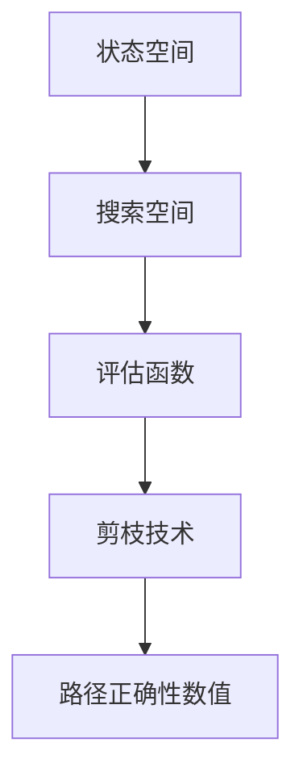

                 

### 树搜索算法在推理路径正确性数值计算中的重要作用

在计算机科学和人工智能领域，树搜索算法是一种广泛应用的搜索技术，尤其在推理路径的正确性数值计算中扮演着至关重要的角色。树搜索算法通过对状态空间或问题空间进行遍历和探索，以找到一条或多条从初始状态到达目标状态的路径。其核心在于利用评估函数来衡量路径的质量，并通过剪枝策略减少不必要的搜索，从而提高搜索效率。

#### 背景介绍

随着软件系统的复杂性和规模不断扩大，传统的手工验证方法已经难以应对。自动化的验证工具，尤其是基于树搜索的算法，成为了确保软件可靠性和安全性的重要手段。在推理路径的正确性数值计算中，树搜索算法不仅可以用于路径的正确性验证，还可以用于路径优化和系统安全性分析。

#### 核心概念与联系

为了更好地理解树搜索算法在推理路径正确性数值计算中的应用，我们需要先明确以下几个核心概念及其相互关系：

1. **状态空间**：在树搜索中，状态空间是指所有可能的状态集合。每个状态都代表问题在某个特定时间点的情况。

2. **搜索空间**：搜索空间是状态空间的一个子集，通常包含从初始状态到目标状态的路径。

3. **评估函数**：评估函数用于衡量路径的质量，是树搜索算法的核心。评估函数的输出通常是一个数值，反映了路径的优先级。

4. **剪枝技术**：剪枝技术是一种在搜索过程中减少搜索路径的技术，通过提前终止某些路径的搜索，从而节省计算资源。

5. **路径正确性数值**：路径正确性数值是评估函数对路径质量的量化指标，用于衡量路径是否满足特定的正确性标准。

以下是这些概念之间的关系架构 Mermaid 流程图示例：



#### 核心算法原理讲解

树搜索算法的核心原理在于从初始状态开始，逐步扩展状态，直到找到目标状态或判断无解。具体来说，树搜索算法可以分为以下几个步骤：

1. **初始化**：定义初始状态和评估函数。

2. **选择扩展节点**：根据评估函数选择优先级最高的状态进行扩展。

3. **状态扩展**：生成新的子状态，并更新搜索空间。

4. **剪枝**：根据评估函数和剪枝策略，提前终止某些子状态的搜索。

5. **重复步骤 2-4**，直到找到目标状态或搜索空间为空。

以下是树搜索算法的一个简化 Python 示例：

```python
def tree_search(initial_state, goal_state, heuristic):
    frontier = PriorityQueue()
    frontier.put((heuristic(initial_state), initial_state))
    explored = set()

    while not frontier.is_empty():
        _, current_state = frontier.get()
        
        if current_state == goal_state:
            return reconstruct_path(current_state)
        
        explored.add(current_state)
        
        for next_state in expand(current_state):
            if next_state not in explored:
                frontier.put((heuristic(next_state), next_state))

    return None

def expand(state):
    # 生成子状态的代码
    pass

def heuristic(state):
    # 评估函数的实现
    pass
```

在上述示例中，`tree_search` 函数是树搜索算法的核心，它使用优先队列（`PriorityQueue`）来管理搜索过程。`expand` 函数用于生成状态的所有可能子状态，而 `heuristic` 函数则是评估函数的实现，用于衡量状态的质量。

#### 数学模型和公式讲解

在树搜索算法中，评估函数是关键。一个有效的评估函数应该能够准确地预测从当前状态到目标状态的成本或距离。以下是一个简化的评估函数数学模型：

$$
f(n) = g(n) + h(n)
$$

其中：
- $f(n)$ 表示从初始状态到状态 $n$ 的总成本。
- $g(n)$ 表示从初始状态到状态 $n$ 的实际成本。
- $h(n)$ 表示从状态 $n$ 到目标状态的估计成本。

1. **$g(n)$**：实际成本通常可以通过路径长度来计算。
2. **$h(n)$**：估计成本可以通过启发式函数（heuristic function）来计算。启发式函数的选择直接影响搜索算法的性能。

以下是一个简单的启发式函数实现示例：

```python
def heuristic(state):
    # 假设状态用坐标表示，目标状态为 (0, 0)
    dx = abs(state[0] - 0)
    dy = abs(state[1] - 0)
    return dx + dy
```

通过上述公式和示例，我们可以看到评估函数在树搜索算法中的重要性。一个设计良好的评估函数能够有效地指导搜索过程，提高搜索效率。

#### 通俗易懂的举例说明

为了更好地理解树搜索算法，我们可以通过一个简单的例子来说明其工作原理。假设我们有一个迷宫问题，目标是从初始位置（左下角）到达目标位置（右上角），同时避免障碍物。

1. **初始化**：定义初始状态和评估函数。初始状态为迷宫的左下角，评估函数可以根据路径长度来计算。

2. **选择扩展节点**：根据评估函数选择优先级最高的状态进行扩展。例如，当前优先级最高的状态是当前行和列都为 0 的位置。

3. **状态扩展**：生成新的子状态。假设当前状态为 (0, 0)，我们可以扩展到 (0, 1)、(1, 0) 和 (1, 1)。

4. **剪枝**：根据评估函数和剪枝策略，提前终止某些子状态的搜索。例如，如果某个子状态包含了障碍物，我们可以直接将其排除。

5. **重复步骤 2-4**，直到找到目标状态或搜索空间为空。在这个例子中，我们可以通过逐步扩展状态，并使用评估函数指导搜索，最终找到从初始位置到目标位置的路径。

通过这个例子，我们可以看到树搜索算法是如何一步步找到从初始状态到目标状态的路径，并通过评估函数和剪枝技术来提高搜索效率。

#### 项目实战

为了更好地展示树搜索算法在推理路径正确性数值计算中的应用，我们将在本节中搭建一个开发环境，并使用 Python 实现一个简单的路径搜索程序。以下是一个简单的项目实战流程：

1. **开发环境搭建**：安装 Python 和相关依赖库（如 heapq、numpy）。

2. **核心代码实现**：实现树搜索算法的核心函数，包括初始化、状态扩展、评估函数和剪枝策略。

3. **代码解读**：详细解读核心代码，解释各个函数的实现细节和逻辑。

4. **代码应用**：运行代码，测试路径搜索功能，并对结果进行分析和评估。

5. **实际案例分析**：通过实际案例，展示树搜索算法在推理路径正确性数值计算中的应用。

6. **项目小结**：总结项目实现过程，讨论项目中的问题和挑战，并提出解决方案。

通过这个项目实战，我们将能够更好地理解树搜索算法在推理路径正确性数值计算中的实际应用，并为后续的学习和应用提供实践经验。

#### 最佳实践 tips

1. **选择合适的评估函数**：评估函数的设计直接影响搜索效率。选择合适的评估函数，可以显著提高搜索性能。

2. **合理应用剪枝技术**：剪枝技术可以有效减少搜索空间，提高搜索效率。合理应用剪枝策略，可以避免不必要的计算。

3. **优化数据结构**：选择合适的数据结构（如优先队列、哈希表）可以提高算法的性能。

4. **性能调优**：在实际应用中，需要对算法进行性能调优，以适应不同场景的需求。

5. **理论与实践相结合**：通过实际项目实战，将理论知识应用到实际场景中，可以更好地理解和掌握树搜索算法。

#### 小结

本文详细介绍了树搜索算法在推理路径正确性数值计算中的应用，从核心概念、算法原理到数学模型和项目实战，逐步解析了树搜索算法的工作原理和实际应用。通过本文，读者可以系统地了解树搜索算法在计算机科学和人工智能领域的重要作用，并掌握其基本原理和实现方法。

#### 注意事项

1. **评估函数的设计**：评估函数的设计直接影响搜索效率，需要根据实际问题进行合理设计。

2. **剪枝技术的应用**：剪枝技术可以显著减少搜索空间，但需要根据实际场景进行合理应用。

3. **数据结构的优化**：选择合适的数据结构可以提高算法性能，如使用优先队列和哈希表等。

4. **性能调优**：在实际应用中，需要对算法进行性能调优，以满足不同场景的需求。

#### 拓展阅读

- 《人工智能：一种现代方法》（第3版）—— Stuart J. Russell & Peter Norvig
- 《深度学习》（第2版）—— Ian Goodfellow、Yoshua Bengio & Aaron Courville
- 《算法导论》（第3版）—— Thomas H. Cormen、Charles E. Leiserson、Ronald L. Rivest & Clifford Stein
- 《Python编程：从入门到实践》（第2版）—— Eric Matthes

通过阅读这些经典教材，读者可以进一步深入学习和掌握相关领域的知识和技能。此外，还可以关注顶级会议和期刊，如国际计算机科学会议（ICCS）、国际人工智能与统计学会议（AISTATS）以及《自然》（Nature）等，以获取最新的研究成果和前沿动态。

---

作者：AI天才研究院/AI Genius Institute & 禅与计算机程序设计艺术 /Zen And The Art of Computer Programming

文章标题：使用树搜索自动收集推理路径正确性数值

关键词：树搜索算法、推理路径、正确性数值、评估函数、剪枝技术、迷宫问题、开发环境、Python实现、项目实战、性能调优、拓展阅读

文章摘要：本文系统地介绍了树搜索算法在推理路径正确性数值计算中的应用，从核心概念、算法原理到数学模型和项目实战，详细解析了树搜索算法的工作原理和实际应用。通过通俗易懂的示例和实战项目，读者可以深入理解树搜索算法，并在实际场景中运用其解决路径搜索问题。本文还提出了最佳实践 tips，并推荐了相关拓展阅读资源，以帮助读者进一步学习和掌握相关知识。

