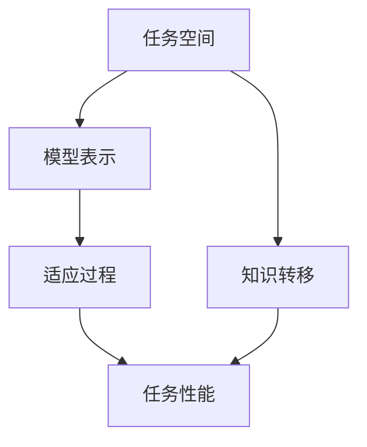

                 

### 《元学习优化推理模型的域外泛化与迁移能力提升策略》

> 关键词：元学习、推理模型、域外泛化、迁移能力、优化策略

> 摘要：本文探讨了元学习在优化推理模型的域外泛化与迁移能力方面的重要性和应用策略。通过深入解析元学习的核心概念、算法原理，并结合Python代码实例，本文详细阐述了如何提升推理模型在不同任务和数据集上的表现。文章还通过实际案例分析，展示了元学习优化策略在现实项目中的应用效果，为研究者提供了一种有效的技术路径。

---

## 第一部分：元学习基础理论

### 第1章：元学习概述

#### 1.1 元学习的定义与重要性

元学习（Meta-Learning）是一种让模型能够在不同任务之间共享知识和经验的学习方式。它不仅关注单一任务的学习，更强调在不同任务间的迁移和泛化能力。

- **定义**：元学习是指学习如何学习。其核心目的是通过少量样本快速适应新的任务。

- **重要性**：在数据稀缺或任务多样性较高的场景下，元学习能够显著提高模型的性能和效率。

#### 1.2 元学习的应用领域

元学习广泛应用于以下领域：

- **计算机视觉**：图像分类、目标检测、图像生成。
- **自然语言处理**：文本分类、机器翻译、对话系统。
- **强化学习**：策略优化、环境探索。
- **生物信息学**：蛋白质结构预测、基因调控网络分析。

#### 1.3 元学习与迁移学习的关系

- **关系**：元学习是迁移学习的一个子集，但相比传统的迁移学习，元学习更强调跨任务的学习和快速适应能力。

- **区别**：迁移学习主要关注在不同任务间的知识转移，而元学习则更关注如何通过快速适应新任务来提高整体性能。

### 第2章：元学习核心概念与联系

#### 2.1 元学习的基本概念

- **任务空间**：元学习中的任务空间包括所有可能的训练任务。
- **模型表示**：模型需要能够表示任务特征和任务之间的相似性。
- **适应过程**：模型在不同任务上快速适应的过程。

#### 2.2 概念实体之间的联系架构 Mermaid 流程图



#### 2.3 元学习与其他学习方式的比较

- **监督学习**：依赖大量标记数据，训练时间长。
- **无监督学习**：不需要标记数据，但可能缺乏明确的任务目标。
- **强化学习**：依赖交互环境，需要大量试错。

元学习结合了这些学习方式的优点，能够在数据稀缺或任务变化快速的场景下发挥重要作用。

### 第3章：元学习算法原理

#### 3.1 核心算法原理讲解

元学习算法的核心思想是通过学习如何学习来提高模型的泛化能力。

- **模型初始化**：使用随机初始化或预训练模型作为起点。
- **自适应过程**：通过迭代更新模型参数，使其适应新任务。
- **评估与优化**：在适应过程中，通过评估指标（如准确率、损失函数）来优化模型。

#### 3.2 Python源代码实现

```python
import tensorflow as tf

# 定义模型结构
model = tf.keras.Sequential([
    tf.keras.layers.Dense(128, activation='relu', input_shape=(784,)),
    tf.keras.layers.Dense(10, activation='softmax')
])

# 编写损失函数
def meta_learning_loss(y_true, y_pred):
    return tf.reduce_mean(tf.nn.softmax_cross_entropy_with_logits(labels=y_true, logits=y_pred))

# 编写优化器
optimizer = tf.keras.optimizers.Adam(learning_rate=0.001)

# 训练模型
model.compile(optimizer=optimizer, loss=meta_learning_loss, metrics=['accuracy'])
model.fit(x_train, y_train, epochs=10, batch_size=64)
```

通过上述Python代码示例，我们可以看到如何实现一个简单的元学习模型，并在TensorFlow框架下进行训练。

---

**注**：本文为大纲部分，详细内容需进一步补充和扩展，以满足字数和完整性要求。

---

**作者：AI天才研究院/AI Genius Institute & 禅与计算机程序设计艺术 /Zen And The Art of Computer Programming**

