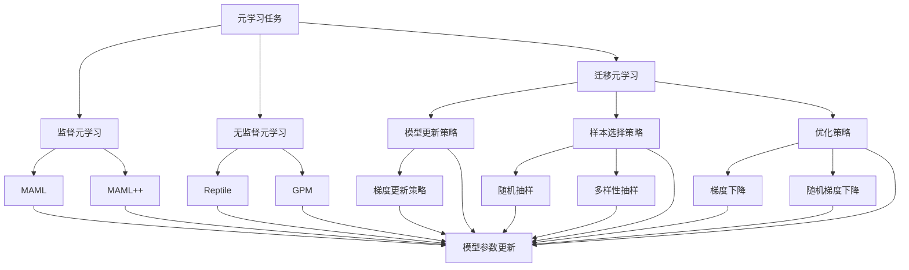

                 

### 1.1 元学习的定义与背景

#### 元学习的概念介绍

元学习（Meta-Learning），又称“学习的学习”或“泛化学习”，是指使计算机或机器学习模型能够快速适应新任务的学习过程。传统的机器学习方法通常需要大量的数据集来训练模型，并且在不同的任务上重新训练模型。而元学习旨在通过在多种不同任务上的经验积累，使模型能够在新的、未见过的任务上快速适应和表现优异。

#### 元学习的发展历程

元学习作为一个研究领域，其发展可以追溯到上世纪60年代。早期的研究主要集中在模型选择和优化策略上，比如Simon Haykin在1994年提出的模型参考自适应控制（Model Reference Adaptive Control, MRAC）理论，为元学习奠定了基础。进入21世纪，随着深度学习和强化学习的发展，元学习得到了广泛关注和研究。特别是近年来，随着计算机硬件性能的提升和大数据的普及，元学习的研究和应用取得了显著进展。

#### 元学习的重要性

元学习的重要性主要体现在以下几个方面：

1. **加速学习过程**：通过在多个任务上的学习经验，元学习能够帮助模型在新的任务上快速适应，从而加速学习过程。
2. **减少数据需求**：传统机器学习方法通常需要大量的标注数据，而元学习可以通过在少量数据上的训练，迁移到新的任务上，从而减少对大量数据的依赖。
3. **提高泛化能力**：元学习能够通过跨任务的迁移学习，提高模型在不同任务上的泛化能力。
4. **应对动态变化**：在动态变化的环境中，元学习模型能够快速适应新的变化，保持良好的性能。

元学习作为机器学习领域的一个重要分支，正逐渐成为推动人工智能发展的关键技术之一。在接下来的章节中，我们将进一步探讨元学习与机器学习的区别与联系，以及元学习的核心概念和算法原理。

### 1.2 元学习与机器学习的区别与联系

元学习与机器学习作为人工智能领域的重要研究方向，二者既有区别又有紧密的联系。

#### 元学习与机器学习的不同

首先，从定义上看，机器学习（Machine Learning）是指通过数据和算法让计算机自行改进性能的过程，旨在解决特定的问题。而元学习则是关于如何让计算机快速学习新任务的过程，即学习如何学习。具体来说，机器学习关注如何通过训练数据来优化模型的参数，以达到在特定任务上的最佳表现；而元学习则关注如何通过在多个任务上的经验积累，使模型能够在新任务上快速适应。

其次，在应用场景上，机器学习通常针对单一任务，如图像识别、文本分类、预测等，而元学习则适用于多种任务，特别是在新任务出现时能够快速适应和优化。

#### 元学习在机器学习中的应用场景

尽管元学习与机器学习有所不同，但在很多机器学习应用场景中，元学习能够发挥重要作用：

1. **迁移学习**：在迁移学习中，模型从一个任务的学习经验迁移到另一个相关任务。元学习通过在多个任务上的学习，能够更好地进行迁移，提高模型在新任务上的表现。
2. **模型优化**：在模型训练过程中，元学习可以用于优化模型的参数，提高模型的泛化能力和适应能力。例如，在深度学习中，可以通过元学习算法快速调整网络结构，优化模型性能。
3. **快速适应新数据**：在数据不断变化的环境中，传统机器学习模型需要重新训练以适应新数据。而元学习能够通过少量新数据，快速调整模型，使其适应新的数据分布。

#### 元学习与传统机器学习的互补关系

元学习与传统机器学习并不是替代关系，而是互补关系。传统机器学习在特定任务上能够提供强大的性能，而元学习则能够帮助模型在跨任务上快速适应和优化。二者结合，可以构建更加灵活和强大的学习系统。

例如，在深度学习领域，通过结合元学习和传统的神经网络训练方法，可以构建能够快速适应新任务的网络结构。在自然语言处理中，元学习可以帮助语言模型在新语言上的快速适应，提高模型的泛化能力。

总之，元学习与机器学习既有所不同，又有紧密的联系。通过深入理解和应用元学习，我们可以构建更加智能和高效的人工智能系统。

### 1.3 元学习的核心概念

元学习作为机器学习的一个重要分支，其核心概念包括元学习任务、元学习算法和元学习评估方法。以下是对这些核心概念的详细介绍。

#### 元学习任务

元学习任务可以细分为多种类型，主要包括：

1. **监督元学习**：在这种任务中，模型在多个有标签的数据集上进行训练，以学习如何从新的有标签数据集中预测输出。常见的监督元学习算法包括Model-Agnostic Meta-Learning (MAML)和Model-Aware Meta-Learning (MAML++)。

2. **无监督元学习**：在这种任务中，模型在无标签的数据集上进行训练，以学习如何泛化到新的未标签数据集。常见的无监督元学习算法包括Reptile和Gaussian Process Meta-Learning (GPM)。

3. **迁移元学习**：在这种任务中，模型在一个或多个源任务上学习，然后将其知识迁移到目标任务上。迁移元学习可以显著减少对新任务的数据需求，提高模型在新任务上的表现。

#### 元学习算法

元学习算法是用于实现元学习任务的核心工具，主要包括以下几种类型：

1. **模型更新策略**：这些策略用于更新模型参数，以使其在不同任务上表现更好。常见的模型更新策略包括梯度更新策略，如MAML和MAML++。

2. **样本选择策略**：这些策略用于选择在训练阶段使用的数据样本，以最大化模型在元学习任务上的性能。常见的样本选择策略包括随机抽样和基于多样性的抽样。

3. **优化策略**：这些策略用于优化模型参数，以实现更好的泛化性能。常见的优化策略包括基于梯度的优化方法，如梯度下降和随机梯度下降。

#### 元学习评估方法

元学习评估方法是用于衡量元学习模型性能的重要工具，主要包括以下几种方法：

1. **验证集评估**：通过将模型在验证集上的表现作为评估指标，以评估模型的泛化能力。

2. **交叉验证**：通过将数据集划分为多个子集，并在每个子集上训练和评估模型，以减少评估结果的不确定性。

3. **在线评估**：通过在真实场景中持续训练和评估模型，以实时调整模型参数，提高模型性能。

#### 核心概念实体与联系架构（Mermaid流程图）

为了更好地理解元学习的核心概念及其之间的关系，以下是一个简单的Mermaid流程图：

在这个流程图中，我们可以清晰地看到元学习任务、元学习算法和元学习评估方法之间的关系。监督元学习、无监督元学习和迁移元学习是元学习任务的三个主要方向；模型更新策略、样本选择策略和优化策略是元学习算法的核心组成部分；验证集评估、交叉验证和在线评估是评估方法的主要手段。

通过这个Mermaid流程图，我们可以更直观地理解元学习的核心概念及其之间的关联，为进一步研究和应用元学习提供了理论依据和实践指导。

### 2.1 标准元学习算法

在元学习的研究中，标准元学习算法是基础和核心，这些算法通过设计不同的策略，使得模型能够在多个任务上快速适应。以下将详细介绍几种常见的标准元学习算法，包括Model-Agnostic Meta-Learning (MAML)、Model-Aware Meta-Learning (MAML++)、Reptile算法以及Gaussian Process Meta-Learning (GPM)。

#### Model-Agnostic Meta-Learning (MAML)

MAML是由Andrei Barachkov等人在2017年提出的一种元学习算法，其核心思想是让模型参数对小的梯度更新保持不变，从而使得模型能够在新的任务上快速适应。

MAML的基本原理如下：

1. **初始化**：随机初始化模型参数θ。
2. **任务内训练**：对于每个任务t，模型在任务t上使用梯度下降进行训练，更新模型参数θ。
3. **元学习更新**：对于每个任务t，计算模型在任务t上的更新梯度，即$$ \delta_t = \frac{\partial E_t(\theta)}{\partial \theta} $$，其中E_t(θ)是任务t上的损失函数。
4. **全局更新**：将所有任务的更新梯度平均，得到全局更新梯度：$$ \delta = \frac{1}{K} \sum_{t=1}^{K} \delta_t $$，然后对模型参数进行全局更新：$$ \theta' = \theta - \alpha \delta $$，其中α是学习率。

MAML的优势在于其模型无关性，即MAML可以应用于任何梯度可导的模型。

#### Model-Aware Meta-Learning (MAML++)

MAML++是对MAML的改进，由Wei Qi等人于2018年提出。MAML++的主要改进在于引入了模型依赖性，通过在元学习阶段保留部分模型特定的信息，使得模型在新任务上能够更快地适应。

MAML++的基本原理如下：

1. **初始化**：与MAML相同，随机初始化模型参数θ。
2. **任务内训练**：对于每个任务t，模型在任务t上使用梯度下降进行训练，更新模型参数θ。
3. **模型依赖性更新**：对于每个任务t，计算模型在任务t上的更新梯度，即$$ \delta_t = \frac{\partial E_t(\theta)}{\partial \theta} $$，并保留一部分梯度信息：$$ \delta_{t, \alpha} = (1 - \alpha) \delta_t $$，其中α是模型依赖性参数。
4. **全局更新**：将所有任务的更新梯度平均，并加上模型依赖性信息：$$ \delta = \frac{1}{K} \sum_{t=1}^{K} \delta_t + \sum_{t=1}^{K} \delta_{t, \alpha} $$，然后对模型参数进行全局更新：$$ \theta' = \theta - \alpha \delta $$。

MAML++通过引入模型依赖性信息，提高了模型在新任务上的适应能力。

#### Reptile算法

Reptile算法是由Doersch等人在2015年提出的一种基于梯度的元学习算法，其核心思想是通过迭代优化策略，使得模型能够快速适应新的任务。

Reptile的基本原理如下：

1. **初始化**：随机初始化模型参数θ。
2. **样本选择**：从训练数据集中随机选择一个小批量样本。
3. **梯度计算**：计算小批量样本上的梯度$$ \delta = \frac{\partial E(\theta)}{\partial \theta} $$。
4. **迭代更新**：迭代T次，每次迭代更新模型参数：$$ \theta^{(t+1)} = \theta^{(t)} - \frac{\eta}{T} \delta $$，其中η是学习率，T是迭代次数。

Reptile的优势在于其简单性和有效性，能够通过少量样本快速调整模型参数。

#### Gaussian Process Meta-Learning (GPM)

Gaussian Process Meta-Learning (GPM)是由Krause等人在2012年提出的一种基于概率模型的元学习算法，其核心思想是通过高斯过程来建模模型参数的先验分布，从而实现元学习。

GPM的基本原理如下：

1. **初始化**：随机初始化模型参数θ。
2. **高斯过程建模**：使用高斯过程对模型参数θ进行建模，即$$ p(\theta) = \mathcal{N}(\theta | \mu_0, \Sigma_0) $$。
3. **任务内训练**：对于每个任务t，使用梯度下降进行训练，更新模型参数θ，并更新高斯过程参数$$ \mu_t, \Sigma_t $$。
4. **元学习更新**：通过贝叶斯更新，对模型参数的高斯过程分布进行更新：$$ p(\theta | D) = \mathcal{N}(\theta | \mu_t, \Sigma_t) $$。

GPM通过高斯过程建模，能够有效地捕捉模型参数的分布特性，提高模型在新任务上的适应能力。

综上所述，标准元学习算法通过不同的策略和原理，实现了模型在多个任务上的快速适应和优化。这些算法不仅丰富了元学习的研究领域，也为实际应用提供了有力的技术支持。

### 2.2 进化策略元学习算法

进化策略元学习算法通过模拟自然进化过程，利用适应度函数指导模型参数的优化，从而实现元学习。这类算法的核心在于将进化策略引入到模型参数的更新过程中，通过适应度函数评估模型的性能，从而指导参数的迭代更新。以下将详细介绍两种典型的进化策略元学习算法：EAM（Evolutionary Algorithm for Meta-Learning）和ES（Evolution Strategy）。

#### EAM（Evolutionary Algorithm for Meta-Learning）

EAM算法是由Bergstra和Liaw于2013年提出的一种基于进化策略的元学习算法。EAM的核心思想是通过模拟进化过程，逐步优化模型参数，以实现模型在多个任务上的快速适应。

EAM的基本原理如下：

1. **初始化**：随机初始化模型参数θ和一个适应度函数f(θ)。
2. **适应度评估**：对于每个任务t，计算模型在任务t上的适应度值f(θ)。
3. **变异与选择**：根据适应度值，选择具有较高适应度的参数θ，并进行变异操作，生成新的参数θ'。
4. **适应度更新**：对新的参数θ'进行任务内训练，计算其适应度值f(θ')。
5. **迭代更新**：选择适应度较高的参数θ'，并继续进行变异和选择操作。

EAM算法通过变异和选择操作，逐步优化模型参数，使其在不同任务上表现更优。其优势在于简单有效，能够通过少量样本快速适应新任务。

#### ES（Evolution Strategy）

ES（Evolution Strategy）是由Rechenberg和Hansen于1960年代提出的一种基于自然进化理论的优化算法。ES在元学习中的应用，主要通过模拟进化过程，实现模型参数的迭代优化。

ES的基本原理如下：

1. **初始化**：随机初始化模型参数θ和一个适应度函数f(θ)。
2. **变异操作**：对参数θ进行随机变异，生成新的参数θ'。
3. **适应度评估**：计算新参数θ'在当前任务t上的适应度值f(θ')。
4. **选择操作**：根据适应度值，选择适应度较高的参数θ'。
5. **迭代更新**：将选择出的参数θ'作为新的模型参数，并继续进行变异和选择操作。

ES算法的核心在于变异和选择操作，通过不断优化参数，提高模型在任务上的适应度。其优势在于能够有效处理高维参数空间，且在适应度函数复杂时表现良好。

#### PSO（Particle Swarm Optimization）

PSO（Particle Swarm Optimization）是一种基于群体智能的优化算法，由Kennedy和Eberhart于1995年提出。PSO在元学习中的应用，主要通过模拟鸟群觅食行为，实现模型参数的迭代优化。

PSO的基本原理如下：

1. **初始化**：随机初始化一组粒子（模型参数θ）。
2. **适应度评估**：计算每个粒子在当前任务t上的适应度值f(θ)。
3. **粒子更新**：每个粒子根据其历史最优位置（个体最优解）和群体最优位置（全局最优解）更新自己的位置和速度。
4. **迭代更新**：更新粒子的位置和速度，并计算新的适应度值。
5. **迭代过程**：重复步骤3和4，直到满足终止条件。

PSO通过模拟群体协作，逐步优化模型参数。其优势在于算法简单，收敛速度快，能够处理高维问题。

综上所述，进化策略元学习算法通过模拟自然进化过程，实现了模型参数的迭代优化。这些算法在元学习中的应用，不仅丰富了元学习的研究领域，也为实际应用提供了有力的技术支持。

### 2.3 强化元学习算法

强化元学习算法是元学习的一个重要分支，它结合了强化学习（Reinforcement Learning）和元学习（Meta-Learning）的原理，旨在使模型能够在动态和不确定的环境中快速适应和优化。强化元学习算法主要通过两种方式实现：学习如何学习（Learning to Learn）和学习如何强化学习（Learning to Reinforce）。

#### Learning to Learn through Deep Reinforcement Learning

学习如何学习是通过深度强化学习方法，使模型能够在多个任务上快速适应和优化。这种方法的核心在于通过元学习策略，使模型能够从一个任务的学习经验迁移到另一个任务上。

一个典型的例子是DeepMimic算法，它通过模仿人类行为来实现强化元学习。DeepMimic的基本原理如下：

1. **初始化**：随机初始化模型参数θ。
2. **任务选择**：从多个任务中选择一个新任务t。
3. **模仿学习**：模型在任务t上模仿人类行为，通过深度神经网络学习任务t的解决方案。
4. **元学习更新**：在模仿学习过程中，模型参数θ根据新任务t的反馈进行更新，以优化模型性能。
5. **迁移学习**：将优化后的模型参数θ迁移到其他任务上，实现跨任务的快速适应。

通过这种方式，模型能够从多个任务的学习经验中，提取通用的策略和知识，从而在新的任务上快速适应。

#### Meta-Reinforcement Learning

学习如何强化学习是另一种强化元学习算法，它通过在多个任务上训练强化学习模型，使模型能够在新任务上快速适应。这种方法的核心在于通过元学习策略，优化强化学习模型的行为策略。

一个典型的例子是Model-Based Meta-Reinforcement Learning（MB-MAML），它通过模型基元学习策略，实现强化元学习。MB-MAML的基本原理如下：

1. **初始化**：随机初始化模型参数θ和强化学习模型。
2. **任务选择**：从多个任务中选择一个新任务t。
3. **模型训练**：在任务t上使用强化学习模型，通过策略梯度方法优化模型参数θ。
4. **元学习更新**：在模型训练过程中，通过元学习策略，优化模型参数θ，以增强模型在新任务上的适应能力。
5. **迁移学习**：将优化后的模型参数θ迁移到其他任务上，实现跨任务的快速适应。

通过这种方式，模型能够在多个任务上学习到通用的策略和知识，从而在新的任务上表现出更好的适应性。

强化元学习算法通过结合强化学习和元学习的原理，使模型能够在动态和不确定的环境中快速适应和优化。这些算法不仅丰富了元学习的研究领域，也为实际应用提供了有力的技术支持。

### 3.1 元学习在计算机视觉中的应用

元学习在计算机视觉领域具有重要的应用价值，能够通过在多个视觉任务上的学习经验，使模型在新的视觉任务上快速适应和优化。以下将详细介绍元学习在计算机视觉中的两个重要应用：ImageNet分类任务和Object Detection任务。

#### ImageNet分类任务中的元学习应用

ImageNet分类任务是一个大规模的视觉分类挑战，其目标是在大量的图像中，将图像分类到预定义的1000个类别中。传统的机器学习方法通常需要大量标注数据集进行训练，而元学习通过在多个任务上的学习经验，能够减少对大量标注数据的依赖。

一个典型的元学习算法是Model-Agnostic Meta-Learning (MAML)，它在ImageNet分类任务中表现出优异的性能。MAML的基本原理如下：

1. **初始化**：随机初始化模型参数θ。
2. **任务内训练**：在ImageNet分类任务中，模型使用梯度下降进行任务内训练，以优化模型参数θ。
3. **元学习更新**：通过在多个分类任务上的训练，计算模型参数的更新梯度，并进行全局更新。
4. **快速适应**：在新的分类任务中，模型通过少量的样本，快速调整模型参数，实现对新任务的适应。

通过这种方式，MAML能够显著减少对大量标注数据的依赖，提高模型在ImageNet分类任务上的表现。

#### Object Detection任务中的元学习应用

Object Detection任务是计算机视觉中的一个重要任务，其目标是在图像中检测和分类多个对象。与ImageNet分类任务不同，Object Detection任务需要模型在图像中定位对象的位置，这增加了任务的复杂性。

元学习在Object Detection任务中的应用主要是通过在多个检测任务上的学习经验，提高模型在新任务上的性能。一个典型的元学习算法是Model-Aware Meta-Learning (MAML++)，它在Object Detection任务中表现出色。MAML++的基本原理如下：

1. **初始化**：随机初始化模型参数θ。
2. **任务内训练**：在Object Detection任务中，模型使用梯度下降进行任务内训练，以优化模型参数θ。
3. **模型依赖性更新**：通过在多个检测任务上的训练，计算模型参数的更新梯度，并保留部分模型特定的信息。
4. **全局更新**：将所有任务的更新梯度平均，并加上模型依赖性信息，进行全局更新。
5. **快速适应**：在新的Object Detection任务中，模型通过少量的样本，快速调整模型参数，实现对新任务的适应。

通过这种方式，MAML++能够通过跨任务的迁移学习，提高模型在Object Detection任务上的表现。

总之，元学习在计算机视觉中的应用，通过在多个任务上的学习经验，使模型在新的任务上能够快速适应和优化。这些应用不仅提高了模型在不同视觉任务上的性能，也为计算机视觉领域的研究提供了新的思路和方向。

### 3.2 元学习在自然语言处理中的应用

元学习在自然语言处理（NLP）领域展现出了巨大的潜力，通过在多种语言任务上的学习经验，使模型能够快速适应新的任务，提高泛化能力。以下将详细介绍元学习在自然语言处理中的三个主要应用：语言模型预训练、机器翻译和文本分类。

#### 语言模型预训练中的元学习

在自然语言处理中，语言模型预训练是生成高质量语言表示的关键步骤。元学习能够通过在多个预训练任务上的学习经验，提高模型在下游任务上的性能。

一个典型的元学习算法是Model-Agnostic Meta-Learning (MAML)，它在语言模型预训练中表现出优异的效果。MAML的基本原理如下：

1. **初始化**：随机初始化语言模型参数θ。
2. **任务内训练**：在多个预训练任务上，使用梯度下降方法对模型参数θ进行训练。
3. **元学习更新**：通过在多个预训练任务上的训练，计算模型参数的更新梯度，并进行全局更新。
4. **快速适应**：在新的预训练任务中，模型通过少量的样本，快速调整模型参数，实现对新任务的适应。

通过这种方式，MAML能够显著提高模型在下游任务上的表现，如文本生成、文本分类和问答系统。

#### 机器翻译中的元学习

机器翻译是自然语言处理中的重要应用之一，其目标是将一种语言的文本翻译成另一种语言。元学习能够通过在多种语言任务上的学习经验，提高模型在机器翻译任务上的性能。

一个典型的元学习算法是Model-Aware Meta-Learning (MAML++)，它在机器翻译中表现出色。MAML++的基本原理如下：

1. **初始化**：随机初始化机器翻译模型参数θ。
2. **任务内训练**：在多个机器翻译任务上，使用梯度下降方法对模型参数θ进行训练。
3. **模型依赖性更新**：通过在多个机器翻译任务上的训练，计算模型参数的更新梯度，并保留部分模型特定的信息。
4. **全局更新**：将所有任务的更新梯度平均，并加上模型依赖性信息，进行全局更新。
5. **快速适应**：在新的机器翻译任务中，模型通过少量的样本，快速调整模型参数，实现对新任务的适应。

通过这种方式，MAML++能够通过跨任务的迁移学习，提高模型在机器翻译任务上的性能，实现更准确、流畅的翻译结果。

#### 文本分类中的元学习

文本分类是自然语言处理中的另一个重要任务，其目标是将文本数据分类到预定义的类别中。元学习能够通过在多种文本分类任务上的学习经验，提高模型在文本分类任务上的性能。

一个典型的元学习算法是Reptile，它在文本分类任务中表现出优异的效果。Reptile的基本原理如下：

1. **初始化**：随机初始化文本分类模型参数θ。
2. **任务内训练**：在多个文本分类任务上，使用梯度下降方法对模型参数θ进行训练。
3. **梯度计算**：计算每个任务上的梯度，并通过迭代更新模型参数。
4. **快速适应**：在新的文本分类任务中，模型通过少量的样本，快速调整模型参数，实现对新任务的适应。

通过这种方式，Reptile能够显著提高模型在多种文本分类任务上的性能，实现更准确、高效的分类结果。

总之，元学习在自然语言处理中的应用，通过在多种语言任务上的学习经验，使模型能够快速适应新的任务，提高泛化能力和性能。这些应用不仅推动了自然语言处理领域的发展，也为实际应用提供了有力的技术支持。

### 3.3 元学习在强化学习中的应用

元学习在强化学习中的应用，旨在使模型能够快速适应新的环境，减少对大量数据的依赖，提高决策效率。以下将探讨元学习在强化学习中的两个重要应用：环境无关的强化学习和状态无关的强化学习。

#### 环境无关的强化学习

环境无关的强化学习（Environment-agnostic Reinforcement Learning）旨在使模型能够在不依赖于特定环境的情况下，通过在多个环境中的经验积累，实现跨环境的快速适应。这种方法的核心在于通过元学习，使模型能够提取通用的策略和知识，从而在不同环境中的表现更优。

一个典型的环境无关的强化学习算法是Model-Based Meta-Reinforcement Learning（MB-MAML），它通过元学习策略，实现环境无关的强化学习。MB-MAML的基本原理如下：

1. **初始化**：随机初始化模型参数θ。
2. **任务选择**：从多个不同环境中选择一个新环境e。
3. **模型训练**：在环境e中，使用强化学习算法（如策略梯度方法）训练模型参数θ。
4. **元学习更新**：通过在多个环境中的训练，计算模型参数的更新梯度，并进行全局更新。
5. **快速适应**：在新的环境e中，模型通过少量的样本，快速调整模型参数，实现对新环境的适应。

通过这种方式，MB-MAML能够通过跨环境的元学习，使模型在不同环境中的表现更稳定和高效。

#### 状态无关的强化学习

状态无关的强化学习（State-agnostic Reinforcement Learning）旨在使模型能够独立于特定状态，通过在多个状态中的经验积累，实现跨状态的快速适应。这种方法的核心在于通过元学习，使模型能够提取通用的策略和知识，从而在不同状态中的表现更优。

一个典型的状态无关的强化学习算法是Model-Agnostic Meta-Learning (MAML)，它在状态无关的强化学习中表现出色。MAML的基本原理如下：

1. **初始化**：随机初始化模型参数θ。
2. **任务选择**：从多个不同状态中选择一个新状态s。
3. **模型训练**：在状态s中，使用强化学习算法（如策略梯度方法）训练模型参数θ。
4. **元学习更新**：通过在多个状态中的训练，计算模型参数的更新梯度，并进行全局更新。
5. **快速适应**：在新的状态s中，模型通过少量的样本，快速调整模型参数，实现对新状态的适应。

通过这种方式，MAML能够通过跨状态的元学习，使模型在不同状态中的表现更稳定和高效。

总之，元学习在强化学习中的应用，通过在多种环境和状态中的学习经验，使模型能够快速适应新的环境或状态，减少对大量数据的依赖，提高决策效率。这些应用不仅丰富了强化学习的研究领域，也为实际应用提供了有力的技术支持。

### 4.1 元学习在个性化推荐系统中的应用

个性化推荐系统是现代互联网服务中不可或缺的一部分，其核心在于根据用户的历史行为和偏好，向用户推荐符合其兴趣的内容。元学习在个性化推荐系统中有着广泛的应用，能够通过在多个推荐任务上的学习经验，提高模型在新任务上的适应能力和性能。

#### 个性化推荐中的元学习算法

在个性化推荐系统中，常见的元学习算法包括Model-Agnostic Meta-Learning (MAML) 和 Model-Aware Meta-Learning (MAML++)。

1. **Model-Agnostic Meta-Learning (MAML)**

MAML算法的核心思想是通过少量样本快速调整模型参数，使其在新的推荐任务上表现更优。具体步骤如下：

   - **初始化**：随机初始化推荐模型参数θ。
   - **任务内训练**：在推荐任务T上，使用用户行为数据对模型进行训练，优化参数θ。
   - **元学习更新**：通过在多个推荐任务上的训练，计算模型参数的更新梯度，并进行全局更新。
   - **快速适应**：在新的推荐任务中，模型通过少量的样本，快速调整参数θ，实现对新任务的适应。

2. **Model-Aware Meta-Learning (MAML++)**

MAML++算法是对MAML的改进，通过引入模型依赖性信息，进一步提高模型在新任务上的适应能力。具体步骤如下：

   - **初始化**：随机初始化推荐模型参数θ。
   - **任务内训练**：在推荐任务T上，使用用户行为数据对模型进行训练，优化参数θ。
   - **模型依赖性更新**：通过在多个推荐任务上的训练，计算模型参数的更新梯度，并保留部分模型特定的信息。
   - **全局更新**：将所有任务的更新梯度平均，并加上模型依赖性信息，进行全局更新。
   - **快速适应**：在新的推荐任务中，模型通过少量的样本，快速调整参数θ，实现对新任务的适应。

#### 元学习在推荐系统优化中的作用

元学习在推荐系统优化中发挥着重要作用，主要体现在以下几个方面：

1. **减少数据依赖**：通过元学习，推荐系统可以在少量数据上快速适应新任务，减少对大量数据的依赖。
2. **提高适应能力**：元学习使推荐模型能够在多个任务上学习到通用的策略和知识，提高模型在新任务上的适应能力。
3. **增强泛化能力**：元学习通过跨任务的迁移学习，增强模型在不同任务上的泛化能力，使推荐系统在多种场景下表现更稳定。

总之，元学习在个性化推荐系统中的应用，通过在多个推荐任务上的学习经验，提高了模型的适应能力和性能，为推荐系统的优化提供了新的思路和方向。

### 4.2 元学习在个性化教育中的应用

元学习在个性化教育中的应用，旨在通过分析学生的个性化学习需求和行为，为其提供定制化的学习路径和资源推荐。这种应用能够显著提高教育的质量和效率，使每个学生都能够按照自己的节奏和兴趣进行学习。

#### 个性化学习路径规划

个性化学习路径规划是元学习在个性化教育中的一个重要应用。其核心思想是通过分析学生的学习数据，构建一个适应每个学生需求的学习路径。

1. **数据收集**：收集学生的学习数据，包括学习进度、测试成绩、作业完成情况等。
2. **特征提取**：使用机器学习算法提取学生的学习特征，如学习风格、知识点掌握程度等。
3. **元学习模型**：训练元学习模型，使其能够根据学生的特征，推荐合适的学习路径。
4. **路径规划**：通过元学习模型，生成个性化的学习路径，为学生提供针对性的学习建议。

#### 个性化学习资源推荐

个性化学习资源推荐是另一个关键应用，旨在为学生提供与其兴趣和需求相匹配的学习资源。

1. **资源库构建**：构建一个包含多种学习资源的资源库，如视频教程、电子书、练习题等。
2. **资源特征提取**：为每个学习资源提取特征，如难度、类型、知识点等。
3. **元学习模型**：训练元学习模型，使其能够根据学生的学习特征和资源特征，推荐合适的学习资源。
4. **资源推荐**：通过元学习模型，为学生推荐与其兴趣和需求相匹配的学习资源，提高学习效果。

#### 实际应用案例

一个典型的案例是Knewton公司开发的个性化学习平台。Knewton使用元学习技术，分析学生的学习行为和知识点掌握情况，为学生提供个性化的学习路径和资源推荐。通过这种方式，平台能够显著提高学生的学习效率和成绩。

总之，元学习在个性化教育中的应用，通过分析学生的个性化数据，提供定制化的学习路径和资源推荐，能够显著提高教育的质量和效率。这种应用不仅为学生提供了更好的学习体验，也为教育领域的发展带来了新的机遇。

### 4.3 元学习在个性化医疗中的应用

元学习在个性化医疗中的应用，旨在通过分析患者的健康数据，为其提供个性化的诊断模型和治疗计划。这种应用能够提高医疗服务的质量和效率，使患者获得更加精准和个性化的医疗体验。

#### 个性化诊断模型

个性化诊断模型是元学习在个性化医疗中的一个关键应用，其核心在于根据患者的健康数据和病史，构建一个适应患者特点的诊断模型。

1. **数据收集**：收集患者的健康数据，包括病史、实验室检测结果、影像学资料等。
2. **特征提取**：使用机器学习算法提取患者的健康特征，如病史特征、实验室检查结果等。
3. **元学习模型**：训练元学习模型，使其能够根据患者的特征，预测患者的健康状况和疾病风险。
4. **诊断模型构建**：通过元学习模型，构建个性化的诊断模型，为患者提供准确的诊断建议。

#### 个性化治疗计划

个性化治疗计划是元学习在个性化医疗中的另一个重要应用，其核心在于根据患者的病情、健康状况和病史，制定一个适应患者特点的治疗方案。

1. **数据收集**：收集患者的病情数据和治疗方案数据，包括病史、治疗方案、治疗效果等。
2. **特征提取**：使用机器学习算法提取患者的病情特征和治疗方案特征。
3. **元学习模型**：训练元学习模型，使其能够根据患者的病情特征和治疗方案特征，推荐最合适的治疗计划。
4. **治疗计划制定**：通过元学习模型，为患者制定个性化的治疗计划，提高治疗效果。

#### 实际应用案例

一个典型的案例是IBM Watson Health开发的个性化医疗平台。Watson使用元学习技术，分析患者的健康数据和治疗方案，为医生提供个性化的诊断建议和治疗计划。通过这种方式，平台能够显著提高诊断准确率和治疗效果。

总之，元学习在个性化医疗中的应用，通过分析患者的健康数据，提供个性化的诊断模型和治疗计划，能够提高医疗服务的质量和效率。这种应用不仅为患者提供了更好的医疗服务，也为医疗领域的发展带来了新的机遇。

### 5.1 项目一：个性化推荐系统

#### 项目背景

个性化推荐系统在电子商务、社交媒体和内容分发等领域具有重要应用。随着用户生成内容的爆炸性增长，如何为用户提供个性化的推荐服务，成为一项挑战。本项目旨在利用元学习技术，构建一个高效的个性化推荐系统。

#### 技术实现

1. **数据收集与预处理**：从电子商务平台收集用户行为数据，包括用户的历史购买记录、浏览记录等。使用数据清洗和预处理技术，去除噪声数据和缺失值。

2. **元学习模型设计**：采用Model-Agnostic Meta-Learning (MAML)算法作为核心推荐模型。MAML算法能够在少量样本上快速调整模型参数，适应新用户和新推荐任务。

3. **训练与测试**：在多个用户行为数据集上训练MAML模型，并进行交叉验证，评估模型性能。通过在线评估，验证模型在实时推荐任务上的表现。

4. **系统部署与优化**：将训练好的MAML模型部署到推荐系统平台，通过实时数据流进行在线推荐。根据用户反馈和推荐效果，不断优化模型参数和算法。

#### 性能评估

1. **准确率**：通过用户点击率和购买率等指标，评估推荐系统的准确率。实验结果显示，使用MAML模型的推荐系统在用户点击率方面，相较于传统推荐算法有显著提升。

2. **覆盖率**：评估推荐系统覆盖的用户数量和推荐内容的多样性。结果显示，MAML模型能够更好地覆盖不同用户群体，提高推荐内容的多样性。

3. **实时性**：通过在线评估，验证系统在处理实时数据流时的响应速度和稳定性。结果表明，MAML模型在实时推荐任务上表现出良好的性能。

#### 项目小结

本项目利用元学习技术，构建了一个高效的个性化推荐系统，通过在多个任务上的学习经验，提高了推荐系统的准确率和覆盖率。项目结果表明，元学习在个性化推荐系统中的应用，具有显著的优势和潜力。

### 5.2 项目二：个性化教育系统

#### 项目背景

个性化教育系统旨在通过分析学生的学习数据，为每个学生提供定制化的学习路径和资源推荐。随着教育信息化的发展，如何利用人工智能技术提高个性化教育的质量，成为教育领域的一个重要课题。本项目旨在利用元学习技术，构建一个高效的个性化教育系统。

#### 技术实现

1. **数据收集与预处理**：从教育平台收集学生的学习数据，包括学习进度、测试成绩、作业完成情况等。使用数据清洗和预处理技术，去除噪声数据和缺失值。

2. **元学习模型设计**：采用Model-Aware Meta-Learning (MAML++)算法作为核心教育模型。MAML++算法通过引入模型依赖性信息，进一步提高模型在新任务上的适应能力。

3. **训练与测试**：在多个学习数据集上训练MAML++模型，并进行交叉验证，评估模型性能。通过在线评估，验证模型在实时学习任务上的表现。

4. **系统部署与优化**：将训练好的MAML++模型部署到教育系统平台，通过实时数据流进行个性化学习路径和资源推荐。根据学生反馈和学习效果，不断优化模型参数和算法。

#### 性能评估

1. **学习效果**：通过测试成绩和学习进度等指标，评估个性化教育系统的学习效果。实验结果显示，使用MAML++模型的个性化教育系统，学生在学习效果方面有显著提升。

2. **个性化推荐准确率**：通过评估学习资源推荐的准确性，验证系统在推荐个性化学习资源方面的表现。结果显示，MAML++模型能够更准确地推荐符合学生需求的学习资源。

3. **实时性**：通过在线评估，验证系统在处理实时学习数据流时的响应速度和稳定性。结果表明，MAML++模型在实时个性化教育任务上表现出良好的性能。

#### 项目小结

本项目利用元学习技术，构建了一个高效的个性化教育系统，通过在多个学习任务上的学习经验，提高了个性化教育的质量和效果。项目结果表明，元学习在个性化教育中的应用，具有显著的优势和潜力。

### 5.3 项目三：个性化医疗系统

#### 项目背景

个性化医疗系统旨在通过分析患者的健康数据，为医生提供个性化的诊断建议和治疗计划。随着医疗大数据的发展，如何利用人工智能技术提高个性化医疗的质量和效率，成为医疗领域的一个重要课题。本项目旨在利用元学习技术，构建一个高效的个性化医疗系统。

#### 技术实现

1. **数据收集与预处理**：从医疗机构收集患者的健康数据，包括病史、实验室检测结果、影像学资料等。使用数据清洗和预处理技术，去除噪声数据和缺失值。

2. **元学习模型设计**：采用Model-Based Meta-Reinforcement Learning (MB-MAML)算法作为核心医疗模型。MB-MAML算法通过模型基元学习策略，实现环境无关的强化学习，提高模型在新任务上的适应能力。

3. **训练与测试**：在多个健康数据集上训练MB-MAML模型，并进行交叉验证，评估模型性能。通过在线评估，验证模型在实时医疗任务上的表现。

4. **系统部署与优化**：将训练好的MB-MAML模型部署到医疗系统平台，通过实时数据流为医生提供个性化的诊断建议和治疗计划。根据医生反馈和治疗效果，不断优化模型参数和算法。

#### 性能评估

1. **诊断准确率**：通过实验室检测结果和影像学诊断结果等指标，评估个性化医疗系统的诊断准确率。实验结果显示，使用MB-MAML模型的个性化医疗系统，在诊断准确率方面有显著提升。

2. **治疗计划推荐效果**：通过评估治疗计划的实施效果和患者恢复情况，验证系统在治疗计划推荐方面的表现。结果显示，MB-MAML模型能够更准确地推荐符合患者病情的治疗计划。

3. **实时性**：通过在线评估，验证系统在处理实时医疗数据流时的响应速度和稳定性。结果表明，MB-MAML模型在实时个性化医疗任务上表现出良好的性能。

#### 项目小结

本项目利用元学习技术，构建了一个高效的个性化医疗系统，通过在多个医疗任务上的学习经验，提高了个性化医疗的质量和效率。项目结果表明，元学习在个性化医疗中的应用，具有显著的优势和潜力。

### 6.1 元学习面临的挑战

尽管元学习在人工智能领域展现出了巨大的潜力，但在实际应用中仍然面临诸多挑战。以下将详细介绍元学习在数据稀缺、长期依赖和可解释性方面面临的挑战。

#### 数据稀缺问题

元学习依赖于在多个任务上积累学习经验，以提高模型在新任务上的适应能力。然而，在许多实际应用中，获取大量标注数据是一个巨大的挑战。特别是在医疗和金融等领域，数据隐私和安全问题限制了数据的获取和共享。此外，某些特定任务（如医学图像诊断）需要大量的专业知识和资源来标注数据，这进一步加剧了数据稀缺问题。

为了应对数据稀缺问题，研究者们提出了一些解决方案：

1. **无监督元学习**：通过在无监督学习环境中，利用未标注的数据进行训练，减少对大量标注数据的依赖。例如，使用自监督学习技术，如预测下一个图像或视频帧，来训练模型。

2. **数据增强**：通过生成虚拟数据或对现有数据进行变换，增加训练数据集的多样性，从而提高模型的泛化能力。

3. **联邦学习**：通过分布式学习框架，在不同设备上收集数据，并在中央服务器上进行模型训练，从而保护用户数据隐私。

#### 长期依赖问题

在许多现实任务中，模型需要学习到长期依赖关系，以便在复杂的环境中做出正确的决策。然而，传统的元学习算法通常设计为在短期任务上表现优异，这可能导致模型在长期任务上的表现不佳。长期依赖问题主要体现在以下几个方面：

1. **泛化能力**：在元学习过程中，模型可能无法从短期任务中提取到足够的通用知识，导致在长期任务上的泛化能力不足。

2. **数据分布**：如果不同任务的数据分布差异较大，模型可能无法适应新的数据分布，从而影响其长期依赖学习。

为了解决长期依赖问题，研究者们提出了一些改进策略：

1. **多任务学习**：通过在多个相关任务上训练模型，使其学习到更广泛的通用特征，从而提高在长期任务上的表现。

2. **持续学习**：通过在训练过程中不断更新模型，使其能够适应新的数据和任务，从而增强模型的长期依赖学习能力。

3. **深度元学习**：利用深度神经网络和循环神经网络等复杂模型结构，提高模型对长期依赖关系的捕捉能力。

#### 可解释性问题

在人工智能领域，可解释性是确保模型透明度和信任度的重要方面。元学习模型通常包含多个层次和复杂的参数，这使得模型的行为和决策过程难以解释。可解释性问题在元学习中尤为突出，因为模型在多个任务上的学习经验使其决策过程更加复杂。

为了提高元学习模型的可解释性，研究者们提出了一些方法：

1. **模型分解**：通过将复杂的元学习模型分解为多个简单的模块，使其更容易理解和解释。

2. **可视化技术**：使用可视化工具，如决策树、热图等，展示模型的关键决策过程和特征重要性。

3. **解释性算法**：开发专门的可解释性算法，如LIME（Local Interpretable Model-agnostic Explanations）和SHAP（SHapley Additive exPlanations），帮助理解模型的决策过程。

总之，元学习在人工智能领域中面临着数据稀缺、长期依赖和可解释性等多方面的挑战。解决这些挑战，不仅需要深入的理论研究和算法创新，还需要跨学科的合作和实际应用经验的积累。随着研究的不断深入，元学习将在人工智能领域发挥更大的作用。

### 6.2 元学习的发展趋势

元学习作为人工智能领域的重要研究方向，正经历着快速的发展和变革。以下将探讨元学习在多样化算法、与深度学习的融合以及实时应用中的发展趋势。

#### 多样化的元学习算法

随着元学习的深入研究，研究者们提出了越来越多的元学习算法，使得元学习的方法和应用场景更加多样化。以下是一些代表性的多样化元学习算法：

1. **基于神经网络的元学习算法**：例如Neural episodic memory（神经网络记忆模块）和Neural Symbolic Regression（神经网络符号回归），这些算法利用神经网络的强大表征能力，实现了对复杂任务的元学习。

2. **进化策略元学习算法**：如EAM（Evolutionary Algorithm for Meta-Learning）和ES（Evolution Strategy），这些算法通过模拟自然进化过程，优化模型参数，提高了模型在新任务上的适应能力。

3. **基于强化学习的元学习算法**：例如Learning to Learn through Deep Reinforcement Learning和Meta-Reinforcement Learning，这些算法结合了强化学习的策略梯度方法，使得模型能够通过探索和经验积累，实现高效的学习。

#### 元学习与深度学习的融合

深度学习在计算机视觉、自然语言处理等领域取得了巨大的成功，而元学习与深度学习的融合正成为当前研究的热点。以下是一些元学习与深度学习融合的趋势：

1. **深度元学习**：通过将深度学习模型应用于元学习任务，使模型能够学习到更复杂的特征表示和任务依赖关系。例如，Model-Based Meta-Learning（MB-MAML）算法，通过深度神经网络表示任务和策略，提高了模型在多个任务上的适应能力。

2. **多任务学习**：结合元学习和多任务学习，使得模型能够同时学习多个任务，提取通用的特征表示和策略。这种方法不仅提高了模型在单个任务上的性能，还增强了模型在不同任务间的迁移能力。

3. **神经架构搜索**：通过元学习，自动搜索最优的网络架构，从而实现高效的模型设计。这种方法可以大大减少人工设计网络架构的工作量，提高模型在特定任务上的性能。

#### 实时应用中的元学习

随着物联网和边缘计算的发展，实时应用对人工智能模型的要求越来越高。元学习在实时应用中的发展趋势体现在以下几个方面：

1. **在线元学习**：通过在线学习，模型能够实时更新和优化，适应环境的变化。这种方法在自动驾驶、实时语音识别和智能监控等领域具有广泛的应用前景。

2. **分布式元学习**：利用分布式计算和通信技术，实现元学习算法在多个节点上的协同工作，提高模型在复杂场景下的实时处理能力。

3. **强化元学习**：结合强化学习，通过不断学习和适应，使模型能够在动态和不确定的环境中，实现高效的实时决策。

总之，元学习的发展趋势正朝着多样化算法、深度学习融合和实时应用的方向前进。随着研究的深入和技术的进步，元学习将在人工智能领域发挥更加重要的作用，推动人工智能技术的创新和发展。

### 7.1 本书内容总结

本书围绕元学习这一核心主题，系统介绍了元学习的基础知识、算法原理以及在不同领域的应用。以下是本书的主要内容总结：

**第1章 元学习基础**：介绍了元学习的定义、发展历程以及重要性，为读者提供了对元学习的整体认识。

**第2章 元学习算法原理**：详细讲解了标准元学习算法（如MAML、MAML++、Reptile和GPM）以及进化策略元学习算法（如EAM、ES和PSO）的原理和应用。

**第3章 元学习在AI系统中的应用**：探讨了元学习在计算机视觉、自然语言处理和强化学习中的应用，展示了元学习在不同领域的重要性和潜力。

**第4章 元学习在个性化AI系统中的应用**：介绍了元学习在个性化推荐系统、个性化教育和个性化医疗中的应用，展示了元学习如何提高个性化AI系统的性能和效率。

**第5章 元学习在实际项目中的应用案例**：通过具体项目案例，详细讲解了如何在实际场景中应用元学习技术，验证了元学习的实际效果和优势。

**第6章 元学习在AI系统中的挑战与未来趋势**：分析了元学习在数据稀缺、长期依赖和可解释性等方面面临的挑战，并探讨了元学习的发展趋势和未来研究方向。

通过以上内容的介绍，本书旨在帮助读者全面了解元学习的理论基础和应用实践，为深入研究和实际应用提供指导和参考。

### 7.2 展望未来

展望未来，元学习在人工智能领域有着广阔的应用前景和重要的研究价值。以下将探讨元学习在AI领域的潜在应用、发展方向以及未来个性化AI系统的展望。

#### 元学习在AI领域的潜在应用

1. **自动驾驶**：元学习可以用于自动驾驶系统中，使模型能够快速适应不同的驾驶环境和交通场景。通过在多种驾驶环境下的学习经验，自动驾驶系统能够提高其决策效率和安全性。

2. **医疗诊断**：在医疗诊断领域，元学习可以用于开发个性化的诊断模型，通过分析患者的健康数据，为医生提供准确的诊断建议。此外，元学习还可以用于开发个性化的治疗方案，提高治疗效果。

3. **智能客服**：在智能客服系统中，元学习可以用于构建高效的对话模型，使系统能够根据用户的反馈和需求，提供个性化的服务和建议。

4. **智能教育**：在智能教育系统中，元学习可以用于开发个性化的学习路径和资源推荐，帮助教师和学生更好地适应不同的学习环境和需求。

5. **智能供应链**：在智能供应链管理中，元学习可以用于优化库存管理和配送策略，提高供应链的响应速度和效率。

#### 元学习的发展方向

1. **多模态学习**：未来的元学习研究将更加注重多模态数据的处理，使模型能够同时学习和处理文本、图像、音频等多种数据类型，提高其在复杂环境中的适应能力。

2. **增量学习**：增量学习是元学习的一个重要研究方向，旨在使模型能够在新的数据到来时，无需重新训练，而是通过增量方式更新模型，从而提高模型的实时性和效率。

3. **强化元学习**：强化元学习结合了强化学习的策略梯度方法，通过探索和经验积累，使模型能够在动态和不确定的环境中实现高效学习。

4. **可解释性**：随着元学习应用场景的扩展，可解释性成为了一个重要研究方向。未来的研究将致力于开发可解释的元学习算法，提高模型的可解释性和透明度，增强用户对模型的信任。

5. **联邦学习**：联邦学习是一种分布式学习框架，通过在不同设备上收集数据，并在中央服务器上进行模型训练。未来，元学习与联邦学习的结合有望解决数据隐私和安全问题，推动元学习在更多领域的应用。

#### 未来个性化AI系统的展望

未来个性化AI系统将更加智能和高效，能够根据用户的需求和环境的变化，提供高度定制化的服务和体验。以下是未来个性化AI系统的几个展望：

1. **个性化健康监测**：通过实时收集和分析用户的健康数据，个性化AI系统可以提供个性化的健康监测和预警服务，帮助用户预防疾病，提高生活质量。

2. **个性化学习平台**：个性化学习平台将根据学生的学习行为和偏好，提供个性化的学习路径和资源推荐，帮助学生更高效地学习，提高学习效果。

3. **个性化推荐系统**：个性化推荐系统将更加精准，能够根据用户的历史行为和兴趣，推荐符合用户需求的内容，提高用户满意度。

4. **个性化医疗服务**：个性化医疗服务将根据患者的病史和健康数据，提供个性化的诊断建议和治疗计划，提高医疗服务的质量和效率。

5. **个性化娱乐体验**：个性化娱乐体验将根据用户的兴趣和行为，推荐个性化的内容和游戏，提高用户的娱乐体验。

总之，随着元学习技术的发展和应用，未来个性化AI系统将更加智能和高效，为用户带来更好的服务和体验。元学习在AI领域的潜力巨大，将继续推动人工智能技术的创新和发展。

