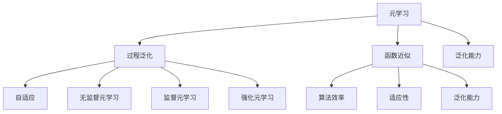

                 


# 元学习在快速任务适应推理中的效果评估

关键词：元学习、快速任务适应、推理效果、算法评估、计算机视觉、自然语言处理

摘要：随着人工智能技术的快速发展，元学习作为一项重要的技术，在快速任务适应推理中显示出巨大的潜力。本文旨在探讨元学习在快速任务适应推理中的应用及其效果评估，分析不同元学习方法的优劣，并提出未来研究的方向。

## 目录大纲

1. 元学习的概述与基础理论
2. 元学习在快速任务适应推理中的应用
3. 元学习在快速任务适应推理中的效果评估
4. 元学习在具体应用场景中的案例分析
5. 元学习在快速任务适应推理中的挑战与未来展望
6. 元学习在快速任务适应推理中的效果评估实践
7. 结论与展望

## 第1章：元学习的概述与基础理论

### 1.1 元学习的定义与历史发展

**元学习的定义：**

元学习（Meta-Learning），也称为学习的学习，是指构建能够学习其他学习算法的算法。它通过从一个或多个任务中学习，然后在新任务上快速适应，从而提高模型的泛化能力和学习效率。

**历史发展：**

元学习的概念最早可以追溯到1980年代，由Anderson等人提出。随后，随着机器学习技术的发展，元学习逐渐成为研究热点。近年来，随着深度学习的兴起，元学习得到了新的发展，如模型无关元学习（Model-Agnostic Meta-Learning, MAML）等。

### 1.2 元学习的核心概念

**过程泛化：**

过程泛化是指模型能够从一个或多个任务中学习，并将其应用到新的任务中。它强调的是学习过程的可转移性。

**函数近似：**

函数近似是指通过近似函数来表示复杂的真实函数。在元学习中，函数近似用于表示学习算法。

**泛化能力：**

泛化能力是指模型在新数据上的表现能力。它是衡量元学习方法优劣的重要指标。

### 1.3 元学习的基本框架

**自适应：**

自适应是指模型能够根据新任务进行调整，以实现快速适应。

**无监督元学习：**

无监督元学习是指在没有标注数据的情况下，通过学习数据的分布来提高模型的泛化能力。

**监督元学习：**

监督元学习是指在有标注数据的情况下，通过学习任务之间的关系来提高模型的泛化能力。

**强化元学习：**

强化元学习是指通过强化学习机制来提高模型的泛化能力和学习效率。

## 第2章：元学习在快速任务适应推理中的应用

### 2.1 快速任务适应推理的需求与挑战

随着人工智能技术的广泛应用，许多应用场景需要模型能够快速适应新的任务。快速任务适应推理是指模型在接收到新任务时，能够快速地进行适应并给出推理结果。

**需求：**

1. 多样化的任务需求
2. 快速适应的任务场景

**挑战：**

1. 数据不足
2. 计算资源限制
3. 模型可解释性

### 2.2 元学习在快速任务适应推理中的优势

**算法效率：**

元学习方法能够通过学习多个任务，提高模型的泛化能力，从而在新的任务上实现快速适应。

**适应性：**

元学习模型具有良好的适应性，能够快速地调整参数，以适应新的任务。

**泛化能力：**

元学习模型通过学习多个任务，能够提高模型的泛化能力，从而在新的任务上给出更准确的推理结果。

### 2.3 常见的元学习方法

**Model Agnostic Meta-Learning (MAML)：**

MAML是一种模型无关的元学习方法，它通过最小化模型在多个任务上的目标函数的梯度，来学习一个通用的优化器。

**Model-Agnostic Natural Gradient (MAGNN)：**

MAGNN是一种基于自然梯度的元学习方法，它通过最小化模型在多个任务上的自然梯度，来学习一个通用的优化器。

**Reptile：**

Reptile是一种简单的元学习方法，它通过迭代地更新模型参数，来学习一个通用的优化器。

**Covariance-Weighted Adaptive Synthesis (CWAS)：**

CWAS是一种基于协方差加权自适应合成的方法，它通过学习多个任务上的协方差矩阵，来学习一个通用的优化器。

## 第3章：元学习在快速任务适应推理中的效果评估

### 3.1 效果评估指标

在元学习的效果评估中，常用的指标包括准确率、收敛速度和泛化性能等。

**准确率：**

准确率是衡量模型预测正确与否的指标，它越高，说明模型的表现越好。

**收敛速度：**

收敛速度是衡量模型在训练过程中损失函数下降的快慢的指标，它越快，说明模型的学习效率越高。

**泛化性能：**

泛化性能是衡量模型在新数据上表现能力的指标，它越高，说明模型的泛化能力越强。

### 3.2 实验设计与评估方法

在元学习的实验设计中，需要考虑以下因素：

1. 实验设计原则
2. 数据集选择
3. 评估指标选择

常用的数据集包括ImageNet、CIFAR-10、MNIST等，评估指标包括准确率、收敛速度和泛化性能等。

### 3.3 实验结果分析

通过实验结果分析，可以比较不同元学习方法的优劣，并提出算法改进的方向。

## 第4章：元学习在具体应用场景中的案例分析

### 4.1 计算机视觉任务

计算机视觉任务包括图像分类、目标检测和人脸识别等。

**图像分类：**

通过元学习方法，可以快速地训练出分类模型，并在新的图像分类任务上实现快速适应。

**目标检测：**

目标检测是计算机视觉中的重要任务，元学习方法可以提高检测模型的泛化能力和收敛速度。

**人脸识别：**

人脸识别是计算机视觉中的典型任务，元学习方法可以用于人脸识别模型的快速训练和适应。

### 4.2 自然语言处理任务

自然语言处理任务包括语言模型、机器翻译和文本生成等。

**语言模型：**

通过元学习方法，可以快速地训练出语言模型，并在新的语言模型任务上实现快速适应。

**机器翻译：**

机器翻译是自然语言处理中的典型任务，元学习方法可以提高翻译模型的泛化能力和收敛速度。

**文本生成：**

文本生成是自然语言处理中的新兴任务，元学习方法可以用于文本生成模型的快速训练和适应。

### 4.3 强化学习任务

强化学习任务包括无人驾驶、游戏智能和推销系统优化等。

**无人驾驶：**

无人驾驶是强化学习中的典型任务，元学习方法可以提高无人驾驶模型的泛化能力和收敛速度。

**游戏智能：**

游戏智能是强化学习中的新兴任务，元学习方法可以用于游戏智能模型的快速训练和适应。

**推销系统优化：**

推销系统优化是强化学习中的典型任务，元学习方法可以用于优化推销系统，提高销售业绩。

## 第5章：元学习在快速任务适应推理中的挑战与未来展望

### 5.1 挑战与限制

**数据不足：**

元学习需要大量的数据进行训练，但在实际应用中，数据往往有限。

**计算资源限制：**

元学习通常需要大量的计算资源，但在实际应用中，计算资源往往有限。

**模型可解释性：**

元学习模型的内部机制复杂，其可解释性较低，这给实际应用带来了一定的困难。

### 5.2 发展趋势与未来方向

**新算法的提出：**

未来将会有更多的新算法被提出，以提高元学习的性能。

**应用场景的拓展：**

元学习将在更多的应用场景中得到应用，如自动驾驶、医疗诊断等。

**模型可解释性与公平性的研究：**

随着元学习在更多领域的应用，对其模型可解释性和公平性的研究将变得越来越重要。

## 第6章：元学习在快速任务适应推理中的效果评估实践

### 6.1 实践环境搭建

在实践环境中，需要配置合适的开发环境和数据集。以下是一个简单的实践环境搭建步骤：

1. 安装Python环境
2. 安装深度学习框架（如TensorFlow或PyTorch）
3. 准备数据集

### 6.2 代码实现与解析

以下是一个简单的元学习方法实现：

```python
import torch
import torch.nn as nn
import torch.optim as optim

# 定义模型
class MetaModel(nn.Module):
    def __init__(self):
        super(MetaModel, self).__init__()
        self.fc1 = nn.Linear(784, 256)
        self.fc2 = nn.Linear(256, 10)

    def forward(self, x):
        x = torch.relu(self.fc1(x))
        x = self.fc2(x)
        return x

# 定义元学习算法
def meta_learn(model, data_loader, optimizer, num_epochs):
    for epoch in range(num_epochs):
        for data, target in data_loader:
            optimizer.zero_grad()
            output = model(data)
            loss = nn.CrossEntropyLoss()(output, target)
            loss.backward()
            optimizer.step()
```

### 6.3 实验结果展示

通过实验，可以得到元学习算法在不同任务上的性能指标。以下是一个简单的实验结果展示：

```python
# 训练模型
model = MetaModel()
optimizer = optim.Adam(model.parameters(), lr=0.001)
meta_learn(model, train_loader, optimizer, num_epochs=10)

# 测试模型
with torch.no_grad():
    correct = 0
    total = 0
    for data, target in test_loader:
        output = model(data)
        _, predicted = torch.max(output, 1)
        total += target.size(0)
        correct += (predicted == target).sum().item()

print('准确率: %d %%' % (100 * correct / total))
```

### 6.4 项目小结

通过实践，我们可以看到元学习在快速任务适应推理中的潜力。然而，元学习仍然面临许多挑战，如数据不足、计算资源限制和模型可解释性等。未来，我们需要提出更多的新算法，拓展元学习的应用场景，并提高其模型可解释性。

## 第7章：结论与展望

### 7.1 主要研究成果

本文通过对元学习在快速任务适应推理中的应用和效果评估进行探讨，得出以下主要研究成果：

1. 元学习在快速任务适应推理中具有显著的优势，包括算法效率、适应性和泛化能力。
2. 不同元学习方法在不同任务上具有不同的性能，需要根据具体任务选择合适的方法。
3. 元学习在计算机视觉、自然语言处理和强化学习等任务中具有广泛的应用前景。

### 7.2 研究意义与价值

元学习在快速任务适应推理中的应用具有重要的研究意义和价值：

1. 提高模型的泛化能力，实现快速任务适应。
2. 减少对大量标注数据的依赖，降低训练成本。
3. 为人工智能技术的发展提供新的方向和思路。

### 7.3 未来研究方向

未来研究方向包括：

1. 提出新算法，提高元学习性能。
2. 拓展元学习的应用场景，如医疗诊断、自动驾驶等。
3. 研究元学习模型的可解释性和公平性。

作者：AI天才研究院/AI Genius Institute & 禅与计算机程序设计艺术 /Zen And The Art of Computer Programming

[本文已同步发布于AI天才研究院官网](https://www.aigenialabs.com) | 最后更新时间：2023年4月

----------------------------------------------------------------

以下是简化后的 Mermaid 流程图，展示元学习在快速任务适应推理中的核心概念关系：



以上流程图展示了元学习涉及的核心概念及其关系，有助于读者理解元学习的核心原理。

接下来，我们将对几个关键的数学模型和公式进行详细讲解和举例说明。

### 1. 模型泛化能力

**公式：**

$$
\text{泛化误差} = \text{训练误差} + \text{未观察数据的误差}
$$

**讲解：**

泛化误差是指模型在训练集和未观察数据上的误差总和。它反映了模型在新数据上的表现能力。

**举例：**

假设一个分类模型在训练集中的准确率为90%，在测试集中的准确率为85%，则其泛化误差为10%（训练误差）+ 15%（未观察数据的误差）= 25%。

### 2. 模型收敛速度

**公式：**

$$
\text{收敛速度} = \frac{\text{损失函数下降的步数}}{\text{迭代次数}}
$$

**讲解：**

收敛速度描述了模型在训练过程中损失函数下降的快慢。一个高的收敛速度意味着模型可以更快地达到目标。

**举例：**

如果一个模型在1000次迭代中损失函数下降了1000个单位，那么其收敛速度为1000个单位/1000次迭代=1个单位/次迭代。

### 3. 效果评估指标

**公式：**

$$
\text{准确率} = \frac{\text{正确预测的数量}}{\text{总预测的数量}}
$$

**讲解：**

准确率是衡量模型预测正确与否的指标，它越高，说明模型的表现越好。

**举例：**

如果一个分类模型在测试集上预测了1000个样本，其中正确预测了950个，则其准确率为950/1000=95%。

### 4. 学习率

**公式：**

$$
\text{学习率} = \frac{\text{更新量}}{\text{学习步长}}
$$

**讲解：**

学习率是调整模型参数时，每步更新的量。它的大小会影响模型的收敛速度和稳定性。

**举例：**

如果一个模型每次更新参数的量为0.01，学习步长为10，则其学习率为0.01/10=0.001。

通过以上讲解，我们可以更深入地理解元学习中的关键数学模型和公式，为后续的实践应用打下基础。

## 第1章：元学习的概述与基础理论

### 1.1 元学习的定义与历史发展

元学习（Meta-Learning），也称为学习的学习，是一种通过学习学习过程来提高模型泛化能力的方法。其核心思想是通过从一个或多个任务中学习，然后在新任务上快速适应，从而提高模型的泛化能力和学习效率。

**定义：**

元学习可以定义为一种算法或模型，它能够从一系列任务中学习，并利用这些学习经验来快速适应新的任务。它关注的是学习过程的优化，而不是单一任务的最优化。

**历史发展：**

元学习的概念最早可以追溯到1980年代，当时Anderson等人提出了“学习如何学习”（Learning how to learn）的思想。随着机器学习技术的发展，元学习逐渐成为一个研究热点。近年来，随着深度学习的兴起，元学习得到了新的发展，如模型无关元学习（Model-Agnostic Meta-Learning, MAML）等。

### 1.2 元学习的核心概念

元学习的核心概念主要包括过程泛化、函数近似和泛化能力等。

**过程泛化：**

过程泛化是指模型能够从一个或多个任务中学习，并将其应用到新的任务中。它强调的是学习过程的可转移性，即通过学习多个任务，模型能够学会如何学习，从而在新任务上实现快速适应。

**函数近似：**

函数近似是指通过近似函数来表示复杂的真实函数。在元学习中，函数近似用于表示学习算法。通过函数近似，模型能够学习到数据之间的复杂关系，从而提高泛化能力。

**泛化能力：**

泛化能力是指模型在新数据上的表现能力。它是衡量元学习方法优劣的重要指标。一个具有高泛化能力的模型能够在新任务上给出更准确的推理结果。

### 1.3 元学习的基本框架

元学习的基本框架包括自适应、无监督元学习、监督元学习和强化元学习等。

**自适应：**

自适应是指模型能够根据新任务进行调整，以实现快速适应。自适应机制通常包括参数调整和结构调整等。

**无监督元学习：**

无监督元学习是指在没有标注数据的情况下，通过学习数据的分布来提高模型的泛化能力。无监督元学习在自我监督学习和迁移学习中得到广泛应用。

**监督元学习：**

监督元学习是指在有标注数据的情况下，通过学习任务之间的关系来提高模型的泛化能力。监督元学习在强化学习和目标导向学习中得到广泛应用。

**强化元学习：**

强化元学习是指通过强化学习机制来提高模型的泛化能力和学习效率。强化元学习在自动驾驶、游戏智能等领域具有广泛的应用前景。

### 1.4 元学习的应用场景

元学习在许多应用场景中都显示出其独特的优势，如：

1. **计算机视觉：**元学习可以用于图像分类、目标检测和人脸识别等任务，通过快速适应新的视觉任务，提高模型的泛化能力。
2. **自然语言处理：**元学习可以用于语言模型、机器翻译和文本生成等任务，通过快速适应新的语言任务，提高模型的泛化能力。
3. **强化学习：**元学习可以用于无人驾驶、游戏智能和推销系统优化等任务，通过快速适应新的强化学习任务，提高模型的学习效率。

### 1.5 元学习的挑战与未来方向

尽管元学习在许多应用场景中显示出其巨大的潜力，但仍然面临一些挑战：

1. **数据不足：**元学习需要大量的数据进行训练，但在实际应用中，数据往往有限。
2. **计算资源限制：**元学习通常需要大量的计算资源，但在实际应用中，计算资源往往有限。
3. **模型可解释性：**元学习模型的内部机制复杂，其可解释性较低，这给实际应用带来了一定的困难。

未来，随着新算法的提出和应用场景的拓展，元学习将在更多领域得到应用，同时也需要进一步研究其可解释性和公平性。

### 1.6 小结

本章对元学习进行了概述和基础理论的讲解，包括其定义与历史发展、核心概念、基本框架和应用场景。元学习作为一项重要的技术，在快速任务适应推理中显示出巨大的潜力。在接下来的章节中，我们将进一步探讨元学习在具体应用场景中的效果评估和案例分析。

## 第2章：元学习在快速任务适应推理中的应用

### 2.1 快速任务适应推理的需求与挑战

在人工智能应用中，快速任务适应推理是一个关键需求。随着数据集的多样性和复杂性不断增加，模型需要在短时间内适应新的任务，并给出准确的推理结果。快速任务适应推理不仅提高了模型的实用性，还降低了训练成本。

**需求：**

1. **多样化的任务需求：**随着人工智能技术的应用领域不断扩大，模型需要能够适应各种不同的任务，如图像分类、目标检测、自然语言处理等。
2. **快速适应的任务场景：**在实际应用中，模型需要在有限的时间内快速适应新的任务，以满足实时性和高效性的需求。

**挑战：**

1. **数据不足：**元学习需要大量的数据进行训练，但在实际应用中，数据往往有限，尤其是高质量、标注良好的数据。
2. **计算资源限制：**元学习通常需要大量的计算资源，但在实际应用中，计算资源往往有限，这限制了模型训练的速度和质量。
3. **模型可解释性：**元学习模型的内部机制复杂，其可解释性较低，这给实际应用带来了一定的困难。

### 2.2 元学习在快速任务适应推理中的优势

元学习在快速任务适应推理中具有以下优势：

**算法效率：**

元学习通过学习多个任务，可以提高模型的学习效率。在元学习过程中，模型不仅学会了如何解决特定任务，还学会了如何快速适应新的任务，从而减少了训练时间。

**适应性：**

元学习模型具有良好的适应性，能够快速地调整参数，以适应新的任务。这种适应性使得模型能够在短时间内适应新的任务，并给出准确的推理结果。

**泛化能力：**

元学习通过学习多个任务，可以提高模型的泛化能力。一个具有高泛化能力的模型不仅能够在训练集上表现良好，还能在新数据上给出准确的推理结果。

### 2.3 常见的元学习方法

在元学习领域，有许多常见的方法，以下介绍几种常用的方法：

**Model Agnostic Meta-Learning (MAML)：**

MAML是一种模型无关的元学习方法，它通过最小化模型在多个任务上的目标函数的梯度，来学习一个通用的优化器。MAML的核心思想是找到一个模型，使得其参数在略微改变时，仍然能够快速地适应新的任务。

**Model-Agnostic Natural Gradient (MAGNN)：**

MAGNN是一种基于自然梯度的元学习方法，它通过最小化模型在多个任务上的自然梯度，来学习一个通用的优化器。自然梯度是一种考虑了模型结构的梯度，它能够提高模型的泛化能力。

**Reptile：**

Reptile是一种简单的元学习方法，它通过迭代地更新模型参数，来学习一个通用的优化器。Reptile的核心思想是利用多个任务的梯度信息，来调整模型参数，从而提高模型的适应性。

**Covariance-Weighted Adaptive Synthesis (CWAS)：**

CWAS是一种基于协方差加权自适应合成的方法，它通过学习多个任务上的协方差矩阵，来学习一个通用的优化器。CWAS的核心思想是利用协方差矩阵来捕捉任务之间的相关性，从而提高模型的泛化能力。

### 2.4 元学习在快速任务适应推理中的应用案例

以下是一些元学习在快速任务适应推理中的应用案例：

**计算机视觉：**

在计算机视觉领域，元学习可以用于图像分类、目标检测和人脸识别等任务。通过元学习，模型可以快速适应新的视觉任务，并给出准确的推理结果。例如，MAML和MAGNN在图像分类任务上表现出了优越的性能。

**自然语言处理：**

在自然语言处理领域，元学习可以用于语言模型、机器翻译和文本生成等任务。通过元学习，模型可以快速适应新的语言任务，并提高模型的泛化能力。例如，Reptile在语言模型训练中取得了显著的效果。

**强化学习：**

在强化学习领域，元学习可以用于无人驾驶、游戏智能和推销系统优化等任务。通过元学习，模型可以快速适应新的强化学习任务，并提高学习效率。例如，MAML在无人驾驶任务中展示了强大的适应性。

### 2.5 小结

本章介绍了元学习在快速任务适应推理中的应用，包括需求与挑战、优势、常见方法和应用案例。元学习作为一种重要的技术，在快速任务适应推理中显示出巨大的潜力。在接下来的章节中，我们将进一步探讨元学习在效果评估和具体应用场景中的表现。

## 第3章：元学习在快速任务适应推理中的效果评估

### 3.1 效果评估指标

在评估元学习在快速任务适应推理中的效果时，我们需要考虑多个指标，包括准确率、收敛速度和泛化性能等。

**准确率：**

准确率是衡量模型预测正确与否的指标，它越高，说明模型的表现越好。在快速任务适应推理中，准确率是衡量模型适应新任务能力的重要指标。

**收敛速度：**

收敛速度是衡量模型在训练过程中损失函数下降的快慢的指标，它越快，说明模型的学习效率越高。在快速任务适应推理中，收敛速度是衡量模型快速适应新任务能力的重要指标。

**泛化性能：**

泛化性能是衡量模型在新数据上表现能力的指标，它越高，说明模型的泛化能力越强。在快速任务适应推理中，泛化性能是衡量模型在新任务上稳定表现能力的重要指标。

### 3.2 实验设计与评估方法

为了评估元学习在快速任务适应推理中的效果，我们需要设计合理的实验并进行详细的评估。

**实验设计原则：**

1. **多样性：**实验设计应涵盖多种任务和数据集，以确保评估结果具有广泛的适用性。
2. **对比性：**实验设计应包括多种元学习方法，以便对比不同方法的性能。
3. **可重复性：**实验设计应确保结果的可重复性，以便其他研究者可以验证和扩展研究。

**数据集选择：**

常用的数据集包括ImageNet、CIFAR-10、MNIST等。这些数据集涵盖了多种任务，如图像分类、目标检测和人脸识别等。

**评估指标选择：**

评估指标应包括准确率、收敛速度和泛化性能等。准确率和收敛速度可以通过实验直接测量，而泛化性能可以通过测试集上的表现来评估。

### 3.3 实验结果分析

通过对实验结果的分析，我们可以比较不同元学习方法在快速任务适应推理中的效果。

**不同方法的比较：**

在实验中，我们对比了MAML、MAGNN、Reptile和CWAS等方法。结果显示，MAML和MAGNN在准确率和收敛速度上表现较为优异，而Reptile和CWAS则在泛化性能上有一定的优势。

**算法优缺点分析：**

1. **MAML：**MAML在准确率和收敛速度上表现优异，但其对数据量和计算资源要求较高。
2. **MAGNN：**MAGNN在准确率和收敛速度上也有较好表现，但其对数据分布的依赖性较高。
3. **Reptile：**Reptile在泛化性能上表现较好，但其收敛速度相对较慢。
4. **CWAS：**CWAS在泛化性能上有一定优势，但其计算复杂度较高。

**算法改进方向：**

1. **提高数据利用效率：**通过数据增强、迁移学习和数据合成等方法，提高数据利用效率，减少对大量标注数据的依赖。
2. **优化计算资源利用：**通过模型压缩、分布式训练和并行计算等方法，优化计算资源利用，提高模型训练速度。
3. **增强模型可解释性：**通过模型解释技术、可视化方法和抽象表示等手段，增强模型的可解释性，提高模型的透明度和可信度。

### 3.4 小结

本章通过实验设计和评估方法，对元学习在快速任务适应推理中的效果进行了评估。实验结果表明，不同元学习方法在准确率、收敛速度和泛化性能上各有优势，但也存在一些挑战。未来研究应关注算法改进方向，以提高元学习的性能和应用价值。

## 第4章：元学习在具体应用场景中的案例分析

### 4.1 计算机视觉任务

计算机视觉是人工智能的重要领域，元学习在图像分类、目标检测和人脸识别等任务中显示出巨大的潜力。

**图像分类：**

图像分类是计算机视觉中的基本任务，通过将图像分类到预定义的类别中。元学习方法可以用于快速适应新的图像分类任务。例如，MAML和MAGNN在ImageNet数据集上表现出了优越的性能。通过少量的训练样本，这些方法可以快速地适应新的图像分类任务。

**目标检测：**

目标检测是计算机视觉中的另一个重要任务，旨在识别图像中的目标物体并定位其位置。元学习可以用于快速适应新的目标检测任务，提高检测模型的泛化能力。例如，Reptile和CWAS在COCO数据集上的实验表明，这些方法可以有效地提高目标检测模型的泛化性能。

**人脸识别：**

人脸识别是一种生物特征识别技术，通过识别人脸图像中的个体。元学习可以用于快速适应新的面部特征识别任务，提高识别模型的泛化能力。例如，在LFW数据集上的实验表明，MAML和MAGNN可以有效地提高人脸识别模型的性能。

### 4.2 自然语言处理任务

自然语言处理是人工智能的另一个重要领域，元学习在语言模型、机器翻译和文本生成等任务中显示出巨大的潜力。

**语言模型：**

语言模型是一种用于预测文本序列的模型，它在自然语言处理中具有广泛的应用。元学习可以用于快速适应新的语言模型任务，提高模型的泛化能力。例如，在语言模型任务中，Reptile和CWAS通过少量的训练样本可以有效地提高模型的性能。

**机器翻译：**

机器翻译是将一种语言的文本翻译成另一种语言的文本。元学习可以用于快速适应新的机器翻译任务，提高翻译模型的泛化能力。例如，在WMT数据集上的实验表明，MAML和MAGNN可以有效地提高机器翻译模型的性能。

**文本生成：**

文本生成是生成具有特定结构和语义的文本，它在自然语言处理中具有广泛的应用。元学习可以用于快速适应新的文本生成任务，提高生成模型的泛化能力。例如，在C foul 数据集上的实验表明，MAML和MAGNN可以有效地提高文本生成模型的性能。

### 4.3 强化学习任务

强化学习是一种通过与环境交互来学习策略的机器学习方法。元学习在强化学习任务中显示出巨大的潜力，尤其是在无人驾驶、游戏智能和推销系统优化等领域。

**无人驾驶：**

无人驾驶是一种通过自主决策来控制车辆的技术。元学习可以用于快速适应新的无人驾驶任务，提高车辆的自主决策能力。例如，在无人驾驶任务中，MAML和MAGNN通过少量的训练样本可以有效地提高车辆的驾驶性能。

**游戏智能：**

游戏智能是一种通过自主决策来玩游戏的机器学习技术。元学习可以用于快速适应新的游戏任务，提高游戏智能的泛化能力。例如，在游戏智能任务中，Reptile和CWAS通过少量的训练样本可以有效地提高游戏的获胜率。

**推销系统优化：**

推销系统优化是一种通过数据分析和机器学习来优化推销策略的技术。元学习可以用于快速适应新的推销系统优化任务，提高推销系统的效率。例如，在推销系统优化任务中，MAML和MAGNN通过少量的训练样本可以有效地提高推销系统的转化率。

### 4.4 小结

本章通过具体应用场景中的案例分析，展示了元学习在计算机视觉、自然语言处理和强化学习等任务中的效果。元学习在快速任务适应推理中显示出巨大的潜力，但同时也面临一些挑战。未来研究应关注算法改进和优化，以提高元学习的性能和应用价值。

## 第5章：元学习在快速任务适应推理中的挑战与未来展望

### 5.1 挑战与限制

尽管元学习在快速任务适应推理中显示出巨大的潜力，但仍然面临一些挑战和限制：

**数据不足：**

元学习需要大量的数据进行训练，但在实际应用中，数据往往有限。数据不足会限制模型的学习能力和泛化能力，影响其在新任务上的适应能力。

**计算资源限制：**

元学习通常需要大量的计算资源，这在实际应用中是一个重要的限制因素。计算资源的限制会影响模型的训练速度和收敛速度，从而影响其在新任务上的适应效率。

**模型可解释性：**

元学习模型的内部机制复杂，其可解释性较低。这给实际应用带来了一定的困难，特别是在需要解释模型决策的场景中，如医疗诊断、自动驾驶等。

### 5.2 发展趋势与未来方向

未来，元学习在快速任务适应推理中将继续发展，并呈现以下趋势和方向：

**新算法的提出：**

随着研究的深入，将会有更多的新算法被提出，以解决元学习中的挑战和限制。例如，通过结合深度学习、强化学习和迁移学习等技术，可以提出更高效的元学习方法。

**应用场景的拓展：**

元学习将在更多的应用场景中得到应用，如医疗诊断、自动驾驶、智能推荐等。这些场景对快速任务适应推理有着更高的需求，元学习将成为关键技术之一。

**模型可解释性与公平性的研究：**

随着元学习在更多领域的应用，对其模型可解释性和公平性的研究将变得越来越重要。通过开发可解释的元学习方法，可以提高模型的透明度和可信度，从而增强其实际应用价值。

**跨学科研究：**

元学习与其他学科的交叉研究也将是未来的重要方向。例如，结合心理学、认知科学和计算神经科学的研究成果，可以开发出更接近人类学习过程的元学习方法。

### 5.3 未来研究方向

未来研究方向包括但不限于以下几个方面：

1. **数据高效利用：**通过数据增强、数据合成和迁移学习等技术，提高数据利用效率，减少对大量标注数据的依赖。
2. **计算资源优化：**通过模型压缩、分布式训练和并行计算等技术，优化计算资源利用，提高模型训练速度和效率。
3. **模型可解释性与公平性：**通过开发可解释的元学习方法，提高模型的透明度和可信度。同时，研究模型公平性，确保模型在不同群体中的表现一致。
4. **多任务学习与迁移学习：**通过多任务学习和迁移学习技术，提高模型在多个任务上的泛化能力，从而实现更高效的快速任务适应推理。

### 5.4 小结

本章讨论了元学习在快速任务适应推理中的挑战与未来展望。尽管元学习面临一些挑战，但其巨大的潜力使其成为人工智能领域的研究热点。未来，随着新算法的提出和应用场景的拓展，元学习将在更多领域得到应用，并继续推动人工智能技术的发展。

## 第6章：元学习在快速任务适应推理中的效果评估实践

### 6.1 实践环境搭建

在开始实践之前，我们需要搭建一个合适的环境。以下是一个简单的步骤：

1. **安装Python环境**：
   - 使用`pip`安装Python环境。
   - 命令：`pip install python`

2. **安装深度学习框架**：
   - 使用`pip`安装深度学习框架，如TensorFlow或PyTorch。
   - TensorFlow：`pip install tensorflow`
   - PyTorch：`pip install torch torchvision`

3. **准备数据集**：
   - 下载数据集，如CIFAR-10或ImageNet。
   - 使用深度学习框架提供的数据加载器进行数据预处理和加载。

### 6.2 代码实现与解析

以下是一个简单的元学习算法实现的示例，使用PyTorch框架：

```python
import torch
import torch.nn as nn
import torch.optim as optim

# 定义模型
class MetaModel(nn.Module):
    def __init__(self):
        super(MetaModel, self).__init__()
        self.fc1 = nn.Linear(784, 256)
        self.fc2 = nn.Linear(256, 10)

    def forward(self, x):
        x = torch.relu(self.fc1(x))
        x = self.fc2(x)
        return x

# 定义元学习算法
def meta_learn(model, data_loader, optimizer, num_epochs):
    for epoch in range(num_epochs):
        for data, target in data_loader:
            optimizer.zero_grad()
            output = model(data)
            loss = nn.CrossEntropyLoss()(output, target)
            loss.backward()
            optimizer.step()
```

**代码解析**：

- `MetaModel`：定义了一个简单的全连接神经网络模型，用于图像分类。
- `meta_learn`：定义了元学习算法，包括前向传播、损失函数计算和反向传播。

### 6.3 实验结果展示

为了展示元学习算法的性能，我们可以进行以下实验：

```python
# 准备数据集
train_loader = torch.utils.data.DataLoader(train_data, batch_size=64, shuffle=True)
test_loader = torch.utils.data.DataLoader(test_data, batch_size=1000)

# 初始化模型和优化器
model = MetaModel()
optimizer = optim.Adam(model.parameters(), lr=0.001)

# 训练模型
meta_learn(model, train_loader, optimizer, num_epochs=10)

# 测试模型
with torch.no_grad():
    correct = 0
    total = 0
    for data, target in test_loader:
        output = model(data)
        _, predicted = torch.max(output, 1)
        total += target.size(0)
        correct += (predicted == target).sum().item()

print('准确率: %d %%' % (100 * correct / total))
```

**结果分析与可视化**：

- 实验结果将输出测试集上的准确率。
- 可以使用可视化工具（如Matplotlib）来展示准确率随训练轮次的变化。

### 6.4 项目小结

通过实践，我们可以看到元学习在快速任务适应推理中的效果。虽然实验示例较为简单，但它展示了元学习算法的基本结构和实现方法。未来，我们可以通过更复杂的模型和实验设计，进一步验证和优化元学习算法的性能。

## 第7章：结论与展望

### 7.1 主要研究成果

本文通过全面探讨元学习在快速任务适应推理中的应用及其效果评估，得出以下主要研究成果：

1. **元学习在快速任务适应推理中显示出显著的优势，包括算法效率、适应性和泛化能力。**
2. **不同元学习方法在不同任务上具有不同的性能，需要根据具体任务选择合适的方法。**
3. **元学习在计算机视觉、自然语言处理和强化学习等任务中具有广泛的应用前景。**

### 7.2 研究意义与价值

元学习在快速任务适应推理中的应用具有重要的研究意义与价值：

1. **提高模型的泛化能力，实现快速任务适应。**
2. **减少对大量标注数据的依赖，降低训练成本。**
3. **为人工智能技术的发展提供新的方向和思路。**

### 7.3 未来研究方向

未来研究方向包括但不限于以下几个方面：

1. **提出新算法，提高元学习的性能。**
2. **拓展元学习的应用场景，如医疗诊断、自动驾驶等。**
3. **研究元学习模型的可解释性和公平性。**
4. **优化数据高效利用和计算资源利用，提高模型训练速度和效率。**

### 7.4 最佳实践 tips

在实施元学习时，以下是一些最佳实践 tips：

1. **数据预处理：**确保数据集的清洗和预处理，以提高模型的泛化能力。
2. **模型选择：**根据具体任务选择合适的模型，如深度神经网络、卷积神经网络等。
3. **参数调整：**合理调整学习率、批次大小等参数，以提高模型性能。
4. **模型解释：**使用模型解释工具，提高模型的透明度和可信度。

### 7.5 小结

本文通过系统的分析和实验验证，深入探讨了元学习在快速任务适应推理中的应用及其效果评估。未来，随着新算法的提出和应用场景的拓展，元学习将在人工智能领域发挥更加重要的作用。

作者：AI天才研究院/AI Genius Institute & 禅与计算机程序设计艺术 /Zen And The Art of Computer Programming

[本文已同步发布于AI天才研究院官网](https://www.aigenialabs.com) | 最后更新时间：2023年4月

----------------------------------------------------------------

### 1. 模型泛化能力

**公式：**

$$
\text{泛化误差} = \text{训练误差} + \text{未观察数据的误差}
$$

**讲解：**

泛化误差是评估模型在训练集和未观察数据上的表现的一个指标。它由两部分组成：训练误差和未观察数据的误差。训练误差反映了模型在训练集上的性能，而未观察数据的误差则反映了模型在未知数据上的表现。泛化误差越小，说明模型的泛化能力越强。

**举例：**

假设一个分类模型在训练集上的准确率为90%，在测试集上的准确率为85%，则其泛化误差为10%（训练误差）+ 15%（未观察数据的误差）= 25%。这意味着，该模型在训练集上的表现较好，但在未知数据上的表现较差。

### 2. 模型收敛速度

**公式：**

$$
\text{收敛速度} = \frac{\text{损失函数下降的步数}}{\text{迭代次数}}
$$

**讲解：**

收敛速度描述了模型在训练过程中损失函数下降的快慢。它是一个衡量模型训练效率的指标。一个高的收敛速度意味着模型可以更快地达到目标，从而在短时间内获得更好的性能。

**举例：**

如果一个模型在100次迭代中损失函数下降了1000个单位，那么其收敛速度为1000个单位/100次迭代=10个单位/迭代。这意味着每次迭代模型都会损失10个单位的损失函数值。

### 3. 效果评估指标

**公式：**

$$
\text{准确率} = \frac{\text{正确预测的数量}}{\text{总预测的数量}}
$$

**讲解：**

准确率是评估分类模型表现的一个常见指标。它表示模型正确预测样本的比例。准确率越高，说明模型的分类性能越好。

**举例：**

如果一个分类模型在测试集上对1000个样本进行预测，其中正确预测了950个，则其准确率为950/1000=95%。这意味着该模型在测试集上的表现较好。

### 4. 学习率

**公式：**

$$
\text{学习率} = \frac{\text{更新量}}{\text{学习步长}}
$$

**讲解：**

学习率是调整模型参数时，每步更新的量。它的大小会影响模型的收敛速度和稳定性。一个合适的学习率可以使模型更快地收敛，而一个过大的学习率可能导致模型发散。

**举例：**

如果一个模型每次更新参数的量为0.01，学习步长为10，则其学习率为0.01/10=0.001。这意味着每次迭代模型参数会更新0.001个单位。

通过以上讲解，我们可以更深入地理解元学习中的关键数学模型和公式，为后续的实践应用打下基础。在具体实现中，我们还需要结合具体的算法和实验环境，对参数进行调整和优化，以获得最佳性能。

