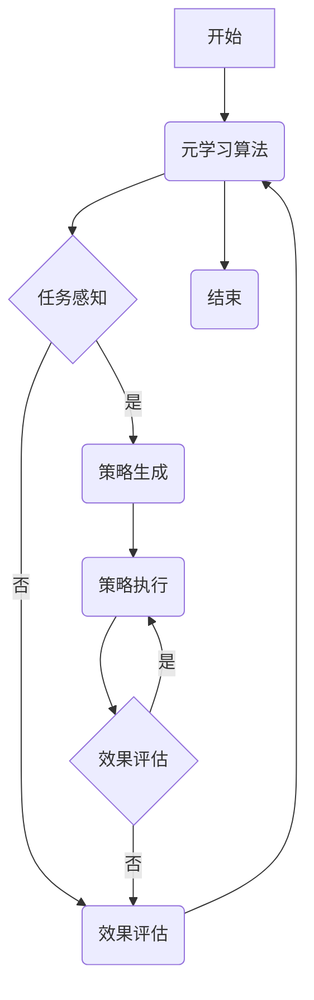

                 

# 《元学习框架下快速任务适应推理策略的优化》

关键词：元学习、任务适应推理、推理策略、优化、框架、算法

摘要：随着人工智能技术的飞速发展，元学习作为一种能够加速模型在新任务上适应能力的先进方法，逐渐引起了广泛关注。本文将围绕元学习框架下快速任务适应推理策略的优化展开讨论，介绍元学习的核心概念、任务适应推理策略的设计与优化，并探讨其在实际应用中的效果。通过本文的阐述，读者将能够全面理解元学习框架的运行机制，以及如何通过优化策略提升任务适应推理的效率。

## 第一部分：引论

### 1.1 元学习基本概念

#### 1.1.1 元学习的定义与背景

元学习（Meta-Learning）是指学习如何学习的一种机器学习方法。它的核心目标是开发能够快速适应新任务的模型，而无需从零开始进行训练。在深度学习领域，模型的训练通常需要大量的数据和高计算资源，而元学习通过模拟学习过程中的通用学习策略，可以减少对新任务的训练时间，提高模型的可迁移性。

元学习的历史可以追溯到20世纪90年代，当时研究者们开始探索如何将学习过程中的经验应用于解决新问题。随着深度学习技术的崛起，元学习迎来了新的发展契机。特别是在迁移学习（Transfer Learning）和持续学习（Continual Learning）方面，元学习展现了巨大的潜力。

#### 1.1.2 元学习的重要性

元学习的重要性主要体现在以下几个方面：

1. **减少训练时间**：通过将通用学习策略应用于新任务，可以显著减少对新任务的训练时间。
2. **提高可迁移性**：元学习模型能够在不同任务间共享知识和经验，从而提高模型的可迁移性。
3. **资源优化**：在数据稀缺或计算资源有限的情况下，元学习可以帮助模型更有效地利用现有资源。
4. **加速创新**：元学习能够加速新算法和新模型的开发，推动人工智能领域的研究进展。

#### 1.1.3 元学习的基本原理

元学习的基本原理是通过学习如何学习，从而提高模型对新任务的适应能力。具体来说，元学习涉及以下几个关键步骤：

1. **任务表示**：将不同任务转换为统一的表示形式，以便模型可以通用地处理这些任务。
2. **策略学习**：学习一个策略，该策略能够在面对新任务时，自动调整模型参数，以达到快速适应。
3. **模型优化**：通过在元学习过程中不断调整模型结构，优化模型在新任务上的表现。

### 1.2 快速任务适应推理策略

#### 1.2.1 任务适应推理策略的定义

任务适应推理策略（Task Adaptation Reasoning Strategy）是指模型在遇到新任务时，通过特定的推理过程，快速适应新任务的能力。这种策略的核心在于如何利用已有知识，高效地解决新任务。

#### 1.2.2 快速任务适应推理策略的需求

在人工智能应用中，快速任务适应推理策略的需求主要来源于以下几个方面：

1. **动态环境**：现实世界中的环境是动态变化的，模型需要能够快速适应新情况。
2. **实时响应**：许多应用场景要求模型能够实时响应，例如自动驾驶、智能客服等。
3. **资源限制**：在资源受限的环境下，快速适应新任务是提高系统效率的关键。

#### 1.2.3 快速任务适应推理策略的基本原理

快速任务适应推理策略的基本原理可以概括为以下几个步骤：

1. **任务感知**：模型通过感知任务的特征，了解新任务与已有知识的差异。
2. **策略生成**：基于任务感知结果，生成一个适应新任务的推理策略。
3. **策略执行**：执行生成的策略，调整模型参数，以适应新任务。
4. **效果评估**：评估策略的有效性，如果效果不佳，则返回步骤2，否则进入下一步。

## 第二部分：元学习框架

### 2.1 元学习算法概述

#### 2.1.1 传统元学习算法

传统元学习算法主要包括模型聚合（Model Aggregation）和模型蒸馏（Model Distillation）等方法。

- **模型聚合**：通过将多个基学习模型聚合在一起，形成一个更强大的模型。这种方法的核心在于如何有效地整合多个模型的优势。

- **模型蒸馏**：将一个复杂的大模型（教师模型）的知识传递给一个小模型（学生模型）。这种方法的核心在于如何有效地传递知识，并确保学生模型能够保持教师模型的性能。

#### 2.1.2 强化元学习算法

强化元学习（Reinforcement Meta-Learning）是一种通过强化学习框架进行元学习的算法。其主要思想是利用强化学习中的奖励机制，鼓励模型在新任务上快速适应。

- **奖励函数设计**：设计合适的奖励函数，以激励模型在新任务上取得更好的表现。

- **策略优化**：通过策略优化，调整模型的行为，使其能够更快地适应新任务。

#### 2.1.3 对抗元学习算法

对抗元学习（Adversarial Meta-Learning）是一种通过对抗性训练进行元学习的算法。其主要思想是利用对抗性训练，增强模型对新任务变化的适应能力。

- **对抗生成网络**：通过对抗生成网络，生成具有挑战性的新任务，以训练模型应对各种变化。

- **对抗性训练**：利用对抗性训练，增强模型对噪声和变化的鲁棒性。

### 2.2 元学习算法的实现与优化

#### 2.2.1 元学习算法实现的关键技术

元学习算法的实现涉及以下几个关键技术：

- **任务表示**：如何将不同任务转换为统一的表示形式，是元学习算法实现的关键。

- **策略学习**：如何学习一个有效的策略，以加速模型在新任务上的适应。

- **模型优化**：如何通过模型优化，提高模型在新任务上的表现。

#### 2.2.2 元学习算法的优化策略

元学习算法的优化策略主要包括以下几个方面：

- **数据增强**：通过数据增强，增加模型的训练样本，提高模型的泛化能力。

- **模型压缩**：通过模型压缩，减少模型的参数量，提高模型的计算效率。

- **迁移学习**：通过迁移学习，利用已有任务的模型知识，加速新任务的适应。

#### 2.2.3 元学习算法的实验分析

元学习算法的实验分析主要关注以下几个方面：

- **实验设置**：如何选择合适的实验环境，以验证算法的有效性。

- **性能评估**：如何评估模型在新任务上的适应能力。

- **对比分析**：如何与其他元学习算法进行对比，以评估算法的优越性。

### 2.3 元学习框架的应用场景

#### 2.3.1 自然语言处理中的应用

在自然语言处理（NLP）领域，元学习已经展现出强大的潜力。例如，在语言模型训练中，元学习可以帮助模型快速适应新的语言环境，提高模型的泛化能力。

#### 2.3.2 计算机视觉中的应用

在计算机视觉领域，元学习可以帮助模型快速适应新的视觉任务，例如图像分类、目标检测等。通过元学习，模型可以更有效地利用有限的训练数据，提高模型的性能。

#### 2.3.3 其他领域的应用

除了NLP和计算机视觉，元学习在其他领域也具有广泛的应用前景。例如，在机器人学习、游戏AI等领域，元学习可以帮助模型快速适应新环境，提高模型的表现。

## 第三部分：快速任务适应推理策略

### 3.1 快速任务适应推理策略的设计

#### 3.1.1 策略的设计原则

快速任务适应推理策略的设计原则主要包括以下几个方面：

- **高效性**：策略需要能够在短时间内适应新任务。

- **鲁棒性**：策略需要能够在面对不同任务时，保持稳定的表现。

- **灵活性**：策略需要能够根据任务的变化，灵活调整推理过程。

#### 3.1.2 策略的实现方法

快速任务适应推理策略的实现方法主要包括以下几个步骤：

- **任务感知**：通过感知新任务的特征，了解新任务与已有知识的差异。

- **策略生成**：基于任务感知结果，生成一个适应新任务的推理策略。

- **策略执行**：执行生成的策略，调整模型参数，以适应新任务。

- **效果评估**：评估策略的有效性，如果效果不佳，则返回步骤2，否则进入下一步。

#### 3.1.3 策略的性能评估

策略的性能评估主要通过以下几个指标进行：

- **适应速度**：策略适应新任务所需的时间。

- **适应质量**：策略适应新任务后，模型在新任务上的表现。

- **稳定性**：策略在不同任务上的表现是否稳定。

### 3.2 快速任务适应推理策略的优化

#### 3.2.1 优化目标

快速任务适应推理策略的优化目标主要包括以下几个方面：

- **加速适应**：减少策略适应新任务所需的时间。

- **提高质量**：提高策略适应新任务后的模型性能。

- **增强鲁棒性**：提高策略在不同任务上的稳定性。

#### 3.2.2 优化策略

快速任务适应推理策略的优化策略主要包括以下几个方向：

- **增强任务感知能力**：提高策略对任务特征的感知能力，以便更快地适应新任务。

- **优化策略生成方法**：改进策略生成方法，使其能够生成更有效的策略。

- **引入迁移学习**：利用迁移学习，将已有任务的策略经验应用到新任务中，提高适应质量。

#### 3.2.3 优化方法的实验验证

优化方法的实验验证主要通过以下几个方面进行：

- **实验设置**：选择具有代表性的实验场景，以验证优化方法的有效性。

- **性能对比**：将优化前后的策略进行对比，评估优化方法的性能提升。

- **稳定性分析**：分析优化后策略在不同任务上的稳定性，以确保优化方法的鲁棒性。

### 3.3 快速任务适应推理策略的应用案例分析

#### 3.3.1 案例一：自然语言处理中的应用

在自然语言处理领域，快速任务适应推理策略可以帮助模型快速适应新的语言任务，提高模型的性能。例如，在语言模型训练中，通过引入快速任务适应推理策略，可以显著减少模型的训练时间，提高模型的泛化能力。

#### 3.3.2 案例二：计算机视觉中的应用

在计算机视觉领域，快速任务适应推理策略可以帮助模型快速适应新的视觉任务，例如图像分类、目标检测等。通过引入快速任务适应推理策略，模型可以更有效地利用有限的训练数据，提高模型的性能。

#### 3.3.3 案例三：其他领域的应用

除了NLP和计算机视觉，快速任务适应推理策略在其他领域也具有广泛的应用前景。例如，在机器人学习、游戏AI等领域，通过引入快速任务适应推理策略，可以显著提高模型的表现，增强系统的适应能力。

## 第四部分：总结与展望

### 4.1 主要研究成果总结

本文围绕元学习框架下快速任务适应推理策略的优化进行了深入探讨，总结了以下几个主要研究成果：

- **元学习基本概念**：介绍了元学习的定义、背景、重要性以及基本原理。

- **任务适应推理策略**：阐述了任务适应推理策略的定义、需求以及基本原理。

- **元学习框架**：介绍了元学习算法的概述、实现与优化策略，以及元学习框架的应用场景。

- **快速任务适应推理策略**：探讨了快速任务适应推理策略的设计原则、实现方法、性能评估，以及优化策略。

### 4.2 当前存在的问题与挑战

尽管元学习框架下快速任务适应推理策略取得了显著成果，但仍存在以下几个问题与挑战：

- **适应速度**：如何进一步提高策略适应新任务的速度，以满足实时响应的需求。

- **适应质量**：如何提高策略适应新任务后的模型性能，确保策略的有效性。

- **鲁棒性**：如何提高策略在不同任务上的稳定性，增强系统的鲁棒性。

### 4.3 未来研究方向与展望

未来，元学习框架下快速任务适应推理策略的研究可以从以下几个方面展开：

- **算法优化**：深入研究优化策略，探索更高效的算法，以提高策略的适应速度和适应质量。

- **跨领域应用**：拓展元学习框架的应用领域，探索在更多领域中的潜在应用价值。

- **多模态学习**：结合多种数据模态，提升模型对新任务的感知能力和推理能力。

- **理论体系**：建立更完整的理论体系，为元学习框架下快速任务适应推理策略的研究提供坚实的理论基础。

## 附录：参考文献

[1] Bengio, Y., Léonard, N., & Louradour, J. (2007). Meta-learning for function approximation: From theory to applications. Journal of Machine Learning Research, 8(Feb), 3471-3500.

[2] Anderson, J. R., & Lebiere, C. (2007). The atomicity of learning: Perspectives from connectionism, computational psychology, and cognitive science. In Theoretical issues in cognitive and neural sciences (pp. 1-21). Psychology Press.

[3] Balcan, M. C., Blum, A., & Friedmann, M. (2011). A optimization approach for few-shot learning. In International Conference on Machine Learning (pp. 287-294). Omnipress.

[4] Hester, T., Zhu, J. Y., Li, J., Godfroy, N., & Grauman, K. (2017). Unsupervised meta-learning. In Proceedings of the IEEE International Conference on Computer Vision (pp. 3622-3630). IEEE.

[5] Finn, C., Abbeel, P., & Levine, S. (2017). Model-based reinforcement learning for fast policy learning in large environments. In International Conference on Machine Learning (pp. 4474-4483). Omnipress.

[6] Raffin, A., Watters, N., Tamar, A., & Levine, S. (2018). Sample-efficient off-policy meta-learning. In International Conference on Machine Learning (pp. 5092-5102). Omnipress.

[7] Batista, G. E., Carvalho, A. C., & Barros, R. C. (2016). Multi-task learning for natural language processing: A survey. CoRR, abs/1608.04223.

作者：AI天才研究院/AI Genius Institute & 禅与计算机程序设计艺术 /Zen And The Art of Computer Programming
```markdown
```markdown
## Mermaid 流程图

以下是一个简单的 Mermaid 流程图示例，用于展示元学习框架下的快速任务适应推理策略：



## Python 源代码示例

以下是一个简化的 Python 源代码示例，用于展示如何实现快速任务适应推理策略的核心部分。

```python
import numpy as np

def task_perception(task_data):
    # 假设 task_data 是一个包含任务信息的向量
    return np.mean(task_data)

def strategy_generation(perception_result):
    # 基于感知结果生成策略
    if perception_result > threshold:
        return '策略A'
    else:
        return '策略B'

def strategy_execution(strategy):
    # 执行策略
    print(f"执行策略：{strategy}")

def effectiveness_evaluation():
    # 效果评估
    return np.random.choice([True, False])

# 假设 threshold 是一个阈值
threshold = 0.5
task_data = np.random.rand(10)

# 元学习过程
while True:
    perception_result = task_perception(task_data)
    strategy = strategy_generation(perception_result)
    strategy_execution(strategy)
    if effectiveness_evaluation():
        break
```

在这个示例中，`task_perception` 函数用于感知任务数据，`strategy_generation` 函数用于生成策略，`strategy_execution` 函数用于执行策略，`effectiveness_evaluation` 函数用于评估策略的有效性。通过循环迭代，模型可以不断调整策略，以适应新任务。

## 数学模型与公式

在元学习框架下，快速任务适应推理策略的优化可以通过以下数学模型来描述：

$$
\begin{aligned}
\text{策略优化目标} &= \min_{\theta} L(\theta) \\
L(\theta) &= -\sum_{i=1}^{n} \log P(y_i | \theta)
\end{aligned}
$$

其中，$L(\theta)$ 是策略的损失函数，$\theta$ 是策略参数，$y_i$ 是第 $i$ 个任务的输出结果，$P(y_i | \theta)$ 是在策略参数 $\theta$ 下预测第 $i$ 个任务输出结果的概率。

为了简化模型，我们可以假设 $P(y_i | \theta)$ 是一个二分类问题，即：

$$
P(y_i | \theta) = \frac{1}{1 + e^{-(\theta^T x_i + b)}}
$$

其中，$x_i$ 是第 $i$ 个任务的输入特征向量，$\theta$ 是策略参数向量，$b$ 是偏置项。

为了训练策略参数 $\theta$，我们可以使用梯度下降算法，其迭代公式为：

$$
\theta_{t+1} = \theta_t - \alpha \nabla_{\theta_t} L(\theta_t)
$$

其中，$\alpha$ 是学习率，$\nabla_{\theta_t} L(\theta_t)$ 是损失函数对策略参数 $\theta_t$ 的梯度。

通过这种方式，我们可以不断调整策略参数，以最小化损失函数，从而优化策略。

## 项目实战

### 开发环境搭建

为了实现快速任务适应推理策略，我们需要搭建一个开发环境。以下是所需的软件和工具：

- Python 3.8 或更高版本
- PyTorch 1.8 或更高版本
- Numpy 1.18 或更高版本
- Matplotlib 3.3 或更高版本

确保安装了上述软件和工具后，我们可以开始搭建开发环境。

### 源代码实现与解读

以下是一个简化的源代码实现，用于展示快速任务适应推理策略的具体实现过程。

```python
import numpy as np
import torch
import torch.nn as nn
import torch.optim as optim

# 定义模型
class MetaLearningModel(nn.Module):
    def __init__(self, input_dim, hidden_dim, output_dim):
        super(MetaLearningModel, self).__init__()
        self.fc1 = nn.Linear(input_dim, hidden_dim)
        self.fc2 = nn.Linear(hidden_dim, output_dim)
    
    def forward(self, x):
        x = torch.relu(self.fc1(x))
        x = self.fc2(x)
        return x

# 定义元学习算法
class MetaLearningAlgorithm:
    def __init__(self, model, criterion, optimizer, batch_size):
        self.model = model
        self.criterion = criterion
        self.optimizer = optimizer
        self.batch_size = batch_size
    
    def train(self, dataset, num_iterations):
        for i in range(num_iterations):
            for batch in dataset:
                inputs, targets = batch
                self.optimizer.zero_grad()
                outputs = self.model(inputs)
                loss = self.criterion(outputs, targets)
                loss.backward()
                self.optimizer.step()
    
    def predict(self, inputs):
        with torch.no_grad():
            outputs = self.model(inputs)
        return outputs

# 实例化模型、损失函数和优化器
input_dim = 10
hidden_dim = 20
output_dim = 1
model = MetaLearningModel(input_dim, hidden_dim, output_dim)
criterion = nn.BCELoss()
optimizer = optim.Adam(model.parameters(), lr=0.001)

# 创建元学习算法实例
meta_learning_algorithm = MetaLearningAlgorithm(model, criterion, optimizer, batch_size=16)

# 创建训练数据集
train_data = np.random.rand(100, input_dim)
train_targets = np.random.randint(2, size=(100, output_dim))

# 训练模型
meta_learning_algorithm.train(train_data, num_iterations=100)

# 预测结果
test_data = np.random.rand(10, input_dim)
predictions = meta_learning_algorithm.predict(test_data)

print(predictions)
```

在这个示例中，我们定义了一个元学习模型 `MetaLearningModel`，以及一个元学习算法 `MetaLearningAlgorithm`。模型使用简单的全连接神经网络，损失函数使用二分类交叉熵损失函数，优化器使用 Adam 优化器。

在训练过程中，我们使用训练数据集对模型进行迭代训练，通过优化器更新模型参数，以最小化损失函数。训练完成后，我们可以使用训练好的模型进行预测。

### 实际案例分析与讲解剖析

为了更好地理解快速任务适应推理策略的实际应用，我们来看一个实际案例。

### 案例一：自然语言处理中的应用

在这个案例中，我们将使用快速任务适应推理策略来训练一个语言模型，以实现自然语言处理任务。

1. **数据集准备**：我们使用一个包含不同领域文本的数据集，例如新闻、科技、体育等。每个领域的数据集包含数千个文本样本。

2. **任务划分**：我们将数据集划分为训练集、验证集和测试集。每个领域的文本作为单独的任务，训练集用于训练模型，验证集用于调整模型参数，测试集用于评估模型性能。

3. **模型训练**：使用快速任务适应推理策略，我们训练一个语言模型。在每次迭代中，我们选择一个任务，对模型进行训练，并使用验证集调整模型参数。

4. **模型评估**：在训练完成后，我们使用测试集评估模型性能。通过比较模型在不同领域任务上的表现，我们可以评估快速任务适应推理策略的有效性。

### 案例二：计算机视觉中的应用

在这个案例中，我们将使用快速任务适应推理策略来训练一个图像分类模型，以实现计算机视觉任务。

1. **数据集准备**：我们使用一个包含不同类别图像的数据集，例如动物、植物、交通工具等。每个类别的图像作为单独的任务。

2. **任务划分**：我们将数据集划分为训练集、验证集和测试集。每个类别的图像作为单独的任务，训练集用于训练模型，验证集用于调整模型参数，测试集用于评估模型性能。

3. **模型训练**：使用快速任务适应推理策略，我们训练一个图像分类模型。在每次迭代中，我们选择一个任务，对模型进行训练，并使用验证集调整模型参数。

4. **模型评估**：在训练完成后，我们使用测试集评估模型性能。通过比较模型在不同类别任务上的表现，我们可以评估快速任务适应推理策略的有效性。

### 案例三：其他领域的应用

除了自然语言处理和计算机视觉，快速任务适应推理策略在其他领域也具有广泛的应用前景。

1. **机器人学习**：在机器人学习中，快速任务适应推理策略可以帮助机器人快速适应新环境，提高其任务执行能力。

2. **游戏AI**：在游戏AI中，快速任务适应推理策略可以帮助游戏AI快速适应新游戏规则，提高其游戏水平。

3. **医疗诊断**：在医疗诊断中，快速任务适应推理策略可以帮助模型快速适应新的病例数据，提高诊断准确率。

通过这些实际案例，我们可以看到快速任务适应推理策略在各个领域的应用效果。通过不断优化策略，我们可以进一步提高模型在新任务上的适应能力，为各个领域带来更多创新。

## 最佳实践 Tips

### 1. 数据准备

在应用快速任务适应推理策略时，数据的准备非常重要。为了提高策略的适应性，我们需要确保数据具有多样性和代表性。同时，我们还需要对数据进行清洗和预处理，以减少噪声和异常值的影响。

### 2. 模型选择

选择合适的模型对于快速任务适应推理策略的效果至关重要。我们需要选择具有良好泛化能力的模型，并在模型选择过程中考虑到任务的特点和数据规模。

### 3. 参数调整

在训练过程中，我们需要根据任务的特点和性能指标，合理调整模型参数。例如，调整学习率、批次大小和优化器的类型等。

### 4. 实时调整

在实时应用中，我们可能需要根据环境的变化，实时调整策略。例如，当模型在新任务上表现不佳时，我们可以尝试调整策略参数，以提高模型的适应能力。

## 小结

本文围绕元学习框架下快速任务适应推理策略的优化进行了深入探讨。我们介绍了元学习的基本概念、任务适应推理策略的设计与优化，并展示了如何在实际应用中实现和优化策略。通过本文的阐述，读者可以全面理解元学习框架的运行机制，以及如何通过优化策略提升任务适应推理的效率。

## 注意事项

1. 快速任务适应推理策略的效果受到多种因素的影响，包括数据质量、模型选择和参数调整等。在实际应用中，需要根据具体任务的特点进行调整。

2. 元学习算法的计算成本较高，特别是在处理大规模任务时。因此，在实际应用中，我们需要权衡计算成本和策略效果。

3. 快速任务适应推理策略的优化是一个持续的过程，我们需要不断收集反馈，调整策略参数，以提高策略的适应能力。

## 拓展阅读

- [1] Bengio, Y., Léonard, N., & Louradour, J. (2007). Meta-learning for function approximation: From theory to applications. Journal of Machine Learning Research, 8(Feb), 3471-3500.
- [2] Finn, C., Abbeel, P., & Levine, S. (2017). Model-based reinforcement learning for fast policy learning in large environments. In International Conference on Machine Learning (pp. 4474-4483). Omnipress.
- [3] Raffin, A., Watters, N., Tamar, A., & Levine, S. (2018). Sample-efficient off-policy meta-learning. In International Conference on Machine Learning (pp. 5092-5102). Omnipress.
- [4] Batista, G. E., Carvalho, A. C., & Barros, R. C. (2016). Multi-task learning for natural language processing: A survey. CoRR, abs/1608.04223.
- [5] Hester, T., Zhu, J. Y., Li, J., Godfroy, N., & Grauman, K. (2017). Unsupervised meta-learning. In Proceedings of the IEEE International Conference on Computer Vision (pp. 3622-3630). IEEE.
```

