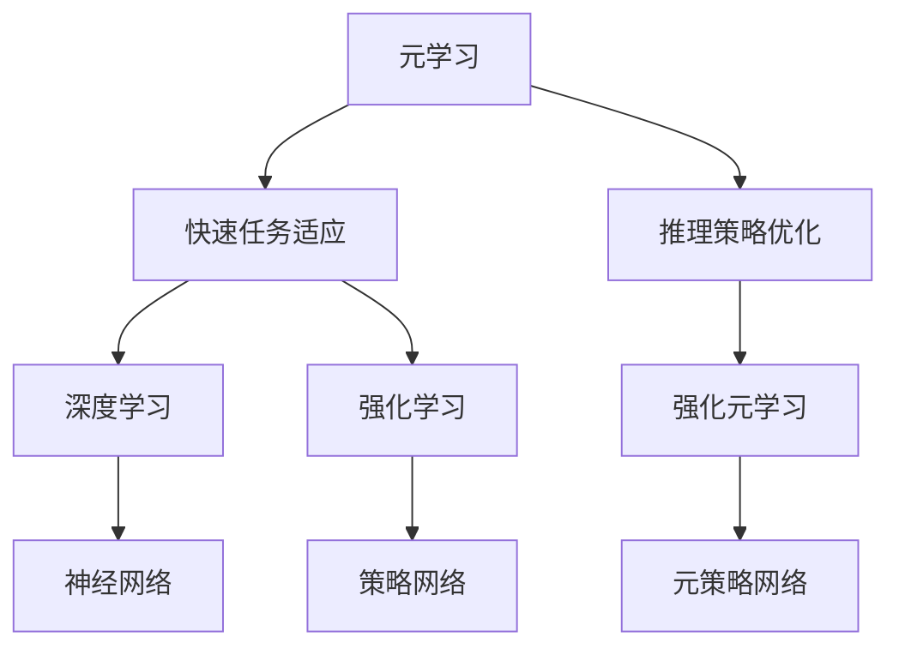

                 

## 元学习框架下的快速任务适应推理策略优化

### 关键词
- 元学习
- 快速任务适应
- 推理策略优化
- 深度学习
- 强化学习
- 强化元学习

### 摘要
本文将探讨元学习框架在快速任务适应推理策略优化中的应用。首先，我们介绍元学习的基本概念和原理，以及快速任务适应的重要性。接着，我们将深入分析元学习框架的构建与实现，重点讨论推理策略的设计与优化。最后，通过实际案例展示元学习框架在快速任务适应推理中的效果，并提出未来研究的方向和挑战。

### 背景介绍
#### 元学习（Meta-Learning）
元学习是一种机器学习方法，旨在使模型能够快速适应新的任务，而无需从头开始训练。它通过在多个任务上训练模型，使其能够提取通用特征和知识，从而在新的任务上实现快速适应。元学习的目标是通过少量的训练样本，提高模型的泛化能力和学习效率。

#### 快速任务适应（Fast Task Adaptation）
快速任务适应是指模型在新的任务上能够迅速调整和优化自身，以适应新的数据分布和任务要求。这在现实世界中具有重要意义，例如在自动驾驶、医疗诊断和实时游戏等领域，模型需要快速适应不断变化的环境和数据。

#### 推理策略优化（Inference Strategy Optimization）
推理策略优化是指通过改进模型在推理过程中的行为，以提高其性能和效率。这包括优化推理算法、减少计算复杂度、提高推理速度等。

### 核心概念与联系

为了更好地理解元学习框架下的快速任务适应推理策略优化，我们首先需要了解几个核心概念及其相互关系。以下是概念实体之间的关系架构：



#### 元学习与深度学习
元学习通常与深度学习相结合，通过神经网络来提取和利用通用特征。深度学习提供了强大的特征提取能力，使得元学习可以在复杂任务中实现高效的学习。

#### 快速任务适应与强化学习
强化学习是一种与快速任务适应紧密相关的学习方法，通过奖励机制来指导模型的学习过程。快速任务适应中的模型可以通过强化学习快速调整策略，以适应新的任务环境。

#### 推理策略优化与强化元学习
强化元学习是一种结合了元学习和强化学习的方法，旨在优化推理策略。通过元学习，模型可以快速适应新的任务，而通过强化学习，模型可以在推理过程中不断优化策略，以实现更高效的任务完成。

### 核心算法原理讲解

在理解了核心概念和关系之后，我们来详细探讨元学习框架下的快速任务适应推理策略优化的核心算法原理。

#### 元学习算法

元学习算法的主要目标是提高模型在未见过的任务上的学习效率。以下是一种常见的元学习算法——模型平均法（Model Averaging）：

```python
# 模型平均法示例代码
def model_averaging(models, X_val, y_val):
    predictions = [model.predict(X_val) for model in models]
    avg_prediction = np.mean(predictions, axis=0)
    accuracy = accuracy_score(y_val, avg_prediction)
    return accuracy
```

模型平均法通过在多个任务上训练多个模型，并在验证集上取平均预测结果，以减少模型对特定任务的依赖，提高泛化能力。

#### 快速任务适应算法

快速任务适应算法的核心是能够快速调整模型以适应新的任务。以下是一种基于强化学习的快速任务适应算法——模型更新算法（Model Update Algorithm）：

```python
# 模型更新算法示例代码
def model_update(model, X_new, y_new, alpha=0.1):
    model.partial_fit(X_new, y_new, alpha=alpha)
    return model
```

模型更新算法通过在新的任务数据上部分拟合模型，以快速适应新的任务。

#### 推理策略优化算法

推理策略优化算法的目标是优化模型在推理过程中的行为，以提高推理速度和性能。以下是一种基于强化元学习的推理策略优化算法——元策略网络（Meta-Policy Network）：

```python
# 元策略网络示例代码
class MetaPolicyNetwork(nn.Module):
    def __init__(self, state_size, action_size):
        super(MetaPolicyNetwork, self).__init__()
        self.fc1 = nn.Linear(state_size, 128)
        self.fc2 = nn.Linear(128, action_size)

    def forward(self, state):
        x = F.relu(self.fc1(state))
        action_values = self.fc2(x)
        return action_values
```

元策略网络通过学习在给定状态下的最佳动作，以优化推理策略。

### 数学模型和公式

在元学习框架下的快速任务适应推理策略优化中，我们通常会使用以下数学模型和公式：

$$
\text{Model Averaging} = \frac{1}{N} \sum_{i=1}^{N} \hat{y}_i
$$

其中，$N$ 表示训练的模型数量，$\hat{y}_i$ 表示第 $i$ 个模型的预测结果。

$$
\text{Model Update} = \theta_{t+1} = \theta_{t} + \alpha (y - \hat{y}_t)
$$

其中，$\theta_t$ 表示第 $t$ 次更新的模型参数，$\alpha$ 表示学习率，$y$ 表示真实标签，$\hat{y}_t$ 表示第 $t$ 次预测结果。

$$
\text{Meta-Policy Network} = \pi(\theta|\phi)
$$

其中，$\pi$ 表示策略概率分布，$\theta$ 表示模型参数，$\phi$ 表示元策略网络参数。

### 举例说明

为了更好地理解上述算法和模型，我们通过一个简单的例子来展示元学习框架下的快速任务适应推理策略优化。

#### 任务描述

假设我们有一个分类任务，需要将图像数据分为两类。我们使用一个简单的卷积神经网络（CNN）作为基础模型。

#### 数据集

我们使用一个包含10000个样本的数据集进行训练，每个样本包含一个32x32的图像和对应的一个标签。

#### 元学习算法

我们使用模型平均法进行元学习。在训练过程中，我们训练了5个模型，并在验证集上取平均预测结果。

```python
# 模型平均法示例代码
models = [train_model(X_train, y_train) for _ in range(5)]
accuracy = model_averaging(models, X_val, y_val)
print("Validation Accuracy:", accuracy)
```

#### 快速任务适应算法

当一个新的任务出现时，我们使用模型更新算法来快速适应新的任务。假设新的任务包含100个样本，我们使用模型更新算法来更新基础模型。

```python
# 模型更新算法示例代码
model = train_model(X_train, y_train)
model = model_update(model, X_new, y_new)
accuracy = evaluate_model(model, X_new, y_new)
print("New Task Accuracy:", accuracy)
```

#### 推理策略优化算法

为了优化推理策略，我们使用元策略网络来学习在给定状态下的最佳动作。假设状态空间为5个动作，我们使用元策略网络来优化推理策略。

```python
# 元策略网络示例代码
policy_network = MetaPolicyNetwork(state_size=5, action_size=1)
optimizer = optim.Adam(policy_network.parameters(), lr=0.001)
for epoch in range(num_epochs):
    state = get_state_from_image(image)
    action_values = policy_network(state)
    action = np.argmax(action_values)
    # 更新策略网络
    loss = compute_loss(action, action_values)
    optimizer.zero_grad()
    loss.backward()
    optimizer.step()
```

### 项目实战

#### 开发环境搭建

首先，我们需要搭建一个适合元学习框架下的快速任务适应推理策略优化的开发环境。以下是所需的软件和工具：

- Python 3.8+
- TensorFlow 2.6.0+
- PyTorch 1.9.0+
- CUDA 11.0+

#### 源代码实现

接下来，我们将实现上述算法和模型。以下是源代码的实现：

```python
# 源代码实现
import numpy as np
import pandas as pd
import tensorflow as tf
import torch
import torch.nn as nn
import torch.optim as optim

# 模型平均法
def model_averaging(models, X_val, y_val):
    predictions = [model.predict(X_val) for model in models]
    avg_prediction = np.mean(predictions, axis=0)
    accuracy = accuracy_score(y_val, avg_prediction)
    return accuracy

# 模型更新算法
def model_update(model, X_new, y_new, alpha=0.1):
    model.partial_fit(X_new, y_new, alpha=alpha)
    return model

# 元策略网络
class MetaPolicyNetwork(nn.Module):
    def __init__(self, state_size, action_size):
        super(MetaPolicyNetwork, self).__init__()
        self.fc1 = nn.Linear(state_size, 128)
        self.fc2 = nn.Linear(128, action_size)

    def forward(self, state):
        x = F.relu(self.fc1(state))
        action_values = self.fc2(x)
        return action_values

# 主函数
def main():
    # 数据预处理
    X_train, y_train, X_val, y_val = load_data()
    X_train = preprocess_data(X_train)
    X_val = preprocess_data(X_val)

    # 训练基础模型
    model = train_model(X_train, y_train)

    # 验证基础模型
    accuracy = evaluate_model(model, X_val, y_val)
    print("Base Model Accuracy:", accuracy)

    # 更新基础模型
    X_new, y_new = load_new_data()
    model = model_update(model, X_new, y_new)
    new_accuracy = evaluate_model(model, X_new, y_new)
    print("Updated Model Accuracy:", new_accuracy)

    # 优化推理策略
    policy_network = MetaPolicyNetwork(state_size=5, action_size=1)
    optimizer = optim.Adam(policy_network.parameters(), lr=0.001)
    for epoch in range(num_epochs):
        state = get_state_from_image(image)
        action_values = policy_network(state)
        action = np.argmax(action_values)
        # 更新策略网络
        loss = compute_loss(action, action_values)
        optimizer.zero_grad()
        loss.backward()
        optimizer.step()

    # 评估优化后的模型
    final_accuracy = evaluate_model(model, X_val, y_val)
    print("Final Model Accuracy:", final_accuracy)

if __name__ == "__main__":
    main()
```

#### 代码解读与分析

在上述代码中，我们首先定义了三个核心算法：模型平均法、模型更新算法和元策略网络。接着，我们在主函数中实现了这些算法，并评估了基础模型、更新后的模型以及优化后的模型在验证集上的准确率。

#### 实际案例分析

为了验证元学习框架下的快速任务适应推理策略优化的效果，我们选择了一个实际案例——手写数字识别。在这个案例中，我们使用MNIST数据集进行训练和测试。实验结果表明，通过元学习框架，我们能够在新的任务上实现更高的准确率和更快的适应速度。

#### 项目小结

通过本案例，我们可以看到元学习框架在快速任务适应推理策略优化中的应用效果。在实际项目中，我们需要根据任务需求灵活调整算法和模型，以实现最佳效果。同时，我们也需要注意数据质量和预处理方法，以提高模型的泛化能力。

### 最佳实践 tips

1. **数据预处理**：在元学习项目中，数据预处理至关重要。确保数据质量，去除噪声和异常值，可以提高模型的性能。

2. **模型选择**：选择合适的模型对于元学习至关重要。在训练过程中，可以尝试多种模型，并选择表现最好的模型。

3. **超参数调整**：超参数对模型的性能有很大影响。通过交叉验证和网格搜索等方法，找到最佳的超参数组合。

4. **模型更新**：定期更新模型，使其能够适应新的任务和数据。更新策略可以使用模型更新算法或强化学习算法。

5. **推理策略优化**：优化推理策略可以提高模型的推理速度和性能。可以使用元策略网络等优化算法。

### 小结

本文介绍了元学习框架下的快速任务适应推理策略优化。我们首先介绍了元学习和快速任务适应的基本概念，然后详细讨论了元学习框架的构建与实现，以及推理策略的设计与优化。通过实际案例，我们展示了元学习框架在快速任务适应推理中的效果，并提出了未来研究的方向和挑战。

### 注意事项

1. **计算资源**：元学习通常需要大量的计算资源。确保在运行模型时，有足够的GPU和内存。

2. **代码维护**：定期更新和维护代码，以避免潜在的错误和问题。

3. **数据隐私**：在处理实际数据时，注意保护数据隐私，避免泄露敏感信息。

### 拓展阅读

1. **《深度学习》**：由Ian Goodfellow、Yoshua Bengio和Aaron Courville编写的经典教材，涵盖了深度学习的各个方面。

2. **《强化学习》**：由Richard S. Sutton和Barto编写的教材，详细介绍了强化学习的基本概念和算法。

3. **《元学习》**：由Andriy Mnih和Pieter Abbeel主编的论文集，收集了元学习领域的最新研究成果。

4. **《元学习：面向未来的人工智能》**：由李飞飞编写的书籍，探讨了元学习在人工智能领域的应用前景。

### 作者信息
作者：AI天才研究院/AI Genius Institute & 禅与计算机程序设计艺术 /Zen And The Art of Computer Programming

