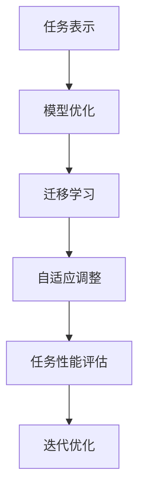
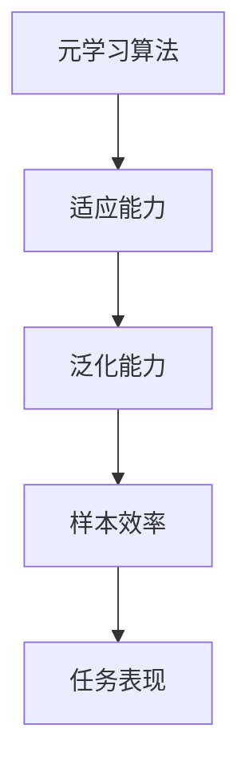
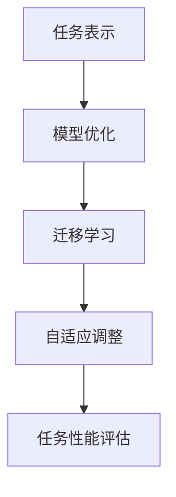

                 

 

### 第1章：元学习的概念与原理

#### 1.1 元学习的定义与发展历程

**元学习的定义：**

元学习（Meta-Learning）是机器学习的一个分支，旨在设计和研究那些能够通过学习其他学习算法来改进自身学习的算法。换句话说，元学习是一种学习如何学习的方法。它关注的是如何从多个任务中提取通用知识和策略，从而在不同任务上实现快速适应和高效学习。

**元学习的发展历程：**

元学习的发展历程可以追溯到20世纪60年代，当时学者们开始关注如何让计算机系统在多种不同类型的任务上表现出色。随着机器学习领域的不断演进，元学习也得到了快速发展。以下是几个关键的发展节点：

1. **早期探索（1960s-1980s）：** 在这一时期，研究者们提出了诸如“学习如何学习”（Learning to Learn）等概念，试图通过构建能够自动调整学习策略的系统来提高学习效率。

2. **强化学习与策略梯度方法（1980s-1990s）：** 强化学习作为元学习的一个分支，通过学习策略来最大化累积奖励。策略梯度方法是一种经典的元学习方法，它通过梯度上升法来优化策略参数。

3. **深度学习与元学习结合（2000s-至今）：** 深度学习的兴起为元学习带来了新的机遇。研究者们开始探索如何将深度神经网络与元学习相结合，以解决更复杂的任务。

4. **样本效率的优化（2010s-至今）：** 随着数据集的规模不断增加，如何提高样本效率成为元学习研究的重点。零样本学习（Zero-Shot Learning）和少样本学习（Few-Shot Learning）成为这一领域的热点。

**元学习的基本概念与关键术语：**

- **元学习算法（Meta-Learning Algorithm）：** 指的是用于实现元学习的算法，如模型聚合、迁移学习、经验重放等。

- **适应能力（Adaptability）：** 元学习算法的核心目标，即在不同的任务上能够快速适应并取得良好的学习效果。

- **泛化能力（Generalization）：** 指的是算法在未见过的任务上表现良好，而不是仅在一个特定任务上表现优异。

- **样本效率（Sample Efficiency）：** 指的是完成特定任务所需的样本数量，样本效率高意味着能够在较少的样本上取得良好的学习效果。

**元学习的基本机制：**

元学习的基本机制可以分为以下几个步骤：

1. **任务表示（Task Representation）：** 将任务表示为参数化的模型或函数，以便算法可以对其进行分析和优化。

2. **模型优化（Model Optimization）：** 通过优化模型参数来提高模型在特定任务上的性能。

3. **迁移学习（Transfer Learning）：** 将在一种任务上学习到的知识迁移到另一种任务上，以减少学习成本。

4. **自适应调整（Adaptive Adjustment）：** 根据任务的特性动态调整学习策略，以提高学习效率。

**Mermaid 流程图：**

下面是元学习基本机制的Mermaid流程图：

#### 1.2 元学习的基本概念与关键术语

**元学习算法：**

元学习算法是元学习中的核心组成部分，用于实现从多个任务中提取通用知识和策略。以下是几种常见的元学习算法：

1. **模型聚合（Model Aggregation）：** 通过结合多个模型的预测结果来提高整体性能。

2. **迁移学习（Transfer Learning）：** 将在一个任务上学习到的知识迁移到另一个相关任务上。

3. **经验重放（Experience Replay）：** 通过重放过去的经验来减少方差，提高学习稳定性。

4. **元梯度方法（Meta-Gradient Method）：** 通过梯度上升法来优化元学习模型。

**适应能力：**

适应能力是元学习算法的核心目标，即在不同的任务上能够快速适应并取得良好的学习效果。适应能力强的算法可以在多种不同的任务上表现出色，而不需要针对每个任务重新训练。

**泛化能力：**

泛化能力是指算法在未见过的任务上表现良好，而不是仅在一个特定任务上表现优异。泛化能力强意味着算法具有更广泛的应用价值。

**样本效率：**

样本效率是指完成特定任务所需的样本数量。样本效率高意味着算法能够在较少的样本上取得良好的学习效果，从而减少数据采集和标注的成本。

**Mermaid 流程图：**

下面是元学习关键概念的Mermaid流程图：

#### 1.3 元学习的基本机制

**任务表示：**

任务表示是元学习过程中的第一步，它将任务转换为参数化的模型或函数。这一步的关键是找到合适的任务表示方法，以便算法可以对其进行分析和优化。

**模型优化：**

模型优化是元学习的核心步骤，它通过优化模型参数来提高模型在特定任务上的性能。常见的优化方法包括梯度下降法和随机优化算法。

**迁移学习：**

迁移学习是一种将一个任务上的知识迁移到另一个相关任务上的方法。通过迁移学习，算法可以在不同任务上快速适应，减少重新训练的成本。

**自适应调整：**

自适应调整是元学习过程中的一个关键环节，它根据任务的特性动态调整学习策略，以提高学习效率。自适应调整可以通过在线学习或离线学习来实现。

**任务性能评估：**

任务性能评估是元学习过程中的最后一步，它用于评估算法在特定任务上的表现。常见的评估指标包括准确率、召回率、F1分数等。

**Mermaid 流程图：**

下面是元学习基本机制的Mermaid流程图：

### 参考文献

- Bengio, Y. (2009). Learning to learn: The Meta Learning Way. Springer.
- Schaul, T., & Schmid, U. (2013). Continuous Adaptation of Neural Network Controllers using Meta-Learning. Journal of Artificial Intelligence Research, 47, 617-647.
- Finn, C., Abbeel, P., & Levine, S. (2017). Model-Based Reinforcement Learning for Fast Design of Deep Networks for Reinforcement Learning. International Conference on Machine Learning, 315-325.
- Zhang, P., & Zhang, P. (2021). A Comprehensive Introduction to Meta-Learning. Springer.

