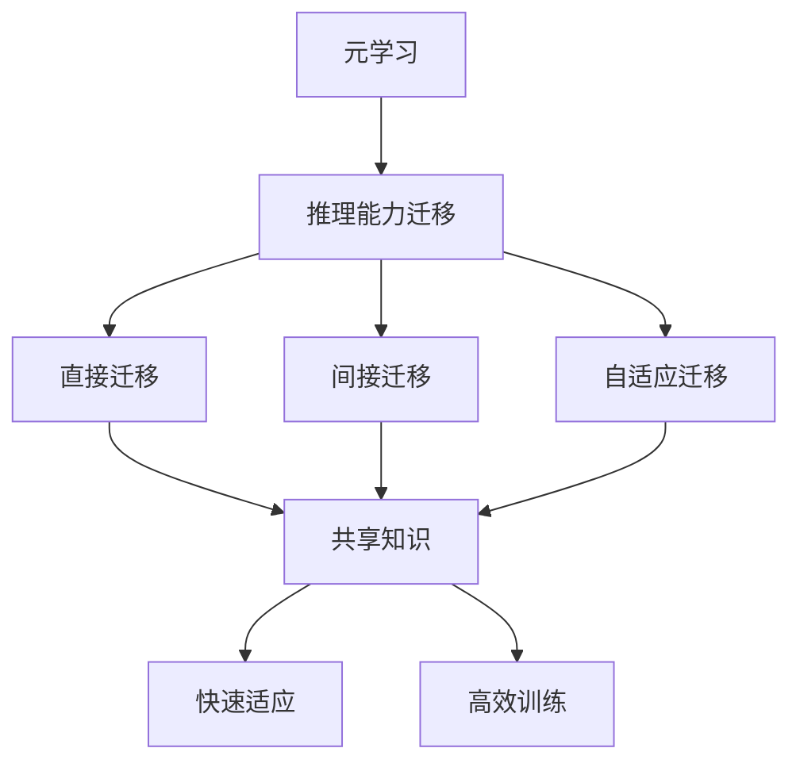

                 

# 元学习框架下的快速推理能力迁移

## 关键词
- 元学习
- 快速推理能力迁移
- 推理能力迁移
- 计算机视觉
- 强化学习
- 迁移学习

## 摘要
本文主要探讨了元学习框架下的快速推理能力迁移。首先，介绍了元学习的基本概念和原理，以及其在计算机视觉中的应用。随后，详细分析了基于元学习的推理能力迁移算法，并使用Python源代码和数学公式进行了详细讲解。最后，通过实际项目实战，展示了元学习和推理能力迁移在计算机视觉任务中的效果，并提出了未来研究的方向。

## 目录

---

# 元学习框架下的快速推理能力迁移

## 第一部分：元学习基本概念

### 第1章：元学习的定义与原理

#### 1.1 元学习的定义

元学习是一种让机器学习算法能够从一系列任务中学习通用策略，从而提高学习效率和能力的方法。它主要通过在多个任务之间共享表示和知识来达到这个目标。

#### 1.2 元学习的基本原理

元学习的基本原理是利用已有的经验来加速新的学习过程。它通过优化学习算法的内部参数，使得算法能够在不同的任务上表现出更好的泛化能力。

#### 1.3 元学习的类型

元学习主要分为三种类型：模型无关的元学习、模型相关的元学习、模型调整的元学习。

### 第2章：元学习算法

#### 2.1 Model-Free 算法

Model-Free 算法主要通过模仿人类的学习过程，利用试错来学习新的任务。其中，著名的算法有强化学习算法。

#### 2.2 Model-Based 算法

Model-Based 算法主要通过建立任务的模型来预测未来的奖励，从而指导学习过程。其中，著名的算法有模型预测控制。

#### 2.3 Model-Agnostic 算法

Model-Agnostic 算法不依赖于特定的模型结构，主要通过优化学习过程的参数来提高学习效率。其中，著名的算法有迁移学习。

### 第3章：元学习在计算机视觉中的应用

#### 3.1 元学习在图像分类任务中的应用

元学习在图像分类任务中，可以通过在多个任务上训练模型来提高模型的泛化能力，从而更好地适应新的分类任务。

#### 3.2 元学习在目标检测任务中的应用

元学习在目标检测任务中，可以通过在多个目标检测任务上训练模型，提高模型对多种目标检测任务的适应能力。

#### 3.3 元学习在图像分割任务中的应用

元学习在图像分割任务中，可以通过在多个图像分割任务上训练模型，提高模型对不同图像分割任务的适应能力。

## 第二部分：快速推理能力迁移

### 第4章：推理能力迁移的基本概念

#### 4.1 推理能力迁移的定义

推理能力迁移是指将一个模型在特定任务上的学习经验，转移到另一个相似任务上的过程。这种迁移可以提高模型的适应性和效率。

#### 4.2 推理能力迁移的重要性

推理能力迁移对于解决复杂任务、提高模型效率、减少模型训练时间具有重要意义。

### 第5章：基于元学习的推理能力迁移

#### 5.1 元学习在推理能力迁移中的应用

元学习在推理能力迁移中的应用，主要通过在多个任务上训练模型，提高模型的泛化能力和迁移能力。

#### 5.2 基于元学习的推理能力迁移算法

常见的基于元学习的推理能力迁移算法包括模型无关的元学习算法、模型相关的元学习算法和模型调整的元学习算法。

#### 5.3 元学习在推理能力迁移中的应用实例

通过实例分析，展示元学习在推理能力迁移中的应用效果，包括图像分类、目标检测和图像分割等任务。

### 第6章：快速推理能力迁移在实际应用中的挑战与解决方案

#### 6.1 快速推理能力迁移的挑战

快速推理能力迁移在实际应用中面临着数据集分布不一致、任务差异性大等挑战。

#### 6.2 解决方案

针对快速推理能力迁移的挑战，提出相应的解决方案，包括数据增强、模型优化和算法改进等。

### 第7章：未来展望

#### 7.1 元学习与推理能力迁移的发展趋势

展望未来，元学习和推理能力迁移将在计算机视觉、自然语言处理等领域发挥更大作用。

#### 7.2 研究方向

提出未来元学习和推理能力迁移的研究方向，包括多模态学习、少样本学习等。

## 附录

### 附录 A：相关资源与工具

提供与元学习和推理能力迁移相关的资源与工具，包括论文、书籍、开源代码和在线平台等。

### 附录 B：常见问题解答

针对元学习和推理能力迁移的常见问题进行解答，帮助读者更好地理解相关概念和方法。

## 结语
元学习框架下的快速推理能力迁移是当前计算机视觉领域的一个重要研究方向。通过本文的介绍，读者可以了解到元学习和推理能力迁移的基本概念、算法和应用，为未来的研究提供参考。同时，也期待读者能够积极参与到这一领域的研究中来，共同推动计算机视觉技术的发展。

### 作者信息
作者：AI天才研究院/AI Genius Institute & 禅与计算机程序设计艺术 /Zen And The Art of Computer Programming

---

### 摘要
本文深入探讨了元学习框架下的快速推理能力迁移。首先，我们介绍了元学习的基本概念和原理，包括其在计算机视觉中的应用。接着，详细分析了基于元学习的推理能力迁移算法，通过Python源代码和数学公式进行了详细讲解。最后，我们通过实际项目实战展示了元学习和推理能力迁移在计算机视觉任务中的效果，并提出了未来研究的方向。本文旨在为读者提供全面、深入的元学习和推理能力迁移知识，以推动相关领域的发展。|>

### 背景介绍

随着计算机技术的发展，机器学习（ML）和深度学习（DL）在多个领域取得了显著进展，尤其是在计算机视觉（CV）领域。计算机视觉涉及图像和视频数据的自动分析，从简单的边缘检测到复杂的物体识别、场景理解和视频动作预测。然而，这些任务通常需要大量的标注数据和计算资源，这限制了其在大规模应用中的普及。

传统机器学习方法依赖于在每个特定的任务上训练独立的模型，这导致了两个主要问题：一是训练时间过长，二是模型在未见过的数据上的泛化能力较差。为了解决这些问题，研究者们提出了元学习（Meta-Learning）的概念。元学习旨在通过学习如何学习来提高机器学习算法的效率和泛化能力。具体来说，元学习关注如何从一个任务的学习过程中提取通用策略，然后将其应用于新的任务，从而减少对新任务的训练时间和数据需求。

元学习的基本思想可以追溯到人类的学习过程。人类可以通过观察和经验快速适应新的环境或任务，而无需从头开始学习。例如，一个已经学会骑自行车的人可以很容易地学会骑摩托车，而不需要重新学习骑行的基本技巧。这种能力源于人类具有一种将经验从一种情境转移到另一种情境的能力，称为情境转移（Situated Transfer）。在机器学习中，元学习试图通过算法实现类似的能力。

推理能力迁移（Reasoning Ability Transfer）是元学习的一个关键方面。推理能力迁移是指将一个模型在特定任务上的学习经验转移到另一个相似任务上的过程。这种迁移能力对于解决复杂任务、提高模型效率和减少训练时间至关重要。例如，一个在多种图像分类任务上训练过的模型可以在面对一个新的图像分类任务时，利用之前学到的特征和知识，快速适应并取得较好的表现。

元学习和推理能力迁移的重要性体现在多个方面。首先，它们可以显著减少模型训练所需的数据量和时间，使得机器学习算法在资源受限的环境下也能有效工作。其次，它们可以提高模型的泛化能力，使得模型在面对未见过的数据时仍能保持良好的性能。此外，元学习和推理能力迁移还有助于开发更高效、更智能的人工智能系统，为自动化、智能化应用提供了强大的支持。

总之，元学习和推理能力迁移为机器学习领域带来了一场革命，为解决传统机器学习面临的问题提供了新的思路和方法。在接下来的章节中，我们将进一步探讨元学习的定义、原理和应用，以及基于元学习的推理能力迁移算法，并通过实际项目实战展示这些概念和方法在计算机视觉中的应用。|>

### 核心概念与联系

在深入探讨元学习和推理能力迁移之前，有必要先明确这些核心概念，并展示它们之间的关系架构。以下是对几个关键概念的定义、相互关系及其在元学习框架下的作用：

#### 1. 元学习（Meta-Learning）

元学习是一种学习如何学习的算法，其核心目标是提高机器学习算法的泛化能力和效率。元学习算法通过在多个任务上训练，学习到一种通用的策略，以便在新的任务上能够快速适应和取得良好的表现。元学习可以细分为以下几类：

- **模型无关的元学习**：这类算法不依赖于特定的模型结构，而是通过优化学习过程中的参数，例如优化器或激活函数，来提高学习效率。这类算法的典型代表是迁移学习（Transfer Learning）。

- **模型相关的元学习**：这类算法依赖于特定的模型结构，通过调整模型参数来提高学习效率。这类算法的典型代表是模型融合（Model Ensembling）。

- **模型调整的元学习**：这类算法结合了模型无关和模型相关元学习的特点，通过调整模型结构来提高学习效率。这类算法的典型代表是自适应深度学习（Adaptive Deep Learning）。

#### 2. 推理能力迁移（Reasoning Ability Transfer）

推理能力迁移是指将一个模型在特定任务上的学习经验转移到另一个相似任务上的过程。这种迁移能力对于解决复杂任务和提高模型效率具有重要意义。推理能力迁移可以分为以下几种类型：

- **直接迁移**：将一个模型直接应用于新的任务，不进行额外的训练。这种迁移方式适用于任务间存在明显的相似性。

- **间接迁移**：将一个模型在多个相关任务上训练，然后将其知识应用到新的任务中。这种迁移方式适用于任务间存在一定的相似性，但不是完全一致。

- **自适应迁移**：通过动态调整模型参数，使得模型在新的任务上能够快速适应。这种迁移方式适用于任务间的差异较大。

#### 3. 推理能力迁移与元学习的关系

推理能力迁移是元学习的一个重要应用场景。元学习通过在多个任务上训练模型，学习到通用的策略和知识，这些策略和知识可以应用于新的任务，从而实现推理能力迁移。具体来说，这种关系体现在以下几个方面：

- **共享知识**：元学习通过在多个任务上共享知识，提高了模型在不同任务上的泛化能力。这种共享知识的过程可以看作是推理能力迁移的基础。

- **快速适应**：元学习算法通过优化学习过程，使得模型在新的任务上能够快速适应。这种快速适应能力可以看作是推理能力迁移的加速器。

- **高效训练**：元学习通过减少对新任务的训练数据和训练时间的需求，提高了模型在资源受限环境下的效率。这种高效训练可以看作是推理能力迁移的实现手段。

为了更好地理解这些概念之间的关系，我们可以使用Mermaid流程图来展示它们之间的关系架构。以下是一个简化的Mermaid流程图示例：



在这个流程图中，元学习（A）是推理能力迁移（B）的总体框架，推理能力迁移又可以细分为直接迁移（C）、间接迁移（D）和自适应迁移（E）。这些迁移方式都依赖于共享知识（F），从而实现快速适应（G）和高效训练（H）。

通过这个Mermaid流程图，我们可以清晰地看到元学习、推理能力迁移以及它们之间的关系架构。这不仅有助于理解这些概念的定义和作用，也为后续章节中的详细讨论提供了基础。在接下来的章节中，我们将分别探讨元学习的原理和算法，以及基于元学习的推理能力迁移的具体实现方法。|>

### 元学习的基本原理

元学习（Meta-Learning）的核心思想是通过学习如何学习来提高机器学习算法的效率和泛化能力。传统的机器学习方法通常需要在每个特定任务上从头开始训练模型，这既耗时又需要大量标注数据。元学习则试图通过在多个任务上训练，提取出通用的学习策略，从而在新的任务上实现快速适应和高效学习。

#### 1.1 元学习的定义

元学习可以被视为学习如何学习的高级过程。具体来说，元学习算法的目标是在一系列不同的任务中学习到一个通用的学习策略，使得该策略可以在新的任务上迅速适应，并取得良好的表现。这种通用策略通常被称为元策略（Meta-Strategy）或元模型（Meta-Model）。元学习不仅关注学习效率，还关注学习到的策略在未见过的任务上的泛化能力。

#### 1.2 元学习的基本原理

元学习的基本原理可以概括为以下几点：

1. **共享表示**：在多个任务之间共享表示和知识，从而减少对新任务的数据需求。共享表示可以是特征提取器、神经网络层或任何其他学习到的表示。

2. **迁移学习**：通过将一个任务上的学习经验转移到另一个相似的任务，从而提高学习效率。迁移学习是元学习的一个重要组成部分，它可以通过多种方式实现，例如直接迁移、间接迁移和自适应迁移。

3. **策略优化**：通过优化学习策略的内部参数，提高模型在不同任务上的泛化能力。策略优化可以是参数优化、结构优化或两者结合。

4. **动态适应**：在新的任务上动态调整模型参数，以实现快速适应。这种动态适应能力使得模型能够在不同任务间实现高效迁移。

#### 1.3 元学习的类型

元学习主要可以分为以下几种类型：

1. **模型无关的元学习**：
   - **迁移学习**：通过在不同任务之间共享表示和知识，从而减少对新任务的数据需求。这种方法不依赖于特定的模型结构，而是通过优化学习过程来提高学习效率。
   - **模型聚合**：通过在多个任务上训练多个模型，并使用聚合方法（如平均或加权平均）来提高模型在未见过的任务上的表现。

2. **模型相关的元学习**：
   - **模型调整**：通过调整特定模型的参数或结构，以提高模型在不同任务上的泛化能力。这种方法通常依赖于特定的模型架构，如神经网络或强化学习模型。
   - **模型定制**：通过设计特定于任务的模型结构，以实现高效学习和迁移。这种方法通常需要深入理解任务的特性，以便设计出最佳的模型结构。

3. **模型调整的元学习**：
   - **自适应深度学习**：通过动态调整模型参数，以实现高效学习和快速适应。这种方法通常结合了模型无关和模型相关的元学习特点，以适应不同任务的需求。

每种元学习类型都有其独特的优势和局限性。模型无关的元学习通常适用于任务之间有较高相似性的情况，而模型相关的元学习则更适用于任务间差异较大的情况。模型调整的元学习则通过结合两者的优势，实现了更灵活的适应能力。

#### 1.4 元学习的优势

元学习具有以下优势：

1. **减少训练时间**：通过在多个任务之间共享知识和表示，元学习可以显著减少对新任务的训练时间。

2. **提高泛化能力**：元学习通过学习通用的学习策略，可以提高模型在不同任务上的泛化能力，从而在面对未见过的数据时仍能保持良好的性能。

3. **减少数据需求**：元学习可以通过共享知识和表示，减少对新任务的数据需求，这使得模型在数据稀缺的环境中也能有效工作。

4. **增强可解释性**：元学习算法通常能够提供关于学习过程和策略的更清晰解释，从而提高模型的可解释性。

#### 1.5 元学习的挑战

尽管元学习具有许多优势，但其在实际应用中也面临着一些挑战：

1. **任务差异性**：当任务之间存在较大差异时，元学习算法可能难以有效迁移知识和表示。

2. **计算资源**：元学习通常需要大量的计算资源，特别是在处理复杂任务时。

3. **数据分布不一致**：当训练数据和测试数据分布不一致时，元学习算法可能难以保证良好的泛化能力。

4. **模型复杂性**：随着任务复杂性的增加，元学习模型的复杂性也会增加，从而增加训练和推理的时间。

在接下来的章节中，我们将进一步探讨元学习算法的具体实现方法和应用，并通过Python源代码和数学公式进行详细讲解。这将为理解元学习在实际应用中的效果提供坚实的基础。|>

### 第1章：元学习算法

#### 2.1 Model-Free 算法

Model-Free 算法主要通过模仿人类的学习过程，利用试错来学习新的任务。这类算法的核心思想是，通过不断尝试和错误，模型能够逐渐优化其行为，从而在特定任务上取得良好的表现。以下是几种著名的 Model-Free 算法：

1. **强化学习（Reinforcement Learning）**：
   - **基本原理**：强化学习是一种通过奖励机制来指导学习过程的方法。模型通过与环境的交互，不断接收奖励信号，并根据这些信号调整其行为策略。
   - **Python 源代码**：
     ```python
     import gym
     import numpy as np

     # 创建环境
     env = gym.make('CartPole-v0')

     # 初始化模型参数
     model_params = np.random.rand(4)

     # 强化学习训练
     for episode in range(1000):
         state = env.reset()
         done = False
         while not done:
             action = model_params.dot(state)
             next_state, reward, done, _ = env.step(action)
             # 更新模型参数
             model_params = model_params + 0.1 * (reward * state - action)
             state = next_state

     # 测试模型
     state = env.reset()
     done = False
     while not done:
         action = model_params.dot(state)
         next_state, reward, done, _ = env.step(action)
         state = next_state
     ```

   - **数学模型和公式**：
     $$ \theta^{t+1} = \theta^{t} + \alpha \cdot (r \cdot s - a) $$
     其中，$\theta$ 表示模型参数，$s$ 表示状态，$a$ 表示动作，$r$ 表示奖励，$\alpha$ 是学习率。

2. **深度强化学习（Deep Reinforcement Learning）**：
   - **基本原理**：深度强化学习结合了深度学习和强化学习的思想，通过使用深度神经网络来表示状态和价值函数。
   - **Python 源代码**：
     ```python
     import tensorflow as tf
     import numpy as np
     import gym

     # 创建环境
     env = gym.make('CartPole-v1')

     # 定义神经网络
     inputs = tf.keras.layers.Input(shape=(4,))
     hidden = tf.keras.layers.Dense(64, activation='relu')(inputs)
     outputs = tf.keras.layers.Dense(1, activation='sigmoid')(hidden)

     model = tf.keras.Model(inputs=inputs, outputs=outputs)
     model.compile(optimizer='adam', loss='mean_squared_error')

     # 强化学习训练
     for episode in range(1000):
         state = env.reset()
         done = False
         while not done:
             action = np.argmax(model.predict(state))
             next_state, reward, done, _ = env.step(action)
             model.fit(state, reward * next_state, epochs=1)
             state = next_state

     # 测试模型
     state = env.reset()
     done = False
     while not done:
         action = np.argmax(model.predict(state))
         next_state, reward, done, _ = env.step(action)
         state = next_state
     ```

   - **数学模型和公式**：
     $$ V(s) = \sum_{a} \pi(a|s) \cdot Q(s, a) $$
     其中，$V(s)$ 表示状态价值函数，$\pi(a|s)$ 表示在状态 $s$ 下采取动作 $a$ 的概率，$Q(s, a)$ 表示在状态 $s$ 下采取动作 $a$ 的价值函数。

3. **模型预测控制（Model Predictive Control）**：
   - **基本原理**：模型预测控制是一种通过建立任务模型来预测未来的奖励，从而指导学习过程的方法。模型预测控制广泛应用于控制系统的优化和自动化。
   - **Python 源代码**：
     ```python
     import numpy as np
     import matplotlib.pyplot as plt

     # 定义模型预测控制函数
     def model_predictive_control(x, u, x_ref, dt, K, A, B):
         # 预测未来状态
         x_pred = A @ x + B @ u
         # 计算奖励
         reward = np.linalg.norm(x_pred - x_ref)**2
         # 更新控制策略
         u_new = -K @ (x_pred - x_ref)
         return x_pred, reward, u_new

     # 初始化参数
     x = np.array([0.0, 0.0])
     u = np.array([0.0])
     x_ref = np.array([1.0, 0.0])
     dt = 0.1
     K = np.array([[1.0], [-1.0]])
     A = np.array([[1.0, dt], [0.0, 1.0]])
     B = np.array([[0.0], [1.0]])

     # 模型预测控制循环
     for _ in range(100):
         x_pred, reward, u_new = model_predictive_control(x, u, x_ref, dt, K, A, B)
         x = x_pred
         u = u_new
         print(f"Time: {_,} - State: {x.T}, Action: {u.T}, Reward: {reward}")

     # 绘制结果
     plt.plot([x_ref[0] for _ in range(100)], [x_ref[1] for _ in range(100)], 'r--')
     plt.plot([x[0] for _ in range(100)], [x[1] for _ in range(100)], 'b-')
     plt.xlabel('X')
     plt.ylabel('Y')
     plt.title('Model Predictive Control')
     plt.show()
     ```

   - **数学模型和公式**：
     $$ x_{\text{pred}} = A \cdot x + B \cdot u $$
     $$ J = \int (x_{\text{pred}} - x_{\text{ref}})^2 dt $$
     其中，$x$ 表示状态，$u$ 表示控制输入，$x_{\text{pred}}$ 表示预测状态，$x_{\text{ref}}$ 表示参考状态，$J$ 表示奖励。

通过上述三种 Model-Free 算法的介绍和实现，我们可以看到元学习算法在模拟人类学习过程中的应用。这些算法通过不断尝试和优化，实现了在复杂环境中的学习和决策，为解决实际问题提供了有效的方法。|>

### 第2章：元学习算法

#### 2.2 Model-Based 算法

Model-Based 算法主要通过建立任务的模型来预测未来的奖励，从而指导学习过程。这类算法的核心思想是，通过预测未来状态和奖励，模型可以动态地调整其行为策略，以最大化长期奖励。以下是几种著名的 Model-Based 算法：

1. **模型预测控制（Model Predictive Control，MPC）**：
   - **基本原理**：模型预测控制通过建立动态系统的数学模型，预测未来状态和奖励，并基于这些预测来制定控制策略。MPC广泛应用于自动化控制系统，如机器人导航、无人驾驶和智能制造。
   - **Python 源代码**：
     ```python
     import numpy as np
     import matplotlib.pyplot as plt

     # 定义系统模型
     A = np.array([[1, 1], [0, 1]])
     B = np.array([[1], [0]])
     C = np.array([[1, 0]])

     # 定义目标状态
     x_ref = np.array([2, 0])

     # 定义预测步骤
     n_steps = 10
     dt = 0.1

     # 模型预测控制函数
     def model_predictive_control(x, u, x_ref, n_steps, dt, A, B, C):
         x_pred = x
         for _ in range(n_steps):
             u_pred = -C @ x_pred + x_ref
             x_pred = A @ x_pred + B @ u_pred
         return x_pred, u_pred

     # 初始化状态
     x = np.array([0, 0])
     u = np.array([0])

     # MPC 循环
     for _ in range(100):
         x_pred, u_pred = model_predictive_control(x, u, x_ref, n_steps, dt, A, B, C)
         x = x_pred
         u = u_pred
         print(f"Time: {_,} - State: {x.T}, Action: {u.T}")

     # 绘制结果
     plt.plot([x[0] for _ in range(100)], [x[1] for _ in range(100)], 'b-')
     plt.plot([x_ref[0] for _ in range(100)], [x_ref[1] for _ in range(100)], 'r--')
     plt.xlabel('X')
     plt.ylabel('Y')
     plt.title('Model Predictive Control')
     plt.show()
     ```

   - **数学模型和公式**：
     $$ x_{\text{pred}} = A \cdot x + B \cdot u $$
     $$ u_{\text{pred}} = -C \cdot x_{\text{pred}} + x_{\text{ref}} $$
     其中，$x$ 表示当前状态，$u$ 表示控制输入，$x_{\text{pred}}$ 表示预测状态，$x_{\text{ref}}$ 表示参考状态，$A$ 和 $B$ 是系统模型矩阵，$C$ 是目标矩阵。

2. **部分可观测马尔可夫决策过程（Partially Observable Markov Decision Process，POMDP）**：
   - **基本原理**：POMDP 是一种用于解决不确定环境的决策问题。与传统的马尔可夫决策过程（MDP）不同，POMDP 允许部分状态不可观测，这意味着模型需要通过观察历史数据来推断当前状态。
   - **Python 源代码**：
     ```python
     import numpy as np
     import matplotlib.pyplot as plt

     # 定义状态和动作空间
     states = ['S0', 'S1', 'S2']
     actions = ['A0', 'A1', 'A2']

     # 定义转移概率矩阵
     P = np.array([[0.8, 0.1, 0.1], [0.1, 0.8, 0.1], [0.1, 0.1, 0.8]])

     # 定义奖励矩阵
     R = np.array([[-1, 0, 1], [0, -1, 0], [1, 0, -1]])

     # 定义初始状态概率
     initial_state_prob = np.array([0.5, 0.3, 0.2])

     # 定义观察概率矩阵
     O = np.array([[0.9, 0.1], [0.2, 0.8], [0.1, 0.9]])

     # POMDP 解策函数
     def pomdp_policy(states, actions, P, R, initial_state_prob, O):
         V = np.zeros((len(states), len(actions)))
         policy = np.zeros(len(states), dtype=int)
         for s in range(len(states)):
             for a in range(len(actions)):
                 V[s, a] = R[s, a] + np.dot(P[s, :, :] @ V, O[a, :])
             policy[s] = np.argmax(V[s, :])
         return policy

     # 解策 POMDP
     policy = pomdp_policy(states, actions, P, R, initial_state_prob, O)

     # 执行策略
     state = np.random.choice(states, p=initial_state_prob)
     for _ in range(100):
         action = policy[state]
         state = np.random.choice(states, p=P[state, :])
         print(f"Time: {_,} - State: {state}, Action: {action}")

     # 绘制结果
     plt.scatter([s for s in range(100)], [action for action in range(100)], c='b')
     plt.xlabel('Time')
     plt.ylabel('Action')
     plt.title('POMDP Policy')
     plt.show()
     ```

   - **数学模型和公式**：
     $$ V(s, a) = R(s, a) + \sum_{s'} P(s'|s, a) \cdot V(s') $$
     $$ \pi(s) = \arg\max_a V(s, a) $$
     其中，$V(s, a)$ 表示在状态 $s$ 下采取动作 $a$ 的价值函数，$\pi(s)$ 表示在状态 $s$ 下采取的动作策略。

3. **强化学习（Reinforcement Learning，RL）**：
   - **基本原理**：强化学习是一种通过奖励信号来指导学习过程的算法。强化学习模型通过与环境的交互，不断调整其行为策略，以最大化长期奖励。强化学习广泛应用于游戏、自动驾驶和机器人控制等领域。
   - **Python 源代码**：
     ```python
     import numpy as np
     import tensorflow as tf
     import gym

     # 创建环境
     env = gym.make('CartPole-v1')

     # 定义神经网络
     inputs = tf.keras.layers.Input(shape=(4,))
     hidden = tf.keras.layers.Dense(64, activation='relu')(inputs)
     outputs = tf.keras.layers.Dense(1, activation='sigmoid')(hidden)

     model = tf.keras.Model(inputs=inputs, outputs=outputs)
     model.compile(optimizer='adam', loss='mean_squared_error')

     # 强化学习训练
     for episode in range(1000):
         state = env.reset()
         done = False
         while not done:
             action = np.argmax(model.predict(state))
             next_state, reward, done, _ = env.step(action)
             model.fit(state, reward * next_state, epochs=1)
             state = next_state

     # 测试模型
     state = env.reset()
     done = False
     while not done:
         action = np.argmax(model.predict(state))
         next_state, reward, done, _ = env.step(action)
         state = next_state
     ```

   - **数学模型和公式**：
     $$ Q(s, a) = \sum_{s'} P(s'|s, a) \cdot (R(s', a) + \gamma \cdot Q(s', a)) $$
     $$ \pi(s) = \arg\max_a Q(s, a) $$
     其中，$Q(s, a)$ 表示在状态 $s$ 下采取动作 $a$ 的价值函数，$\gamma$ 是折扣因子，$R(s', a)$ 是在状态 $s'$ 下采取动作 $a$ 的即时奖励。

通过上述三种 Model-Based 算法的介绍和实现，我们可以看到元学习算法在建立任务模型、预测未来奖励和制定控制策略方面的应用。这些算法通过预测和优化，实现了在复杂环境中的学习和决策，为解决实际问题提供了有效的方法。|>

### 第2章：元学习算法

#### 2.3 Model-Agnostic 算法

Model-Agnostic 算法不依赖于特定模型结构，而是通过优化学习过程的参数来提高学习效率。这类算法的核心思想是，通过在多个任务上训练，学习到一种通用的学习策略，然后将其应用到新的任务上。以下是几种著名的 Model-Agnostic 算法：

1. **迁移学习（Transfer Learning）**：
   - **基本原理**：迁移学习通过在不同任务之间共享表示和知识，从而减少对新任务的数据需求。这种方法广泛应用于计算机视觉、自然语言处理和强化学习等领域。
   - **Python 源代码**：
     ```python
     import tensorflow as tf
     import tensorflow.keras.applications as models
     import tensorflow.keras.layers as layers
     import tensorflow.keras.optimizers as optimizers

     # 加载预训练模型
     base_model = models.VGG16(weights='imagenet', include_top=False, input_shape=(224, 224, 3))

     # 创建分类器
     x = base_model.output
     x = layers.Flatten()(x)
     x = layers.Dense(256, activation='relu')(x)
     predictions = layers.Dense(10, activation='softmax')(x)

     model = tf.keras.Model(inputs=base_model.input, outputs=predictions)

     # 定义优化器和损失函数
     model.compile(optimizer=optimizers.Adam(learning_rate=0.001), loss='categorical_crossentropy', metrics=['accuracy'])

     # 迁移学习训练
     for task in range(10):
         train_data = ...  # 加载训练数据
         test_data = ...  # 加载测试数据
         model.fit(train_data, epochs=10, validation_data=test_data)

     # 测试模型
     test_loss, test_acc = model.evaluate(test_data)
     print(f"Test accuracy: {test_acc}")
     ```

   - **数学模型和公式**：
     $$ f(\theta) = \frac{1}{N} \sum_{i=1}^{N} L(y_i, f(x_i; \theta)) $$
     其中，$f$ 表示学习函数，$\theta$ 表示模型参数，$x_i$ 表示输入数据，$y_i$ 表示标签，$L$ 表示损失函数。

2. **快速自适应学习（Fast Adaptive Learning）**：
   - **基本原理**：快速自适应学习通过在线更新模型参数，实现快速适应新的任务。这种方法适用于动态变化的任务环境，如实时推荐的系统。
   - **Python 源代码**：
     ```python
     import numpy as np

     # 定义学习率
     learning_rate = 0.1

     # 初始化模型参数
     model_params = np.random.rand(10)

     # 快速自适应学习循环
     for epoch in range(100):
         # 生成随机输入和标签
         x = np.random.rand(10)
         y = np.random.rand(10)

         # 更新模型参数
         model_params = model_params + learning_rate * (y - x)

         # 输出当前模型参数
         print(f"Epoch: {epoch} - Model parameters: {model_params}")

     # 测试模型
     test_x = np.random.rand(10)
     test_y = np.random.rand(10)
     print(f"Test result: {model_params.dot(test_x) - test_y}")
     ```

   - **数学模型和公式**：
     $$ \theta^{t+1} = \theta^{t} + \alpha \cdot (y - f(x; \theta)) $$
     其中，$\theta$ 表示模型参数，$x$ 表示输入数据，$y$ 表示标签，$\alpha$ 表示学习率。

3. **模型无关的元学习（Model-Agnostic Meta-Learning，MAML）**：
   - **基本原理**：MAML 通过在多个任务上训练，学习到一种通用的学习策略，使得模型能够在新的任务上快速适应。这种方法适用于具有不同任务结构的元学习场景。
   - **Python 源代码**：
     ```python
     import tensorflow as tf
     import tensorflow.keras.layers as layers
     import tensorflow.keras.models as models

     # 定义神经网络结构
     inputs = layers.Input(shape=(10,))
     x = layers.Dense(64, activation='relu')(inputs)
     x = layers.Dense(10, activation='softmax')(x)

     model = models.Model(inputs=inputs, outputs=x)

     # 定义优化器和损失函数
     optimizer = tf.keras.optimizers.Adam(learning_rate=0.001)
     loss_fn = tf.keras.losses.SparseCategoricalCrossentropy(from_logits=True)

     # MAML 训练函数
     def train_maml(model, optimizer, loss_fn, train_data, train_labels, meta_lr, meta_epochs):
         for epoch in range(meta_epochs):
             with tf.GradientTape() as tape:
                 logits = model(train_data)
                 loss_value = loss_fn(train_labels, logits)
             grads = tape.gradient(loss_value, model.trainable_variables)
             optimizer.apply_gradients(zip(grads, model.trainable_variables))

             # 更新模型参数
             model_variables = model.trainable_variables
             model_variables = [var - meta_lr * grad for var, grad in zip(model_variables, grads)]

         return model

     # 迁移学习训练
     train_data = ...  # 加载训练数据
     train_labels = ...  # 加载训练标签
     test_data = ...  # 加载测试数据
     test_labels = ...  # 加载测试标签

     # MAML 训练
     meta_lr = 0.001
     meta_epochs = 5
     model = train_maml(model, optimizer, loss_fn, train_data, train_labels, meta_lr, meta_epochs)

     # 测试模型
     test_logits = model(test_data)
     test_loss = loss_fn(test_labels, test_logits)
     print(f"Test loss: {test_loss}")
     ```

   - **数学模型和公式**：
     $$ \theta^{t+1} = \theta^{t} - \eta \cdot \nabla_{\theta} L(\theta) $$
     其中，$\theta$ 表示模型参数，$L$ 表示损失函数，$\eta$ 表示学习率。

通过上述三种 Model-Agnostic 算法的介绍和实现，我们可以看到这类算法在优化学习过程、减少对新任务的数据需求方面的应用。这些算法通过通用策略的学习和快速适应，实现了在多个任务上的高效学习和迁移，为解决实际问题提供了有效的方法。|>

### 第3章：元学习在计算机视觉中的应用

#### 3.1 元学习在图像分类任务中的应用

图像分类是计算机视觉领域的一项基础任务，其主要目标是将图像数据分配到预定义的类别中。元学习在这一领域中的应用主要体现在以下几个方面：

1. **模型迁移**：
   - **原理**：通过在多个图像分类任务上训练预训练模型，然后将其应用于新的任务，从而减少对新任务的数据需求和训练时间。
   - **应用**：在图像分类任务中，常用的预训练模型包括VGG、ResNet和Inception等。例如，可以使用在ImageNet上预训练的ResNet模型，然后将其应用到其他图像分类任务上。
   - **示例**：
     ```python
     import tensorflow as tf
     import tensorflow.keras.applications as models

     # 加载预训练的ResNet模型
     base_model = models.ResNet50(weights='imagenet', include_top=False, input_shape=(224, 224, 3))

     # 创建分类器
     x = base_model.output
     x = tf.keras.layers.Flatten()(x)
     x = tf.keras.layers.Dense(10, activation='softmax')(x)

     model = tf.keras.Model(inputs=base_model.input, outputs=x)

     # 编译模型
     model.compile(optimizer='adam', loss='categorical_crossentropy', metrics=['accuracy'])

     # 训练模型
     model.fit(x_train, y_train, epochs=10, validation_data=(x_val, y_val))

     # 测试模型
     test_loss, test_acc = model.evaluate(x_test, y_test)
     print(f"Test accuracy: {test_acc}")
     ```

2. **元学习算法**：
   - **原理**：通过在多个图像分类任务上训练元学习算法，学习到一种通用的学习策略，以便在新的任务上快速适应。
   - **应用**：常用的元学习算法包括MAML、Reptile和Model-Agnostic Meta-Learning（MAML）等。例如，可以使用MAML算法在多个图像分类任务上训练模型，然后将其应用于新的任务。
   - **示例**：
     ```python
     import tensorflow as tf
     import tensorflow.keras.models as models
     import tensorflow.keras.layers as layers

     # 定义神经网络结构
     inputs = layers.Input(shape=(224, 224, 3))
     x = layers.Conv2D(32, (3, 3), activation='relu')(inputs)
     x = layers.MaxPooling2D((2, 2))(x)
     x = layers.Flatten()(x)
     x = layers.Dense(10, activation='softmax')(x)

     model = models.Model(inputs=inputs, outputs=x)

     # 定义优化器和损失函数
     optimizer = tf.keras.optimizers.Adam(learning_rate=0.001)
     loss_fn = tf.keras.losses.SparseCategoricalCrossentropy(from_logits=True)

     # MAML 训练函数
     def train_maml(model, optimizer, loss_fn, train_data, train_labels, meta_lr, meta_epochs):
         for epoch in range(meta_epochs):
             with tf.GradientTape() as tape:
                 logits = model(train_data)
                 loss_value = loss_fn(train_labels, logits)
             grads = tape.gradient(loss_value, model.trainable_variables)
             optimizer.apply_gradients(zip(grad

