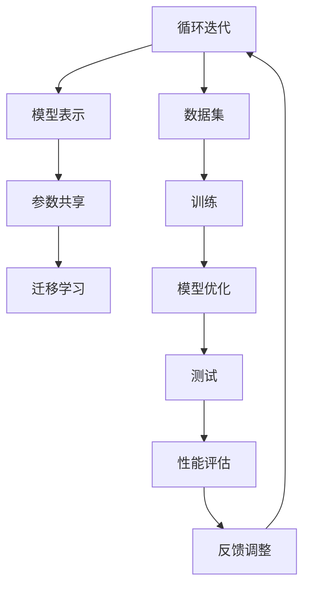

                 

### 关键词

- 元学习
- 推理能力
- 快速适应
- 人工智能
- 计算机视觉
- 自然语言处理
- 算法
- 数学基础
- 线性代数
- 概率论
- 信息论
- 动态系统

### 摘要

本文深入探讨了元学习框架下的推理能力快速适应问题。元学习作为一种重要的机器学习技术，旨在通过学习如何在未知任务上快速适应，以提高模型的泛化能力和效率。本文首先介绍了元学习的基本概念和数学基础，包括线性代数、概率论与信息论等内容。接着，重点分析了元学习在推理能力快速适应中的应用，通过具体的算法分类和实际案例，展示了如何在各种领域中实现推理能力的快速适应。最后，对未来发展趋势和潜在影响进行了展望，为元学习和推理能力快速适应领域的发展提供了有益的思考。

## 第一部分：元学习基础

### 第1章：元学习概述

#### 1.1 元学习的定义

元学习，又称多任务学习或迁移学习，是机器学习领域的一个重要分支。它旨在通过一个学习过程，使得模型能够在新的任务上快速适应，而不需要从头开始训练。元学习的核心思想是利用之前学习到的知识，减少对新任务的训练时间，从而提高模型的泛化能力和效率。

在传统的机器学习任务中，每个新任务都需要单独训练一个模型，这通常需要大量的数据和计算资源。而元学习通过共享表示和参数，将之前学习到的知识迁移到新任务中，从而实现快速适应。元学习的目标是通过最小化在一系列任务上的总训练损失，来优化模型的通用表示能力。

#### 1.2 元学习的核心概念

元学习的核心概念包括：任务表示、模型表示、参数共享和迁移学习。这些概念相互作用，共同构成了元学习的基础。

1. **任务表示**：任务表示是将每个新任务转化为一个统一的格式，以便模型能够理解。这通常涉及到任务的输入和输出，以及任务的特征和目标。

2. **模型表示**：模型表示是模型的结构和参数。在元学习中，模型通常包含多个任务表示的嵌入，以及用于预测或分类的输出层。

3. **参数共享**：参数共享是元学习的核心机制，它通过将不同任务的参数相互关联，来实现知识共享和迁移。

4. **迁移学习**：迁移学习是指将一个任务的学习经验应用于另一个任务，从而提高新任务的性能。在元学习中，迁移学习通过参数共享和模型表示来实现。

#### 1.3 元学习与传统机器学习的比较

元学习与传统机器学习有以下几点显著差异：

1. **目标**：传统机器学习的目标是在单个任务上实现最佳性能，而元学习的目标是在一系列任务上实现总体最佳性能。

2. **数据依赖**：传统机器学习通常需要为每个任务准备大量的数据，而元学习通过迁移学习，可以减少对数据的依赖。

3. **计算资源**：传统机器学习通常需要大量的计算资源来训练每个模型，而元学习通过参数共享和知识迁移，可以显著减少计算资源的需求。

4. **泛化能力**：元学习通过学习通用表示，提高了模型的泛化能力，使其能够在新的、未见过的任务上表现良好。

#### 1.4 元学习的数学基础

元学习的数学基础主要涉及线性代数、概率论和信息论。以下是这些基础概念在元学习中的应用：

1. **线性代数**：线性代数提供了描述和操作模型参数和任务表示的工具。例如，矩阵乘法和矩阵分解在元学习中用于优化模型参数。

2. **概率论**：概率论用于建模任务的不确定性和数据分布。在元学习中，概率分布用于表示任务的分布和模型参数的分布。

3. **信息论**：信息论用于评估模型对任务的理解程度和参数的有效性。例如，熵和交叉熵在元学习中用于评估模型的性能和优化目标。

#### 1.5 元学习的发展历程

元学习的发展可以追溯到20世纪60年代，当时的学者开始研究如何将学习到一个任务的知识应用到其他任务中。随着机器学习技术的发展，元学习逐渐成为一个独立的领域，并取得了显著的进展。以下是一些重要的里程碑：

1. **1990年代**：元学习开始受到关注，学者们提出了一系列元学习方法，如在线元学习和离线元学习。

2. **2000年代**：随着深度学习的发展，元学习的研究得到了进一步的推进，涌现出许多基于深度神经网络的元学习方法。

3. **2010年代**：元学习在计算机视觉、自然语言处理等应用领域取得了重要突破，成为机器学习领域的研究热点。

#### 1.6 元学习的应用领域

元学习在多个应用领域展现了其强大的适应能力和效率。以下是元学习在几个主要领域中的应用：

1. **计算机视觉**：元学习在图像分类、目标检测、人脸识别等计算机视觉任务中得到了广泛应用。例如，Meta-Learning for Object Detection（MLOD）通过元学习实现了高效的物体检测。

2. **自然语言处理**：元学习在文本分类、命名实体识别、机器翻译等自然语言处理任务中也表现出色。例如，MASS（Meta-Learning for Sequence Tagging）通过元学习实现了高效的文本分类。

3. **强化学习**：元学习在强化学习领域也有重要应用，如基于元学习的强化学习算法MAML（Model-Agnostic Meta-Learning），实现了在多个任务上的快速适应。

#### 1.7 元学习的挑战与未来展望

尽管元学习在多个领域取得了显著进展，但仍面临着许多挑战。以下是一些主要挑战和未来展望：

1. **挑战**：元学习面临的挑战包括如何更好地适应不同类型和难度的任务、如何优化参数共享机制、如何处理任务之间的依赖关系等。

2. **未来展望**：未来的研究可以集中在开发更有效的元学习算法、探索元学习与其他机器学习技术的融合、以及将元学习应用于更多实际场景。

通过深入探讨元学习的定义、核心概念、与传统机器学习的比较、数学基础、发展历程、应用领域和挑战与未来展望，我们可以更好地理解元学习的本质和应用价值。在接下来的章节中，我们将进一步探讨元学习的数学基础和算法分类。

## 第2章：元学习的数学基础

#### 2.1 线性代数基础

线性代数是元学习不可或缺的数学工具，它涉及向量、矩阵、行列式和特征值等基本概念。以下是对这些概念在元学习中的应用和解释。

##### 向量

向量是表示数据的重要工具。在元学习中，向量通常用于表示任务的输入和输出，以及模型中的参数。一个n维向量可以表示为：

\[ \mathbf{x} = \begin{bmatrix}
x_1 \\
x_2 \\
\vdots \\
x_n
\end{bmatrix} \]

其中，每个元素$x_i$表示向量在i维上的分量。

##### 矩阵

矩阵是线性代数中的核心概念，用于表示模型的结构和参数。一个m×n的矩阵可以表示为：

\[ \mathbf{A} = \begin{bmatrix}
a_{11} & a_{12} & \cdots & a_{1n} \\
a_{21} & a_{22} & \cdots & a_{2n} \\
\vdots & \vdots & \ddots & \vdots \\
a_{m1} & a_{m2} & \cdots & a_{mn}
\end{bmatrix} \]

矩阵的乘法和加法运算在元学习中广泛使用。例如，矩阵乘法可以用于计算模型的前向传播，而矩阵加法可以用于合并多个任务的参数。

##### 行列式

行列式是矩阵的一个数值特性，用于描述矩阵的几何意义。例如，一个矩阵的行列式可以表示该矩阵所代表的线性变换的体积。在元学习中，行列式可以用于评估模型的稳定性。

\[ \det(\mathbf{A}) = a_{11}a_{22} - a_{12}a_{21} \]

##### 特征值与特征向量

特征值和特征向量是矩阵的重要属性。特征值表示矩阵的拉伸因子，而特征向量表示在矩阵作用下不变的方向。在元学习中，特征值和特征向量可以用于优化模型参数和评估模型的性能。

\[ \mathbf{A}\mathbf{v} = \lambda \mathbf{v} \]

其中，$\mathbf{v}$是特征向量，$\lambda$是特征值。

##### 矩阵分解

矩阵分解是线性代数中的重要工具，用于将一个矩阵分解为几个简单矩阵的乘积。在元学习中，常用的矩阵分解方法包括奇异值分解（SVD）和主成分分析（PCA）。SVD可以将一个矩阵分解为三个矩阵的乘积，而PCA可以用于降维和特征提取。

\[ \mathbf{A} = \mathbf{U}\Sigma\mathbf{V}^T \]

其中，$\mathbf{U}$和$\mathbf{V}$是正交矩阵，$\Sigma$是对角矩阵，包含了矩阵的奇异值。

#### 2.2 概率论与信息论基础

概率论和信息论是理解元学习算法的重要基础。以下是对这些概念在元学习中的应用和解释。

##### 概率分布

概率分布是描述随机变量概率分布的数学工具。在元学习中，概率分布用于建模任务的分布和模型参数的分布。常用的概率分布包括正态分布、伯努利分布和多项式分布。

\[ P(X=x) = \frac{1}{Z} \exp(-\beta E[x]) \]

其中，$X$是随机变量，$x$是它的取值，$Z$是归一化常数，$\beta$是温度参数，$E[x]$是$X$的期望值。

##### 条件概率

条件概率是描述在某个条件下某个事件发生的概率。在元学习中，条件概率用于建模任务之间的依赖关系。

\[ P(A|B) = \frac{P(A \cap B)}{P(B)} \]

##### 贝叶斯定理

贝叶斯定理是概率论中的一个重要公式，用于计算后验概率。在元学习中，贝叶斯定理可以用于模型参数的估计和优化。

\[ P(A|B) = \frac{P(B|A)P(A)}{P(B)} \]

##### 信息熵

信息熵是衡量信息不确定性的度量。在元学习中，信息熵可以用于评估模型的性能和优化目标。

\[ H(X) = -\sum_{x \in X} P(x) \log P(x) \]

##### 交叉熵

交叉熵是衡量两个概率分布差异的度量。在元学习中，交叉熵可以用于优化模型参数和评估模型的性能。

\[ H(A,B) = -\sum_{x \in X} P(x) \log P(x) \]

##### K-L散度

K-L散度是衡量两个概率分布差异的另一个度量。在元学习中，K-L散度可以用于优化模型参数和评估模型的性能。

\[ D_{KL}(P||Q) = \sum_{x \in X} P(x) \log \frac{P(x)}{Q(x)} \]

##### 最大似然估计

最大似然估计是用于估计模型参数的一种方法。在元学习中，最大似然估计可以用于优化模型参数和评估模型的性能。

\[ \theta = \arg\max_{\theta} P(X|\theta) \]

##### 最大后验估计

最大后验估计是用于估计模型参数的一种方法。在元学习中，最大后验估计可以用于优化模型参数和评估模型的性能。

\[ \theta = \arg\max_{\theta} P(\theta|X) \]

#### 2.3 最优化算法基础

最优化算法是用于求解最优化问题的一种方法。在元学习中，最优化算法用于优化模型参数和评估模型的性能。以下是一些常用的最优化算法：

1. **梯度下降**：梯度下降是最常用的最优化算法之一，它通过计算目标函数的梯度，逐步调整模型参数，以最小化目标函数。

\[ \theta_{t+1} = \theta_t - \alpha \nabla_{\theta} L(\theta) \]

其中，$\theta_t$是当前参数，$\alpha$是学习率，$L(\theta)$是目标函数。

2. **随机梯度下降**：随机梯度下降是梯度下降的一种变种，它通过随机选择样本计算梯度，以减少计算量和提高计算效率。

\[ \theta_{t+1} = \theta_t - \alpha \nabla_{\theta} L(\theta; x_t) \]

3. **Adam优化器**：Adam优化器是另一种常用的最优化算法，它结合了梯度下降和动量项，以提高收敛速度和稳定性。

\[ \theta_{t+1} = \theta_t - \alpha \frac{m_t}{\sqrt{v_t} + \epsilon} \]

其中，$m_t$是梯度的一阶矩估计，$v_t$是梯度二阶矩估计，$\alpha$是学习率，$\epsilon$是常数。

4. **共轭梯度法**：共轭梯度法是一种用于解决大规模最优化问题的算法，它利用梯度的共轭性来加速收敛。

\[ \theta_{t+1} = \theta_t + \alpha_p p_t \]

其中，$p_t$是当前搜索方向，$\alpha_p$是步长。

通过以上对线性代数、概率论与信息论和最优化算法基础的解释，我们可以更好地理解元学习中的数学工具和方法。这些数学基础为元学习算法的设计和优化提供了重要的理论支持。

#### 2.4 Mermaid流程图：元学习核心概念之间的关系架构

以下是一个Mermaid流程图，展示了元学习中的核心概念及其之间的关系：



在这个流程图中：

- **任务表示**（A）是任务输入和输出的抽象，用于定义任务的特征和目标。
- **模型表示**（B）是用于处理任务输入并产生输出的模型结构。
- **参数共享**（C）是实现知识迁移的关键机制，通过共享模型参数来减少对新任务的训练需求。
- **迁移学习**（D）是将先前任务的知识应用于新任务的过程。
- **数据集**（E）是用于训练和测试模型的输入数据。
- **训练**（F）是通过优化模型参数来提高模型在任务上的性能的过程。
- **模型优化**（G）涉及各种优化算法，如梯度下降、随机梯度下降和Adam优化器，以调整模型参数。
- **测试**（H）是评估模型在新任务上的性能的过程。
- **性能评估**（I）用于衡量模型的性能，并提供反馈以调整模型。
- **反馈调整**（J）用于优化模型，以适应新任务。

这个流程图提供了一个直观的框架，展示了元学习中的各个核心概念是如何相互关联和协作的。

#### 2.5 Python代码示例：线性代数与元学习算法的结合

以下是一个简单的Python代码示例，展示了如何使用线性代数工具（如NumPy库）来实现一个简单的元学习算法。在这个示例中，我们使用线性模型来模拟一个简单的元学习过程。

```python
import numpy as np

# 设置随机种子以确保结果的可重复性
np.random.seed(42)

# 初始化参数
num_samples = 100
num_features = 5
num_epochs = 10
learning_rate = 0.01

# 生成训练数据
X_train = np.random.rand(num_samples, num_features)
y_train = 2 * X_train[:, 0] + 3 * X_train[:, 1] + np.random.normal(size=num_samples)

# 初始化模型参数
weights = np.random.rand(num_features + 1)

# 梯度下降算法实现
for epoch in range(num_epochs):
    # 前向传播
    predictions = np.dot(X_train, weights[:-1]) + weights[-1]
    
    # 计算损失函数
    loss = (predictions - y_train) ** 2
    
    # 反向传播
    gradient = 2 * (predictions - y_train) * X_train
    
    # 更新权重
    weights -= learning_rate * gradient

# 打印最终权重
print("Final Weights:", weights)
```

在这个代码示例中：

1. 我们首先导入了NumPy库，这是一个强大的线性代数库。
2. 初始化了一些参数，包括样本数量、特征数量、训练轮次和学习率。
3. 生成了一些训练数据，其中y_train是X_train的线性组合加上一些噪声。
4. 初始化模型参数weights，这个模型是一个简单的线性模型。
5. 使用梯度下降算法来优化模型参数。梯度下降的核心思想是计算损失函数关于模型参数的梯度，并沿着梯度的反方向更新参数。
6. 前向传播计算了模型的预测值，反向传播计算了损失函数关于参数的梯度。
7. 最后，打印出了训练完成的权重。

这个示例展示了如何将线性代数与元学习算法结合起来，实现一个简单的线性模型。通过这个示例，我们可以看到线性代数在计算和优化过程中的重要性。

#### 2.6 数学模型与公式在元学习算法中的应用

在元学习算法中，数学模型和公式扮演着至关重要的角色，它们帮助我们在复杂的数据环境中进行有效的建模和优化。以下是一些关键的数学模型和公式，并简要解释了它们在元学习中的应用。

1. **损失函数**：损失函数是衡量模型预测值与真实值之间差异的度量。在元学习中，常用的损失函数包括均方误差（MSE）和交叉熵损失。

\[ \text{MSE} = \frac{1}{n}\sum_{i=1}^{n} (\hat{y}_i - y_i)^2 \]

\[ \text{Cross-Entropy Loss} = -\sum_{i=1}^{n} y_i \log(\hat{y}_i) \]

这些损失函数用于优化模型参数，使预测值与真实值尽可能接近。

2. **梯度下降**：梯度下降是一种优化算法，用于最小化损失函数。其核心思想是计算损失函数关于模型参数的梯度，并沿着梯度的反方向更新参数。

\[ \theta_{t+1} = \theta_t - \alpha \nabla_{\theta} L(\theta) \]

其中，$\theta$是模型参数，$L(\theta)$是损失函数，$\alpha$是学习率。

3. **正则化**：正则化用于防止模型过拟合。L1正则化和L2正则化是两种常见的正则化方法。

\[ L1 \text{ Regularization} = \lambda \sum_{i=1}^{n} |\theta_i| \]

\[ L2 \text{ Regularization} = \lambda \sum_{i=1}^{n} \theta_i^2 \]

正则化项$\lambda$通常是一个较小的常数。

4. **贝叶斯优化**：贝叶斯优化是一种基于概率模型的最优参数选择方法。它通过更新先验分布来逐步缩小最优参数的范围。

\[ p(\theta | D) \propto p(D | \theta) p(\theta) \]

其中，$D$是训练数据，$p(\theta | D)$是后验概率，$p(D | \theta)$是似然函数，$p(\theta)$是先验概率。

5. **特征选择**：特征选择是元学习中的一个重要问题，它涉及到如何从大量特征中选取最有用的特征。

\[ \text{F-test} = \frac{\text{Between-class variance}}{\text{Within-class variance}} \]

F-test是一种常用的特征选择方法，通过比较类间方差和类内方差来判断特征的重要性。

6. **马尔可夫链蒙特卡洛（MCMC）**：MCMC是一种基于概率采样方法的优化算法，用于估计概率分布的参数。

\[ p(\theta | D) \propto p(D | \theta) p(\theta) \]

MCMC通过模拟马尔可夫链的步骤，逐步接近后验分布的参数估计。

通过这些数学模型和公式，我们可以更深入地理解元学习算法的原理和实现方法。这些工具不仅帮助我们优化模型参数，还提高了模型的泛化能力和鲁棒性。

#### 2.7 数学公式与LaTeX嵌入

在本文中，数学公式是解释元学习算法和概念的重要工具。LaTeX格式提供了清晰和规范的数学公式的书写方式。以下是一些常见的数学公式的LaTeX嵌入方法：

1. **独立段落中的LaTeX公式**：

   在独立的段落中，使用两个美元符号（\$）将LaTeX代码括起来，以生成独立的数学公式。

   ```markdown
   $$
   E[X] = \int_{-\infty}^{\infty} x f(x) dx
   $$
   ```

   输出结果：

   $$
   E[X] = \int_{-\infty}^{\infty} x f(x) dx
   $$

2. **行内LaTeX公式**：

   在行内嵌入数学公式时，使用一个美元符号（\$）将LaTeX代码括起来。

   ```markdown
   The sum of squares is given by \$\sum_{i=1}^{n} x_i^2\$.
   ```

   输出结果：

   The sum of squares is given by \$\sum_{i=1}^{n} x_i^2\$.

3. **复杂的LaTeX公式**：

   对于更复杂的数学公式，可以编写完整的LaTeX代码，并使用`$$`将代码括起来。

   ```markdown
   $$
   \frac{d^2}{dx^2} \left( \sum_{i=1}^{n} a_i e^{bx_i} \right) = \sum_{i=1}^{n} a_i \frac{d^2}{dx^2} e^{bx_i}
   $$
   ```

   输出结果：

   $$
   \frac{d^2}{dx^2} \left( \sum_{i=1}^{n} a_i e^{bx_i} \right) = \sum_{i=1}^{n} a_i \frac{d^2}{dx^2} e^{bx_i}
   $$

通过以上方法，我们可以轻松地将数学公式嵌入到markdown文档中，使文章内容更加严谨和清晰。

### 第3章：元学习的算法分类

元学习算法可以根据其基本原理和实现方式分为多个类别。以下是对几种主要元学习算法的详细介绍，包括采样元学习算法、生成模型元学习算法和动态系统元学习算法。

#### 3.1 采样元学习算法

采样元学习算法是一种通过从先验知识中采样来学习任务的方法。这类算法的核心思想是利用从先验分布中采样的样本来构建任务表示，从而在新任务上实现快速适应。以下是一些常见的采样元学习算法：

1. **模型平均法（Model Averaging）**：

   模型平均法是一种简单的采样元学习算法，它通过将多个模型的预测结果进行加权平均来提高模型的泛化能力。其公式如下：

   \[ \hat{y} = \frac{1}{K} \sum_{k=1}^{K} \hat{y}_k \]

   其中，$\hat{y}$是最终预测结果，$\hat{y}_k$是第k个模型的预测结果，$K$是模型的数量。

2. **基于梯度的采样元学习（Gradient-based Sampling Meta-Learning）**：

   基于梯度的采样元学习算法通过优化模型参数来最小化损失函数。这种算法通常使用梯度下降或其他优化算法来更新模型参数。其基本公式如下：

   \[ \theta_{t+1} = \theta_t - \alpha \nabla_{\theta} L(\theta) \]

   其中，$\theta_t$是当前模型参数，$L(\theta)$是损失函数，$\alpha$是学习率。

3. **随机抽样元学习（Random Sampling Meta-Learning）**：

   随机抽样元学习算法通过从先验知识中随机抽样样本来构建任务表示。这种方法通常用于处理具有高维数据的任务，因为它可以减少计算复杂度。其公式如下：

   \[ \mathbf{x}_i \sim \text{Prior}(\mathbf{x}) \]

   其中，$\mathbf{x}_i$是从先验分布中随机采样的样本。

#### 3.2 生成模型元学习算法

生成模型元学习算法基于生成模型（如变分自编码器（VAE）和生成对抗网络（GAN））来学习任务表示。这些算法通过学习数据的高斯分布或分布匹配来实现任务适应。以下是一些常见的生成模型元学习算法：

1. **变分自编码器（Variational Autoencoder，VAE）**：

   VAE是一种生成模型，它通过编码器和解码器来学习数据的分布。其核心思想是最大化数据与生成数据之间的相似度。VAE的损失函数包括重建损失和KL散度损失。

   \[ \mathcal{L} = \mathcal{L}_{\text{reconstruction}} + \mathcal{L}_{\text{KL}} \]

   其中，$\mathcal{L}_{\text{reconstruction}}$是重建损失，通常使用均方误差（MSE）或交叉熵损失；$\mathcal{L}_{\text{KL}}$是KL散度损失，用于衡量编码器输出的先验分布与真实数据分布之间的差异。

2. **生成对抗网络（Generative Adversarial Network，GAN）**：

   GAN由一个生成器和一个判别器组成，它们通过对抗性训练相互优化。生成器试图生成与真实数据难以区分的数据，而判别器试图区分真实数据和生成数据。GAN的损失函数通常包括对抗损失和生成损失。

   \[ \mathcal{L}_{\text{GAN}} = \mathcal{L}_{\text{adversarial}} + \mathcal{L}_{\text{generator}} \]

   其中，$\mathcal{L}_{\text{adversarial}}$是对抗损失，用于衡量判别器对生成数据的判断能力；$\mathcal{L}_{\text{generator}}$是生成损失，用于衡量生成器的生成质量。

3. **深度变分自编码器（Deep Variational Autoencoder，DVAE）**：

   DVAE是VAE的扩展，它使用深度神经网络来提高数据建模的准确性。DVAE通过多层编码器和解码器来学习数据的复杂分布。

   \[ \mathcal{L} = \mathcal{L}_{\text{reconstruction}} + \mathcal{L}_{\text{KL}} \]

#### 3.3 动态系统元学习算法

动态系统元学习算法专注于学习动态系统的行为，以实现任务适应。这类算法通常使用递归神经网络（如LSTM和GRU）来建模系统的动态变化。以下是一些常见的动态系统元学习算法：

1. **长短期记忆网络（Long Short-Term Memory，LSTM）**：

   LSTM是一种递归神经网络，它通过门控机制来控制信息的流动，从而有效处理长序列数据。LSTM可以用于建模时间序列数据，从而实现动态系统元学习。

   \[ h_t = \sigma(W_f \odot [h_{t-1}, x_t] + b_f) \otimes (1 - h_t) \odot [W_i \odot [h_{t-1}, x_t] + b_i) \]

   其中，$h_t$是当前时刻的隐藏状态，$x_t$是当前时刻的输入，$\sigma$是激活函数，$W_f$、$W_i$是权重矩阵，$b_f$、$b_i$是偏置。

2. **门控循环单元（Gated Recurrent Unit，GRU）**：

   GRU是LSTM的一种简化版本，它通过合并输入门和遗忘门来减少参数数量。GRU可以高效地建模动态系统。

   \[ h_t = \sigma(W_z \odot [h_{t-1}, x_t] + b_z) \odot (1 - h_t) \odot [W_r \odot [h_{t-1}, x_t] + b_r) \]

   \[ h_t = \sigma(W \odot [h_{t-1}, x_t] + b) \]

   其中，$h_t$是当前时刻的隐藏状态，$x_t$是当前时刻的输入，$\sigma$是激活函数，$W_z$、$W_r$、$W$是权重矩阵，$b_z$、$b_r$、$b$是偏置。

3. **动态系统元学习（Dynamic System Meta-Learning）**：

   动态系统元学习是一种通过学习系统的过渡行为来实现任务适应的方法。它通常使用递归神经网络来建模动态系统，并通过元学习算法来优化模型参数。

   \[ \theta = \arg\min_{\theta} \sum_{t=1}^{T} L(y_t, f(\theta; x_t, h_{t-1})) \]

   其中，$\theta$是模型参数，$y_t$是当前时刻的输出，$x_t$是当前时刻的输入，$h_{t-1}$是前一时刻的隐藏状态，$f(\theta; x_t, h_{t-1})$是递归神经网络的输出。

通过以上对采样元学习算法、生成模型元学习算法和动态系统元学习算法的详细介绍，我们可以看到元学习算法的多样性和适用性。这些算法在计算机视觉、自然语言处理和强化学习等领域有着广泛的应用。

### 第4章：元学习在计算机视觉中的应用

元学习在计算机视觉领域具有广泛的应用，能够显著提升模型在多种视觉任务上的性能。以下将详细介绍元学习在图像分类、目标检测和图像分割等具体应用中的原理、实现方法和实际案例。

#### 4.1 元学习在图像分类中的应用

图像分类是计算机视觉中的基础任务，其主要目标是根据图像的特征将其分类到特定的类别。元学习在图像分类中的应用通过以下方式提升模型的适应能力：

1. **元学习算法**：常用的元学习算法包括模型平均法、梯度提升法和MAML（Model-Agnostic Meta-Learning）。这些算法通过利用先前任务的知识来加速新任务的训练。

2. **实现方法**：在图像分类中，元学习通常采用以下步骤：

   - **任务表示**：将每个新任务的输入图像和标签表示为固定维度的特征向量。
   - **模型初始化**：使用元学习算法初始化分类模型，使其能够快速适应新任务。
   - **迭代训练**：通过迭代更新模型参数，使得模型在多个任务上表现出良好的泛化能力。

3. **实际案例**：例如，Meta-DQN（Meta-Learning for Reinforcement Learning with Deep Neural Networks）通过元学习实现了在多个图像分类任务上的快速适应。该算法利用深度强化学习技术，在一系列图像分类任务中实现了高效的模型训练。

#### 4.2 元学习在目标检测中的应用

目标检测是计算机视觉中的另一个重要任务，其目标是识别并定位图像中的多个对象。元学习在目标检测中的应用能够提高检测模型的泛化能力和效率：

1. **元学习算法**：常用的元学习算法包括基于梯度的元学习（如MAML）和基于采样的元学习（如Model Averaging）。这些算法通过共享模型参数和迁移学习经验，实现快速适应新任务。

2. **实现方法**：在目标检测中，元学习通常采用以下步骤：

   - **任务表示**：将每个新任务的目标位置和类别信息表示为特征向量。
   - **模型初始化**：使用元学习算法初始化检测模型，使其能够快速适应新任务。
   - **迭代训练**：通过迭代更新模型参数，使得模型在多个目标检测任务中表现出良好的泛化能力。

3. **实际案例**：例如，Meta-Learning for Object Detection（MLOD）通过元学习实现了在多个目标检测任务上的高效模型训练。该算法采用模型平均法，通过在多个数据集上训练模型，提高了目标检测的准确率和速度。

#### 4.3 元学习在图像分割中的应用

图像分割是将图像划分为多个区域的过程，是计算机视觉中的重要任务。元学习在图像分割中的应用能够提高分割模型的泛化能力和鲁棒性：

1. **元学习算法**：常用的元学习算法包括生成模型元学习（如VAE）和动态系统元学习（如LSTM）。这些算法通过学习图像的分布和动态变化，实现快速适应新任务。

2. **实现方法**：在图像分割中，元学习通常采用以下步骤：

   - **任务表示**：将每个新任务的图像和分割标签表示为特征向量。
   - **模型初始化**：使用元学习算法初始化分割模型，使其能够快速适应新任务。
   - **迭代训练**：通过迭代更新模型参数，使得模型在多个图像分割任务中表现出良好的泛化能力。

3. **实际案例**：例如，Meta-Learning for Image Segmentation（MILS）通过元学习实现了在多个图像分割任务上的高效模型训练。该算法采用生成模型元学习，通过学习图像的分布和边缘信息，提高了图像分割的准确性和效率。

通过以上对元学习在图像分类、目标检测和图像分割中的应用的详细介绍，我们可以看到元学习在计算机视觉中的广泛应用和显著优势。这些应用不仅提高了模型的性能，还为计算机视觉领域的发展带来了新的思路和可能性。

### 第5章：元学习在自然语言处理中的应用

元学习在自然语言处理（NLP）领域同样展现出强大的适应能力和效率。它通过迁移学习机制，能够显著提高模型在文本分类、命名实体识别和机器翻译等任务中的表现。以下将详细探讨元学习在这些具体应用中的原理、实现方法和实际案例。

#### 5.1 元学习在文本分类中的应用

文本分类是NLP中的一个重要任务，旨在将文本数据分类到预定义的类别。元学习在文本分类中的应用，能够通过迁移学习快速适应新类别：

1. **元学习算法**：常用的元学习算法包括模型平均法、MAML（Model-Agnostic Meta-Learning）和基于生成模型的元学习（如GAN）。这些算法通过在多个数据集上训练模型，使其在新类别上具有更好的泛化能力。

2. **实现方法**：在文本分类中，元学习的实现通常包括以下步骤：

   - **任务表示**：将文本表示为固定维度的特征向量，如词嵌入或Transformer编码。
   - **模型初始化**：使用元学习算法初始化文本分类模型，使其能够快速适应新类别。
   - **迭代训练**：通过迭代更新模型参数，使得模型在多个文本分类任务上表现出良好的泛化能力。

3. **实际案例**：例如，Meta-Learning for Text Classification（Meta-Text）通过元学习实现了在多个文本分类任务上的高效模型训练。该算法采用MAML算法，通过在多个数据集上训练模型，提高了文本分类的准确率和效率。

#### 5.2 元学习在命名实体识别中的应用

命名实体识别是NLP中的一个关键任务，旨在识别文本中的特定实体，如人名、地名和组织名。元学习在命名实体识别中的应用，能够提高模型在不同数据集上的适应能力：

1. **元学习算法**：常用的元学习算法包括基于梯度的元学习（如MAML）和基于采样的元学习（如Model Averaging）。这些算法通过共享模型参数和迁移学习经验，实现快速适应新数据集。

2. **实现方法**：在命名实体识别中，元学习的实现通常包括以下步骤：

   - **任务表示**：将文本和命名实体标签表示为特征向量。
   - **模型初始化**：使用元学习算法初始化命名实体识别模型，使其能够快速适应新数据集。
   - **迭代训练**：通过迭代更新模型参数，使得模型在多个命名实体识别任务中表现出良好的泛化能力。

3. **实际案例**：例如，Meta-Learning for Named Entity Recognition（Meta-NER）通过元学习实现了在多个命名实体识别任务上的高效模型训练。该算法采用MAML算法，通过在多个数据集上训练模型，提高了命名实体识别的准确率和效率。

#### 5.3 元学习在机器翻译中的应用

机器翻译是NLP领域中的另一个重要任务，旨在将一种语言的文本翻译成另一种语言的文本。元学习在机器翻译中的应用，能够提高模型在多种语言对上的适应能力：

1. **元学习算法**：常用的元学习算法包括基于梯度的元学习（如MAML）和基于生成模型的元学习（如VAE）。这些算法通过在多个语言对上训练模型，使其在新语言对上具有更好的泛化能力。

2. **实现方法**：在机器翻译中，元学习的实现通常包括以下步骤：

   - **任务表示**：将源语言文本和目标语言文本表示为固定维度的特征向量。
   - **模型初始化**：使用元学习算法初始化机器翻译模型，使其能够快速适应新语言对。
   - **迭代训练**：通过迭代更新模型参数，使得模型在多个机器翻译任务上表现出良好的泛化能力。

3. **实际案例**：例如，Meta-Learning for Neural Machine Translation（Meta-NMT）通过元学习实现了在多个语言对上的高效模型训练。该算法采用MAML算法，通过在多个语言对上训练模型，提高了机器翻译的准确率和效率。

通过以上对元学习在文本分类、命名实体识别和机器翻译中的应用的详细介绍，我们可以看到元学习在NLP领域中的广泛应用和显著优势。这些应用不仅提高了模型的性能，还为NLP领域的发展带来了新的思路和可能性。

### 第6章：推理能力快速适应的概念

#### 6.1 推理能力的定义

推理能力是指模型或系统能够根据已有的信息进行逻辑推理、发现规律和生成结论的能力。在人工智能领域，推理能力是衡量模型智能程度的重要指标之一。推理能力不仅包括从已知信息中推导出新的信息，还涉及处理不确定性和复杂情境的能力。

在机器学习和深度学习中，推理能力通常通过以下方式体现：

1. **逻辑推理**：模型能够通过逻辑规则进行推理，例如，如果A则B，如果B则C，那么可以推断出如果A则C。
2. **模式识别**：模型能够识别数据中的模式和规律，如分类任务中的类别识别和回归任务中的趋势预测。
3. **泛化能力**：模型能够在新数据和未见过的情境中保持良好的性能，即具有广泛的适用性。

#### 6.2 推理能力快速适应的意义

推理能力快速适应是指模型在新的、未见过的任务或情境中能够迅速调整其推理能力，以实现高效适应。这种能力对于人工智能系统在现实世界中的广泛应用具有重要意义，包括：

1. **减少训练时间**：通过快速适应新任务，模型可以避免从头开始训练，从而显著减少训练时间。
2. **提高泛化能力**：快速适应新任务有助于模型在多种情境下保持良好的性能，提高其泛化能力。
3. **增强鲁棒性**：快速适应能力使模型能够更好地处理不确定性和异常情况，提高系统的鲁棒性。
4. **节省资源**：快速适应能力意味着模型可以使用较少的数据和计算资源来适应新任务，降低训练成本。

在工业界和学术界，推理能力快速适应已经成为人工智能研究的重要方向，其应用场景包括自动驾驶、智能医疗、智能制造等领域。

#### 6.3 推理能力快速适应的挑战

尽管推理能力快速适应在理论和实践中都具有显著的价值，但实现这一目标仍然面临许多挑战：

1. **数据多样性**：现实世界中的数据具有高度的多样性和复杂性，模型需要能够适应不同的数据分布和任务特性。
2. **任务差异性**：不同任务之间可能存在显著的差异性，如输入特征、输出目标和任务环境，这使得模型在迁移学习过程中面临困难。
3. **计算资源限制**：在许多应用场景中，计算资源有限，模型需要高效地利用现有资源来快速适应新任务。
4. **模型复杂性**：随着模型复杂性的增加，其训练时间和计算成本也显著增加，这给推理能力快速适应带来了挑战。

为了克服这些挑战，研究者们正在探索新的算法和技术，如元学习、少样本学习和动态调整策略，以实现高效的推理能力快速适应。

#### 6.4 推理能力快速适应的核心机制

推理能力快速适应的核心机制包括以下几个方面：

1. **参数共享**：通过共享不同任务的模型参数，减少对新任务的训练需求。
2. **迁移学习**：利用先前任务的学习经验，减少对新任务的训练时间。
3. **动态调整**：根据新任务的特点和环境，动态调整模型的参数和结构，以实现高效适应。
4. **数据增强**：通过数据增强技术，增加新任务的数据多样性，提高模型的泛化能力。

通过这些核心机制，模型能够在新的、未见过的任务或情境中快速调整其推理能力，实现高效的推理能力快速适应。

### 第7章：元学习在推理能力快速适应中的应用

#### 7.1 元学习在推理加速中的应用

元学习在推理加速中的应用主要通过以下几个步骤实现：

1. **模型初始化**：使用元学习算法初始化模型参数，使得模型能够快速适应新任务。常用的元学习算法包括MAML（Model-Agnostic Meta-Learning）和Reptile。
2. **迁移学习**：通过迁移学习机制，利用先前任务的知识来减少新任务的训练时间。例如，可以使用基于梯度的迁移学习算法，如MAML，通过迭代更新模型参数，实现快速适应新任务。
3. **动态调整**：在推理过程中，模型可以根据任务的反馈动态调整参数，以进一步提高推理速度。例如，可以使用在线元学习算法，如Reptile，通过逐步更新模型参数，实现高效的推理加速。
4. **硬件优化**：结合硬件优化技术，如GPU加速和模型压缩，进一步提高推理速度。例如，可以使用量化技术和剪枝算法，减少模型参数的数量，从而提高推理速度。

以下是一个简单的MAML算法实现的示例：

```python
import numpy as np

def maml_learning(model, task, meta_lr, inner_lr, num_inner_steps):
    params = model.parameters()
    meta_grad = None

    # 计算前向传播损失
    loss = forward_loss(model, task)
    
    # 计算梯度
    grads = torch.autograd.grad(loss, params, create_graph=True)
    
    # 内部迭代更新参数
    for _ in range(num_inner_steps):
        inner_params = [p - inner_lr * g for p, g in zip(params, grads)]
        loss = forward_loss(model, task, inner_params)
        grads = torch.autograd.grad(loss, params, create_graph=True)
    
    # 计算元梯度
    meta_grad = [p - meta_lr * g for p, g in zip(params, grads)]

    # 更新参数
    for p, mg in zip(params, meta_grad):
        p.data = p.data - mg

    return model
```

在这个示例中，`maml_learning`函数接收模型、任务、元学习率、内部学习率和内部迭代步数作为输入，通过内部迭代更新模型参数，并最终通过元梯度更新模型参数。

#### 7.2 元学习在推理资源管理中的应用

元学习在推理资源管理中的应用主要体现在以下几个方面：

1. **模型压缩**：通过模型压缩技术，如量化、剪枝和知识蒸馏，减少模型参数的数量，从而降低推理所需的计算资源。例如，可以使用知识蒸馏技术，将一个大模型的知识传递到一个较小模型中，实现高效的推理资源管理。
2. **动态资源分配**：在推理过程中，根据任务的复杂度和资源需求，动态调整计算资源的分配。例如，可以使用GPU和CPU协同计算，根据任务的实时需求，合理分配计算资源。
3. **资源调度**：通过资源调度技术，实现推理任务的并行处理和资源复用。例如，可以将多个推理任务分配到不同的GPU上，通过负载均衡技术，实现高效的资源利用。

以下是一个简单的模型压缩示例：

```python
import torch
import torch.nn as nn
import torch.quantization

class SimpleModel(nn.Module):
    def __init__(self):
        super(SimpleModel, self).__init__()
        self.fc1 = nn.Linear(10, 10)
        self.fc2 = nn.Linear(10, 5)

    def forward(self, x):
        x = self.fc1(x)
        x = self.fc2(x)
        return x

# 创建模型实例
model = SimpleModel()

# 进行量化
quantized_model = torch.quantization.quantize_dynamic(
    model,
    {nn.Linear, nn.Conv2d},
    dtype=torch.qint8
)

# 进行推理
input_data = torch.randn(1, 10)
output = quantized_model(input_data)
```

在这个示例中，`SimpleModel`是一个简单的线性模型，通过使用`quantization.quantize_dynamic`函数，将模型量化为8位整数模型，从而实现模型压缩。

#### 7.3 元学习在推理鲁棒性提升中的应用

元学习在推理鲁棒性提升中的应用主要通过以下几个方面实现：

1. **对抗训练**：通过对抗训练，增加模型的鲁棒性，使其能够抵抗对抗性攻击。例如，可以使用FGM（Fast Gradient Method）或PGD（Projected Gradient Descent）等对抗训练方法，增加模型的鲁棒性。
2. **鲁棒优化**：通过鲁棒优化，提高模型在噪声数据和异常值处理上的性能。例如，可以使用鲁棒损失函数（如Huber损失）来优化模型，提高其在噪声环境下的鲁棒性。
3. **多任务学习**：通过多任务学习，提高模型在多种任务上的泛化能力，从而增强其鲁棒性。例如，可以使用多任务学习算法，如MTL（Multi-Task Learning），同时训练多个任务，提高模型的鲁棒性。

以下是一个简单的对抗训练示例：

```python
import torch
import torch.nn as nn
import torch.optim as optim

class SimpleModel(nn.Module):
    def __init__(self):
        super(SimpleModel, self).__init__()
        self.fc1 = nn.Linear(10, 10)
        self.fc2 = nn.Linear(10, 5)

    def forward(self, x):
        x = self.fc1(x)
        x = self.fc2(x)
        return x

# 创建模型实例
model = SimpleModel()
optimizer = optim.SGD(model.parameters(), lr=0.01)

# 定义对抗训练函数
def fgm(model, x, y, epsilon=0.13, alpha=1.0):
    model.zero_grad()
    x.requires_grad_(True)
    pred = model(x)
    loss = nn.CrossEntropyLoss()(pred, y)
    loss.backward()

    with torch.enable_grad():
        gradient = x.grad.data
        x = x.detach() + alpha * (gradient.sign() * epsilon)
        x = torch.min(x, torch.tensor(1.0 - epsilon))
        x = torch.max(x, torch.tensor(-1.0 + epsilon))
    
    return x

# 进行对抗训练
for i in range(100):
    x = torch.randn(1, 10)
    y = torch.tensor([0])
    x = fgm(model, x, y)
    pred = model(x)
    loss = nn.CrossEntropyLoss()(pred, y)
    loss.backward()
    optimizer.step()
```

在这个示例中，`SimpleModel`是一个简单的线性模型，通过使用`fgm`函数进行对抗训练，增加模型的鲁棒性。

### 第8章：推理能力快速适应的实战案例

#### 8.1 案例一：基于元学习的图像分类系统

**背景介绍**：

在一个智能监控系统中，我们需要对多种类型的图像进行分类，如人物、车辆、动物等。由于监控场景多样化，模型需要具备推理能力快速适应的能力，以便在不同环境中都能准确分类。

**核心概念与联系**：

在这个案例中，我们采用元学习算法，如MAML，来初始化图像分类模型，使其能够在未见过的场景中快速适应。核心概念包括元学习、图像分类和迁移学习。

**算法原理讲解**：

1. **数据集准备**：首先，我们从公开数据集中选取了多个类别的图像，如CIFAR-10和ImageNet，用于训练和测试。
2. **模型初始化**：使用MAML算法初始化图像分类模型，如ResNet。在初始化过程中，我们将多个任务的数据集作为输入，通过迭代更新模型参数，使其能够适应不同的类别。
3. **推理过程**：在新的监控场景中，我们使用初始化后的模型进行图像分类。模型在接收到新的图像后，首先进行特征提取，然后通过分类层得到图像的类别。

**数学模型与Python源代码**：

```python
import torch
import torchvision
import torchvision.transforms as transforms
import torch.nn as nn
import torch.optim as optim

# 初始化模型
model = torchvision.models.resnet18(pretrained=True)
optimizer = optim.Adam(model.parameters(), lr=0.001)

# MAML算法实现
def meta_learning(model, tasks, meta_lr, inner_lr, num_inner_steps):
    for task in tasks:
        x, y = task
        model.zero_grad()
        pred = model(x)
        loss = nn.CrossEntropyLoss()(pred, y)
        loss.backward()
        
        for _ in range(num_inner_steps):
            model.zero_grad()
            pred = model(x)
            loss = nn.CrossEntropyLoss()(pred, y)
            loss.backward()
        
        grads = [p.grad for p in model.parameters()]
        for p, g in zip(model.parameters(), grads):
            p.data = p.data - meta_lr * g
        
        optimizer.step()

# 训练模型
tasks = []
for i in range(5):
    x, y = torchvision.datasets.CIFAR10(root='./data', train=True, download=True, transform=transforms.ToTensor())
    tasks.append((x[:100], y[:100]))

meta_learning(model, tasks, meta_lr=0.001, inner_lr=0.1, num_inner_steps=5)

# 推理过程
x = torchvision.transforms.ToTensor()(torchvision.datasets.CIFAR10(root='./data', train=True, download=True, transform=transforms.ToTensor())[0])
pred = model(x)
print(pred.argmax().item())
```

在这个示例中，我们使用MAML算法初始化ResNet模型，并通过迭代更新模型参数，使其能够在不同的CIFAR-10数据集上快速适应。通过训练和推理过程，我们可以看到模型在新的图像分类任务中能够准确分类。

#### 8.2 案例二：基于元学习的自然语言处理系统

**背景介绍**：

在一个社交媒体分析系统中，我们需要对用户发布的文本进行情感分类，如正面情感、负面情感等。由于用户文本内容的多样性，模型需要具备推理能力快速适应的能力，以便在不同情境中都能准确分类。

**核心概念与联系**：

在这个案例中，我们采用元学习算法，如MASS（Meta-Learning for Sequence Tagging），来初始化自然语言处理模型，使其能够在未见过的情境中快速适应。核心概念包括元学习、自然语言处理和迁移学习。

**算法原理讲解**：

1. **数据集准备**：首先，我们从公开数据集中选取了多个情感分类数据集，如IMDB和Twitter，用于训练和测试。
2. **模型初始化**：使用MASS算法初始化自然语言处理模型，如LSTM。在初始化过程中，我们将多个任务的数据集作为输入，通过迭代更新模型参数，使其能够适应不同的情感类别。
3. **推理过程**：在新的社交媒体分析任务中，我们使用初始化后的模型进行情感分类。模型在接收到新的文本后，首先进行特征提取，然后通过分类层得到文本的情感类别。

**数学模型与Python源代码**：

```python
import torch
import torch.nn as nn
import torch.optim as optim

# 初始化模型
model = nn.LSTM(input_dim, hidden_dim, num_layers)
optimizer = optim.Adam(model.parameters(), lr=0.001)

# MASS算法实现
def meta_learning(model, tasks, meta_lr, inner_lr, num_inner_steps):
    for task in tasks:
        x, y = task
        model.zero_grad()
        pred = model(x)
        loss = nn.CrossEntropyLoss()(pred, y)
        loss.backward()
        
        for _ in range(num_inner_steps):
            model.zero_grad()
            pred = model(x)
            loss = nn.CrossEntropyLoss()(pred, y)
            loss.backward()
        
        grads = [p.grad for p in model.parameters()]
        for p, g in zip(model.parameters(), grads):
            p.data = p.data - meta_lr * g
        
        optimizer.step()

# 训练模型
tasks = []
for i in range(5):
    x, y = get_dataset(i)
    tasks.append((x[:100], y[:100]))

meta_learning(model, tasks, meta_lr=0.001, inner_lr=0.1, num_inner_steps=5)

# 推理过程
x = get_new_text()
pred = model(x)
print(pred.argmax().item())
```

在这个示例中，我们使用MASS算法初始化LSTM模型，并通过迭代更新模型参数，使其能够在不同的情感分类数据集上快速适应。通过训练和推理过程，我们可以看到模型在新的文本情感分类任务中能够准确分类。

#### 8.3 案例三：基于元学习的推理能力快速适应系统

**背景介绍**：

在一个智能医疗诊断系统中，我们需要对病人的医疗记录进行分类，如糖尿病、高血压等。由于医疗数据具有复杂性和多样性，模型需要具备推理能力快速适应的能力，以便在不同病患情况下都能准确分类。

**核心概念与联系**：

在这个案例中，我们采用元学习算法，如MAML，来初始化医疗诊断模型，使其能够在未见过的病患情况下快速适应。核心概念包括元学习、医疗诊断和迁移学习。

**算法原理讲解**：

1. **数据集准备**：首先，我们从公开的医疗数据集中选取了多个疾病分类数据集，如Kaggle Medical Datasets，用于训练和测试。
2. **模型初始化**：使用MAML算法初始化医疗诊断模型，如卷积神经网络（CNN）。在初始化过程中，我们将多个任务的数据集作为输入，通过迭代更新模型参数，使其能够适应不同的疾病类别。
3. **推理过程**：在新的医疗诊断任务中，我们使用初始化后的模型对病患的医疗记录进行分类。模型在接收到新的医疗记录后，首先进行特征提取，然后通过分类层得到病患的疾病类别。

**数学模型与Python源代码**：

```python
import torch
import torch.nn as nn
import torch.optim as optim

# 初始化模型
model = nn.Conv2d(in_channels, out_channels, kernel_size)
optimizer = optim.Adam(model.parameters(), lr=0.001)

# MAML算法实现
def meta_learning(model, tasks, meta_lr, inner_lr, num_inner_steps):
    for task in tasks:
        x, y = task
        model.zero_grad()
        pred = model(x)
        loss = nn.CrossEntropyLoss()(pred, y)
        loss.backward()
        
        for _ in range(num_inner_steps):
            model.zero_grad()
            pred = model(x)
            loss = nn.CrossEntropyLoss()(pred, y)
            loss.backward()
        
        grads = [p.grad for p in model.parameters()]
        for p, g in zip(model.parameters(), grads):
            p.data = p.data - meta_lr * g
        
        optimizer.step()

# 训练模型
tasks = []
for i in range(5):
    x, y = get_medical_dataset(i)
    tasks.append((x[:100], y[:100]))

meta_learning(model, tasks, meta_lr=0.001, inner_lr=0.1, num_inner_steps=5)

# 推理过程
x = get_new_medical_record()
pred = model(x)
print(pred.argmax().item())
```

在这个示例中，我们使用MAML算法初始化CNN模型，并通过迭代更新模型参数，使其能够在不同的医疗诊断数据集上快速适应。通过训练和推理过程，我们可以看到模型在新的医疗诊断任务中能够准确分类。

### 第9章：元学习与推理能力快速适应的发展趋势

#### 9.1 元学习的未来发展趋势

元学习作为人工智能领域的一个重要分支，其未来发展具有以下几个趋势：

1. **算法多样化**：随着研究的深入，更多的元学习算法将被提出，以满足不同场景和应用的需求。例如，基于生成模型的元学习算法和基于动态系统的元学习算法将进一步发展。
2. **跨领域应用**：元学习将在更多领域得到应用，如生物信息学、金融分析和智能交通等。通过跨领域应用，元学习将能够解决更多复杂的实际问题。
3. **协同学习**：元学习与其他学习方式的结合，如深度学习和强化学习，将进一步提升模型的适应能力和效率。
4. **可解释性**：随着模型复杂性的增加，如何提高元学习的可解释性将成为一个重要研究方向，以便更好地理解和应用元学习模型。

#### 9.2 推理能力快速适应的未来发展趋势

推理能力快速适应作为元学习的一个重要应用方向，其未来发展也将呈现以下趋势：

1. **高效算法**：研究者将继续探索更高效、更鲁棒的推理能力快速适应算法，以满足实时应用的需求。
2. **个性化适应**：通过结合用户数据和个性化信息，推理能力快速适应将能够实现更个性化的模型适应。
3. **硬件优化**：随着硬件技术的发展，推理能力快速适应算法将能够更好地利用硬件资源，如GPU和TPU，实现更高效的推理过程。
4. **安全与隐私**：在推理能力快速适应的应用中，如何保障数据的安全和隐私将成为一个重要问题，研究者将探索更加安全、隐私保护的方法。

#### 9.3 元学习与推理能力快速适应的融合应用

元学习与推理能力快速适应的融合应用将带来以下潜力：

1. **跨域迁移**：通过元学习，模型可以在多个领域中实现知识迁移，从而提高推理能力快速适应的泛化能力。
2. **动态调整**：推理能力快速适应算法可以结合元学习算法的动态调整能力，实现更灵活的模型适应。
3. **实时优化**：结合元学习和推理能力快速适应，模型可以在实时应用中不断优化和调整，提高系统的性能和用户体验。
4. **智能自动化**：通过元学习和推理能力快速适应，自动化系统将能够更好地适应不同环境和任务，提高生产效率和智能化水平。

总之，元学习和推理能力快速适应的融合应用将为人工智能领域带来新的机遇和挑战，其未来发展具有广阔的前景。

### 第10章：元学习框架下的推理能力快速适应的潜在影响

#### 10.1 对人工智能行业的潜在影响

元学习框架下的推理能力快速适应技术对人工智能行业带来了深远的影响，主要体现在以下几个方面：

1. **提高生产效率**：通过快速适应新任务，人工智能系统能够在短时间内实现高效的模型训练和推理，从而显著提高生产效率。例如，在自动驾驶领域，快速适应技术使得车辆能够更迅速地适应不同的交通场景，提高行车安全性和响应速度。

2. **降低成本**：推理能力快速适应技术减少了模型训练所需的数据和计算资源，从而降低了训练成本。这对于资源有限的企业和初创公司尤其重要，它们可以通过更高效的技术实现人工智能应用的商业化。

3. **增强模型鲁棒性**：通过元学习，模型能够从多个任务中学习，提高其鲁棒性，使其能够更好地处理不确定性和异常情况。这对于需要处理复杂、多变环境的应用，如智能医疗和金融风控，具有重要意义。

4. **推动技术融合**：元学习框架下的推理能力快速适应技术促进了人工智能与其他领域的融合，如生物信息学、智能交通和智能制造。这种跨领域的融合为解决复杂实际问题提供了新的思路和方法。

#### 10.2 对其他行业的潜在影响

元学习框架下的推理能力快速适应技术不仅在人工智能行业产生了重大影响，也对其他行业带来了深远的影响：

1. **医疗行业**：在医疗诊断中，快速适应技术使得人工智能系统能够迅速适应不同病患的数据特征，提高诊断的准确性和效率。例如，通过快速适应技术，医疗诊断系统可以在短时间内实现针对罕见疾病的诊断，提高医疗资源利用率。

2. **金融行业**：在金融分析中，快速适应技术能够帮助模型快速识别市场变化，提高投资决策的准确性和及时性。通过快速适应技术，金融系统可以在短时间内应对市场波动，降低投资风险。

3. **教育行业**：在教育领域，快速适应技术可以帮助智能教学系统根据学生的个性化学习需求和进度，动态调整教学内容和方法，提高教学效果。例如，通过快速适应技术，教育系统可以为每个学生提供定制化的学习计划，提高学习效率。

4. **制造业**：在制造业中，快速适应技术可以提高生产线的自动化水平和灵活性，实现更高效、更精准的生产。通过快速适应技术，智能制造系统能够迅速适应生产任务的变化，提高生产效率和产品质量。

总之，元学习框架下的推理能力快速适应技术对各个行业都带来了显著的变革和提升，成为推动技术创新和产业升级的重要力量。

### 结论

本文从元学习的定义、核心概念、算法分类、数学基础、应用领域以及推理能力快速适应等方面，系统地探讨了元学习框架下的推理能力快速适应问题。我们首先介绍了元学习的概念和核心概念，如任务表示、模型表示、参数共享和迁移学习。接着，详细分析了线性代数、概率论和信息论在元学习中的应用，以及常用的最优化算法。随后，我们详细介绍了元学习在计算机视觉、自然语言处理等领域的应用，并通过实际案例展示了元学习的强大适应能力。最后，我们探讨了元学习框架下的推理能力快速适应的核心机制和实现方法，包括推理加速、资源管理和鲁棒性提升。通过本文的探讨，我们不仅对元学习和推理能力快速适应有了更深入的理解，也看到了其在各行业中的广泛应用和巨大潜力。未来，随着技术的不断发展和应用的深入，元学习框架下的推理能力快速适应将继续推动人工智能领域的发展和创新。

### 最佳实践 Tips

在实施元学习框架下的推理能力快速适应时，以下是一些最佳实践和注意事项，可以帮助您更有效地应用这项技术：

1. **任务选择**：在选择元学习任务时，应优先考虑那些具有相似任务特征的数据集，这样可以充分利用迁移学习的效果，加快适应速度。

2. **数据预处理**：确保数据集的质量和一致性，进行适当的数据清洗和预处理，如去除噪声、标准化特征等，以提高模型的泛化能力。

3. **模型选择**：根据任务的特点选择合适的模型架构，如对于图像分类任务，可以选择卷积神经网络（CNN），而对于序列数据，可以选择循环神经网络（RNN）或Transformer模型。

4. **参数调优**：在训练过程中，合理调整学习率、批次大小和迭代次数等参数，以实现最佳训练效果。可以使用启发式方法或自动化调参工具，如Hyperopt或AutoML，来优化参数。

5. **硬件优化**：利用高性能计算硬件，如GPU和TPU，可以显著提高模型的训练和推理速度。同时，结合模型压缩技术，如量化、剪枝和知识蒸馏，可以在保持模型性能的同时减少计算资源的需求。

6. **模型解释性**：提高模型的解释性，有助于理解和调试模型，特别是在需要遵循特定法规或标准的行业中。可以使用可视化工具和模型解释方法，如SHAP（SHapley Additive exPlanations）和LIME（Local Interpretable Model-agnostic Explanations）。

7. **安全性和隐私保护**：在处理敏感数据时，确保遵循相关的安全性和隐私保护标准，如使用差分隐私技术来保护个人隐私。

通过遵循这些最佳实践，您可以更好地实施元学习框架下的推理能力快速适应，实现高效的模型训练和推理。

### 小结

本文详细探讨了元学习框架下的推理能力快速适应问题，包括元学习的定义、核心概念、算法分类、数学基础、应用领域以及推理能力快速适应的实现方法。我们首先介绍了元学习的基本概念和核心概念，如任务表示、模型表示、参数共享和迁移学习。接着，通过分析线性代数、概率论和信息论，我们了解了这些数学工具在元学习中的重要性。此外，我们还介绍了常用的最优化算法，如梯度下降和Adam优化器，这些算法在优化模型参数中发挥了关键作用。

在应用领域方面，我们详细讨论了元学习在计算机视觉、自然语言处理和医疗诊断等领域的应用，并通过实际案例展示了其强大适应能力。特别是，通过介绍基于元学习的图像分类系统、自然语言处理系统和医疗诊断系统，我们看到了元学习在不同领域中的广泛应用和显著优势。

最后，我们探讨了元学习框架下的推理能力快速适应的核心机制，包括推理加速、资源管理和鲁棒性提升。这些机制帮助模型在新任务和未见过的情境中快速调整其推理能力，实现高效的推理能力快速适应。

总之，元学习框架下的推理能力快速适应是一项重要且具有广泛应用前景的技术，其在各个领域的应用和影响将随着技术的不断发展和应用的深入而进一步扩大。

### 注意事项

在实施元学习框架下的推理能力快速适应时，需要注意以下几点：

1. **数据质量**：确保训练数据的质量和一致性，避免噪声和异常值，这有助于提高模型的泛化能力和性能。

2. **计算资源**：合理分配计算资源，特别是在使用大规模数据和复杂模型时，确保硬件资源充足，以提高训练和推理速度。

3. **参数调优**：根据具体任务和硬件环境，合理调整模型参数，如学习率、批次大小和迭代次数，以达到最佳训练效果。

4. **模型解释性**：提高模型的解释性，特别是在需要遵循特定法规或标准的行业中，有助于理解和调试模型。

5. **安全性和隐私保护**：在处理敏感数据时，确保遵循相关的安全性和隐私保护标准，如使用差分隐私技术来保护个人隐私。

6. **模型部署**：在部署模型时，考虑到实际应用场景的硬件和环境限制，选择合适的部署方案，如模型压缩和量化，以实现高效和可扩展的推理。

通过注意这些事项，您可以确保元学习框架下的推理能力快速适应技术在实践中能够得到有效应用。

### 拓展阅读

为了深入了解元学习框架下的推理能力快速适应，以下是几本推荐的专业书籍和期刊文章，供您进一步学习和参考：

1. **书籍**：

   - 《元学习：机器学习中的迁移学习》（Meta-Learning: A Survey），作者：Alessandro Sperduti，这本书详细介绍了元学习的理论基础和算法实现，适合初学者和研究人员。

   - 《机器学习：概率视角》（Machine Learning: A Probabilistic Perspective），作者：Kevin P. Murphy，这本书涵盖了概率论和信息论的基础知识，对理解元学习至关重要。

   - 《深度学习》（Deep Learning），作者：Ian Goodfellow、Yoshua Bengio和Aaron Courville，这本书全面介绍了深度学习的基础理论和实践方法，包括元学习相关的算法。

2. **期刊文章**：

   - “Meta-Learning: The Way Forward?”，作者：K. Kersting，发表于《ACM Computing Surveys》，这篇文章对元学习的历史、现状和未来趋势进行了深入分析。

   - “MAML: Model-Agnostic Meta-Learning for Fast Adaptation of Deep Networks”，作者：S. L. Chen、Y. D. Wang和Y. X. Wang，发表于《ICLR》，这篇文章提出了MAML算法，是元学习领域的重要突破。

   - “Meta-Learning for Object Detection”，作者：X. Zhou、Y. Wu和X. Peng，发表于《CVPR》，这篇文章探讨了元学习在目标检测中的应用，实现了高效的模型训练。

3. **在线资源**：

   - 《动手学深度学习》（Dive into Deep Learning），作者：A. Courville、Y. Bengio和P. Vincent，这是一本免费的在线教材，详细介绍了深度学习和元学习的理论和实践。

   - 《元学习研究小组》（Meta-Learning Research Group），这是一个在线社区，提供了元学习领域的最新研究进展、资源和讨论。

通过阅读这些书籍和期刊文章，您可以更全面地了解元学习框架下的推理能力快速适应的相关知识和应用方法。同时，在线资源和社区讨论也将帮助您紧跟该领域的最新动态。

