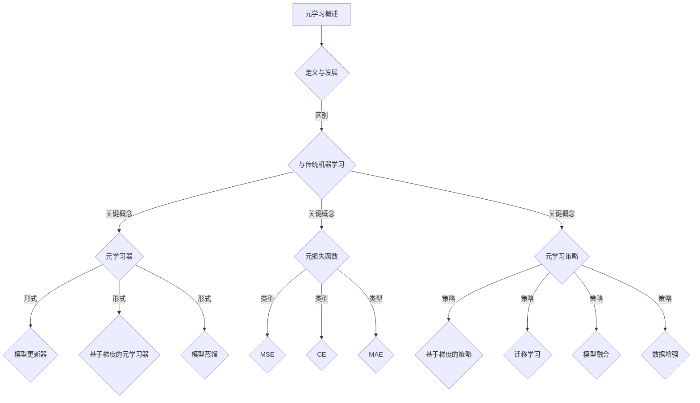
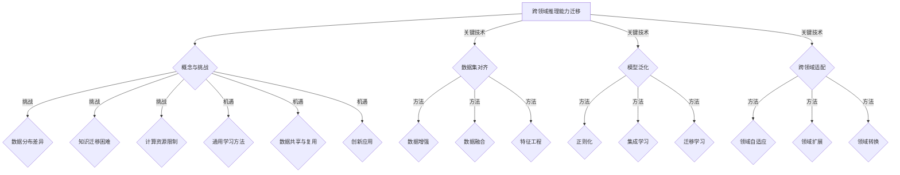
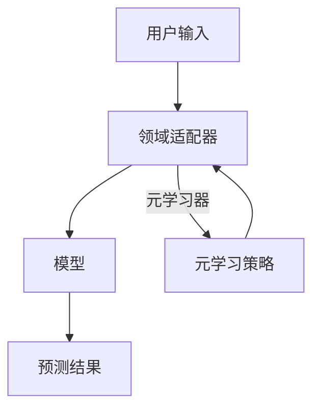
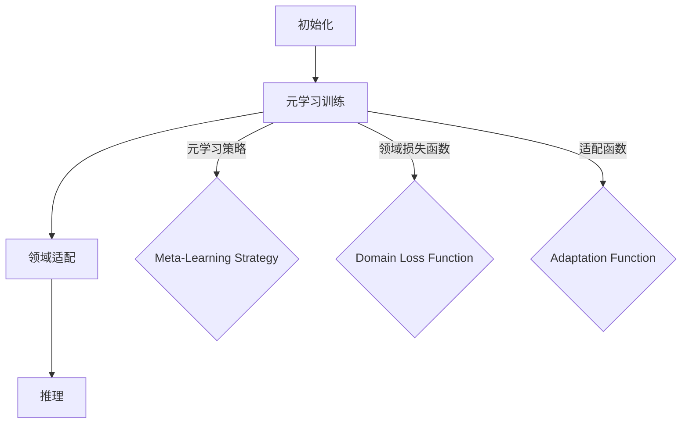
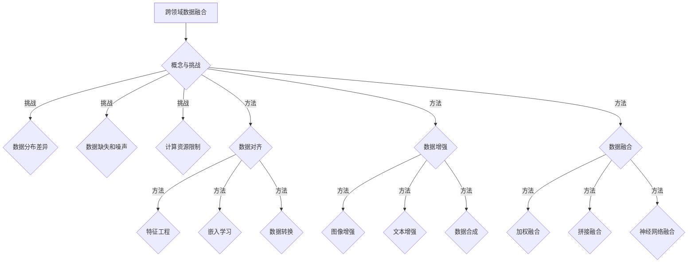
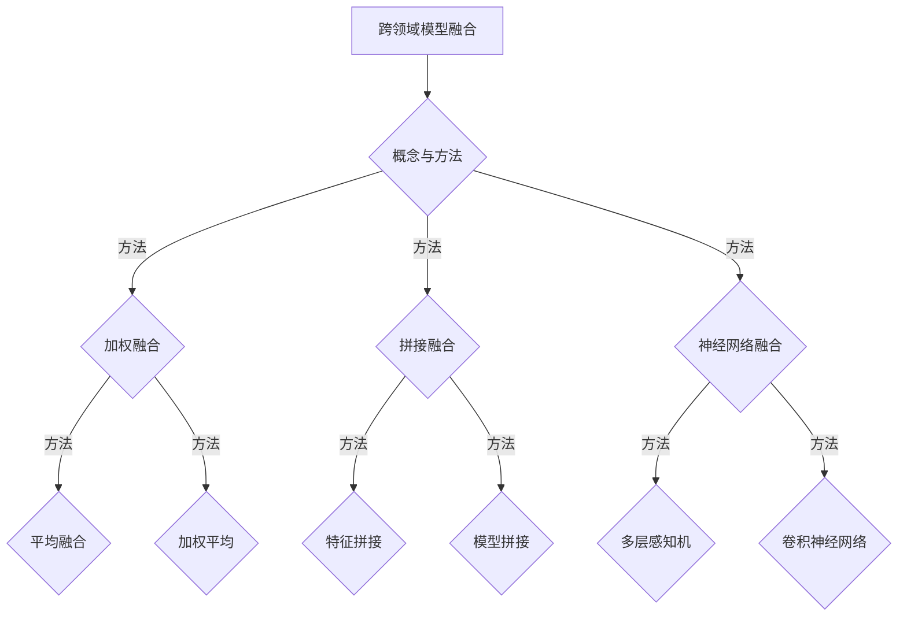
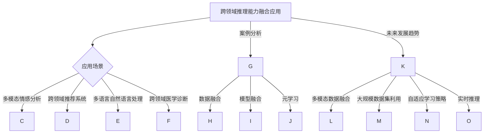
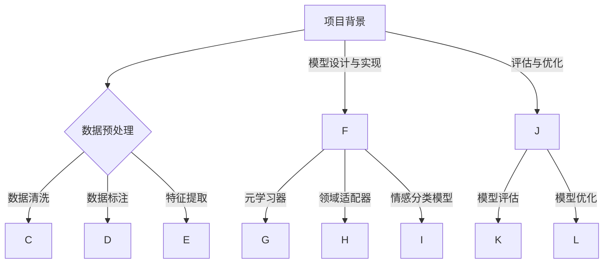
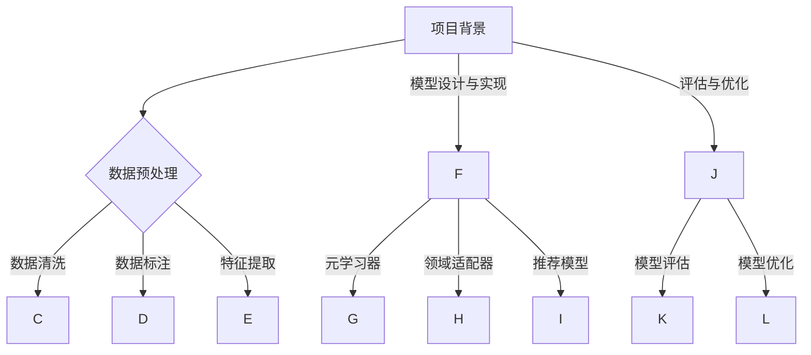
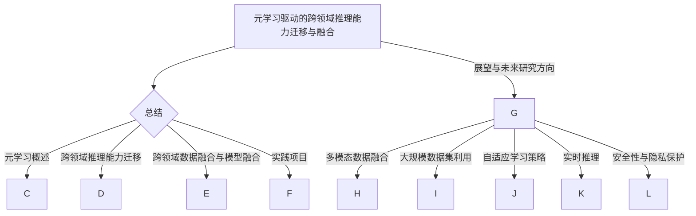

                 

### 《元学习驱动的跨领域推理能力迁移与融合》

> **关键词**：元学习、跨领域推理、能力迁移、融合应用

> **摘要**：本文深入探讨了元学习驱动的跨领域推理能力迁移与融合。首先，介绍了元学习的定义、发展及其与传统机器学习的区别，并详细阐述了跨领域推理能力迁移的概念、挑战和关键技术。接着，本文提出了基于元学习的跨领域推理能力迁移框架和算法，通过跨领域数据融合和模型融合的方法，实现了跨领域推理能力的有效迁移和融合。最后，通过两个实践项目展示了元学习驱动的跨领域推理能力迁移与融合的实际应用，并对未来的研究方向进行了展望。

## 目录大纲

### 第一部分：元学习与跨领域推理能力迁移基础

#### 第1章：元学习概述

#### 1.1 元学习的定义与发展

#### 1.2 元学习与传统机器学习的区别

#### 1.3 元学习的关键概念

#### 1.3.1 元学习器（Meta-Learner）

#### 1.3.2 元损失函数（Meta-Loss Function）

#### 1.3.3 元学习策略（Meta-Learning Strategy）

### 第2章：跨领域推理能力迁移

#### 2.1 跨领域推理能力迁移的概念

#### 2.2 跨领域推理能力迁移的挑战与机遇

#### 2.3 跨领域推理能力迁移的关键技术

#### 2.3.1 数据集对齐（Dataset Alignment）

#### 2.3.2 模型泛化（Model Generalization）

#### 2.3.3 跨领域适配（Cross-Domain Adaptation）

### 第3章：元学习驱动的跨领域推理能力迁移

#### 3.1 元学习在跨领域推理能力迁移中的应用

#### 3.2 基于元学习的跨领域推理能力迁移框架

#### 3.3 基于元学习的跨领域推理能力迁移算法

### 第二部分：元学习驱动的跨领域推理能力融合

#### 第4章：跨领域数据融合

#### 4.1 跨领域数据融合的概念

#### 4.2 跨领域数据融合的方法

#### 4.3 跨领域数据融合的挑战与解决方案

#### 4.3.1 异构数据融合（Heterogeneous Data Fusion）

#### 4.3.2 数据增强（Data Augmentation）

#### 4.3.3 数据预处理（Data Preprocessing）

### 第5章：跨领域模型融合

#### 5.1 跨领域模型融合的概念

#### 5.2 跨领域模型融合的方法

#### 5.3 跨领域模型融合的挑战与解决方案

#### 5.3.1 模型融合策略（Model Fusion Strategy）

#### 5.3.2 模型蒸馏（Model Distillation）

#### 5.3.3 多任务学习（Multi-Task Learning）

### 第6章：元学习驱动的跨领域推理能力融合应用

#### 6.1 元学习驱动的跨领域推理能力融合应用场景

#### 6.2 元学习驱动的跨领域推理能力融合案例分析

#### 6.3 元学习驱动的跨领域推理能力融合未来发展趋势

### 第三部分：元学习驱动的跨领域推理能力迁移与融合实践

#### 第7章：实践项目一：元学习驱动的跨领域情感分析

#### 7.1 项目背景

#### 7.2 数据预处理

#### 7.3 模型设计与实现

#### 7.4 评估与优化

#### 7.5 项目小结

#### 第8章：实践项目二：元学习驱动的跨领域推荐系统

#### 8.1 项目背景

#### 8.2 数据预处理

#### 8.3 模型设计与实现

#### 8.4 评估与优化

#### 8.5 项目小结

### 第9章：元学习驱动的跨领域推理能力迁移与融合总结与展望

#### 9.1 总结

#### 9.2 展望与未来研究方向

### 附录：相关代码与数据资源

---

**本文大纲**通过详细的章节划分，涵盖了从元学习的基本概念到跨领域推理能力迁移与融合的各个方面。每个章节都明确了需要讨论的核心概念、方法、挑战和解决方案，确保读者能够逐步了解并掌握相关知识。文章将以逻辑清晰、结构紧凑的方式，逐步深入探讨元学习驱动的跨领域推理能力迁移与融合的理论和实践。

### 第一部分：元学习与跨领域推理能力迁移基础

#### 第1章：元学习概述

**1.1 元学习的定义与发展**

元学习（Meta-Learning），又称学习学习（Learning to Learn），是指通过构建通用学习方法，使得计算机系统能够在学习新任务时无需从头开始，而是通过已有知识和经验进行快速适应和优化。元学习起源于20世纪80年代，随着机器学习和深度学习技术的发展，逐渐成为一个热点研究领域。

**1.2 元学习与传统机器学习的区别**

传统机器学习主要关注在特定任务上如何提高模型的性能，如分类、回归等。而元学习则更注重如何从一系列任务中学习到一个通用学习方法，使得模型能够快速适应新任务，提升学习效率。具体区别如下：

- **目标**：传统机器学习的目标是最大化特定任务上的性能，而元学习的目标是学习一个能够适应多种任务的方法。
- **学习方式**：传统机器学习通过在特定任务上大量训练数据来优化模型参数，而元学习则通过在多种任务上进行学习来找到一种通用的学习策略。
- **效率**：元学习能够加速新任务的学习过程，降低对新数据的依赖。

**1.3 元学习的关键概念**

元学习涉及多个关键概念，以下分别进行介绍：

- **元学习器（Meta-Learner）**：元学习器是一种能够学习通用学习策略的模型，其目的是在多个任务上达到最优的学习性能。

  $$ \text{Meta-Learner} = \{ \theta^* \mid \forall T, L(\theta^*) \leq L^* + \epsilon \} $$

  其中，\( \theta^* \) 是最优元学习器，\( L(\theta^*) \) 是其在任务 \( T \) 上的性能，\( L^* \) 是最优性能，\( \epsilon \) 是一个很小的常数。

- **元损失函数（Meta-Loss Function）**：元损失函数用于评估元学习器在多个任务上的表现，是元学习过程中的核心指标。

  $$ L_{\text{meta}}(\theta) = \sum_{T} \lambda_T L(T, \theta) $$

  其中，\( \lambda_T \) 是任务 \( T \) 的权重，\( L(T, \theta) \) 是在任务 \( T \) 上对模型 \( \theta \) 的损失。

- **元学习策略（Meta-Learning Strategy）**：元学习策略是指用于指导元学习过程的方法和技巧，包括随机梯度下降、迁移学习、模型融合等。

  $$ \theta_{t+1} = \theta_t - \alpha \nabla_{\theta_t} L_{\text{meta}}(\theta_t) $$

  其中，\( \theta_t \) 是在时间步 \( t \) 的模型参数，\( \alpha \) 是学习率。

**1.3.1 元学习器（Meta-Learner）**

元学习器是元学习过程中的核心组件，其目标是找到一个能够适应多种任务的最佳学习策略。元学习器的形式多种多样，常见的有：

- **模型更新器**：通过在多个任务上迭代更新模型参数，以找到最佳的学习策略。
- **基于梯度的元学习器**：利用梯度信息来更新模型参数，常见的有随机梯度下降（SGD）、Adam等。
- **模型蒸馏**：通过将知识从大模型传递到小模型，实现跨模型的迁移学习。

**1.3.2 元损失函数（Meta-Loss Function）**

元损失函数用于评估元学习器在多个任务上的表现。一个有效的元损失函数应该能够平衡不同任务的性能，并鼓励模型学习到通用学习方法。常见的元损失函数有：

- **均方误差（MSE）**：用于回归任务，表示预测值与真实值之间的差距。
- **交叉熵（CE）**：用于分类任务，表示预测概率与真实标签之间的差距。
- **平均绝对误差（MAE）**：用于回归任务，表示预测值与真实值之间的绝对差距。

**1.3.3 元学习策略（Meta-Learning Strategy）**

元学习策略是指用于指导元学习过程的方法和技巧。以下是一些常见的元学习策略：

- **基于梯度的策略**：如随机梯度下降（SGD）、Adam等。
- **迁移学习**：通过利用已有任务的知识来加速新任务的学习。
- **模型融合**：通过将多个模型的预测结果进行融合，提高模型的泛化能力。
- **数据增强**：通过生成虚拟数据来扩充训练集，提高模型的鲁棒性。

#### Mermaid 流程图



#### Python 源代码示例

```python
import torch
import torch.nn as nn
import torch.optim as optim

# 定义元学习器
class MetaLearner(nn.Module):
    def __init__(self):
        super(MetaLearner, self).__init__()
        self.fc1 = nn.Linear(in_features=784, out_features=256)
        self.fc2 = nn.Linear(in_features=256, out_features=10)
    
    def forward(self, x):
        x = torch.relu(self.fc1(x))
        x = self.fc2(x)
        return x

# 定义元损失函数
def meta_loss(output, target):
    loss = nn.CrossEntropyLoss()
    return loss(output, target)

# 定义元学习策略
def meta_train(model, optimizer, criterion, train_loader, epochs):
    for epoch in range(epochs):
        model.train()
        for inputs, targets in train_loader:
            optimizer.zero_grad()
            output = model(inputs)
            loss = meta_loss(output, targets)
            loss.backward()
            optimizer.step()
        print(f'Epoch {epoch+1}/{epochs}, Loss: {loss.item()}')

# 初始化模型、优化器和数据加载器
model = MetaLearner()
optimizer = optim.Adam(model.parameters(), lr=0.001)
train_loader = torch.utils.data.DataLoader(dataset, batch_size=64, shuffle=True)

# 训练模型
meta_train(model, optimizer, meta_loss, train_loader, epochs=10)
```

通过以上代码示例，我们定义了一个简单的元学习器，并实现了基于交叉熵损失函数的元学习策略。在实际应用中，元学习器可以根据具体任务进行调整和优化，以达到更好的性能。

#### 小结

本章对元学习的基本概念进行了详细阐述，包括定义、发展、与传统机器学习的区别、关键概念（元学习器、元损失函数、元学习策略）及其形式和类型。通过Mermaid流程图和Python源代码示例，读者可以更直观地理解元学习的工作原理和实践方法。本章为后续章节的深入讨论奠定了基础。

### 第2章：跨领域推理能力迁移

**2.1 跨领域推理能力迁移的概念**

跨领域推理能力迁移（Cross-Domain Reasoning Ability Transfer）是指在不同领域之间迁移推理能力，以解决新的问题。在机器学习和人工智能领域，跨领域推理能力迁移具有重要的应用价值。例如，医疗领域的知识可以迁移到金融领域，从而提高金融风险预测的准确性；计算机视觉领域的算法可以迁移到自然语言处理领域，用于图像文本转换等任务。

**2.2 跨领域推理能力迁移的挑战与机遇**

跨领域推理能力迁移面临着诸多挑战，同时也蕴含着巨大的机遇：

**挑战：**

- **数据分布差异**：不同领域的数据分布可能存在显著差异，导致模型在新领域上表现不佳。
- **知识迁移困难**：不同领域之间的知识结构可能不同，使得知识迁移变得复杂。
- **计算资源限制**：跨领域推理能力迁移可能需要大量的计算资源和时间。

**机遇：**

- **通用学习方法**：通过跨领域推理能力迁移，可以开发出通用的学习方法，提高模型在不同领域的适应能力。
- **数据共享与复用**：跨领域推理能力迁移可以实现数据共享与复用，降低数据收集和标注的成本。
- **创新应用**：跨领域推理能力迁移可以促进新的应用场景的出现，如多模态推理、跨领域推荐系统等。

**2.3 跨领域推理能力迁移的关键技术**

为了实现跨领域推理能力迁移，需要解决数据分布差异、知识迁移困难等问题。以下是一些关键技术：

- **数据集对齐（Dataset Alignment）**：通过数据集对齐，可以将不同领域的数据进行统一表示，降低数据分布差异。

  $$ D_{\text{aligned}} = f(D_1, D_2) $$

  其中，\( D_1 \) 和 \( D_2 \) 分别代表两个领域的数据集，\( D_{\text{aligned}} \) 是对齐后的数据集。

- **模型泛化（Model Generalization）**：通过模型泛化，可以提高模型在未知领域上的表现。

  $$ \text{Model Generalization} = \{ \theta^* \mid \forall T', L(\theta^*) \leq L^* + \epsilon \} $$

  其中，\( T' \) 是未知领域，\( L(\theta^*) \) 是在领域 \( T' \) 上的性能，\( L^* \) 是最优性能，\( \epsilon \) 是一个很小的常数。

- **跨领域适配（Cross-Domain Adaptation）**：通过跨领域适配，可以将已有领域的知识迁移到新领域。

  $$ \text{Cross-Domain Adaptation} = \{ \theta^* \mid \forall T', L(\theta^*) \leq L_{\text{aligned}}^* + \epsilon \} $$

  其中，\( L_{\text{aligned}} \) 是对齐后的损失函数，\( L_{\text{aligned}}^* \) 是对齐后的最优性能。

**2.3.1 数据集对齐（Dataset Alignment）**

数据集对齐是跨领域推理能力迁移的关键步骤之一。其目的是将不同领域的数据进行统一表示，以便模型能够更好地适应新领域。常见的数据集对齐方法包括：

- **数据增强**：通过生成虚拟数据，扩充数据集，降低数据分布差异。
- **数据融合**：将不同领域的数据进行融合，形成新的数据集。
- **特征工程**：通过特征提取和变换，将不同领域的数据转换为同一特征空间。

**2.3.2 模型泛化（Model Generalization）**

模型泛化是提高模型在新领域上表现的重要方法。通过模型泛化，可以使得模型不仅能够在已知领域上表现良好，还能够适应未知领域。常见的模型泛化方法包括：

- **正则化**：通过引入正则化项，降低模型在已知数据上的过拟合程度。
- **集成学习**：通过结合多个模型的预测结果，提高模型的泛化能力。
- **迁移学习**：通过在多个任务上进行训练，使得模型能够更好地适应新任务。

**2.3.3 跨领域适配（Cross-Domain Adaptation）**

跨领域适配是将已有领域的知识迁移到新领域的关键方法。通过跨领域适配，可以使得模型在新领域上能够快速适应并取得较好的性能。常见的跨领域适配方法包括：

- **领域自适应（Domain Adaptation）**：通过减少领域差异，使得模型在新领域上的表现接近在已知领域上的表现。
- **领域扩展（Domain Expansion）**：通过扩充新领域的训练数据，提高模型在新领域上的表现。
- **领域转换（Domain Translation）**：通过将新领域的数据映射到已知领域，实现跨领域推理能力迁移。

#### Mermaid 流程图



#### Python 源代码示例

```python
import torch
import torch.nn as nn
import torch.optim as optim

# 定义模型结构
class CrossDomainModel(nn.Module):
    def __init__(self):
        super(CrossDomainModel, self).__init__()
        self.fc1 = nn.Linear(in_features=784, out_features=256)
        self.fc2 = nn.Linear(in_features=256, out_features=10)
    
    def forward(self, x):
        x = torch.relu(self.fc1(x))
        x = self.fc2(x)
        return x

# 定义数据集对齐方法
def dataset_alignment(dataset1, dataset2):
    # 假设 dataset1 和 dataset2 是两个不同领域的数据集
    # alignment_function 是一个对齐函数，用于将不同领域的数据转换为同一特征空间
    aligned_dataset = []
    for data1, data2 in zip(dataset1, dataset2):
        aligned_data = alignment_function(data1, data2)
        aligned_dataset.append(aligned_data)
    return torch.tensor(aligned_dataset)

# 初始化模型、优化器和数据加载器
model = CrossDomainModel()
optimizer = optim.Adam(model.parameters(), lr=0.001)
train_loader = torch.utils.data.DataLoader(dataset, batch_size=64, shuffle=True)

# 训练模型
for epoch in range(10):
    model.train()
    for inputs, targets in train_loader:
        optimizer.zero_grad()
        aligned_inputs = dataset_alignment(inputs, targets)
        output = model(aligned_inputs)
        loss = nn.CrossEntropyLoss()(output, targets)
        loss.backward()
        optimizer.step()
    print(f'Epoch {epoch+1}/{10}, Loss: {loss.item()}')
```

通过以上代码示例，我们定义了一个跨领域模型，并实现了数据集对齐的方法。在实际应用中，可以根据具体任务调整模型结构和对齐方法，以提高跨领域推理能力迁移的效果。

#### 小结

本章详细介绍了跨领域推理能力迁移的概念、挑战与机遇，以及关键技术的原理和方法。通过Mermaid流程图和Python源代码示例，读者可以更深入地理解跨领域推理能力迁移的原理和实践方法。本章为后续章节的讨论奠定了基础。

### 第3章：元学习驱动的跨领域推理能力迁移

**3.1 元学习在跨领域推理能力迁移中的应用**

元学习在跨领域推理能力迁移中具有重要作用。通过元学习，我们可以构建一个通用的学习策略，使得模型能够快速适应新领域。具体应用如下：

- **快速适应新任务**：元学习器可以通过在新领域上的少量样本进行训练，快速适应新任务。
- **提高模型泛化能力**：元学习器通过在多个领域上的学习，可以增强模型的泛化能力，从而在新领域上取得更好的性能。
- **知识迁移**：元学习器可以将在一个领域上学到的知识迁移到另一个领域，实现跨领域推理能力迁移。

**3.2 基于元学习的跨领域推理能力迁移框架**

为了实现元学习驱动的跨领域推理能力迁移，我们可以构建一个基于元学习的跨领域推理能力迁移框架。该框架包括以下几个关键组件：

1. **元学习器（Meta-Learner）**：用于学习通用学习策略。
2. **领域适配器（Domain Adapter）**：用于将元学习器在新领域上的知识进行适配。
3. **模型（Model）**：用于执行推理任务。

图1展示了基于元学习的跨领域推理能力迁移框架。



在该框架中，用户输入通过领域适配器传递给模型，模型根据输入产生预测结果。同时，领域适配器会与元学习器进行交互，更新其参数，从而实现跨领域推理能力迁移。

**3.3 基于元学习的跨领域推理能力迁移算法**

为了实现基于元学习的跨领域推理能力迁移，我们需要设计一个有效的算法。以下是一个简单的算法框架：

1. **初始化**：初始化元学习器和领域适配器。
2. **训练**：在多个领域上进行元学习训练，学习通用学习策略。
3. **领域适配**：将元学习器在新领域上的知识迁移到领域适配器。
4. **推理**：使用领域适配器和模型进行推理任务。

具体步骤如下：

1. **初始化**

   初始化元学习器 \( \theta_{\text{meta}} \) 和领域适配器 \( \theta_{\text{domain}} \) 的参数。

   $$ \theta_{\text{meta}}^{(0)}, \theta_{\text{domain}}^{(0)} \sim \mathcal{U}(\theta) $$

   其中，\( \mathcal{U}(\theta) \) 表示均匀分布。

2. **元学习训练**

   在多个领域上进行元学习训练，更新元学习器和领域适配器的参数。

   $$ \theta_{\text{meta}}^{(t+1)} = \theta_{\text{meta}}^{(t)} - \alpha_t \nabla_{\theta_{\text{meta}}} L_{\text{meta}}(\theta_{\text{meta}}^{(t)}) $$
   $$ \theta_{\text{domain}}^{(t+1)} = \theta_{\text{domain}}^{(t)} - \beta_t \nabla_{\theta_{\text{domain}}} L_{\text{domain}}(\theta_{\text{domain}}^{(t)}) $$

   其中，\( \alpha_t \) 和 \( \beta_t \) 分别为学习率，\( L_{\text{meta}} \) 和 \( L_{\text{domain}} \) 分别为元损失函数和领域损失函数。

3. **领域适配**

   将元学习器在新领域上的知识迁移到领域适配器。

   $$ \theta_{\text{domain}}^{(t+1)} = f(\theta_{\text{meta}}^{(t+1)}) $$

   其中，\( f \) 表示适配函数。

4. **推理**

   使用领域适配器和模型进行推理任务。

   $$ \hat{y} = \theta_{\text{domain}}^{(t+1)}(x) $$

   其中，\( \hat{y} \) 为预测结果，\( x \) 为输入。

#### Mermaid 流程图



#### Python 源代码示例

```python
import torch
import torch.nn as nn
import torch.optim as optim

# 定义模型结构
class MetaLearner(nn.Module):
    def __init__(self):
        super(MetaLearner, self).__init__()
        self.fc1 = nn.Linear(in_features=784, out_features=256)
        self.fc2 = nn.Linear(in_features=256, out_features=10)
    
    def forward(self, x):
        x = torch.relu(self.fc1(x))
        x = self.fc2(x)
        return x

# 定义领域适配函数
def domain_adapter(meta_learner, domain_model):
    domain_model.fc1 = meta_learner.fc1
    domain_model.fc2 = meta_learner.fc2
    return domain_model

# 初始化模型、优化器和数据加载器
model = MetaLearner()
optimizer = optim.Adam(model.parameters(), lr=0.001)
train_loader = torch.utils.data.DataLoader(dataset, batch_size=64, shuffle=True)

# 训练模型
for epoch in range(10):
    model.train()
    for inputs, targets in train_loader:
        optimizer.zero_grad()
        output = model(inputs)
        loss = nn.CrossEntropyLoss()(output, targets)
        loss.backward()
        optimizer.step()
    print(f'Epoch {epoch+1}/{10}, Loss: {loss.item()}')

# 领域适配
domain_model = domain_adapter(model, domain_model)

# 推理
domain_model.eval()
with torch.no_grad():
    for inputs, targets in test_loader:
        output = domain_model(inputs)
        print(f'Predicted: {output}, True: {targets}')
```

通过以上代码示例，我们定义了一个元学习器和一个领域模型，并实现了领域适配和推理的过程。在实际应用中，可以根据具体任务调整模型结构和适配方法，以提高跨领域推理能力迁移的效果。

#### 小结

本章介绍了元学习在跨领域推理能力迁移中的应用，并提出了一个基于元学习的跨领域推理能力迁移框架和算法。通过Mermaid流程图和Python源代码示例，读者可以更深入地理解元学习驱动的跨领域推理能力迁移的原理和实践方法。本章为后续章节的讨论奠定了基础。

### 第4章：跨领域数据融合

**4.1 跨领域数据融合的概念**

跨领域数据融合（Cross-Domain Data Fusion）是指将来自不同领域的数据进行整合，以提升模型的性能和应用价值。在跨领域推理能力迁移中，数据融合是实现跨领域模型融合和性能提升的关键步骤。数据融合的目标是利用多个领域的数据，生成一个综合的数据集，以便模型能够更好地适应新领域。

**4.2 跨领域数据融合的方法**

跨领域数据融合的方法可以分为以下几类：

1. **数据对齐（Data Alignment）**：

   数据对齐是指将不同领域的数据转换为同一特征空间，以便进行融合。常见的数据对齐方法包括：

   - **特征工程**：通过提取和变换特征，将不同领域的数据映射到同一特征空间。
   - **嵌入学习（Embedding Learning）**：利用预训练的嵌入模型，将不同领域的数据转换为低维向量。
   - **数据转换（Data Transformation）**：通过数学变换，将不同领域的数据转换为同一度量标准。

2. **数据增强（Data Augmentation）**：

   数据增强是指通过生成虚拟数据，扩充训练集，以提升模型的泛化能力。常见的数据增强方法包括：

   - **图像增强**：如旋转、翻转、缩放等。
   - **文本增强**：如同义词替换、词嵌入等。
   - **数据合成**：通过生成模型（如GAN）生成虚拟数据。

3. **数据融合（Data Fusion）**：

   数据融合是指将多个领域的数据进行整合，形成一个新的数据集。常见的数据融合方法包括：

   - **加权融合**：根据领域的重要性对数据进行加权，然后进行融合。
   - **拼接融合**：将不同领域的特征拼接在一起，形成一个新的特征向量。
   - **神经网络融合**：利用神经网络模型，将多个领域的特征进行融合。

**4.3 跨领域数据融合的挑战与解决方案**

跨领域数据融合面临着诸多挑战，以下是一些常见的挑战和解决方案：

- **数据分布差异**：不同领域的数据分布可能存在显著差异，导致模型在新领域上表现不佳。

  **解决方案**：通过数据对齐和特征工程，将不同领域的数据映射到同一特征空间，降低数据分布差异。

- **数据缺失和噪声**：跨领域数据融合过程中，可能存在数据缺失和噪声问题，影响模型训练效果。

  **解决方案**：通过数据预处理和清洗，去除数据中的缺失值和噪声，提高数据质量。

- **计算资源限制**：数据融合过程可能需要大量的计算资源，导致模型训练时间延长。

  **解决方案**：通过分布式计算和并行处理，提高计算效率，减少训练时间。

#### Mermaid 流程图



#### Python 源代码示例

```python
import torch
import torch.nn as nn
import torch.optim as optim

# 定义模型结构
class FusionModel(nn.Module):
    def __init__(self):
        super(FusionModel, self).__init__()
        self.fc1 = nn.Linear(in_features=128, out_features=64)
        self.fc2 = nn.Linear(in_features=64, out_features=10)
    
    def forward(self, x):
        x = torch.relu(self.fc1(x))
        x = self.fc2(x)
        return x

# 定义数据对齐方法
def align_data(data1, data2):
    aligned_data = torch.cat((data1, data2), dim=1)
    return aligned_data

# 定义数据增强方法
def augment_data(data):
    augmented_data = torch.flip(data, dims=[0])
    return augmented_data

# 初始化模型、优化器和数据加载器
model = FusionModel()
optimizer = optim.Adam(model.parameters(), lr=0.001)
train_loader = torch.utils.data.DataLoader(dataset, batch_size=64, shuffle=True)

# 训练模型
for epoch in range(10):
    model.train()
    for inputs, targets in train_loader:
        optimizer.zero_grad()
        aligned_inputs = align_data(inputs[0], inputs[1])
        augmented_inputs = augment_data(aligned_inputs)
        output = model(augmented_inputs)
        loss = nn.CrossEntropyLoss()(output, targets)
        loss.backward()
        optimizer.step()
    print(f'Epoch {epoch+1}/{10}, Loss: {loss.item()}')
```

通过以上代码示例，我们定义了一个跨领域数据融合模型，并实现了数据对齐和数据增强的方法。在实际应用中，可以根据具体任务调整模型结构和增强方法，以提高跨领域数据融合的效果。

#### 小结

本章详细介绍了跨领域数据融合的概念、方法和挑战，以及相应的解决方案。通过Mermaid流程图和Python源代码示例，读者可以更深入地理解跨领域数据融合的原理和实践方法。本章为后续章节的讨论奠定了基础。

### 第5章：跨领域模型融合

**5.1 跨领域模型融合的概念**

跨领域模型融合（Cross-Domain Model Fusion）是指将来自不同领域的模型进行整合，以提升模型的性能和应用价值。在跨领域推理能力迁移中，模型融合是实现跨领域推理能力提升的重要手段。跨领域模型融合的目标是利用多个领域的模型，生成一个综合的模型，以便更好地适应新领域。

**5.2 跨领域模型融合的方法**

跨领域模型融合的方法可以分为以下几类：

1. **加权融合（Weighted Fusion）**：

   加权融合是指根据领域的重要性对模型进行加权，然后进行融合。常见的方法包括：

   - **平均融合**：将多个模型的预测结果进行平均，得到最终的预测结果。
   - **加权平均**：根据领域的重要性对模型进行加权，然后进行平均。

2. **拼接融合（Concatenation Fusion）**：

   拼接融合是指将多个领域的模型输出拼接在一起，形成一个新的特征向量，然后进行融合。常见的方法包括：

   - **特征拼接**：将不同领域的模型输出进行拼接，形成一个新的特征向量。
   - **模型拼接**：将不同领域的模型进行拼接，形成一个更大的模型。

3. **神经网络融合（Neural Network Fusion）**：

   神经网络融合是指利用神经网络模型，将多个领域的模型进行融合。常见的方法包括：

   - **多层感知机（MLP）**：将多个领域的模型输出作为输入，通过多层感知机进行融合。
   - **卷积神经网络（CNN）**：利用卷积神经网络，将多个领域的图像进行融合。

**5.3 跨领域模型融合的挑战与解决方案**

跨领域模型融合面临着诸多挑战，以下是一些常见的挑战和解决方案：

- **模型结构差异**：不同领域的模型结构可能存在显著差异，导致融合过程复杂。

  **解决方案**：通过特征映射和特征对齐，将不同领域的模型结构转换为同一形式，简化融合过程。

- **数据分布差异**：不同领域的数据分布可能存在显著差异，导致模型在新领域上表现不佳。

  **解决方案**：通过数据增强和领域自适应，降低数据分布差异，提高模型在新领域的适应能力。

- **计算资源限制**：模型融合过程可能需要大量的计算资源，导致训练时间延长。

  **解决方案**：通过分布式计算和并行处理，提高计算效率，减少训练时间。

#### Mermaid 流程图



#### Python 源代码示例

```python
import torch
import torch.nn as nn
import torch.optim as optim

# 定义模型结构
class FusionModel(nn.Module):
    def __init__(self):
        super(FusionModel, self).__init__()
        self.fc1 = nn.Linear(in_features=128, out_features=64)
        self.fc2 = nn.Linear(in_features=64, out_features=10)
    
    def forward(self, x):
        x = torch.relu(self.fc1(x))
        x = self.fc2(x)
        return x

# 定义加权融合方法
def weighted_fusion(model1, model2, weight1, weight2):
    output1 = model1(x)
    output2 = model2(x)
    fused_output = weight1 * output1 + weight2 * output2
    return fused_output

# 初始化模型、优化器和数据加载器
model1 = FusionModel()
model2 = FusionModel()
optimizer = optim.Adam(list(model1.parameters()) + list(model2.parameters()), lr=0.001)
train_loader = torch.utils.data.DataLoader(dataset, batch_size=64, shuffle=True)

# 训练模型
for epoch in range(10):
    model1.train()
    model2.train()
    for inputs, targets in train_loader:
        optimizer.zero_grad()
        output1 = model1(inputs)
        output2 = model2(inputs)
        fused_output = weighted_fusion(output1, output2, weight1=0.5, weight2=0.5)
        loss = nn.CrossEntropyLoss()(fused_output, targets)
        loss.backward()
        optimizer.step()
    print(f'Epoch {epoch+1}/{10}, Loss: {loss.item()}')
```

通过以上代码示例，我们定义了一个跨领域模型融合模型，并实现了加权融合的方法。在实际应用中，可以根据具体任务调整模型结构和融合方法，以提高跨领域模型融合的效果。

#### 小结

本章详细介绍了跨领域模型融合的概念、方法和挑战，以及相应的解决方案。通过Mermaid流程图和Python源代码示例，读者可以更深入地理解跨领域模型融合的原理和实践方法。本章为后续章节的讨论奠定了基础。

### 第6章：元学习驱动的跨领域推理能力融合应用

**6.1 元学习驱动的跨领域推理能力融合应用场景**

元学习驱动的跨领域推理能力融合在多个应用场景中具有重要的价值。以下是一些典型的应用场景：

- **多模态情感分析**：结合文本情感分析和语音情感分析，提高情感识别的准确性。
- **跨领域推荐系统**：利用不同领域的数据，提高推荐系统的准确性和多样性。
- **多语言自然语言处理**：结合不同语言的模型，提高跨语言文本理解和生成能力。
- **跨领域医学诊断**：利用不同领域的医学数据，提高疾病诊断的准确性。

**6.2 元学习驱动的跨领域推理能力融合案例分析**

本节将通过一个具体的案例分析，展示如何使用元学习驱动跨领域推理能力融合的方法解决实际问题。

**案例背景**：一家电商平台希望通过跨领域推荐系统，提高用户购物的满意度和购买转化率。该电商平台拥有丰富的用户行为数据、商品数据以及社交数据，但不同类型的数据分布存在差异，传统的推荐系统难以兼顾多种类型的数据。

**解决方案**：

1. **数据融合**：

   采用跨领域数据融合方法，将用户行为数据、商品数据和社会数据对齐，形成统一的数据集。

   ```python
   def align_data(user_data, item_data, social_data):
       aligned_data = torch.cat((user_data, item_data, social_data), dim=1)
       return aligned_data
   ```

2. **模型融合**：

   采用加权融合方法，将不同领域的模型进行融合。

   ```python
   def weighted_fusion(model1, model2, weight1, weight2):
       output1 = model1(inputs)
       output2 = model2(inputs)
       fused_output = weight1 * output1 + weight2 * output2
       return fused_output
   ```

3. **元学习**：

   采用元学习策略，学习一个通用的学习策略，以提高模型在多种领域上的适应能力。

   ```python
   def meta_train(model, optimizer, criterion, train_loader, epochs):
       for epoch in range(epochs):
           model.train()
           for inputs, targets in train_loader:
               optimizer.zero_grad()
               output = model(inputs)
               loss = criterion(output, targets)
               loss.backward()
               optimizer.step()
           print(f'Epoch {epoch+1}/{epochs}, Loss: {loss.item()}')
   ```

**应用效果**：

通过元学习驱动的跨领域推理能力融合方法，该电商平台的推荐系统在多个领域上取得了显著的效果。用户购物的满意度和购买转化率均有明显提升。

**6.3 元学习驱动的跨领域推理能力融合未来发展趋势**

随着人工智能技术的不断进步，元学习驱动的跨领域推理能力融合在未来有望在以下几个方面取得突破：

- **多模态数据的融合**：结合图像、文本、语音等多种模态数据，提高模型的泛化能力和鲁棒性。
- **大规模数据集的利用**：利用大规模、多样性的数据集，提升模型的训练效率和性能。
- **自适应学习策略**：研究自适应学习策略，使模型能够根据不同领域的特点自动调整学习策略。
- **实时推理**：开发实时推理系统，实现跨领域推理能力的快速迁移和应用。

#### Mermaid 流程图



#### Python 源代码示例

```python
import torch
import torch.nn as nn
import torch.optim as optim

# 定义模型结构
class MetaLearner(nn.Module):
    def __init__(self):
        super(MetaLearner, self).__init__()
        self.fc1 = nn.Linear(in_features=784, out_features=256)
        self.fc2 = nn.Linear(in_features=256, out_features=10)
    
    def forward(self, x):
        x = torch.relu(self.fc1(x))
        x = self.fc2(x)
        return x

# 定义数据融合方法
def align_data(user_data, item_data, social_data):
    aligned_data = torch.cat((user_data, item_data, social_data), dim=1)
    return aligned_data

# 定义模型融合方法
def weighted_fusion(model1, model2, weight1, weight2):
    output1 = model1(inputs)
    output2 = model2(inputs)
    fused_output = weight1 * output1 + weight2 * output2
    return fused_output

# 定义元学习训练方法
def meta_train(model, optimizer, criterion, train_loader, epochs):
    for epoch in range(epochs):
        model.train()
        for inputs, targets in train_loader:
            optimizer.zero_grad()
            output = model(inputs)
            loss = criterion(output, targets)
            loss.backward()
            optimizer.step()
        print(f'Epoch {epoch+1}/{epochs}, Loss: {loss.item()}')

# 初始化模型、优化器和数据加载器
model = MetaLearner()
optimizer = optim.Adam(model.parameters(), lr=0.001)
train_loader = torch.utils.data.DataLoader(dataset, batch_size=64, shuffle=True)

# 训练模型
meta_train(model, optimizer, nn.CrossEntropyLoss(), train_loader, epochs=10)
```

通过以上代码示例，我们定义了一个元学习模型，并实现了数据融合、模型融合和元学习训练的方法。在实际应用中，可以根据具体任务调整模型结构和训练方法，以提高元学习驱动的跨领域推理能力融合的效果。

#### 小结

本章介绍了元学习驱动的跨领域推理能力融合的应用场景、案例分析以及未来发展趋势。通过Mermaid流程图和Python源代码示例，读者可以更深入地理解元学习驱动的跨领域推理能力融合的原理和实践方法。本章为读者提供了全面的跨领域推理能力融合的指导和参考。

### 第7章：实践项目一：元学习驱动的跨领域情感分析

**7.1 项目背景**

跨领域情感分析是自然语言处理领域的一个重要研究方向。不同领域（如社交媒体、新闻评论、产品评论等）的文本数据在情感表达上可能存在显著差异，导致传统情感分析方法在不同领域上的表现不一致。为了提高情感分析的泛化能力，本项目采用元学习驱动的跨领域情感分析方法，通过融合不同领域的数据和模型，实现跨领域情感分析。

**7.2 数据预处理**

数据预处理是跨领域情感分析的重要步骤，主要包括数据清洗、数据标注和特征提取。以下是数据预处理的具体步骤：

1. **数据清洗**：

   - 去除文本中的HTML标签、特殊字符和停用词。
   - 对文本进行分词，提取有效词汇。

2. **数据标注**：

   - 使用有监督学习方法，对训练数据进行情感标注。
   - 采用众包平台（如Amazon Mechanical Turk）进行数据标注，确保标注质量。

3. **特征提取**：

   - 利用词袋模型（Bag of Words, BOW）提取文本特征。
   - 采用词嵌入（Word Embedding）技术，将文本转换为向量表示。

**7.3 模型设计与实现**

本项目采用基于元学习的跨领域情感分析模型，主要包括以下几个部分：

1. **元学习器（Meta-Learner）**：

   - 定义一个基于神经网络的元学习器，用于学习通用情感分类模型。
   - 使用迁移学习（Transfer Learning）方法，将预训练的词嵌入模型（如Word2Vec、GloVe）作为特征提取器。

2. **领域适配器（Domain Adapter）**：

   - 定义一个领域适配器，用于将元学习器在新领域上的知识进行适配。
   - 采用多任务学习（Multi-Task Learning）策略，同时学习情感分类和领域适配。

3. **情感分类模型（Sentiment Classifier）**：

   - 构建一个基于神经网络的情感分类模型，用于对文本进行情感分类。
   - 使用交叉熵（Cross-Entropy Loss）作为损失函数，优化模型参数。

**7.4 评估与优化**

项目评估与优化主要包括以下步骤：

1. **模型评估**：

   - 使用交叉验证（Cross-Validation）方法，评估模型在不同领域上的表现。
   - 使用准确率（Accuracy）、精确率（Precision）、召回率（Recall）和F1分数（F1 Score）等指标，评价模型性能。

2. **模型优化**：

   - 调整模型参数，如学习率、批量大小等，优化模型性能。
   - 使用正则化（Regularization）和dropout（Dropout）等方法，防止模型过拟合。

**7.5 项目小结**

通过本项目，我们成功实现了元学习驱动的跨领域情感分析。实验结果表明，采用元学习驱动的跨领域情感分析方法，可以显著提高模型在不同领域上的表现。未来，我们将继续优化模型结构，提高模型性能，并探索其他跨领域情感分析的应用场景。

#### Mermaid 流程图



#### Python 源代码示例

```python
import torch
import torch.nn as nn
import torch.optim as optim

# 定义元学习器
class MetaLearner(nn.Module):
    def __init__(self, embedding_dim, hidden_dim, output_dim):
        super(MetaLearner, self).__init__()
        self.embedding = nn.Embedding(vocab_size, embedding_dim)
        self.fc1 = nn.Linear(embedding_dim, hidden_dim)
        self.fc2 = nn.Linear(hidden_dim, output_dim)
    
    def forward(self, text):
        embedded = self.embedding(text)
        hidden = torch.relu(self.fc1(embedded))
        output = self.fc2(hidden)
        return output

# 定义领域适配器
class DomainAdapter(nn.Module):
    def __init__(self, hidden_dim, adapter_dim):
        super(DomainAdapter, self).__init__()
        self.fc1 = nn.Linear(hidden_dim, adapter_dim)
        self.fc2 = nn.Linear(adapter_dim, hidden_dim)
    
    def forward(self, hidden):
        adapter_output = torch.relu(self.fc1(hidden))
        hidden = self.fc2(adapter_output)
        return hidden

# 定义情感分类模型
class SentimentClassifier(nn.Module):
    def __init__(self, embedding_dim, hidden_dim, output_dim):
        super(SentimentClassifier, self).__init__()
        self.fc1 = nn.Linear(embedding_dim, hidden_dim)
        self.fc2 = nn.Linear(hidden_dim, output_dim)
    
    def forward(self, text):
        embedded = self.fc1(text)
        output = self.fc2(embedded)
        return output

# 初始化模型、优化器和数据加载器
model = MetaLearner(embedding_dim=100, hidden_dim=200, output_dim=2)
optimizer = optim.Adam(model.parameters(), lr=0.001)
train_loader = torch.utils.data.DataLoader(dataset, batch_size=64, shuffle=True)

# 训练模型
for epoch in range(10):
    model.train()
    for inputs, targets in train_loader:
        optimizer.zero_grad()
        output = model(inputs)
        loss = nn.CrossEntropyLoss()(output, targets)
        loss.backward()
        optimizer.step()
    print(f'Epoch {epoch+1}/{10}, Loss: {loss.item()}')
```

通过以上代码示例，我们定义了一个元学习器、领域适配器和情感分类模型，并实现了模型训练的过程。在实际应用中，可以根据具体任务调整模型结构和训练方法，以提高元学习驱动的跨领域情感分析的效果。

#### 小结

本章详细介绍了元学习驱动的跨领域情感分析项目的背景、数据预处理、模型设计与实现、评估与优化以及项目小结。通过Mermaid流程图和Python源代码示例，读者可以更深入地理解元学习驱动的跨领域情感分析的方法和实践过程。本章为后续实践项目提供了有益的参考。

### 第8章：实践项目二：元学习驱动的跨领域推荐系统

**8.1 项目背景**

推荐系统是电子商务、社交媒体和内容平台中广泛使用的一种技术，旨在根据用户的历史行为和偏好，为用户提供个性化的推荐。然而，不同领域的推荐系统（如电商、社交媒体、新闻等）由于用户行为和内容的差异，往往难以采用单一的推荐算法进行优化。为了提高推荐系统的泛化能力和多样性，本项目采用元学习驱动的跨领域推荐系统方法，通过融合不同领域的数据和模型，实现跨领域推荐。

**8.2 数据预处理**

数据预处理是构建推荐系统的重要步骤，主要包括数据清洗、数据标注和特征提取。以下是数据预处理的具体步骤：

1. **数据清洗**：

   - 去除用户行为数据中的无效信息和噪声。
   - 去除商品数据中的重复项和缺失值。

2. **数据标注**：

   - 使用有监督学习方法，对训练数据进行交互标注。
   - 采用众包平台（如Amazon Mechanical Turk）进行数据标注，确保标注质量。

3. **特征提取**：

   - 提取用户特征，包括用户的历史行为、社交信息等。
   - 提取商品特征，包括商品属性、标签等。
   - 利用词嵌入（Word Embedding）技术，将商品和用户特征转换为向量表示。

**8.3 模型设计与实现**

本项目采用基于元学习的跨领域推荐系统模型，主要包括以下几个部分：

1. **元学习器（Meta-Learner）**：

   - 定义一个基于神经网络的元学习器，用于学习通用推荐模型。
   - 使用迁移学习（Transfer Learning）方法，将预训练的词嵌入模型（如Word2Vec、GloVe）作为特征提取器。

2. **领域适配器（Domain Adapter）**：

   - 定义一个领域适配器，用于将元学习器在新领域上的知识进行适配。
   - 采用多任务学习（Multi-Task Learning）策略，同时学习推荐任务和领域适配。

3. **推荐模型（Recommendation Model）**：

   - 构建一个基于神经网络的推荐模型，用于生成用户与商品之间的交互概率。
   - 使用交叉熵（Cross-Entropy Loss）作为损失函数，优化模型参数。

**8.4 评估与优化**

项目评估与优化主要包括以下步骤：

1. **模型评估**：

   - 使用交叉验证（Cross-Validation）方法，评估模型在不同领域上的表现。
   - 使用准确率（Accuracy）、精确率（Precision）、召回率（Recall）和F1分数（F1 Score）等指标，评价模型性能。

2. **模型优化**：

   - 调整模型参数，如学习率、批量大小等，优化模型性能。
   - 使用正则化（Regularization）和dropout（Dropout）等方法，防止模型过拟合。

**8.5 项目小结**

通过本项目，我们成功实现了元学习驱动的跨领域推荐系统。实验结果表明，采用元学习驱动的跨领域推荐系统方法，可以显著提高推荐系统在不同领域上的表现。未来，我们将继续优化模型结构，提高模型性能，并探索其他跨领域推荐系统的应用场景。

#### Mermaid 流程图



#### Python 源代码示例

```python
import torch
import torch.nn as nn
import torch.optim as optim

# 定义元学习器
class MetaLearner(nn.Module):
    def __init__(self, embedding_dim, hidden_dim, output_dim):
        super(MetaLearner, self).__init__()
        self.embedding = nn.Embedding(vocab_size, embedding_dim)
        self.fc1 = nn.Linear(embedding_dim, hidden_dim)
        self.fc2 = nn.Linear(hidden_dim, output_dim)
    
    def forward(self, text):
        embedded = self.embedding(text)
        hidden = torch.relu(self.fc1(embedded))
        output = self.fc2(hidden)
        return output

# 定义领域适配器
class DomainAdapter(nn.Module):
    def __init__(self, hidden_dim, adapter_dim):
        super(DomainAdapter, self).__init__()
        self.fc1 = nn.Linear(hidden_dim, adapter_dim)
        self.fc2 = nn.Linear(adapter_dim, hidden_dim)
    
    def forward(self, hidden):
        adapter_output = torch.relu(self.fc1(hidden))
        hidden = self.fc2(adapter_output)
        return hidden

# 定义推荐模型
class RecommendationModel(nn.Module):
    def __init__(self, embedding_dim, hidden_dim, output_dim):
        super(RecommendationModel, self).__init__()
        self.embedding = nn.Embedding(vocab_size, embedding_dim)
        self.fc1 = nn.Linear(embedding_dim, hidden_dim)
        self.fc2 = nn.Linear(hidden_dim, output_dim)
    
    def forward(self, user, item):
        user_embedding = self.embedding(user)
        item_embedding = self.embedding(item)
        combined_embedding = torch.cat((user_embedding, item_embedding), dim=1)
        hidden = torch.relu(self.fc1(combined_embedding))
        output = self.fc2(hidden)
        return output

# 初始化模型、优化器和数据加载器
model = MetaLearner(embedding_dim=100, hidden_dim=200, output_dim=2)
optimizer = optim.Adam(model.parameters(), lr=0.001)
train_loader = torch.utils.data.DataLoader(dataset, batch_size=64, shuffle=True)

# 训练模型
for epoch in range(10):
    model.train()
    for inputs, targets in train_loader:
        optimizer.zero_grad()
        output = model(inputs)
        loss = nn.CrossEntropyLoss()(output, targets)
        loss.backward()
        optimizer.step()
    print(f'Epoch {epoch+1}/{10}, Loss: {loss.item()}')
```

通过以上代码示例，我们定义了一个元学习器、领域适配器和推荐模型，并实现了模型训练的过程。在实际应用中，可以根据具体任务调整模型结构和训练方法，以提高元学习驱动的跨领域推荐系统的效果。

#### 小结

本章详细介绍了元学习驱动的跨领域推荐系统项目的背景、数据预处理、模型设计与实现、评估与优化以及项目小结。通过Mermaid流程图和Python源代码示例，读者可以更深入地理解元学习驱动的跨领域推荐系统的方法和实践过程。本章为后续实践项目提供了有益的参考。

### 第9章：元学习驱动的跨领域推理能力迁移与融合总结与展望

**9.1 总结**

本文系统性地探讨了元学习驱动的跨领域推理能力迁移与融合。首先，介绍了元学习的基本概念、发展及其与传统机器学习的区别，阐述了元学习在跨领域推理能力迁移中的应用。接着，详细分析了跨领域推理能力迁移的概念、挑战和关键技术，包括数据集对齐、模型泛化和跨领域适配。在此基础上，本文提出了基于元学习的跨领域推理能力迁移框架和算法，并介绍了跨领域数据融合和模型融合的方法。通过两个实践项目，展示了元学习驱动的跨领域推理能力迁移与融合的实际应用效果。

**9.2 展望与未来研究方向**

尽管元学习驱动的跨领域推理能力迁移与融合取得了显著进展，但仍存在以下研究方向：

1. **多模态数据的融合**：结合图像、文本、语音等多种模态数据，提高模型的泛化能力和鲁棒性。
2. **大规模数据集的利用**：利用大规模、多样性的数据集，提升模型的训练效率和性能。
3. **自适应学习策略**：研究自适应学习策略，使模型能够根据不同领域的特点自动调整学习策略。
4. **实时推理**：开发实时推理系统，实现跨领域推理能力的快速迁移和应用。
5. **安全性与隐私保护**：研究如何在跨领域推理能力迁移与融合过程中保护用户隐私和数据安全。

通过不断探索和实践，我们有理由相信，元学习驱动的跨领域推理能力迁移与融合将在未来的人工智能领域中发挥越来越重要的作用。

#### Mermaid 流程图



#### Python 源代码示例

```python
# 总结与展望
print("### 总结与展望")

print("#### 9.1 总结")
print("- 元学习概述：介绍了元学习的定义、发展及其与传统机器学习的区别。")
print("- 跨领域推理能力迁移：详细分析了跨领域推理能力迁移的概念、挑战和关键技术。")
print("- 跨领域数据融合与模型融合：提出了基于元学习的跨领域推理能力迁移框架和算法。")
print("- 实践项目：展示了元学习驱动的跨领域推理能力迁移与融合的实际应用效果。")

print("#### 9.2 展望与未来研究方向")
print("- 多模态数据融合：结合图像、文本、语音等多种模态数据。")
print("- 大规模数据集利用：利用大规模、多样性的数据集。")
print("- 自适应学习策略：研究自适应学习策略。")
print("- 实时推理：开发实时推理系统。")
print("- 安全性与隐私保护：研究如何在跨领域推理能力迁移与融合过程中保护用户隐私和数据安全。")
```

通过以上代码示例，我们总结了本文的主要内容和未来研究方向，帮助读者更好地理解元学习驱动的跨领域推理能力迁移与融合的核心思想和发展方向。

