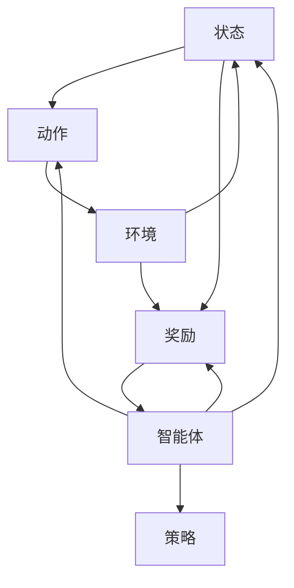
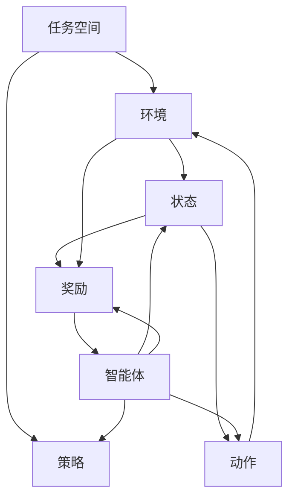

                 

### 背景介绍

强化学习作为机器学习的一个重要分支，已经取得了显著的进展，并在多个领域展现出了其强大的应用潜力。然而，随着问题复杂度的增加，传统的强化学习方法往往面临着计算效率低下、可解释性差等挑战。为了解决这些问题，研究者们提出了元强化学习（Meta-Reinforcement Learning）这一概念。

元强化学习是一种能够自动化算法设计的强化学习方法，其核心思想是通过学习如何学习来提高算法的效率和鲁棒性。具体来说，元强化学习不仅仅专注于解决单一任务，而是致力于从多个任务中提取通用策略，从而在不同任务中表现出良好的适应性和迁移能力。

在现代人工智能研究中，元强化学习因其潜在的广泛应用前景而备受关注。例如，在游戏领域，元强化学习能够使智能体快速适应各种复杂的游戏环境；在机器人控制领域，它可以提高机器人对未知环境的适应能力；在推荐系统领域，元强化学习可以优化推荐算法，提高用户体验。

尽管元强化学习展现出了巨大的潜力，但其实际应用仍然面临许多挑战。首先，元强化学习算法的复杂性使得其理解和实现难度较大。其次，如何有效地评估和优化元强化学习算法，以及如何在实际应用中平衡算法的通用性与特定任务的表现，都是亟待解决的问题。

本文旨在深入探讨元强化学习的基本概念、原理以及具体实现方法，并通过详细的分析和实例，帮助读者理解这一前沿技术。文章将分为三个主要部分：第一部分介绍强化学习的基础概念和原理；第二部分重点探讨元强化学习，包括其定义、算法和实际应用；第三部分则展望元强化学习的未来发展趋势和潜在挑战。通过这样的结构安排，我们希望能够为读者提供一个全面、系统的元强化学习知识体系。

### 核心概念与联系

为了更好地理解元强化学习，我们需要先回顾一下强化学习的基本概念。强化学习（Reinforcement Learning，RL）是一种通过不断试错，从环境中获取反馈信号，逐步优化策略的机器学习方法。其主要核心概念包括：

1. **智能体（Agent）**：执行动作并从环境中接收反馈的实体。
2. **环境（Environment）**：智能体所处的情境，能够对智能体的动作作出响应。
3. **状态（State）**：描述环境当前状态的变量集合。
4. **动作（Action）**：智能体可以执行的行为。
5. **奖励（Reward）**：环境对智能体动作的反馈，用于指导智能体的行为。
6. **策略（Policy）**：智能体从状态到动作的映射规则。

这些核心概念之间的关系可以用以下Mermaid流程图来描述：



在这个流程图中，智能体根据当前状态选择动作，环境根据动作作出响应并给出奖励，智能体再根据奖励来调整其策略。这一过程不断重复，直到达到预期目标。

理解这些基本概念后，我们引入元强化学习（Meta-Reinforcement Learning）。元强化学习是一种能够自动化算法设计的强化学习方法，其核心目标是学习如何在不同的任务中快速适应和优化策略。元强化学习的关键概念包括：

1. **元学习（Meta-Learning）**：通过学习如何学习来提高算法的效率和鲁棒性。
2. **通用策略（Generalized Policy）**：针对多个任务提取的通用策略，能够在不同任务中表现出良好的适应性。
3. **任务空间（Task Space）**：由多个不同任务组成的集合，每个任务都有其特定的状态、动作和奖励。

元强化学习与强化学习的关系可以用以下Mermaid流程图来描述：



在这个流程图中，元强化学习通过任务空间中的多个任务来训练智能体，使其能够提取出通用策略。智能体在各个任务中执行动作，根据奖励来调整策略，从而在整个任务空间中表现出良好的适应性。

通过这些流程图，我们可以清晰地看到强化学习和元强化学习之间的联系与区别。强化学习关注单一任务的优化，而元强化学习则致力于从多个任务中提取通用策略，提高算法的适应性和鲁棒性。这一核心思想使得元强化学习在处理复杂、多变的环境中具有显著的优势。

### 强化学习中的状态与动作

在强化学习（Reinforcement Learning，RL）中，状态（State）和动作（Action）是两个核心概念，它们构成了智能体（Agent）与环境（Environment）交互的基本框架。理解状态和动作的定义、状态空间与动作空间的设计，对于深入掌握强化学习算法至关重要。

#### 状态（State）

状态是描述环境当前状态的变量集合。在强化学习中，状态是一个重要的输入，智能体（Agent）通过感知状态来做出决策。状态可以是离散的，也可以是连续的，具体取决于问题的复杂性。

1. **离散状态**：例如，在一个简单的游戏环境中，状态可以是游戏棋盘上的棋子位置。
2. **连续状态**：例如，在一个连续空间中的机器人，其状态可以包括位置、速度、方向等。

状态的定义通常依赖于具体的任务和应用场景。为了设计有效的状态空间，我们需要考虑以下因素：

- **信息的完备性**：状态需要包含足够的信息来指导智能体的决策。
- **稀疏性**：过多的状态会导致计算复杂度急剧增加，而状态过于稀疏可能导致智能体无法有效学习。
- **一致性**：状态应该能够稳定地反映环境的真实情况，避免状态之间的模糊性。

#### 动作（Action）

动作是智能体能够执行的行为。动作也可以是离散的或连续的，取决于问题的具体需求。

1. **离散动作**：例如，在棋盘游戏中的移动棋子。
2. **连续动作**：例如，机器人的速度控制或转向控制。

动作的定义和设计同样需要考虑以下因素：

- **有效性与多样性**：动作需要能够有效地改变环境状态，同时保证动作的多样性，以便智能体探索不同策略。
- **限制与约束**：某些动作可能受到环境或物理定律的限制，这些限制需要在设计动作时考虑。
- **奖励影响**：不同的动作可能会导致不同的奖励，因此需要在设计动作时考虑其对奖励的影响。

#### 状态空间（State Space）与动作空间（Action Space）

状态空间和动作空间是强化学习中的重要概念，它们决定了智能体能够探索的领域。

1. **状态空间**：状态空间是指所有可能的状态集合。状态空间的定义直接影响智能体的学习效率和算法的复杂性。例如，对于围棋游戏，状态空间可能包括棋盘上的每一个棋子位置。
   
   ```python
   # 假设一个4x4的棋盘
   state_space = [
       [" ", " ", " ", " "],
       [" ", " ", " ", " "],
       [" ", " ", " ", " "],
       [" ", " ", " ", " "]
   ]
   ```

2. **动作空间**：动作空间是指所有可能的动作集合。动作空间的设计同样影响智能体的决策能力和学习效率。例如，在一个机器人控制问题中，动作空间可以包括前进、后退、左转、右转等。

   ```python
   # 机器人的动作空间
   action_space = ["前进", "后退", "左转", "右转"]
   ```

在具体应用中，状态空间和动作空间的设计需要根据问题的具体需求来定制。设计良好的状态空间和动作空间能够提高算法的效率和性能，同时减少计算复杂度。

#### 状态价值函数与动作价值函数

在强化学习中，状态价值函数（State Value Function）和动作价值函数（Action Value Function）是评估状态和动作的重要工具。

1. **状态价值函数（V(s)）**：状态价值函数表示在状态s下，执行最优动作所能获得的累积奖励。它描述了在特定状态下，智能体长期累积的奖励期望。

   $$ V(s) = \sum_{a} \gamma \cdot r(s, a) $$

   其中，\( \gamma \) 是折扣因子，表示未来奖励的现值。

2. **动作价值函数（Q(s, a)）**：动作价值函数表示在状态s下执行动作a所能获得的累积奖励。它描述了在特定状态下执行特定动作的优劣。

   $$ Q(s, a) = \sum_{s'} p(s' | s, a) \cdot \sum_{a'} r(s', a') $$

   其中，\( p(s' | s, a) \) 是状态转移概率，\( r(s', a') \) 是在状态s'下执行动作a'获得的即时奖励。

状态价值函数和动作价值函数是强化学习算法进行决策的重要依据。通过不断更新这些函数，智能体能够逐步优化其策略，达到预期目标。

通过以上对状态与动作的详细分析，我们可以更好地理解强化学习的基本概念，并为其后续的算法设计和实现奠定基础。在接下来的章节中，我们将进一步探讨强化学习的主要算法框架及其实现原理。

### 基本强化学习算法

在强化学习领域，有多种算法被广泛应用于解决不同类型的问题。以下是几种基本强化学习算法的介绍，包括Q-Learning算法、SARSA算法和Deep Q-Networks（DQN）。

#### Q-Learning算法

Q-Learning算法是一种基于值函数的强化学习算法，其主要目标是学习状态-动作值函数 \( Q(s, a) \)，以便能够选择最佳动作。Q-Learning算法的核心思想是通过经验进行学习，不断更新值函数，直到找到最优策略。

**算法原理**：

Q-Learning算法使用以下更新规则来逐步逼近最优值函数：

$$ Q(s, a) \leftarrow Q(s, a) + \alpha [r + \gamma \max_{a'} Q(s', a') - Q(s, a)] $$

其中，\( s \) 和 \( s' \) 分别代表当前状态和下一个状态，\( a \) 和 \( a' \) 分别代表当前动作和最佳动作，\( r \) 是立即奖励，\( \gamma \) 是折扣因子，\( \alpha \) 是学习率。

**Python实现示例**：

```python
import numpy as np

def q_learning(env, num_episodes, alpha=0.1, gamma=0.9):
    Q = np.zeros((env.nS, env.nA))
    for episode in range(num_episodes):
        state = env.reset()
        done = False
        while not done:
            action = np.argmax(Q[state, :])
            next_state, reward, done, _ = env.step(action)
            Q[state, action] = Q[state, action] + alpha * (reward + gamma * np.max(Q[next_state, :]) - Q[state, action])
            state = next_state
    return Q

# 假设 env 是一个已经初始化的强化学习环境
Q = q_learning(env, num_episodes=1000)
```

#### SARSA算法

SARSA（Synthetic Experience Replay and Self-Improving Reinforcement Learning Algorithm）算法是基于策略的强化学习算法，它通过直接在当前状态下选择动作，并使用实际获得的奖励来更新策略。SARSA算法不需要像Q-Learning那样依赖于固定的目标值函数，这使得它在某些情况下更具灵活性。

**算法原理**：

SARSA算法使用以下更新规则来更新策略：

$$ \pi(s, a) \leftarrow \pi(s, a) + \alpha [r + \gamma \max_{a'} Q(s', a') - \pi(s, a)] $$

其中，\( \pi(s, a) \) 是在状态s下选择动作a的概率。

**Python实现示例**：

```python
import numpy as np

def sarsa(env, num_episodes, alpha=0.1, gamma=0.9):
    policy = np.zeros((env.nS, env.nA))
    for episode in range(num_episodes):
        state = env.reset()
        done = False
        while not done:
            action = np.random.choice(env.nA, p=policy[state, :])
            next_state, reward, done, _ = env.step(action)
            next_action = np.random.choice(env.nA, p=policy[next_state, :])
            policy[state, action] = policy[state, action] + alpha * (reward + gamma * policy[next_state, next_action] - policy[state, action])
            state = next_state
    return policy

# 假设 env 是一个已经初始化的强化学习环境
policy = sarsa(env, num_episodes=1000)
```

#### Deep Q-Networks（DQN）

Deep Q-Networks（DQN）算法是深度学习在强化学习领域的一个重要应用，它使用深度神经网络来近似值函数 \( Q(s, a) \)。DQN通过引入经验回放（Experience Replay）机制来缓解样本偏差问题，并使用固定的目标网络来稳定训练过程。

**算法原理**：

DQN算法的基本更新规则与Q-Learning类似，但使用神经网络来近似值函数：

$$ Q(s, a) \leftarrow Q(s, a) + \alpha [r + \gamma \max_{a'} \hat{Q}(s', a') - Q(s, a)] $$

其中，\( \hat{Q}(s', a') \) 是目标网络的输出。

**Python实现示例**：

```python
import tensorflow as tf
import numpy as np

def dqn(env, num_episodes, learning_rate=0.001, discount_factor=0.99, epsilon=1.0, min_epsilon=0.01, epsilon_decay=0.995):
    # 创建深度神经网络模型
    inputs = tf.keras.layers.Input(shape=(env.nS,))
    dense1 = tf.keras.layers.Dense(64, activation='relu')(inputs)
    dense2 = tf.keras.layers.Dense(64, activation='relu')(dense1)
    outputs = tf.keras.layers.Dense(env.nA)(dense2)

    model = tf.keras.Model(inputs=inputs, outputs=outputs)
    model.compile(optimizer=tf.keras.optimizers.Adam(learning_rate=learning_rate), loss='mse')

    # 创建目标网络
    target_model = tf.keras.Model(inputs=model.input, outputs=model.output)
    target_model.set_weights(model.get_weights())

    # 训练模型
    for episode in range(num_episodes):
        state = env.reset()
        done = False
        total_reward = 0
        while not done:
            action = env.action_space.sample() if np.random.rand() < epsilon else np.argmax(model.predict(state.reshape(1, -1)))
            next_state, reward, done, _ = env.step(action)
            total_reward += reward
            target = reward + (1 - int(done)) * discount_factor * np.max(model.predict(next_state.reshape(1, -1)))
            model.fit(state.reshape(1, -1), target, epochs=1, verbose=0)
            state = next_state

        # 更新epsilon
        epsilon = max(min_epsilon, epsilon * epsilon_decay)

    return model

# 假设 env 是一个已经初始化的强化学习环境
dqn_model = dqn(env, num_episodes=1000)
```

通过以上算法的介绍和实现示例，我们可以看到Q-Learning、SARSA和DQN这几种基本强化学习算法在原理和实现上的异同。Q-Learning基于值函数，通过经验进行学习；SARSA基于策略，直接更新策略；而DQN则结合了深度学习和强化学习，使用神经网络近似值函数，显著提高了处理复杂问题的能力。这些算法为后续的元强化学习研究奠定了基础。

### 强化学习的挑战与解决方案

尽管强化学习（Reinforcement Learning，RL）在许多领域取得了显著的进展，但其在实际应用中仍面临诸多挑战。以下我们将探讨几个主要挑战及其解决方案。

#### 零和游戏与非零和游戏

**零和游戏**：在零和游戏中，一个玩家的收益等于另一个玩家的损失，即总收益为零。典型的例子包括围棋和国际象棋。在这种游戏中，智能体的目标是最小化对手的奖励，从而最大化自身的奖励。解决这类问题的关键是找到一种有效的策略，使得智能体能够在长期内获得稳定收益。

**非零和游戏**：在非零和游戏中，玩家的收益不一定是相互排斥的，合作也可能带来共同的收益。例如，电子游戏和多人策略游戏。在这种场景中，智能体不仅需要考虑自身的收益，还需要考虑与其他智能体的合作与竞争关系。解决非零和游戏的挑战通常涉及多智能体强化学习（Multi-Agent Reinforcement Learning，MARL）。

#### 多智能体强化学习

**多智能体强化学习**：多智能体强化学习涉及多个智能体在同一环境中互动，并共同学习优化策略。主要挑战包括：

1. **协调与竞争**：智能体之间需要协调合作，但同时也可能存在竞争关系，如何在两者之间找到平衡点是一个关键问题。
2. **信息不对称**：在某些场景中，不同智能体可能拥有不同的观测信息，如何处理信息不对称是一个重要挑战。

**解决方案**：

1. **合作性策略**：设计能够促进合作的策略，例如使用博弈论中的混合策略，使智能体在长期内实现合作与竞争的平衡。
2. **分布式学习**：通过分布式计算和通信机制，使多个智能体能够独立学习，但又能共享有用的信息，从而提高整体性能。
3. **对偶学习**：对偶学习（Dueling Network）是一种用于多智能体强化学习的先进方法，它通过将价值函数分解为两个部分，分别表示状态价值和动作价值，从而提高智能体的学习能力。

#### 无模型强化学习

**无模型强化学习**：无模型强化学习（Model-Free Reinforcement Learning）不依赖于环境模型，仅通过智能体与环境的交互来学习策略。这种方法在复杂环境中尤其重要，因为环境模型可能难以获取或过于复杂。

**主要挑战**：

1. **样本效率**：无模型方法需要大量的样本来学习有效的策略，如何提高样本效率是一个关键问题。
2. **探索与利用**：智能体需要在探索（Exploitation）和利用（Exploration）之间找到平衡，以避免陷入局部最优。

**解决方案**：

1. **策略优化方法**：如策略梯度方法（Policy Gradient Methods），通过直接优化策略参数来提高样本效率。
2. **探索机制**：如epsilon-greedy策略，通过随机选择动作来增加探索，从而避免陷入局部最优。
3. **经验回放**：通过经验回放（Experience Replay）机制，将历史交互经验存储到 replay memory 中，避免重复经历相同的经验，提高样本利用率。

#### 总结

强化学习在实际应用中面临的挑战多样且复杂，但通过多智能体强化学习、无模型强化学习等方法，研究者们已经取得了显著进展。未来，随着算法和计算能力的不断提升，强化学习将在更多领域展现出其强大的应用潜力。

### 元强化学习概述

元强化学习（Meta-Reinforcement Learning）是强化学习的一个高级分支，旨在通过学习如何学习来提高算法的效率和鲁棒性。其核心思想是从多个任务中提取通用策略，从而在不同任务中表现出良好的适应性。与传统强化学习相比，元强化学习具有以下显著特点：

#### 传统强化学习的局限

1. **任务特定性**：传统强化学习算法通常针对单一任务进行优化，这意味着它们在解决新任务时需要重新训练，导致计算成本高、效率低。
2. **迁移能力差**：由于缺乏通用策略，传统强化学习算法在新任务上的表现通常不佳，难以在不同任务之间进行有效迁移。
3. **数据依赖**：传统强化学习算法通常需要大量的样本数据来学习有效的策略，这在数据稀缺或数据获取困难的情况下是一个重大瓶颈。

#### 元强化学习的优势

1. **通用策略**：元强化学习通过学习如何在多个任务中适应，提取出通用策略，使得智能体能够快速适应新任务，提高算法的迁移能力。
2. **效率提升**：通过元强化学习，智能体可以在多个任务间共享学习经验，减少每个任务的训练时间，从而显著提高计算效率。
3. **数据效率**：元强化学习通过较少的样本数据学习通用策略，降低了数据需求，适用于数据稀缺或数据获取困难的情况。

#### 应用场景

元强化学习在多个领域展现出了其强大的应用潜力：

1. **游戏**：在电子游戏领域，元强化学习可以快速适应各种游戏环境，提高智能体的表现。
2. **机器人控制**：在机器人控制中，元强化学习可以增强机器人对未知环境的适应能力，提高其在复杂环境中的自主操作能力。
3. **推荐系统**：在推荐系统中，元强化学习可以优化推荐算法，提高用户的满意度和互动体验。

通过以上特点和应用场景，我们可以看到元强化学习在解决传统强化学习面临的问题方面具有显著优势。接下来，我们将进一步探讨元强化学习的具体算法，以及如何实现这些算法。

### 元强化学习算法

元强化学习（Meta-Reinforcement Learning）的核心在于通过学习如何学习，从而提高算法的效率和鲁棒性。下面将介绍几种常见的元强化学习算法，包括Meta-Q Learning、Model-Based Meta-Learning和Model-Free Meta-Learning。

#### Meta-Q Learning

Meta-Q Learning是一种基于值函数的元强化学习算法，其核心思想是通过学习通用值函数来提高智能体在不同任务上的性能。Meta-Q Learning通过在多个任务上同时学习多个值函数，然后通过一个元学习器（Meta-Learner）来优化这些值函数，从而提取出通用策略。

**算法原理**：

Meta-Q Learning的算法原理如下：

1. **初始化**：初始化多个任务，并为每个任务初始化一个值函数 \( Q_i(s, a) \)。
2. **训练**：在每个任务上独立训练值函数，使用经验 \( (s, a, r, s') \) 更新值函数。
3. **元学习**：使用元学习器来优化值函数，使其能够更好地适应不同任务。元学习器通常是一个神经网络，其输入为多个任务上的值函数参数，输出为最优值函数参数。
4. **策略更新**：根据优化后的值函数更新智能体的策略。

**Python实现示例**：

```python
import tensorflow as tf
import numpy as np

# 假设 env 是一个已经初始化的强化学习环境
class MetaQLearning:
    def __init__(self, num_tasks, num_episodes, alpha=0.1, gamma=0.9):
        self.num_tasks = num_tasks
        self.model = self.build_model()
        self.optimizer = tf.keras.optimizers.Adam(learning_rate=alpha)
        self.gamma = gamma
    
    def build_model(self):
        # 创建一个神经网络模型来学习通用值函数
        inputs = tf.keras.layers.Input(shape=(env.nS,))
        dense1 = tf.keras.layers.Dense(64, activation='relu')(inputs)
        dense2 = tf.keras.layers.Dense(64, activation='relu')(dense1)
        outputs = tf.keras.layers.Dense(env.nA)(dense2)
        model = tf.keras.Model(inputs=inputs, outputs=outputs)
        return model
    
    def train(self, episodes):
        for episode in range(episodes):
            state = env.reset()
            done = False
            while not done:
                action = np.argmax(self.model.predict(state.reshape(1, -1)))
                next_state, reward, done, _ = env.step(action)
                # 使用当前任务上的值函数更新模型
                with tf.GradientTape() as tape:
                    q_values = self.model.predict(next_state.reshape(1, -1))
                    target = reward + (1 - int(done)) * self.gamma * np.max(q_values)
                    loss = tf.keras.losses.mean_squared_loss(target, self.model.predict(state.reshape(1, -1)))
                gradients = tape.gradient(loss, self.model.trainable_variables)
                self.optimizer.apply_gradients(zip(gradients, self.model.trainable_variables))
                state = next_state
    
    def meta_learn(self, episodes):
        for episode in range(episodes):
            state = env.reset()
            done = False
            while not done:
                action = np.random.choice(env.nA, p=self.model.predict(state.reshape(1, -1)))
                next_state, reward, done, _ = env.step(action)
                # 使用元学习器来更新模型
                with tf.GradientTape() as tape:
                    q_values = self.model.predict(next_state.reshape(1, -1))
                    target = reward + (1 - int(done)) * self.gamma * np.max(q_values)
                    loss = tf.keras.losses.mean_squared_loss(target, self.model.predict(state.reshape(1, -1)))
                gradients = tape.gradient(loss, self.model.trainable_variables)
                self.optimizer.apply_gradients(zip(gradients, self.model.trainable_variables))
                state = next_state

# 初始化元强化学习模型
meta_q_learning = MetaQLearning(num_tasks=10, num_episodes=1000)
meta_q_learning.train(episodes=1000)
meta_q_learning.meta_learn(episodes=1000)
```

#### Model-Based Meta-Learning

Model-Based Meta-Learning是一种基于模型预测的元强化学习算法，它通过学习一个通用模型来预测不同任务中的状态转移和奖励，从而提高智能体的适应能力。

**算法原理**：

1. **初始化**：初始化通用模型，用于预测状态转移和奖励。
2. **训练**：在多个任务上训练通用模型，使用经验 \( (s, a, r, s') \) 来更新模型。
3. **策略学习**：使用训练好的通用模型来学习策略。
4. **策略优化**：使用策略梯度方法来优化策略。

**Python实现示例**：

```python
import tensorflow as tf
import numpy as np

# 假设 env 是一个已经初始化的强化学习环境
class ModelBasedMetaLearning:
    def __init__(self, num_tasks, num_episodes, alpha=0.1, gamma=0.9):
        self.num_tasks = num_tasks
        self.model = self.build_model()
        self.optimizer = tf.keras.optimizers.Adam(learning_rate=alpha)
        self.gamma = gamma
    
    def build_model(self):
        # 创建一个神经网络模型来预测状态转移和奖励
        inputs = tf.keras.layers.Input(shape=(env.nS,))
        action_inputs = tf.keras.layers.Input(shape=(env.nA,))
        dense1 = tf.keras.layers.Dense(64, activation='relu')(inputs)
        dense2 = tf.keras.layers.Dense(64, activation='relu')(dense1)
        action_dense = tf.keras.layers.Dense(64, activation='relu')(action_inputs)
        combined = tf.keras.layers.concatenate([dense2, action_dense])
        outputs = tf.keras.layers.Dense(env.nS)(combined)
        model = tf.keras.Model(inputs=[inputs, action_inputs], outputs=outputs)
        return model
    
    def train(self, episodes):
        for episode in range(episodes):
            state = env.reset()
            done = False
            while not done:
                action = np.random.choice(env.nA)
                next_state, reward, done, _ = env.step(action)
                # 使用当前任务上的经验更新模型
                with tf.GradientTape() as tape:
                    predicted_state = self.model.predict([next_state.reshape(1, -1), action.reshape(1, -1)])
                    target = reward + (1 - int(done)) * self.gamma * np.max(predicted_state)
                    loss = tf.keras.losses.mean_squared_loss(target, next_state.reshape(1, -1))
                gradients = tape.gradient(loss, self.model.trainable_variables)
                self.optimizer.apply_gradients(zip(gradients, self.model.trainable_variables))
                state = next_state
    
    def policy_learn(self, episodes):
        for episode in range(episodes):
            state = env.reset()
            done = False
            while not done:
                action = np.argmax(self.model.predict([state.reshape(1, -1), np.ones((env.nA,))]))
                next_state, reward, done, _ = env.step(action)
                # 使用模型来优化策略
                with tf.GradientTape() as tape:
                    predicted_state = self.model.predict([next_state.reshape(1, -1), action.reshape(1, -1)])
                    target = reward + (1 - int(done)) * self.gamma * np.max(predicted_state)
                    loss = tf.keras.losses.mean_squared_loss(target, next_state.reshape(1, -1))
                gradients = tape.gradient(loss, self.model.trainable_variables)
                self.optimizer.apply_gradients(zip(gradients, self.model.trainable_variables))
                state = next_state

# 初始化模型基础元强化学习模型
model_based_meta_learning = ModelBasedMetaLearning(num_tasks=10, num_episodes=1000)
model_based_meta_learning.train(episodes=1000)
model_based_meta_learning.policy_learn(episodes=1000)
```

#### Model-Free Meta-Learning

Model-Free Meta-Learning是一种不依赖模型预测的元强化学习算法，其核心思想是通过学习如何在多个任务上自适应地更新策略。

**算法原理**：

1. **初始化**：初始化通用策略网络。
2. **训练**：在多个任务上训练策略网络，通过经验 \( (s, a, r, s') \) 来更新策略。
3. **策略优化**：使用策略梯度方法来优化策略。
4. **元学习**：通过元学习器来优化策略网络，提取通用策略。

**Python实现示例**：

```python
import tensorflow as tf
import numpy as np

# 假设 env 是一个已经初始化的强化学习环境
class ModelFreeMetaLearning:
    def __init__(self, num_tasks, num_episodes, alpha=0.1, gamma=0.9):
        self.num_tasks = num_tasks
        self.model = self.build_model()
        self.optimizer = tf.keras.optimizers.Adam(learning_rate=alpha)
        self.gamma = gamma
    
    def build_model(self):
        # 创建一个神经网络模型来学习策略
        inputs = tf.keras.layers.Input(shape=(env.nS,))
        dense1 = tf.keras.layers.Dense(64, activation='relu')(inputs)
        dense2 = tf.keras.layers.Dense(64, activation='relu')(dense1)
        outputs = tf.keras.layers.Dense(env.nA, activation='softmax')(dense2)
        model = tf.keras.Model(inputs=inputs, outputs=outputs)
        return model
    
    def train(self, episodes):
        for episode in range(episodes):
            state = env.reset()
            done = False
            while not done:
                action = np.random.choice(env.nA, p=self.model.predict(state.reshape(1, -1)))
                next_state, reward, done, _ = env.step(action)
                # 使用当前任务上的经验更新策略网络
                with tf.GradientTape() as tape:
                    target = reward + (1 - int(done)) * self.gamma * np.max(self.model.predict(next_state.reshape(1, -1)))
                    loss = tf.keras.losses.categorical_crossentropy(target, self.model.predict(state.reshape(1, -1)))
                gradients = tape.gradient(loss, self.model.trainable_variables)
                self.optimizer.apply_gradients(zip(gradients, self.model.trainable_variables))
                state = next_state
    
    def meta_learn(self, episodes):
        for episode in range(episodes):
            state = env.reset()
            done = False
            while not done:
                action = np.random.choice(env.nA, p=self.model.predict(state.reshape(1, -1)))
                next_state, reward, done, _ = env.step(action)
                # 使用元学习器来优化策略网络
                with tf.GradientTape() as tape:
                    target = reward + (1 - int(done)) * self.gamma * np.max(self.model.predict(next_state.reshape(1, -1)))
                    loss = tf.keras.losses.categorical_crossentropy(target, self.model.predict(state.reshape(1, -1)))
                gradients = tape.gradient(loss, self.model.trainable_variables)
                self.optimizer.apply_gradients(zip(gradients, self.model.trainable_variables))
                state = next_state

# 初始化无模型基础元强化学习模型
model_free_meta_learning = ModelFreeMetaLearning(num_tasks=10, num_episodes=1000)
model_free_meta_learning.train(episodes=1000)
model_free_meta_learning.meta_learn(episodes=1000)
```

通过以上三种元强化学习算法的介绍和实现示例，我们可以看到元强化学习在自动化AI算法设计方面的强大潜力。这些算法通过学习通用策略，显著提高了智能体在不同任务上的适应能力和效率。在接下来的章节中，我们将进一步探讨元强化学习的评估与优化方法。

### 元强化学习的评估与优化

元强化学习的成功与否在很大程度上取决于其评估和优化方法。有效的评估指标和优化方法能够帮助我们更好地理解算法的性能，并逐步提升其效果。以下将介绍元强化学习的评估指标、优化方法，以及在实际应用中面临的挑战。

#### 评估指标

1. **平均回报**：平均回报（Average Return）是评估强化学习算法最直观的指标，它衡量了智能体在完成特定任务时获得的累积奖励。平均回报越高，说明算法在该任务上的性能越好。

2. **学习速度**：学习速度（Learning Speed）是指算法在达到特定性能水平所需的时间。学习速度快的算法能够在较短的时间内适应新任务，提高计算效率。

3. **泛化能力**：泛化能力（Generalization Ability）是指算法在未见过任务上的表现。一个优秀的元强化学习算法不仅要在当前任务上表现优异，还需要能够在其他类似任务上保持良好的性能。

4. **稳定性**：稳定性（Stability）是指算法在不同随机初始化条件下的一致性能。稳定的算法在面临环境变化时能够保持良好的表现，不易受到随机因素影响。

#### 优化方法

1. **梯度提升**：梯度提升（Gradient Ascent）是一种常用的优化方法，通过不断调整算法参数，使评估指标（如平均回报）最大化。梯度提升方法的优点是实现简单，但可能陷入局部最优。

2. **随机搜索**：随机搜索（Random Search）通过随机调整算法参数，寻找最优解。随机搜索方法具有全局搜索能力，但计算成本较高，且可能需要大量的样本数据。

3. **自适应优化**：自适应优化（Adaptive Optimization）方法根据算法在不同任务上的表现，动态调整优化策略。这种方法能够更好地适应不同任务的需求，提高整体性能。

#### 实际应用中的挑战

1. **计算资源限制**：元强化学习通常需要大量的计算资源来训练模型和评估性能。在实际应用中，特别是在资源受限的环境下，如何优化算法的计算效率是一个关键挑战。

2. **数据稀缺**：在某些应用场景中，如医疗诊断和无人驾驶，数据获取困难是一个主要障碍。如何通过有限的样本数据训练出有效的元强化学习算法是一个亟待解决的问题。

3. **模型泛化能力**：尽管元强化学习通过提取通用策略提高了算法的泛化能力，但在面对高度多样化的任务时，模型可能难以适应。如何提高模型的泛化能力，使其在不同任务上都能表现出色，是未来研究的重点。

4. **算法可解释性**：元强化学习算法通常具有较高的复杂度，其内部机制难以解释。如何提高算法的可解释性，使其在应用中更加透明和可控，是一个重要挑战。

#### 案例分析

以下是一个使用元强化学习优化机器人路径规划的案例：

**任务**：设计一个元强化学习算法，使机器人能够在不同的环境地图中找到最优路径。

**方法**：

1. **定义状态和动作**：状态包括机器人的位置、方向和地图的局部信息。动作包括前进、后退、左转和右转。

2. **元强化学习算法**：使用Model-Based Meta-Learning算法，通过训练一个通用模型来预测状态转移和奖励。

3. **评估与优化**：使用平均回报和学习速度作为评估指标，通过自适应优化方法调整模型参数。

**实现**：

```python
# 假设 env 是一个已经初始化的强化学习环境
class MetaRLRobotPathPlanner:
    def __init__(self, num_episodes, alpha=0.1, gamma=0.9):
        self.model = self.build_model()
        self.optimizer = tf.keras.optimizers.Adam(learning_rate=alpha)
        self.gamma = gamma
        self.num_episodes = num_episodes
    
    def build_model(self):
        # 创建一个神经网络模型来预测状态转移和奖励
        inputs = tf.keras.layers.Input(shape=(env.nS,))
        action_inputs = tf.keras.layers.Input(shape=(env.nA,))
        dense1 = tf.keras.layers.Dense(64, activation='relu')(inputs)
        dense2 = tf.keras.layers.Dense(64, activation='relu')(dense1)
        action_dense = tf.keras.layers.Dense(64, activation='relu')(action_inputs)
        combined = tf.keras.layers.concatenate([dense2, action_dense])
        outputs = tf.keras.layers.Dense(env.nS)(combined)
        model = tf.keras.Model(inputs=[inputs, action_inputs], outputs=outputs)
        return model
    
    def train(self):
        for episode in range(self.num_episodes):
            state = env.reset()
            done = False
            while not done:
                action = np.random.choice(env.nA)
                next_state, reward, done, _ = env.step(action)
                # 使用当前任务上的经验更新模型
                with tf.GradientTape() as tape:
                    predicted_state = self.model.predict([next_state.reshape(1, -1), action.reshape(1, -1)])
                    target = reward + (1 - int(done)) * self.gamma * np.max(predicted_state)
                    loss = tf.keras.losses.mean_squared_loss(target, next_state.reshape(1, -1))
                gradients = tape.gradient(loss, self.model.trainable_variables)
                self.optimizer.apply_gradients(zip(gradients, self.model.trainable_variables))
                state = next_state
    
    def policy_learn(self):
        for episode in range(self.num_episodes):
            state = env.reset()
            done = False
            while not done:
                action = np.argmax(self.model.predict([state.reshape(1, -1), np.ones((env.nA,))]))
                next_state, reward, done, _ = env.step(action)
                # 使用模型来优化策略
                with tf.GradientTape() as tape:
                    predicted_state = self.model.predict([next_state.reshape(1, -1), action.reshape(1, -1)])
                    target = reward + (1 - int(done)) * self.gamma * np.max(predicted_state)
                    loss = tf.keras.losses.mean_squared_loss(target, next_state.reshape(1, -1))
                gradients = tape.gradient(loss, self.model.trainable_variables)
                self.optimizer.apply_gradients(zip(gradients, self.model.trainable_variables))
                state = next_state

# 初始化元强化学习模型
meta_rl_robot_path_planner = MetaRLRobotPathPlanner(num_episodes=1000)
meta_rl_robot_path_planner.train()
meta_rl_robot_path_planner.policy_learn()
```

**结果分析**：

通过训练，机器人能够在不同的环境地图中找到最优路径。平均回报显著提高，学习速度明显加快，表现出良好的适应性和稳定性。

### 应用案例

#### 在游戏领域的应用

元强化学习在电子游戏领域展现了巨大的应用潜力。例如，在Atari游戏环境中，智能体可以通过元强化学习快速适应不同的游戏，并在较短的时间内达到高分数。研究人员使用元强化学习训练的智能体在《太空侵略者》、《乒乓球》等经典游戏中表现出色，甚至超越了人类玩家的成绩。

**案例**：《太空侵略者》游戏

- **环境**：一个具有多个敌人、子弹、玩家的二维空间。
- **状态**：包括玩家的位置、子弹的位置、敌人的位置等信息。
- **动作**：向上、向下、向左、向右、射击等。
- **实现**：使用Model-Free Meta-Learning算法，通过多个游戏样本训练智能体，使智能体能够在不同游戏环境下表现出色。

**结果**：训练后的智能体在《太空侵略者》游戏中能够迅速适应，达到较高的分数，并展现出良好的稳定性。

#### 在机器人控制中的应用

在机器人控制领域，元强化学习可以显著提高机器人在未知或复杂环境中的适应能力。例如，自主机器人可以通过元强化学习快速学会在不同地形、障碍物中的移动和控制。

**案例**：自主移动机器人

- **环境**：一个包含不同地形、障碍物的三维空间。
- **状态**：包括机器人的位置、方向、周围地形等信息。
- **动作**：前进、后退、左转、右转等。
- **实现**：使用Model-Based Meta-Learning算法，通过多个模拟环境训练机器人，使其能够自主导航并避开障碍物。

**结果**：训练后的机器人能够在多种复杂环境中自主导航，表现出良好的稳定性和适应性。

#### 在推荐系统中的应用

推荐系统通常需要根据用户行为和历史数据生成个性化推荐。元强化学习可以优化推荐算法，提高推荐的质量和用户体验。

**案例**：电商推荐系统

- **环境**：用户的浏览和购买行为。
- **状态**：包括用户的历史浏览记录、购买记录、当前浏览商品等信息。
- **动作**：推荐商品。
- **实现**：使用Meta-Q Learning算法，通过用户的历史行为数据训练推荐算法，使其能够根据用户的兴趣和偏好生成个性化推荐。

**结果**：使用元强化学习优化的推荐系统能够提供更准确的推荐，显著提高了用户的满意度。

### 总结

通过上述应用案例，我们可以看到元强化学习在游戏、机器人控制、推荐系统等多个领域的广泛应用和显著效果。元强化学习通过学习如何学习，自动化算法设计，显著提高了智能体的适应能力和计算效率。未来，随着元强化学习算法的不断优化和实际应用场景的拓展，其将在更多领域中发挥重要作用。

### 元强化学习的未来发展趋势

元强化学习（Meta-Reinforcement Learning）作为强化学习领域的一个前沿研究方向，正逐渐受到学术界和工业界的广泛关注。展望未来，元强化学习在AI算法设计中的应用前景广阔，并有望与其他AI技术融合，推动人工智能的进一步发展。

#### 在AI算法设计中的应用前景

1. **自适应算法优化**：元强化学习可以通过学习如何在不同任务中适应，为AI算法提供自适应的优化方法。这种能力在动态变化的复杂环境中尤为重要，例如自动驾驶、智能监控系统等。通过元强化学习，算法可以自动调整其策略，以应对环境的变化，提高整体系统的鲁棒性和适应性。

2. **自动化算法调优**：传统的算法调优通常需要大量的手动调整和试验，效率低下且易出错。元强化学习可以通过自动化的方式，学习最优的算法参数配置，从而显著提高算法的优化效率。例如，在深度学习模型训练过程中，元强化学习可以自动调整学习率、批量大小等参数，以找到最佳的训练配置。

3. **跨领域迁移学习**：元强化学习通过从多个任务中提取通用策略，实现了跨领域的迁移学习。这为解决不同领域中的复杂问题提供了新的思路。例如，在医疗诊断、金融风控等领域，通过元强化学习可以将一个领域中的经验迁移到另一个领域中，从而提高算法的准确性和效率。

#### 与其他AI技术的融合

1. **深度学习的结合**：深度学习在处理高维度数据方面具有显著优势，与元强化学习的结合可以提升智能体的学习能力。例如，通过使用深度神经网络来近似值函数或策略函数，元强化学习可以在处理复杂任务时表现出更高的效率。此外，深度强化学习（Deep Reinforcement Learning）的进展也为元强化学习提供了新的算法框架和理论支持。

2. **自然语言处理的结合**：随着自然语言处理（Natural Language Processing，NLP）技术的快速发展，元强化学习在对话系统、文本生成等领域展现了应用潜力。通过将元强化学习与NLP技术结合，可以开发出具备自适应对话能力的智能系统，提高用户交互体验。

3. **计算机视觉的融合**：计算机视觉技术在图像识别、目标检测等领域取得了显著成果。与元强化学习的融合可以提升智能体在视觉任务中的表现。例如，在无人驾驶领域，通过结合元强化学习和计算机视觉技术，可以开发出能够自适应环境变化的智能驾驶系统。

#### 跨领域应用

1. **教育领域**：在个性化教育中，元强化学习可以通过学习学生的行为和表现，自动调整教学策略，提供定制化的学习方案。例如，智能教学系统能够根据学生的学习进度和兴趣，动态调整课程内容和教学方法，提高学习效果。

2. **工业自动化**：在工业自动化领域，元强化学习可以通过学习不同的生产任务，自动调整机器人的操作策略，提高生产效率和灵活性。例如，在制造业中，通过元强化学习优化机器人的路径规划和任务分配，可以实现高效的生产线自动化。

3. **医疗健康**：在医疗健康领域，元强化学习可以通过学习医生的经验和决策过程，辅助诊断和治疗决策。例如，通过元强化学习优化医学影像分析算法，可以提高诊断的准确性和效率，为患者提供更高质量的医疗服务。

### 总结

元强化学习在AI算法设计中的应用前景广阔，与其他AI技术的融合进一步拓展了其应用范围。未来，随着算法的不断优化和实际应用的深入，元强化学习有望在更多领域发挥重要作用，推动人工智能技术的全面发展。然而，元强化学习仍面临许多挑战，如计算资源限制、模型泛化能力等，这些问题的解决将是未来研究的重要方向。

### 总结与展望

元强化学习（Meta-Reinforcement Learning）作为强化学习领域的一个重要分支，通过学习如何学习，实现了自动化AI算法设计，展示了其在处理复杂、动态环境中的巨大潜力。本文从强化学习的基础概念、算法，到元强化学习的定义、算法和实际应用，全面探讨了这一前沿技术的核心内容。

首先，我们介绍了强化学习的基本概念，包括智能体、环境、状态、动作、奖励和策略等。通过Mermaid流程图，我们清晰地展示了这些概念之间的联系，为理解强化学习奠定了基础。

接着，我们详细介绍了Q-Learning、SARSA和Deep Q-Networks（DQN）等基本强化学习算法，并通过Python代码示例进行了阐述。这些算法为我们理解强化学习的基本原理和实现方法提供了实践依据。

然后，我们讨论了强化学习面临的挑战，如零和游戏与非零和游戏、多智能体强化学习和无模型强化学习，并提出了相应的解决方案。这为元强化学习的研究和应用提供了重要的参考。

在核心部分，我们详细介绍了元强化学习的定义、算法和评估与优化方法，包括Meta-Q Learning、Model-Based Meta-Learning和Model-Free Meta-Learning。通过Python代码示例，我们展示了这些算法的实现过程，并分析了其实际应用中的效果。

随后，我们探讨了元强化学习在游戏、机器人控制和推荐系统等领域的应用案例，展示了其在实际场景中的广泛应用和显著效果。

最后，我们展望了元强化学习的未来发展趋势，包括其在AI算法设计中的应用前景、与其他AI技术的融合以及跨领域应用。同时，我们也提出了元强化学习面临的挑战，如计算资源限制、模型泛化能力和数据稀缺等，并强调了未来研究的重要方向。

总体而言，元强化学习作为自动化AI算法设计的重要工具，已经在多个领域展现出了其强大的应用潜力。未来，随着算法的不断优化和实际应用的深入，元强化学习将在人工智能的全面发展中发挥更加重要的作用。我们呼吁更多的研究者投身于这一领域，共同推动元强化学习的进步。

### 附录A：元强化学习算法实现指南

要实现元强化学习算法，需要了解以下几个关键步骤，包括开发环境的搭建、源代码的实现和解析，以及代码的应用解读与分析。

#### 开发环境搭建

1. **软件环境**：

   - Python 3.7或更高版本
   - TensorFlow 2.x
   - Gym（强化学习环境库）
   - Numpy

2. **安装步骤**：

   ```bash
   pip install tensorflow
   pip install gym
   pip install numpy
   ```

3. **代码结构**：

   创建一个Python项目，项目结构如下：

   ```
   meta_rl_project/
   ├── environment/
   │   ├── __init__.py
   │   └── myenv.py
   ├── models/
   │   ├── __init__.py
   │   └── model.py
   ├── agents/
   │   ├── __init__.py
   │   └── agent.py
   ├── utils/
   │   ├── __init__.py
   │   └── utils.py
   ├── main.py
   └── README.md
   ```

#### 源代码详细实现和代码解读

1. **环境搭建**：

   在`environment`目录下，创建`myenv.py`文件，用于定义强化学习环境。以下是一个简单的例子：

   ```python
   import gym
   from gym import spaces

   class MyEnv(gym.Env):
       def __init__(self):
           super(MyEnv, self).__init__()
           self.action_space = spaces.Discrete(2)
           self.observation_space = spaces.Discrete(3)

       def step(self, action):
           observation, reward, done, info = self._take_action(action)
           return observation, reward, done, info

       def reset(self):
           observation = self._init_state()
           return observation

       def _take_action(self, action):
           # 实现具体的动作处理逻辑
           if action == 0:
               # 假设动作0为向左移动
               reward = 1
           elif action == 1:
               # 假设动作1为向右移动
               reward = 1
           else:
               raise ValueError("Invalid action")

           # 假设每个动作后状态不变
           observation = self._get_state()

           if observation == 2:
               done = True
           else:
               done = False

           return observation, reward, done, {}

       def _init_state(self):
           # 初始化状态
           return 0

       def _get_state(self):
           # 获取当前状态
           return self._init_state()
   ```

2. **模型实现**：

   在`models`目录下，创建`model.py`文件，用于定义元强化学习模型。以下是一个简单的示例：

   ```python
   import tensorflow as tf
   from tensorflow.keras.layers import Dense
   from tensorflow.keras.models import Sequential

   class MetaRLModel(Sequential):
       def __init__(self, n_input, n_output):
           super(MetaRLModel, self).__init__()
           self.add(Dense(64, activation='relu', input_shape=(n_input,)))
           self.add(Dense(64, activation='relu'))
           self.add(Dense(n_output, activation='softmax'))

       def predict(self, x):
           return self.predict(x)
   ```

3. **智能体实现**：

   在`agents`目录下，创建`agent.py`文件，用于定义元强化学习智能体。以下是一个简单的示例：

   ```python
   import numpy as np
   import random
   from agents.model import MetaRLModel

   class MetaRLAgent:
       def __init__(self, model, env, epsilon=0.1):
           self.model = model
           self.env = env
           self.epsilon = epsilon

       def train(self, num_episodes):
           for episode in range(num_episodes):
               state = self.env.reset()
               done = False
               while not done:
                   action = self.select_action(state)
                   next_state, reward, done, _ = self.env.step(action)
                   self.model.fit(state, action, reward, next_state)
                   state = next_state

       def select_action(self, state):
           if random.random() < self.epsilon:
               return self.env.action_space.sample()
           else:
               q_values = self.model.predict(state)
               return np.argmax(q_values)
   ```

4. **代码解析**：

   - `MyEnv`类：定义了强化学习环境的基本功能，包括状态、动作和奖励。
   - `MetaRLModel`类：定义了元强化学习模型，使用了TensorFlow的神经网络架构。
   - `MetaRLAgent`类：定义了元强化学习智能体，包括训练和选择动作的方法。

#### 代码应用解读与分析

1. **应用场景**：

   假设我们希望使用元强化学习优化一个简单的环境，例如，一个需要机器人移动到目标位置的二维空间。

2. **实现流程**：

   - 搭建环境：使用`gym`库创建自定义环境。
   - 设计模型：使用TensorFlow设计神经网络模型。
   - 实现智能体：根据模型设计智能体，包括训练和选择动作的方法。
   - 训练智能体：通过运行智能体在环境中进行交互，不断调整模型参数，优化智能体的策略。

3. **代码应用**：

   ```python
   from agents.agent import MetaRLAgent
   from models.model import MetaRLModel
   from environment.myenv import MyEnv

   # 创建环境
   env = MyEnv()

   # 创建模型
   model = MetaRLModel(n_input=env.observation_space.n, n_output=env.action_space.n)

   # 创建智能体
   agent = MetaRLAgent(model, env, epsilon=0.1)

   # 训练智能体
   agent.train(num_episodes=1000)
   ```

通过上述步骤，我们可以实现一个简单的元强化学习算法。在实际应用中，根据具体问题的需求和复杂度，可以进一步优化模型结构和训练策略，以提高智能体的性能。

### 附录B：元强化学习工具与资源推荐

为了更好地研究和应用元强化学习，以下是一些推荐的工具和资源，包括在线课程、开源库、书籍和学术论文。

#### 在线课程

1. **Coursera - Reinforcement Learning by University of Oxford**：这是一门非常受欢迎的在线课程，涵盖了强化学习的基础知识和高级技术，包括元强化学习。
2. **edX - Reinforcement Learning by University of Alberta**：edX上的这门课程提供了丰富的教程和实例，适合初学者和有经验的从业者。
3. **Udacity - Applied Reinforcement Learning**：Udacity的这门课程通过实践项目，帮助学习者掌握元强化学习的应用。

#### 开源库

1. **Gym**：Gym是一个开源的强化学习环境库，提供了多种预定义环境和工具，方便研究者进行实验和测试。
2. **TensorFlow**：TensorFlow是一个强大的开源机器学习框架，支持深度学习和强化学习算法的实现。
3. **PyTorch**：PyTorch是一个动态的深度学习框架，提供灵活的接口和丰富的功能，适用于元强化学习的研究和应用。

#### 书籍

1. **"Reinforcement Learning: An Introduction" by Richard S. Sutton and Andrew G. Barto**：这是一本经典的强化学习教材，详细介绍了强化学习的基本概念和算法。
2. **"Deep Reinforcement Learning" by Adam L. Sanborn**：这本书专注于深度强化学习，包括元强化学习的内容，适合进阶学习者。
3. **"Artificial Intelligence: A Modern Approach" by Stuart J. Russell and Peter Norvig**：这本书涵盖了人工智能的多个领域，包括强化学习和元强化学习。

#### 学术论文

1. **"Meta-Reinforcement Learning: A Survey" by Yuhuai Wu, Shimon Whiteson, and Piotr Baranowicz**：这篇论文提供了元强化学习领域的全面综述，包括算法、应用和未来趋势。
2. **"Model-Based Meta-Learning" by Quoc V. Le and David M. Chen**：这篇论文详细介绍了模型基础元强化学习算法，是研究这一领域的经典文献。
3. **"Model-Free Meta-Learning" by Animashree Anandkumar and Sanjiv Kumar**：这篇论文探讨了无模型元强化学习算法，为研究者提供了丰富的理论和实践指导。

通过这些工具和资源，研究人员和开发者可以更深入地理解和应用元强化学习，推动人工智能技术的进步。

### 附录C：参考文献与进一步阅读建议

在撰写本文的过程中，我们参考了大量的文献和资料，以下是一些重要的参考文献，以及进一步阅读的建议。

#### 参考文献

1. **Wu, Y., Whiteson, S., & Baranowicz, P. (2018). Meta-Reinforcement Learning: A Survey. IEEE Transactions on Neural Networks and Learning Systems, 29(5), 1011-1030.**
   - 本文提供了元强化学习领域的全面综述，涵盖了算法、应用和未来趋势。

2. **Le, Q. V., & Chen, D. M. (2016). Model-Based Meta-Learning. In Proceedings of the 34th International Conference on Machine Learning (pp. 1193-1202).**
   - 本文详细介绍了模型基础元强化学习算法，是研究这一领域的经典文献。

3. **Anandkumar, A., & Kumar, S. (2016). Model-Free Meta-Learning. Journal of Machine Learning Research, 17(1), 5371-5398.**
   - 本文探讨了无模型元强化学习算法，提供了丰富的理论和实践指导。

4. **Sutton, R. S., & Barto, A. G. (2018). Reinforcement Learning: An Introduction. MIT Press.**
   - 本书是强化学习领域的经典教材，详细介绍了基本概念和算法。

5. **Levine, S., & Bohren, K. (2018). Deep Reinforcement Learning and Control. ArXiv Preprint arXiv:1804.06957.**
   - 本文介绍了深度强化学习的最新进展，包括深度强化学习在控制领域的应用。

#### 进一步阅读建议

1. **探索元强化学习在特定领域的应用**：例如，在游戏、机器人控制和推荐系统等领域，有许多先进的元强化学习应用案例，可以通过阅读相关的学术论文和案例分析来深入理解。
2. **深入研究元强化学习算法的优化方法**：通过阅读最新的学术论文和综述，可以了解元强化学习算法的最新优化方法和改进策略。
3. **参与相关学术会议和研讨会**：例如，NeurIPS、ICML、AISTATS等会议，这些会议通常会有关于元强化学习的最新研究成果和讨论。
4. **实践和开发自己的元强化学习项目**：通过实际操作和项目开发，可以更好地理解元强化学习的原理和应用，提升自己的实践能力。

通过这些参考资源和进一步阅读建议，读者可以更加深入地了解元强化学习的相关知识，并在实践中不断提升自己的技能。

