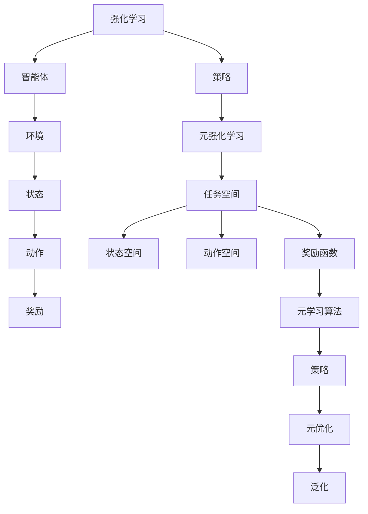

                 

# 《元强化学习在机器人控制中的前沿应用》

## 关键词
- 元强化学习
- 机器人控制
- 强化学习算法
- 机器人路径规划
- 机器人抓取
- 机器人避障
- 多机器人系统

## 摘要
本文旨在探讨元强化学习在机器人控制领域的前沿应用。通过深入分析元强化学习的基本概念、算法原理及其在机器人路径规划、抓取和避障等任务中的应用，本文揭示了元强化学习如何提升机器人控制的自主性和效率。此外，本文还探讨了元强化学习在多机器人系统中的潜在应用，并提出了当前面临的挑战和未来研究方向。通过本文的阅读，读者将对元强化学习在机器人控制中的潜力有更深入的理解。

## 目录

### 第一部分：元强化学习基础

### 第二部分：元强化学习在机器人控制中的应用

### 第三部分：元强化学习在机器人控制中的前沿研究

### 附录

### 附录A：元强化学习相关资源与工具

### 附录B：数学公式和Python代码示例

## 第1章：强化学习与机器人控制概述

### 1.1 强化学习基本概念

强化学习是一种机器学习范式，主要关注如何通过与环境交互来学习最优策略。强化学习由四个主要元素组成：状态（$S$）、动作（$A$）、奖励（$R$）和策略（$\pi$）。在强化学习中，智能体（agent）根据当前状态选择一个动作，然后根据环境提供的反馈（奖励）来调整其行为。最终目标是学习到一个最优策略，使得智能体能够在长时间内获得最大的累计奖励。

强化学习的目标可以表示为以下优化问题：

$$
\pi^* = \arg \max_{\pi} \sum_{s \in S} p(s) \sum_{a \in A} \pi(a|s) R(s, a)
$$

其中，$p(s)$ 表示状态的概率分布，$\pi(a|s)$ 表示在状态 $s$ 下选择动作 $a$ 的概率，$R(s, a)$ 表示在状态 $s$ 下执行动作 $a$ 所获得的即时奖励。

### 1.2 机器人控制基本原理

机器人控制是指通过一定的控制策略使机器人完成特定任务的过程。机器人控制系统通常包括传感器、执行器和控制器三个部分。传感器用于感知机器人周围环境的信息，执行器用于执行具体的物理操作，而控制器则根据感知到的信息生成控制指令，驱动执行器执行相应的动作。

在机器人控制中，常见的控制策略包括：

1. **开环控制**：控制指令不依赖于执行后的反馈，简单直接。
2. **闭环控制**：控制指令依赖于执行后的反馈，通过反馈来不断调整控制行为，提高系统的稳定性和精度。
3. **自适应控制**：根据系统的动态变化自适应调整控制策略。

### 1.3 元强化学习简介

元强化学习（Meta Reinforcement Learning）是一种特殊类型的强化学习，它专注于学习如何快速适应新任务。与传统的强化学习不同，元强化学习旨在通过在多个任务上训练来提高学习效率，而不是在每个单独的任务上从头开始学习。

元强化学习的关键概念包括：

- **任务空间**：由一系列任务组成，每个任务都有其特定的状态空间、动作空间和奖励函数。
- **元学习算法**：能够从一个任务的解决过程中提取通用知识，并应用于解决新的任务。
- **元优化**：在元学习过程中，优化目标是从多个任务中学习到泛化的策略，而不是在每个任务上获得最大的奖励。

元强化学习的目标可以表示为：

$$
\pi^* = \arg \max_{\pi} \sum_{T \in \mathcal{T}} p(T) \sum_{t=0}^{T-1} \gamma^t R_t^T(\pi)
$$

其中，$\mathcal{T}$ 是任务空间，$p(T)$ 是任务 $T$ 的概率分布，$R_t^T(\pi)$ 是在任务 $T$ 下第 $t$ 时刻的即时奖励。

### 1.3.1 元强化学习基本概念架构图



### 第2章：强化学习算法介绍

在本章中，我们将介绍几种常见的强化学习算法，包括Q-learning、SARSA和Deep Q-Network（DQN）。

### 2.1 Q-learning算法

Q-learning算法是一种值函数迭代方法，通过迭代更新值函数来学习最优策略。Q-learning算法的基本思想是预测在给定状态下采取某个动作的长期奖励，然后基于这个预测来更新值函数。

Q-learning的更新公式如下：

$$
Q(s, a) \leftarrow Q(s, a) + \alpha [R(s', a') + \gamma \max_{a''} Q(s', a'') - Q(s, a)]
$$

其中，$s$ 和 $a$ 分别是当前状态和动作，$s'$ 和 $a'$ 是执行动作 $a$ 后的新状态和新动作，$\alpha$ 是学习率，$\gamma$ 是折扣因子。

### 2.2 SARSA算法

SARSA（同步优势估计）算法是一种在线强化学习算法，它与Q-learning类似，但不同的是，SARSA在更新值函数时使用的是当前动作而不是预测的动作。

SARSA的更新公式如下：

$$
Q(s, a) \leftarrow Q(s, a) + \alpha [R(s', a') + \gamma Q(s', a') - Q(s, a)]
$$

### 2.3 Deep Q-Network算法

Deep Q-Network（DQN）算法是深度学习在强化学习领域的一个成功应用。DQN使用深度神经网络来近似值函数，从而能够在高维状态空间中有效学习。

DQN的关键步骤包括：

1. **经验回放**：将智能体与环境的交互经验存储在一个经验回放缓冲区中，以避免策略更新过程中的序列依赖问题。
2. **目标网络**：使用一个目标网络来稳定值函数的更新过程。目标网络是一个参数化的值函数，其参数定期从主网络复制。
3. **双随机行动**：在训练过程中，智能体会以一定的概率随机选择动作，以避免策略过于保守。

DQN的更新公式如下：

$$
\theta^{new} = \theta - \alpha \nabla_{\theta} J(\theta)
$$

其中，$\theta$ 是神经网络参数，$J(\theta)$ 是损失函数，通常使用均方误差（MSE）来衡量预测值与实际值之间的差异。

### 第3章：元强化学习算法介绍

在本章中，我们将介绍几种常见的元强化学习算法，包括Meta-Q学习、MAML和基于模型的元强化学习算法。

### 3.1 元强化学习基本概念

元强化学习是一种针对强化学习任务的学习方法，其目标是提高智能体在多种任务上的适应能力。在元强化学习中，智能体通过在一个多样化的任务集合上进行训练，从而学习到一个通用的策略，能够快速适应新的任务。

元强化学习的基本概念包括：

- **任务适应**：智能体通过学习如何在新的任务上表现，从而提高其适应能力。
- **任务泛化**：智能体能够将学习到的策略应用到与训练任务不同的新任务上。
- **任务多样性**：在元强化学习中，使用多种不同的任务来训练智能体，以提高其泛化能力。

### 3.2 Meta-Q学习算法

Meta-Q学习算法是一种基于值函数迭代的元强化学习算法。它的核心思想是在多个任务上迭代更新值函数，以学习到一个通用的策略。

Meta-Q学习的更新公式如下：

$$
Q(s, a) \leftarrow Q(s, a) + \alpha [R(s', a') + \gamma \max_{a''} Q(s', a'') - Q(s, a)]
$$

其中，$s$ 和 $a$ 分别是当前状态和动作，$s'$ 和 $a'$ 是执行动作 $a$ 后的新状态和新动作，$\alpha$ 是学习率，$\gamma$ 是折扣因子。

### 3.3 MAML算法

MAML（Model-Agnostic Meta-Learning）算法是一种基于模型参数的元强化学习算法。MAML的核心思想是通过在小批量任务上对模型参数进行微调，从而学习到一个对任务变化的鲁棒策略。

MAML的更新公式如下：

$$
\theta^{\prime} = \theta - \alpha \nabla_\theta J(\theta)
$$

其中，$\theta$ 是模型参数，$J(\theta)$ 是损失函数，通常使用均方误差（MSE）来衡量预测值与实际值之间的差异。

### 3.4 Model-Based元强化学习算法

基于模型的元强化学习算法是一种使用模型来预测环境动态的元强化学习算法。这类算法的核心思想是通过学习环境模型来预测未来的状态和奖励，从而更有效地更新策略。

基于模型的元强化学习算法的关键步骤包括：

1. **环境模型学习**：通过在多个任务上训练，学习到一个对环境动态的通用模型。
2. **策略学习**：使用学习到的环境模型来预测未来的状态和奖励，并基于这些预测来更新策略。
3. **模型更新**：在策略更新过程中，同时更新环境模型，以进一步提高策略的适应性。

### 第4章：机器人路径规划

机器人路径规划是指为机器人规划一条从起点到终点的路径，使其能够避开障碍物并高效地到达目标位置。在本节中，我们将讨论基于元强化学习的机器人路径规划方法。

### 4.1 路径规划基本概念

路径规划的基本概念包括：

- **状态空间**：包括机器人当前的位置和方向。
- **动作空间**：包括机器人可以执行的动作，如前进、后退、左转和右转。
- **奖励函数**：通常设计为机器人向目标移动的奖励，当机器人接近目标时增加奖励，遇到障碍物时减少奖励。
- **路径**：从起点到终点的合法动作序列。

### 4.2 基于元强化学习的路径规划方法

基于元强化学习的路径规划方法的基本流程如下：

1. **任务初始化**：定义任务空间，包括状态空间、动作空间和奖励函数。
2. **模型训练**：在多个不同的任务上训练元强化学习模型，使其能够适应多样化的路径规划任务。
3. **路径规划**：使用训练好的元强化学习模型来规划机器人的路径，模型根据当前状态和目标位置选择最佳动作序列。

### 4.3 实例分析：元强化学习在无人机路径规划中的应用

在本节中，我们将通过一个具体的实例来分析元强化学习在无人机路径规划中的应用。

**实例背景**：

假设我们需要为无人机设计一个路径规划系统，使其能够自动避开障碍物并高效地到达目标位置。

**实现步骤**：

1. **定义任务空间**：首先，我们需要定义状态空间、动作空间和奖励函数。状态空间包括无人机的位置和方向，动作空间包括前进、后退、左转和右转，奖励函数设计为无人机向目标移动的奖励，遇到障碍物时减少奖励。

2. **模型训练**：在多个不同的障碍物环境中训练元强化学习模型，使其能够学习到通用的路径规划策略。我们可以使用Meta-Q学习算法或MAML算法来训练模型。

3. **路径规划**：使用训练好的元强化学习模型来规划无人机的路径。模型根据当前无人机的位置和目标位置，选择最佳的动作序列。

4. **路径执行**：无人机按照规划的路径执行动作，并在执行过程中不断更新状态，以应对环境的变化。

**代码示例**：

```python
# 伪代码：基于元强化学习的无人机路径规划
class DroneAgent:
    def __init__(self):
        # 初始化元强化学习模型
        self.model = MetaQLearningModel()

    def plan_path(self, state, goal):
        # 使用元强化学习模型规划路径
        action_sequence = self.model.plan(state, goal)
        return action_sequence

    def execute_action(self, action_sequence):
        # 执行路径规划中的动作序列
        for action in action_sequence:
            self.move_drone(action)
            state = self.get_new_state()
            reward = self.get_reward(state, goal)
            self.model.update(state, action, reward)

# 主程序
drone_agent = DroneAgent()
goal = (x, y)
state = drone_agent.get_initial_state()
action_sequence = drone_agent.plan_path(state, goal)
drone_agent.execute_action(action_sequence)
```

### 第5章：机器人抓取

机器人抓取是指机器人通过其机械臂或其他抓取装置从环境中抓取物体的过程。在本节中，我们将探讨基于元强化学习的机器人抓取方法。

### 5.1 抓取任务概述

抓取任务通常包括以下几个步骤：

1. **感知**：使用传感器（如相机、激光雷达等）获取环境信息。
2. **检测**：识别和定位目标物体。
3. **规划**：根据目标物体的位置和姿态，规划机械臂的运动轨迹。
4. **执行**：执行抓取动作，将物体从环境中取出。
5. **验证**：检查抓取是否成功，必要时进行调整。

### 5.2 基于元强化学习的机器人抓取方法

基于元强化学习的机器人抓取方法的基本流程如下：

1. **任务初始化**：定义抓取任务的状态空间、动作空间和奖励函数。
2. **模型训练**：在多个不同的抓取任务上训练元强化学习模型，使其能够学习到通用的抓取策略。
3. **抓取规划**：使用训练好的元强化学习模型来规划机械臂的运动轨迹和抓取动作。
4. **抓取执行**：机械臂按照规划的轨迹和动作执行抓取任务。
5. **抓取验证**：检查抓取是否成功，必要时进行调整。

### 5.3 实例分析：元强化学习在工业机器人抓取中的应用

在本节中，我们将通过一个具体的实例来分析元强化学习在工业机器人抓取中的应用。

**实例背景**：

假设我们有一个工业机器人，需要在自动化生产线上抓取不同形状和大小的零件。

**实现步骤**：

1. **定义任务空间**：首先，我们需要定义抓取任务的状态空间、动作空间和奖励函数。状态空间包括机器人的当前位置和抓取装置的姿态，动作空间包括抓取装置的移动和姿态调整，奖励函数设计为成功抓取零件的奖励，失败时减少奖励。

2. **模型训练**：在多个不同的零件上训练元强化学习模型，使其能够学习到通用的抓取策略。我们可以使用Meta-Q学习算法或MAML算法来训练模型。

3. **抓取规划**：使用训练好的元强化学习模型来规划机械臂的运动轨迹和抓取动作。模型根据当前机器人的位置和抓取装置的姿态，选择最佳的动作序列。

4. **抓取执行**：机械臂按照规划的轨迹和动作执行抓取任务。

5. **抓取验证**：检查抓取是否成功，必要时进行调整。

**代码示例**：

```python
# 伪代码：基于元强化学习的机器人抓取
class RobotGrasper:
    def __init__(self):
        # 初始化元强化学习模型
        self.model = MetaQLearningModel()

    def grasp_object(self, state, object):
        # 使用元强化学习模型规划抓取动作
        action_sequence = self.model.plan(state, object)
        return action_sequence

    def execute_action(self, action_sequence):
        # 执行抓取动作序列
        for action in action_sequence:
            self.move_grasper(action)
            state = self.get_new_state()
            reward = self.get_reward(state)
            self.model.update(state, action, reward)

# 主程序
grasper = RobotGrasper()
objects = get_objects()
for object in objects:
    state = grasper.get_initial_state()
    action_sequence = grasper.grasp_object(state, object)
    grasper.execute_action(action_sequence)
```

### 第6章：机器人避障

机器人避障是指机器人能够在复杂环境中自主避开障碍物，并到达预定目标位置的过程。在本节中，我们将探讨基于元强化学习的机器人避障方法。

### 6.1 避障任务概述

避障任务通常包括以下几个步骤：

1. **感知**：使用传感器获取环境信息。
2. **检测**：识别和定位障碍物。
3. **决策**：根据障碍物的位置和机器人的当前位置，决定机器人的运动方向。
4. **执行**：执行决策，调整机器人的方向或速度。
5. **反馈**：根据执行结果更新感知信息。

### 6.2 基于元强化学习的机器人避障方法

基于元强化学习的机器人避障方法的基本流程如下：

1. **任务初始化**：定义避障任务的状态空间、动作空间和奖励函数。
2. **模型训练**：在多个不同的避障任务上训练元强化学习模型，使其能够学习到通用的避障策略。
3. **避障规划**：使用训练好的元强化学习模型来规划机器人的运动路径和避障动作。
4. **避障执行**：机器人按照规划的路径和动作执行避障任务。
5. **避障验证**：检查避障是否成功，必要时进行调整。

### 6.3 实例分析：元强化学习在智能车避障中的应用

在本节中，我们将通过一个具体的实例来分析元强化学习在智能车避障中的应用。

**实例背景**：

假设我们有一个智能车，需要在复杂环境中自主行驶并避开障碍物。

**实现步骤**：

1. **定义任务空间**：首先，我们需要定义避障任务的状态空间、动作空间和奖励函数。状态空间包括智能车的位置和速度，动作空间包括加速、减速和转向，奖励函数设计为成功避开障碍物的奖励，碰撞障碍物时减少奖励。

2. **模型训练**：在多个不同的障碍物环境中训练元强化学习模型，使其能够学习到通用的避障策略。我们可以使用Meta-Q学习算法或MAML算法来训练模型。

3. **避障规划**：使用训练好的元强化学习模型来规划智能车的运动路径和避障动作。模型根据当前智能车的位置和速度，选择最佳的动作序列。

4. **避障执行**：智能车按照规划的路径和动作执行避障任务。

5. **避障验证**：检查避障是否成功，必要时进行调整。

**代码示例**：

```python
# 伪代码：基于元强化学习的智能车避障
class CarAgent:
    def __init__(self):
        # 初始化元强化学习模型
        self.model = MetaQLearningModel()

    def avoid_obstacle(self, state, obstacle):
        # 使用元强化学习模型规划避障动作
        action_sequence = self.model.plan(state, obstacle)
        return action_sequence

    def execute_action(self, action_sequence):
        # 执行避障动作序列
        for action in action_sequence:
            self.move_car(action)
            state = self.get_new_state()
            reward = self.get_reward(state, obstacle)
            self.model.update(state, action, reward)

# 主程序
car_agent = CarAgent()
obstacles = get_obstacles()
for obstacle in obstacles:
    state = car_agent.get_initial_state()
    action_sequence = car_agent.avoid_obstacle(state, obstacle)
    car_agent.execute_action(action_sequence)
```

### 第7章：元强化学习在多机器人系统中的应用

多机器人系统是指由多个机器人协同工作来完成复杂任务的系统。在本节中，我们将探讨元强化学习在多机器人系统中的应用。

### 7.1 多机器人系统概述

多机器人系统通常包括以下几个组成部分：

- **机器人**：执行具体任务的智能体。
- **通信网络**：连接机器人，实现数据传输和协同工作的基础设施。
- **控制策略**：指导机器人协同工作的算法。

多机器人系统的关键特性包括：

- **协同效应**：多个机器人协同工作能够实现比单个机器人更复杂的任务。
- **容错性**：系统中一个或多个机器人发生故障时，其他机器人可以继续完成任务。
- **动态适应性**：系统能够根据环境变化和任务需求调整机器人的协作策略。

### 7.2 基于元强化学习的多机器人协作方法

基于元强化学习的多机器人协作方法的基本流程如下：

1. **任务初始化**：定义多机器人协作任务的状态空间、动作空间和奖励函数。
2. **模型训练**：在多个协作任务上训练元强化学习模型，使其能够学习到通用的协作策略。
3. **协作规划**：使用训练好的元强化学习模型来规划机器人的协作策略。
4. **协作执行**：机器人按照规划的协作策略执行任务。
5. **协作验证**：检查协作是否成功，必要时进行调整。

### 7.3 实例分析：元强化学习在仓库机器人协作中的应用

在本节中，我们将通过一个具体的实例来分析元强化学习在仓库机器人协作中的应用。

**实例背景**：

假设我们需要在仓库中自动化管理物品的存储和检索，仓库中有多个机器人负责执行不同的任务。

**实现步骤**：

1. **定义任务空间**：首先，我们需要定义仓库机器人协作任务的状态空间、动作空间和奖励函数。状态空间包括机器人的位置和任务状态，动作空间包括机器人的移动和任务执行，奖励函数设计为完成任务时增加奖励，任务失败时减少奖励。

2. **模型训练**：在多个不同的仓库环境中训练元强化学习模型，使其能够学习到通用的协作策略。我们可以使用Meta-Q学习算法或MAML算法来训练模型。

3. **协作规划**：使用训练好的元强化学习模型来规划机器人的协作策略。模型根据当前机器人的位置和任务状态，选择最佳的动作序列。

4. **协作执行**：机器人按照规划的协作策略执行任务。

5. **协作验证**：检查协作是否成功，必要时进行调整。

**代码示例**：

```python
# 伪代码：基于元强化学习的仓库机器人协作
class WarehouseAgent:
    def __init__(self):
        # 初始化元强化学习模型
        self.model = MetaQLearningModel()

    def coordinate_task(self, state, task):
        # 使用元强化学习模型规划协作动作
        action_sequence = self.model.plan(state, task)
        return action_sequence

    def execute_action(self, action_sequence):
        # 执行协作动作序列
        for action in action_sequence:
            self.move_robots(action)
            state = self.get_new_state()
            reward = self.get_reward(state, task)
            self.model.update(state, action, reward)

# 主程序
warehouse_agent = WarehouseAgent()
tasks = get_tasks()
for task in tasks:
    state = warehouse_agent.get_initial_state()
    action_sequence = warehouse_agent.coordinate_task(state, task)
    warehouse_agent.execute_action(action_sequence)
```

### 第8章：元强化学习在机器人控制中的挑战与未来方向

尽管元强化学习在机器人控制中展现了巨大的潜力，但它仍然面临许多挑战。这些挑战主要集中在算法的效率、适应性和安全性等方面。

#### 8.1 元强化学习在机器人控制中的挑战

1. **计算效率**：元强化学习算法通常需要大量的计算资源，特别是当任务空间和状态空间较大时。这可能导致训练时间过长，不适用于实时控制的场景。
2. **适应性**：尽管元强化学习旨在提高智能体在不同任务上的适应能力，但在某些情况下，它可能无法适应特定任务或环境的变化。
3. **安全性**：在机器人控制中，元强化学习算法必须确保智能体的行为是安全和可靠的。在现实世界中，意外的行为可能导致严重后果。

#### 8.2 元强化学习的未来发展方向

1. **算法优化**：研究更高效的元强化学习算法，降低计算复杂度，提高训练速度。
2. **跨领域适应性**：开发能够更好地适应不同领域和任务的元强化学习算法。
3. **安全性增强**：引入安全性约束和验证机制，确保智能体的行为是安全的。

### 结论

元强化学习在机器人控制领域具有广泛的应用前景。通过本章的探讨，我们了解了元强化学习的基本概念、算法原理以及在机器人路径规划、抓取和避障等任务中的应用。尽管面临挑战，但元强化学习为机器人控制带来了新的可能性，有望在未来实现更智能、更自主的机器人系统。

## 附录

### 附录A：元强化学习相关资源与工具

- **框架**：
  - TensorFlow
  - PyTorch
  - RLlib

- **书籍**：
  - 《深度强化学习》
  - 《强化学习实战》
  - 《元学习：算法、应用与未来》

- **在线课程**：
  - Coursera《强化学习》
  - edX《深度学习和强化学习》

### 附录B：数学公式和Python代码示例

#### 数学公式示例

$$
Q(s, a) \leftarrow Q(s, a) + \alpha [R(s', a') + \gamma \max_{a''} Q(s', a'') - Q(s, a)]
$$

$$
\theta^{\prime} = \theta - \alpha \nabla_\theta J(\theta)
$$

#### Python代码示例：Q-learning算法实现

```python
import numpy as np

class QLearningAgent:
    def __init__(self, n_states, n_actions, learning_rate=0.1, discount_factor=0.99):
        self.learning_rate = learning_rate
        self.discount_factor = discount_factor
        self.q_values = np.zeros((n_states, n_actions))
        
    def choose_action(self, state):
        return np.argmax(self.q_values[state])
        
    def learn(self, state, action, reward, next_state, done):
        if not done:
            max_future_q = np.max(self.q_values[next_state])
            current_q = self.q_values[state][action]
            new_q = current_q + self.learning_rate * (reward + self.discount_factor * max_future_q - current_q)
        else:
            new_q = reward
        
        self.q_values[state][action] = new_q
        
# 主程序
agent = QLearningAgent(n_states=10, n_actions=4)
for episode in range(1000):
    state = env.reset()
    done = False
    while not done:
        action = agent.choose_action(state)
        next_state, reward, done, _ = env.step(action)
        agent.learn(state, action, reward, next_state, done)
        state = next_state
```

### 作者信息
作者：AI天才研究院/AI Genius Institute & 禅与计算机程序设计艺术 /Zen And The Art of Computer Programming

