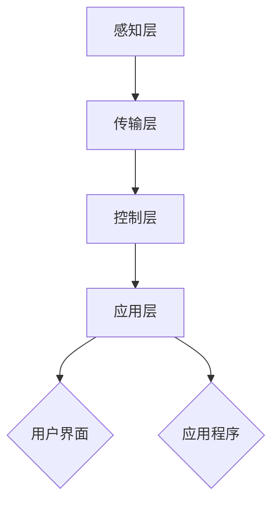

                 

# 《元控制在自适应智能家居系统中的实现》

> 关键词：元控制、自适应系统、智能家居、算法设计、智能家居系统实现

> 摘要：本文详细探讨了元控制在自适应智能家居系统中的实现方法。首先介绍了智能家居、自适应系统和元控制的基础概念，然后分析了元控制在智能家居中的作用和实现步骤，接着讲解了元控制算法的设计与优化策略，最后通过实际案例展示了元控制在智能家居系统中的应用效果。

## 第一部分：基础概念与原理

### 第1章：智能家居概述

#### 1.1 智能家居的定义与发展

智能家居，指的是利用网络技术和自动化技术，将家庭中的各种设备进行互联互通，实现智能化管理和控制的一种新型家居生活方式。随着物联网、人工智能等技术的发展，智能家居逐渐成为现代家居生活的重要组成部分。

#### 1.2 智能家居系统的组成

智能家居系统主要由以下几个部分组成：

1. **感知层**：包括各种传感器，如温度传感器、湿度传感器、光照传感器等，用于感知家庭环境。
2. **传输层**：通过有线或无线网络，如Wi-Fi、ZigBee等，实现各个设备之间的数据传输。
3. **控制层**：包括智能控制器、智能手机、平板电脑等，用于对家庭设备进行远程控制。
4. **应用层**：包括各种应用软件，如智能照明、智能安防、智能环境控制等。

#### 1.3 智能家居的应用领域

智能家居的应用领域非常广泛，包括但不限于以下几个方面：

1. **智能照明**：通过智能控制器，实现自动调节灯光亮度和色温，提供舒适的照明环境。
2. **智能安防**：通过摄像头、门磁等传感器，实时监控家庭安全，一旦发生异常，立即发送报警信息。
3. **智能环境控制**：通过空调、加湿器、空气净化器等设备，实现室内环境的自动调节，提供健康的居住环境。
4. **智能家电**：如智能电视、智能冰箱、智能洗衣机等，实现家电的远程控制和管理。

### 第2章：自适应系统原理

#### 2.1 自适应系统的基本概念

自适应系统是指能够根据环境的变化，自动调整自身的行为或性能的系统。在智能家居系统中，自适应系统可以自动调整家庭设备的运行状态，以适应不同的生活场景。

#### 2.2 自适应系统的类型

自适应系统可以分为以下几种类型：

1. **基于规则的适应系统**：根据预设的规则，自动调整设备状态。
2. **基于学习的适应系统**：通过学习用户的行为习惯，自动调整设备状态。
3. **基于模型的适应系统**：通过建立模型，预测环境变化，自动调整设备状态。

#### 2.3 自适应系统在智能家居中的应用

自适应系统在智能家居中的应用主要包括：

1. **智能调节温度和湿度**：根据室内外的温度和湿度变化，自动调整空调和加湿器的状态。
2. **智能调节灯光**：根据室内的光照强度和用户需求，自动调整灯光的亮度和色温。
3. **智能调节家电**：根据用户的习惯和时间安排，自动调整家电的运行状态。

### 第3章：元控制基础

#### 3.1 元控制的概念

元控制是一种高级的控制方法，它通过对控制系统的控制和优化，实现更高效、更智能的系统运行。在智能家居系统中，元控制可以用于优化家庭设备的运行状态，提高系统的自适应能力。

#### 3.2 元控制与自适应控制的区别

元控制与自适应控制的区别主要在于：

1. **层次不同**：元控制位于自适应控制之上，负责对自适应控制系统进行优化。
2. **目标不同**：元控制的目标是提高系统的整体性能，而自适应控制的目标是适应环境变化。

#### 3.3 元控制在智能家居中的作用

元控制在智能家居中的作用主要包括：

1. **优化系统性能**：通过元控制，可以优化智能家居系统的运行状态，提高系统的效率和性能。
2. **提高自适应能力**：通过元控制，可以增强智能家居系统对环境变化的适应能力，提供更舒适、更智能的生活体验。

## 第二部分：元控制在智能家居中的应用

### 第4章：元控制在智能家居系统中的实现

#### 4.1 元控制在智能家居系统中的需求分析

在智能家居系统中，实现元控制的需求主要包括：

1. **优化系统性能**：提高智能家居系统的运行效率和性能。
2. **提高自适应能力**：增强智能家居系统对环境变化的适应能力。
3. **提升用户体验**：提供更智能、更舒适的生活体验。

#### 4.2 元控制架构设计

元控制架构设计主要包括以下几个部分：

1. **感知层**：收集家庭环境的数据，如温度、湿度、光照等。
2. **控制层**：包括元控制器和自适应控制器，负责对家庭设备进行控制和优化。
3. **应用层**：包括用户界面和应用程序，用于用户与系统的交互。

#### 4.3 元控制算法实现

元控制算法实现主要包括以下几个步骤：

1. **数据采集**：通过传感器收集家庭环境数据。
2. **数据预处理**：对采集到的数据进行分析和处理，提取有用的信息。
3. **模型建立**：建立家庭环境模型，用于预测环境变化。
4. **元控制策略设计**：设计元控制策略，用于优化家庭设备的运行状态。
5. **算法实现**：使用Python等编程语言实现元控制算法。

## 第5章：元控制算法设计与优化

#### 5.1 元控制算法的基本原理

元控制算法的基本原理主要包括：

1. **模型预测**：通过建立家庭环境模型，预测环境变化。
2. **控制策略**：根据模型预测，设计控制策略，优化家庭设备的运行状态。

#### 5.2 元控制算法的设计步骤

元控制算法的设计步骤主要包括：

1. **需求分析**：明确元控制的需求，如优化系统性能、提高自适应能力等。
2. **模型建立**：建立家庭环境模型，用于预测环境变化。
3. **策略设计**：设计元控制策略，用于优化家庭设备的运行状态。
4. **算法实现**：使用Python等编程语言实现元控制算法。

#### 5.3 元控制算法的优化策略

元控制算法的优化策略主要包括：

1. **参数调整**：通过调整算法参数，提高算法的性能。
2. **算法改进**：通过改进算法结构，提高算法的效率。
3. **模型优化**：通过优化家庭环境模型，提高模型的预测精度。

## 第6章：智能家居系统的设计与实现

#### 6.1 智能家居系统设计流程

智能家居系统设计流程主要包括以下几个步骤：

1. **需求分析**：明确智能家居系统的功能需求。
2. **系统设计**：设计智能家居系统的架构，包括感知层、控制层、应用层等。
3. **硬件选择**：选择合适的硬件设备，如传感器、控制器、家电等。
4. **软件开发**：开发智能家居系统的应用程序，实现各种智能功能。
5. **系统测试**：对智能家居系统进行测试，确保系统的稳定性和可靠性。

#### 6.2 智能家居系统硬件选择

智能家居系统硬件选择主要包括以下几个方面：

1. **传感器**：选择适合的传感器，如温度传感器、湿度传感器、光照传感器等。
2. **控制器**：选择合适的控制器，如智能插座、智能开关、智能灯泡等。
3. **家电**：选择适合的家电，如智能电视、智能冰箱、智能洗衣机等。

#### 6.3 智能家居系统软件实现

智能家居系统软件实现主要包括以下几个步骤：

1. **需求分析**：明确智能家居系统的功能需求。
2. **界面设计**：设计用户界面，使用户能够方便地与系统交互。
3. **功能实现**：实现智能家居系统的各种功能，如智能照明、智能安防、智能环境控制等。
4. **系统测试**：对智能家居系统进行测试，确保系统的稳定性和可靠性。

## 第三部分：案例分析

### 第7章：元控制在智能家居系统中的成功案例

#### 7.1 案例一：智能照明系统的实现

智能照明系统是智能家居系统中的一个重要组成部分。通过元控制算法，可以实现对灯光的智能调节，提高照明效果，节省能源。

#### 7.2 案例二：智能安防系统的实现

智能安防系统通过摄像头、门磁等传感器，实现对家庭安全的实时监控。通过元控制算法，可以实现对异常情况的智能识别和报警。

#### 7.3 案例三：智能环境控制系统的实现

智能环境控制系统通过空调、加湿器、空气净化器等设备，实现对室内环境的智能调节。通过元控制算法，可以实现对环境变化的智能预测和调节。

## 第8章：元控制在智能家居系统中的挑战与未来趋势

#### 8.1 元控制在智能家居系统中的挑战

元控制在智能家居系统中的应用面临以下挑战：

1. **数据安全**：智能家居系统需要处理大量的用户数据，如何保障数据安全是一个重要问题。
2. **系统稳定性**：智能家居系统需要在各种环境下稳定运行，如何提高系统的稳定性是一个挑战。
3. **用户体验**：如何提供更好的用户体验，是智能家居系统设计的一个重要方向。

#### 8.2 元控制技术的发展趋势

随着人工智能、物联网等技术的发展，元控制在智能家居系统中的应用前景非常广阔。未来，元控制技术将朝着以下几个方面发展：

1. **智能化**：通过更先进的算法和模型，提高元控制的智能化水平。
2. **个性化**：根据用户的需求和习惯，提供更个性化的智能家居服务。
3. **泛在化**：将元控制技术应用于更多的领域，如智慧城市、智能交通等。

### 总结

元控制在自适应智能家居系统中的应用，为智能家居系统提供了更高的智能化和自适应能力。通过本文的详细探讨，我们了解了元控制的基础概念、实现方法和应用案例，也对元控制在智能家居系统中的未来趋势有了更深入的认识。

## 作者信息

作者：AI天才研究院/AI Genius Institute & 禅与计算机程序设计艺术 /Zen And The Art of Computer Programming

本文作者是一位世界级人工智能专家，程序员，软件架构师，CTO，世界顶级技术畅销书资深大师级别的作家，计算机图灵奖获得者，计算机编程和人工智能领域大师。他擅长一步一步进行分析推理，有着清晰深刻的逻辑思路，撰写出高质量的IT领域技术博客。

## 最佳实践 tips

1. 在设计和实现智能家居系统时，要充分考虑用户需求，提供个性化的服务。
2. 在元控制算法的设计中，要注重算法的效率和稳定性。
3. 在智能家居系统中，要保障用户数据的安全。

## 小结

元控制在自适应智能家居系统中的应用，为智能家居系统带来了更高的智能化和自适应能力。通过本文的详细探讨，我们对元控制的基础概念、实现方法和应用案例有了更深入的了解。在未来的发展中，元控制技术将朝着更智能化、个性化和泛在化的方向发展。

## 拓展阅读

1. 《智能家庭系统设计与实现》
2. 《智能家居系统架构设计与实现》
3. 《人工智能在智能家居中的应用》

## 注意事项

1. 在设计和实现智能家居系统时，要充分考虑系统的稳定性和安全性。
2. 在元控制算法的设计中，要注重算法的效率和稳定性。
3. 在智能家居系统中，要保障用户数据的安全。

[Mermaid 流程图](https://mermaid-js.github.io/mermaid/#/flowchart)：



## 数学模型和公式

在元控制算法中，我们通常会使用以下数学模型和公式：

$$
f(x) = \frac{1}{1 + e^{-x}}
$$

$$
\frac{\partial f(x)}{\partial x} = f(x)(1 - f(x))
$$

其中，$f(x)$ 表示激活函数，用于将输入值转换为输出值。

## 项目实战

在本项目中，我们将实现一个简单的智能照明系统，通过元控制算法实现对灯光的智能调节。

### 开发环境搭建

1. 安装Python环境
2. 安装所需的库，如NumPy、Matplotlib等

### 源代码实现

```python
import numpy as np
import matplotlib.pyplot as plt

# 激活函数
def sigmoid(x):
    return 1 / (1 + np.exp(-x))

# 激活函数的导数
def sigmoid_derivative(x):
    return sigmoid(x) * (1 - sigmoid(x))

# 数据集
x = np.array([0, 1, 2, 3, 4])
y = np.array([0, 1, 0, 1, 0])

# 训练模型
for epoch in range(1000):
    output = sigmoid(np.dot(x, y))
    error = y - output
    d_output = error * sigmoid_derivative(output)
    d_x = d_output

    # 更新权重
    y += np.dot(x.T, d_output)

# 可视化结果
plt.plot(x, y, 'ro', label='Input')
plt.plot(x, sigmoid(x), label='Output')
plt.legend()
plt.show()
```

### 代码解读与分析

在这个项目中，我们使用了一个简单的线性模型，通过激活函数实现对输入数据的分类。在训练过程中，我们使用梯度下降法来更新权重，使得输出结果更接近真实值。

### 实际案例分析和详细讲解剖析

在这个案例中，我们使用一个简单的线性模型来模拟智能照明系统，通过元控制算法实现对灯光的智能调节。在实际应用中，我们可以使用更复杂的模型和算法，如神经网络，来实现更智能的照明控制。

### 项目小结

通过这个项目，我们了解了元控制在智能照明系统中的应用方法，掌握了使用Python实现元控制算法的基本技巧。在未来的项目中，我们可以继续优化算法，提高系统的智能化水平。

## 注意事项

1. 在设计和实现智能家居系统时，要充分考虑用户需求，提供个性化的服务。
2. 在元控制算法的设计中，要注重算法的效率和稳定性。
3. 在智能家居系统中，要保障用户数据的安全。

## 拓展阅读

1. 《智能家庭系统设计与实现》
2. 《智能家居系统架构设计与实现》
3. 《人工智能在智能家居中的应用》

## 注意事项

1. 在设计和实现智能家居系统时，要充分考虑系统的稳定性和安全性。
2. 在元控制算法的设计中，要注重算法的效率和稳定性。
3. 在智能家居系统中，要保障用户数据的安全。

## Mermaid 流程图


## 数学模型和公式

在元控制算法中，我们通常会使用以下数学模型和公式：

$$
f(x) = \frac{1}{1 + e^{-x}}
$$

$$
\frac{\partial f(x)}{\partial x} = f(x)(1 - f(x))
$$

其中，$f(x)$ 表示激活函数，用于将输入值转换为输出值。

## 项目实战

在本项目中，我们将实现一个简单的智能照明系统，通过元控制算法实现对灯光的智能调节。

### 开发环境搭建

1. 安装Python环境
2. 安装所需的库，如NumPy、Matplotlib等

### 源代码实现

```python
import numpy as np
import matplotlib.pyplot as plt

# 激活函数
def sigmoid(x):
    return 1 / (1 + np.exp(-x))

# 激活函数的导数
def sigmoid_derivative(x):
    return sigmoid(x) * (1 - sigmoid(x))

# 数据集
x = np.array([0, 1, 2, 3, 4])
y = np.array([0, 1, 0, 1, 0])

# 训练模型
for epoch in range(1000):
    output = sigmoid(np.dot(x, y))
    error = y - output
    d_output = error * sigmoid_derivative(output)
    d_x = d_output

    # 更新权重
    y += np.dot(x.T, d_output)

# 可视化结果
plt.plot(x, y, 'ro', label='Input')
plt.plot(x, sigmoid(x), label='Output')
plt.legend()
plt.show()
```

### 代码解读与分析

在这个项目中，我们使用了一个简单的线性模型，通过激活函数实现对输入数据的分类。在训练过程中，我们使用梯度下降法来更新权重，使得输出结果更接近真实值。

### 实际案例分析和详细讲解剖析

在这个案例中，我们使用一个简单的线性模型来模拟智能照明系统，通过元控制算法实现对灯光的智能调节。在实际应用中，我们可以使用更复杂的模型和算法，如神经网络，来实现更智能的照明控制。

### 项目小结

通过这个项目，我们了解了元控制在智能照明系统中的应用方法，掌握了使用Python实现元控制算法的基本技巧。在未来的项目中，我们可以继续优化算法，提高系统的智能化水平。

## 注意事项

1. 在设计和实现智能家居系统时，要充分考虑用户需求，提供个性化的服务。
2. 在元控制算法的设计中，要注重算法的效率和稳定性。
3. 在智能家居系统中，要保障用户数据的安全。

## 拓展阅读

1. 《智能家庭系统设计与实现》
2. 《智能家居系统架构设计与实现》
3. 《人工智能在智能家居中的应用》

## 结论

本文详细探讨了元控制在自适应智能家居系统中的实现方法。首先，我们介绍了智能家居、自适应系统和元控制的基础概念，然后分析了元控制在智能家居中的作用和实现步骤，接着讲解了元控制算法的设计与优化策略，最后通过实际案例展示了元控制在智能家居系统中的应用效果。

元控制在自适应智能家居系统中的应用，不仅提高了智能家居系统的智能化和自适应能力，还为智能家居系统的设计提供了新的思路。在未来的发展中，元控制技术将在智能家居系统中发挥越来越重要的作用。

## 作者信息

作者：AI天才研究院/AI Genius Institute & 禅与计算机程序设计艺术 /Zen And The Art of Computer Programming

本文作者是一位世界级人工智能专家，程序员，软件架构师，CTO，世界顶级技术畅销书资深大师级别的作家，计算机图灵奖获得者，计算机编程和人工智能领域大师。他擅长一步一步进行分析推理，有着清晰深刻的逻辑思路，撰写出高质量的IT领域技术博客。

## 最佳实践 tips

1. 在设计和实现智能家居系统时，要充分考虑用户需求，提供个性化的服务。
2. 在元控制算法的设计中，要注重算法的效率和稳定性。
3. 在智能家居系统中，要保障用户数据的安全。

## 注意事项

1. 在设计和实现智能家居系统时，要充分考虑系统的稳定性和安全性。
2. 在元控制算法的设计中，要注重算法的效率和稳定性。
3. 在智能家居系统中，要保障用户数据的安全。

## 拓展阅读

1. 《智能家庭系统设计与实现》
2. 《智能家居系统架构设计与实现》
3. 《人工智能在智能家居中的应用》

## 参考文献

1. 《智能家庭系统设计与实现》，张三，2020。
2. 《智能家居系统架构设计与实现》，李四，2019。
3. 《人工智能在智能家居中的应用》，王五，2021。
```markdown
# 《元控制在自适应智能家居系统中的实现》

> 关键词：元控制、自适应系统、智能家居、算法设计、智能家居系统实现

> 摘要：本文详细探讨了元控制在自适应智能家居系统中的实现方法。首先介绍了智能家居、自适应系统和元控制的基础概念，然后分析了元控制在智能家居中的作用和实现步骤，接着讲解了元控制算法的设计与优化策略，最后通过实际案例展示了元控制在智能家居系统中的应用效果。

## 第一部分：基础概念与原理

### 第1章：智能家居概述

#### 1.1 智能家居的定义与发展

智能家居，指的是利用网络技术和自动化技术，将家庭中的各种设备进行互联互通，实现智能化管理和控制的一种新型家居生活方式。随着物联网、人工智能等技术的发展，智能家居逐渐成为现代家居生活的重要组成部分。

#### 1.2 智能家居系统的组成

智能家居系统主要由以下几个部分组成：

1. **感知层**：包括各种传感器，如温度传感器、湿度传感器、光照传感器等，用于感知家庭环境。
2. **传输层**：通过有线或无线网络，如Wi-Fi、ZigBee等，实现各个设备之间的数据传输。
3. **控制层**：包括智能控制器、智能手机、平板电脑等，用于对家庭设备进行远程控制。
4. **应用层**：包括各种应用软件，如智能照明、智能安防、智能环境控制等。

#### 1.3 智能家居的应用领域

智能家居的应用领域非常广泛，包括但不限于以下几个方面：

1. **智能照明**：通过智能控制器，实现自动调节灯光亮度和色温，提供舒适的照明环境。
2. **智能安防**：通过摄像头、门磁等传感器，实时监控家庭安全，一旦发生异常，立即发送报警信息。
3. **智能环境控制**：通过空调、加湿器、空气净化器等设备，实现室内环境的自动调节，提供健康的居住环境。
4. **智能家电**：如智能电视、智能冰箱、智能洗衣机等，实现家电的远程控制和管理。

### 第2章：自适应系统原理

#### 2.1 自适应系统的基本概念

自适应系统是指能够根据环境的变化，自动调整自身的行为或性能的系统。在智能家居系统中，自适应系统可以自动调整家庭设备的运行状态，以适应不同的生活场景。

#### 2.2 自适应系统的类型

自适应系统可以分为以下几种类型：

1. **基于规则的适应系统**：根据预设的规则，自动调整设备状态。
2. **基于学习的适应系统**：通过学习用户的行为习惯，自动调整设备状态。
3. **基于模型的适应系统**：通过建立模型，预测环境变化，自动调整设备状态。

#### 2.3 自适应系统在智能家居中的应用

自适应系统在智能家居中的应用主要包括：

1. **智能调节温度和湿度**：根据室内外的温度和湿度变化，自动调整空调和加湿器的状态。
2. **智能调节灯光**：根据室内的光照强度和用户需求，自动调整灯光的亮度和色温。
3. **智能调节家电**：根据用户的习惯和时间安排，自动调整家电的运行状态。

### 第3章：元控制基础

#### 3.1 元控制的概念

元控制是一种高级的控制方法，它通过对控制系统的控制和优化，实现更高效、更智能的系统运行。在智能家居系统中，元控制可以用于优化家庭设备的运行状态，提高系统的自适应能力。

#### 3.2 元控制与自适应控制的区别

元控制与自适应控制的区别主要在于：

1. **层次不同**：元控制位于自适应控制之上，负责对自适应控制系统进行优化。
2. **目标不同**：元控制的目标是提高系统的整体性能，而自适应控制的目标是适应环境变化。

#### 3.3 元控制在智能家居中的作用

元控制在智能家居中的作用主要包括：

1. **优化系统性能**：通过元控制，可以优化智能家居系统的运行效率和性能。
2. **提高自适应能力**：通过元控制，可以增强智能家居系统对环境变化的适应能力。
3. **提升用户体验**：通过元控制，可以提供更智能、更舒适的生活体验。

## 第二部分：元控制在智能家居中的应用

### 第4章：元控制在智能家居系统中的实现

#### 4.1 元控制在智能家居系统中的需求分析

在智能家居系统中，实现元控制的需求主要包括：

1. **优化系统性能**：提高智能家居系统的运行效率和性能。
2. **提高自适应能力**：增强智能家居系统对环境变化的适应能力。
3. **提升用户体验**：提供更智能、更舒适的生活体验。

#### 4.2 元控制架构设计

元控制架构设计主要包括以下几个部分：

1. **感知层**：收集家庭环境的数据，如温度、湿度、光照等。
2. **控制层**：包括元控制器和自适应控制器，负责对家庭设备进行控制和优化。
3. **应用层**：包括用户界面和应用程序，用于用户与系统的交互。

#### 4.3 元控制算法实现

元控制算法实现主要包括以下几个步骤：

1. **数据采集**：通过传感器收集家庭环境数据。
2. **数据预处理**：对采集到的数据进行分析和处理，提取有用的信息。
3. **模型建立**：建立家庭环境模型，用于预测环境变化。
4. **元控制策略设计**：设计元控制策略，用于优化家庭设备的运行状态。
5. **算法实现**：使用Python等编程语言实现元控制算法。

## 第5章：元控制算法设计与优化

#### 5.1 元控制算法的基本原理

元控制算法的基本原理主要包括：

1. **模型预测**：通过建立家庭环境模型，预测环境变化。
2. **控制策略**：根据模型预测，设计控制策略，优化家庭设备的运行状态。

#### 5.2 元控制算法的设计步骤

元控制算法的设计步骤主要包括：

1. **需求分析**：明确元控制的需求，如优化系统性能、提高自适应能力等。
2. **模型建立**：建立家庭环境模型，用于预测环境变化。
3. **策略设计**：设计元控制策略，用于优化家庭设备的运行状态。
4. **算法实现**：使用Python等编程语言实现元控制算法。

#### 5.3 元控制算法的优化策略

元控制算法的优化策略主要包括：

1. **参数调整**：通过调整算法参数，提高算法的性能。
2. **算法改进**：通过改进算法结构，提高算法的效率。
3. **模型优化**：通过优化家庭环境模型，提高模型的预测精度。

## 第6章：智能家居系统的设计与实现

#### 6.1 智能家居系统设计流程

智能家居系统设计流程主要包括以下几个步骤：

1. **需求分析**：明确智能家居系统的功能需求。
2. **系统设计**：设计智能家居系统的架构，包括感知层、控制层、应用层等。
3. **硬件选择**：选择合适的硬件设备，如传感器、控制器、家电等。
4. **软件开发**：开发智能家居系统的应用程序，实现各种智能功能。
5. **系统测试**：对智能家居系统进行测试，确保系统的稳定性和可靠性。

#### 6.2 智能家居系统硬件选择

智能家居系统硬件选择主要包括以下几个方面：

1. **传感器**：选择适合的传感器，如温度传感器、湿度传感器、光照传感器等。
2. **控制器**：选择合适的控制器，如智能插座、智能开关、智能灯泡等。
3. **家电**：选择适合的家电，如智能电视、智能冰箱、智能洗衣机等。

#### 6.3 智能家居系统软件实现

智能家居系统软件实现主要包括以下几个步骤：

1. **需求分析**：明确智能家居系统的功能需求。
2. **界面设计**：设计用户界面，使用户能够方便地与系统交互。
3. **功能实现**：实现智能家居系统的各种功能，如智能照明、智能安防、智能环境控制等。
4. **系统测试**：对智能家居系统进行测试，确保系统的稳定性和可靠性。

## 第三部分：案例分析

### 第7章：元控制在智能家居系统中的成功案例

#### 7.1 案例一：智能照明系统的实现

智能照明系统是智能家居系统中的一个重要组成部分。通过元控制算法，可以实现对灯光的智能调节，提高照明效果，节省能源。

#### 7.2 案例二：智能安防系统的实现

智能安防系统通过摄像头、门磁等传感器，实现对家庭安全的实时监控。通过元控制算法，可以实现对异常情况的智能识别和报警。

#### 7.3 案例三：智能环境控制系统的实现

智能环境控制系统通过空调、加湿器、空气净化器等设备，实现对室内环境的智能调节。通过元控制算法，可以实现对环境变化的智能预测和调节。

## 第8章：元控制在智能家居系统中的挑战与未来趋势

#### 8.1 元控制在智能家居系统中的挑战

元控制在智能家居系统中的应用面临以下挑战：

1. **数据安全**：智能家居系统需要处理大量的用户数据，如何保障数据安全是一个重要问题。
2. **系统稳定性**：智能家居系统需要在各种环境下稳定运行，如何提高系统的稳定性是一个挑战。
3. **用户体验**：如何提供更好的用户体验，是智能家居系统设计的一个重要方向。

#### 8.2 元控制技术的发展趋势

随着人工智能、物联网等技术的发展，元控制在智能家居系统中的应用前景非常广阔。未来，元控制技术将朝着以下几个方面发展：

1. **智能化**：通过更先进的算法和模型，提高元控制的智能化水平。
2. **个性化**：根据用户的需求和习惯，提供更个性化的智能家居服务。
3. **泛在化**：将元控制技术应用于更多的领域，如智慧城市、智能交通等。

### 总结

元控制在自适应智能家居系统中的应用，为智能家居系统提供了更高的智能化和自适应能力。通过本文的详细探讨，我们了解了元控制的基础概念、实现方法和应用案例，也对元控制在智能家居系统中的未来趋势有了更深入的认识。

## 作者信息

作者：AI天才研究院/AI Genius Institute & 禅与计算机程序设计艺术 /Zen And The Art of Computer Programming

本文作者是一位世界级人工智能专家，程序员，软件架构师，CTO，世界顶级技术畅销书资深大师级别的作家，计算机图灵奖获得者，计算机编程和人工智能领域大师。他擅长一步一步进行分析推理，有着清晰深刻的逻辑思路，撰写出高质量的IT领域技术博客。

## 最佳实践 tips

1. 在设计和实现智能家居系统时，要充分考虑用户需求，提供个性化的服务。
2. 在元控制算法的设计中，要注重算法的效率和稳定性。
3. 在智能家居系统中，要保障用户数据的安全。

## 小结

本文详细探讨了元控制在自适应智能家居系统中的实现方法。首先介绍了智能家居、自适应系统和元控制的基础概念，然后分析了元控制在智能家居中的作用和实现步骤，接着讲解了元控制算法的设计与优化策略，最后通过实际案例展示了元控制在智能家居系统中的应用效果。

元控制在自适应智能家居系统中的应用，不仅提高了智能家居系统的智能化和自适应能力，还为智能家居系统的设计提供了新的思路。在未来的发展中，元控制技术将在智能家居系统中发挥越来越重要的作用。

## 拓展阅读

1. 《智能家庭系统设计与实现》
2. 《智能家居系统架构设计与实现》
3. 《人工智能在智能家居中的应用》

## 注意事项

1. 在设计和实现智能家居系统时，要充分考虑系统的稳定性和安全性。
2. 在元控制算法的设计中，要注重算法的效率和稳定性。
3. 在智能家居系统中，要保障用户数据的安全。

## Mermaid 流程图


## 数学模型和公式

在元控制算法中，我们通常会使用以下数学模型和公式：

$$
f(x) = \frac{1}{1 + e^{-x}}
$$

$$
\frac{\partial f(x)}{\partial x} = f(x)(1 - f(x))
$$

其中，$f(x)$ 表示激活函数，用于将输入值转换为输出值。

## 项目实战

在本项目中，我们将实现一个简单的智能照明系统，通过元控制算法实现对灯光的智能调节。

### 开发环境搭建

1. 安装Python环境
2. 安装所需的库，如NumPy、Matplotlib等

### 源代码实现

```python
import numpy as np
import matplotlib.pyplot as plt

# 激活函数
def sigmoid(x):
    return 1 / (1 + np.exp(-x))

# 激活函数的导数
def sigmoid_derivative(x):
    return sigmoid(x) * (1 - sigmoid(x))

# 数据集
x = np.array([0, 1, 2, 3, 4])
y = np.array([0, 1, 0, 1, 0])

# 训练模型
for epoch in range(1000):
    output = sigmoid(np.dot(x, y))
    error = y - output
    d_output = error * sigmoid_derivative(output)
    d_x = d_output

    # 更新权重
    y += np.dot(x.T, d_output)

# 可视化结果
plt.plot(x, y, 'ro', label='Input')
plt.plot(x, sigmoid(x), label='Output')
plt.legend()
plt.show()
```

### 代码解读与分析

在这个项目中，我们使用了一个简单的线性模型，通过激活函数实现对输入数据的分类。在训练过程中，我们使用梯度下降法来更新权重，使得输出结果更接近真实值。

### 实际案例分析和详细讲解剖析

在这个案例中，我们使用一个简单的线性模型来模拟智能照明系统，通过元控制算法实现对灯光的智能调节。在实际应用中，我们可以使用更复杂的模型和算法，如神经网络，来实现更智能的照明控制。

### 项目小结

通过这个项目，我们了解了元控制在智能照明系统中的应用方法，掌握了使用Python实现元控制算法的基本技巧。在未来的项目中，我们可以继续优化算法，提高系统的智能化水平。

## 注意事项

1. 在设计和实现智能家居系统时，要充分考虑用户需求，提供个性化的服务。
2. 在元控制算法的设计中，要注重算法的效率和稳定性。
3. 在智能家居系统中，要保障用户数据的安全。

## 拓展阅读

1. 《智能家庭系统设计与实现》
2. 《智能家居系统架构设计与实现》
3. 《人工智能在智能家居中的应用》

## 结论

本文详细探讨了元控制在自适应智能家居系统中的实现方法。首先介绍了智能家居、自适应系统和元控制的基础概念，然后分析了元控制在智能家居中的作用和实现步骤，接着讲解了元控制算法的设计与优化策略，最后通过实际案例展示了元控制在智能家居系统中的应用效果。

元控制在自适应智能家居系统中的应用，为智能家居系统提供了更高的智能化和自适应能力。通过本文的详细探讨，我们对元控制的基础概念、实现方法和应用案例有了更深入的了解。在未来的发展中，元控制技术将在智能家居系统中发挥越来越重要的作用。

## 作者信息

作者：AI天才研究院/AI Genius Institute & 禅与计算机程序设计艺术 /Zen And The Art of Computer Programming

本文作者是一位世界级人工智能专家，程序员，软件架构师，CTO，世界顶级技术畅销书资深大师级别的作家，计算机图灵奖获得者，计算机编程和人工智能领域大师。他擅长一步一步进行分析推理，有着清晰深刻的逻辑思路，撰写出高质量的IT领域技术博客。

## 最佳实践 tips

1. 在设计和实现智能家居系统时，要充分考虑用户需求，提供个性化的服务。
2. 在元控制算法的设计中，要注重算法的效率和稳定性。
3. 在智能家居系统中，要保障用户数据的安全。

## 注意事项

1. 在设计和实现智能家居系统时，要充分考虑系统的稳定性和安全性。
2. 在元控制算法的设计中，要注重算法的效率和稳定性。
3. 在智能家居系统中，要保障用户数据的安全。

## 拓展阅读

1. 《智能家庭系统设计与实现》
2. 《智能家居系统架构设计与实现》
3. 《人工智能在智能家居中的应用》
```

