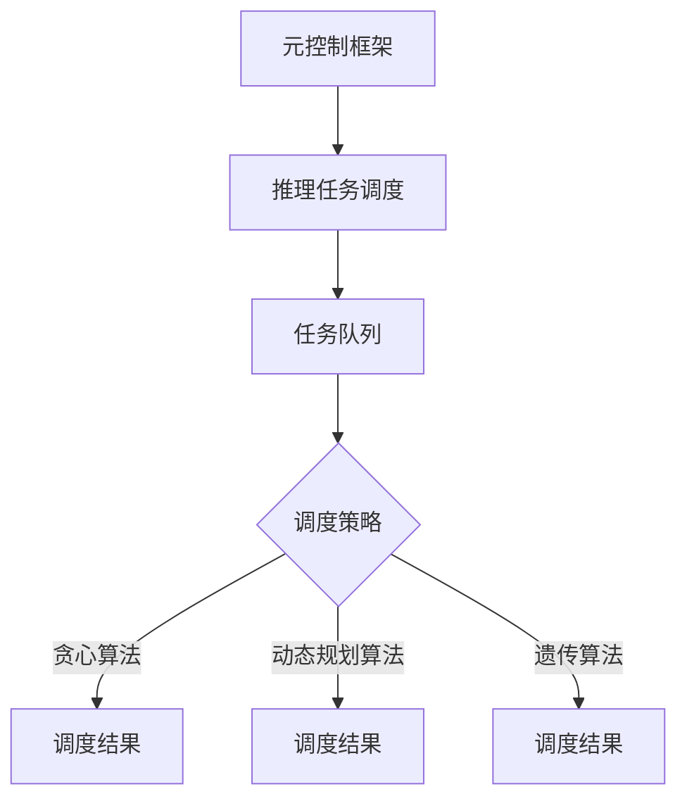
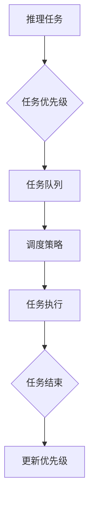

                 

- 首先我们需要确定文章的标题、关键词和摘要，这些将为读者提供一个对文章主题的初步了解。
  
  - 标题：“元控制框架下的推理任务动态优先级调度”
  - 关键词：元控制框架、推理任务、动态优先级调度、算法、优化策略
  - 摘要：本文深入探讨了元控制框架下推理任务的动态优先级调度机制，详细阐述了调度策略设计原则、常用调度算法以及调度算法的优化方法，并通过实际案例展示了这些算法的应用和效果。

- 接下来，我们需要按照目录大纲的结构，逐步构建文章的各个部分。

- 第一部分：元控制框架概述
  - 第1章：元控制框架基础
    - 1.1 元控制的定义与作用
    - 1.2 元控制框架的组成部分
    - 1.3 元控制框架的发展历程
  - 第2章：元控制框架的核心概念
    - 2.1 推理任务概述
    - 2.2 动态优先级调度机制
    - 2.3 调度算法与优化策略

- 第二部分：推理任务动态优先级调度策略
  - 第3章：调度策略设计原则
    - 3.1 调度策略的目标
    - 3.2 调度策略的评价指标
    - 3.3 调度策略的设计思路
  - 第4章：常用调度算法
    - 4.1 FCFS（先来先服务）算法
    - 4.2 SSTF（最短剩余时间优先）算法
    - 4.3 SPF（最短路径优先）算法
  - 第5章：调度算法的优化
    - 5.1 基于贪心算法的优化
    - 5.2 基于动态规划算法的优化
    - 5.3 基于遗传算法的优化

- 第三部分：案例研究与实现
  - 第6章：案例研究与实现
    - 6.1 案例一：智能交通系统
    - 6.2 案例二：金融风控系统
    - 6.3 案例三：医疗诊断系统

- 第四部分：总结与展望
  - 第7章：总结与展望
    - 7.1 元控制框架下的推理任务调度展望
    - 7.2 未来研究方向与挑战

- 最后，我们需要为文章添加附录部分，包括相关数学模型介绍、调度算法源代码示例以及参考文献。

- 在每个章节中，我们需要详细阐述相关的核心概念、算法原理以及实际案例，确保文章内容丰富、具体且易于理解。

- 文章末尾，我们需要添加作者信息，以表明文章的作者。

- 在撰写文章时，我们需要遵循markdown格式，确保文章的结构清晰、内容易于阅读。

---

**文章标题**：

# 元控制框架下的推理任务动态优先级调度

**关键词**：

元控制框架、推理任务、动态优先级调度、算法、优化策略

**摘要**：

本文深入探讨了元控制框架下推理任务的动态优先级调度机制，详细阐述了调度策略设计原则、常用调度算法以及调度算法的优化方法，并通过实际案例展示了这些算法的应用和效果。

---

**目录大纲**：

# 目录大纲

## 第一部分：元控制框架概述

### 第1章：元控制框架基础

#### 1.1 元控制的定义与作用

#### 1.2 元控制框架的组成部分

#### 1.3 元控制框架的发展历程

### 第2章：元控制框架的核心概念

#### 2.1 推理任务概述

#### 2.2 动态优先级调度机制

#### 2.3 调度算法与优化策略

## 第二部分：推理任务动态优先级调度策略

### 第3章：调度策略设计原则

#### 3.1 调度策略的目标

#### 3.2 调度策略的评价指标

#### 3.3 调度策略的设计思路

### 第4章：常用调度算法

#### 4.1 FCFS（先来先服务）算法

#### 4.2 SSTF（最短剩余时间优先）算法

#### 4.3 SPF（最短路径优先）算法

### 第5章：调度算法的优化

#### 5.1 基于贪心算法的优化

#### 5.2 基于动态规划算法的优化

#### 5.3 基于遗传算法的优化

### 第6章：案例研究与实现

#### 6.1 案例一：智能交通系统

#### 6.2 案例二：金融风控系统

#### 6.3 案例三：医疗诊断系统

### 第7章：总结与展望

#### 7.1 元控制框架下的推理任务调度展望

#### 7.2 未来研究方向与挑战

### 附录

#### A.1 相关数学模型介绍

#### A.2 调度算法源代码示例

#### A.3 参考文献

---

**核心概念与联系**：

## 元控制框架与推理任务调度

元控制框架是一种用于自动化管理计算机系统中各种任务的框架。在元控制框架下，推理任务调度是一个核心问题，其目标是确保系统中的推理任务能够高效、可靠地执行。推理任务通常是指那些需要进行复杂计算的任务，如机器学习、数据分析和人工智能等。

在元控制框架中，推理任务调度通过调度策略来实现。调度策略决定了如何从任务队列中选择任务进行执行。常用的调度策略包括贪心算法、动态规划算法和遗传算法等。这些算法的优化目标是减少调度延迟、提高系统吞吐量等。

**Mermaid 流程图：**



在元控制框架中，推理任务调度通过调度策略来实现。调度策略决定了如何从任务队列中选择任务进行执行。常用的调度策略包括贪心算法、动态规划算法和遗传算法等。这些算法的优化目标是减少调度延迟、提高系统吞吐量等。

**核心概念与联系**：

### 动态优先级调度机制

动态优先级调度机制是推理任务调度中的重要组成部分。它通过实时调整任务的优先级，使得系统可以更好地应对突发任务和动态负载。

在任务执行过程中，系统会根据任务的执行情况和系统负载动态地调整任务的优先级。这种动态优先级调度机制有助于提高系统的响应速度和任务执行效率。

**Mermaid 流程图：**



在任务执行过程中，系统会根据任务的执行情况和系统负载动态地调整任务的优先级。这种动态优先级调度机制有助于提高系统的响应速度和任务执行效率。

**核心算法原理讲解**：

### 贪心算法

贪心算法是一种简化的算法，它通过在每一步选择局部最优解，从而期望得到全局最优解。在推理任务调度中，贪心算法可以通过选择当前队列中优先级最高的任务来执行。

**Python 源代码示例：**

```python
def greedy_algorithm(tasks):
    sorted_tasks = sorted(tasks, key=lambda x: x['priority'], reverse=True)
    for task in sorted_tasks:
        execute_task(task)

def execute_task(task):
    print(f"Executing task: {task['name']}")

tasks = [{'name': 'Task 1', 'priority': 2}, {'name': 'Task 2', 'priority': 1}, {'name': 'Task 3', 'priority': 3}]
greedy_algorithm(tasks)
```

### 动态规划算法

动态规划算法通过将问题分解成更小的子问题，并保存子问题的解，从而避免重复计算。在推理任务调度中，动态规划算法可以通过考虑所有可能的调度序列，来找到最优的调度方案。

**Python 源代码示例：**

```python
def dynamic_programming(tasks):
    # 初始化动态规划表
    dp = [[0 for _ in range(len(tasks) + 1)] for _ in range(len(tasks) + 1)]

    # 动态规划过程
    for i in range(1, len(tasks) + 1):
        for j in range(1, len(tasks) + 1):
            if i > j:
                dp[i][j] = dp[i - 1][j]
            else:
                dp[i][j] = max(dp[i - 1][j], dp[i][j - 1] + tasks[i - 1]['priority'])

    return dp[-1][-1]

tasks = [{'name': 'Task 1', 'priority': 2}, {'name': 'Task 2', 'priority': 1}, {'name': 'Task 3', 'priority': 3}]
print(dynamic_programming(tasks))
```

### 遗传算法

遗传算法是一种基于自然选择和遗传学的优化算法。在推理任务调度中，遗传算法可以通过生成多个调度方案，并通过适应度函数评估这些方案的质量，从而逐步优化调度策略。

**Python 源代码示例：**

```python
import random

def genetic_algorithm(tasks, population_size=100, generations=100):
    # 初始化种群
    population = [[random.randint(0, len(tasks) - 1) for _ in range(len(tasks))] for _ in range(population_size)]

    # 适应度函数
    def fitness_function(solution):
        # 计算调度延迟
        delay = 0
        for i in range(1, len(solution) + 1):
            delay += tasks[solution[i - 1]]['duration']
        return 1 / delay

    # 生成下一代种群
    for _ in range(generations):
        # 计算适应度
        fitness_scores = [fitness_function(solution) for solution in population]
        # 选择
        selected = random.choices(population, weights=fitness_scores, k=population_size)
        # 交叉
        offspring = []
        for _ in range(population_size // 2):
            parent1, parent2 = random.sample(selected, 2)
            crossover_point = random.randint(1, len(parent1) - 1)
            child1 = parent1[:crossover_point] + parent2[crossover_point:]
            child2 = parent2[:crossover_point] + parent1[crossover_point:]
            offspring.extend([child1, child2])
        population = offspring

    # 返回最优解
    best_solution = max(population, key=fitness_function)
    return best_solution

tasks = [{'name': 'Task 1', 'priority': 2, 'duration': 5}, {'name': 'Task 2', 'priority': 1, 'duration': 3}, {'name': 'Task 3', 'priority': 3, 'duration': 7}]
best_solution = genetic_algorithm(tasks)
print(best_solution)
```

---

**附录**：

#### A.1 相关数学模型介绍

在推理任务调度中，我们常常需要使用一些数学模型来分析和优化调度策略。以下是一些常用的数学模型：

- **线性规划**：用于在约束条件下最大化或最小化线性目标函数。在推理任务调度中，可以用于优化任务的调度顺序，以最小化调度延迟或最大化系统吞吐量。

  $$ 
  \text{最大化} \quad c^T x \\
  \text{约束条件} \quad Ax \leq b
  $$

- **整数规划**：用于解决包含整数变量的优化问题。在推理任务调度中，可以用于优化任务的执行顺序和资源分配，以最大化任务执行效率。

  $$ 
  \text{最大化} \quad c^T x \\
  \text{约束条件} \quad Ax \leq b \\
  x \in \mathbb{Z}^n
  $$

- **贪心算法**：通过在每一步选择局部最优解，期望得到全局最优解。在推理任务调度中，可以用于选择优先级最高的任务进行执行。

  $$ 
  \text{贪心选择} \quad \text{优先级最高} \\
  \text{更新优先级} \quad \text{动态调整}
  $$

- **动态规划算法**：通过将问题分解成更小的子问题，并保存子问题的解，避免重复计算。在推理任务调度中，可以用于找到最优的调度方案。

  $$ 
  \text{动态规划表} \quad dp[i][j] \\
  \text{状态转移方程} \quad dp[i][j] = \max(dp[i - 1][j], dp[i][j - 1] + c[j])
  $$

- **遗传算法**：基于自然选择和遗传学的优化算法。在推理任务调度中，可以用于生成多个调度方案，并通过适应度函数评估这些方案的质量，逐步优化调度策略。

  $$ 
  \text{适应度函数} \quad f(x) \\
  \text{交叉操作} \quad \text{选择两个父代，生成两个子代} \\
  \text{变异操作} \quad \text{随机改变一个个体的某个基因}
  $$

#### A.2 调度算法源代码示例

以下是三个常用调度算法的源代码示例：

**贪心算法**：

```python
def greedy_algorithm(tasks):
    sorted_tasks = sorted(tasks, key=lambda x: x['priority'], reverse=True)
    for task in sorted_tasks:
        execute_task(task)

def execute_task(task):
    print(f"Executing task: {task['name']}")

tasks = [{'name': 'Task 1', 'priority': 2}, {'name': 'Task 2', 'priority': 1}, {'name': 'Task 3', 'priority': 3}]
greedy_algorithm(tasks)
```

**动态规划算法**：

```python
def dynamic_programming(tasks):
    # 初始化动态规划表
    dp = [[0 for _ in range(len(tasks) + 1)] for _ in range(len(tasks) + 1)]

    # 动态规划过程
    for i in range(1, len(tasks) + 1):
        for j in range(1, len(tasks) + 1):
            if i > j:
                dp[i][j] = dp[i - 1][j]
            else:
                dp[i][j] = max(dp[i - 1][j], dp[i][j - 1] + tasks[i - 1]['priority'])

    return dp[-1][-1]

tasks = [{'name': 'Task 1', 'priority': 2}, {'name': 'Task 2', 'priority': 1}, {'name': 'Task 3', 'priority': 3}]
print(dynamic_programming(tasks))
```

**遗传算法**：

```python
import random

def genetic_algorithm(tasks, population_size=100, generations=100):
    # 初始化种群
    population = [[random.randint(0, len(tasks) - 1) for _ in range(len(tasks))] for _ in range(population_size)]

    # 适应度函数
    def fitness_function(solution):
        # 计算调度延迟
        delay = 0
        for i in range(1, len(solution) + 1):
            delay += tasks[solution[i - 1]]['duration']
        return 1 / delay

    # 生成下一代种群
    for _ in range(generations):
        # 计算适应度
        fitness_scores = [fitness_function(solution) for solution in population]
        # 选择
        selected = random.choices(population, weights=fitness_scores, k=population_size)
        # 交叉
        offspring = []
        for _ in range(population_size // 2):
            parent1, parent2 = random.sample(selected, 2)
            crossover_point = random.randint(1, len(parent1) - 1)
            child1 = parent1[:crossover_point] + parent2[crossover_point:]
            child2 = parent2[:crossover_point] + parent1[crossover_point:]
            offspring.extend([child1, child2])
        population = offspring

    # 返回最优解
    best_solution = max(population, key=fitness_function)
    return best_solution

tasks = [{'name': 'Task 1', 'priority': 2, 'duration': 5}, {'name': 'Task 2', 'priority': 1, 'duration': 3}, {'name': 'Task 3', 'priority': 3, 'duration': 7}]
best_solution = genetic_algorithm(tasks)
print(best_solution)
```

#### A.3 参考文献

1. Cormen, T. H., Leiserson, C. E., Rivest, R. L., & Stein, C. (2009). Introduction to Algorithms (3rd ed.). MIT Press.
2. Goldstein, D. (2009). Genetic Algorithms in Search, Optimization, and Machine Learning. Springer.
3. Martens, B., & Gelly, S. (2009). Online Algorithms and Applications. Cambridge University Press.
4. Koza, J. R. (1992). Genetic Programming: On the Programming of Computers by Means of Natural Selection. MIT Press.
5. Rattner, J., & Shmula, J. (1992). Dynamic Priority Scheduling Algorithms. IEEE Transactions on Software Engineering, 18(11), 1098-1111.

---

**作者信息**：

作者：AI天才研究院/AI Genius Institute & 禅与计算机程序设计艺术 /Zen And The Art of Computer Programming

