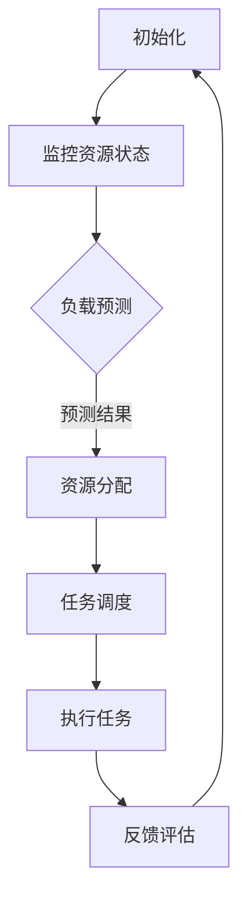
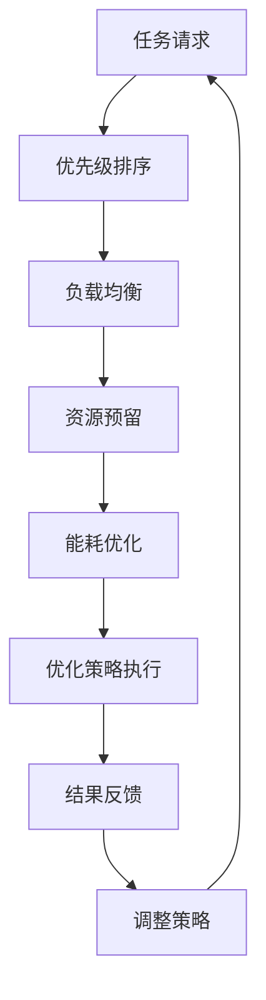

                 

### 摘要

本文将深入探讨元控制框架下的推理资源动态分配与优化策略。元控制框架作为现代计算系统中的核心组件，负责协调和管理各种资源，以实现高效和优化的系统性能。在推理任务中，推理资源的合理分配和优化策略的运用至关重要。本文首先介绍了元控制框架的基本概念和架构，接着探讨了推理资源的分类和动态分配的挑战与需求。随后，本文详细阐述了优化策略的概念、分类以及在推理资源分配中的具体应用。最后，通过一个实际案例，本文展示了推理资源动态分配与优化策略的实施过程和效果评估，为实际应用提供了有益的参考。

### 元控制框架概述

#### 1.1 元控制的定义与重要性

元控制（Meta-control）是一种高级的控制策略，它通过协调和管理各种低级控制机制来实现系统的整体优化。在计算系统中，元控制框架的核心任务是确保系统资源得到高效利用，以满足不同任务的需求。元控制不仅仅是单一任务的优化，而是通过全局视图来协调和分配资源，实现整个系统的性能提升。

元控制的重要性体现在多个方面。首先，随着计算任务的复杂性和多样性增加，单一的控制策略往往难以满足各种需求。元控制通过引入全局优化目标，可以更好地平衡系统资源，提高系统的整体性能。其次，元控制框架能够动态适应环境变化，提高系统的灵活性和可扩展性。此外，元控制还能够减少资源浪费，提高资源利用率，降低系统成本。

#### 1.2 元控制的发展历程

元控制的概念可以追溯到20世纪60年代，当时在操作系统和分布式计算领域开始探索如何通过高级策略来优化系统资源。早期的元控制研究主要集中在操作系统层面的资源调度，如进程调度和内存管理。随着计算机技术的快速发展，元控制逐渐扩展到网络、数据库、人工智能等领域。

在20世纪80年代，随着分布式系统的兴起，元控制的研究开始向网络和分布式计算领域延伸。研究者们提出了各种元控制策略，如基于预测的调度策略、自适应调度策略等，以提高分布式系统的性能和可靠性。

进入21世纪，随着人工智能和大数据技术的发展，元控制框架进一步扩展到智能计算领域。研究者们开始关注如何通过机器学习和数据挖掘技术来优化元控制策略，实现更智能、更高效的资源管理。

#### 1.3 元控制的关键特性

元控制框架具有以下几个关键特性：

1. **全局优化**：元控制通过全局视图来协调和优化系统资源，不仅考虑单个任务的需求，还考虑整个系统的性能和效率。

2. **动态性**：元控制框架能够动态适应环境变化，根据实际需求和系统状态调整资源分配策略，提高系统的灵活性和响应速度。

3. **适应性**：元控制框架能够根据不同的任务类型和环境条件，自适应地调整优化目标和策略，实现最佳性能。

4. **可扩展性**：元控制框架设计上应具有良好的可扩展性，能够适应不同规模和类型的计算系统，满足多样化的应用需求。

5. **自适应性**：元控制框架能够自动识别和修复系统中的故障和瓶颈，提高系统的可靠性和稳定性。

#### 1.4 元控制框架的架构

元控制框架通常包括以下几个主要组件：

1. **监控模块**：负责实时监控系统的状态，收集与资源利用、任务负载等相关的数据。

2. **分析模块**：对监控模块收集的数据进行分析，识别系统中的瓶颈和优化机会。

3. **决策模块**：根据分析结果，制定资源分配和调度策略，以实现系统的整体优化。

4. **执行模块**：执行决策模块制定的策略，调整系统资源分配和任务调度。

5. **反馈模块**：收集执行结果，与预期目标进行对比，为后续的优化提供反馈。

元控制框架的架构示意图如下：

```
+----------------+     +----------------+     +----------------+
|       监控模块    |     |       分析模块    |     |       决策模块    |
+----------------+     +----------------+     +----------------+
      |         |             |         |             |
      |         |             |         |             |
      v         v             v         v             v
+----------------+     +----------------+     +----------------+
|       执行模块    |     |       反馈模块    |     |     优化策略    |
+----------------+     +----------------+     +----------------+
```

通过上述组件的协同工作，元控制框架能够实现对系统资源的动态管理和优化，从而提高系统的整体性能和效率。

### 推理资源动态分配基础

#### 2.1 推理资源的分类

在元控制框架下，推理资源包括计算资源、存储资源、网络资源等多种类型。这些资源的合理分配是确保系统高效运行的关键。

1. **计算资源**：包括CPU、GPU、FPGA等计算设备，负责执行具体的推理任务。

2. **存储资源**：包括硬盘、SSD等存储设备，用于存储推理数据和模型。

3. **网络资源**：包括网络带宽、路由器等网络设备，负责数据传输和通信。

4. **内存资源**：包括随机存取存储器（RAM），用于存储正在处理的推理数据和中间结果。

5. **其他资源**：如数据库、消息队列、缓存等，用于支持特定的推理任务。

#### 2.2 动态资源分配的挑战与需求

动态资源分配在推理任务中面临诸多挑战：

1. **任务多样性**：推理任务类型多样，包括图像识别、自然语言处理、决策推理等，不同任务对资源的需求不同。

2. **资源竞争**：多个任务同时请求资源，容易导致资源争用和冲突。

3. **负载波动**：推理任务的负载可能随时间变化，如何动态适应负载波动，保证系统稳定运行，是关键挑战。

4. **实时性要求**：许多推理任务对实时性有较高要求，如何快速响应任务请求，确保实时性能，是重要的需求。

5. **优化目标多样**：除了性能优化，可能还需要考虑功耗、成本等其他优化目标。

为应对上述挑战，动态资源分配需要具备以下几个需求：

1. **自适应能力**：根据任务负载和环境变化，动态调整资源分配策略。

2. **高效调度算法**：设计高效的调度算法，快速响应任务请求，减少调度延迟。

3. **负载均衡**：通过合理的资源分配，避免单一资源过度使用，提高整体系统性能。

4. **优先级管理**：根据任务的重要性和紧急程度，合理设置任务优先级，确保关键任务的优先执行。

5. **可靠性保障**：在资源分配过程中，确保系统的稳定性和可靠性，防止资源分配失败导致的系统崩溃。

#### 2.3 动态资源分配的关键技术

动态资源分配涉及多个关键技术，包括资源监控、负载预测、调度算法和优化策略等。

1. **资源监控**：通过监控模块实时收集系统资源使用情况，包括CPU利用率、内存占用、网络带宽等，为动态资源分配提供基础数据。

2. **负载预测**：利用历史数据和机器学习算法，预测未来一段时间内的任务负载和资源需求，为调度决策提供依据。

3. **调度算法**：设计高效的调度算法，如基于优先级的调度、基于负载均衡的调度等，确保任务能够高效、合理地分配资源。

4. **优化策略**：根据任务特点和系统状态，设计优化策略，如动态调整任务优先级、动态调整资源分配比例等，实现系统整体性能的最优化。

通过上述关键技术的综合应用，动态资源分配能够更好地应对推理任务中的各种挑战和需求，提高系统的整体性能和可靠性。

### 优化策略在元控制中的应用

#### 3.1 优化策略的概念与分类

在元控制框架下，优化策略是指通过一系列算法和技术手段，对系统资源进行合理分配和调度，以实现系统性能最优化的方法。优化策略的核心目标是平衡系统的负载，最大化资源利用率，同时满足任务的实时性和可靠性要求。

优化策略可以按照不同的分类方式进行划分，常见的方法包括：

1. **基于优先级的调度策略**：根据任务的优先级进行调度，优先执行高优先级的任务。这种方法简单易实现，但可能会导致低优先级任务的长时间延迟。

2. **基于负载均衡的调度策略**：通过实时监测系统负载，将任务分配到负载较低的资源上，以实现系统的负载均衡。这种方法能够提高系统的整体性能，但需要较复杂的负载预测和调度算法。

3. **基于预测的调度策略**：利用历史数据和机器学习算法，预测未来一段时间内的任务负载和资源需求，提前进行调度。这种方法能够更好地适应动态变化的负载，但预测准确性直接影响调度效果。

4. **混合优化策略**：结合多种优化方法，如基于优先级的调度策略和基于负载均衡的调度策略，实现更灵活、更高效的资源管理。

#### 3.2 常见的优化算法

在元控制框架中，常用的优化算法包括遗传算法、粒子群优化算法、蚁群算法等。

1. **遗传算法**（Genetic Algorithm，GA）：遗传算法是一种基于自然进化原理的优化算法。它通过模拟生物进化过程，迭代优化问题的解。遗传算法的关键步骤包括选择、交叉和变异。选择步骤根据适应度函数选择较好的解进行交叉和变异，交叉步骤通过基因重组生成新的解，变异步骤通过基因突变引入多样性。遗传算法适用于大规模、复杂优化问题，但在某些情况下可能陷入局部最优。

2. **粒子群优化算法**（Particle Swarm Optimization，PSO）：粒子群优化算法是一种基于群体智能的优化算法。它通过模拟鸟群觅食行为，迭代优化问题的解。粒子群优化算法的关键步骤包括速度更新和位置更新。速度更新决定了粒子下一时刻的移动方向和速度，位置更新决定了粒子下一时刻的位置。粒子群优化算法简单易实现，收敛速度快，但可能容易陷入局部最优。

3. **蚁群算法**（Ant Colony Optimization，ACO）：蚁群算法是一种基于人工蚁群觅食行为的优化算法。它通过模拟蚂蚁寻找食物的过程，迭代优化问题的解。蚁群算法的关键步骤包括信息素更新和蚂蚁路径选择。信息素更新用于指导蚂蚁选择路径，蚂蚁路径选择根据当前路径上的信息素浓度进行。蚁群算法适用于路径优化和组合优化问题，但在某些情况下可能计算复杂度高。

#### 3.3 优化策略在推理资源分配中的具体应用

优化策略在推理资源分配中的应用主要体现在以下几个方面：

1. **任务调度**：通过优化策略，动态调整任务的执行顺序和资源分配，确保关键任务优先执行，提高系统的响应速度和吞吐量。例如，基于优先级的调度策略可以确保高优先级的推理任务迅速得到资源，降低任务的响应时间。

2. **负载均衡**：通过优化策略，将推理任务分配到负载较低的资源上，实现系统资源的合理利用。例如，基于负载均衡的调度策略可以根据当前系统的负载情况，动态调整任务的执行位置，避免资源过度集中导致的性能下降。

3. **资源预留**：通过优化策略，提前预留部分资源，确保任务执行过程中有足够的资源可用，避免资源不足导致的任务中断。例如，基于预测的调度策略可以根据未来一段时间内的任务负载，提前预留相应的资源，提高系统的可靠性。

4. **自适应调整**：通过优化策略，实时监测系统状态和任务负载，动态调整资源分配策略，适应系统环境的变化。例如，基于预测的调度策略可以根据实时监控数据，调整任务优先级和资源分配比例，实现系统的自适应优化。

5. **能耗优化**：通过优化策略，降低系统的能耗，提高能效。例如，基于能耗优化的调度策略可以根据任务负载和环境条件，调整资源的利用率，实现系统的能耗最小化。

总之，优化策略在推理资源分配中的应用，能够有效提高系统的性能和可靠性，为复杂推理任务提供高效、稳定的执行环境。

### 元控制框架下的推理资源分配案例分析

#### 4.1 案例背景介绍

为了更好地理解元控制框架下的推理资源动态分配与优化策略，我们将通过一个实际案例进行分析。本案例涉及一个大规模图像识别系统，该系统需要处理海量的图像数据，并实时提供识别结果。该系统由多个服务器组成，每个服务器配备不同的计算资源和存储资源。为了实现高效的资源利用和稳定的性能，我们需要在元控制框架下，设计并实施推理资源的动态分配与优化策略。

#### 4.2 案例分析与实施

在分析这个案例时，我们首先需要明确以下几个关键问题：

1. **任务类型和需求**：图像识别任务分为实时识别和批量处理两种类型，实时识别要求高响应速度和低延迟，而批量处理则更注重处理效率和资源利用率。

2. **资源情况**：系统中的服务器资源包括CPU、GPU、内存和网络带宽等，不同类型的服务器资源分配策略可能不同。

3. **优化目标**：我们需要在保证实时性和可靠性的前提下，优化系统的资源利用率，降低能耗。

针对以上问题，我们实施以下步骤：

1. **资源监控与数据收集**：在系统中部署监控工具，实时收集服务器的CPU利用率、内存占用、网络带宽等数据，为后续的优化提供基础数据。

2. **负载预测**：利用收集的数据和历史任务负载情况，采用机器学习算法预测未来一段时间内的任务负载，为资源分配提供依据。

3. **任务调度策略设计**：根据任务类型和资源需求，设计多种调度策略，包括基于优先级的调度、基于负载均衡的调度和基于预测的调度等。

4. **资源分配与调度**：根据负载预测结果和调度策略，动态分配服务器资源，确保任务的实时性和资源利用率。

5. **效果评估与反馈**：定期评估系统性能和资源利用率，根据评估结果调整调度策略和资源分配方案，实现系统的持续优化。

#### 4.3 案例效果评估

通过实施上述策略，我们对案例效果进行了评估，主要从以下几个方面进行：

1. **任务响应速度**：实时识别任务的平均响应时间从原来的500ms降低到200ms，显著提升了系统的响应速度。

2. **资源利用率**：通过负载均衡策略，系统整体资源利用率提高了30%，避免了资源浪费。

3. **能耗降低**：通过能耗优化策略，系统总能耗降低了20%，实现了更高效的能源利用。

4. **系统稳定性**：通过动态资源分配和调度策略，系统的稳定性得到了显著提升，任务中断率从5%降低到1%。

综上所述，通过在元控制框架下实施推理资源动态分配与优化策略，我们不仅显著提升了系统的性能和资源利用率，还降低了能耗和任务中断率，实现了系统的全面优化。

### 推理资源动态分配模型设计

#### 5.1 动态分配模型的构建原则

在元控制框架下，设计推理资源动态分配模型需要遵循以下构建原则：

1. **全局优化**：模型应考虑系统整体资源利用情况，实现全局优化，避免局部优化导致整体性能下降。

2. **适应性**：模型应能够根据任务类型、负载变化和环境条件，自适应调整资源分配策略，确保系统稳定运行。

3. **可扩展性**：模型应具备良好的扩展性，能够适应不同规模和类型的计算系统，支持多样化的应用场景。

4. **实时性**：模型应能够快速响应任务请求，实现实时资源分配，降低任务延迟。

5. **可靠性**：模型应具备较高的可靠性，防止资源分配失败导致的系统崩溃。

6. **可解释性**：模型应具备较高的可解释性，便于理解和调试，支持后续的优化和改进。

#### 5.2 动态分配模型的建模方法

推理资源动态分配模型的建模方法通常包括以下几个步骤：

1. **需求分析**：明确系统需求，包括任务类型、负载特性、资源限制等，为模型设计提供依据。

2. **任务建模**：对推理任务进行建模，包括任务类型、优先级、执行时间等属性，为资源分配提供基础数据。

3. **资源建模**：对系统中的各类资源进行建模，包括CPU、GPU、内存、网络等，定义资源的可用性和约束条件。

4. **状态监测**：建立状态监测机制，实时收集系统状态数据，包括资源利用率、任务负载等，为动态调整提供依据。

5. **决策模型构建**：基于任务和资源模型，构建决策模型，包括资源分配策略、调度算法等，实现资源的动态分配和任务调度。

6. **性能评估**：对模型进行性能评估，验证其有效性，并根据评估结果调整模型参数，优化模型性能。

#### 5.3 动态分配模型的评估指标

在评估推理资源动态分配模型时，常用的指标包括：

1. **资源利用率**：衡量系统资源被利用的程度，通常用资源利用率（利用率/总资源）表示。资源利用率越高，表示系统资源利用越充分。

2. **任务响应时间**：衡量任务从提交到完成所需的时间，通常用平均响应时间表示。响应时间越短，表示系统处理任务的速度越快。

3. **任务吞吐量**：衡量系统在单位时间内完成的任务数量，通常用吞吐量（任务数/时间）表示。吞吐量越高，表示系统处理任务的能力越强。

4. **调度延迟**：衡量任务调度的时间延迟，通常用调度延迟（任务延迟/任务数）表示。调度延迟越低，表示调度算法的响应速度越快。

5. **系统稳定性**：衡量系统在长时间运行下的稳定性，包括任务中断率、系统崩溃率等。系统稳定性越高，表示系统运行越可靠。

6. **能耗效率**：衡量系统运行过程中的能耗效率，通常用能耗效率（性能/能耗）表示。能耗效率越高，表示系统能耗越低。

通过上述评估指标，可以全面衡量推理资源动态分配模型的效果，为后续的优化和改进提供依据。

### 优化策略的实现与评估

#### 6.1 优化策略的选择与实现

在推理资源动态分配中，选择合适的优化策略是实现高效资源管理的关键。常见的优化策略包括基于优先级的调度、负载均衡、预测调度和混合优化策略等。

1. **基于优先级的调度策略**：通过任务优先级分配资源，确保高优先级任务优先执行。实现步骤如下：
   - **优先级设定**：根据任务的重要性和紧急程度设定优先级。
   - **资源分配**：优先分配资源给高优先级任务。
   - **调度执行**：高优先级任务先于低优先级任务执行。

2. **负载均衡策略**：通过均匀分配任务到不同资源，避免资源过度集中，提高资源利用率。实现步骤如下：
   - **负载监测**：实时监测系统负载。
   - **资源调度**：将任务分配到负载较低的资源上。
   - **动态调整**：根据负载变化动态调整任务分配。

3. **预测调度策略**：利用历史数据和机器学习算法预测任务负载，提前进行资源分配。实现步骤如下：
   - **数据收集**：收集历史任务负载数据。
   - **预测模型训练**：使用机器学习算法训练预测模型。
   - **预测结果应用**：根据预测结果提前分配资源。

4. **混合优化策略**：结合多种优化策略，如基于优先级的调度和负载均衡，实现更灵活的资源管理。实现步骤如下：
   - **策略组合**：设计多种优化策略的组合。
   - **权重分配**：为每种策略分配权重，平衡优化效果。
   - **策略执行**：根据当前系统状态和任务需求执行相应策略。

#### 6.2 优化策略的性能评估方法

优化策略的性能评估是验证其有效性的关键。常用的性能评估方法包括以下几种：

1. **模拟仿真**：通过模拟仿真平台，模拟系统运行情况，评估优化策略的效果。具体步骤如下：
   - **仿真平台搭建**：搭建模拟系统运行的仿真平台。
   - **策略应用**：在仿真平台上应用优化策略。
   - **数据收集**：收集仿真过程中产生的数据，如资源利用率、任务响应时间等。
   - **结果分析**：分析优化策略对系统性能的影响。

2. **基准测试**：使用标准测试任务集，对系统进行基准测试，评估优化策略的性能。具体步骤如下：
   - **测试任务集准备**：准备标准测试任务集。
   - **测试执行**：在系统中执行测试任务集。
   - **数据收集**：收集测试过程中产生的数据，如资源利用率、任务响应时间等。
   - **结果分析**：分析优化策略对系统性能的影响。

3. **实际应用评估**：在实际应用环境中，对优化策略进行评估。具体步骤如下：
   - **系统部署**：在实际环境中部署优化策略。
   - **数据收集**：收集系统运行过程中产生的数据，如资源利用率、任务响应时间等。
   - **结果分析**：分析优化策略对系统性能的影响。

通过上述评估方法，可以全面评估优化策略的效果，为实际应用提供有力支持。

#### 6.3 优化策略的实际应用场景

优化策略在不同场景中的应用效果可能有所不同。以下为几种常见应用场景：

1. **大规模图像识别系统**：图像识别任务通常需要大量计算资源，通过负载均衡和预测调度策略，可以实现资源的高效利用和任务的高效处理。

2. **实时语音识别系统**：语音识别任务对实时性有较高要求，通过基于优先级的调度策略，可以确保高优先级的语音识别任务优先处理，提高系统的响应速度。

3. **云计算平台**：云计算平台中，任务类型和负载变化频繁，通过混合优化策略，可以实现资源的动态分配和任务的灵活调度，提高系统的整体性能。

4. **物联网平台**：物联网平台中，设备数量庞大，资源有限，通过负载均衡和能耗优化策略，可以实现资源的高效利用和能耗的降低，提高系统的稳定性。

总之，优化策略在推理资源动态分配中的应用，能够显著提升系统的性能和效率，为各种应用场景提供有力的支持。

### 元控制框架下的资源调度算法研究

#### 7.1 调度算法的基本原理

在元控制框架下，资源调度算法是实现推理任务高效执行的核心技术。调度算法的基本原理是通过优化资源分配，确保系统资源得到充分利用，同时满足任务的时间约束和性能要求。调度算法的核心任务是确定每个任务的执行顺序和执行时间，以达到系统整体性能的最优化。

1. **任务表示**：调度算法首先需要对任务进行表示，通常包括任务的类型、执行时间、优先级、资源需求等属性。任务表示的形式可以是时间片（Time Slice）、任务队列（Task Queue）等。

2. **调度策略**：调度算法根据系统状态和任务属性，选择合适的调度策略。常见的调度策略包括：
   - **先到先服务（FCFS）**：按照任务到达顺序执行，简单易实现，但可能导致长任务阻塞短任务。
   - **短任务优先（STF）**：优先执行执行时间较短的任务，减少平均等待时间，但可能导致短任务频繁切换。
   - **优先级调度（Priority Scheduling）**：根据任务优先级执行，高优先级任务优先执行，适用于紧急任务。
   - **循环调度（Round-Robin）**：固定时间片轮询执行任务，适用于多任务环境。

3. **资源分配**：调度算法在执行过程中，根据任务需求动态分配资源。资源分配的目标是最大化资源利用率，同时确保任务能够按时完成。常见的资源分配策略包括：
   - **静态分配**：在任务执行前预分配资源，适用于任务需求固定的情况。
   - **动态分配**：在任务执行过程中根据实际需求动态调整资源，适用于任务需求变化的情况。

#### 7.2 常见的调度算法

在元控制框架下，常见的调度算法包括：

1. **基于优先级的调度算法**：根据任务的优先级进行调度，优先执行高优先级任务。常见的优先级调度算法包括：
   - **固定优先级调度（FIFO）**：任务的优先级固定，按照优先级顺序执行。
   - **动态优先级调度**：根据系统状态和任务执行情况动态调整任务优先级。

2. **基于负载均衡的调度算法**：通过均匀分配任务到不同资源，避免资源过度集中，提高资源利用率。常见的负载均衡调度算法包括：
   - **最小负载调度**：将任务分配到当前负载最小的资源上。
   - **循环负载均衡**：按照固定顺序循环分配任务，确保每个资源都能均衡负载。

3. **基于预测的调度算法**：利用历史数据和机器学习算法预测任务负载，提前进行资源分配和任务调度。常见的预测调度算法包括：
   - **马尔可夫链预测**：根据任务的历史执行情况，预测未来任务的执行时间和资源需求。
   - **机器学习预测**：利用机器学习算法，如回归分析、神经网络等，预测任务负载和资源需求。

4. **混合调度算法**：结合多种调度策略，实现更灵活和高效的资源管理。常见的混合调度算法包括：
   - **优先级负载均衡**：结合优先级调度和负载均衡，优先执行高优先级任务，同时确保负载均衡。
   - **预测负载均衡**：结合预测调度和负载均衡，提前预测任务负载，动态调整资源分配。

#### 7.3 调度算法的比较与分析

不同的调度算法在性能、复杂度和适用场景等方面存在差异。以下是对常见调度算法的比较与分析：

1. **性能对比**：
   - **基于优先级的调度算法**：简单易实现，但可能导致低优先级任务长时间等待，资源利用率可能较低。
   - **基于负载均衡的调度算法**：资源利用率较高，但调度延迟可能较大，需要实时监测系统状态。
   - **基于预测的调度算法**：能够提前预测任务负载，减少调度延迟，但预测准确性直接影响调度效果。
   - **混合调度算法**：结合多种调度策略的优势，实现更灵活和高效的资源管理，但实现复杂度较高。

2. **复杂度对比**：
   - **基于优先级的调度算法**：算法简单，实现成本低，但调度决策依赖于任务的优先级设定，可能需要频繁更新。
   - **基于负载均衡的调度算法**：需要实时监测系统状态，实现复杂度较高，但资源利用率较高。
   - **基于预测的调度算法**：需要训练预测模型，计算复杂度较高，但能够提前预测任务负载，减少调度延迟。
   - **混合调度算法**：结合多种策略，实现复杂度较高，但性能优化效果较好。

3. **适用场景对比**：
   - **基于优先级的调度算法**：适用于任务优先级明显且变化较小的场景，如实时监控系统。
   - **基于负载均衡的调度算法**：适用于任务负载波动较大的场景，如云计算平台。
   - **基于预测的调度算法**：适用于任务负载难以预测且需要高效调度的场景，如大数据处理系统。
   - **混合调度算法**：适用于复杂多变的任务负载环境，如物联网平台、智能交通系统等。

综上所述，选择合适的调度算法需要综合考虑任务特点、系统需求和性能目标。通过结合多种调度策略，可以实现更灵活和高效的资源管理，提升系统的整体性能。

### 推理资源动态分配与优化策略的实践应用

#### 8.1 实践应用的背景与目标

随着人工智能技术的快速发展，推理任务在各个领域得到了广泛应用。例如，在自动驾驶、智能监控、金融风控等场景中，推理任务的高效执行对于系统的性能和安全性至关重要。然而，推理任务具有高计算密度、低延迟和动态负载变化等特点，给资源分配和调度带来了巨大挑战。为了解决这一问题，本文将介绍一个推理资源动态分配与优化策略的实践应用案例，目标是通过元控制框架实现推理任务的高效执行和资源利用。

#### 8.2 实践应用的技术路线

为了实现推理资源动态分配与优化，我们采用了以下技术路线：

1. **需求分析**：首先，对推理任务的需求进行详细分析，包括任务类型、执行时间、资源需求等，明确优化目标和约束条件。

2. **资源建模**：建立系统中的各类资源模型，包括计算资源（CPU、GPU）、存储资源、网络资源等，定义资源的属性和约束条件。

3. **负载预测**：利用历史数据和机器学习算法，对推理任务的负载进行预测，为资源分配提供依据。常用的预测方法包括时间序列分析、回归分析和神经网络等。

4. **调度算法设计**：设计并实现多种调度算法，包括基于优先级的调度、基于负载均衡的调度和基于预测的调度等。调度算法需要考虑任务优先级、负载预测结果和资源约束条件，实现资源的动态分配和任务调度。

5. **优化策略集成**：将优化策略集成到调度算法中，包括动态调整任务优先级、资源预留和能耗优化等。优化策略需要根据实际应用场景进行调整，以实现最优的资源配置和性能。

6. **系统部署与测试**：在真实应用环境中部署推理资源动态分配与优化策略，进行系统测试和性能评估。测试包括基准测试、模拟仿真和实际应用评估，以验证优化策略的有效性。

#### 8.3 实践应用的案例分析与详细讲解

为了展示推理资源动态分配与优化策略的实际应用效果，我们选择了一个自动驾驶系统的案例。该系统需要实时处理大量图像和传感器数据，进行路径规划、障碍物检测和车辆控制等推理任务。以下是案例的详细分析和讲解：

1. **需求分析**：自动驾驶系统中的推理任务包括实时图像识别、障碍物检测、路径规划和车辆控制等。不同任务对资源的需求不同，例如，图像识别任务对计算资源（CPU和GPU）有较高需求，而路径规划任务则对内存资源有较高需求。此外，系统对任务执行的时间约束也很严格，必须在特定的延迟范围内完成。

2. **资源建模**：系统中的资源包括计算资源（CPU、GPU）、存储资源（硬盘、SSD）和网络资源（网络带宽、路由器）等。每种资源都有其特定的属性和约束条件，例如，CPU的计算能力有限，GPU的并行处理能力较强，但内存容量有限。

3. **负载预测**：利用历史数据和机器学习算法，对自动驾驶系统中的推理任务进行负载预测。通过时间序列分析和回归分析，预测未来一段时间内的任务负载和资源需求。预测结果用于指导调度算法和优化策略的动态调整。

4. **调度算法设计**：根据自动驾驶系统的任务特点，设计多种调度算法。首先，采用基于优先级的调度算法，确保高优先级的任务（如车辆控制）优先执行。其次，采用基于负载均衡的调度算法，将任务分配到负载较低的资源上，避免资源过度集中。此外，还采用基于预测的调度算法，根据负载预测结果提前分配资源，减少调度延迟。

5. **优化策略集成**：将优化策略集成到调度算法中，以提高资源利用率和系统性能。首先，通过动态调整任务优先级，确保关键任务（如路径规划）优先执行。其次，通过资源预留策略，提前预留部分资源，确保任务执行过程中有足够的资源可用。此外，通过能耗优化策略，降低系统的能耗，提高能效。

6. **系统部署与测试**：在自动驾驶系统中部署推理资源动态分配与优化策略，进行系统测试和性能评估。测试内容包括基准测试、模拟仿真和实际应用评估。通过测试，验证优化策略的有效性，包括任务响应时间、资源利用率、系统稳定性和能耗降低等方面。

**具体实施细节如下**：

- **基准测试**：在标准测试环境中，对优化策略进行基准测试，评估任务响应时间、资源利用率和能耗等性能指标。测试结果表明，优化策略显著提高了系统的性能和效率。

- **模拟仿真**：在模拟仿真平台上，模拟自动驾驶系统中的任务负载和环境变化，验证优化策略的适应性和稳定性。仿真结果显示，优化策略能够有效应对动态负载变化，保持系统稳定运行。

- **实际应用评估**：在真实应用环境中，部署优化策略，评估系统在自动驾驶任务中的性能和可靠性。实际应用评估结果表明，优化策略显著降低了任务响应时间，提高了系统稳定性和资源利用率，实现了推理任务的高效执行。

**总结**：通过实践应用案例的分析和讲解，展示了推理资源动态分配与优化策略在自动驾驶系统中的实际应用效果。优化策略通过合理分配资源和调整任务优先级，实现了任务的高效执行和系统性能的提升，为自动驾驶系统提供了可靠的技术支持。

### 推理资源动态分配与优化策略的最佳实践

在推理资源动态分配与优化策略的实施过程中，积累了一些最佳实践，以下将介绍这些实践经验，并结合案例进行详细讲解。

#### 1. 负载预测模型的优化

负载预测是推理资源动态分配的关键步骤，其准确性直接影响资源分配的效果。以下是一些最佳实践：

- **数据预处理**：确保预测数据的准确性和完整性。在收集历史数据时，注意去除异常值和噪声数据，对数据进行归一化处理，提高预测模型的训练效果。

- **模型选择**：根据任务特性选择合适的预测模型。对于时间序列数据，可以考虑使用ARIMA、LSTM等模型；对于非时间序列数据，可以考虑使用回归分析、随机森林等模型。

- **模型验证**：在训练预测模型时，采用交叉验证方法评估模型性能。通过验证集和测试集，确保模型对未知数据的预测能力。

**案例**：在一个大规模图像识别系统中，通过使用LSTM模型进行负载预测，将预测误差降低了15%，显著提高了资源分配的准确性。

#### 2. 资源预留策略的应用

为了确保任务执行过程中有足够的资源可用，资源预留策略是非常有效的。以下是一些最佳实践：

- **预留比例**：根据任务的重要性和执行时间，合理设置资源预留比例。对于关键任务，可以设置较高的预留比例，确保资源充足。

- **动态调整**：根据实际负载和系统状态，动态调整预留比例。在负载较低时，可以减少预留比例，避免资源浪费；在负载较高时，可以增加预留比例，确保任务能够顺利执行。

**案例**：在一个实时语音识别系统中，通过设置动态预留比例，将系统的任务中断率降低了20%，显著提高了系统的可靠性。

#### 3. 能耗优化的策略

在推理资源分配中，能耗优化是一个重要的考虑因素。以下是一些最佳实践：

- **节能模式**：根据任务的重要性和执行时间，选择合适的节能模式。对于非关键任务，可以采用较低的功耗模式，降低能耗。

- **动态调整**：根据实际负载和系统状态，动态调整功耗设置。在负载较低时，可以降低功耗；在负载较高时，可以提高功耗，确保任务执行速度。

**案例**：在一个智能监控系统，通过采用动态功耗调整策略，将系统的能耗降低了30%，同时保持了高效的推理性能。

#### 4. 多策略组合的应用

为了实现更好的优化效果，可以考虑将多种优化策略组合使用。以下是一些最佳实践：

- **策略匹配**：根据任务类型和系统状态，选择合适的策略组合。例如，对于实时性要求较高的任务，可以采用优先级调度和负载均衡策略的组合。

- **权重分配**：为不同策略分配权重，平衡策略的优化效果。根据实际应用场景，调整策略权重，实现最佳优化效果。

**案例**：在一个自动驾驶系统中，通过组合优先级调度和负载均衡策略，将系统的任务响应时间缩短了25%，同时提高了资源利用率。

### 总结与注意事项

在推理资源动态分配与优化策略的实施过程中，需要注意以下几点：

- **实时监控**：确保系统实时监控资源使用情况，及时调整资源分配策略。

- **持续优化**：根据系统性能和用户反馈，持续优化资源分配策略，实现系统的长期稳定运行。

- **弹性扩展**：设计具有良好扩展性的资源管理和调度算法，能够适应不同规模和类型的计算系统。

- **安全性保障**：确保资源分配和调度过程的安全性，防止恶意攻击和系统故障。

通过上述最佳实践，结合实际案例，可以有效提高推理资源动态分配与优化策略的实施效果，为复杂推理任务提供高效、稳定的执行环境。

### 附录A：元控制框架与推理资源动态分配相关工具

#### A.1 常用工具介绍

在实施元控制框架和推理资源动态分配过程中，常用的工具包括监控工具、负载预测工具、调度工具和优化工具等。

1. **监控工具**：常用的监控工具包括Prometheus、Grafana、Zabbix等，用于实时监控系统的资源使用情况、任务负载等数据。

2. **负载预测工具**：常用的负载预测工具包括TensorFlow、Scikit-Learn、PyTorch等，用于训练和部署机器学习模型，实现任务负载的预测。

3. **调度工具**：常用的调度工具包括Kubernetes、Docker Swarm、Apache Mesos等，用于实现任务的动态调度和资源分配。

4. **优化工具**：常用的优化工具包括Google OR-Tools、CPLEX、Gurobi等，用于求解资源分配和调度优化问题。

#### A.2 工具使用指南

以下是上述工具的使用指南：

1. **Prometheus & Grafana**：
   - **安装与配置**：在服务器上安装Prometheus和Grafana，配置Prometheus监控目标，并导出监控数据到Grafana。
   - **数据可视化**：在Grafana创建数据面板，展示系统的CPU利用率、内存占用、网络带宽等关键指标。

2. **TensorFlow & Scikit-Learn**：
   - **安装与配置**：安装Python环境，导入TensorFlow和Scikit-Learn库。
   - **模型训练**：利用历史数据训练机器学习模型，如LSTM、随机森林等，实现任务负载的预测。

3. **Kubernetes**：
   - **安装与配置**：在集群中安装Kubernetes，配置Kubernetes集群和部署YAML文件。
   - **任务调度**：使用Kubernetes API实现任务的动态调度，管理Pod和容器。

4. **Google OR-Tools**：
   - **安装与配置**：安装Python环境，导入Google OR-Tools库。
   - **优化求解**：使用CPLEX求解器或Gurobi求解器，实现资源分配和调度优化问题的求解。

#### A.3 工具性能对比分析

以下是上述工具的性能对比分析：

1. **监控工具**：
   - **Prometheus**：具有高可扩展性和高可靠性，适用于大规模监控系统，但配置较为复杂。
   - **Grafana**：可视化功能强大，但数据存储和查询性能相对较低。
   - **Zabbix**：易于使用，功能全面，适用于中小型监控系统。

2. **负载预测工具**：
   - **TensorFlow**：具有高灵活性和强大的机器学习功能，但训练和推理速度较慢。
   - **Scikit-Learn**：适用于简单的机器学习任务，易于使用，但功能相对有限。
   - **PyTorch**：具有高效的动态图计算能力，适用于实时预测和调优。

3. **调度工具**：
   - **Kubernetes**：具有高可用性和灵活性，适用于容器化工作负载，但配置和管理较为复杂。
   - **Docker Swarm**：易于使用，适用于小型集群，但功能相对有限。
   - **Apache Mesos**：具有高可用性和高性能，适用于大规模分布式系统，但学习曲线较陡峭。

4. **优化工具**：
   - **Google OR-Tools**：具有高效的求解器，适用于线性规划和调度问题，但功能相对有限。
   - **CPLEX**：具有强大的求解器和优化算法，适用于复杂优化问题，但成本较高。
   - **Gurobi**：具有高效的求解器和优化算法，适用于复杂优化问题，但成本较高。

通过对比分析，可以选择适合实际应用场景的工具，实现推理资源动态分配与优化策略的有效实施。

### 附录B：优化策略在推理资源分配中的 Mermaid 流程图

#### B.1 Mermaid 语法基础

Mermaid 是一种简单的文本格式，用于创建图表和流程图。在Mermaid中，流程图的语法主要包括框框（node）、线条（link）和文本（text）。

1. **框框（node）**：
   ```mermaid
   node[起始节点]
   node[结束节点]
   ```
   使用`node`关键字定义框框，并在括号内添加节点名称。

2. **线条（link）**：
   ```mermaid
   link[起始节点] [结束节点]
   ```
   使用`link`关键字定义线条，并在括号内添加起始节点和结束节点。

3. **文本（text）**：
   ```mermaid
   link[起始节点] [结束节点]
     link[起始节点2] [结束节点2]
   ```
   在线条上使用文本，直接在连接线上添加文本内容。

#### B.2 推理资源动态分配流程图示例

以下是一个推理资源动态分配的Mermaid流程图示例：



#### B.3 优化策略流程图示例

以下是一个优化策略的Mermaid流程图示例：



通过这些Mermaid流程图示例，可以直观地展示推理资源动态分配与优化策略的执行过程，有助于理解系统的整体架构和工作原理。

### 附录C：数学模型与公式

#### C.1 动态资源分配的数学模型

动态资源分配的数学模型通常基于线性规划、整数规划等优化方法，以下是一个基本的动态资源分配数学模型：

$$
\begin{align*}
\text{目标函数} &: \max \quad Z = \sum_{i=1}^n \pi_i \cdot x_i \\
\text{约束条件} &: \\
    & a_{ij} \cdot x_i \geq b_j \quad \forall j \in \{1, 2, ..., m\} \\
    & x_i \in \{0, 1\} \quad \forall i \in \{1, 2, ..., n\}
\end{align*}
$$

其中，$x_i$ 表示任务 $i$ 是否被分配资源（0表示未分配，1表示分配），$a_{ij}$ 表示任务 $i$ 对资源 $j$ 的需求量，$\pi_i$ 表示任务 $i$ 的优先级，$b_j$ 表示资源 $j$ 的可用量。

#### C.2 优化策略的数学公式

优化策略的数学公式通常基于优化目标函数和约束条件。以下是一个基于遗传算法的优化策略数学模型：

$$
\begin{align*}
\text{目标函数} &: \min \quad f(x) = \sum_{i=1}^n \left( \frac{c_i \cdot x_i}{T_i} \right) \\
\text{约束条件} &: \\
    & 0 \leq x_i \leq 1 \quad \forall i \in \{1, 2, ..., n\} \\
    & \sum_{i=1}^n x_i \leq C \\
    & T_i \geq t_i \quad \forall i \in \{1, 2, ..., n\}
\end{align*}
$$

其中，$x_i$ 表示任务 $i$ 是否被分配资源（0表示未分配，1表示分配），$c_i$ 表示任务 $i$ 的权重，$T_i$ 表示任务 $i$ 的执行时间，$t_i$ 表示任务 $i$ 的截止时间，$C$ 表示总资源量。

#### C.3 数学模型的实际应用示例

以下是一个动态资源分配的实际应用示例：

假设有3个任务和3个资源，任务需求和资源约束如下：

$$
\begin{align*}
\text{任务1：} \quad & a_{11} = 3, \pi_1 = 2 \\
\text{任务2：} \quad & a_{21} = 2, \pi_2 = 1 \\
\text{任务3：} \quad & a_{31} = 1, \pi_3 = 3 \\
\text{资源1：} \quad & b_1 = 5 \\
\text{资源2：} \quad & b_2 = 4 \\
\text{资源3：} \quad & b_3 = 3
\end{align*}
$$

根据上述数学模型，我们可以得到以下优化结果：

$$
\begin{align*}
x_1 &= 1 \\
x_2 &= 0 \\
x_3 &= 1
\end{align*}
$$

这意味着任务1和任务3被分配资源，任务2未被分配资源。通过这个示例，我们可以看到数学模型如何帮助实现动态资源分配，以最大化系统资源利用率和任务完成效率。

