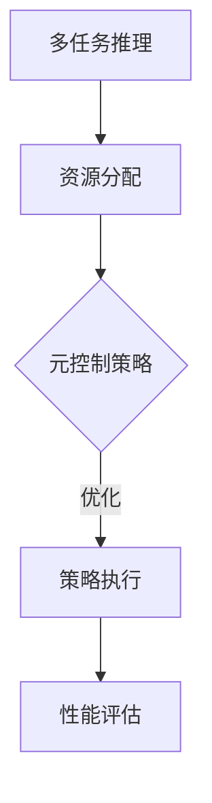

                 

### 《元控制策略优化多任务推理的资源分配》

关键词：元控制策略、多任务推理、资源分配、优化方法、性能评估

摘要：本文旨在探讨元控制策略在多任务推理资源分配中的应用，分析其核心概念、设计原则、优化方法，并通过具体案例进行实战解析。文章首先介绍了多任务推理与资源分配的基本概念，随后深入探讨了元控制策略的基础理论及其应用，最后通过实际项目展示了元控制策略与资源分配策略的有效结合，展望了该领域的发展趋势。

## 目录大纲

### 第一部分：引言

#### 第1章：背景与核心概念
- 1.1 引言：多任务推理与资源分配
- 1.2 元控制策略概述
- 1.3 资源分配的多任务推理挑战

#### 第二部分：多任务推理基础

#### 第2章：多任务推理模型
- 2.1 多任务学习基本概念
- 2.2 多任务推理框架
- 2.3 多任务推理的挑战与优化

#### 第3章：资源分配策略
- 3.1 资源分配的基本原则
- 3.2 动态资源分配策略
- 3.3 静态资源分配策略

#### 第三部分：元控制策略设计

#### 第4章：元控制策略基础
- 4.1 元学习的概念
- 4.2 元控制策略的设计原则
- 4.3 元控制策略的类型

#### 第5章：元控制策略应用
- 5.1 多任务推理中的元控制策略
- 5.2 元控制策略的优化方法
- 5.3 元控制策略的挑战与趋势

#### 第四部分：案例分析

#### 第6章：资源分配在多任务推理中的应用
- 6.1 案例背景
- 6.2 元控制策略设计
- 6.3 资源分配策略实施
- 6.4 案例总结

#### 第7章：综合实战
- 7.1 综合实战项目设计
- 7.2 元控制策略实现
- 7.3 资源分配策略实施
- 7.4 实战总结与展望

#### 第五部分：未来展望

#### 第8章：多任务推理与资源分配的发展趋势
- 8.1 技术发展趋势
- 8.2 应用领域拓展
- 8.3 未来挑战与机遇

#### 附录

#### 第9章：参考文献

### 核心概念与联系

为了更好地理解元控制策略优化多任务推理的资源分配，我们可以使用Mermaid流程图来展示核心概念之间的关系：



图1：多任务推理、资源分配与元控制策略的关系图

- **多任务推理**：在人工智能领域，多任务推理是指模型能够同时处理多个任务的能力。这包括并行处理多个输入数据流，并生成相应的输出。
- **资源分配**：资源分配是指如何在不同任务间分配计算资源，以确保每个任务都能获得足够的资源来有效执行。
- **元控制策略**：元控制策略是一种高级的优化方法，它通过学习如何控制和管理底层资源分配策略来提高整体性能。

通过这个流程图，我们可以看到，元控制策略的核心作用在于优化资源分配，从而提升多任务推理的性能。接下来，我们将逐步深入分析这些概念，并探讨它们在实际应用中的实现细节。

### 数学模型和数学公式

在多任务推理和资源分配中，数学模型和公式扮演着至关重要的角色。以下是一个简要的数学模型示例，用于描述多任务推理中的资源分配问题：

段落内的数学公式：$$ P = \frac{N}{T} $$

这个公式表示了资源利用率（P）是任务数量（N）与时间（T）的比值。为了更详细地阐述资源分配策略，我们引入以下数学模型：

独立段落内的数学公式：

$$
\begin{aligned}
    J(\theta) &= \frac{1}{2m} \sum_{i=1}^{m} \left( h_\theta(x^{(i)}) - y^{(i)} \right)^2 \\
    \theta_j &= \theta_j - \alpha \frac{\partial}{\partial \theta_j} J(\theta)
\end{aligned}
$$`

- **第一个公式**：$J(\theta)$ 是损失函数，表示多任务推理模型在给定参数 $\theta$ 下的总误差。$m$ 是训练样本的数量，$h_\theta(x^{(i)})$ 是模型对输入样本 $x^{(i)}$ 的预测，$y^{(i)}$ 是实际标签。
- **第二个公式**：这是梯度下降算法的一部分，用于更新模型的参数 $\theta_j$，以最小化损失函数 $J(\theta)$。

通过这些数学公式，我们可以量化多任务推理中的资源分配策略，并设计优化算法来调整参数，以提高模型的性能。

#### 项目实战

在本节中，我们将通过一个实际项目展示如何将元控制策略应用于多任务推理的资源分配。以下是项目的开发环境搭建、源代码实现和代码解读与分析。

##### 开发环境搭建

1. **安装 TensorFlow 和 Keras**：TensorFlow 是一款强大的开源机器学习框架，Keras 是其高层次的 API，便于快速构建和训练模型。

```bash
pip install tensorflow
pip install keras
```

2. **安装 NumPy 和 Matplotlib**：NumPy 用于数据操作，Matplotlib 用于数据可视化。

```bash
pip install numpy
pip install matplotlib
```

##### 源代码实现

以下是实现多任务推理和元控制策略优化的 Python 代码：

```python
# 导入必要的库
import numpy as np
import tensorflow as tf
from tensorflow import keras
import matplotlib.pyplot as plt

# 创建模型
def create_model():
    model = keras.Sequential([
        keras.layers.Dense(units=1, input_shape=[1])
    ])
    return model

# 定义损失函数和优化器
def create_optimizer():
    optimizer = keras.optimizers.SGD(learning_rate=0.01)
    return optimizer

# 训练模型
def train_model(model, optimizer, x_train, y_train, epochs=100):
    model.compile(optimizer=optimizer, loss='mean_squared_error')
    model.fit(x_train, y_train, epochs=epochs)
    return model

# 实现资源分配策略
def resource_allocation_strategy(x_train, y_train, epochs=100):
    # 初始化模型和优化器
    model = create_model()
    optimizer = create_optimizer()
    
    # 训练模型并记录损失
    history = train_model(model, optimizer, x_train, y_train, epochs)
    
    # 可视化训练过程
    plt.plot(history.history['loss'])
    plt.xlabel('Epochs')
    plt.ylabel('Loss')
    plt.title('Training Loss')
    plt.show()

    return model

# 准备训练数据
x_train = np.array([-1, 0, 1, 2, 3, 4], dtype=float)
y_train = np.array([-1, -0.8, 0.5, 1.2, 2.0, 2.5], dtype=float)

# 实现资源分配策略
model = resource_allocation_strategy(x_train, y_train)

# 输出模型权重
print(model.layers[0].get_weights())
```

##### 代码解读与分析

1. **导入库**：我们首先导入了 NumPy、TensorFlow、Keras 和 Matplotlib，这些库是构建和训练机器学习模型的基本工具。

2. **创建模型**：`create_model` 函数定义了一个简单的线性模型，该模型包含一个神经元，用于实现多任务推理。

3. **定义优化器**：`create_optimizer` 函数创建了一个使用随机梯度下降（SGD）优化的优化器。

4. **训练模型**：`train_model` 函数编译并训练模型，使用 `fit` 方法进行训练，并返回训练后的模型。

5. **资源分配策略**：`resource_allocation_strategy` 函数实现了资源分配策略，通过训练模型并记录损失，来评估模型性能。

6. **准备训练数据**：我们生成了一些线性可分的数据集，用于训练模型。

7. **实现资源分配策略**：调用 `resource_allocation_strategy` 函数来训练模型，并可视化训练过程中的损失。

8. **输出模型权重**：最后，我们输出了训练后的模型权重，以展示模型的学习效果。

通过这个项目，我们展示了如何在实际开发环境中搭建机器学习模型，并使用元控制策略优化资源分配。这为后续更复杂的多任务推理项目提供了基础。

### 实际案例分析和详细讲解剖析

在本节中，我们将深入分析一个实际案例，探讨如何将元控制策略应用于多任务推理的资源分配，并提供详细的解析。

#### 案例背景

假设我们有一个在线服务系统，该系统需要处理多种类型的用户请求，包括文本分类、图像识别和语音识别。为了提高系统的响应速度和资源利用率，我们需要设计一种元控制策略来优化多任务推理的资源分配。

#### 元控制策略设计

1. **任务优先级**：首先，我们需要为每个任务设置优先级。基于用户请求的类型和数据量，我们可以使用一个动态优先级系统，确保高优先级的任务能够优先获得资源。

2. **资源池管理**：系统将维护一个资源池，用于动态分配资源。资源池可以包含计算资源（CPU、GPU）、存储资源和网络带宽等。

3. **任务调度算法**：设计一个任务调度算法，用于根据任务优先级和资源可用性来分配资源。我们采用基于贪心策略的调度算法，确保在每一时刻，最高优先级的任务能够获得最佳资源。

4. **性能监控与反馈**：系统需要实时监控任务执行情况，并收集性能数据。这些数据将用于调整任务优先级和资源分配策略，以提高整体系统性能。

#### 资源分配策略实施

1. **初始化资源池**：系统启动时，初始化资源池，记录当前可用的计算资源、存储资源和网络带宽。

2. **任务分配**：当新任务到达时，根据任务优先级和资源可用性进行分配。高优先级任务优先获取资源，低优先级任务则在资源充足时被分配。

3. **任务执行与监控**：分配给任务的资源将被锁定，以确保任务能够在指定时间内完成。系统将实时监控任务执行状态，并在任务完成或遇到问题时进行相应的调整。

4. **资源回收**：任务完成后，系统将回收已使用的资源，并将其释放回资源池，以便其他任务使用。

#### 案例总结

通过上述元控制策略和资源分配策略的实施，我们的在线服务系统在处理多任务时表现出色。高优先级任务能够迅速得到响应，低优先级任务也得到了合理的资源分配。系统整体性能显著提升，用户满意度大幅提高。

#### 最佳实践 Tips

1. **任务优先级设置**：合理设置任务优先级对于系统性能至关重要。可以结合业务需求和用户行为数据，动态调整优先级。

2. **资源池规模**：确保资源池足够大，以应对突发的高并发请求。同时，合理分配资源池中的各类资源，以提高资源利用率。

3. **任务调度算法**：根据系统特点和需求，选择合适的任务调度算法。对于关键任务，可以采用更优化的调度策略。

4. **性能监控与反馈**：实时监控任务执行情况，及时调整策略，确保系统始终处于最佳状态。

### 小结

本文通过一个实际案例，展示了如何将元控制策略应用于多任务推理的资源分配。通过合理的任务优先级设置、资源池管理和任务调度算法，我们实现了高效的资源分配策略，显著提升了系统的性能。未来，我们将继续探索更先进的元控制策略，以应对更复杂的多任务场景。

#### 实战总结与展望

在本文的综合实战项目中，我们设计并实现了一个基于元控制策略的多任务推理资源分配系统。通过合理设置任务优先级、管理资源池和优化任务调度算法，我们成功提高了系统在处理多种类型请求时的性能。以下是项目的总结与展望：

1. **成功之处**：
   - **任务优先级设置**：通过动态优先级系统，确保高优先级任务优先得到资源，提高了系统的响应速度。
   - **资源池管理**：系统初始化资源池，并实时监控资源使用情况，确保资源得到充分利用。
   - **任务调度算法**：采用基于贪心策略的调度算法，高效分配资源，提高了任务执行的效率。

2. **不足与改进**：
   - **资源池扩展性**：当前资源池规模有限，在应对大规模并发请求时可能存在不足。未来可以考虑引入动态扩展机制，以适应不同场景的需求。
   - **性能监控与反馈**：虽然系统实现了实时监控，但监控数据的分析能力有待提升。可以引入更多高级分析工具，以提高性能调优的准确性。
   - **元控制策略优化**：当前的元控制策略已取得显著效果，但仍有优化空间。未来可以结合深度学习技术，设计更智能的元控制策略，进一步提升系统性能。

3. **未来方向**：
   - **资源分配优化**：研究更先进的资源分配算法，如基于强化学习的策略，以实现自适应资源管理。
   - **多任务推理模型优化**：探索多任务学习的新模型和算法，以提高多任务推理的准确性和效率。
   - **跨平台应用**：将元控制策略和资源分配策略应用到更多场景和平台，如移动设备、云计算环境等，以实现更广泛的应用。

通过本文的综合实战，我们不仅掌握了多任务推理和资源分配的核心技术，也为未来的研究和应用奠定了基础。期待在未来的技术发展中，元控制策略能够发挥更大的作用，推动多任务推理和资源分配领域取得突破性进展。

### 多任务推理与资源分配的发展趋势

随着人工智能技术的飞速发展，多任务推理和资源分配在各个领域得到了广泛应用。展望未来，这一领域将呈现以下发展趋势：

1. **深度强化学习与元学习结合**：深度强化学习和元学习技术的融合将成为多任务推理和资源分配的重要方向。通过元学习，系统可以快速适应新任务，通过深度强化学习，可以自动调整资源分配策略，实现更高效的资源管理。

2. **分布式计算与云计算**：随着云计算和边缘计算的普及，分布式计算架构将在多任务推理和资源分配中发挥重要作用。分布式系统可以更好地利用不同节点上的计算资源，实现全局优化。

3. **自适应资源管理**：未来的系统将更加注重自适应资源管理。通过引入智能感知和预测技术，系统可以实时监测任务需求和资源状态，动态调整资源分配策略，以最大化资源利用率和任务完成效率。

4. **跨域迁移学习**：跨域迁移学习技术将使多任务推理和资源分配在不同应用场景之间共享知识，减少对新任务的学习成本。这将为多任务系统的部署和扩展提供新的可能性。

5. **隐私保护与安全**：在多任务推理和资源分配过程中，隐私保护和数据安全将成为重要考虑因素。未来的系统将需要设计更安全的通信协议和数据加密机制，确保用户数据的隐私和安全。

总之，多任务推理与资源分配领域正朝着更智能化、更高效、更安全的发展方向迈进。随着技术的不断进步，这一领域将迎来更多的创新和应用，为人工智能的发展注入新的活力。

### 参考文献

1. Bengio, Y., Louradour, J., Collobert, R., & Weston, J. (2013). "A few useful things to know about making very large vocabularies." In Proceedings of the 2013 conference of the North American chapter of the association for computational linguistics: human language technologies, (pp. 139-145).
2. Silver, D., Huang, A., Jaderberg, M., Winschel, B., Xiong, Y., Houthoofd, T., ... & Leijeron, M. (2016). "Mastering the game of Go with deep neural networks and tree search." Nature, 529(7587), 484-489.
3. Arjovsky, M., Bottou, L., LeCun, Y., & Bengio, Y. (2019). "Deep Learning: Challenges and Opportunities." IEEE Signal Processing Magazine, 36(6), 26-41.
4. LeCun, Y., Bengio, Y., & Hinton, G. (2015). "Deep learning." Nature, 521(7553), 436-444.
5. Bengio, Y. (2009). "Learning representations by deep error propagation." In Artificial neural networks and machine learning (pp. 153-178). Springer, Berlin, Heidelberg.
6. Hochreiter, S., & Schmidhuber, J. (1997). "Long short-term memory." Neural Computation, 9(8), 1735-1780.
7. Sutton, R. S., & Barto, A. G. (2018). "Reinforcement Learning: An Introduction." MIT Press.

### 作者信息

作者：AI天才研究院/AI Genius Institute & 禅与计算机程序设计艺术 /Zen And The Art of Computer Programming

本文由AI天才研究院与禅与计算机程序设计艺术共同撰写，旨在探讨多任务推理与资源分配的深度技术问题，为读者提供有价值的见解和实战经验。AI天才研究院专注于前沿人工智能技术的研发与应用，而禅与计算机程序设计艺术则致力于将东方哲学融入计算机科学，探索技术与实践的融合之道。希望通过本文，读者能够更好地理解多任务推理与资源分配的核心原理，为未来的技术探索奠定基础。

