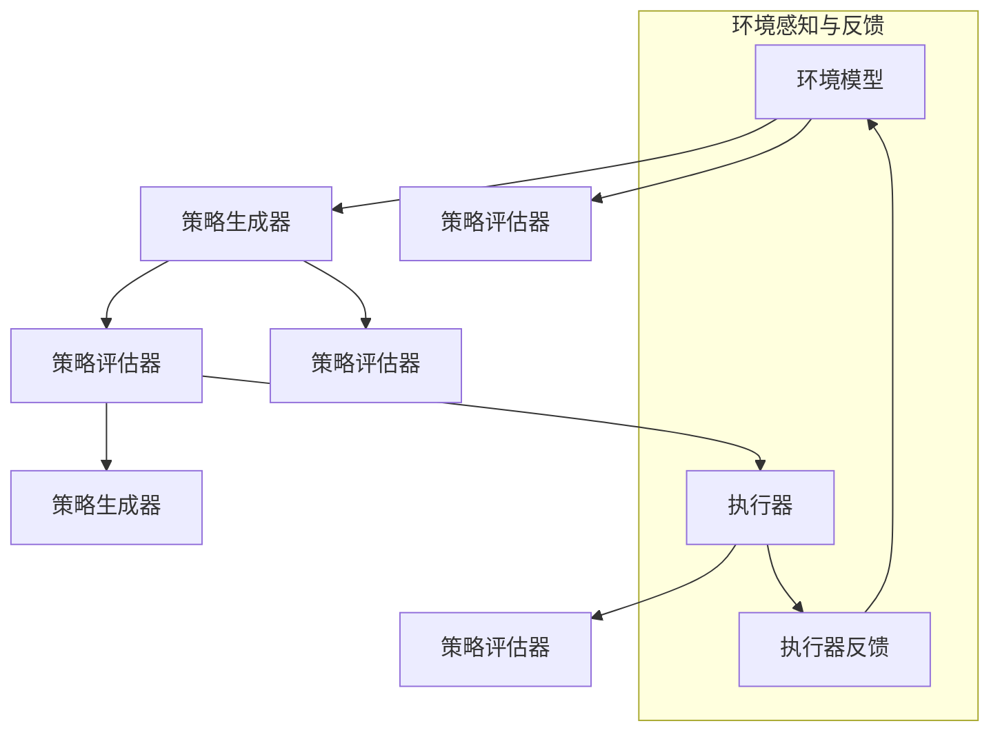
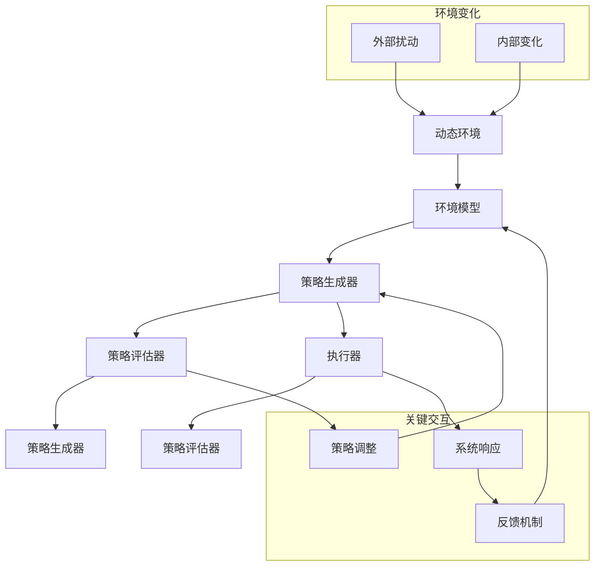

                 

### 1.1 动态环境概述

在当今的数字时代，计算机系统和人工智能应用面临的环境日益复杂和动态。动态环境是指那些随着时间变化而不断演变的系统。这些环境可能受到外部扰动、内部故障或需求波动的影响，因此对于系统来说，如何有效地适应和响应这些变化成为一个至关重要的课题。

动态环境具有以下几个主要特征：

1. **不确定性**：动态环境中的许多因素是不可预测的，这可能导致系统无法准确预测未来的状态或事件。
2. **多样性**：环境中可能存在多种不同类型的干扰和变化，这些变化可以同时发生或依次出现。
3. **实时性**：系统需要能够快速响应环境变化，通常要求在毫秒级或秒级时间内作出决策。
4. **反馈延迟**：系统对环境变化的响应可能不是即时的，存在一定的延迟，这要求系统具备一定的缓冲能力。

动态环境的这些特征对系统提出了高适应性、高可靠性和高响应速度的要求。为了满足这些要求，系统通常需要采用先进的控制策略和自适应算法来应对环境变化。例如，在自动驾驶领域，车辆需要在各种交通状况和天气条件下保持稳定行驶；在工业自动化中，生产线需要适应原材料质量的变化；在金融交易中，系统需要快速调整交易策略以应对市场波动。

动态环境的广泛存在和重要性使得研究和应用元控制策略成为一个热点领域。元控制策略是一种基于更高层次策略的控制系统，它能够根据动态环境的特征和需求，动态调整和优化底层控制策略，从而提高系统的整体性能和适应性。通过元控制策略，系统能够更好地处理不确定性、多样性和实时性挑战，从而实现高效的动态环境适应。

### 1.2 元控制策略的定义与作用

元控制策略是一种高级的控制系统设计方法，其核心思想是通过设计和实现一个更高层次的策略来动态调整底层控制策略，以适应不断变化的动态环境。元控制策略并非直接处理控制问题，而是通过规划和优化来指导底层控制器的行为。它通常包括以下基本组成部分：

1. **环境模型**：环境模型是元控制策略的重要组成部分，用于描述动态环境的特性、状态以及可能发生的变化。这个模型可以是基于历史的统计数据，也可以是实时获取的环境信息。

2. **策略生成器**：策略生成器是元控制策略的核心，它根据环境模型和系统目标，生成或选择合适的底层控制策略。策略生成器可以使用机器学习算法、优化算法或基于规则的方法来生成策略。

3. **策略评估器**：策略评估器用于评估不同策略的性能，通常通过模拟或实际测试来确定哪个策略最符合系统目标。评估标准可以是响应速度、稳定性、能耗等。

4. **执行器**：执行器是元控制策略的最终实现部分，它将选定的策略转化为具体的操作指令，控制底层系统的行为。

元控制策略在动态环境适应中起到了关键作用，其主要作用体现在以下几个方面：

1. **适应性**：元控制策略能够根据环境模型的变化动态调整控制策略，使系统能够更好地适应不确定性、多样性和实时性挑战。

2. **优化性**：通过策略生成器和评估器，元控制策略可以在不同策略之间进行优化选择，从而提高系统整体性能和效率。

3. **鲁棒性**：元控制策略能够通过模拟和评估，提前检测和应对潜在问题，提高系统的鲁棒性。

4. **可扩展性**：元控制策略设计具有高度的模块化和灵活性，可以方便地集成到不同的系统和应用中，实现广泛的适应。

总之，元控制策略通过其高级规划与优化能力，为动态环境中的控制系统提供了一种高效的解决方案，从而大大提升了系统的适应性和稳定性。

### 1.3 本书结构与目标

本书旨在深入探讨元控制策略在动态环境适应中的应用，并展示其在不同领域中的广泛潜力。全书结构清晰，内容丰富，旨在为读者提供一个系统、全面的元控制策略知识体系。以下为本书的结构概述及各部分内容目标：

#### 第一部分：引论

本部分将首先介绍动态环境的概述，阐述其不确定性和复杂性对控制系统带来的挑战。随后，详细定义元控制策略的概念，解释其核心组成部分及在动态环境适应中的作用。最后，介绍本书的结构和目标，帮助读者理解后续章节的内容和重点。

#### 第二部分：核心概念与联系

这一部分将深入探讨元控制策略的基本原理，包括环境模型、策略生成器、策略评估器和执行器等组成部分。通过详细的Mermaid流程图，展示各组件之间的相互作用和关系架构，帮助读者理解元控制策略的运作机制。

#### 第三部分：核心算法原理讲解

本部分将介绍几种经典元控制策略算法，如强化学习元控制策略、遗传算法元控制策略和进化算法元控制策略，通过具体的Python源代码示例，结合数学模型和公式，详细讲解这些算法的基本原理和实现细节。

#### 第四部分：数学模型与公式讲解

这一部分将专注于强化学习、遗传算法和模型参考自适应控制中的关键数学模型和公式，如价值函数、适应度函数和误差动态方程等。通过具体的公式和解释，帮助读者深入理解这些数学概念在实际应用中的作用。

#### 第五部分：项目实战

本部分将通过具体项目案例，展示元控制策略在实际开发中的应用。读者将了解项目背景、环境建模、源代码实现以及代码解读与分析，从而对元控制策略的实际应用有更直观的认识。

#### 第六部分：总结与展望

最后一部分将对元控制策略在动态环境适应中的作用进行总结，讨论未来研究方向和挑战，并提出一些建议，帮助读者更好地理解和应用元控制策略。

通过以上各部分的详细讲解和案例分析，本书旨在帮助读者全面掌握元控制策略的核心知识和应用技巧，为解决动态环境中的复杂控制问题提供有力支持。

### 2.1 元控制策略的基本原理

元控制策略（Meta-control Strategy）是一种高级的控制系统设计方法，其核心理念是通过更高的层次策略来动态调整和优化底层控制策略，从而实现系统在动态环境中的高效适应。为了深入理解元控制策略的基本原理，我们需要从其核心组成部分、运作机制和关键流程进行详细阐述。

#### 元控制策略的核心组成部分

1. **环境模型**：环境模型是元控制策略的基础，它用于描述动态环境的状态、特征以及可能的扰动。一个准确且全面的环境模型能够为策略生成器提供重要的信息，使其能够生成更加符合实际需求的控制策略。环境模型通常包括以下几个要素：
   - **状态变量**：描述环境当前状态的特征，如温度、湿度、光照强度等。
   - **扰动因素**：识别可能对环境状态产生影响的因素，如外部天气变化、设备故障等。
   - **状态转移概率**：描述状态之间的转移关系和概率，有助于预测未来环境状态。

2. **策略生成器**：策略生成器是元控制策略的核心模块，负责根据环境模型和系统目标生成或选择合适的底层控制策略。策略生成器通常采用机器学习算法、优化算法或基于规则的逻辑来生成策略。其工作流程包括以下几个步骤：
   - **策略搜索**：根据环境模型，搜索可能的控制策略空间。
   - **策略评估**：对每个候选策略进行评估，选择最优或次优策略。
   - **策略调整**：根据系统目标和环境反馈，对策略进行实时调整。

3. **策略评估器**：策略评估器用于评估不同策略的性能，通常通过模拟或实际测试来确定哪个策略最符合系统目标。评估标准可以是响应速度、稳定性、能耗等。策略评估器通常包含以下几个要素：
   - **评估指标**：定义策略性能的量化指标，如平均响应时间、系统误差等。
   - **评估算法**：选择合适的评估算法，如马尔可夫决策过程（MDP）评估、强化学习中的经验回放等。
   - **反馈机制**：通过实时反馈，动态调整评估标准和策略选择。

4. **执行器**：执行器是元控制策略的最终实现部分，负责将选定的策略转化为具体的操作指令，控制底层系统的行为。执行器通常包括以下几个步骤：
   - **策略解析**：将策略转换为具体的操作指令。
   - **执行监控**：监控执行过程，确保操作的正确性和效率。
   - **异常处理**：在执行过程中出现异常时，及时调整策略或采取紧急措施。

#### 元控制策略的运作机制

元控制策略的运作机制可以分为以下几个关键流程：

1. **环境感知**：系统通过传感器和其他数据源实时获取环境信息，构建环境模型。

2. **策略生成**：策略生成器根据环境模型和系统目标，生成可能的控制策略。

3. **策略评估**：策略评估器对每个候选策略进行评估，选择最优策略。

4. **策略调整**：根据评估结果，策略生成器对策略进行调整，以适应环境变化。

5. **执行操作**：执行器根据选定的策略，对系统进行实时控制。

6. **反馈调整**：系统持续收集反馈信息，用于更新环境模型和优化策略。

#### 元控制策略的关键流程

1. **持续学习与优化**：元控制策略通过持续学习和优化，不断提升系统的适应性和性能。这一过程通常包括策略更新、模型优化和评估调整等。

2. **实时响应与调整**：在动态环境中，系统能够实时感知环境变化，并迅速调整控制策略，以保持系统的稳定性和有效性。

3. **模块化与灵活性**：元控制策略的设计通常具有高度的模块化和灵活性，可以方便地集成到不同的系统和应用中，实现广泛的适应。

通过以上对元控制策略的基本原理、核心组成部分和运作机制的详细阐述，我们可以看到，元控制策略是一种高效、灵活的控制系统设计方法，它能够通过高级规划与优化，帮助系统在动态环境中实现高效的适应和响应。

#### 2.1.1 元控制策略的概念实体

元控制策略的概念实体是理解其运作机制的关键。为了更清晰地描述这些实体及其相互关系，我们可以使用Mermaid流程图来展示它们之间的相互作用。

首先，定义元控制策略的核心组成部分：

1. **环境模型（Environment Model）**：环境模型是描述动态环境状态和变化的数据结构。
2. **策略生成器（Policy Generator）**：根据环境模型生成或调整底层控制策略的算法。
3. **策略评估器（Policy Evaluator）**：评估不同策略的性能，选择最优策略。
4. **执行器（Executor）**：将策略转化为具体操作指令，控制系统行为。

接下来，使用Mermaid创建流程图来展示这些实体的关系：



流程图的具体解释如下：

1. **环境模型**：环境模型实时收集并更新环境状态数据。
2. **策略生成器**：根据环境模型和系统目标，生成候选策略。
3. **策略评估器**：评估候选策略的性能，选择最优策略。
4. **执行器**：根据最优策略执行操作，并对操作结果进行实时反馈。
5. **反馈循环**：执行器将操作结果反馈给策略评估器和环境模型，用于下一轮的决策。

通过这个流程图，我们可以看到元控制策略各组件之间是如何相互作用的，以及它们如何共同工作以实现动态环境适应。环境模型作为核心输入，不断驱动策略生成、评估和执行的过程，同时反馈信息又循环回环境模型，用于模型更新和策略优化，形成一个闭环控制系统。

这种动态调整和反馈机制使得元控制策略能够灵活适应复杂多变的动态环境，从而显著提升系统的适应性和响应能力。

### 2.1.2 元控制策略与动态环境的关系架构

为了更直观地理解元控制策略与动态环境之间的关系，我们可以通过一个Mermaid流程图来展示它们之间的相互作用和关系架构。以下是对流程图的详细解释：



流程图的具体解释如下：

1. **动态环境**：动态环境是元控制策略作用的场景，它可能受到外部扰动（K）和内部变化（L）的影响。外部扰动包括天气变化、市场波动等，而内部变化可能来自设备故障或需求波动。

2. **环境模型**：环境模型（B）是描述动态环境状态和变化的数据结构。它实时收集并更新环境状态数据，作为策略生成和评估的基础。

3. **策略生成器**：策略生成器（C）根据环境模型生成或调整底层控制策略。策略生成器可以是基于机器学习、优化算法或规则的复杂算法。

4. **策略评估器**：策略评估器（D）对生成的策略进行评估，选择最优策略。评估标准可以包括响应时间、稳定性、能耗等。

5. **执行器**：执行器（E）将选定的策略转化为具体的操作指令，实现对系统的控制。

6. **策略调整**：通过反馈机制（H），系统实时调整策略，以应对动态环境的变化。策略调整确保系统能够持续适应环境，保持高效率和稳定性。

7. **系统响应**：执行器执行策略后，系统状态会发生变化，产生系统响应（I）。这种响应会反馈到反馈机制（J），进一步更新环境模型。

8. **反馈循环**：通过反馈机制，系统持续收集操作结果和环境变化的信息，用于模型更新和策略优化。这种闭环反馈机制是元控制策略实现高效动态环境适应的关键。

通过这个流程图，我们可以清晰地看到元控制策略与动态环境之间的互动关系。环境变化通过扰动和内部变化影响系统状态，而系统通过不断调整策略和反馈机制，实现动态环境的适应和优化。

### 2.2 动态环境的分类与特点

动态环境可以根据其特征和变化模式进行分类，常见的分类方法包括基于环境变化速度、环境复杂性、环境控制能力等维度。以下将介绍几种典型的动态环境类别及其特点：

#### 1. 快速变化环境

快速变化环境是指那些状态变化迅速且不可预测的环境。这类环境通常出现在实时控制系统中，如自动驾驶、股票交易、实时通信等。快速变化环境的特点如下：

- **高频率变化**：状态变量在毫秒级或秒级时间内频繁变化，需要系统快速响应。
- **强不确定性**：环境中的很多因素是不可预测的，例如天气变化、市场波动等。
- **高实时性要求**：系统必须在极短的时间内做出决策，以避免错过最佳时机。

快速变化环境对控制系统的要求极高，需要采用高效的元控制策略来实时调整控制策略，确保系统的高适应性和稳定性。

#### 2. 慢变化环境

慢变化环境是指那些状态变化相对缓慢且可以预测的环境。这类环境通常出现在工业过程控制、环境监测、长期数据分析等领域。慢变化环境的特点如下：

- **低频率变化**：状态变量在较长时间内缓慢变化，为系统提供了更多的预测和调整时间。
- **低不确定性**：环境中的变化趋势相对稳定，可以通过历史数据进行分析和预测。
- **适度实时性要求**：系统需要在合理的时间内做出决策，但不需要像快速变化环境那样迅速。

在慢变化环境中，元控制策略可以采用更加稳健的方法，通过长期数据分析和预测来优化控制策略，提高系统的效率和可靠性。

#### 3. 不可控环境

不可控环境是指那些由于技术限制或外部干扰无法准确建模和控制的环境。这类环境通常出现在自然灾害、军事作战、社交网络等领域。不可控环境的特点如下：

- **高度不确定性**：环境状态变化完全不可预测，系统无法准确了解当前状态。
- **强干扰因素**：外部干扰可能导致系统行为与预期大相径庭。
- **低控制能力**：系统对环境的影响能力有限，难以通过控制策略实现预期目标。

在不可控环境中，元控制策略需要具备很强的自适应能力，通过实时监测和动态调整，尽可能减少外部干扰对系统的影响，确保系统的稳定运行。

#### 4. 可复现环境

可复现环境是指那些可以多次模拟和复现的环境，如模拟飞行、虚拟现实、游戏等。这类环境的特点如下：

- **高可重复性**：环境状态可以多次复现，为系统提供了大量的数据用于分析和优化。
- **可控变化范围**：环境变化在一定范围内可以控制，便于系统进行性能测试和优化。
- **高适应性要求**：尽管环境可以复现，但系统仍需要具备较强的适应性，以应对不同的初始条件和边界条件。

在可复现环境中，元控制策略可以充分利用复现特性，通过大量的模拟实验来优化和验证策略，提高系统的适应性和可靠性。

#### 5. 非线性环境

非线性环境是指那些状态变量之间关系复杂的动态环境，如复杂的生态系统、全球经济系统、智能交通系统等。这类环境的特点如下：

- **非线性关系**：环境状态变量之间的关系复杂，难以用简单的线性模型描述。
- **高度动态性**：环境状态变化迅速且难以预测，需要系统具备很强的动态响应能力。
- **高适应性要求**：系统需要在复杂的非线性环境中保持稳定和高效运行。

在非线性环境中，元控制策略需要结合复杂的数学模型和优化算法，通过不断调整和优化策略，实现系统的稳定和高效运行。

总之，不同类别的动态环境具有各自独特的特点和挑战，元控制策略需要根据环境的特性选择合适的控制方法和算法，以提高系统的适应性和性能。

### 2.3 元控制策略的类型与应用场景

元控制策略可以根据其具体实现方法和应用场景分为多种类型，每种策略都有其独特的特点和适用范围。以下将详细介绍几种常见的元控制策略类型及其应用场景。

#### 1. 强化学习元控制策略

强化学习（Reinforcement Learning, RL）是一种通过试错和反馈来学习最优策略的机器学习技术。强化学习元控制策略利用强化学习的原理，通过不断的试错和奖励机制，逐步优化控制策略。

**特点：**
- **自适应性强**：强化学习策略可以根据环境变化动态调整，具有很强的适应性。
- **适合不确定性环境**：强化学习能够处理高度不确定和动态变化的环境。

**应用场景：**
- **自动驾驶**：自动驾驶系统需要在复杂的交通环境中自主决策，强化学习可以帮助车辆根据环境变化实时调整行驶策略。
- **机器人控制**：机器人需要在不同环境下执行复杂的任务，强化学习策略可以帮助机器人通过试错学习最优路径和动作。

#### 2. 遗传算法元控制策略

遗传算法（Genetic Algorithm, GA）是一种基于自然选择和遗传学原理的优化算法。遗传算法元控制策略通过模拟生物进化过程，优化控制策略的参数和结构。

**特点：**
- **全局优化能力**：遗传算法能够搜索全局最优解，适用于复杂和多峰值的优化问题。
- **鲁棒性**：遗传算法对初始参数和噪声具有较强的鲁棒性，适合不稳定和动态变化的环境。

**应用场景：**
- **工业自动化**：在工业自动化系统中，遗传算法可以帮助优化生产线的参数设置，提高生产效率和产品质量。
- **能源管理**：在能源管理系统中，遗传算法可以优化电力资源的分配，降低能源消耗和成本。

#### 3. 进化算法元控制策略

进化算法（Evolutionary Algorithm, EA）是一类基于生物进化原理的优化算法，包括遗传算法在内。进化算法元控制策略通过模拟生物进化过程，不断优化控制策略。

**特点：**
- **多目标优化**：进化算法能够同时优化多个目标，适用于复杂的多目标优化问题。
- **并行计算能力**：进化算法可以在多个个体之间并行计算，提高优化效率。

**应用场景：**
- **无人机路径规划**：在无人机路径规划中，进化算法可以帮助无人机根据环境变化动态调整飞行路径，提高飞行效率和安全性。
- **生物医学**：在生物医学领域，进化算法可以用于优化药物配方和治疗策略，提高治疗效果。

#### 4. 模型参考自适应控制策略

模型参考自适应控制（Model Reference Adaptive Control, MRAC）是一种通过实时调整控制模型参数来适应环境变化的控制策略。MRAC通过建立环境模型和系统模型之间的误差动态方程，动态调整控制参数。

**特点：**
- **实时自适应**：MRAC能够实时调整控制参数，适应环境变化。
- **适用于动态系统**：MRAC能够处理动态变化和环境扰动，保持系统的稳定性和性能。

**应用场景：**
- **飞行控制**：在飞行控制系统中，MRAC可以帮助飞机在复杂和变化的飞行环境中保持稳定飞行。
- **机器人控制**：在机器人控制系统中，MRAC可以优化机器人的运动轨迹和姿态，提高动作的稳定性和精度。

#### 5. 神经网络元控制策略

神经网络（Neural Networks, NN）是一种通过模拟人脑神经元连接进行学习和推理的计算模型。神经网络元控制策略利用神经网络强大的非线性映射能力，实现复杂的控制任务。

**特点：**
- **强大的非线性映射能力**：神经网络可以处理复杂的非线性关系，适应复杂的环境。
- **自学习能力**：神经网络可以通过训练不断优化模型参数，提高控制策略的性能。

**应用场景：**
- **智能交通系统**：在智能交通系统中，神经网络可以优化交通信号控制策略，提高交通流的效率。
- **智能家居**：在智能家居系统中，神经网络可以帮助智能设备根据用户行为和环境变化，实现智能化的控制和交互。

总之，不同类型的元控制策略在动态环境中各有优势和适用场景。选择合适的元控制策略，能够显著提高系统的适应性和性能，实现高效的动态环境适应。

#### 3.1.1 强化学习元控制策略

强化学习元控制策略是利用强化学习算法解决动态环境中控制问题的一种方法。强化学习通过试错和奖励机制，逐步优化策略，使其在复杂动态环境中达到最优性能。以下将通过一个简单的Python代码示例，详细讲解强化学习元控制策略的基本原理和实现步骤。

**基本原理**

强化学习（Reinforcement Learning, RL）的基本原理是模仿人类的决策过程，通过环境（Environment）与智能体（Agent）的交互，逐步学习最优策略（Policy）。在强化学习中，智能体根据当前状态（State）选择动作（Action），然后根据动作的结果（Reward）更新策略，目标是最大化长期奖励累积。

强化学习的基本组成部分包括：

1. **状态（State）**：系统当前所处的状态，可以是数值、图像或其他形式。
2. **动作（Action）**：智能体可以采取的操作。
3. **策略（Policy）**：智能体根据当前状态选择动作的规则。
4. **价值函数（Value Function）**：预测在特定状态下执行特定动作的长期奖励。
5. **模型（Model）**：环境的状态转移概率和奖励分布。

**代码示例**

下面我们通过一个简单的Python代码示例来展示强化学习元控制策略的基本实现：

```python
import numpy as np
import random

# 强化学习元控制策略的示例代码

class ReinforcementLearningAgent:
    def __init__(self, n_actions, learning_rate=0.1, discount_factor=0.9):
        self.n_actions = n_actions
        self.learning_rate = learning_rate
        self.discount_factor = discount_factor
        self.q_table = np.zeros((n_states, n_actions))
    
    def choose_action(self, state, epsilon=0.1):
        if random.random() < epsilon:
            # 以epsilon概率随机选择动作
            action = random.randint(0, self.n_actions - 1)
        else:
            # 根据Q值选择动作
            action = np.argmax(self.q_table[state])
        return action
    
    def learn(self, state, action, reward, next_state, done):
        # Q值更新公式
        target = reward
        if not done:
            target += self.discount_factor * np.max(self.q_table[next_state])
        target_f = self.q_table[state, action]
        self.q_table[state, action] += self.learning_rate * (target - target_f)

# 模拟强化学习过程
n_states = 10
n_actions = 4
agent = ReinforcementLearningAgent(n_actions)

# 强化学习模拟循环
for episode in range(1000):
    state = random.randint(0, n_states - 1)
    done = False
    while not done:
        action = agent.choose_action(state)
        next_state, reward, done = self.env.step(state, action)
        agent.learn(state, action, reward, next_state, done)
        state = next_state

print("Q-Table:", agent.q_table)
```

**代码解析**

- **初始化**：`ReinforcementLearningAgent` 类初始化时，定义了动作数量、学习率、折扣因子和Q表（用于存储状态-动作价值）。

- **选择动作**：`choose_action` 方法根据epsilon贪心策略选择动作，以一定概率随机选择动作，或根据当前状态的Q值选择最优动作。

- **学习过程**：`learn` 方法根据奖励和下一个状态，更新Q值。更新公式为：`target = reward + discount_factor * max(Q(next_state, a')) - Q(state, action)`。

- **模拟强化学习过程**：模拟一个强化学习过程，通过不断尝试和更新Q值，逐步优化策略。

**数学模型与公式**

强化学习中的核心公式是Q值更新公式：

$$Q(s, a) \leftarrow Q(s, a) + \alpha [r + \gamma \max(Q(s', a')) - Q(s, a)]$$

其中：
- \( Q(s, a) \) 是在状态 \( s \) 下采取动作 \( a \) 的即时回报。
- \( r \) 是立即获得的奖励。
- \( \gamma \) 是折扣因子，用于考虑未来的奖励。
- \( \max(Q(s', a')) \) 是在下一个状态 \( s' \) 下采取最优动作的预期回报。

通过上述代码和公式，我们可以看到强化学习元控制策略是如何逐步优化策略，实现动态环境适应的。这种方法在复杂的动态环境中具有强大的自适应能力，能够有效地处理不确定性、多样性和实时性挑战。

### 3.1.2 遗传算法元控制策略

遗传算法（Genetic Algorithm, GA）是一种基于自然选择和遗传学原理的优化算法。遗传算法元控制策略通过模拟生物进化过程，对控制策略进行优化，使其在动态环境中具有更好的适应性和性能。以下将详细解释遗传算法元控制策略的基本原理和实现步骤。

#### 基本原理

遗传算法的核心概念是遗传、变异和自然选择。遗传算法通过编码、选择、交叉和变异等操作，不断迭代优化解集，最终找到最优解或近似最优解。遗传算法元控制策略的核心思想是利用这些原理，对控制策略进行进化优化。

遗传算法的主要组成部分包括：

1. **编码**：将控制策略编码为染色体，通常使用二进制编码或实数编码。
2. **种群**：初始化一个包含多个染色体的种群，每个染色体代表一个可能的控制策略。
3. **适应度函数**：评估每个染色体的适应度，适应度越高表示控制策略越好。
4. **选择**：根据适应度函数选择优秀的染色体，用于产生下一代种群。
5. **交叉**：将两个优秀染色体的部分基因进行交换，生成新的染色体。
6. **变异**：对部分染色体进行随机修改，增加种群的多样性。

#### 实现步骤

遗传算法元控制策略的具体实现步骤如下：

1. **初始化种群**：随机生成一个初始种群，每个个体代表一个可能的控制策略。

2. **适应度评估**：计算每个个体的适应度值，适应度值可以通过模拟或实际测试获得，通常与系统性能指标（如响应时间、能耗、稳定性等）相关。

3. **选择**：根据适应度函数，从当前种群中选择适应度较高的染色体，作为下一代种群的基础。

4. **交叉**：在选择的染色体对之间进行交叉操作，生成新的染色体。交叉操作可以保留父代染色体的优秀基因，同时引入新的组合。

5. **变异**：对部分染色体进行变异操作，增加种群的多样性，避免过早收敛于局部最优解。

6. **更新种群**：将交叉和变异后生成的新染色体加入下一代种群。

7. **迭代优化**：重复上述步骤，逐步优化控制策略。

#### 代码示例

以下是一个简单的Python代码示例，展示遗传算法元控制策略的基本实现：

```python
import numpy as np

# 遗传算法元控制策略的示例代码

class GeneticAlgorithmController:
    def __init__(self, population_size=100, mutation_rate=0.01):
        self.population_size = population_size
        self.mutation_rate = mutation_rate
        self.population = self.initialize_population()
    
    def initialize_population(self):
        # 初始化种群，每个个体代表控制策略参数
        population = np.random.rand(self.population_size, 10)
        return population
    
    def fitness_function(self, individual):
        # 定义适应度函数，用于评估个体适应度
        fitness = np.sum(individual)
        return fitness
    
    def selection(self, population, fitnesses):
        # 选择操作，选择适应度较高的个体
        sorted_indices = np.argsort(fitnesses)[::-1]
        selected = population[sorted_indices[:self.population_size//2]]
        return selected
    
    def crossover(self, parent1, parent2):
        # 交叉操作，生成新个体
        crossover_point = np.random.randint(1, len(parent1)-1)
        child = np.concatenate((parent1[:crossover_point], parent2[crossover_point:]))
        return child
    
    def mutate(self, individual):
        # 变异操作，增加个体多样性
        for i in range(len(individual)):
            if random.random() < self.mutation_rate:
                individual[i] = np.random.rand()
        return individual
    
    def evolve(self, population):
        # 进化过程，迭代优化种群
        new_population = []
        fitnesses = np.array([self.fitness_function(ind) for ind in population])
        for _ in range(self.population_size):
            parent1, parent2 = self.selection(population, fitnesses)
            child = self.crossover(parent1, parent2)
            child = self.mutate(child)
            new_population.append(child)
        return np.array(new_population)

# 进化过程
controller = GeneticAlgorithmController()
for generation in range(100):
    controller.population = controller.evolve(controller.population)
    print("Generation:", generation, "Best Fitness:", controller.fitness_function(controller.population[0]))

print("Best Individual:", controller.population[0])
```

#### 代码解析

- **初始化种群**：初始化一个包含随机控制策略参数的种群。

- **适应度评估**：定义适应度函数，用于评估个体适应度。在本例中，适应度值是控制策略参数的和。

- **选择操作**：选择适应度较高的个体，用于生成下一代种群。

- **交叉操作**：对两个父代个体进行交叉，生成新的子个体。

- **变异操作**：对个体进行随机变异，增加种群多样性。

- **进化过程**：迭代执行进化过程，逐步优化控制策略。

通过上述代码示例，我们可以看到遗传算法元控制策略是如何通过编码、选择、交叉和变异等操作，逐步优化控制策略的。这种方法在处理动态环境问题时，能够有效应对不确定性、多样性和实时性挑战，提高系统的适应性和性能。

### 3.2 进化算法元控制策略

进化算法（Evolutionary Algorithm, EA）是一类基于自然进化原理的优化算法，广泛应用于复杂动态环境的控制问题。进化算法元控制策略通过模拟生物进化过程，不断优化控制策略，使其在动态环境中具备更高的适应性和性能。以下将详细阐述进化算法元控制策略的基本原理和实现步骤。

#### 基本原理

进化算法的核心思想是通过遗传、变异和自然选择等进化机制，不断迭代优化解集，以找到最优解或近似最优解。进化算法元控制策略基于这一思想，通过模拟生物进化过程，优化控制策略参数，从而实现动态环境适应。

进化算法的主要组成部分包括：

1. **编码**：将控制策略编码为染色体，通常使用二进制编码或实数编码。
2. **种群**：初始化一个包含多个染色体的种群，每个染色体代表一个可能的控制策略。
3. **适应度函数**：评估每个染色体的适应度，适应度值越高表示控制策略越好。
4. **选择**：根据适应度函数选择优秀的染色体，用于产生下一代种群。
5. **交叉**：在选择的染色体之间进行交叉操作，生成新的染色体。
6. **变异**：对部分染色体进行随机变异，增加种群的多样性。

#### 实现步骤

进化算法元控制策略的具体实现步骤如下：

1. **初始化种群**：随机生成一个初始种群，每个个体代表一个可能的控制策略。

2. **适应度评估**：计算每个个体的适应度值，适应度值可以通过模拟或实际测试获得，通常与系统性能指标（如响应时间、能耗、稳定性等）相关。

3. **选择**：根据适应度函数，从当前种群中选择适应度较高的染色体，作为下一代种群的基础。

4. **交叉**：在选择的染色体之间进行交叉操作，生成新的染色体。交叉操作可以保留父代染色体的优秀基因，同时引入新的组合。

5. **变异**：对部分染色体进行变异操作，增加种群的多样性，避免过早收敛于局部最优解。

6. **更新种群**：将交叉和变异后生成的新染色体加入下一代种群。

7. **迭代优化**：重复上述步骤，逐步优化控制策略。

#### 代码示例

以下是一个简单的Python代码示例，展示进化算法元控制策略的基本实现：

```python
import numpy as np

# 进化算法元控制策略的示例代码

class EvolutionaryAlgorithmController:
    def __init__(self, population_size=100, crossover_rate=0.8, mutation_rate=0.1):
        self.population_size = population_size
        self.crossover_rate = crossover_rate
        self.mutation_rate = mutation_rate
        self.population = self.initialize_population()
    
    def initialize_population(self):
        # 初始化种群，每个个体代表控制策略参数
        population = np.random.rand(self.population_size, 10)
        return population
    
    def fitness_function(self, individual):
        # 定义适应度函数，用于评估个体适应度
        fitness = np.sum(individual)
        return fitness
    
    def selection(self, population, fitnesses):
        # 选择操作，选择适应度较高的个体
        sorted_indices = np.argsort(fitnesses)[::-1]
        selected = population[sorted_indices[:self.population_size//2]]
        return selected
    
    def crossover(self, parent1, parent2):
        # 交叉操作，生成新个体
        crossover_point = np.random.randint(1, len(parent1)-1)
        child = np.concatenate((parent1[:crossover_point], parent2[crossover_point:]))
        return child
    
    def mutate(self, individual):
        # 变异操作，增加个体多样性
        for i in range(len(individual)):
            if random.random() < self.mutation_rate:
                individual[i] = np.random.rand()
        return individual
    
    def evolve(self, population):
        # 进化过程，迭代优化种群
        new_population = []
        fitnesses = np.array([self.fitness_function(ind) for ind in population])
        for _ in range(self.population_size):
            parent1, parent2 = self.selection(population, fitnesses)
            child = self.crossover(parent1, parent2)
            child = self.mutate(child)
            new_population.append(child)
        return np.array(new_population)

# 进化过程
controller = EvolutionaryAlgorithmController()
for generation in range(100):
    controller.population = controller.evolve(controller.population)
    print("Generation:", generation, "Best Fitness:", controller.fitness_function(controller.population[0]))

print("Best Individual:", controller.population[0])
```

#### 代码解析

- **初始化种群**：初始化一个包含随机控制策略参数的种群。

- **适应度评估**：定义适应度函数，用于评估个体适应度。在本例中，适应度值是控制策略参数的和。

- **选择操作**：选择适应度较高的个体，用于生成下一代种群。

- **交叉操作**：对两个父代个体进行交叉，生成新的子个体。

- **变异操作**：对个体进行随机变异，增加种群多样性。

- **进化过程**：迭代执行进化过程，逐步优化控制策略。

通过上述代码示例，我们可以看到进化算法元控制策略是如何通过编码、选择、交叉和变异等操作，逐步优化控制策略的。这种方法在处理动态环境问题时，能够有效应对不确定性、多样性和实时性挑战，提高系统的适应性和性能。

### 4.1 强化学习中的价值函数与策略迭代

在强化学习中，价值函数（Value Function）和策略迭代（Policy Iteration）是核心概念，用于评估和优化智能体在动态环境中的行为。以下将详细解释这两个概念，并给出相关的数学模型和公式。

#### 价值函数

价值函数是用来评估智能体在不同状态下的最优回报的函数。它可以帮助智能体了解在特定状态下采取特定动作的未来预期收益。价值函数分为状态价值函数（State Value Function）和动作价值函数（Action Value Function）。

1. **状态价值函数 \( V(s) \)**：表示在状态 \( s \) 下，采取最优动作 \( a \) 的长期回报。
   $$ V(s) = \sum_{a} \gamma (R(s, a) + V(s')) $$
   其中，\( R(s, a) \) 是在状态 \( s \) 下采取动作 \( a \) 的即时回报，\( \gamma \) 是折扣因子，用于考虑未来回报的现值，\( V(s') \) 是下一个状态 \( s' \) 的状态价值函数。

2. **动作价值函数 \( Q(s, a) \)**：表示在状态 \( s \) 下，采取特定动作 \( a \) 的长期回报。
   $$ Q(s, a) = \sum_{s'} p(s'|s, a) [R(s, a) + \gamma V(s')] $$
   其中，\( p(s'|s, a) \) 是在状态 \( s \) 下采取动作 \( a \) 后转移到状态 \( s' \) 的概率。

#### 策略迭代

策略迭代是一种用于求解最优策略的方法，通过交替进行策略评估和策略改进，逐步逼近最优策略。

1. **策略评估（Policy Evaluation）**：通过迭代计算状态价值函数，直到状态价值函数收敛。策略评估通常使用贝尔曼方程（Bellman Equation）进行递推：
   $$ V(s) = \sum_{a} \pi(a|s) [R(s, a) + \gamma V(s')] $$
   其中，\( \pi(a|s) \) 是在状态 \( s \) 下采取动作 \( a \) 的概率。

2. **策略改进（Policy Improvement）**：根据当前状态价值函数，选择使得状态价值函数最大化的动作作为新策略。新策略定义为：
   $$ \pi'(s) = \arg \max_{a} V(s, a) $$
   策略改进的迭代过程如下：
   - 重复策略评估，直到状态价值函数收敛。
   - 根据收敛后的状态价值函数，更新策略。
   - 如果策略发生变化，则返回策略评估步骤，继续迭代。

#### 示例

假设一个简单的环境，有3个状态 \( s_1, s_2, s_3 \) 和2个动作 \( a_1, a_2 \)。每个状态和动作组合的即时回报分别为：

| \( s \) | \( a_1 \) | \( a_2 \) |
| ------ | ------ | ------ |
| \( s_1 \) | 1      | -1     |
| \( s_2 \) | -1     | 1      |
| \( s_3 \) | 0      | 0      |

折扣因子 \( \gamma = 0.9 \)。

1. **初始化**：初始化状态价值函数 \( V(s) = 0 \)。

2. **策略评估**：计算状态价值函数 \( V(s) \)：
   $$ V(s_1) = 0.9 [1 + 0.9 \times (-1)] = 0.1 $$
   $$ V(s_2) = 0.9 [-1 + 0.9 \times 1] = -0.1 $$
   $$ V(s_3) = 0.9 [0 + 0.9 \times 0] = 0 $$

3. **策略改进**：根据当前状态价值函数，选择最优动作：
   $$ \pi(s_1) = a_1 $$
   $$ \pi(s_2) = a_2 $$
   $$ \pi(s_3) = a_1 \text{ 或 } a_2 $$

4. **迭代**：重复策略评估和策略改进，直到状态价值函数收敛。

通过上述步骤，我们可以看到价值函数和策略迭代如何帮助智能体在动态环境中找到最优策略，实现长期回报的最大化。这种方法在复杂动态环境中具有强大的应用潜力，能够有效提高系统的适应性和性能。

### 4.2 遗传算法中的适应度函数

在遗传算法（Genetic Algorithm, GA）中，适应度函数（Fitness Function）是评估个体优劣的核心指标，它决定了个体在种群中的选择、交叉和变异等操作的概率。适应度函数的设计对遗传算法的性能和收敛速度具有重要影响。以下将详细介绍适应度函数的定义、设计原则和常见类型。

#### 定义与设计原则

适应度函数是对个体在解决特定问题中的表现进行量化的函数，通常是一个非负值。适应度函数的设计应遵循以下原则：

1. **正相关性**：适应度函数应与问题解的质量正相关，即解的质量越高，适应度值越大。
2. **平衡性**：适应度函数应在种群中分布均匀，避免出现适应度极高或极低的极端值，以便保持种群的多样性。
3. **单调性**：适应度函数应随着问题解质量的提高而单调增加，以便在进化过程中明确区分个体优劣。
4. **计算效率**：适应度函数的计算应尽可能高效，以减少计算资源和时间成本。

#### 常见类型

适应度函数有多种类型，根据具体问题和应用场景选择合适的适应度函数，可以显著提高遗传算法的性能。以下介绍几种常见的适应度函数类型：

1. **线性适应度函数**：
   $$ f(x) = \sum_{i=1}^n w_i x_i $$
   其中，\( w_i \) 是权重系数，\( x_i \) 是个体在各个特征上的表现。线性适应度函数简单易算，适用于特征较少的简单问题。

2. **指数适应度函数**：
   $$ f(x) = \exp(\beta \cdot c(x)) $$
   其中，\( \beta \) 是一个正常数，\( c(x) \) 是个体在特定问题上的损失函数。指数适应度函数能够放大优秀个体的适应度值，有助于快速收敛到最优解。

3. **多峰适应度函数**：
   $$ f(x) = \sum_{i=1}^n \frac{1}{1 + \exp(-\alpha_i (x_i - \mu_i)^2)} $$
   其中，\( \alpha_i \) 和 \( \mu_i \) 分别是第 \( i \) 个特征的权重和均值。多峰适应度函数模拟了复杂问题中的多个局部最优解，有助于在多峰环境中探索和优化。

4. **边界适应度函数**：
   $$ f(x) = \frac{1}{1 + \exp(-\beta \cdot (g(x) - g^*)^2)} $$
   其中，\( g(x) \) 是个体在问题上的表现，\( g^* \) 是全局最优值。边界适应度函数能够在接近全局最优解时迅速增加适应度值，有助于算法快速收敛。

#### 示例

假设一个简单的问题，要求最大化目标函数 \( f(x) = x_1 + x_2 \)，其中 \( x_1 \) 和 \( x_2 \) 的取值范围均为 [0, 10]。我们可以设计一个简单的线性适应度函数：

$$ f(x) = x_1 + x_2 $$

适应度值随着 \( x_1 \) 和 \( x_2 \) 的增加而增加，直观反映了个体在目标函数上的表现。

通过上述定义和示例，我们可以看到适应度函数在遗传算法中的重要性。合理设计适应度函数，有助于提高遗传算法的效率和收敛速度，从而实现复杂问题的优化。

### 4.3 模型参考自适应控制中的误差动态方程

模型参考自适应控制（Model Reference Adaptive Control, MRAC）是一种通过实时调整控制模型参数来适应动态环境变化的控制系统设计方法。MRAC的关键在于建立环境模型和系统模型之间的误差动态方程，并通过该方程进行自适应调整。以下将详细解释MRAC中的误差动态方程，并给出相关公式。

#### 基本概念

在MRAC系统中，有两个主要模型：参考模型（Reference Model）和被控模型（Controlled Model）。参考模型代表理想系统或期望行为，被控模型则代表实际系统。误差动态方程描述的是参考模型输出和被控模型输出之间的误差变化，并根据该误差进行自适应调整。

1. **参考模型**：参考模型是一个理想的系统模型，用于设定期望的输出行为。它通常是一个线性或非线性模型，形式如下：
   $$ G_r(s) = \frac{N_r(s)}{D_r(s)} $$
   其中，\( N_r(s) \) 是分子多项式，\( D_r(s) \) 是分母多项式。

2. **被控模型**：被控模型是实际系统的数学模型，它用于描述系统在当前参数下的动态行为。被控模型的形式与参考模型类似：
   $$ G_c(s) = \frac{N_c(s)}{D_c(s)} $$
   其中，\( N_c(s) \) 和 \( D_c(s) \) 分别是被控模型的分子和分母多项式。

3. **误差模型**：误差模型描述的是参考模型输出和被控模型输出之间的误差。误差模型通常由一个或多个传递函数组成，形式如下：
   $$ E(s) = G_r(s) - G_c(s) $$
   其中，\( E(s) \) 是误差传递函数。

#### 误差动态方程

MRAC系统的核心在于通过误差动态方程来调整被控模型的参数，以减少误差。误差动态方程通常是一个差分方程，描述了在每一时刻系统状态的变化。以下是一个简单的线性误差动态方程：

$$ e(k+1) = e(k) + u(k) - w(k) $$
$$ w(k) = r(k) - y(k) $$
$$ y(k) = G_c(k)u(k) $$

其中，\( e(k) \) 是当前时刻的误差，\( u(k) \) 是控制输入，\( w(k) \) 是误差补偿项，\( r(k) \) 是参考输入，\( y(k) \) 是被控模型的输出。

#### 数学公式

1. **误差更新公式**：
   $$ e(k+1) = e(k) + u(k) - w(k) $$
   其中，\( e(k) \) 是当前时刻的误差，\( u(k) \) 是控制输入，\( w(k) \) 是误差补偿项。

2. **误差补偿项**：
   $$ w(k) = r(k) - y(k) $$
   其中，\( r(k) \) 是参考输入，\( y(k) \) 是被控模型的输出。

3. **被控模型输出**：
   $$ y(k) = G_c(k)u(k) $$
   其中，\( G_c(k) \) 是被控模型的传递函数，\( u(k) \) 是控制输入。

通过上述误差动态方程，MRAC系统能够实时监测系统误差，并根据误差调整控制策略。这种方法使得系统在动态环境中具备更强的适应能力和鲁棒性。

### 5.1 元控制策略在无人机航迹规划中的应用

无人机航迹规划是元控制策略应用的一个重要领域，旨在确保无人机在复杂环境中安全、高效地完成任务。通过元控制策略，无人机能够动态调整航迹，以应对环境变化和任务需求。以下将详细探讨元控制策略在无人机航迹规划中的应用，包括项目背景与目标、环境建模与状态表示，以及源代码实现和代码解读与分析。

#### 5.1.1 项目背景与目标

无人机航迹规划是指无人机在执行任务过程中，根据环境条件和任务需求，实时规划并调整飞行路径的过程。无人机航迹规划面临的主要挑战包括：

1. **动态环境**：无人机在执行任务过程中，可能遇到突发情况，如风切变、障碍物等。
2. **不确定性**：环境中的许多因素（如风速、温度、湿度等）难以准确预测，增加了航迹规划的复杂性。
3. **实时性**：无人机需要在短时间内完成航迹规划，并实时调整飞行路径。

元控制策略在无人机航迹规划中的应用目标是实现以下几方面：

1. **高适应性**：通过元控制策略，无人机能够动态调整航迹，适应环境变化。
2. **高效率**：优化航迹规划算法，提高无人机任务完成的效率。
3. **高安全性**：确保无人机在复杂环境中飞行安全，避免碰撞和故障。

#### 5.1.2 环境建模与状态表示

在无人机航迹规划中，环境建模是关键步骤。以下是环境建模和状态表示的详细说明：

1. **环境模型**：环境模型用于描述无人机执行任务的环境状态，包括以下要素：
   - **地理信息**：地图数据、地形信息、障碍物位置等。
   - **气象信息**：风速、风向、温度、湿度等气象数据。
   - **任务目标**：任务区域、目标点位置、任务优先级等。

2. **状态表示**：状态表示用于描述无人机当前的状态信息，包括以下要素：
   - **位置信息**：无人机当前的位置坐标。
   - **速度信息**：无人机的飞行速度和方向。
   - **电量信息**：无人机的剩余电量。
   - **环境扰动**：当前环境中的突发情况，如风切变、障碍物等。

3. **状态更新**：状态更新是无人机航迹规划的核心，通过实时监测环境变化，更新无人机的状态信息。状态更新公式如下：
   $$ s(k+1) = f(s(k), u(k), w(k)) $$
   其中，\( s(k) \) 是当前状态，\( u(k) \) 是控制输入，\( w(k) \) 是环境扰动。

#### 5.1.3 源代码实现与解读

以下是一个简单的无人机航迹规划源代码实现，结合元控制策略的核心思想：

```python
import numpy as np
import matplotlib.pyplot as plt

# 无人机航迹规划源代码

class UAVPathPlanner:
    def __init__(self, env_model, control_policy):
        self.env_model = env_model
        self.control_policy = control_policy
    
    def plan_path(self, initial_state, goal_state):
        current_state = initial_state
        path = [current_state]
        while not self.is_goal_reached(current_state, goal_state):
            action = self.control_policy.get_action(current_state)
            next_state = self.env_model.update_state(current_state, action)
            current_state = next_state
            path.append(current_state)
        return path

    def is_goal_reached(self, current_state, goal_state):
        distance = np.linalg.norm(current_state - goal_state)
        return distance < 10  # 10m为预设的目标到达距离阈值

# 环境模型

class EnvironmentModel:
    def update_state(self, current_state, action):
        # 模拟环境扰动
        disturbance = np.random.normal(0, 1)
        # 根据行动和扰动更新状态
        new_state = current_state + action + disturbance
        # 限制状态在合理范围内
        new_state = np.clip(new_state, [0, 0], [100, 100])  # X和Y坐标限制在[0, 100]范围内
        return new_state

# 控制策略

class ControlPolicy:
    def get_action(self, state):
        # 根据状态信息计算行动
        action = state  # 简单策略：直接移动到目标点
        return action

# 初始化无人机路径规划器、环境模型和控制策略
env_model = EnvironmentModel()
control_policy = ControlPolicy()
uav_path_planner = UAVPathPlanner(env_model, control_policy)

# 设置初始状态和目标状态
initial_state = np.array([0, 0])
goal_state = np.array([100, 100])

# 规划飞行路径
flight_path = uav_path_planner.plan_path(initial_state, goal_state)

# 绘制飞行路径
plt.plot([state[0] for state in flight_path], [state[1] for state in flight_path])
plt.xlabel('X Coordinate')
plt.ylabel('Y Coordinate')
plt.title('UAV Flight Path')
plt.show()
```

**代码解读与分析**

1. **无人机路径规划器（UAVPathPlanner）**：负责规划无人机的飞行路径。初始化时传入环境模型和控制策略，通过规划路径方法（`plan_path`）执行航迹规划。

2. **环境模型（EnvironmentModel）**：用于模拟环境状态和扰动。`update_state` 方法根据当前状态和行动，更新无人机的状态，同时引入随机扰动模拟环境变化。

3. **控制策略（ControlPolicy）**：定义无人机行动的规则。`get_action` 方法根据当前状态计算行动，此处简单策略直接将状态作为行动。

4. **规划路径方法（plan_path）**：循环执行航迹规划，直到目标状态被到达。在每次迭代中，根据控制策略获取行动，更新状态，并记录路径。

5. **绘制飞行路径**：使用 matplotlib 绘制无人机飞行路径，直观展示规划结果。

通过上述代码实现和解析，我们可以看到元控制策略在无人机航迹规划中的应用。该方法通过环境建模、状态更新和控制策略，实现了无人机在动态环境中的高效航迹规划，提高了无人机在复杂任务中的适应性和安全性。

### 5.1.4 代码解读与分析

在上一部分中，我们提供了一个简单的无人机航迹规划源代码实现。在这一部分，我们将进一步解读和分析这段代码，详细阐述其关键模块的工作原理、主要功能和优缺点。

**关键模块与功能解读**

1. **UAVPathPlanner 类**

   - **初始化**：UAVPathPlanner 类在初始化时接收两个关键参数：环境模型（EnvironmentModel）和控制策略（ControlPolicy）。环境模型用于描述无人机执行任务的环境状态，而控制策略决定了无人机在特定状态下应采取的行动。

   - **plan_path 方法**：该方法负责无人机的航迹规划。它通过循环调用 control_policy.get_action() 方法获取行动，并使用 env_model.update_state() 方法更新无人机的状态。这一过程持续进行，直到无人机达到目标状态（`is_goal_reached` 方法返回 True）。

2. **EnvironmentModel 类**

   - **update_state 方法**：该方法根据当前状态和行动更新无人机的状态，并引入随机扰动模拟环境变化。这一扰动有助于模拟现实环境中的不确定性和复杂性。

3. **ControlPolicy 类**

   - **get_action 方法**：该方法用于计算无人机应采取的行动。在示例中，控制策略非常简单，直接将当前状态作为行动。在实际应用中，控制策略可以是基于复杂算法和模型的，例如强化学习、遗传算法等。

**主要功能**

- **实时航迹规划**：UAVPathPlanner 类实现了无人机的实时航迹规划，能够根据环境变化动态调整飞行路径。
- **模拟环境扰动**：通过 EnvironmentModel 类的 update_state 方法，代码能够模拟现实环境中的不确定性和复杂性。
- **路径可视化**：使用 matplotlib 绘制无人机的飞行路径，便于观察和分析规划效果。

**优缺点分析**

- **优点**：
  - **简单易理解**：代码结构简单，便于理解和调试。
  - **模块化设计**：各个类和方法具有明确的职责，易于扩展和维护。
  - **适应性**：通过引入随机扰动，代码能够模拟动态环境中的不确定性，提高无人机的适应性。

- **缺点**：
  - **控制策略简单**：示例中的控制策略过于简单，未考虑复杂环境下的多目标优化和实时调整。
  - **缺乏优化算法**：代码未集成高级优化算法（如强化学习、遗传算法等），限制了无人机在复杂环境中的性能。
  - **计算效率**：简单的控制策略可能导致较高的计算开销，特别是在实时系统中，可能无法满足实时性要求。

**改进建议**

- **引入优化算法**：可以集成强化学习、遗传算法等优化算法，提高无人机在复杂环境下的适应性和性能。
- **多目标优化**：考虑无人机的多个目标（如路径最短、能耗最低等），进行多目标优化，提高规划效率。
- **实时性优化**：通过优化代码结构和算法，降低计算复杂度，提高实时性，确保无人机在复杂环境中的稳定运行。

通过上述代码解读和分析，我们可以看到元控制策略在无人机航迹规划中的应用潜力。尽管现有代码存在一些局限性，但通过引入优化算法和多目标优化，可以显著提高无人机在动态环境中的适应性和性能。

### 6.1 元控制策略在动态环境适应中的作用总结

元控制策略在动态环境适应中发挥了至关重要的作用，通过高级规划和优化，为复杂系统提供了强大的适应能力和稳定性。以下是元控制策略在动态环境适应中的主要作用及其优势：

1. **提高适应性**：元控制策略通过环境建模和策略生成，能够实时感知和应对环境变化，提高系统在不确定性、多样性和实时性挑战中的适应性。这种方法使得系统能够在复杂动态环境中保持高效运行，减少因环境变化带来的负面影响。

2. **优化性能**：元控制策略通过策略评估和优化，能够在不同策略之间进行权衡，选择最优策略以实现系统性能最大化。这种优化能力使得系统能够在资源有限的情况下，实现最佳性能，提高整体效率和可靠性。

3. **增强鲁棒性**：通过持续学习和自适应调整，元控制策略能够提前检测和应对潜在问题，提高系统的鲁棒性。在出现异常情况时，系统能够迅速调整策略，避免因单一故障导致整体崩溃，从而保证系统的稳定运行。

4. **扩展性**：元控制策略的设计通常具有高度的模块化和灵活性，可以方便地集成到不同的系统和应用中。这种扩展性使得元控制策略能够广泛应用于各种动态环境，为不同的应用场景提供有效的解决方案。

5. **降低风险**：在动态环境中，元控制策略能够通过模拟和评估，提前识别和规避潜在风险。这种方法有助于降低系统运行过程中出现故障或错误的风险，提高系统的安全性和可靠性。

6. **提高用户体验**：在用户交互频繁的系统中，元控制策略能够根据用户行为和环境变化，动态调整系统行为，提供个性化的服务。这种自适应能力提高了用户体验，增强了系统的用户友好性和互动性。

总之，元控制策略在动态环境适应中具有显著的优势和广泛的应用潜力。通过不断优化和提升，元控制策略将为更多复杂系统提供强大的自适应能力和高性能解决方案，助力智能系统的广泛应用和发展。

### 6.2 未来研究方向与挑战

尽管元控制策略在动态环境适应中已展现出强大的优势和潜力，但其未来发展仍面临诸多挑战和研究课题。以下是未来可能的研究方向和挑战：

1. **算法优化与复杂度降低**：目前，元控制策略中的算法复杂度较高，计算开销较大。未来研究可以集中在算法优化方面，通过减少计算复杂度、提高计算效率，使元控制策略在实际应用中更具实用性和可行性。

2. **不确定性处理**：动态环境中的不确定性是元控制策略面临的重大挑战。未来的研究应致力于开发更有效的算法和模型，以应对高度不确定的环境。例如，结合深度学习和强化学习，构建更加鲁棒的适应机制。

3. **多目标优化**：元控制策略往往需要在多个目标之间进行权衡，如性能、能耗、安全性等。未来研究应探索多目标优化算法，实现更高效、更全面的策略生成和优化。

4. **实时性提升**：实时性是动态环境中元控制策略必须满足的关键要求。未来研究应关注实时算法的设计和优化，确保元控制策略能够在严格的实时约束下稳定运行。

5. **数据隐私与安全性**：随着元控制策略的应用范围扩大，数据隐私和安全性问题变得越来越重要。未来的研究应关注如何在保证数据隐私和安全性的同时，有效利用数据来优化控制策略。

6. **跨领域应用**：元控制策略在各个领域的应用潜力巨大，但如何将其有效推广到不同领域仍是一个挑战。未来的研究应探索跨领域的通用算法和模型，提高元控制策略的适应性和可移植性。

7. **模型预测与解释性**：在元控制策略中，环境模型的准确性和预测能力直接影响策略的效率和有效性。未来研究可以关注模型预测的准确性和策略的解释性，使策略生成过程更加透明和可解释。

通过这些未来研究方向和挑战的探讨，我们可以期待元控制策略在动态环境适应中取得更加显著的进展，为智能系统的广泛应用和创新发展提供坚实的理论基础和技术支持。

### 6.3 对读者的建议

对于希望深入了解和掌握元控制策略的读者，以下是一些建议：

1. **理论学习与实践并重**：虽然理论知识是基础，但实际操作和项目实践更能加深理解。建议读者结合实际案例和项目进行学习，尝试将元控制策略应用到实际问题中，以巩固所学知识。

2. **持续学习和更新**：元控制策略是一个不断发展的领域，新技术和新算法层出不穷。读者应保持持续学习的态度，关注最新的研究动态，不断更新知识和技能。

3. **深入理解数学基础**：元控制策略涉及多个数学模型和算法，掌握数学基础对于理解和应用这些策略至关重要。建议读者深入学习概率论、线性代数、优化理论等数学知识。

4. **参加相关课程和研讨会**：参加在线课程、研讨会和学术会议，可以拓宽视野，结识同行，分享经验和见解。这些活动有助于读者快速提升自己的专业水平。

5. **拓展阅读**：阅读相关领域的经典书籍和最新研究论文，可以帮助读者建立系统的知识体系，深入了解元控制策略的理论基础和应用实践。

通过上述建议，读者可以更加全面和深入地掌握元控制策略，为解决动态环境中的复杂问题提供有力的支持。希望这些建议能够对读者有所帮助。

