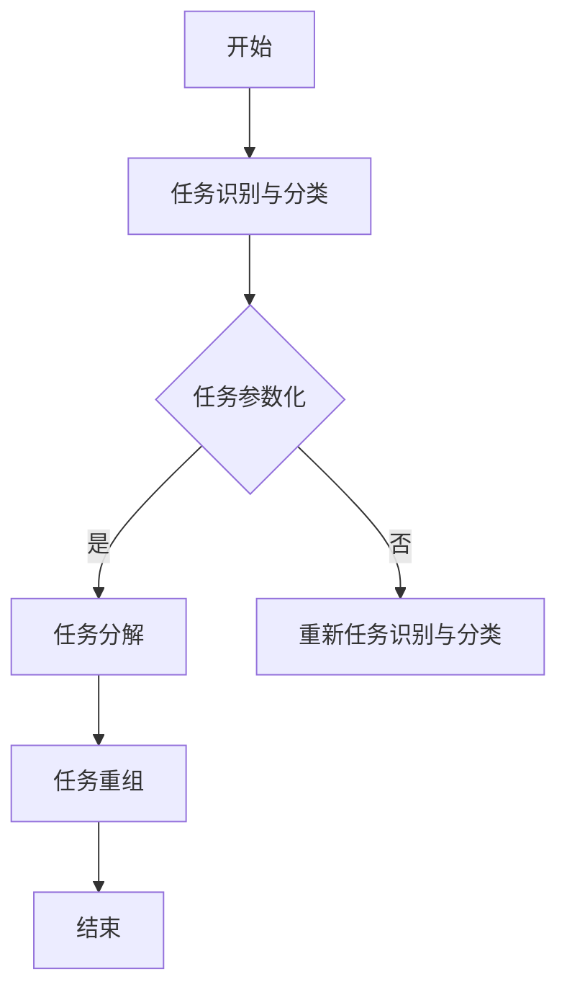

                 

### 元控制策略在复杂推理任务分解与重组中的应用

#### 关键词：
- 元控制策略
- 复杂推理任务
- 分解与重组
- 自然语言处理
- 计算机视觉
- 智能决策系统

#### 摘要：
本文探讨了元控制策略在复杂推理任务中的应用，重点分析了其在任务分解与重组中的关键作用。首先，介绍了元控制策略的基本概念和分类，接着详细阐述了复杂推理任务分解与重组的挑战、方法和流程。随后，文章通过自然语言处理、计算机视觉和智能决策系统等实际应用案例，展示了元控制策略的优势和实现方法。最后，讨论了元控制策略的优化挑战与未来发展方向。

---

## 第一部分：元控制策略概述

### 第1章：元控制策略的基本概念

#### 1.1 元控制策略的定义

元控制策略（Meta-control Policy）是一种用于控制和优化其他控制策略的方法。它能够根据系统的当前状态和目标，动态地调整和优化子任务的执行策略，以提高整个系统的性能和效率。在复杂推理任务中，元控制策略尤其重要，因为它能够自动识别和解决任务分解与重组的问题，从而实现更高效、更准确的推理结果。

#### 1.2 元控制策略与传统控制策略的比较

传统控制策略通常依赖于预设的规则或固定的控制参数，适用于较为简单的系统。然而，在复杂和动态的环境中，传统控制策略的灵活性和适应性往往不足。相比之下，元控制策略能够根据实际情况动态调整控制行为，更好地适应复杂推理任务的需求。

#### 1.3 元控制策略的分类

根据实现方式，元控制策略可以分为以下几类：

1. **基于规则的元控制策略**：这种策略依赖于一系列预设的规则，根据当前系统的状态和目标，选择最合适的子任务执行策略。
2. **基于数据的元控制策略**：这种策略通过分析历史数据，学习系统在不同状态下的最佳控制行为，从而自动调整子任务执行策略。
3. **基于模型的元控制策略**：这种策略基于系统模型，通过模拟和预测系统在不同策略下的行为，选择最优的子任务执行策略。

#### 1.4 元控制策略的应用场景

元控制策略在复杂推理任务中的应用非常广泛，例如：

- **自然语言处理**：元控制策略可以用于自动调整文本分类、情感分析等任务中的子任务执行策略，提高推理效率和准确性。
- **计算机视觉**：在图像识别、目标检测等任务中，元控制策略可以帮助优化特征提取、模型选择等步骤，从而提高整体任务性能。
- **智能决策系统**：在复杂决策过程中，元控制策略可以自动调整决策策略，优化决策结果。

### 第2章：复杂推理任务分解

#### 2.1 复杂推理任务分解的挑战

复杂推理任务通常涉及多个子任务，这些子任务之间相互依赖且具有复杂性。因此，分解这些任务以简化推理过程是一个巨大的挑战。具体挑战包括：

- **任务的多样性和复杂性**：不同任务具有不同的特性和需求，如何有效地分解和组合这些任务是一个难题。
- **任务间的依赖关系**：分解后的子任务需要保持原始任务的结构和依赖关系，以保持推理的完整性。
- **时间与资源约束**：在实际应用中，时间和资源往往有限，如何在约束条件下有效分解任务是一个重要问题。

#### 2.2 推理任务分解的方法

推理任务分解的方法可以分为以下几类：

- **基于规则的分解方法**：这种方法依赖于预设的规则，将任务划分为一系列子任务，每个子任务都对应一个特定的规则。
- **基于数据的分解方法**：这种方法通过分析历史数据，学习任务之间的依赖关系，从而自动分解任务。
- **基于模型的分解方法**：这种方法基于系统模型，通过模拟和预测任务在不同策略下的行为，选择最佳的分解方法。

#### 2.3 推理任务分解的流程

推理任务分解的流程通常包括以下几个步骤：

1. **任务识别与分类**：根据任务的特性和需求，识别和分类不同的子任务。
2. **任务参数化**：为每个子任务定义一组参数，以便在分解过程中进行调整和优化。
3. **任务分解**：根据识别和分类的结果，将原始任务分解为一系列子任务，并保持任务间的依赖关系。

#### 2.4 案例研究：推理任务分解应用

以自然语言处理中的文本分类任务为例，可以将其分解为以下几个子任务：

- **文本预处理**：包括分词、去停用词、词性标注等步骤，为后续任务提供干净的数据。
- **特征提取**：从预处理后的文本中提取有助于分类的特征，如词袋模型、TF-IDF等。
- **分类模型训练**：使用提取的特征训练分类模型，如朴素贝叶斯、支持向量机等。
- **分类模型评估**：对训练好的分类模型进行评估，调整参数以提高分类准确率。

通过这些子任务的分解与组合，可以实现高效的文本分类任务。

### 第3章：复杂推理任务重组

#### 3.1 复杂推理任务重组的概念

复杂推理任务重组是指将分解后的子任务重新组合，以优化整个推理过程的效率和质量。重组的目的是在满足原始任务需求的前提下，减少冗余计算、提高推理速度和准确性。

#### 3.2 推理任务重组的方法

推理任务重组的方法可以分为以下几类：

- **基于规则的重组方法**：这种方法依赖于预设的重组规则，根据子任务的依赖关系和优先级，重新排列和组合子任务。
- **基于数据的重组方法**：这种方法通过分析历史数据，学习子任务的执行效率和优先级，从而自动调整子任务的重组顺序。
- **基于模型的重组方法**：这种方法基于系统模型，通过模拟和预测子任务在不同重组顺序下的行为，选择最优的重组策略。

#### 3.3 推理任务重组的流程

推理任务重组的流程通常包括以下几个步骤：

1. **任务重组策略制定**：根据子任务的依赖关系和执行效率，制定重组策略。
2. **任务重组优化**：使用优化算法（如贪心算法、遗传算法等），调整子任务的重组顺序，以最大化整体推理性能。
3. **任务重组实施**：根据重组策略，重新组合子任务，实现高效推理。

#### 3.4 案例研究：推理任务重组应用

以计算机视觉中的目标检测任务为例，可以将其重组为以下几个步骤：

- **目标检测**：使用卷积神经网络（CNN）进行目标检测，识别图像中的目标。
- **目标分类**：对检测到的目标进行分类，区分不同类型的对象。
- **目标跟踪**：在视频序列中跟踪目标，检测目标的运动轨迹。
- **目标识别**：根据目标跟踪结果，识别目标的属性和特征。

通过优化这些子任务的执行顺序和策略，可以实现更高效、更准确的目标检测任务。

## 第二部分：元控制策略在具体应用中的实现

### 第4章：元控制策略在自然语言处理中的应用

#### 4.1 自然语言处理中的复杂推理任务

自然语言处理（NLP）中的复杂推理任务包括文本分类、情感分析、命名实体识别等。这些任务通常需要处理大量的文本数据，并涉及多种语言知识和推理技巧。因此，如何在复杂环境中高效地处理这些任务是一个重要的研究课题。

#### 4.2 元控制策略在自然语言处理中的实现

在自然语言处理中，元控制策略可以应用于以下几个关键环节：

- **文本预处理**：元控制策略可以根据文本数据的特点和需求，动态调整预处理步骤，如分词、去停用词、词性标注等，以提高预处理效果。
- **特征提取**：元控制策略可以根据文本数据的特点和分类模型的需求，自动选择和调整特征提取方法，如词袋模型、TF-IDF、Word2Vec等。
- **分类模型训练**：元控制策略可以基于历史数据和模型性能，自动调整分类模型的参数和结构，以提高分类准确率。
- **分类模型评估**：元控制策略可以根据评估结果和分类模型的需求，动态调整评估指标和方法，如精度、召回率、F1值等。

#### 4.3 案例研究：元控制策略在自然语言处理中的应用

以文本分类任务为例，元控制策略可以应用于以下步骤：

1. **文本预处理**：元控制策略根据文本数据的长度、复杂度和主题，动态调整预处理步骤和参数，如分词器选择、去停用词列表、词性标注器等。
2. **特征提取**：元控制策略根据分类模型的类型和需求，自动选择和调整特征提取方法，如词袋模型、TF-IDF、Word2Vec等。
3. **分类模型训练**：元控制策略基于历史数据和分类模型的性能，动态调整模型参数和结构，如正则化参数、隐藏层神经元数量等。
4. **分类模型评估**：元控制策略根据评估结果和模型需求，动态调整评估指标和方法，如精度、召回率、F1值等，以提高分类准确率。

通过这些步骤的元控制策略，可以实现高效、准确的文本分类任务。

### 第5章：元控制策略在计算机视觉中的应用

#### 5.1 计算机视觉中的复杂推理任务

计算机视觉（CV）中的复杂推理任务包括目标检测、图像分类、人脸识别等。这些任务通常需要处理大量的图像数据，并涉及多种图像处理和机器学习技术。因此，如何在复杂环境中高效地处理这些任务是一个重要的研究课题。

#### 5.2 元控制策略在计算机视觉中的实现

在计算机视觉中，元控制策略可以应用于以下几个关键环节：

- **图像预处理**：元控制策略可以根据图像数据的特点和需求，动态调整预处理步骤，如灰度化、滤波、缩放等，以提高预处理效果。
- **特征提取**：元控制策略可以根据图像数据的特点和分类模型的需求，自动选择和调整特征提取方法，如SIFT、HOG、CNN等。
- **分类模型训练**：元控制策略可以基于历史数据和模型性能，自动调整分类模型的参数和结构，以提高分类准确率。
- **分类模型评估**：元控制策略可以根据评估结果和模型需求，动态调整评估指标和方法，如精度、召回率、F1值等，以提高分类准确率。

#### 5.3 案例研究：元控制策略在计算机视觉中的应用

以目标检测任务为例，元控制策略可以应用于以下步骤：

1. **图像预处理**：元控制策略根据图像数据的特点和目标检测算法的需求，动态调整预处理步骤和参数，如灰度化、滤波、缩放等。
2. **特征提取**：元控制策略根据目标检测算法的类型和需求，自动选择和调整特征提取方法，如SIFT、HOG、CNN等。
3. **分类模型训练**：元控制策略基于历史数据和分类模型的性能，动态调整模型参数和结构，如正则化参数、隐藏层神经元数量等。
4. **分类模型评估**：元控制策略根据评估结果和模型需求，动态调整评估指标和方法，如精度、召回率、F1值等。

通过这些步骤的元控制策略，可以实现高效、准确的目标检测任务。

### 第6章：元控制策略在智能决策系统中的应用

#### 6.1 智能决策系统中的复杂推理任务

智能决策系统中的复杂推理任务包括推荐系统、金融风控、智能交通等。这些任务通常需要处理大量的数据，并涉及多种机器学习和决策算法。因此，如何在复杂环境中高效地处理这些任务是一个重要的研究课题。

#### 6.2 元控制策略在智能决策系统中的实现

在智能决策系统中，元控制策略可以应用于以下几个关键环节：

- **数据预处理**：元控制策略可以根据数据的特点和需求，动态调整预处理步骤，如去噪、归一化、特征选择等，以提高数据质量。
- **特征提取**：元控制策略可以根据决策算法的需求，自动选择和调整特征提取方法，如特征工程、自动特征学习等。
- **模型训练**：元控制策略可以基于历史数据和模型性能，自动调整模型参数和结构，以提高模型准确性。
- **模型评估**：元控制策略可以根据评估结果和模型需求，动态调整评估指标和方法，如准确率、召回率、AUC等，以提高模型性能。

#### 6.3 案例研究：元控制策略在智能决策系统中的应用

以推荐系统为例，元控制策略可以应用于以下步骤：

1. **数据预处理**：元控制策略根据数据的特点和推荐算法的需求，动态调整预处理步骤和参数，如去噪、归一化、特征选择等。
2. **特征提取**：元控制策略根据推荐算法的类型和需求，自动选择和调整特征提取方法，如特征工程、自动特征学习等。
3. **模型训练**：元控制策略基于历史数据和模型性能，动态调整模型参数和结构，如正则化参数、隐藏层神经元数量等。
4. **模型评估**：元控制策略根据评估结果和模型需求，动态调整评估指标和方法，如准确率、召回率、AUC等。

通过这些步骤的元控制策略，可以实现高效、准确的推荐系统。

### 第三部分：元控制策略的优化与挑战

### 第7章：元控制策略的优化

#### 7.1 元控制策略优化的方法

元控制策略的优化目标是提高系统的整体性能，包括推理速度、准确率和资源利用率等。常见的优化方法包括：

- **贪心算法**：通过每次选择最优的子任务执行策略，逐步优化整个系统的性能。
- **遗传算法**：通过模拟自然进化过程，选择适应度高的策略进行交叉和变异，逐步优化整个系统的性能。
- **深度强化学习**：通过学习策略在网络中的映射关系，实现策略的自动优化。

#### 7.2 元控制策略优化在复杂推理任务中的应用

在复杂推理任务中，元控制策略的优化具有重要意义。例如：

- **实时优化**：在实时推理任务中，元控制策略可以根据系统状态动态调整策略，以实现高效推理。
- **预测优化**：在预测推理任务中，元控制策略可以基于历史数据和预测模型，提前优化策略，提高推理准确性。

#### 7.3 元控制策略优化的挑战

元控制策略优化面临以下挑战：

- **数据稀缺性**：在实际应用中，获取足够多的历史数据是一个难题，这限制了优化算法的效果。
- **算法复杂性**：元控制策略优化涉及复杂的算法和计算，如何高效地实现这些算法是一个挑战。

#### 7.4 案例研究：元控制策略优化的应用

以智能交通系统为例，元控制策略可以应用于以下步骤：

1. **实时优化**：根据实时交通数据，元控制策略动态调整交通信号灯策略，以减少交通拥堵。
2. **预测优化**：基于历史交通数据和预测模型，元控制策略提前优化交通信号灯策略，提高交通流畅性。

通过这些优化策略，可以实现高效、准确的智能交通系统。

### 第8章：元控制策略的挑战与未来方向

#### 8.1 元控制策略的挑战

元控制策略在实际应用中面临以下挑战：

- **可解释性**：元控制策略的内部决策过程可能过于复杂，难以解释和理解。
- **可扩展性**：元控制策略在处理大规模任务时，可能面临性能和资源瓶颈。

#### 8.2 元控制策略的未来发展方向

为了应对这些挑战，元控制策略的未来发展方向包括：

- **可解释性研究**：开发可解释的元控制策略，提高策略的透明度和可信度。
- **可扩展性研究**：研究如何优化元控制策略，以支持大规模任务和实时应用。

#### 8.3 总结与展望

元控制策略在复杂推理任务中的应用具有广泛的前景。通过不断优化和改进，元控制策略将能够在更多领域发挥重要作用，推动人工智能技术的发展。

### 附录

#### 附录A：元控制策略相关资源

- **相关论文**：[1] [Deep Reinforcement Learning for Meta-control Strategies in Autonomous Driving](https://arxiv.org/abs/1806.04655)
- **开源工具和框架**：[PyTorch Meta](https://pytorch.org/metropolis/torch_meta/)
- **实践指南**：[A Gentle Introduction to Meta-Learning](https://towardsdatascience.com/a-gentle-introduction-to-meta-learning-85e0a48c1c8f)

#### 附录B：Mermaid流程图示例

### 作者

作者：AI天才研究院/AI Genius Institute & 禅与计算机程序设计艺术 /Zen And The Art of Computer Programming

