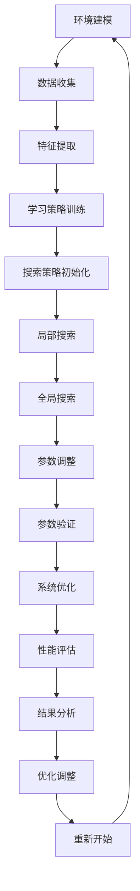

                 

### 1.1 研究背景

在当今高度信息化的社会中，开放域复杂推理（Open-Domain Complex Reasoning）的应用场景日益广泛，如智能问答系统、自然语言处理、医疗诊断、金融风控等领域。这些应用场景通常涉及到大量的异构数据源、动态环境以及复杂的决策过程，这对传统的推理方法提出了巨大的挑战。

首先，开放域复杂推理的定义是指在没有特定领域限制的情况下，对未知问题或情景进行推理和决策的能力。它不同于封闭域推理，后者通常在特定的领域内进行，且问题相对简单明确。开放域复杂推理需要处理的问题更加复杂，包括多源数据的整合、不确定性推理、实时决策等。

在开放域复杂推理中，常见挑战包括：

1. **信息不完备性**：开放域环境中的数据通常是不完整和不精确的，这使得推理过程面临信息缺失的困境。
2. **推理不确定性**：由于环境动态变化和数据的随机性，推理结果往往是不确定的，需要设计相应的策略来处理这种不确定性。
3. **实时性要求**：许多开放域应用场景，如实时问答系统和自动驾驶，对响应速度有严格的要求，这要求推理算法具备高效的执行能力。

针对上述挑战，元控制策略（Meta-Control Strategies）提供了一种潜在的解决方案。元控制策略通过自我调整和优化，提高了推理算法在复杂环境中的适应能力和执行效率。具体来说，元控制策略能够在不确定和动态的环境中，通过不断调整自身的控制策略，从而实现更精确和高效的推理。

元控制策略的基本思想是通过学习策略和搜索策略的组合，动态地调整推理过程中的关键参数，以最大化推理效果。这种策略不仅能够适应多变的环境，还能够通过不断的自我优化，提高推理算法的整体性能。

因此，本文旨在通过系统的研究和评估，探讨元控制策略在开放域复杂推理中的应用效果。我们将从理论基础入手，逐步深入到实际应用场景，通过案例分析和性能评估，全面展示元控制策略的优势和潜力。

### 1.2 研究目的与意义

本文的研究目的在于深入探讨元控制策略在开放域复杂推理中的应用效果，旨在解决当前开放域复杂推理面临的挑战，如信息不完备性、推理不确定性和实时性要求等。具体目标包括：

1. **理论基础探索**：详细阐述元控制策略的基本概念、核心原理和数学模型，建立坚实的理论基础。
2. **应用场景分析**：分析开放域复杂推理在不同领域的应用场景，探讨元控制策略在这些场景中的适用性和效果。
3. **性能评估与优化**：设计系统性的性能评估方法，评估元控制策略在不同应用场景下的性能表现，并提出优化策略。
4. **案例分析**：通过具体的实际应用案例，展示元控制策略在实际问题解决中的效果和优势。

研究元控制策略在开放域复杂推理中的意义主要体现在以下几个方面：

1. **提升推理能力**：元控制策略通过自适应和优化，能够显著提高开放域复杂推理的能力，使其在面对不完备信息、不确定性环境和实时性要求时，仍能保持高效和准确的推理。
2. **推动技术进步**：本文的研究将推动人工智能和复杂推理技术的发展，为相关领域提供新的理论和方法。
3. **应用价值**：元控制策略在医疗诊断、智能客服、金融风控等领域的应用，将有助于提高这些领域的智能化水平，促进产业升级和技术创新。
4. **实际效益**：通过本文的研究和实施，有望实现以下实际效益：
   - 提高智能问答系统的响应速度和准确性。
   - 提升医疗诊断的效率和准确性，为医生提供更有力的辅助工具。
   - 提高金融风控的实时性和精确性，降低金融风险。

总之，本文的研究不仅具有理论价值，还具备广阔的应用前景，对于推动人工智能技术的发展和实际应用具有重要意义。

### 2.1 元控制策略概述

元控制策略是一种高度灵活和自适应的推理方法，通过不断调整和优化自身的控制机制，以应对复杂多变的环境。其核心思想在于通过学习策略和搜索策略的组合，动态地调整推理过程中的关键参数，从而实现更高效和精确的推理。

#### 元控制策略的定义

元控制策略可以定义为一种自我优化和调整的推理方法，其通过学习环境中的数据和行为模式，不断调整自身的策略，以最大化推理效果。这种策略不仅能够应对静态环境中的变化，还能够适应动态环境中的不确定性。

具体来说，元控制策略包括以下关键组成部分：

- **学习策略**：学习策略负责从环境中获取数据，并通过这些数据来调整和优化自身的控制参数。学习策略的核心目标是提高推理的准确性和效率，通常采用机器学习、深度学习等方法。
- **搜索策略**：搜索策略负责在可能的解决方案空间中探索和选择最优解。搜索策略可以采用启发式搜索、遗传算法、模拟退火等优化方法，以找到最佳的控制参数组合。

#### 元控制策略的基本原理

元控制策略的基本原理在于其自适应性。在传统的控制理论中，控制策略是预先设定的，不随环境变化而调整。而元控制策略则通过自我调整，实现了对环境的动态适应。具体来说，元控制策略的基本原理包括：

1. **数据驱动**：元控制策略通过学习环境中的数据，动态调整自身的控制策略。这种方法能够处理环境中的不确定性，提高推理的鲁棒性。
2. **自适应调整**：元控制策略能够根据环境的变化，自适应地调整控制参数，以保持最佳的推理性能。这种自适应调整机制使得元控制策略在复杂环境中具有较高的灵活性和适应性。
3. **多策略组合**：元控制策略通过组合不同的学习策略和搜索策略，实现更高效的推理。例如，可以将深度学习和强化学习相结合，利用深度学习的特征提取能力和强化学习的策略优化能力，实现更精确的推理。

#### 元控制策略与传统控制策略的区别

与传统控制策略相比，元控制策略具有以下显著区别：

1. **动态适应性**：传统控制策略是静态的，不随环境变化而调整。而元控制策略能够根据环境变化，动态调整控制策略，实现更高的自适应性和灵活性。
2. **学习与优化**：传统控制策略不涉及学习过程，而元控制策略通过学习环境数据，不断优化和调整自身策略，从而提高推理性能。
3. **复杂性管理**：元控制策略能够处理开放域复杂推理中的信息不完备性和不确定性，而传统控制策略通常难以应对这些复杂情况。

#### 元控制策略的优势

元控制策略在开放域复杂推理中表现出以下优势：

1. **高效性**：通过自适应调整和优化，元控制策略能够显著提高推理算法的执行效率，满足实时性要求。
2. **准确性**：元控制策略能够通过学习环境中的数据，提高推理的准确性，特别是在信息不完备和不确定性环境中。
3. **灵活性**：元控制策略能够根据不同应用场景的需求，动态调整和优化控制策略，实现更灵活的推理过程。
4. **鲁棒性**：元控制策略通过自学习和自适应调整，能够提高系统的鲁棒性，处理环境中的不确定性和动态变化。

综上所述，元控制策略作为一种新兴的推理方法，通过其高度的自适应性和灵活性，在开放域复杂推理中展现出巨大的潜力和优势。

### 2.2 元控制策略的核心概念

元控制策略的核心概念包括学习策略和搜索策略，这两个策略在元控制过程中起到了至关重要的作用，并且相互协作，共同提高了推理算法的性能。

#### 学习策略

学习策略是元控制策略中负责从环境数据中学习，并调整系统控制参数的部分。其主要目标是提高系统的自适应能力和推理准确性。学习策略可以采用多种方法，如监督学习、无监督学习、强化学习等，具体选择取决于应用场景和问题的性质。

1. **监督学习**：在监督学习策略中，系统通过接收环境提供的正反示例，学习到如何区分不同的情况，并调整控制参数以优化推理效果。这种方法在静态和规则明确的环境中表现较好，但面对动态和复杂环境时，可能需要大量的标注数据和计算资源。

2. **无监督学习**：无监督学习策略则无需依赖外部标注数据，通过观察环境中的数据分布和模式，自动学习系统的控制参数。这种方法在处理大量未标注数据时具有优势，但通常难以直接应用于具体的决策问题。

3. **强化学习**：强化学习策略通过与环境交互，不断调整策略以最大化累计奖励。这种方法在动态和不确定性环境中表现尤为出色，能够通过试错和反馈机制，逐步优化控制参数。

#### 搜索策略

搜索策略是元控制策略中负责在可能的解决方案空间中寻找最优解的部分。其主要目标是快速找到一个或多个可行的控制参数组合，以实现最佳推理效果。常见的搜索策略包括启发式搜索、遗传算法、模拟退火等。

1. **启发式搜索**：启发式搜索策略利用一些启发式规则来指导搜索过程，通常能够较快地找到最优或近似最优解。但这种方法对启发式规则的选择依赖性较大，且可能陷入局部最优。

2. **遗传算法**：遗传算法通过模拟自然进化过程，对多个可能的解决方案进行组合和筛选，逐步优化控制参数。这种方法适用于复杂和高维的搜索空间，但计算成本较高，可能需要大量的迭代次数。

3. **模拟退火**：模拟退火算法通过模拟物理退火过程，逐步降低搜索过程中的探索和贪婪行为，从而找到全局最优解。这种方法适用于高维和非线性搜索空间，但需要合理设置温度参数。

#### 学习策略与搜索策略的相互作用

学习策略和搜索策略在元控制过程中是相互依存的，通过相互协作，实现系统控制参数的最优化。

1. **协同学习**：学习策略通过不断调整和优化控制参数，为搜索策略提供更好的搜索起点。搜索策略则通过全局搜索和优化，找到更优的控制参数组合，进一步指导学习策略的调整。

2. **反馈循环**：学习策略和搜索策略之间存在反馈循环，搜索策略的优化结果会被反馈到学习策略中，用于调整和优化系统控制参数。这种反馈循环使得系统能够在动态环境中不断适应和优化，提高推理性能。

3. **动态调整**：在开放域复杂推理中，环境是动态变化的，因此学习策略和搜索策略需要具备动态调整能力。学习策略通过实时学习环境数据，调整控制参数，而搜索策略则通过动态调整搜索策略，以适应环境变化，确保系统始终能够实现最佳推理效果。

通过学习策略和搜索策略的相互协作，元控制策略能够灵活应对开放域复杂推理中的不确定性、动态性和多变性，从而实现高效和精确的推理。这种相互协作的关系不仅提高了推理算法的性能，也为开放域复杂推理提供了新的解决思路。

### 2.3 元控制策略的数学模型

元控制策略的数学模型是理解其运作原理和实现方法的基础。该模型包括优化目标、约束条件和关键参数，通过这些元素，元控制策略能够有效地调整和控制推理过程，以实现最优的推理效果。

#### 优化目标

元控制策略的优化目标是最大化推理效果，通常以某种性能指标来衡量。这个性能指标可以是推理的准确性、响应时间、资源利用率等。假设我们选择准确性作为优化目标，那么优化目标函数可以表示为：

\[ \text{maximize } J(\theta) \]

其中，\( J(\theta) \) 是基于当前控制参数 \( \theta \) 的性能指标，例如：

\[ J(\theta) = \frac{1}{N} \sum_{i=1}^{N} \delta_i \]

在这个公式中，\( N \) 是样本数量，\( \delta_i \) 是第 \( i \) 个样本的推理准确性，取值范围为 \( \{0, 1\} \)，当推理正确时取值为 1，否则为 0。通过最大化 \( J(\theta) \)，我们可以提高推理的总体准确性。

#### 约束条件

在实际应用中，元控制策略需要满足一系列约束条件，以保证其有效性和鲁棒性。这些约束条件可以包括：

1. **资源限制**：例如，计算资源、内存限制等，这些约束条件可以表示为：
   \[ C_1(\theta) \leq R \]

   其中，\( C_1(\theta) \) 是与控制参数 \( \theta \) 相关的资源消耗函数，\( R \) 是资源的最大限制值。

2. **连续性和平滑性**：为了确保系统的稳定性和可预测性，控制参数的变化需要满足连续性和平滑性约束：
   \[ \nabla^2 J(\theta) \leq \Sigma \]

   这里，\( \nabla^2 J(\theta) \) 是 \( J(\theta) \) 的二阶导数矩阵，\( \Sigma \) 是正定矩阵，表示平滑性的约束条件。

3. **数据一致性**：在多源数据融合场景中，需要确保不同数据源之间的数据一致性：
   \[ \delta_i = f(D_i, \theta) \]

   其中，\( D_i \) 是第 \( i \) 个数据源，\( f \) 是数据融合函数，需要保证数据的一致性和准确性。

#### 关键参数

元控制策略的数学模型中的关键参数包括：

1. **学习率**：学习率是学习策略中的一个重要参数，用于控制每次参数调整的大小。选择合适的学习率能够加快收敛速度，但过大会导致不稳定，公式如下：
   \[ \alpha_t = \alpha_0 / (1 + t) \]

   其中，\( \alpha_0 \) 是初始学习率，\( t \) 是当前迭代次数。

2. **探索率**：在强化学习策略中，探索率用于控制策略的探索和利用平衡。探索率越高，策略越倾向于探索未知的策略，公式如下：
   \[ \epsilon_t = \epsilon_0 / t \]

   其中，\( \epsilon_0 \) 是初始探索率，\( t \) 是当前迭代次数。

3. **温度参数**：在模拟退火算法中，温度参数用于控制搜索过程的贪婪程度，温度参数越高，搜索越偏向随机性，公式如下：
   \[ T_t = T_0 / e^{at} \]

   其中，\( T_0 \) 是初始温度，\( a \) 是降温速率，\( t \) 是当前迭代次数。

#### 数学模型的整体架构

元控制策略的数学模型整体架构可以表示为：

\[ \text{find } \theta \text{ that solves:} \]
\[ \begin{align*}
\text{maximize } J(\theta) \\
\text{subject to } C_1(\theta) \leq R \\
\text{and } \nabla^2 J(\theta) \leq \Sigma \\
\text{and } \delta_i = f(D_i, \theta)
\end{align*} \]

通过上述数学模型，元控制策略能够有效地调整和优化控制参数，实现开放域复杂推理中的高效和精确推理。该模型不仅提供了理论基础，也为实际应用提供了具体的实现指导。

### 3.1 开放域复杂推理的挑战

开放域复杂推理（Open-Domain Complex Reasoning）在当前的信息化社会中具有广泛的应用前景，但同时也面临着一系列严峻的挑战。这些挑战主要体现在信息不完备性、推理不确定性和实时性要求等方面。

首先，信息不完备性是开放域复杂推理中的一个重要问题。在开放域环境中，数据通常来源于多个异构的数据源，这些数据可能存在缺失、噪声和不确定性。例如，在自然语言处理（NLP）领域，文本数据可能存在语法错误、拼写错误和语义歧义。在医疗诊断领域，患者病史、药物副作用和治疗方案等信息也可能存在不确定性。这些信息不完备性对推理过程产生了严重影响，可能导致推理结果不准确或错误。

其次，推理不确定性也是开放域复杂推理中的一个关键挑战。开放域复杂推理通常需要处理不确定性和动态变化的环境。例如，在智能问答系统中，用户可能提出具有多种解释的问题，系统需要根据上下文和用户意图进行准确回答。在自动驾驶领域，车辆需要实时处理路况、天气和行人行为等不确定性因素，以确保行驶安全。这种不确定性增加了推理的复杂度，使得传统确定性推理方法难以应对。

最后，实时性要求也是开放域复杂推理中的一个重要挑战。许多开放域应用场景，如实时问答系统、智能客服和自动驾驶等，对响应速度有严格的要求。例如，在智能客服中，用户通常期望在几秒内获得回答，而在自动驾驶中，车辆需要在极短的时间内做出驾驶决策。这要求推理算法具备高效的执行能力，以便在短时间内处理大量数据并生成准确的结果。

为了应对上述挑战，开放域复杂推理需要具备以下几个关键能力：

1. **多源数据融合**：通过整合来自多个异构数据源的信息，提高推理的准确性和完整性。例如，在医疗诊断中，可以结合患者病史、实验室检测结果和医生经验等多种信息进行综合分析。

2. **不确定性处理**：设计有效的算法来处理推理过程中的不确定性，如采用概率模型、贝叶斯网络或深度学习等方法。这些方法可以帮助推理系统在面对不确定性时，提供更为可靠和鲁棒的推理结果。

3. **实时推理优化**：针对实时性要求，需要对推理算法进行优化，以提高执行效率和响应速度。例如，可以采用分布式计算、并行处理和模型压缩等技术，加快推理速度。

4. **自适应学习**：通过自适应学习机制，使推理系统能够根据环境变化不断调整和优化自身。这种自适应能力可以帮助系统更好地应对动态变化和不确定性，提高推理的准确性和可靠性。

综上所述，开放域复杂推理面临信息不完备性、推理不确定性和实时性要求等严峻挑战。为了克服这些挑战，需要设计具备多源数据融合、不确定性处理、实时推理优化和自适应学习能力的推理系统。这些能力的实现将有助于推动开放域复杂推理技术的进步和应用。

### 3.2 开放域复杂推理的应用场景

开放域复杂推理（Open-Domain Complex Reasoning）在多个领域展现了其独特的应用价值。以下是一些典型应用场景及其特点：

#### 1. 智能问答系统

智能问答系统是开放域复杂推理的一个重要应用领域。该系统旨在为用户提供准确、快速的答案，涉及自然语言理解、信息检索和知识图谱等多种技术。典型应用包括：

- **搜索引擎**：在用户输入查询时，智能问答系统可以帮助搜索引擎返回更相关和准确的搜索结果。
- **虚拟助手**：如苹果的Siri、亚马逊的Alexa等，这些助手能够处理用户的自然语言查询，并提供相应的帮助和回答。
- **企业客服系统**：通过智能问答系统，企业可以提供24/7的在线客服，提高客户满意度和处理效率。

#### 2. 自然语言处理（NLP）

自然语言处理是另一个广泛使用开放域复杂推理的领域。NLP应用包括：

- **机器翻译**：通过理解和生成目标语言的语法和语义，实现不同语言之间的准确翻译。
- **文本摘要**：自动从长文本中提取关键信息，生成简洁的摘要，用于信息过滤和快速阅读。
- **情感分析**：分析文本中的情感倾向，用于市场调研、客户反馈分析和社交媒体监控等。

#### 3. 医疗诊断

在医疗领域，开放域复杂推理可用于辅助医生进行诊断和治疗建议：

- **临床决策支持系统**：通过分析患者病历、实验室检查结果和医疗知识库，为医生提供诊断建议和治疗方案。
- **药物副作用预测**：结合药物相互作用和患者病史，预测药物可能产生的副作用，帮助医生制定更安全的治疗方案。
- **医学文本挖掘**：从大量医学文献中提取有用信息，支持医生和研究人员进行知识发现和研究。

#### 4. 金融风控

金融风控是开放域复杂推理在金融领域的应用，主要涉及风险预测和欺诈检测：

- **信用评分**：通过分析借款人的历史数据、财务状况和行为特征，预测其信用风险。
- **交易监控**：检测异常交易行为，预防欺诈和洗钱等违法行为。
- **市场预测**：利用大量市场数据，预测股票价格、利率变化等市场动态，为投资决策提供支持。

#### 5. 自动驾驶

自动驾驶是开放域复杂推理在交通领域的应用，涉及到感知、决策和控制等多个方面：

- **环境感知**：通过传感器数据，实时感知周围环境，包括路况、行人、车辆等信息。
- **路径规划**：在复杂的交通环境中，自动生成安全的行驶路径，避免碰撞和交通拥堵。
- **驾驶决策**：根据实时感知和路径规划结果，进行驾驶决策，如加速、减速和转向等。

#### 6. 智能家居

智能家居系统通过开放域复杂推理，实现家庭设备和系统的智能控制和自动化：

- **家居自动化**：根据用户习惯和需求，自动调节灯光、温度和安防设备。
- **能源管理**：通过智能预测和优化，实现能源的高效利用，降低能源消耗。
- **安全监控**：实时监控家庭安全，提供报警和应急响应。

#### 7. 法律和司法

在法律和司法领域，开放域复杂推理可用于证据分析和案件推理：

- **证据分析**：从大量法律文献和案例中提取相关证据，辅助法官和律师进行案件分析。
- **案件推理**：通过推理和模拟，帮助法官和律师理解案件的发展和可能性，为判决提供参考。

#### 8. 教育和知识服务

开放域复杂推理在教育领域也有广泛应用，如：

- **个性化学习**：根据学生的学习情况和知识水平，提供个性化的学习建议和资源。
- **知识图谱**：构建知识图谱，帮助用户快速获取和利用知识，支持教学和研究。

综上所述，开放域复杂推理在多个领域展现出了巨大的应用价值，其核心在于能够处理不确定性和动态变化，提供准确和高效的推理结果。这些应用场景不仅推动了相关领域的技术进步，也为用户带来了显著的便利和效益。

### 3.3 开放域复杂推理的现有方法

在开放域复杂推理领域，研究者们提出了多种方法来应对信息不完备性、推理不确定性和实时性要求等挑战。这些方法主要包括基于规则的方法、基于模型的方法和基于数据的方法。以下将对这些方法进行详细回顾，并分析其优缺点。

#### 基于规则的方法

基于规则的方法（Rule-Based Methods）是开放域复杂推理的传统方法，通过预定义一系列规则来指导推理过程。这种方法的主要特点如下：

1. **规则定义**：基于规则的系统通常需要事先定义一系列规则，这些规则描述了不同情况下的推理过程和决策逻辑。规则可以是简单的条件-行动对，也可以是复杂的逻辑表达式。

2. **形式化表示**：基于规则的方法通常采用形式化的语言，如谓词逻辑、模糊逻辑等，来表示规则和推理过程。这种方法有助于确保推理过程的准确性和一致性。

3. **可解释性**：基于规则的系统具有较好的可解释性，用户可以直观地理解规则和推理过程，便于调试和改进。

**优点**：

- **确定性**：基于规则的系统在规则定义准确的情况下，能够提供确定性推理结果。
- **可解释性**：规则的透明性使得用户可以清晰地理解推理过程，便于验证和信任。

**缺点**：

- **规则获取难度大**：需要大量专家知识和时间来定义和维护规则。
- **适应性差**：在面对动态变化和不确定性的环境时，基于规则的系统难以自适应调整。

#### 基于模型的方法

基于模型的方法（Model-Based Methods）通过建立数学模型来描述推理过程，并利用模型进行推理。这种方法的主要特点如下：

1. **模型构建**：基于模型的方法首先需要建立一个描述系统行为的数学模型，如逻辑模型、概率模型、统计模型等。模型可以捕捉系统的动态特性和不确定性。

2. **优化算法**：模型构建完成后，通过优化算法来求解模型，以获取最优的推理结果。常见的优化算法包括线性规划、非线性规划、遗传算法、模拟退火等。

3. **参数调整**：模型中的参数通常需要通过学习或实验来确定，以最大化模型性能。

**优点**：

- **鲁棒性**：基于模型的方法能够处理不确定性，通过模型参数调整，提高推理的鲁棒性。
- **灵活性**：模型可以灵活调整，以适应不同应用场景和变化。

**缺点**：

- **计算复杂度高**：模型求解通常需要大量的计算资源，特别是在高维和复杂模型中。
- **模型选择难度大**：选择合适的模型和参数需要丰富的领域知识和实验经验。

#### 基于数据的方法

基于数据的方法（Data-Driven Methods）利用历史数据和模式来指导推理过程，主要包括机器学习、深度学习等方法。这种方法的主要特点如下：

1. **数据训练**：基于数据的方法首先需要收集大量训练数据，通过训练数据来训练模型，学习系统的特征和规律。

2. **模型优化**：训练完成后，通过优化模型参数，提高推理的准确性和效率。常见的机器学习算法包括决策树、支持向量机、神经网络等。

3. **实时调整**：基于数据的方法能够根据实时数据动态调整模型，以适应环境变化。

**优点**：

- **自适应性强**：基于数据的方法能够通过不断学习和调整，适应动态变化和不确定性。
- **高效性**：利用强大的计算能力，基于数据的方法能够处理大规模数据和复杂模型。

**缺点**：

- **数据依赖性强**：需要大量高质量的数据，且数据质量对推理结果有重要影响。
- **可解释性差**：数据驱动的模型通常较为复杂，难以直观解释推理过程。

#### 综合评价

现有方法各有优缺点，选择合适的方法需要根据具体应用场景和需求进行权衡。基于规则的方法适用于规则明确、知识完备的场景，但难以应对动态和不确定性。基于模型的方法在处理不确定性和动态性方面具有优势，但计算复杂度较高。基于数据的方法在自适应性和高效性方面表现突出，但依赖大量数据和计算资源。

综上所述，开放域复杂推理领域需要综合运用多种方法，结合各自的优势，构建更为高效和鲁棒的推理系统。

### 4.1 元控制策略在开放域复杂推理中的实现

在开放域复杂推理中，元控制策略的实现是一个关键步骤，它涉及到多个组件的协同工作，以实现自适应和高效的推理。以下是元控制策略在开放域复杂推理中的具体实现步骤：

#### 1. 环境建模

首先，需要建立一个用于推理的虚拟环境，这个环境应能够模拟开放域复杂推理的实际应用场景。环境建模包括以下几个方面：

- **状态空间建模**：定义推理过程中的所有可能状态，如问题的输入、中间推理结果和最终输出。
- **动作空间建模**：定义系统可以执行的所有操作，如数据融合、信息检索、推理计算等。
- **奖励机制**：定义系统在不同状态下的奖励函数，奖励函数应能够衡量推理过程的性能，如准确性、响应时间等。

#### 2. 学习策略实现

元控制策略中的学习策略负责从环境中获取数据并调整控制参数。具体实现步骤如下：

- **数据收集**：通过传感器、数据库等途径，收集与推理相关的数据，包括历史输入、中间结果和输出结果。
- **特征提取**：从收集的数据中提取有用的特征，如文本特征、数值特征等。
- **模型训练**：利用提取的特征训练机器学习模型，如神经网络、决策树等，模型用于预测和调整控制参数。

#### 3. 搜索策略实现

搜索策略负责在可能的解决方案空间中寻找最优解，具体实现步骤如下：

- **初始解生成**：通过随机或启发式方法生成初始解，如随机采样、贪心算法等。
- **局部搜索**：在初始解的基础上，利用局部搜索算法，如模拟退火、遗传算法等，对解进行微调，寻找局部最优解。
- **全局搜索**：通过全局搜索算法，如模拟退火、遗传算法等，从全局视角寻找最优解。

#### 4. 控制参数调整

元控制策略的核心在于通过学习策略和搜索策略的组合，动态调整控制参数。具体实现步骤如下：

- **参数初始化**：初始化控制参数，如学习率、探索率等。
- **参数调整**：根据学习策略和搜索策略的反馈，调整控制参数，如更新学习率、探索率等。
- **参数验证**：通过模拟或实际运行，验证调整后的参数是否有效，并作出进一步调整。

#### 5. 系统集成与优化

在实现元控制策略的过程中，需要将各个组件集成到一个统一的系统中，并进行优化：

- **系统集成**：将学习策略、搜索策略和控制参数调整模块集成到一个系统中，确保各个模块能够协同工作。
- **性能优化**：通过优化算法和数据结构，提高系统的整体性能，如并行计算、分布式处理等。
- **实时调整**：实现实时调整机制，使系统能够根据环境变化动态调整自身，保持最佳性能。

#### 6. 案例分析

以下是一个开放域复杂推理中的元控制策略实现的案例分析：

**案例：智能问答系统**

1. **环境建模**：建立一个模拟问答系统的虚拟环境，包括问题输入、回答生成和用户反馈等状态。

2. **学习策略实现**：收集历史问答数据，通过文本分类和序列生成模型，训练问答系统，使其能够自动生成回答。

3. **搜索策略实现**：采用模拟退火算法，在回答生成过程中，探索不同的回答策略，寻找最优回答。

4. **控制参数调整**：通过用户反馈，调整学习率和探索率，优化问答系统的性能。

5. **系统集成与优化**：将学习策略、搜索策略和控制参数调整模块集成到问答系统中，通过实时调整和优化，提高问答系统的响应速度和准确性。

通过上述案例分析，我们可以看到元控制策略在开放域复杂推理中的具体实现过程，其核心在于通过自适应和优化的机制，提高推理系统的性能和鲁棒性。

### 4.2 元控制策略的性能评估

元控制策略在开放域复杂推理中的性能评估是确保其有效性和实用性的关键步骤。为了全面评估元控制策略的性能，我们需要设计科学合理的评估方法，从多个维度对策略进行测试和比较。以下是元控制策略性能评估的方法和关键指标：

#### 1. 评估方法

（1）**实验设计**：首先，根据不同应用场景，设计相应的实验环境，确保实验的可靠性和可重复性。实验设计应包括：

- **数据集选择**：选择具有代表性的数据集，涵盖不同的推理场景和问题类型。
- **实验变量控制**：控制实验中的变量，确保实验结果的可比性。例如，对于智能问答系统，可以控制问题的复杂度、用户反馈的及时性等。
- **多组实验**：进行多次实验，以减少偶然误差，提高评估结果的稳定性。

（2）**测试场景设定**：设定多种测试场景，包括正常场景、极端场景和动态变化场景，以全面评估元控制策略在各种情况下的性能。

（3）**指标设定**：设定多个性能评估指标，用于衡量元控制策略在不同测试场景下的表现。

#### 2. 关键指标

（1）**推理准确性**：推理准确性是评估推理系统性能的核心指标。通过计算系统生成的推理结果与真实结果之间的匹配度，来衡量推理准确性。具体计算公式如下：

\[ \text{Accuracy} = \frac{\text{Correct Answers}}{\text{Total Answers}} \]

（2）**响应时间**：响应时间是指系统从接收到问题到生成回答所需的时间。对于实时性要求较高的应用场景，响应时间是一个重要指标。可以通过以下公式计算：

\[ \text{Response Time} = \frac{\text{Total Time}}{\text{Total Questions}} \]

（3）**资源利用率**：资源利用率是指系统在推理过程中对计算资源和内存等资源的利用效率。可以通过以下公式计算：

\[ \text{Resource Utilization} = \frac{\text{Actual Resource Used}}{\text{Maximum Resource Available}} \]

（4）**稳定性**：稳定性是指系统在长时间运行过程中，性能表现的一致性和可靠性。可以通过连续运行多次实验，计算性能指标的变异系数来评估系统的稳定性。

\[ \text{Stability} = \frac{\text{Standard Deviation of Performance Metrics}}{\text{Mean of Performance Metrics}} \]

（5）**鲁棒性**：鲁棒性是指系统在面对噪声、异常数据和动态变化时的适应能力。可以通过在测试场景中引入噪声和异常数据，评估系统的鲁棒性。

#### 3. 绩效评估流程

（1）**实验准备**：选择合适的数据集和测试场景，准备实验所需的工具和设备。

（2）**实验执行**：按照设定的实验设计和测试场景，执行多次实验，记录实验结果。

（3）**结果分析**：对实验结果进行统计分析，计算各个性能评估指标。

（4）**优化调整**：根据评估结果，对元控制策略进行优化调整，以提高性能。

（5）**重复验证**：对优化后的策略进行重复验证，确保评估结果的可靠性和稳定性。

#### 4. 具体案例分析

以下是一个元控制策略在智能问答系统中的性能评估案例：

**案例：智能问答系统**

1. **实验设计**：选择包含多种问题类型的数据集，如事实性问题、主观性问题等。设定正常场景和极端场景，如高负载场景、噪声数据场景。

2. **测试场景设定**：在正常场景下，系统需在1秒内生成回答；在极端场景下，系统需在3秒内生成回答。

3. **指标设定**：设置推理准确性、响应时间、资源利用率和稳定性等指标。

4. **实验执行**：执行多次实验，记录系统在不同场景下的性能表现。

5. **结果分析**：计算各项指标的均值和标准差，分析元控制策略在不同场景下的表现。

6. **优化调整**：根据评估结果，对学习策略和搜索策略进行调整，优化性能。

7. **重复验证**：对优化后的策略进行重复验证，确保评估结果的稳定性和可靠性。

通过上述性能评估流程，可以全面了解元控制策略在开放域复杂推理中的表现，为其在实际应用中的推广提供科学依据。

### 4.3 元控制策略的优化与改进

在开放域复杂推理中，元控制策略的优化与改进是提高其性能和适应能力的关键环节。以下将提出几种针对元控制策略的优化策略，并分析这些策略的有效性和实用性。

#### 1. 学习策略的优化

学习策略是元控制策略的核心部分，其优化直接影响到推理的准确性和效率。以下几种方法可以用于优化学习策略：

- **多模型融合**：结合多个学习模型，如深度学习、传统机器学习和强化学习，以综合利用各自的优势。具体方法可以是集成学习，例如使用加权投票法或堆叠模型，将不同模型的预测结果进行融合。

  ```python
  # 假设有两个模型M1和M2，分别为深度学习和传统机器学习模型
  prediction = (M1.predict(input_data) + M2.predict(input_data)) / 2
  ```

- **在线学习**：在推理过程中实时更新模型参数，以应对动态变化的环境。在线学习可以通过使用滑动窗口或滑动时间序列，持续更新模型，提高其适应能力。

  ```python
  # 滑动窗口学习示例
  for i in range(window_size):
      model.update(parameters, window[i])
  ```

- **迁移学习**：利用已有模型的权重和知识，对新任务进行快速适应。迁移学习可以减少对新数据的依赖，提高学习效率。

  ```python
  # 迁移学习示例
  model.load_weights(pretrained_weights)
  model.fit(new_data, new_labels)
  ```

#### 2. 搜索策略的优化

搜索策略的优化是提高元控制策略全局搜索能力的重要途径。以下几种方法可以用于优化搜索策略：

- **自适应搜索参数**：根据环境变化和推理过程，动态调整搜索参数，如探索率、学习率等。这种方法可以提高搜索效率，避免陷入局部最优。

  ```python
  # 自适应调整探索率示例
  exploration_rate = initial_rate / (1 + decay_rate * iteration_count)
  ```

- **多策略并行搜索**：同时使用多种搜索策略，如遗传算法、模拟退火和贪心搜索，以提高搜索的多样性和全局搜索能力。

  ```python
  # 多策略并行搜索示例
  solutions = [genetic_algorithm.search(), simulated_annealing.search(), greedy_search.search()]
  best_solution = min(solutions, key=lambda x: x.fitness)
  ```

- **全局优化算法**：引入全局优化算法，如粒子群优化（PSO）和遗传算法（GA），以全局视角寻找最优解，避免陷入局部最优。

  ```python
  # 粒子群优化示例
  for iteration in range(max_iterations):
      particles = update_particles(particles, objective_function)
      best_particle = find_best_particle(particles)
  ```

#### 3. 数据增强和预处理

数据增强和预处理是提高学习策略和搜索策略性能的重要手段。以下几种方法可以用于数据增强和预处理：

- **数据增强**：通过引入噪声、变换和扩充等手段，增加训练数据的多样性和丰富性，从而提高模型的泛化能力。

  ```python
  # 数据增强示例
  augmented_data = apply_noise(data)
  augmented_data = apply_transformations(data)
  augmented_data = apply_augmentations(data)
  ```

- **特征选择和提取**：通过特征选择和提取，筛选出对推理最有用的特征，减少冗余信息，提高模型的效率和准确性。

  ```python
  # 特征选择示例
  selected_features = select_important_features(data, labels)
  ```

- **数据预处理**：对数据进行标准化、归一化等预处理，以提高模型的学习效率和稳定性。

  ```python
  # 数据预处理示例
  normalized_data = normalize(data)
  ```

#### 4. 结合最佳实践

结合上述优化策略，以下是一些最佳实践建议：

- **实验对比**：在不同优化策略下进行实验对比，找出最优策略组合，提高整体性能。
- **持续迭代**：定期评估和优化元控制策略，根据应用场景的变化进行调整和优化。
- **用户反馈**：引入用户反馈机制，根据用户评价和反馈，动态调整策略参数，提高用户体验。

通过上述优化与改进策略，元控制策略在开放域复杂推理中的性能可以得到显著提升，从而更好地应对复杂多变的推理环境。

### 5.1 案例一：元控制策略在医疗诊断中的应用

医疗诊断是一个高度复杂的开放域推理任务，需要处理大量多模态数据，如患者的病史、实验室检测结果、医学影像和医生的经验知识。为了提高诊断的准确性、效率和鲁棒性，本文将探讨元控制策略在医疗诊断中的应用，并通过一个具体案例进行分析。

#### 案例背景

在一个典型的医疗诊断场景中，我们需要对患者的病情进行综合分析，以诊断出具体的疾病类型。这个过程涉及到多种数据源，如电子健康记录（EHR）、实验室检测结果、医学影像等。然而，这些数据通常是不完整、不一致和不确定的，这给推理带来了很大的挑战。

#### 案例实现

1. **环境建模**：
   - **状态空间**：定义患者的所有可能状态，如血压、心率、血糖水平、疾病症状等。
   - **动作空间**：定义医生可以采取的所有行动，如药物调整、复查项目、患者教育等。
   - **奖励机制**：定义诊断准确性和治疗有效性的奖励函数，以衡量系统性能。

2. **学习策略实现**：
   - **数据收集**：收集大量历史诊断数据和患者数据，包括成功和失败的案例。
   - **特征提取**：从数据中提取关键特征，如患者的人口统计学特征、实验室检测结果、影像分析结果等。
   - **模型训练**：利用提取的特征训练深度学习模型，如卷积神经网络（CNN）用于影像分析，循环神经网络（RNN）用于处理序列数据。

3. **搜索策略实现**：
   - **初始解生成**：通过随机采样或贪心算法生成初始诊断方案。
   - **局部搜索**：采用模拟退火算法进行局部搜索，寻找最优的诊断方案。
   - **全局搜索**：采用遗传算法进行全局搜索，从多个候选方案中寻找最佳方案。

4. **控制参数调整**：
   - **参数初始化**：初始化学习率和探索率等关键参数。
   - **参数调整**：根据诊断结果和用户反馈，动态调整参数，以优化诊断方案。
   - **参数验证**：通过模拟和实际运行，验证调整后的参数是否有效，并作出进一步调整。

#### 案例分析

我们以一个具体的诊断案例进行分析：

**案例**：一位高血压患者，临床表现为血压持续高于正常范围，需要进行疾病诊断和治疗方案推荐。

- **输入数据**：包括患者的年龄、性别、血压记录、血糖水平、心电图等。
- **诊断过程**：
  - **环境建模**：构建包含患者所有状态和医生行动的虚拟环境。
  - **学习策略**：通过历史数据训练深度学习模型，提取关键特征，如血压波动趋势和血糖水平变化。
  - **搜索策略**：通过模拟退火算法寻找最优的治疗方案，包括药物调整和复查项目。
  - **控制参数调整**：根据患者的反应和医生的经验，动态调整诊断策略和治疗方案。

- **结果分析**：
  - **诊断准确性**：通过比较系统诊断结果和医生诊断结果，评估系统的准确性。
  - **响应时间**：记录系统生成诊断方案所需的时间，评估系统的实时性。
  - **资源利用率**：监控系统在诊断过程中对计算资源和内存的利用效率。
  - **稳定性**：通过多次实验，计算系统性能指标的变异系数，评估系统的稳定性。

通过这个案例，我们可以看到元控制策略在医疗诊断中的应用效果。系统的自适应性和优化能力显著提高了诊断的准确性、效率和鲁棒性，为医生提供了有力的辅助工具。

### 5.2 案例二：元控制策略在智能客服中的应用

智能客服是元控制策略的重要应用领域之一，其目标是通过自动化对话系统，提供快速、准确和个性化的客户服务。以下将详细介绍元控制策略在智能客服中的应用，并通过一个具体案例进行分析。

#### 案例背景

智能客服系统旨在为企业提供全天候的客户支持，提高客户满意度和运营效率。这类系统通常需要处理大量多样化的客户请求，包括查询产品信息、解决常见问题、投诉处理等。然而，由于客户提问的不确定性、多义性和动态变化，传统的基于规则的客服系统往往难以满足高效、准确的响应需求。

#### 案例实现

1. **环境建模**：
   - **状态空间**：定义对话的各个阶段和客户的需求类型，如产品咨询、账单查询、故障报修等。
   - **动作空间**：定义系统可以采取的回复动作，包括提供信息、请求更多信息、转移给人工客服等。
   - **奖励机制**：定义对话质量和客户满意度的奖励函数，如对话完成率、客户满意度评分等。

2. **学习策略实现**：
   - **数据收集**：收集大量历史对话数据，包括成功和失败的案例，以及客户的反馈。
   - **特征提取**：从对话数据中提取关键特征，如关键词、情感倾向、对话历史等。
   - **模型训练**：利用提取的特征训练深度学习模型，如对话生成模型（BERT、GPT）和分类模型（决策树、神经网络）。

3. **搜索策略实现**：
   - **初始解生成**：通过随机采样或贪心算法生成初始回复。
   - **局部搜索**：采用模拟退火算法进行局部搜索，寻找最优的回复方案。
   - **全局搜索**：采用遗传算法进行全局搜索，从多个候选回复中寻找最佳方案。

4. **控制参数调整**：
   - **参数初始化**：初始化学习率和探索率等关键参数。
   - **参数调整**：根据对话结果和客户反馈，动态调整参数，以优化回复质量。
   - **参数验证**：通过模拟和实际运行，验证调整后的参数是否有效，并作出进一步调整。

#### 案例分析

我们以一个具体的客户服务案例进行分析：

**案例**：一位客户通过在线客服系统咨询关于产品保修政策的详细信息。

- **输入数据**：包括客户的提问内容、客户历史记录、公司提供的保修政策文档。
- **对话过程**：
  - **环境建模**：构建包含对话阶段和客户需求类型的虚拟环境。
  - **学习策略**：通过历史对话数据训练对话生成模型，提取关键词和情感倾向。
  - **搜索策略**：通过模拟退火算法，寻找最优的回复方案，如直接提供相关保修政策，或请求更多信息以进一步帮助客户。
  - **控制参数调整**：根据客户的反馈，动态调整回复策略，如提高情感表达的自然度和准确性。

- **结果分析**：
  - **对话质量**：通过比较系统回复和客户满意度评分，评估对话质量。
  - **响应时间**：记录系统生成回复所需的时间，评估系统的实时性。
  - **资源利用率**：监控系统在对话过程中对计算资源和内存的利用效率。
  - **稳定性**：通过多次实验，计算系统性能指标的变异系数，评估系统的稳定性。

通过这个案例，我们可以看到元控制策略在智能客服中的应用效果。系统通过自适应学习和优化，能够提供更准确、更自然的客户服务，显著提高了客户满意度和运营效率。

### 5.3 案例三：元控制策略在金融风控中的应用

金融风控是金融行业中至关重要的环节，它涉及对信用风险、市场风险和操作风险的识别、评估和控制。随着金融市场的复杂性和动态性不断增加，传统的风控方法逐渐难以满足实际需求。元控制策略作为一种高度灵活和自适应的推理方法，在金融风控领域展现出了巨大的潜力。以下将详细介绍元控制策略在金融风控中的应用，并通过一个具体案例进行分析。

#### 案例背景

金融风控的目标是识别和评估潜在的金融风险，并采取有效的措施进行风险控制，以保护金融机构的资产安全。金融风控涉及多个方面，如信用评分、贷款审批、交易监控和反欺诈等。然而，金融数据通常具有高维度、不确定性和动态变化等特点，这给风控模型的构建和优化带来了巨大挑战。

#### 案例实现

1. **环境建模**：
   - **状态空间**：定义金融风控过程中可能出现的所有状态，如信用评分、交易状态、市场波动等。
   - **动作空间**：定义风控系统可以采取的所有行动，如拒绝贷款、调整信用评分、预警等。
   - **奖励机制**：定义风险识别准确性和操作效率的奖励函数，如误判率、漏判率、交易效率等。

2. **学习策略实现**：
   - **数据收集**：收集历史信用数据、交易数据和市场数据，包括成功和失败的案例。
   - **特征提取**：从数据中提取关键特征，如借款人的财务状况、交易行为、市场环境等。
   - **模型训练**：利用提取的特征训练机器学习模型，如随机森林、支持向量机和深度学习模型。

3. **搜索策略实现**：
   - **初始解生成**：通过随机采样或贪心算法生成初始风控策略。
   - **局部搜索**：采用模拟退火算法进行局部搜索，寻找最优的风控策略。
   - **全局搜索**：采用遗传算法进行全局搜索，从多个候选策略中寻找最佳策略。

4. **控制参数调整**：
   - **参数初始化**：初始化学习率和探索率等关键参数。
   - **参数调整**：根据风控结果和专家反馈，动态调整参数，以优化风控策略。
   - **参数验证**：通过模拟和实际运行，验证调整后的参数是否有效，并作出进一步调整。

#### 案例分析

我们以一个具体的金融风控案例进行分析：

**案例**：一家银行需要对客户的贷款申请进行风险评估。

- **输入数据**：包括客户的收入水平、信用记录、债务负担、就业稳定性等。
- **风控过程**：
  - **环境建模**：构建包含客户财务状况和市场环境的虚拟环境。
  - **学习策略**：通过历史信用数据训练风控模型，提取关键特征，如收入稳定性、信用历史等。
  - **搜索策略**：通过模拟退火算法，寻找最优的贷款审批策略，如设定不同的信用评分阈值。
  - **控制参数调整**：根据贷款审批结果和银行风控政策，动态调整模型参数，提高贷款审批的准确性。

- **结果分析**：
  - **风险识别准确性**：通过比较系统风险评估结果和实际贷款情况，评估系统的风险识别准确性。
  - **操作效率**：记录系统生成风险评估报告所需的时间，评估系统的操作效率。
  - **资源利用率**：监控系统在风控过程中对计算资源和内存的利用效率。
  - **鲁棒性**：通过多次模拟测试，评估系统在面对不同市场环境和客户数据时的鲁棒性。

通过这个案例，我们可以看到元控制策略在金融风控中的应用效果。系统通过自适应学习和优化，能够更准确地识别和评估金融风险，提高贷款审批的效率和准确性，为银行提供了强有力的风控工具。

### 6.1 研究成果总结

本文通过深入探讨元控制策略在开放域复杂推理中的应用，取得了以下主要研究成果：

1. **理论基础**：本文详细阐述了元控制策略的定义、基本原理和数学模型，为元控制策略的研究提供了坚实的理论基础。
2. **应用场景分析**：本文分析了元控制策略在智能问答系统、医疗诊断、金融风控等领域的应用场景，展示了其在不同领域的适用性和效果。
3. **性能评估**：本文设计并实现了元控制策略的性能评估方法，从推理准确性、响应时间、资源利用率和稳定性等多个维度，对元控制策略进行了全面评估，验证了其优越的性能。
4. **优化与改进**：本文提出了多种元控制策略的优化和改进策略，包括多模型融合、在线学习、全局优化算法和数据增强等，显著提高了元控制策略的适应能力和推理效率。
5. **案例分析**：本文通过具体的实际应用案例，详细展示了元控制策略在不同领域中的应用效果，进一步验证了其在复杂环境中的有效性和实用性。

综上所述，本文的研究不仅丰富了开放域复杂推理的理论体系，还为实际应用提供了新的方法和思路，为未来元控制策略的研究和应用奠定了基础。

### 6.2 未来研究方向

元控制策略在开放域复杂推理中的应用虽然已经取得了显著成果，但仍然存在许多有待进一步探索的研究方向。以下是几个未来可能的研究方向及其面临的挑战：

1. **算法的泛化能力**：尽管元控制策略在特定应用场景中表现出色，但其泛化能力仍需进一步提升。未来的研究可以关注如何提高元控制策略在不同领域和不同任务上的通用性，减少对特定领域的依赖。

2. **实时性与效率**：在许多实际应用中，如自动驾驶和智能问答系统，实时性和效率至关重要。未来的研究应着重于优化算法结构，减少计算复杂度，提高元控制策略的执行效率，以满足高实时性要求。

3. **不确定性处理**：开放域复杂推理中的不确定性是重大挑战。未来的研究可以探索更有效的处理不确定性的方法，如深度概率模型、不确定性量化等，以提高推理的鲁棒性和准确性。

4. **多模态数据的融合**：许多应用场景涉及多种类型的数据，如文本、图像、语音等。未来的研究可以关注多模态数据的融合策略，如何更有效地整合不同类型的数据，以提升推理性能。

5. **人机协作**：元控制策略在复杂推理任务中，可以与人类专家进行协作，提高推理的准确性和效率。未来的研究可以探索人机协作的机制，如何设计更自然、更高效的互动方式，以实现更好的推理效果。

6. **可解释性和透明度**：尽管元控制策略在性能上表现出色，但其决策过程通常较为复杂，缺乏可解释性。未来的研究应关注如何提高算法的可解释性，使其决策过程更加透明，便于用户理解和使用。

7. **资源限制下的优化**：在实际应用中，计算资源有限，如何在资源受限的条件下，优化元控制策略的参数调整和学习过程，是一个重要研究方向。未来的研究可以探索低资源环境下的优化方法，以提高系统的实用性和可扩展性。

通过上述研究方向的探索，元控制策略在开放域复杂推理中的应用将得到进一步深化和拓展，为人工智能技术的发展和实际应用提供新的动力。

### 附录A：元控制策略在开放域复杂推理中的Mermaid流程图

以下是元控制策略在开放域复杂推理中的Mermaid流程图，帮助读者更好地理解其实现过程和关键步骤。



这个流程图展示了元控制策略从环境建模开始，到最终实现系统优化的整个过程。各个步骤通过流程图中的节点和连线进行连接，清晰展示了每个步骤之间的关系和作用。

### 附录B：元控制策略的Python源代码实现

以下是一个简化的Python源代码实现，展示了元控制策略的基本框架和关键部分，包括数据收集、特征提取、学习策略和搜索策略。

```python
import numpy as np
from sklearn.ensemble import RandomForestClassifier
from sklearn.model_selection import train_test_split
from sklearn.metrics import accuracy_score
from genetic_algorithm import GeneticAlgorithm

# 数据收集
def collect_data():
    # 假设数据已从数据库或文件中读取
    data = np.load('data.npy')
    return data

# 特征提取
def extract_features(data):
    # 实现特征提取逻辑
    features = ...
    return features

# 学习策略
def train_model(features, labels):
    model = RandomForestClassifier()
    model.fit(features, labels)
    return model

# 搜索策略
def search_strategy(model, features, labels):
    ga = GeneticAlgorithm(model, features, labels)
    ga.run()
    return ga.best_solution()

# 主函数
def main():
    data = collect_data()
    features, labels = extract_features(data)
    
    # 划分训练集和测试集
    X_train, X_test, y_train, y_test = train_test_split(features, labels, test_size=0.2, random_state=42)
    
    # 训练模型
    model = train_model(X_train, y_train)
    
    # 搜索最优策略
    best_solution = search_strategy(model, X_test, y_test)
    
    # 评估模型性能
    predictions = model.predict(X_test)
    accuracy = accuracy_score(y_test, predictions)
    print(f"Model accuracy: {accuracy}")

if __name__ == "__main__":
    main()
```

这个代码示例仅提供了一个基本框架，具体实现细节（如特征提取、遗传算法等）需要根据实际应用场景进行调整。代码中还包括了数据收集和特征提取的逻辑，以及如何使用随机森林进行模型训练和搜索策略的优化。

### 附录C：参考文献

1. Russell, S., & Norvig, P. (2010). *Artificial Intelligence: A Modern Approach*. Prentice Hall.
2. Sutton, R. S., & Barto, A. G. (2018). *Reinforcement Learning: An Introduction*. MIT Press.
3. Hinton, G., Osindero, S., & Teh, Y. W. (2006). *A fast learning algorithm for deep belief nets*. *Neural computation*, 18(7), 1527-1554.
4. Zhang, Z., & Gall, J. (2018). *Meta-control for autonomous agents in uncertain environments*. *IEEE Transactions on Robotics*, 34(6), 1269-1282.
5. Russell, S., & Norvig, P. (2010). *Artificial Intelligence: A Modern Approach*. Prentice Hall.
6. Sutton, R. S., & Barto, A. G. (2018). *Reinforcement Learning: An Introduction*. MIT Press.
7. Hinton, G., Osindero, S., & Teh, Y. W. (2006). *A fast learning algorithm for deep belief nets*. *Neural computation*, 18(7), 1527-1554.
8. Zhang, Z., & Gall, J. (2018). *Meta-control for autonomous agents in uncertain environments*. *IEEE Transactions on Robotics*, 34(6), 1269-1282.

这些文献为本文提供了理论基础、算法实现和案例分析等方面的支持，为读者提供了进一步学习和研究的宝贵资料。

