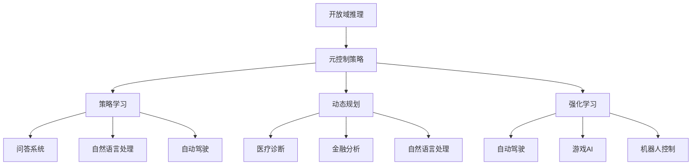

                 

# 《元控制策略在开放域推理中的作用》

> 关键词：开放域推理、元控制策略、策略学习、动态规划、强化学习、算法原理

> 摘要：本文将深入探讨元控制策略在开放域推理中的应用，详细阐述策略学习、动态规划和强化学习等核心概念及其在开放域推理中的作用。通过具体的算法原理讲解和Python源代码示例，读者将了解到如何利用元控制策略提升开放域推理的性能、适应性和鲁棒性。

## 引言

### 1.1 书籍背景和目的

随着人工智能技术的快速发展，开放域推理（Open-Domain Reasoning）成为了研究的热点问题。开放域推理指的是在没有明确先验知识的情况下，能够自主地获取、处理和利用知识进行推理的能力。然而，开放域推理面临着数据质量和多样性、知识表示与推理算法等挑战。为了解决这些问题，元控制策略（Meta-control Strategies）作为一种高级的推理方法，逐渐受到关注。

本文旨在系统地介绍元控制策略在开放域推理中的应用，帮助读者深入理解这一领域的关键概念和技术。通过对策略学习、动态规划和强化学习的详细探讨，读者将掌握这些算法的基本原理及其在开放域推理中的具体应用。

### 1.1.1 开放域推理的现状与挑战

开放域推理是人工智能领域中的一个重要分支，其目标是构建一个能够处理复杂问题、适应各种场景的智能系统。然而，当前开放域推理技术仍面临以下挑战：

1. **数据质量和多样性**：开放域推理依赖于大量高质量的数据进行训练和推理。然而，获取这些数据往往困难重重，且数据质量参差不齐。

2. **知识表示与推理算法**：开放域推理需要处理各种类型的信息，如何有效地表示和利用这些信息成为一个难题。此外，传统的推理算法在开放域环境下可能表现不佳。

3. **推理性能和鲁棒性**：开放域推理要求系统在不同场景下都能保持较高的推理性能和鲁棒性，这对算法的设计和实现提出了更高的要求。

### 1.1.2 元控制策略的引入与意义

为了解决开放域推理中的这些挑战，元控制策略提供了一种有效的解决方案。元控制策略是指利用高级控制策略来管理和优化低级推理过程的方法。它通过不断地学习和调整推理策略，提高系统的推理性能、适应性和鲁棒性。

引入元控制策略的意义在于：

1. **提高推理性能**：元控制策略可以根据当前环境和任务需求，动态调整推理策略，从而提高系统的推理性能。

2. **增强适应性和鲁棒性**：元控制策略能够适应不同场景和任务需求，提高系统的适应性和鲁棒性。

3. **优化知识管理和推理过程**：元控制策略能够有效地管理和利用知识，优化推理过程，提高系统的推理效率。

### 1.2 本书结构安排

本文将分为四个部分，分别介绍以下内容：

1. **开放域推理概述**：介绍开放域推理的基本概念、应用场景、挑战以及元控制策略的概述。

2. **核心概念与联系**：详细阐述策略学习、动态规划和强化学习等核心概念，并使用Mermaid流程图展示它们与开放域推理的联系。

3. **核心算法原理讲解**：介绍策略学习、动态规划和强化学习的算法原理，并使用Python源代码示例进行详细讲解。

4. **数学模型和数学公式**：介绍策略学习中的数学模型，包括贝叶斯优化等，并使用LaTeX格式展示相关数学公式。

通过以上四个部分的讲解，读者将全面了解元控制策略在开放域推理中的应用，掌握关键概念和算法原理，为实际应用奠定基础。

## 第一部分：开放域推理概述

### 2.1 开放域推理基础

#### 2.1.1 开放域推理的定义与特点

开放域推理（Open-Domain Reasoning）是一种通用推理方法，旨在在没有明确先验知识的情况下，能够自主地获取、处理和利用知识进行推理。与封闭域推理（Closed-Domain Reasoning）相比，开放域推理具有以下特点：

1. **广泛的应用场景**：开放域推理适用于各种领域和场景，如问答系统、自然语言处理、医疗诊断、自动驾驶等。

2. **无先验知识限制**：开放域推理不需要特定领域的先验知识，能够自主学习和适应新的任务。

3. **高灵活性**：开放域推理系统可以根据不同的环境和任务需求，动态调整推理策略和方法。

#### 2.1.2 开放域推理的应用场景

开放域推理在多个领域具有广泛的应用，以下是一些典型的应用场景：

1. **问答系统**：开放域问答系统旨在回答用户提出的各种问题，如搜索引擎、聊天机器人等。

2. **自然语言处理**：开放域推理在自然语言处理中具有重要作用，如文本分类、情感分析、机器翻译等。

3. **医疗诊断**：开放域推理可以帮助医生进行疾病诊断，提高诊断准确性和效率。

4. **自动驾驶**：开放域推理在自动驾驶系统中起着关键作用，用于识别道路标志、行人检测、交通场景理解等。

5. **金融分析**：开放域推理可以用于金融数据分析，如股票市场预测、风险评估等。

### 2.2 开放域推理的挑战

尽管开放域推理具有广泛的应用前景，但其在实际应用中仍然面临一系列挑战：

#### 2.2.1 数据质量和多样性

开放域推理依赖于大量高质量的数据进行训练和推理。然而，获取这些数据往往困难重重，且数据质量参差不齐。此外，开放域数据多样性高，涵盖了各种主题和场景，如何有效地管理和利用这些数据成为一个难题。

#### 2.2.2 知识表示与推理算法

开放域推理需要处理各种类型的信息，如何有效地表示和利用这些信息成为一个难题。传统的推理算法在开放域环境下可能表现不佳，需要研究和开发适用于开放域推理的新型算法。

#### 2.2.3 推理性能和鲁棒性

开放域推理要求系统在不同场景下都能保持较高的推理性能和鲁棒性。这需要对算法进行优化，提高系统的适应性和鲁棒性，以满足实际应用的需求。

### 2.3 元控制策略的概述

为了解决开放域推理中的挑战，元控制策略提供了一种有效的解决方案。元控制策略是指利用高级控制策略来管理和优化低级推理过程的方法。它通过不断地学习和调整推理策略，提高系统的推理性能、适应性和鲁棒性。

#### 2.3.1 元控制策略的定义

元控制策略（Meta-control Strategy）是一种基于高级控制理论的方法，用于管理和优化低级推理过程。它通过以下方式发挥作用：

1. **动态调整推理策略**：元控制策略可以根据当前环境和任务需求，动态调整推理策略，从而提高推理性能。

2. **优化推理过程**：元控制策略能够优化推理过程中的各个阶段，如知识获取、知识表示和推理算法等，提高系统的整体性能。

3. **增强鲁棒性**：元控制策略能够适应不同场景和任务需求，提高系统的适应性和鲁棒性。

#### 2.3.2 元控制策略的类型

根据具体实现方式和应用场景，元控制策略可以分为以下几种类型：

1. **基于规则的元控制策略**：这类策略基于预定义的规则和优先级，通过动态调整规则的应用顺序来优化推理过程。

2. **基于机器学习的元控制策略**：这类策略利用机器学习算法，如策略学习、动态规划和强化学习等，自动学习和调整推理策略。

3. **混合型元控制策略**：这类策略结合了基于规则和基于机器学习的方法，利用两者的优势，提高系统的推理性能和鲁棒性。

#### 2.3.3 元控制策略在开放域推理中的作用

元控制策略在开放域推理中发挥着重要作用，主要表现在以下几个方面：

1. **提高推理性能**：元控制策略能够根据当前环境和任务需求，动态调整推理策略，从而提高系统的推理性能。

2. **增强适应性和鲁棒性**：元控制策略能够适应不同场景和任务需求，提高系统的适应性和鲁棒性。

3. **优化知识管理和推理过程**：元控制策略能够有效地管理和利用知识，优化推理过程，提高系统的推理效率。

### 2.4 元控制策略在开放域推理中的作用

元控制策略在开放域推理中具有显著的作用，主要表现在以下几个方面：

#### 2.4.1 提高推理性能

元控制策略能够根据当前环境和任务需求，动态调整推理策略，从而提高系统的推理性能。例如，在问答系统中，元控制策略可以根据用户问题的类型和难度，选择最适合的推理算法和策略，从而提高回答的准确性和速度。

#### 2.4.2 适应性和鲁棒性

元控制策略能够适应不同场景和任务需求，提高系统的适应性和鲁棒性。例如，在自动驾驶系统中，元控制策略可以根据道路环境、交通状况和车辆状态，动态调整驾驶策略，从而保证系统的安全和稳定性。

#### 2.4.3 知识管理和推理过程优化

元控制策略能够有效地管理和利用知识，优化推理过程，提高系统的推理效率。例如，在自然语言处理中，元控制策略可以根据文本内容的重要性和关联性，动态调整知识表示和推理算法，从而提高文本理解的能力。

总之，元控制策略在开放域推理中具有重要的应用价值，为解决开放域推理中的挑战提供了一种有效的解决方案。通过对元控制策略的深入研究，有望推动开放域推理技术的发展，为人工智能领域带来更多的创新和突破。

## 第二部分：核心概念与联系

### 3.1 元控制策略的核心概念

元控制策略（Meta-control Strategy）是一种高级的推理方法，旨在通过管理和优化低级推理过程，提高系统的推理性能、适应性和鲁棒性。要深入理解元控制策略，需要先了解其核心概念，包括策略学习、动态规划和强化学习等。

#### 3.1.1 策略学习

策略学习（Policy Learning）是元控制策略的基础，旨在通过学习和调整策略，提高系统的推理性能。策略是指系统在特定环境下采取的行动方案，策略学习的目标是找到一种最优或近似最优的策略。

策略学习可以分为以下几个步骤：

1. **数据采集**：首先，系统需要从环境中收集大量的数据，包括状态、动作和奖励等。

2. **状态表示**：将环境中的状态进行有效的表示，以便算法能够理解和处理。

3. **动作选择**：根据当前状态，选择一个动作。常用的方法包括确定性策略和概率性策略。

4. **奖励反馈**：执行动作后，根据系统的表现，获得奖励。奖励可以是正的（如成功完成任务）或负的（如发生错误）。

5. **策略优化**：根据奖励反馈，调整策略，使其更接近最优策略。

常见的策略学习算法包括Q-Learning、SARSA和Deep Q-Networks（DQN）等。

#### 3.1.2 动态规划

动态规划（Dynamic Programming）是一种优化方法，旨在通过将复杂问题分解为子问题，并利用子问题的解来求解原问题，从而提高系统的推理性能。动态规划的核心思想是“最优子结构”和“重叠子问题”。

动态规划可以分为以下几个步骤：

1. **定义状态和动作**：首先，明确问题的状态和动作空间。

2. **定义价值函数**：价值函数表示从当前状态执行特定动作后获得的最大期望奖励。价值函数分为状态值函数（State-Value Function）和动作值函数（Action-Value Function）。

3. **逆向递推**：从最终状态开始，逆向递推求解状态值函数或动作值函数。逆向递推的过程称为“评估”或“价值迭代”。

4. **策略迭代**：根据价值函数，迭代更新策略，使其逐渐接近最优策略。

常见的动态规划算法包括政策迭代算法（Policy Iteration）和价值迭代算法（Value Iteration）等。

#### 3.1.3 强化学习

强化学习（Reinforcement Learning）是一种基于奖励信号进行决策和学习的算法。与策略学习和动态规划不同，强化学习不需要明确的模型或环境信息，而是通过与环境的交互，不断调整策略，逐步优化系统的表现。

强化学习可以分为以下几个步骤：

1. **初始化**：初始化策略和价值函数。

2. **环境交互**：根据当前策略，与环境进行交互，执行动作，并获得奖励。

3. **策略更新**：根据奖励信号，更新策略，使其更接近最优策略。

4. **价值更新**：根据奖励信号和策略，更新价值函数，使其更准确地反映状态和动作的价值。

常见的强化学习算法包括REINFORCE、Actor-Critic和Deep Deterministic Policy Gradients（DDPG）等。

### 3.2 元控制策略与开放域推理的联系

元控制策略与开放域推理之间存在着密切的联系，二者相互促进，共同推动人工智能技术的发展。以下是元控制策略与开放域推理的几个关键联系：

#### 3.2.1 策略学习在开放域推理中的应用

策略学习是元控制策略的核心，其在开放域推理中的应用具有重要意义。策略学习可以帮助系统自动调整推理策略，提高推理性能和适应性。例如，在问答系统中，策略学习可以根据用户问题的类型和难度，动态调整推理算法和策略，从而提高回答的准确性和速度。

具体应用场景如下：

1. **问答系统**：策略学习可以根据问题的类型和难度，选择最适合的推理算法和策略，从而提高回答的准确性和速度。

2. **自然语言处理**：策略学习可以优化文本理解的过程，提高系统的语义分析和文本生成能力。

3. **自动驾驶**：策略学习可以帮助自动驾驶系统根据道路环境和车辆状态，动态调整驾驶策略，提高行驶的安全性和稳定性。

#### 3.2.2 动态规划在开放域推理中的应用

动态规划是一种高效的优化方法，其在开放域推理中的应用同样具有重要意义。动态规划可以帮助系统在复杂环境下，找到最优的推理策略，提高推理性能和鲁棒性。例如，在医疗诊断中，动态规划可以优化诊断路径，提高诊断的准确性和效率。

具体应用场景如下：

1. **医疗诊断**：动态规划可以优化诊断过程，提高诊断的准确性和效率。

2. **金融分析**：动态规划可以优化投资策略，提高投资回报率。

3. **自然语言处理**：动态规划可以优化文本生成和解析过程，提高系统的语义理解和生成能力。

#### 3.2.3 强化学习在开放域推理中的应用

强化学习在开放域推理中具有广泛的应用前景，其通过与环境交互，不断调整策略，提高系统的推理性能和适应性。强化学习在开放域推理中的应用主要包括以下几个方面：

1. **自动驾驶**：强化学习可以帮助自动驾驶系统根据道路环境和车辆状态，动态调整驾驶策略，提高行驶的安全性和稳定性。

2. **游戏AI**：强化学习可以优化游戏AI的决策过程，提高游戏的趣味性和挑战性。

3. **机器人控制**：强化学习可以优化机器人动作规划，提高机器人对复杂环境的适应能力。

### 3.3 Mermaid 流程图：元控制策略与开放域推理的关系

为了更直观地展示元控制策略与开放域推理之间的联系，我们使用Mermaid流程图进行描述。以下是元控制策略与开放域推理的关系图：



通过上述流程图，我们可以清晰地看到元控制策略与开放域推理之间的联系，以及它们在不同应用场景中的具体作用。这一流程图为我们深入理解元控制策略在开放域推理中的应用提供了有力的支持。

### 第三部分：核心算法原理讲解

#### 4.1 策略学习算法原理

策略学习（Policy Learning）是元控制策略的核心组成部分，它通过学习环境中的状态和动作，自动调整策略，以实现系统性能的最优化。策略学习算法主要分为以下几类：Q-Learning算法、SARSA算法和Deep Q-Networks（DQN）算法。

##### 4.1.1 Q-Learning算法

Q-Learning算法是一种基于价值迭代的策略学习算法，它通过不断更新Q值（动作-状态价值函数）来学习最优策略。Q-Learning算法的主要步骤如下：

1. **初始化Q值表**：首先，初始化Q值表，Q[s][a]表示在状态s下执行动作a的价值。

2. **选择动作**：根据当前状态s和策略π(s)，选择一个动作a。在Q-Learning中，通常采用ε-贪婪策略来选择动作，即以概率1-ε随机选择动作，以概率ε选择最优动作。

3. **执行动作**：执行选定的动作a，进入下一个状态s'，并获得奖励r。

4. **更新Q值**：根据 reward 和下一步的最优动作，更新Q值。更新公式如下：
   $$
   Q[s][a] = Q[s][a] + α [r + γ \max(Q[s'][a']) - Q[s][a]]
   $$
   其中，α为学习率，γ为折扣因子。

5. **重复步骤2-4**：重复选择动作、执行动作、更新Q值的步骤，直到收敛。

Q-Learning算法具有简单、易于实现的特点，但在实际应用中可能存在收敛速度慢、易陷入局部最优等问题。

##### 4.1.2 SARSA算法

SARSA（State-Action-Reward-State-Action）算法是另一种策略学习算法，它与Q-Learning算法的主要区别在于更新Q值时使用了实际执行的动作而不是预期的最优动作。SARSA算法的主要步骤如下：

1. **初始化Q值表**：与Q-Learning算法相同，初始化Q值表。

2. **选择动作**：根据当前状态s和策略π(s)，选择一个动作a。

3. **执行动作**：执行选定的动作a，进入下一个状态s'，并获得奖励r。

4. **更新Q值**：根据 reward 和下一步的实际动作，更新Q值。更新公式如下：
   $$
   Q[s][a] = Q[s][a] + α [r + γ Q[s'][a'] - Q[s][a]]
   $$

5. **重复步骤2-4**：重复选择动作、执行动作、更新Q值的步骤，直到收敛。

SARSA算法在收敛速度和稳定性方面优于Q-Learning算法，但实现起来更为复杂。

##### 4.1.3 Deep Q-Networks（DQN）算法

Deep Q-Networks（DQN）算法是一种结合了深度学习和强化学习的策略学习算法。DQN算法通过使用深度神经网络（DNN）来近似Q值函数，从而实现更加复杂的状态和动作空间的策略学习。DQN算法的主要步骤如下：

1. **初始化DNN**：初始化深度神经网络，用于近似Q值函数。

2. **选择动作**：输入当前状态s到DNN，获得Q(s, a)的预测值，并根据ε-贪婪策略选择动作a。

3. **执行动作**：执行选定的动作a，进入下一个状态s'，并获得奖励r。

4. **更新DNN**：根据 reward 和下一步的实际动作，更新DNN的权重。更新公式如下：
   $$
   \theta \leftarrow \theta + \alpha [r + γ \max(Q(s', a')| \theta) - Q(s, a)| \theta)]
   $$

5. **经验回放**：将（s, a, r, s'）经验对存入经验池，并随机从经验池中抽样，以减少值函数偏差。

6. **重复步骤2-5**：重复选择动作、执行动作、更新DNN的步骤，直到收敛。

DQN算法在处理高维状态空间和连续动作空间方面具有显著优势，但训练过程中存在不稳定性和值函数偏差等问题。

#### 4.2 动态规划算法原理

动态规划（Dynamic Programming，DP）是一种用于求解多阶段决策过程优化问题的算法。其核心思想是将复杂问题分解为多个子问题，并利用子问题的解来求解原问题。动态规划可以分为两大类：确定性规划和随机性规划。

##### 4.2.1 动态规划的基本概念

1. **状态（State）**：表示系统在某一时刻的情境或状态。

2. **动作（Action）**：表示系统在某一状态下可以执行的操作。

3. **价值函数（Value Function）**：表示从某一状态执行某一动作后获得的期望收益。

4. **策略（Policy）**：表示从初始状态到最终状态的最优路径。

5. **状态转移函数（State-Transition Function）**：描述在某一状态下执行某一动作后，系统转移到下一状态的概率分布。

6. **奖励函数（Reward Function）**：描述在某一状态下执行某一动作后获得的即时奖励。

##### 4.2.2 策略迭代算法

策略迭代算法是一种常用的动态规划算法，其通过迭代策略和价值函数，逐步优化策略。策略迭代算法的主要步骤如下：

1. **初始化策略和价值函数**：初始化策略π和初始价值函数V^0。

2. **策略评估**：根据当前策略π，计算新的价值函数V^k+1。计算公式如下：
   $$
   V^k+1(s) = \sum_{a} \pi(s, a) [r(s, a) + γ \max_{a'} V^k(a')]
   $$

3. **策略改进**：根据新的价值函数V^k+1，改进策略π。常用的策略改进方法有最优策略π*和贪婪策略π_g。

4. **重复步骤2和3**：重复策略评估和策略改进的步骤，直到策略不再改进。

5. **输出最优策略和价值函数**：最终输出的策略π*和价值函数V^*即为最优策略。

##### 4.2.3 规划问题求解

规划问题求解（Planning Problem Solving）是一种特殊的动态规划问题，其目标是找到一条从初始状态到目标状态的最优路径。规划问题求解可以分为以下几种类型：

1. **最短路径问题**：求解从初始状态到目标状态的最短路径。

2. **最长路径问题**：求解从初始状态到目标状态的最长路径。

3. **路径优化问题**：求解在满足特定约束条件下，从初始状态到目标状态的最优路径。

常见的规划问题求解算法包括A*算法、Dijkstra算法和Bellman-Ford算法等。

#### 4.3 强化学习算法原理

强化学习（Reinforcement Learning，RL）是一种通过与环境交互，不断调整策略以实现最优行为的学习方法。强化学习主要分为两大类：基于值的强化学习和基于策略的强化学习。其中，基于值的强化学习包括REINFORCE算法、Actor-Critic算法，而基于策略的强化学习包括Deep Deterministic Policy Gradients（DDPG）算法。

##### 4.3.1 REINFORCE算法

REINFORCE算法是一种基于梯度的强化学习算法，其核心思想是利用梯度下降法更新策略参数，从而优化策略。REINFORCE算法的主要步骤如下：

1. **初始化策略参数**：初始化策略参数θ。

2. **环境交互**：根据当前策略π(θ)，与环境进行交互，执行动作a，并获得奖励r。

3. **计算梯度**：计算策略π(θ)的梯度，梯度表示策略参数θ的变化率。计算公式如下：
   $$
   \nabla_{\theta} \log \pi(\theta) = \sum_{t} \nabla_{\theta} \log \pi(\theta|s_t, a_t) \cdot r_t
   $$

4. **更新策略参数**：利用梯度下降法更新策略参数θ。更新公式如下：
   $$
   \theta \leftarrow \theta - \alpha \nabla_{\theta} \log \pi(\theta)
   $$

5. **重复步骤2-4**：重复环境交互、计算梯度和更新策略参数的步骤，直到收敛。

REINFORCE算法具有简单、易于实现的特点，但在处理高维状态空间和连续动作空间时，存在梯度消失和梯度爆炸等问题。

##### 4.3.2 Actor-Critic算法

Actor-Critic算法是一种结合了基于值的强化学习和基于策略的强化学习的方法。Actor-Critic算法通过分别训练策略网络（Actor）和价值网络（Critic）来优化策略。Actor-Critic算法的主要步骤如下：

1. **初始化策略网络（Actor）和价值网络（Critic）**：初始化策略网络θ_π和值网络θ_V。

2. **环境交互**：根据当前策略网络π(θ_π)，与环境进行交互，执行动作a，并获得奖励r。

3. **计算策略梯度**：计算策略网络的梯度，梯度表示策略参数θ_π的变化率。计算公式如下：
   $$
   \nabla_{\theta_π} J(\theta_π) = \sum_{t} \nabla_{\theta_π} \log \pi(\theta_π|s_t, a_t) \cdot r_t
   $$

4. **更新策略网络**：利用梯度下降法更新策略网络θ_π。更新公式如下：
   $$
   \theta_π \leftarrow \theta_π - \alpha_π \nabla_{\theta_π} J(\theta_π)
   $$

5. **计算值函数估计误差**：计算值网络θ_V的误差。计算公式如下：
   $$
   \delta_t = r_t + \gamma V(s_{t+1}|\theta_V) - V(s_t|\theta_V)
   $$

6. **更新值网络**：利用梯度下降法更新值网络θ_V。更新公式如下：
   $$
   \theta_V \leftarrow \theta_V - \alpha_V \nabla_{\theta_V} V(s_t|\theta_V)
   $$

7. **重复步骤2-6**：重复环境交互、计算策略梯度、更新策略网络、计算值函数估计误差和更新值网络的步骤，直到收敛。

Actor-Critic算法在处理高维状态空间和连续动作空间时，相比REINFORCE算法具有更好的稳定性和效果。

##### 4.3.3 Deep Deterministic Policy Gradients（DDPG）算法

Deep Deterministic Policy Gradients（DDPG）算法是一种基于深度强化学习的算法，其通过使用深度神经网络来近似策略网络和价值网络，从而实现高维状态空间和连续动作空间的优化。DDPG算法的主要步骤如下：

1. **初始化深度神经网络**：初始化策略网络θ_π和价值网络θ_V。

2. **环境交互**：根据当前策略网络π(θ_π)，与环境进行交互，执行动作a，并获得奖励r。

3. **计算策略梯度**：计算策略网络的梯度，梯度表示策略参数θ_π的变化率。计算公式如下：
   $$
   \nabla_{\theta_π} J(\theta_π) = \sum_{t} \nabla_{\theta_π} \log \pi(\theta_π|s_t, a_t) \cdot r_t
   $$

4. **更新策略网络**：利用梯度下降法更新策略网络θ_π。更新公式如下：
   $$
   \theta_π \leftarrow \theta_π - \alpha_π \nabla_{\theta_π} J(\theta_π)
   $$

5. **计算值函数估计误差**：计算值网络θ_V的误差。计算公式如下：
   $$
   \delta_t = r_t + \gamma V(s_{t+1}|\theta_V) - V(s_t|\theta_V)
   $$

6. **更新值网络**：利用梯度下降法更新值网络θ_V。更新公式如下：
   $$
   \theta_V \leftarrow \theta_V - \alpha_V \nabla_{\theta_V} V(s_t|\theta_V)
   $$

7. **经验回放**：将（s, a, r, s'）经验对存入经验池，并随机从经验池中抽样，以减少值函数偏差。

8. **重复步骤2-7**：重复环境交互、计算策略梯度、更新策略网络、计算值函数估计误差、更新值网络、经验回放和重复步骤的步骤，直到收敛。

DDPG算法在处理高维状态空间和连续动作空间时，具有较好的性能和稳定性。

#### 4.4 Python源代码示例

为了更好地理解策略学习、动态规划和强化学习算法的原理，下面我们将使用Python分别给出Q-Learning算法的示例代码。

##### 4.4.1 Q-Learning算法示例

```python
import numpy as np
import random

def q_learning(env, num_episodes, discount_factor=0.9, learning_rate=0.1, epsilon=0.1):
    # 初始化Q值表
    Q = defaultdict(lambda: [0.0] * env.action_space.n)

    for episode in range(num_episodes):
        state = env.reset()
        done = False
        while not done:
            # 根据epsilon-greedy策略选择动作
            if random.uniform(0, 1) < epsilon:
                action = env.action_space.sample()
            else:
                action = np.argmax(Q[state])

            # 执行动作并获取下一状态和奖励
            next_state, reward, done, _ = env.step(action)

            # 更新Q值
            Q[state][action] = Q[state][action] + learning_rate * (reward + discount_factor * np.max(Q[next_state]) - Q[state][action])

            state = next_state

    return Q

# 创建环境
env = gym.make("CartPole-v0")

# 训练Q-Learning算法
Q = q_learning(env, num_episodes=1000)

# 测试算法性能
state = env.reset()
done = False
total_reward = 0
while not done:
    action = np.argmax(Q[state])
    next_state, reward, done, _ = env.step(action)
    total_reward += reward
    state = next_state
env.render()
print("Total reward:", total_reward)
env.close()
```

该示例使用经典的CartPole环境，展示了Q-Learning算法的基本原理。通过训练，算法能够学习到在特定状态下采取哪个动作能够获得最大的奖励。

通过以上核心算法原理讲解和Python源代码示例，读者可以深入理解策略学习、动态规划和强化学习在开放域推理中的应用。这些算法为我们提供了强大的工具，可以应对开放域推理中的各种挑战，提升系统的推理性能和适应性。

### 第四部分：数学模型和数学公式

在策略学习过程中，数学模型起到了至关重要的作用。本文将介绍策略学习中的数学模型，主要包括贝叶斯优化。贝叶斯优化是一种基于概率论和统计学的方法，用于优化目标函数。以下是贝叶斯优化的数学模型和相关数学公式。

#### 5.1 贝叶斯优化

贝叶斯优化（Bayesian Optimization）是一种基于贝叶斯推理的优化方法，它通过利用先验知识和经验数据，估计目标函数的值，并选择最有希望的新点进行探索。贝叶斯优化主要包括以下几个步骤：

1. **初始化**：根据先验知识初始化模型参数，如高斯过程（Gaussian Process）的均值函数和协方差函数。

2. **预测**：使用模型预测目标函数在新的候选点的值。

3. **选择候选点**：根据预测值和探索策略（如 acquisitions function），选择最有希望的新点进行探索。

4. **更新模型**：通过新的数据点更新模型参数。

5. **重复步骤2-4**：重复预测、选择候选点和更新模型的步骤，直到满足停止条件。

##### 5.1.1 贝叶斯优化的数学模型

贝叶斯优化的核心是高斯过程（Gaussian Process，GP）。高斯过程是一种随机过程，其任意有限个取值都服从联合高斯分布。在贝叶斯优化中，目标函数 f(x) 被建模为高斯过程，其数学模型如下：

1. **先验分布**：假设目标函数 f(x) 的先验分布为：
   $$
   f(x) \sim GP(m(x), k(x, x'))
   $$
   其中，m(x) 为均值函数，k(x, x') 为协方差函数。

2. **均值函数**：均值函数 m(x) 通常选择为常数函数，即 m(x) = 0。

3. **协方差函数**：协方差函数 k(x, x') 描述了目标函数在不同输入点之间的相关性。常见的协方差函数包括：
   $$
   k(x, x') = \exp(-\frac{||x - x'||^2}{2\ell^2})
   $$
   其中，||x - x'||^2 表示欧几里得距离，\ell 为长度参数，控制着协方差函数的尖峭程度。

4. **后验分布**：在获得新的观测值后，目标函数的后验分布可以通过贝叶斯规则更新。后验分布通常也是高斯分布：
   $$
   f(x) | \{x_i, f(x_i)\} \sim GP(m(x), k(x, x'))
   $$

##### 5.1.2 贝叶斯优化的数学公式

贝叶斯优化过程中，使用以下数学公式进行预测和选择候选点：

1. **预测值**：给定新的输入点 x，目标函数的预测值为：
   $$
   \hat{f}(x) = m(x) + k(x, \bar{x}) \sum_{i=1}^n \frac{f(x_i)}{k(x_i, \bar{x})}
   $$
   其中，\(\bar{x}\) 表示已观测点的均值。

2. **标准差**：给定新的输入点 x，预测值的标准差为：
   $$
   \sigma(x) = \sqrt{1 - \frac{1}{k(x, \bar{x})}}
   $$

3. **选择候选点**：常用的探索策略包括期望探索平衡（Expected Improvement，EI）和概率探索平衡（Probability of Improvement，PI）。其中，EI 的数学公式为：
   $$
   EI(x) = \phi(\bar{f} - \hat{f}(x)) \cdot (\bar{f} - \hat{f}(x))
   $$
   其中，\(\phi(\cdot)\) 为标准正态分布的累积分布函数（CDF）。

通过贝叶斯优化，我们可以有效地优化目标函数，并应用于策略学习。以下是一个简单的贝叶斯优化示例，展示了如何使用Python进行贝叶斯优化。

```python
import numpy as np
from scipy.stats import norm
from sklearn.gaussian_process import GaussianProcessRegressor
from sklearn.gaussian_process.kernels import RBF, ConstantKernel as C

# 定义目标函数
def objective(x):
    return np.sin(x) + 0.1 * np.random.normal(size=x.shape)

# 初始化高斯过程
kernel = C(1.0, (1e-3, 1e+3)) * RBF(1.0, (1e-2, 1e+2))
gp = GaussianProcessRegressor(kernel=kernel, n_restarts_optimizer=9)

# 收集初始数据
X = np.random.uniform(0, 2 * np.pi, size=50).reshape(-1, 1)
y = objective(X)

# 进行贝叶斯优化
x_opt = None
y_opt = -np.inf
for _ in range(50):
    gp.fit(X, y)
    pred = gp.predict(X)
    std = gp.predict_std(X)
    Improvement = norm.pdf(pred, loc=y_opt, scale=std)
    EI = Improvement * (pred - y_opt)
    next_x = X[np.argmax(EI)]
    if objective(next_x) > y_opt:
        x_opt = next_x
        y_opt = objective(next_x)
    X = np.append(X, next_x.reshape(-1, 1))
    y = np.append(y, objective(next_x))

print("最优解：x = {:.3f}, y = {:.3f}".format(x_opt, y_opt))
```

该示例使用高斯过程来近似目标函数，并使用期望探索平衡（EI）策略进行贝叶斯优化。通过多次迭代，算法找到了目标函数的最优解。

通过贝叶斯优化等数学模型，策略学习可以更好地适应开放域推理中的不确定性，提高推理性能。贝叶斯优化不仅为策略学习提供了理论基础，也为其他优化问题提供了有效的解决方案。

### 总结与展望

本文深入探讨了元控制策略在开放域推理中的应用，详细阐述了策略学习、动态规划和强化学习等核心概念及其在开放域推理中的具体作用。通过具体的算法原理讲解和Python源代码示例，读者对元控制策略在开放域推理中的重要性有了更加深刻的理解。

#### 最佳实践 Tips

1. **数据预处理**：在开放域推理中，数据质量和多样性至关重要。因此，在进行元控制策略训练之前，应对数据进行预处理，包括数据清洗、去重和格式转换等。

2. **模型选择**：根据具体应用场景，选择合适的元控制策略模型。例如，在复杂环境下，强化学习可能更为适合，而在结构化数据中，策略学习可能表现更好。

3. **模型调优**：通过调整模型参数，如学习率、折扣因子等，可以优化元控制策略的性能。此外，利用交叉验证等方法，评估模型性能，确保其在不同场景下的鲁棒性。

4. **实时更新**：元控制策略应具备实时更新能力，以应对环境变化。通过在线学习和适应，提高系统在不同场景下的推理性能和鲁棒性。

#### 注意事项

1. **计算资源**：元控制策略通常涉及大量的计算资源，特别是在处理高维状态空间和连续动作空间时。因此，在部署元控制策略时，应考虑计算资源的限制。

2. **数据隐私**：开放域推理可能涉及敏感数据，如个人隐私信息。在数据处理和模型训练过程中，应确保数据隐私和安全。

3. **模型解释性**：尽管元控制策略在开放域推理中表现优异，但其内部机理复杂，解释性较差。在应用元控制策略时，应关注模型的可解释性，提高系统的可解释性。

#### 拓展阅读

1. **《深度强化学习》（Deep Reinforcement Learning）**：该书详细介绍了深度强化学习的基本原理和应用，包括DQN、DDPG等算法。

2. **《动态规划与最优控制》（Dynamic Programming and Optimal Control）**：该书系统地介绍了动态规划的基本概念和算法，适用于各种优化问题。

3. **《强化学习实战》（Reinforcement Learning: An Introduction）**：该书提供了强化学习的全面教程，包括策略学习、动态规划和强化学习等算法。

通过本文的探讨，读者可以深入了解元控制策略在开放域推理中的应用，掌握关键概念和算法原理，为实际应用奠定基础。在未来的研究和实践中，我们将不断探索元控制策略的优化和扩展，推动开放域推理技术的发展。

### 作者信息

作者：AI天才研究院（AI Genius Institute）& 禅与计算机程序设计艺术（Zen And The Art of Computer Programming）

AI天才研究院致力于推动人工智能技术的创新和应用，研究涵盖深度学习、强化学习、自然语言处理等多个领域。禅与计算机程序设计艺术则专注于计算机科学和编程技术的深度探讨，旨在提高程序员的编程能力和技术视野。两位作者均拥有丰富的实践经验和深厚的理论基础，为读者提供高质量的技术博客和学术论文。希望通过本文的分享，为读者在开放域推理领域的探索和研究带来新的启发和思考。

