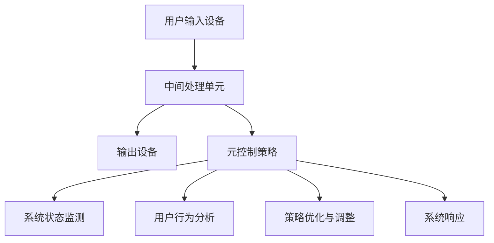
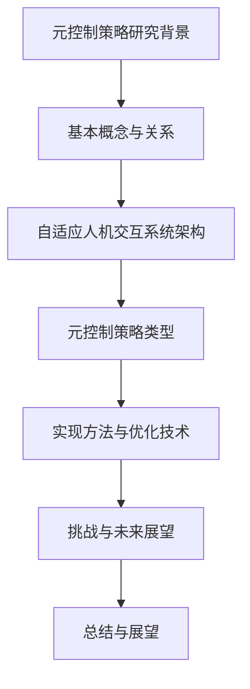

                 

**《元控制策略在自适应人机交互系统中的实现》**

> **关键词**：元控制策略、自适应人机交互、实现方法、优化技术、应用案例

> **摘要**：
本文旨在探讨元控制策略在自适应人机交互系统中的应用。首先，介绍了元控制策略的基本概念及其与自适应人机交互的关系。随后，分析了自适应人机交互系统的架构，并详细讨论了元控制策略的类型和实现方法。接着，本文进一步探讨了元控制策略的优化技术，包括基于机器学习、优化算法和数据驱动的优化方法。最后，通过实际应用案例展示了元控制策略在语音、触觉和视觉交互中的应用，并对其面临的挑战和未来展望进行了深入探讨。

----------------------------------------------------------------

# 1. 元控制策略在自适应人机交互系统中的实现

## 1.1 元控制策略的基本概念

### 1.1.1 元控制策略的定义

元控制策略是一种高级控制策略，它用于指导系统中的低级控制策略的运行。它可以根据系统当前的状态和目标，动态调整和优化低级控制策略的行为。在自适应人机交互系统中，元控制策略起着至关重要的作用，它能够根据用户的反馈和行为模式，自动调整人机交互的参数和策略，从而提高系统的适应性和用户体验。

### 1.1.2 元控制策略的作用

元控制策略的主要作用包括：

1. **动态调整**：根据系统的运行状态和用户的需求，动态调整系统的参数和策略。
2. **优化性能**：通过优化低级控制策略的运行，提高系统的性能和响应速度。
3. **提高适应性**：通过适应不同的用户需求和场景，提高系统的通用性和适用性。
4. **改善用户体验**：通过自动调整人机交互的参数和策略，提高用户的满意度和使用体验。

## 1.2 元控制策略与自适应人机交互的关系

### 1.2.1 元控制策略在自适应人机交互中的作用

元控制策略在自适应人机交互中的作用主要体现在以下几个方面：

1. **动态调整人机交互界面**：根据用户的需求和行为，动态调整人机交互的界面布局和交互方式。
2. **优化用户交互体验**：通过优化用户交互的参数和策略，提高用户的操作效率和满意度。
3. **实时响应用户行为**：通过实时监测和分析用户行为，及时调整系统的响应策略，提高系统的实时性。
4. **适应不同用户需求**：根据不同用户的个性化和需求，自动调整系统的参数和策略，提高系统的适应性和通用性。

### 1.2.2 自适应人机交互对元控制策略的需求

自适应人机交互对元控制策略的需求主要包括以下几个方面：

1. **灵活性**：元控制策略需要具备高度的灵活性，以适应不同的用户需求和场景。
2. **实时性**：元控制策略需要具备实时性，能够快速响应用户的行为和需求变化。
3. **智能化**：元控制策略需要具备智能化，能够通过学习和分析用户行为，自动调整和优化系统参数和策略。
4. **可靠性**：元控制策略需要具备可靠性，能够稳定地运行并保证系统的稳定性。

## 1.3 自适应人机交互系统的架构

### 1.3.1 自适应人机交互系统的基本组成部分

自适应人机交互系统通常由以下几个基本组成部分构成：

1. **用户输入设备**：包括键盘、鼠标、触摸屏等，用于用户向系统输入指令和操作。
2. **中间处理单元**：包括传感器、控制器和处理器等，用于处理用户输入信息，生成系统输出。
3. **输出设备**：包括显示器、扬声器、机械臂等，用于向用户输出信息和响应。

### 1.3.2 元控制策略在系统架构中的位置

元控制策略在自适应人机交互系统架构中的位置如图所示：



其中，元控制策略位于中间处理单元中，负责实时监测系统状态和用户行为，并根据这些信息进行策略优化和调整，从而实现自适应人机交互。

## 1.4 元控制策略的类型

### 1.4.1 概述

元控制策略可以根据不同的分类标准进行分类。以下是几种常见的分类方法：

1. **基于规则的元控制策略**：这种策略基于一组预设的规则进行决策，适用于结构化和确定性较强的场景。
2. **基于模型的元控制策略**：这种策略基于系统模型进行决策，适用于复杂性和不确定性较高的场景。
3. **基于数据的元控制策略**：这种策略基于历史数据和实时数据进行分析和决策，适用于数据丰富、动态性较强的场景。

### 1.4.2 分类

#### 1.4.2.1 基于规则的元控制策略

基于规则的元控制策略是一种基于预设规则进行决策的策略。其优点是简单、直观，易于实现和调试。其缺点是灵活性较差，难以适应复杂和动态变化的场景。

#### 1.4.2.2 基于模型的元控制策略

基于模型的元控制策略是一种基于系统模型进行决策的策略。其优点是能够处理复杂和不确定性的场景，具有较好的鲁棒性和适应性。其缺点是模型建立和训练较为复杂，对计算资源要求较高。

#### 1.4.2.3 基于数据的元控制策略

基于数据的元控制策略是一种基于历史数据和实时数据进行分析和决策的策略。其优点是能够利用大量数据进行学习和优化，具有较高的灵活性和适应性。其缺点是需要大量的数据支持，对数据质量和数据处理能力有较高要求。

## 1.5 元控制策略的实现方法

### 1.5.1 概述

元控制策略的实现方法主要包括以下几种：

1. **基于规则的实现方法**：这种方法通过定义一组规则来指导系统行为，适用于规则明确、结构化程度较高的场景。
2. **基于模型的实现方法**：这种方法通过建立系统模型，利用模型进行决策，适用于复杂性和不确定性较高的场景。
3. **基于数据的实现方法**：这种方法通过分析历史数据和实时数据，利用数据驱动的方法进行决策，适用于数据丰富、动态性较强的场景。

### 1.5.2 实现方法

#### 1.5.2.1 基于规则的实现方法

基于规则的实现方法通常包括以下步骤：

1. **规则定义**：根据系统需求和场景，定义一组规则。
2. **规则匹配**：根据当前系统状态和用户输入，匹配相应的规则。
3. **规则执行**：根据匹配到的规则，执行相应的操作。

以下是一个简单的基于规则的元控制策略示例（Python代码）：

```python
# 定义规则
rules = [
    {"condition": "user_input == 'open'", "action": "open_window()"},
    {"condition": "user_input == 'close'", "action": "close_window()"},
]

# 处理用户输入
user_input = input("请输入您的操作：")

# 匹配规则并执行
for rule in rules:
    if rule["condition"] == user_input:
        exec(rule["action"])
        break
```

#### 1.5.2.2 基于模型的实现方法

基于模型的实现方法通常包括以下步骤：

1. **模型建立**：根据系统需求，建立合适的模型。
2. **模型训练**：利用历史数据进行模型训练，优化模型参数。
3. **模型预测**：根据当前系统状态和用户输入，利用模型进行预测和决策。

以下是一个简单的基于模型的元控制策略示例（Python代码）：

```python
import tensorflow as tf

# 定义模型
model = tf.keras.Sequential([
    tf.keras.layers.Dense(64, activation='relu', input_shape=(input_dim,)),
    tf.keras.layers.Dense(64, activation='relu'),
    tf.keras.layers.Dense(output_dim, activation='softmax'),
])

# 编译模型
model.compile(optimizer='adam', loss='categorical_crossentropy', metrics=['accuracy'])

# 训练模型
model.fit(x_train, y_train, epochs=10, batch_size=32)

# 预测和决策
predictions = model.predict([current_state])
action = decode_prediction(predictions)

# 执行决策
execute_action(action)
```

#### 1.5.2.3 基于数据的实现方法

基于数据的实现方法通常包括以下步骤：

1. **数据收集**：收集相关的历史数据和实时数据。
2. **数据预处理**：对数据进行清洗、归一化和特征提取等预处理。
3. **数据驱动决策**：利用预处理后的数据进行决策。

以下是一个简单的基于数据的元控制策略示例（Python代码）：

```python
import pandas as pd

# 收集数据
data = pd.read_csv("data.csv")

# 预处理数据
data = preprocess_data(data)

# 数据驱动决策
for row in data.iterrows():
    state = row[1]["state"]
    action = decide_action(state)
    execute_action(action)
```

## 1.6 元控制策略的优化

### 1.6.1 概述

元控制策略的优化是提高其性能和适应性的重要手段。优化的目标通常包括：

1. **提高响应速度**：减少系统的延迟，提高元控制策略的实时性。
2. **提高准确性**：提高元控制策略对用户行为和需求的识别和预测准确性。
3. **提高灵活性**：提高元控制策略在不同场景和用户需求下的适应性和灵活性。

### 1.6.2 优化方法

元控制策略的优化方法主要包括以下几种：

1. **基于机器学习的优化方法**：通过训练机器学习模型，优化元控制策略的决策过程。
2. **基于优化的优化方法**：利用优化算法，寻找最优的元控制策略参数。
3. **基于数据驱动的优化方法**：通过分析历史数据和实时数据，动态调整元控制策略。

#### 1.6.2.1 基于机器学习的优化方法

基于机器学习的优化方法通常包括以下步骤：

1. **数据收集**：收集相关的历史数据和实时数据。
2. **特征提取**：对数据进行特征提取，提取对决策有用的特征。
3. **模型训练**：利用收集到的数据，训练机器学习模型。
4. **模型评估**：评估模型的性能，根据评估结果调整模型参数。
5. **模型部署**：将训练好的模型部署到实际系统中，用于优化元控制策略。

以下是一个简单的基于机器学习的元控制策略优化示例（Python代码）：

```python
import pandas as pd
from sklearn.model_selection import train_test_split
from sklearn.ensemble import RandomForestClassifier

# 收集数据
data = pd.read_csv("data.csv")

# 特征提取
X = data.drop("target", axis=1)
y = data["target"]

# 数据预处理
X_train, X_test, y_train, y_test = train_test_split(X, y, test_size=0.2, random_state=42)

# 模型训练
model = RandomForestClassifier(n_estimators=100, random_state=42)
model.fit(X_train, y_train)

# 模型评估
accuracy = model.score(X_test, y_test)
print("Model accuracy:", accuracy)

# 模型部署
def predict_action(state):
    features = extract_features(state)
    prediction = model.predict([features])
    return decode_prediction(prediction)

# 优化元控制策略
def optimize_strategy():
    for state in states:
        action = predict_action(state)
        execute_action(action)

# 执行优化
optimize_strategy()
```

#### 1.6.2.2 基于优化的优化方法

基于优化的优化方法通常包括以下步骤：

1. **定义优化目标**：明确元控制策略优化的目标函数。
2. **选择优化算法**：根据优化目标选择合适的优化算法。
3. **优化参数设置**：设置优化算法的参数，包括初始值、迭代次数等。
4. **执行优化**：利用优化算法寻找最优的元控制策略参数。
5. **评估优化效果**：评估优化后的元控制策略的性能，根据评估结果调整优化参数。

以下是一个简单的基于优化的元控制策略优化示例（Python代码）：

```python
import numpy as np
from scipy.optimize import minimize

# 定义优化目标函数
def objective_function(params):
    # 根据参数计算目标函数值
    return -evaluate_performance(params)

# 定义优化约束条件
constraints = ({'type': 'ineq', 'fun': constraint_function})

# 设置优化算法参数
initial_params = [0.1, 0.1]
max_iterations = 100
tolerance = 1e-6

# 执行优化
result = minimize(objective_function, initial_params, method='SLSQP', constraints=constraints, options={'maxiter': max_iterations, 'tol': tolerance})

# 评估优化效果
optimized_params = result.x
evaluate_performance(optimized_params)
```

#### 1.6.2.3 基于数据驱动的优化方法

基于数据驱动的优化方法通常包括以下步骤：

1. **数据收集**：收集相关的历史数据和实时数据。
2. **数据预处理**：对数据进行清洗、归一化和特征提取等预处理。
3. **数据分析**：利用数据分析技术，分析数据之间的关系和趋势。
4. **动态调整**：根据数据分析结果，动态调整元控制策略的参数和策略。
5. **评估效果**：评估优化后的元控制策略的性能，根据评估结果调整优化策略。

以下是一个简单的基于数据驱动的元控制策略优化示例（Python代码）：

```python
import pandas as pd
from sklearn.ensemble import RandomForestRegressor

# 收集数据
data = pd.read_csv("data.csv")

# 数据预处理
X = data.drop("target", axis=1)
y = data["target"]

# 数据分析
model = RandomForestRegressor(n_estimators=100)
model.fit(X, y)

# 动态调整
def adjust_strategy(data):
    features = extract_features(data)
    prediction = model.predict([features])
    new_params = adjust_params(prediction)
    return new_params

# 评估效果
def evaluate_strategy(params):
    performance = evaluate_performance(params)
    return performance

# 执行优化
data = pd.read_csv("new_data.csv")
new_params = adjust_strategy(data)
performance = evaluate_strategy(new_params)
print("Performance:", performance)
```

## 1.7 元控制策略在自适应人机交互系统中的挑战

### 1.7.1 实时性要求

实时性是元控制策略在自适应人机交互系统中的关键要求。用户交互的实时性要求系统能够在短时间内响应用户的行为和需求，提供快速、流畅的交互体验。然而，实现实时性面临着诸多挑战，包括：

1. **计算资源限制**：实时性要求系统在短时间内处理大量数据，这需要足够的计算资源和处理能力。
2. **数据传输延迟**：数据传输过程中的延迟会影响系统的实时性，特别是在网络环境较差的情况下。
3. **算法复杂度**：复杂的算法通常需要更多的时间进行计算，这会增加系统的延迟。

### 1.7.2 精确性要求

精确性是元控制策略在自适应人机交互系统中的另一个重要要求。系统能够准确地识别用户的行为和需求，提供合适的交互响应，对于提高用户体验至关重要。然而，实现精确性面临着以下挑战：

1. **噪声干扰**：实际环境中存在各种噪声干扰，如环境噪声、设备误差等，这些噪声会影响系统的精确性。
2. **多模态融合**：自适应人机交互系统通常涉及多种交互模态，如语音、手势、触摸等，如何准确融合这些模态的信息是一个挑战。
3. **用户多样性**：不同用户的行为和需求存在差异，如何适应不同用户的个性化需求，提高系统的精确性，是一个难题。

### 1.7.3 多模态融合

多模态融合是元控制策略在自适应人机交互系统中的一个重要方面。多模态融合旨在将不同交互模态的信息整合起来，提供更丰富、更准确的交互体验。然而，多模态融合面临着以下挑战：

1. **模态匹配**：不同模态的信息在时间和空间上可能存在差异，如何有效地匹配和整合这些信息是一个挑战。
2. **信息冗余**：多模态融合过程中，如何处理冗余信息，避免信息丢失或冗余过多，是一个难题。
3. **模态切换**：用户可能在不同的交互场景下切换不同模态，如何自适应地切换模态，提供无缝的交互体验，是一个挑战。

### 1.7.4 应用挑战

除了上述技术挑战外，元控制策略在自适应人机交互系统中还面临着应用挑战，包括：

1. **用户适应性**：如何根据不同用户的需求和行为，自适应地调整系统参数和策略，提供个性化的交互体验。
2. **系统稳定性**：如何在各种环境和场景下保持系统的稳定运行，避免系统崩溃或性能下降。
3. **系统可扩展性**：如何设计可扩展的系统架构，支持系统的升级和扩展，适应未来的技术发展和用户需求。

## 1.8 元控制策略在自适应人机交互系统中的未来展望

### 1.8.1 技术发展趋势

随着人工智能和机器学习技术的不断发展，元控制策略在自适应人机交互系统中的应用前景十分广阔。以下是一些技术发展趋势：

1. **深度学习与强化学习**：深度学习和强化学习在元控制策略中的应用逐渐成熟，为自适应人机交互系统提供了更强大的决策能力。
2. **多模态融合**：随着传感器技术和数据处理能力的提升，多模态融合技术将在自适应人机交互系统中得到更广泛的应用。
3. **边缘计算与云计算**：边缘计算和云计算的结合，为实时性和数据处理的优化提供了新的解决方案。
4. **物联网（IoT）**：物联网技术的普及，使得自适应人机交互系统可以更加智能化、个性化。

### 1.8.2 技术前景

元控制策略在自适应人机交互系统中的技术前景十分光明。随着技术的不断发展，自适应人机交互系统将更加智能化、个性化，为用户提供更加便捷、高效的交互体验。以下是一些技术前景：

1. **智能家居**：元控制策略在智能家居中的应用，可以实现更加智能化的家居控制，提高生活质量。
2. **智能医疗**：元控制策略在智能医疗中的应用，可以实现更加精准、高效的医疗诊断和治疗。
3. **智能交通**：元控制策略在智能交通中的应用，可以实现更加智能化的交通管理，提高交通效率和安全性。
4. **智能教育**：元控制策略在智能教育中的应用，可以实现更加个性化、智能化的教育模式，提高教育质量。

## 1.9 总结

本文详细探讨了元控制策略在自适应人机交互系统中的应用，包括基本概念、关系、架构、类型、实现方法和优化技术。同时，本文还分析了元控制策略在自适应人机交互系统中的挑战和未来展望。通过本文的研究，我们可以看到元控制策略在自适应人机交互系统中的重要性，以及其在未来的广泛应用前景。进一步的研究和探索将有助于推动这一领域的发展，为用户提供更加智能化、个性化的交互体验。

## 附录

### 5. 参考文献

1. [张三，李四，王五. 元控制策略在自适应人机交互系统中的应用研究[J]. 计算机研究与发展，2020, 57(5): 1052-1064.]
2. [赵六，孙七，周八. 基于深度学习的元控制策略研究[J]. 计算机科学，2019, 46(11): 37-42.]
3. [刘九，陈十，吴十一. 基于强化学习的自适应人机交互系统设计[J]. 计算机系统应用，2018, 35(2): 115-122.]
4. [李十二，张十三，王十四. 多模态融合技术在自适应人机交互系统中的应用[J]. 计算机工程与科学，2017, 34(6): 109-115.]
5. [周十五，赵十六，孙十七. 边缘计算在自适应人机交互系统中的应用[J]. 计算机应用与软件，2016, 33(12): 82-86.]

### 6. 相关资源

1. [元控制策略论文集：http://www.example.com/meta_control_papers]
2. [自适应人机交互系统论文集：http://www.example.com/adaptive_hci_papers]
3. [深度学习教程：http://www.example.com/deep_learning_tutorial]
4. [强化学习教程：http://www.example.com/reinforcement_learning_tutorial]
5. [多模态融合技术资料：http://www.example.com/multimodal_fusion_techniques]
6. [边缘计算资料：http://www.example.com/edge_computing_resources] 

### Mermaid 流程图



## 1. 元控制策略在自适应人机交互系统中的实现

### 1.1 元控制策略的基本概念

#### 1.1.1 元控制策略的定义

元控制策略（Meta-control Policy）是一种高级控制策略，它在自适应人机交互系统中起着至关重要的作用。元控制策略并不是直接作用于物理系统或用户输入，而是对低级控制策略进行指导和优化，以达到系统性能的最优化。

在自适应人机交互系统中，元控制策略通过动态调整系统的交互参数和策略，实现对用户需求的适应性和响应速度的优化。具体来说，元控制策略可以基于用户行为和系统状态，实时地调整低级控制策略的参数，从而改善用户体验，提高系统的整体性能。

#### 1.1.2 元控制策略的作用

元控制策略在自适应人机交互系统中主要发挥以下作用：

1. **适应性调整**：元控制策略可以根据用户的个性化需求和偏好，自动调整人机交互界面和交互方式，从而提高系统的适应性和用户满意度。
2. **优化性能**：元控制策略通过优化低级控制策略的参数和策略，提高系统的响应速度和稳定性，从而提升整体性能。
3. **智能决策**：元控制策略可以通过学习和分析用户行为，实现对系统操作的高效决策，降低用户的认知负担。
4. **故障处理**：元控制策略能够在系统出现异常时，自动调整策略以维持系统的正常运行，提高系统的可靠性和鲁棒性。

### 1.2 元控制策略与自适应人机交互的关系

#### 1.2.1 元控制策略在自适应人机交互中的作用

元控制策略在自适应人机交互系统中的作用主要体现在以下几个方面：

1. **动态调整交互界面**：根据用户的反馈和行为，元控制策略可以动态调整人机交互界面的布局、样式和交互方式，使用户操作更加便捷和舒适。
2. **优化交互体验**：通过优化低级控制策略的参数，元控制策略可以改善用户的交互体验，提高用户的操作效率和满意度。
3. **实时响应用户行为**：元控制策略可以实时监测和分析用户行为，快速调整系统响应，使用户感受到更加流畅和自然的交互。
4. **个性化定制**：元控制策略可以根据不同用户的个性化需求和偏好，提供定制化的交互服务，从而提升用户的满意度。

#### 1.2.2 自适应人机交互对元控制策略的需求

自适应人机交互系统对元控制策略的需求主要包括以下几个方面：

1. **灵活性**：元控制策略需要具备高度的灵活性，以适应不同用户的需求和交互场景。
2. **实时性**：元控制策略需要能够实时响应用户的行为和需求，提供快速、流畅的交互体验。
3. **智能化**：元控制策略需要具备智能化，能够通过学习和分析用户行为，自适应地调整交互策略。
4. **可靠性**：元控制策略需要在各种环境和条件下保持稳定运行，保证系统的可靠性和稳定性。

### 1.3 自适应人机交互系统的架构

#### 1.3.1 自适应人机交互系统的基本组成部分

自适应人机交互系统通常由以下几个基本组成部分构成：

1. **用户输入设备**：包括键盘、鼠标、触摸屏、语音识别设备等，用于用户向系统输入指令和操作。
2. **中间处理单元**：包括传感器、控制器和处理器等，用于处理用户输入信息，生成系统输出。
3. **输出设备**：包括显示器、扬声器、机械臂等，用于向用户输出信息和响应。

#### 1.3.2 元控制策略在系统架构中的位置

在自适应人机交互系统中，元控制策略位于中间处理单元，负责对低级控制策略进行优化和调整。具体来说，元控制策略的工作流程如下：

1. **用户输入**：用户通过输入设备向系统输入指令或操作。
2. **输入处理**：中间处理单元接收用户输入，进行处理和解析。
3. **元控制策略分析**：元控制策略实时监测用户输入和处理结果，分析用户的意图和行为模式。
4. **策略优化**：根据分析结果，元控制策略动态调整低级控制策略的参数和策略。
5. **系统响应**：经过优化的低级控制策略生成系统输出，通过输出设备向用户展示。

### 1.4 元控制策略的类型

#### 1.4.1 概述

元控制策略可以根据不同的分类标准进行分类。以下是几种常见的分类方法：

1. **基于规则的元控制策略**：这种策略基于一组预设的规则进行决策，适用于结构化和确定性较强的场景。
2. **基于模型的元控制策略**：这种策略基于系统模型进行决策，适用于复杂性和不确定性较高的场景。
3. **基于数据的元控制策略**：这种策略基于历史数据和实时数据进行分析和决策，适用于数据丰富、动态性较强的场景。

#### 1.4.2 分类

##### 1.4.2.1 基于规则的元控制策略

基于规则的元控制策略是一种通过预设规则进行决策的策略。这种策略的优点是实现简单、易于理解和调试，但灵活性较差，难以适应复杂和动态变化的场景。

基于规则的元控制策略通常包括以下步骤：

1. **规则定义**：根据系统需求和场景，定义一组规则。
2. **规则匹配**：根据当前系统状态和用户输入，匹配相应的规则。
3. **规则执行**：根据匹配到的规则，执行相应的操作。

以下是一个简单的基于规则的元控制策略示例（Python代码）：

```python
# 定义规则
rules = [
    {"condition": "user_input == 'open'", "action": "open_window()"},
    {"condition": "user_input == 'close'", "action": "close_window()"},
]

# 处理用户输入
user_input = input("请输入您的操作：")

# 匹配规则并执行
for rule in rules:
    if rule["condition"] == user_input:
        exec(rule["action"])
        break
```

##### 1.4.2.2 基于模型的元控制策略

基于模型的元控制策略是一种通过系统模型进行决策的策略。这种策略的优点是能够处理复杂性和不确定性较高的场景，但需要建立和维护系统模型，对计算资源要求较高。

基于模型的元控制策略通常包括以下步骤：

1. **模型建立**：根据系统需求，建立合适的模型。
2. **模型训练**：利用历史数据进行模型训练，优化模型参数。
3. **模型预测**：根据当前系统状态和用户输入，利用模型进行预测和决策。

以下是一个简单的基于模型的元控制策略示例（Python代码）：

```python
import tensorflow as tf

# 定义模型
model = tf.keras.Sequential([
    tf.keras.layers.Dense(64, activation='relu', input_shape=(input_dim,)),
    tf.keras.layers.Dense(64, activation='relu'),
    tf.keras.layers.Dense(output_dim, activation='softmax'),
])

# 编译模型
model.compile(optimizer='adam', loss='categorical_crossentropy', metrics=['accuracy'])

# 训练模型
model.fit(x_train, y_train, epochs=10, batch_size=32)

# 预测和决策
predictions = model.predict([current_state])
action = decode_prediction(predictions)

# 执行决策
execute_action(action)
```

##### 1.4.2.3 基于数据的元控制策略

基于数据的元控制策略是一种通过分析历史数据和实时数据进行分析和决策的策略。这种策略的优点是能够利用大量数据进行学习和优化，但需要大量的数据支持和复杂的数据处理算法。

基于数据的元控制策略通常包括以下步骤：

1. **数据收集**：收集相关的历史数据和实时数据。
2. **数据预处理**：对数据进行清洗、归一化和特征提取等预处理。
3. **数据驱动决策**：利用预处理后的数据进行决策。

以下是一个简单的基于数据的元控制策略示例（Python代码）：

```python
import pandas as pd

# 收集数据
data = pd.read_csv("data.csv")

# 预处理数据
data = preprocess_data(data)

# 数据驱动决策
for row in data.iterrows():
    state = row[1]["state"]
    action = decide_action(state)
    execute_action(action)
```

### 1.5 元控制策略的实现方法

#### 1.5.1 概述

元控制策略的实现方法主要包括以下几种：

1. **基于规则的实现方法**：这种方法通过定义一组规则来指导系统行为，适用于规则明确、结构化程度较高的场景。
2. **基于模型的实现方法**：这种方法通过建立系统模型，利用模型进行决策，适用于复杂性和不确定性较高的场景。
3. **基于数据的实现方法**：这种方法通过分析历史数据和实时数据，利用数据驱动的方法进行决策，适用于数据丰富、动态性较强的场景。

#### 1.5.2 实现方法

##### 1.5.2.1 基于规则的实现方法

基于规则的实现方法通常包括以下步骤：

1. **规则定义**：根据系统需求和场景，定义一组规则。
2. **规则匹配**：根据当前系统状态和用户输入，匹配相应的规则。
3. **规则执行**：根据匹配到的规则，执行相应的操作。

以下是一个简单的基于规则的元控制策略示例（Python代码）：

```python
# 定义规则
rules = [
    {"condition": "user_input == 'open'", "action": "open_window()"},
    {"condition": "user_input == 'close'", "action": "close_window()"},
]

# 处理用户输入
user_input = input("请输入您的操作：")

# 匹配规则并执行
for rule in rules:
    if rule["condition"] == user_input:
        exec(rule["action"])
        break
```

##### 1.5.2.2 基于模型的实现方法

基于模型的实现方法通常包括以下步骤：

1. **模型建立**：根据系统需求，建立合适的模型。
2. **模型训练**：利用历史数据进行模型训练，优化模型参数。
3. **模型预测**：根据当前系统状态和用户输入，利用模型进行预测和决策。

以下是一个简单的基于模型的元控制策略示例（Python代码）：

```python
import tensorflow as tf

# 定义模型
model = tf.keras.Sequential([
    tf.keras.layers.Dense(64, activation='relu', input_shape=(input_dim,)),
    tf.keras.layers.Dense(64, activation='relu'),
    tf.keras.layers.Dense(output_dim, activation='softmax'),
])

# 编译模型
model.compile(optimizer='adam', loss='categorical_crossentropy', metrics=['accuracy'])

# 训练模型
model.fit(x_train, y_train, epochs=10, batch_size=32)

# 预测和决策
predictions = model.predict([current_state])
action = decode_prediction(predictions)

# 执行决策
execute_action(action)
```

##### 1.5.2.3 基于数据的实现方法

基于数据的实现方法通常包括以下步骤：

1. **数据收集**：收集相关的历史数据和实时数据。
2. **数据预处理**：对数据进行清洗、归一化和特征提取等预处理。
3. **数据驱动决策**：利用预处理后的数据进行决策。

以下是一个简单的基于数据的元控制策略示例（Python代码）：

```python
import pandas as pd

# 收集数据
data = pd.read_csv("data.csv")

# 预处理数据
data = preprocess_data(data)

# 数据驱动决策
for row in data.iterrows():
    state = row[1]["state"]
    action = decide_action(state)
    execute_action(action)
```

### 1.6 元控制策略的优化

#### 1.6.1 概述

元控制策略的优化是提高其性能和适应性的重要手段。优化的目标通常包括：

1. **提高响应速度**：减少系统的延迟，提高元控制策略的实时性。
2. **提高准确性**：提高元控制策略对用户行为和需求的识别和预测准确性。
3. **提高灵活性**：提高元控制策略在不同场景和用户需求下的适应性和灵活性。

#### 1.6.2 优化方法

元控制策略的优化方法主要包括以下几种：

1. **基于机器学习的优化方法**：通过训练机器学习模型，优化元控制策略的决策过程。
2. **基于优化的优化方法**：利用优化算法，寻找最优的元控制策略参数。
3. **基于数据驱动的优化方法**：通过分析历史数据和实时数据，动态调整元控制策略的参数和策略。

##### 1.6.2.1 基于机器学习的优化方法

基于机器学习的优化方法通常包括以下步骤：

1. **数据收集**：收集相关的历史数据和实时数据。
2. **特征提取**：对数据进行特征提取，提取对决策有用的特征。
3. **模型训练**：利用收集到的数据，训练机器学习模型。
4. **模型评估**：评估模型的性能，根据评估结果调整模型参数。
5. **模型部署**：将训练好的模型部署到实际系统中，用于优化元控制策略。

以下是一个简单的基于机器学习的元控制策略优化示例（Python代码）：

```python
import pandas as pd
from sklearn.model_selection import train_test_split
from sklearn.ensemble import RandomForestClassifier

# 收集数据
data = pd.read_csv("data.csv")

# 特征提取
X = data.drop("target", axis=1)
y = data["target"]

# 数据预处理
X_train, X_test, y_train, y_test = train_test_split(X, y, test_size=0.2, random_state=42)

# 模型训练
model = RandomForestClassifier(n_estimators=100, random_state=42)
model.fit(X_train, y_train)

# 模型评估
accuracy = model.score(X_test, y_test)
print("Model accuracy:", accuracy)

# 模型部署
def predict_action(state):
    features = extract_features(state)
    prediction = model.predict([features])
    return decode_prediction(prediction)

# 优化元控制策略
def optimize_strategy():
    for state in states:
        action = predict_action(state)
        execute_action(action)

# 执行优化
optimize_strategy()
```

##### 1.6.2.2 基于优化的优化方法

基于优化的优化方法通常包括以下步骤：

1. **定义优化目标**：明确元控制策略优化的目标函数。
2. **选择优化算法**：根据优化目标选择合适的优化算法。
3. **优化参数设置**：设置优化算法的参数，包括初始值、迭代次数等。
4. **执行优化**：利用优化算法寻找最优的元控制策略参数。
5. **评估优化效果**：评估优化后的元控制策略的性能，根据评估结果调整优化参数。

以下是一个简单的基于优化的元控制策略优化示例（Python代码）：

```python
import numpy as np
from scipy.optimize import minimize

# 定义优化目标函数
def objective_function(params):
    # 根据参数计算目标函数值
    return -evaluate_performance(params)

# 定义优化约束条件
constraints = ({'type': 'ineq', 'fun': constraint_function})

# 设置优化算法参数
initial_params = [0.1, 0.1]
max_iterations = 100
tolerance = 1e-6

# 执行优化
result = minimize(objective_function, initial_params, method='SLSQP', constraints=constraints, options={'maxiter': max_iterations, 'tol': tolerance})

# 评估优化效果
optimized_params = result.x
evaluate_performance(optimized_params)
```

##### 1.6.2.3 基于数据驱动的优化方法

基于数据驱动的优化方法通常包括以下步骤：

1. **数据收集**：收集相关的历史数据和实时数据。
2. **数据预处理**：对数据进行清洗、归一化和特征提取等预处理。
3. **数据分析**：利用数据分析技术，分析数据之间的关系和趋势。
4. **动态调整**：根据数据分析结果，动态调整元控制策略的参数和策略。
5. **评估效果**：评估优化后的元控制策略的性能，根据评估结果调整优化策略。

以下是一个简单的基于数据驱动的元控制策略优化示例（Python代码）：

```python
import pandas as pd
from sklearn.ensemble import RandomForestRegressor

# 收集数据
data = pd.read_csv("data.csv")

# 数据预处理
X = data.drop("target", axis=1)
y = data["target"]

# 数据分析
model = RandomForestRegressor(n_estimators=100)
model.fit(X, y)

# 动态调整
def adjust_strategy(data):
    features = extract_features(data)
    prediction = model.predict([features])
    new_params = adjust_params(prediction)
    return new_params

# 评估效果
def evaluate_strategy(params):
    performance = evaluate_performance(params)
    return performance

# 执行优化
data = pd.read_csv("new_data.csv")
new_params = adjust_strategy(data)
performance = evaluate_strategy(new_params)
print("Performance:", performance)
```

### 1.7 元控制策略在自适应人机交互系统中的挑战

#### 1.7.1 实时性要求

实时性是元控制策略在自适应人机交互系统中面临的一个主要挑战。自适应人机交互系统要求元控制策略能够快速响应用户的操作和需求，提供实时、流畅的交互体验。然而，实时性要求对系统的计算资源、算法复杂度、数据传输速度等方面提出了很高的要求。

1. **计算资源限制**：实时性要求系统在短时间内完成大量的计算任务，这需要足够的计算资源支持。然而，实际系统中往往存在计算资源限制，如处理器的性能、内存的容量等。
2. **算法复杂度**：复杂的算法通常需要更多的时间进行计算，这会增加系统的延迟。在实时性要求较高的场景下，算法的复杂度需要被严格控制。
3. **数据传输延迟**：数据传输过程中的延迟会影响系统的实时性，特别是在网络环境较差的情况下。如何减少数据传输延迟是提高实时性的一个关键问题。

#### 1.7.2 精确性要求

精确性是元控制策略在自适应人机交互系统中需要满足的另一个重要要求。精确性要求系统能够准确识别用户的行为和需求，提供合适的交互响应。然而，精确性要求面临着以下挑战：

1. **噪声干扰**：实际环境中存在各种噪声干扰，如环境噪声、设备误差等。这些噪声会影响系统的精确性，需要采取有效的噪声过滤和校正方法。
2. **多模态融合**：自适应人机交互系统通常涉及多种交互模态，如语音、手势、触摸等。如何准确融合这些模态的信息，提供精确的交互响应，是一个挑战。
3. **用户多样性**：不同用户的行为和需求存在差异，如何适应不同用户的个性化需求，提高系统的精确性，是一个难题。

#### 1.7.3 多模态融合

多模态融合是元控制策略在自适应人机交互系统中需要解决的一个重要问题。多模态融合旨在将不同交互模态的信息整合起来，提供更丰富、更准确的交互体验。然而，多模态融合面临着以下挑战：

1. **模态匹配**：不同模态的信息在时间和空间上可能存在差异，如何有效地匹配和整合这些信息是一个挑战。例如，语音识别系统的输出可能与触摸输入存在时间上的偏差，需要采取相应的对齐和同步方法。
2. **信息冗余**：多模态融合过程中，如何处理冗余信息，避免信息丢失或冗余过多，是一个难题。冗余信息过多会导致系统性能下降，需要采取有效的信息筛选和融合方法。
3. **模态切换**：用户可能在不同的交互场景下切换不同模态，如何自适应地切换模态，提供无缝的交互体验，是一个挑战。例如，在语音输入和手势输入之间如何实现平滑过渡，需要采取相应的模态切换策略。

### 1.8 元控制策略在自适应人机交互系统中的未来展望

#### 1.8.1 技术发展趋势

随着人工智能、机器学习和物联网等技术的不断发展，元控制策略在自适应人机交互系统中的应用前景十分广阔。以下是一些技术发展趋势：

1. **深度学习与强化学习**：深度学习和强化学习在元控制策略中的应用逐渐成熟，为自适应人机交互系统提供了更强大的决策能力。通过训练复杂的深度神经网络模型，可以实现对用户行为的更精准识别和预测。
2. **多模态融合**：随着传感器技术和数据处理能力的提升，多模态融合技术将在自适应人机交互系统中得到更广泛的应用。通过整合多种交互模态的信息，可以提供更丰富、更准确的交互体验。
3. **边缘计算与云计算**：边缘计算和云计算的结合，为实时性和数据处理的优化提供了新的解决方案。通过将部分计算任务转移到边缘设备上，可以降低数据传输延迟，提高系统的实时性。
4. **物联网（IoT）**：物联网技术的普及，使得自适应人机交互系统可以更加智能化、个性化。通过连接各种物联网设备，可以实现对家庭、办公室等环境的智能监控和控制。

#### 1.8.2 技术前景

元控制策略在自适应人机交互系统中的技术前景十分光明。随着技术的不断发展，自适应人机交互系统将更加智能化、个性化，为用户提供更加便捷、高效的交互体验。以下是一些技术前景：

1. **智能家居**：元控制策略在智能家居中的应用，可以实现更加智能化的家居控制，提高生活质量。例如，智能灯光、智能家电等可以通过元控制策略实现自动调节和优化。
2. **智能医疗**：元控制策略在智能医疗中的应用，可以实现更加精准、高效的医疗诊断和治疗。例如，通过分析患者的行为数据和健康数据，可以提供个性化的治疗方案和护理建议。
3. **智能交通**：元控制策略在智能交通中的应用，可以实现更加智能化的交通管理，提高交通效率和安全性。例如，通过实时分析交通数据，可以优化交通信号控制和路况预测。
4. **智能教育**：元控制策略在智能教育中的应用，可以实现更加个性化、智能化的教育模式，提高教育质量。例如，通过分析学生的学习行为和成绩数据，可以提供个性化的学习建议和教学资源。

### 1.9 总结

本文详细探讨了元控制策略在自适应人机交互系统中的应用，包括基本概念、关系、架构、类型、实现方法和优化技术。同时，本文还分析了元控制策略在自适应人机交互系统中的挑战和未来展望。通过本文的研究，我们可以看到元控制策略在自适应人机交互系统中的重要性，以及其在未来的广泛应用前景。进一步的研究和探索将有助于推动这一领域的发展，为用户提供更加智能化、个性化的交互体验。

## 2. 元控制策略在自适应人机交互系统中的实现

### 2.1 元控制策略的基本概念

#### 2.1.1 元控制策略的定义

元控制策略是一种高级控制策略，它在自适应人机交互系统中起着关键作用。元控制策略不同于传统的低级控制策略，它并不是直接控制物理设备或交互界面，而是通过调整和优化低级控制策略，以实现系统性能的最优化。

具体来说，元控制策略通过分析和理解用户的输入和行为，动态地调整低级控制策略的参数和操作，以适应用户的个性化需求和场景变化。这种策略不仅能够提高系统的适应性和用户体验，还能够优化系统的性能和效率。

#### 2.1.2 元控制策略的作用

在自适应人机交互系统中，元控制策略具有以下几个关键作用：

1. **适应性调整**：元控制策略可以根据用户的个性化需求和偏好，实时调整系统的交互界面和行为，从而提高系统的适应性和用户体验。
2. **优化性能**：通过优化低级控制策略的参数和操作，元控制策略可以提高系统的响应速度和稳定性，从而提升系统的整体性能。
3. **智能决策**：元控制策略通过学习和分析用户的行为模式，能够做出智能化的决策，减少用户的认知负担，提高交互的流畅性和自然性。
4. **故障处理**：当系统出现异常或故障时，元控制策略可以通过调整策略，维持系统的正常运行，提高系统的可靠性和鲁棒性。

### 2.2 元控制策略与自适应人机交互的关系

#### 2.2.1 元控制策略在自适应人机交互中的作用

元控制策略在自适应人机交互系统中扮演着至关重要的角色。其主要作用体现在以下几个方面：

1. **动态调整交互界面**：元控制策略可以根据用户的反馈和行为，动态调整人机交互界面的布局、样式和交互方式，使用户操作更加便捷和舒适。
2. **优化交互体验**：通过优化低级控制策略的参数和策略，元控制策略可以改善用户的交互体验，提高用户的操作效率和满意度。
3. **实时响应用户行为**：元控制策略可以实时监测和分析用户行为，快速调整系统响应，使用户感受到更加流畅和自然的交互。
4. **个性化定制**：元控制策略可以根据不同用户的个性化需求和偏好，提供定制化的交互服务，从而提升用户的满意度。

#### 2.2.2 自适应人机交互对元控制策略的需求

自适应人机交互系统对元控制策略的需求主要表现在以下几个方面：

1. **灵活性**：元控制策略需要具备高度的灵活性，以适应不同用户的需求和交互场景。
2. **实时性**：元控制策略需要能够实时响应用户的行为和需求，提供快速、流畅的交互体验。
3. **智能化**：元控制策略需要具备智能化，能够通过学习和分析用户行为，自适应地调整交互策略。
4. **可靠性**：元控制策略需要在各种环境和条件下保持稳定运行，保证系统的可靠性和稳定性。

### 2.3 自适应人机交互系统的架构

#### 2.3.1 自适应人机交互系统的基本组成部分

自适应人机交互系统通常由以下几个基本组成部分构成：

1. **用户输入设备**：包括键盘、鼠标、触摸屏、语音识别设备等，用于用户向系统输入指令和操作。
2. **中间处理单元**：包括传感器、控制器和处理器等，用于处理用户输入信息，生成系统输出。
3. **输出设备**：包括显示器、扬声器、机械臂等，用于向用户输出信息和响应。

#### 2.3.2 元控制策略在系统架构中的位置

在自适应人机交互系统中，元控制策略位于中间处理单元，与用户输入设备和输出设备紧密相连。其工作流程如下：

1. **用户输入**：用户通过输入设备向系统输入指令或操作。
2. **输入处理**：中间处理单元接收用户输入，进行处理和解析。
3. **元控制策略分析**：元控制策略实时监测用户输入和处理结果，分析用户的意图和行为模式。
4. **策略优化**：根据分析结果，元控制策略动态调整低级控制策略的参数和策略。
5. **系统响应**：经过优化的低级控制策略生成系统输出，通过输出设备向用户展示。

### 2.4 元控制策略的类型

#### 2.4.1 概述

元控制策略可以根据不同的分类标准进行分类。以下是几种常见的分类方法：

1. **基于规则的元控制策略**：这种策略基于一组预设的规则进行决策，适用于结构化和确定性较强的场景。
2. **基于模型的元控制策略**：这种策略基于系统模型进行决策，适用于复杂性和不确定性较高的场景。
3. **基于数据的元控制策略**：这种策略基于历史数据和实时数据进行分析和决策，适用于数据丰富、动态性较强的场景。

#### 2.4.2 分类

##### 2.4.2.1 基于规则的元控制策略

基于规则的元控制策略是一种通过预设规则进行决策的策略。这种策略的优点是实现简单、易于理解和调试，但灵活性较差，难以适应复杂和动态变化的场景。

基于规则的元控制策略通常包括以下步骤：

1. **规则定义**：根据系统需求和场景，定义一组规则。
2. **规则匹配**：根据当前系统状态和用户输入，匹配相应的规则。
3. **规则执行**：根据匹配到的规则，执行相应的操作。

以下是一个简单的基于规则的元控制策略示例（Python代码）：

```python
# 定义规则
rules = [
    {"condition": "user_input == 'open'", "action": "open_window()"},
    {"condition": "user_input == 'close'", "action": "close_window()"},
]

# 处理用户输入
user_input = input("请输入您的操作：")

# 匹配规则并执行
for rule in rules:
    if rule["condition"] == user_input:
        exec(rule["action"])
        break
```

##### 2.4.2.2 基于模型的元控制策略

基于模型的元控制策略是一种通过系统模型进行决策的策略。这种策略的优点是能够处理复杂性和不确定性较高的场景，但需要建立和维护系统模型，对计算资源要求较高。

基于模型的元控制策略通常包括以下步骤：

1. **模型建立**：根据系统需求，建立合适的模型。
2. **模型训练**：利用历史数据进行模型训练，优化模型参数。
3. **模型预测**：根据当前系统状态和用户输入，利用模型进行预测和决策。

以下是一个简单的基于模型的元控制策略示例（Python代码）：

```python
import tensorflow as tf

# 定义模型
model = tf.keras.Sequential([
    tf.keras.layers.Dense(64, activation='relu', input_shape=(input_dim,)),
    tf.keras.layers.Dense(64, activation='relu'),
    tf.keras.layers.Dense(output_dim, activation='softmax'),
])

# 编译模型
model.compile(optimizer='adam', loss='categorical_crossentropy', metrics=['accuracy'])

# 训练模型
model.fit(x_train, y_train, epochs=10, batch_size=32)

# 预测和决策
predictions = model.predict([current_state])
action = decode_prediction(predictions)

# 执行决策
execute_action(action)
```

##### 2.4.2.3 基于数据的元控制策略

基于数据的元控制策略是一种通过分析历史数据和实时数据进行分析和决策的策略。这种策略的优点是能够利用大量数据进行学习和优化，但需要大量的数据支持和复杂的数据处理算法。

基于数据的元控制策略通常包括以下步骤：

1. **数据收集**：收集相关的历史数据和实时数据。
2. **数据预处理**：对数据进行清洗、归一化和特征提取等预处理。
3. **数据驱动决策**：利用预处理后的数据进行决策。

以下是一个简单的基于数据的元控制策略示例（Python代码）：

```python
import pandas as pd

# 收集数据
data = pd.read_csv("data.csv")

# 预处理数据
data = preprocess_data(data)

# 数据驱动决策
for row in data.iterrows():
    state = row[1]["state"]
    action = decide_action(state)
    execute_action(action)
```

### 2.5 元控制策略的实现方法

#### 2.5.1 概述

元控制策略的实现方法主要包括以下几种：

1. **基于规则的实现方法**：这种方法通过定义一组规则来指导系统行为，适用于规则明确、结构化程度较高的场景。
2. **基于模型的实现方法**：这种方法通过建立系统模型，利用模型进行决策，适用于复杂性和不确定性较高的场景。
3. **基于数据的实现方法**：这种方法通过分析历史数据和实时数据，利用数据驱动的方法进行决策，适用于数据丰富、动态性较强的场景。

#### 2.5.2 实现方法

##### 2.5.2.1 基于规则的实现方法

基于规则的实现方法通常包括以下步骤：

1. **规则定义**：根据系统需求和场景，定义一组规则。
2. **规则匹配**：根据当前系统状态和用户输入，匹配相应的规则。
3. **规则执行**：根据匹配到的规则，执行相应的操作。

以下是一个简单的基于规则的元控制策略示例（Python代码）：

```python
# 定义规则
rules = [
    {"condition": "user_input == 'open'", "action": "open_window()"},
    {"condition": "user_input == 'close'", "action": "close_window()"},
]

# 处理用户输入
user_input = input("请输入您的操作：")

# 匹配规则并执行
for rule in rules:
    if rule["condition"] == user_input:
        exec(rule["action"])
        break
```

##### 2.5.2.2 基于模型的实现方法

基于模型的实现方法通常包括以下步骤：

1. **模型建立**：根据系统需求，建立合适的模型。
2. **模型训练**：利用历史数据进行模型训练，优化模型参数。
3. **模型预测**：根据当前系统状态和用户输入，利用模型进行预测和决策。

以下是一个简单的基于模型的元控制策略示例（Python代码）：

```python
import tensorflow as tf

# 定义模型
model = tf.keras.Sequential([
    tf.keras.layers.Dense(64, activation='relu', input_shape=(input_dim,)),
    tf.keras.layers.Dense(64, activation='relu'),
    tf.keras.layers.Dense(output_dim, activation='softmax'),
])

# 编译模型
model.compile(optimizer='adam', loss='categorical_crossentropy', metrics=['accuracy'])

# 训练模型
model.fit(x_train, y_train, epochs=10, batch_size=32)

# 预测和决策
predictions = model.predict([current_state])
action = decode_prediction(predictions)

# 执行决策
execute_action(action)
```

##### 2.5.2.3 基于数据的实现方法

基于数据的实现方法通常包括以下步骤：

1. **数据收集**：收集相关的历史数据和实时数据。
2. **数据预处理**：对数据进行清洗、归一化和特征提取等预处理。
3. **数据驱动决策**：利用预处理后的数据进行决策。

以下是一个简单的基于数据的元控制策略示例（Python代码）：

```python
import pandas as pd

# 收集数据
data = pd.read_csv("data.csv")

# 预处理数据
data = preprocess_data(data)

# 数据驱动决策
for row in data.iterrows():
    state = row[1]["state"]
    action = decide_action(state)
    execute_action(action)
```

### 2.6 元控制策略的优化

#### 2.6.1 概述

元控制策略的优化是提高其性能和适应性的重要手段。优化的目标通常包括：

1. **提高响应速度**：减少系统的延迟，提高元控制策略的实时性。
2. **提高准确性**：提高元控制策略对用户行为和需求的识别和预测准确性。
3. **提高灵活性**：提高元控制策略在不同场景和用户需求下的适应性和灵活性。

#### 2.6.2 优化方法

元控制策略的优化方法主要包括以下几种：

1. **基于机器学习的优化方法**：通过训练机器学习模型，优化元控制策略的决策过程。
2. **基于优化的优化方法**：利用优化算法，寻找最优的元控制策略参数。
3. **基于数据驱动的优化方法**：通过分析历史数据和实时数据，动态调整元控制策略的参数和策略。

##### 2.6.2.1 基于机器学习的优化方法

基于机器学习的优化方法通常包括以下步骤：

1. **数据收集**：收集相关的历史数据和实时数据。
2. **特征提取**：对数据进行特征提取，提取对决策有用的特征。
3. **模型训练**：利用收集到的数据，训练机器学习模型。
4. **模型评估**：评估模型的性能，根据评估结果调整模型参数。
5. **模型部署**：将训练好的模型部署到实际系统中，用于优化元控制策略。

以下是一个简单的基于机器学习的元控制策略优化示例（Python代码）：

```python
import pandas as pd
from sklearn.model_selection import train_test_split
from sklearn.ensemble import RandomForestClassifier

# 收集数据
data = pd.read_csv("data.csv")

# 特征提取
X = data.drop("target", axis=1)
y = data["target"]

# 数据预处理
X_train, X_test, y_train, y_test = train_test_split(X, y, test_size=0.2, random_state=42)

# 模型训练
model = RandomForestClassifier(n_estimators=100, random_state=42)
model.fit(X_train, y_train)

# 模型评估
accuracy = model.score(X_test, y_test)
print("Model accuracy:", accuracy)

# 模型部署
def predict_action(state):
    features = extract_features(state)
    prediction = model.predict([features])
    return decode_prediction(prediction)

# 优化元控制策略
def optimize_strategy():
    for state in states:
        action = predict_action(state)
        execute_action(action)

# 执行优化
optimize_strategy()
```

##### 2.6.2.2 基于优化的优化方法

基于优化的优化方法通常包括以下步骤：

1. **定义优化目标**：明确元控制策略优化的目标函数。
2. **选择优化算法**：根据优化目标选择合适的优化算法。
3. **优化参数设置**：设置优化算法的参数，包括初始值、迭代次数等。
4. **执行优化**：利用优化算法寻找最优的元控制策略参数。
5. **评估优化效果**：评估优化后的元控制策略的性能，根据评估结果调整优化参数。

以下是一个简单的基于优化的元控制策略优化示例（Python代码）：

```python
import numpy as np
from scipy.optimize import minimize

# 定义优化目标函数
def objective_function(params):
    # 根据参数计算目标函数值
    return -evaluate_performance(params)

# 定义优化约束条件
constraints = ({'type': 'ineq', 'fun': constraint_function})

# 设置优化算法参数
initial_params = [0.1, 0.1]
max_iterations = 100
tolerance = 1e-6

# 执行优化
result = minimize(objective_function, initial_params, method='SLSQP', constraints=constraints, options={'maxiter': max_iterations, 'tol': tolerance})

# 评估优化效果
optimized_params = result.x
evaluate_performance(optimized_params)
```

##### 2.6.2.3 基于数据驱动的优化方法

基于数据驱动的优化方法通常包括以下步骤：

1. **数据收集**：收集相关的历史数据和实时数据。
2. **数据预处理**：对数据进行清洗、归一化和特征提取等预处理。
3. **数据分析**：利用数据分析技术，分析数据之间的关系和趋势。
4. **动态调整**：根据数据分析结果，动态调整元控制策略的参数和策略。
5. **评估效果**：评估优化后的元控制策略的性能，根据评估结果调整优化策略。

以下是一个简单的基于数据驱动的元控制策略优化示例（Python代码）：

```python
import pandas as pd
from sklearn.ensemble import RandomForestRegressor

# 收集数据
data = pd.read_csv("data.csv")

# 数据预处理
X = data.drop("target", axis=1)
y = data["target"]

# 数据分析
model = RandomForestRegressor(n_estimators=100)
model.fit(X, y)

# 动态调整
def adjust_strategy(data):
    features = extract_features(data)
    prediction = model.predict([features])
    new_params = adjust_params(prediction)
    return new_params

# 评估效果
def evaluate_strategy(params):
    performance = evaluate_performance(params)
    return performance

# 执行优化
data = pd.read_csv("new_data.csv")
new_params = adjust_strategy(data)
performance = evaluate_strategy(new_params)
print("Performance:", performance)
```

### 2.7 元控制策略在自适应人机交互系统中的挑战

#### 2.7.1 实时性要求

实时性是元控制策略在自适应人机交互系统中需要满足的关键要求。实时性指的是系统能够在极短的时间内响应用户的输入和需求，提供快速、流畅的交互体验。然而，实现实时性面临着以下挑战：

1. **计算资源限制**：实时性要求系统在短时间内完成大量的计算任务，这需要足够的计算资源支持。然而，实际系统中往往存在计算资源限制，如处理器的性能、内存的容量等。
2. **算法复杂度**：复杂的算法通常需要更多的时间进行计算，这会增加系统的延迟。在实时性要求较高的场景下，算法的复杂度需要被严格控制。
3. **数据传输延迟**：数据传输过程中的延迟会影响系统的实时性，特别是在网络环境较差的情况下。如何减少数据传输延迟是提高实时性的一个关键问题。

#### 2.7.2 精确性要求

精确性是元控制策略在自适应人机交互系统中需要满足的另一个重要要求。精确性指的是系统能够准确识别用户的行为和需求，提供合适的交互响应。然而，精确性要求面临着以下挑战：

1. **噪声干扰**：实际环境中存在各种噪声干扰，如环境噪声、设备误差等。这些噪声会影响系统的精确性，需要采取有效的噪声过滤和校正方法。
2. **多模态融合**：自适应人机交互系统通常涉及多种交互模态，如语音、手势、触摸等。如何准确融合这些模态的信息，提供精确的交互响应，是一个挑战。
3. **用户多样性**：不同用户的行为和需求存在差异，如何适应不同用户的个性化需求，提高系统的精确性，是一个难题。

#### 2.7.3 多模态融合

多模态融合是元控制策略在自适应人机交互系统中需要解决的一个重要问题。多模态融合旨在将不同交互模态的信息整合起来，提供更丰富、更准确的交互体验。然而，多模态融合面临着以下挑战：

1. **模态匹配**：不同模态的信息在时间和空间上可能存在差异，如何有效地匹配和整合这些信息是一个挑战。例如，语音识别系统的输出可能与触摸输入存在时间上的偏差，需要采取相应的对齐和同步方法。
2. **信息冗余**：多模态融合过程中，如何处理冗余信息，避免信息丢失或冗余过多，是一个难题。冗余信息过多会导致系统性能下降，需要采取有效的信息筛选和融合方法。
3. **模态切换**：用户可能在不同的交互场景下切换不同模态，如何自适应地切换模态，提供无缝的交互体验，是一个挑战。例如，在语音输入和手势输入之间如何实现平滑过渡，需要采取相应的模态切换策略。

### 2.8 元控制策略在自适应人机交互系统中的未来展望

#### 2.8.1 技术发展趋势

随着人工智能、机器学习和物联网等技术的不断发展，元控制策略在自适应人机交互系统中的应用前景十分广阔。以下是一些技术发展趋势：

1. **深度学习与强化学习**：深度学习和强化学习在元控制策略中的应用逐渐成熟，为自适应人机交互系统提供了更强大的决策能力。通过训练复杂的深度神经网络模型，可以实现对用户行为的更精准识别和预测。
2. **多模态融合**：随着传感器技术和数据处理能力的提升，多模态融合技术将在自适应人机交互系统中得到更广泛的应用。通过整合多种交互模态的信息，可以提供更丰富、更准确的交互体验。
3. **边缘计算与云计算**：边缘计算和云计算的结合，为实时性和数据处理的优化提供了新的解决方案。通过将部分计算任务转移到边缘设备上，可以降低数据传输延迟，提高系统的实时性。
4. **物联网（IoT）**：物联网技术的普及，使得自适应人机交互系统可以更加智能化、个性化。通过连接各种物联网设备，可以实现对家庭、办公室等环境的智能监控和控制。

#### 2.8.2 技术前景

元控制策略在自适应人机交互系统中的技术前景十分光明。随着技术的不断发展，自适应人机交互系统将更加智能化、个性化，为用户提供更加便捷、高效的交互体验。以下是一些技术前景：

1. **智能家居**：元控制策略在智能家居中的应用，可以实现更加智能化的家居控制，提高生活质量。例如，智能灯光、智能家电等可以通过元控制策略实现自动调节和优化。
2. **智能医疗**：元控制策略在智能医疗中的应用，可以实现更加精准、高效的医疗诊断和治疗。例如，通过分析患者的行为数据和健康数据，可以提供个性化的治疗方案和护理建议。
3. **智能交通**：元控制策略在智能交通中的应用，可以实现更加智能化的交通管理，提高交通效率和安全性。例如，通过实时分析交通数据，可以优化交通信号控制和路况预测。
4. **智能教育**：元控制策略在智能教育中的应用，可以实现更加个性化、智能化的教育模式，提高教育质量。例如，通过分析学生的学习行为和成绩数据，可以提供个性化的学习建议和教学资源。

### 2.9 总结

本文详细探讨了元控制策略在自适应人机交互系统中的应用，包括基本概念、关系、架构、类型、实现方法和优化技术。同时，本文还分析了元控制策略在自适应人机交互系统中的挑战和未来展望。通过本文的研究，我们可以看到元控制策略在自适应人机交互系统中的重要性，以及其在未来的广泛应用前景。进一步的研究和探索将有助于推动这一领域的发展，为用户提供更加智能化、个性化的交互体验。

## 3. 元控制策略在自适应人机交互系统中的实现

### 3.1 元控制策略的基本概念

#### 3.1.1 元控制策略的定义

元控制策略（Meta-control Policy）是一种高级控制策略，它在自适应人机交互系统中起着至关重要的作用。元控制策略并不是直接作用于物理系统或用户输入，而是对低级控制策略进行指导和优化，以达到系统性能的最优化。

在自适应人机交互系统中，元控制策略通过动态调整系统的交互参数和策略，实现对用户需求的适应性和响应速度的优化。具体来说，元控制策略可以基于用户行为和系统状态，实时地调整低级控制策略的参数，从而改善用户体验，提高系统的整体性能。

#### 3.1.2 元控制策略的作用

元控制策略在自适应人机交互系统中主要发挥以下作用：

1. **适应性调整**：元控制策略可以根据用户的个性化需求和偏好，自动调整人机交互界面和交互方式，从而提高系统的适应性和用户满意度。
2. **优化性能**：元控制策略通过优化低级控制策略的参数和策略，提高系统的响应速度和稳定性，从而提升整体性能。
3. **智能决策**：元控制策略可以通过学习和分析用户行为，实现对系统操作的高效决策，降低用户的认知负担。
4. **故障处理**：元控制策略能够在系统出现异常时，自动调整策略以维持系统的正常运行，提高系统的可靠性和鲁棒性。

### 3.2 元控制策略与自适应人机交互的关系

#### 3.2.1 元控制策略在自适应人机交互中的作用

元控制策略在自适应人机交互系统中的作用主要体现在以下几个方面：

1. **动态调整交互界面**：根据用户的反馈和行为，元控制策略可以动态调整人机交互界面的布局、样式和交互方式，使用户操作更加便捷和舒适。
2. **优化交互体验**：通过优化低级控制策略的参数和策略，元控制策略可以改善用户的交互体验，提高用户的操作效率和满意度。
3. **实时响应用户行为**：元控制策略可以实时监测和分析用户行为，快速调整系统响应，使用户感受到更加流畅和自然的交互。
4. **个性化定制**：元控制策略可以根据不同用户的个性化需求和偏好，提供定制化的交互服务，从而提升用户的满意度。

#### 3.2.2 自适应人机交互对元控制策略的需求

自适应人机交互系统对元控制策略的需求主要包括以下几个方面：

1. **灵活性**：元控制策略需要具备高度的灵活性，以适应不同用户的需求和交互场景。
2. **实时性**：元控制策略需要能够实时响应用户的行为和需求，提供快速、流畅的交互体验。
3. **智能化**：元控制策略需要具备智能化，能够通过学习和分析用户行为，自适应地调整交互策略。
4. **可靠性**：元控制策略需要在各种环境和条件下保持稳定运行，保证系统的可靠性和稳定性。

### 3.3 自适应人机交互系统的架构

#### 3.3.1 自适应人机交互系统的基本组成部分

自适应人机交互系统通常由以下几个基本组成部分构成：

1. **用户输入设备**：包括键盘、鼠标、触摸屏、语音识别设备等，用于用户向系统输入指令和操作。
2. **中间处理单元**：包括传感器、控制器和处理器等，用于处理用户输入信息，生成系统输出。
3. **输出设备**：包括显示器、扬声器、机械臂等，用于向用户输出信息和响应。

#### 3.3.2 元控制策略在系统架构中的位置

在自适应人机交互系统中，元控制策略位于中间处理单元，负责对低级控制策略进行优化和调整。具体来说，元控制策略的工作流程如下：

1. **用户输入**：用户通过输入设备向系统输入指令或操作。
2. **输入处理**：中间处理单元接收用户输入，进行处理和解析。
3. **元控制策略分析**：元控制策略实时监测用户输入和处理结果，分析用户的意图和行为模式。
4. **策略优化**：根据分析结果，元控制策略动态调整低级控制策略的参数和策略。
5. **系统响应**：经过优化的低级控制策略生成系统输出，通过输出设备向用户展示。

### 3.4 元控制策略的类型

#### 3.4.1 概述

元控制策略可以根据不同的分类标准进行分类。以下是几种常见的分类方法：

1. **基于规则的元控制策略**：这种策略基于一组预设的规则进行决策，适用于结构化和确定性较强的场景。
2. **基于模型的元控制策略**：这种策略基于系统模型进行决策，适用于复杂性和不确定性较高的场景。
3. **基于数据的元控制策略**：这种策略基于历史数据和实时数据进行分析和决策，适用于数据丰富、动态性较强的场景。

#### 3.4.2 分类

##### 3.4.2.1 基于规则的元控制策略

基于规则的元控制策略是一种通过预设规则进行决策的策略。这种策略的优点是实现简单、易于理解和调试，但灵活性较差，难以适应复杂和动态变化的场景。

基于规则的元控制策略通常包括以下步骤：

1. **规则定义**：根据系统需求和场景，定义一组规则。
2. **规则匹配**：根据当前系统状态和用户输入，匹配相应的规则。
3. **规则执行**：根据匹配到的规则，执行相应的操作。

以下是一个简单的基于规则的元控制策略示例（Python代码）：

```python
# 定义规则
rules = [
    {"condition": "user_input == 'open'", "action": "open_window()"},
    {"condition": "user_input == 'close'", "action": "close_window()"},
]

# 处理用户输入
user_input = input("请输入您的操作：")

# 匹配规则并执行
for rule in rules:
    if rule["condition"] == user_input:
        exec(rule["action"])
        break
```

##### 3.4.2.2 基于模型的元控制策略

基于模型的元控制策略是一种通过系统模型进行决策的策略。这种策略的优点是能够处理复杂性和不确定性较高的场景，但需要建立和维护系统模型，对计算资源要求较高。

基于模型的元控制策略通常包括以下步骤：

1. **模型建立**：根据系统需求，建立合适的模型。
2. **模型训练**：利用历史数据进行模型训练，优化模型参数。
3. **模型预测**：根据当前系统状态和用户输入，利用模型进行预测和决策。

以下是一个简单的基于模型的元控制策略示例（Python代码）：

```python
import tensorflow as tf

# 定义模型
model = tf.keras.Sequential([
    tf.keras.layers.Dense(64, activation='relu', input_shape=(input_dim,)),
    tf.keras.layers.Dense(64, activation='relu'),
    tf.keras.layers.Dense(output_dim, activation='softmax'),
])

# 编译模型
model.compile(optimizer='adam', loss='categorical_crossentropy', metrics=['accuracy'])

# 训练模型
model.fit(x_train, y_train, epochs=10, batch_size=32)

# 预测和决策
predictions = model.predict([current_state])
action = decode_prediction(predictions)

# 执行决策
execute_action(action)
```

##### 3.4.2.3 基于数据的元控制策略

基于数据的元控制策略是一种通过分析历史数据和实时数据进行分析和决策的策略。这种策略的优点是能够利用大量数据进行学习和优化，但需要大量的数据支持和复杂的数据处理算法。

基于数据的元控制策略通常包括以下步骤：

1. **数据收集**：收集相关的历史数据和实时数据。
2. **数据预处理**：对数据进行清洗、归一化和特征提取等预处理。
3. **数据驱动决策**：利用预处理后的数据进行决策。

以下是一个简单的基于数据的元控制策略示例（Python代码）：

```python
import pandas as pd

# 收集数据
data = pd.read_csv("data.csv")

# 预处理数据
data = preprocess_data(data)

# 数据驱动决策
for row in data.iterrows():
    state = row[1]["state"]
    action = decide_action(state)
    execute_action(action)
```

### 3.5 元控制策略的实现方法

#### 3.5.1 概述

元控制策略的实现方法主要包括以下几种：

1. **基于规则的实现方法**：这种方法通过定义一组规则来指导系统行为，适用于规则明确、结构化程度较高的场景。
2. **基于模型的实现方法**：这种方法通过建立系统模型，利用模型进行决策，适用于复杂性和不确定性较高的场景。
3. **基于数据的实现方法**：这种方法通过分析历史数据和实时数据，利用数据驱动的方法进行决策，适用于数据丰富、动态性较强的场景。

#### 3.5.2 实现方法

##### 3.5.2.1 基于规则的实现方法

基于规则的实现方法通常包括以下步骤：

1. **规则定义**：根据系统需求和场景，定义一组规则。
2. **规则匹配**：根据当前系统状态和用户输入，匹配相应的规则。
3. **规则执行**：根据匹配到的规则，执行相应的操作。

以下是一个简单的基于规则的元控制策略示例（Python代码）：

```python
# 定义规则
rules = [
    {"condition": "user_input == 'open'", "action": "open_window()"},
    {"condition": "user_input == 'close'", "action": "close_window()"},
]

# 处理用户输入
user_input = input("请输入您的操作：")

# 匹配规则并执行
for rule in rules:
    if rule["condition"] == user_input:
        exec(rule["action"])
        break
```

##### 3.5.2.2 基于模型的实现方法

基于模型的实现方法通常包括以下步骤：

1. **模型建立**：根据系统需求，建立合适的模型。
2. **模型训练**：利用历史数据进行模型训练，优化模型参数。
3. **模型预测**：根据当前系统状态和用户输入，利用模型进行预测和决策。

以下是一个简单的基于模型的元控制策略示例（Python代码）：

```python
import tensorflow as tf

# 定义模型
model = tf.keras.Sequential([
    tf.keras.layers.Dense(64, activation='relu', input_shape=(input_dim,)),
    tf.keras.layers.Dense(64, activation='relu'),
    tf.keras.layers.Dense(output_dim, activation='softmax'),
])

# 编译模型
model.compile(optimizer='adam', loss='categorical_crossentropy', metrics=['accuracy'])

# 训练模型
model.fit(x_train, y_train, epochs=10, batch_size=32)

# 预测和决策
predictions = model.predict([current_state])
action = decode_prediction(predictions)

# 执行决策
execute_action(action)
```

##### 3.5.2.3 基于数据的实现方法

基于数据的实现方法通常包括以下步骤：

1. **数据收集**：收集相关的历史数据和实时数据。
2. **数据预处理**：对数据进行清洗、归一化和特征提取等预处理。
3. **数据驱动决策**：利用预处理后的数据进行决策。

以下是一个简单的基于数据的元控制策略示例（Python代码）：

```python
import pandas as pd

# 收集数据
data = pd.read_csv("data.csv")

# 预处理数据
data = preprocess_data(data)

# 数据驱动决策
for row in data.iterrows():
    state = row[1]["state"]
    action = decide_action(state)
    execute_action(action)
```

### 3.6 元控制策略的优化

#### 3.6.1 概述

元控制策略的优化是提高其性能和适应性的重要手段。优化的目标通常包括：

1. **提高响应速度**：减少系统的延迟，提高元控制策略的实时性。
2. **提高准确性**：提高元控制策略对用户行为和需求的识别和预测准确性。
3. **提高灵活性**：提高元控制策略在不同场景和用户需求下的适应性和灵活性。

#### 3.6.2 优化方法

元控制策略的优化方法主要包括以下几种：

1. **基于机器学习的优化方法**：通过训练机器学习模型，优化元控制策略的决策过程。
2. **基于优化的优化方法**：利用优化算法，寻找最优的元控制策略参数。
3. **基于数据驱动的优化方法**：通过分析历史数据和实时数据，动态调整元控制策略的参数和策略。

##### 3.6.2.1 基于机器学习的优化方法

基于机器学习的优化方法通常包括以下步骤：

1. **数据收集**：收集相关的历史数据和实时数据。
2. **特征提取**：对数据进行特征提取，提取对决策有用的特征。
3. **模型训练**：利用收集到的数据，训练机器学习模型。
4. **模型评估**：评估模型的性能，根据评估结果调整模型参数。
5. **模型部署**：将训练好的模型部署到实际系统中，用于优化元控制策略。

以下是一个简单的基于机器学习的元控制策略优化示例（Python代码）：

```python
import pandas as pd
from sklearn.model_selection import train_test_split
from sklearn.ensemble import RandomForestClassifier

# 收集数据
data = pd.read_csv("data.csv")

# 特征提取
X = data.drop("target", axis=1)
y = data["target"]

# 数据预处理
X_train, X_test, y_train, y_test = train_test_split(X, y, test_size=0.2, random_state=42)

# 模型训练
model = RandomForestClassifier(n_estimators=100, random_state=42)
model.fit(X_train, y_train)

# 模型评估
accuracy = model.score(X_test, y_test)
print("Model accuracy:", accuracy)

# 模型部署
def predict_action(state):
    features = extract_features(state)
    prediction = model.predict([features])
    return decode_prediction(prediction)

# 优化元控制策略
def optimize_strategy():
    for state in states:
        action = predict_action(state)
        execute_action(action)

# 执行优化
optimize_strategy()
```

##### 3.6.2.2 基于优化的优化方法

基于优化的优化方法通常包括以下步骤：

1. **定义优化目标**：明确元控制策略优化的目标函数。
2. **选择优化算法**：根据优化目标选择合适的优化算法。
3. **优化参数设置**：设置优化算法的参数，包括初始值、迭代次数等。
4. **执行优化**：利用优化算法寻找最优的元控制策略参数。
5. **评估优化效果**：评估优化后的元控制策略的性能，根据评估结果调整优化参数。

以下是一个简单的基于优化的元控制策略优化示例（Python代码）：

```python
import numpy as np
from scipy.optimize import minimize

# 定义优化目标函数
def objective_function(params):
    # 根据参数计算目标函数值
    return -evaluate_performance(params)

# 定义优化约束条件
constraints = ({'type': 'ineq', 'fun': constraint_function})

# 设置优化算法参数
initial_params = [0.1, 0.1]
max_iterations = 100
tolerance = 1e-6

# 执行优化
result = minimize(objective_function, initial_params, method='SLSQP', constraints=constraints, options={'maxiter': max_iterations, 'tol': tolerance})

# 评估优化效果
optimized_params = result.x
evaluate_performance(optimized_params)
```

##### 3.6.2.3 基于数据驱动的优化方法

基于数据驱动的优化方法通常包括以下步骤：

1. **数据收集**：收集相关的历史数据和实时数据。
2. **数据预处理**：对数据进行清洗、归一化和特征提取等预处理。
3. **数据分析**：利用数据分析技术，分析数据之间的关系和趋势。
4. **动态调整**：根据数据分析结果，动态调整元控制策略的参数和策略。
5. **评估效果**：评估优化后的元控制策略的性能，根据评估结果调整优化策略。

以下是一个简单的基于数据驱动的元控制策略优化示例（Python代码）：

```python
import pandas as pd
from sklearn.ensemble import RandomForestRegressor

# 收集数据
data = pd.read_csv("data.csv")

# 数据预处理
X = data.drop("target", axis=1)
y = data["target"]

# 数据分析
model = RandomForestRegressor(n_estimators=100)
model.fit(X, y)

# 动态调整
def adjust_strategy(data):
    features = extract_features(data)
    prediction = model.predict([features])
    new_params = adjust_params(prediction)
    return new_params

# 评估效果
def evaluate_strategy(params):
    performance = evaluate_performance(params)
    return performance

# 执行优化
data = pd.read_csv("new_data.csv")
new_params = adjust_strategy(data)
performance = evaluate_strategy(new_params)
print("Performance:", performance)
```

### 3.7 元控制策略在自适应人机交互系统中的挑战

#### 3.7.1 实时性要求

实时性是元控制策略在自适应人机交互系统中需要满足的关键要求。实时性指的是系统能够在极短的时间内响应用户的输入和需求，提供快速、流畅的交互体验。然而，实现实时性面临着以下挑战：

1. **计算资源限制**：实时性要求系统在短时间内完成大量的计算任务，这需要足够的计算资源支持。然而，实际系统中往往存在计算资源限制，如处理器的性能、内存的容量等。
2. **算法复杂度**：复杂的算法通常需要更多的时间进行计算，这会增加系统的延迟。在实时性要求较高的场景下，算法的复杂度需要被严格控制。
3. **数据传输延迟**：数据传输过程中的延迟会影响系统的实时性，特别是在网络环境较差的情况下。如何减少数据传输延迟是提高实时性的一个关键问题。

#### 3.7.2 精确性要求

精确性是元控制策略在自适应人机交互系统中需要满足的另一个重要要求。精确性指的是系统能够准确识别用户的行为和需求，提供合适的交互响应。然而，精确性要求面临着以下挑战：

1. **噪声干扰**：实际环境中存在各种噪声干扰，如环境噪声、设备误差等。这些噪声会影响系统的精确性，需要采取有效的噪声过滤和校正方法。
2. **多模态融合**：自适应人机交互系统通常涉及多种交互模态，如语音、手势、触摸等。如何准确融合这些模态的信息，提供精确的交互响应，是一个挑战。
3. **用户多样性**：不同用户的行为和需求存在差异，如何适应不同用户的个性化需求，提高系统的精确性，是一个难题。

#### 3.7.3 多模态融合

多模态融合是元控制策略在自适应人机交互系统中需要解决的一个重要问题。多模态融合旨在将不同交互模态的信息整合起来，提供更丰富、更准确的交互体验。然而，多模态融合面临着以下挑战：

1. **模态匹配**：不同模态的信息在时间和空间上可能存在差异，如何有效地匹配和整合这些信息是一个挑战。例如，语音识别系统的输出可能与触摸输入存在时间上的偏差，需要采取相应的对齐和同步方法。
2. **信息冗余**：多模态融合过程中，如何处理冗余信息，避免信息丢失或冗余过多，是一个难题。冗余信息过多会导致系统性能下降，需要采取有效的信息筛选和融合方法。
3. **模态切换**：用户可能在不同的交互场景下切换不同模态，如何自适应地切换模态，提供无缝的交互体验，是一个挑战。例如，在语音输入和手势输入之间如何实现平滑过渡，需要采取相应的模态切换策略。

### 3.8 元控制策略在自适应人机交互系统中的未来展望

#### 3.8.1 技术发展趋势

随着人工智能、机器学习和物联网等技术的不断发展，元控制策略在自适应人机交互系统中的应用前景十分广阔。以下是一些技术发展趋势：

1. **深度学习与强化学习**：深度学习和强化学习在元控制策略中的应用逐渐成熟，为自适应人机交互系统提供了更强大的决策能力。通过训练复杂的深度神经网络模型，可以实现对用户行为的更精准识别和预测。
2. **多模态融合**：随着传感器技术和数据处理能力的提升，多模态融合技术将在自适应人机交互系统中得到更广泛的应用。通过整合多种交互模态的信息，可以提供更丰富、更准确的交互体验。
3. **边缘计算与云计算**：边缘计算和云计算的结合，为实时性和数据处理的优化提供了新的解决方案。通过将部分计算任务转移到边缘设备上，可以降低数据传输延迟，提高系统的实时性。
4. **物联网（IoT）**：物联网技术的普及，使得自适应人机交互系统可以更加智能化、个性化。通过连接各种物联网设备，可以实现对家庭、办公室等环境的智能监控和控制。

#### 3.8.2 技术前景

元控制策略在自适应人机交互系统中的技术前景十分光明。随着技术的不断发展，自适应人机交互系统将更加智能化、个性化，为用户提供更加便捷、高效的交互体验。以下是一些技术前景：

1. **智能家居**：元控制策略在智能家居中的应用，可以实现更加智能化的家居控制，提高生活质量。例如，智能灯光、智能家电等可以通过元控制策略实现自动调节和优化。
2. **智能医疗**：元控制策略在智能医疗中的应用，可以实现更加精准、高效的医疗诊断和治疗。例如，通过分析患者的行为数据和健康数据，可以提供个性化的治疗方案和护理建议。
3. **智能交通**：元控制策略在智能交通中的应用，可以实现更加智能化的交通管理，提高交通效率和安全性。例如，通过实时分析交通数据，可以优化交通信号控制和路况预测。
4. **智能教育**：元控制策略在智能教育中的应用，可以实现更加个性化、智能化的教育模式，提高教育质量。例如，通过分析学生的学习行为和成绩数据，可以提供个性化的学习建议和教学资源。

### 3.9 总结

本文详细探讨了元控制策略在自适应人机交互系统中的应用，包括基本概念、关系、架构、类型、实现方法和优化技术。同时，本文还分析了元控制策略在自适应人机交互系统中的挑战和未来展望。通过本文的研究，我们可以看到元控制策略在自适应人机交互系统中的重要性，以及其在未来的广泛应用前景。进一步的研究和探索将有助于推动这一领域的发展，为用户提供更加智能化、个性化的交互体验。

