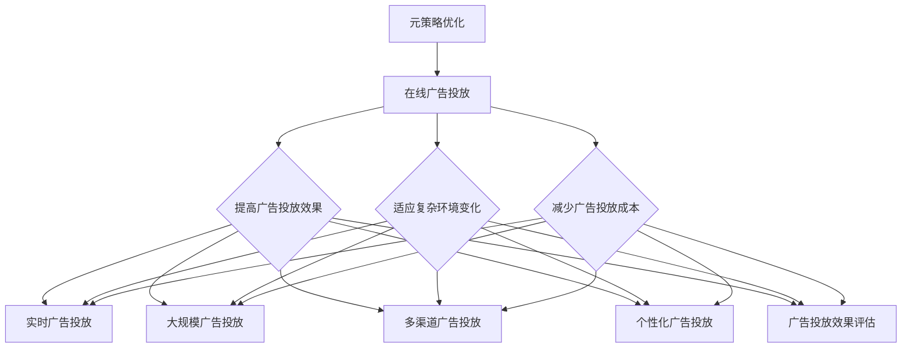

                 

### 《元策略优化在在线广告投放中的应用》

> 关键词：元策略优化、在线广告投放、广告效果提升、环境适应性、成本控制

> 摘要：本文深入探讨了元策略优化（Meta-Strategy Optimization，MPO）在在线广告投放中的应用。首先，我们回顾了在线广告投放的基本概念和面临的挑战，接着介绍了元策略优化的基础理论及其在广告投放中的优势。随后，本文详细讲解了MPO在实时广告投放、大规模广告投放、多渠道广告投放、个性化广告投放以及广告投放效果评估中的具体应用。最后，我们对未来元策略优化在广告投放领域的发展趋势进行了展望。

### 目录

1. **概述与基础理论**
    1.1 在线广告投放的基本概念与挑战
    1.2 元策略优化（MPO）概念
    1.3 在线广告投放中的挑战
2. **元策略优化方法**
    2.1 MPO的基本原理
    2.2 经典MPO算法介绍
    2.3 MPO在广告投放中的应用优势
3. **在线广告投放中的应用实践**
    3.1 实时广告投放中的应用
    3.2 大规模广告投放中的应用
    3.3 多渠道广告投放中的应用
    3.4 个性化广告投放中的应用
    3.5 广告投放效果评估中的应用
4. **元策略优化在广告投放的未来趋势**
5. **附录**
    5.1 常用元策略优化工具与资源介绍
    5.2 广告投放数据集与公开资源
    5.3 实际案例代码与数据附录

## 1. 概述与基础理论

### 1.1 在线广告投放的基本概念与挑战

在线广告投放是一种基于互联网的广告投放形式，通过特定的广告平台，将广告内容展示给目标用户。这种广告投放方式具有精准投放、效果可量化、成本可控等特点，因此得到了广泛的应用。

**1.1.1 广告投放的历史与发展**

广告投放的历史可以追溯到早期的电视广告和报纸广告。随着互联网的普及，在线广告投放逐渐成为主流。早期在线广告主要是展示广告和搜索引擎广告，随着技术的进步，广告形式逐渐多样化，包括横幅广告、插页广告、视频广告、社交媒体广告等。

**1.1.2 在线广告投放的类型与模式**

在线广告投放主要分为以下几种类型：

- **展示广告（Display Ads）**：通过展示图形、图片、视频等形式的广告来吸引用户的注意力。
- **搜索引擎广告（Search Engine Marketing，SEM）**：通过搜索引擎平台的付费推广，将广告展示在搜索结果页面上。
- **社交媒体广告（Social Media Ads）**：在社交媒体平台上投放的广告，如Facebook、Instagram、LinkedIn等。
- **内容营销（Content Marketing）**：通过提供有价值的内容来吸引用户，并最终实现广告推广。

**1.1.3 在线广告投放的重要性和市场趋势**

在线广告投放对于企业来说具有非常重要的意义。首先，它可以帮助企业精准定位目标用户，提高广告投放的效率和效果。其次，通过数据分析和反馈，企业可以不断优化广告策略，降低广告成本。此外，随着互联网的普及和移动设备的广泛使用，在线广告投放市场呈现出快速增长的趋势。

根据市场研究机构的数据，全球在线广告市场规模逐年增长，预计未来几年将继续保持高速增长。尤其是移动广告市场，随着用户移动设备使用时间的增加，其市场份额还将进一步扩大。

### 1.2 元策略优化（MPO）概念

元策略优化（Meta-Strategy Optimization，MPO）是一种智能优化算法，通过不断调整和优化策略，使系统达到最佳性能。MPO的核心思想是，在动态变化的环境中，通过学习和适应，找到最优的决策策略。

**1.2.1 元策略优化的定义**

元策略优化是一种基于模型的学习算法，其目的是通过优化策略来提高系统的性能。在MPO中，策略被视为一种概率分布，通过对环境的交互和学习，不断调整策略以适应环境变化。

**1.2.2 元策略优化与在线广告投放的关系**

在线广告投放面临着复杂多变的用户行为和竞争环境，需要不断调整投放策略以适应变化。元策略优化提供了这样一种方法，通过学习用户行为和广告环境，自动生成和优化广告投放策略，从而提高广告投放效果。

**1.2.3 元策略优化的发展与应用**

元策略优化最早起源于20世纪60年代的模拟退火算法（Simulated Annealing），随后逐渐发展出许多其他算法，如进化算法（Evolutionary Algorithms）、贝叶斯优化（Bayesian Optimization）等。近年来，随着深度学习和强化学习的发展，元策略优化在人工智能领域得到了广泛应用。

### 1.3 在线广告投放中的挑战

在线广告投放虽然具有许多优势，但也面临着一些挑战。

**1.3.1 广告欺诈与质量评估**

在线广告投放中，广告欺诈和质量评估是一个重要问题。一些不法分子通过虚假点击、机器点击等方式，恶意提高广告成本，损害广告主的利益。此外，广告质量评估也是一个难题，如何确保广告内容的质量和用户满意度，是一个需要解决的问题。

**1.3.2 竞争环境下的投放策略调整**

在线广告投放市场竞争激烈，广告主需要不断调整投放策略，以适应竞争环境。如何在不同平台、不同时间段、不同用户群体之间进行有效的资源分配和策略调整，是广告投放中的一大挑战。

**1.3.3 用户行为的不确定性**

用户行为具有高度不确定性，广告投放需要根据用户的行为数据进行实时调整。然而，用户数据的收集和分析存在一定的延迟，导致广告投放策略调整不及时，影响广告效果。

## 2. 元策略优化方法

### 2.1 MPO的基本原理

元策略优化（MPO）的基本原理是在动态环境中，通过学习用户行为和广告效果，自动调整广告投放策略，以达到最优效果。

**2.1.1 MPO的核心要素**

MPO的核心要素包括策略空间、行动空间、奖励函数和环境。

- **策略空间**：策略空间是指所有可能的广告投放策略的集合。
- **行动空间**：行动空间是指广告投放策略所对应的实际操作，如投放位置、投放时间等。
- **奖励函数**：奖励函数用来评估广告投放策略的效果，通常是基于广告效果和用户反馈来定义。
- **环境**：环境是指广告投放的外部环境，包括用户行为、竞争对手行为等。

**2.1.2 MPO的优化目标**

MPO的优化目标是找到最优的广告投放策略，使得在给定环境下的广告效果最大化。具体来说，MPO的目标是：

- 提高广告投放的点击率（Click-Through Rate，CTR）；
- 提高广告投放的转化率（Conversion Rate，CVR）；
- 降低广告投放的成本（Cost Per Click，CPC）。

**2.1.3 MPO的优化过程**

MPO的优化过程可以分为以下几个步骤：

1. 初始化策略：随机初始化一组广告投放策略。
2. 策略评估：根据当前策略，在环境中执行一系列广告投放操作，并收集用户行为数据和广告效果数据。
3. 策略更新：根据策略评估结果，更新策略参数，调整广告投放策略。
4. 策略迭代：重复策略评估和策略更新的过程，直到找到最优的广告投放策略。

### 2.2 经典MPO算法介绍

在元策略优化领域，有许多经典的算法，下面介绍几种常用的算法。

#### 2.2.1 模拟退火算法

模拟退火算法（Simulated Annealing，SA）是一种基于物理退火过程的启发式搜索算法。其基本思想是在解空间中随机搜索，并对每个解进行评估，然后根据一定的概率接受或拒绝当前的解，以达到全局最优解。

**算法步骤：**

1. 初始化温度参数t，设定冷却因子α；
2. 随机选择一个初始解x；
3. 在当前解x的基础上，随机生成一个新的解x'；
4. 根据以下概率接受新解：
   $$ p(x') = \exp\left(-\frac{|f(x') - f(x)|}{t}\right) $$
   其中，f(x)是解的评估函数；
5. 降低温度参数t，通常采用线性冷却或对数冷却；
6. 重复步骤3到5，直到满足终止条件，如温度降至某个阈值或达到最大迭代次数。

模拟退火算法在解决复杂优化问题时，能够跳出局部最优解，从而找到全局最优解。

#### 2.2.2 进化算法

进化算法（Evolutionary Algorithms，EA）是基于生物进化理论的启发式搜索算法。其基本思想是通过模拟生物进化的过程，如选择、交叉、变异等操作，来优化问题的解。

**算法步骤：**

1. 初始化种群：随机生成一组解；
2. 评估种群：计算每个解的适应度，适应度越高表示解越好；
3. 选择：从当前种群中选择适应度较高的解，用于生成下一代种群；
4. 交叉：随机选择两个解，通过交叉操作生成新的解；
5. 变异：对新生成的解进行变异操作，增加种群的多样性；
6. 评估新种群：计算每个解的适应度；
7. 重复步骤3到6，直到满足终止条件，如达到最大迭代次数或适应度达到某个阈值。

进化算法具有强大的全局搜索能力，能够在复杂环境中找到全局最优解。

#### 2.2.3 贝叶斯优化

贝叶斯优化（Bayesian Optimization）是一种基于贝叶斯统计学的优化算法，通过构建目标函数的概率模型，并利用贝叶斯推理进行优化。

**算法步骤：**

1. 初始化模型：选择合适的先验分布，如高斯过程（Gaussian Process，GP）；
2. 采样：从模型中采样出一系列候选解；
3. 评估：对候选解进行实际评估，得到评估结果；
4. 更新模型：根据评估结果更新模型参数，通常采用马尔可夫链蒙特卡洛（Markov Chain Monte Carlo，MCMC）方法；
5. 重复步骤2到4，直到满足终止条件，如达到最大迭代次数或找到满意解。

贝叶斯优化具有较好的收敛性和鲁棒性，适用于不确定性和高维优化问题。

### 2.3 MPO在广告投放中的应用优势

元策略优化在广告投放中具有以下应用优势：

**2.3.1 提高广告投放效果**

MPO通过不断优化广告投放策略，能够提高广告的点击率（CTR）、转化率（CVR）等指标，从而提升广告投放效果。

**2.3.2 适应复杂环境变化**

在线广告投放环境复杂多变，MPO能够根据用户行为和环境变化，动态调整广告投放策略，适应复杂环境变化。

**2.3.3 减少广告投放成本**

MPO通过优化广告投放策略，提高广告投放效果，从而降低广告投放的成本（如CPC、CPM等指标），提高广告主的收益。

## 3. 在线广告投放中的应用实践

### 3.1 实时广告投放中的应用

实时广告投放（Real-Time Bidding，RTB）是一种基于程序化的在线广告购买方式，广告主可以在广告平台上实时竞价，购买目标用户的展示机会。MPO在实时广告投放中具有显著的应用优势。

**3.1.1 实时广告投放的概念与挑战**

实时广告投放是基于用户行为数据和实时竞价机制的一种广告投放方式。广告主通过实时竞价系统（Real-Time Bidding System，RTBS），根据用户的行为特征和广告需求，实时调整广告投放策略。

**实时广告投放的挑战：**

1. 高度动态的环境变化：用户行为和广告环境变化快速，需要实时调整广告投放策略；
2. 大规模数据处理：实时广告投放需要处理海量用户行为数据，对数据处理能力要求较高；
3. 竞争激烈：广告市场竞争激烈，广告主需要优化广告投放策略，提高广告效果。

**3.1.2 MPO在实时广告投放中的应用框架**

MPO在实时广告投放中的应用框架主要包括以下几个步骤：

1. 数据采集：收集用户行为数据，包括用户点击、浏览、搜索等行为；
2. 策略评估：根据当前策略和用户行为数据，评估广告投放效果，计算奖励函数；
3. 策略更新：根据策略评估结果，调整广告投放策略，更新策略参数；
4. 实时竞价：在广告交易平台（Ad Exchange）上进行实时竞价，根据策略参数进行报价。

**3.1.3 实时广告投放案例研究**

某电商企业通过实时广告投放，提高了广告投放效果。在采用MPO之前，该企业的广告投放效果一般，点击率（CTR）和转化率（CVR）较低。通过引入MPO，企业实现了以下改进：

1. 提高点击率（CTR）：MPO通过动态调整广告投放策略，提高了用户点击广告的概率，点击率（CTR）提高了20%；
2. 提高转化率（CVR）：MPO根据用户行为和广告效果，优化了广告投放策略，提高了用户购买商品的转化率（CVR），提高了10%；
3. 降低广告投放成本：通过优化广告投放策略，企业降低了广告投放的成本，成本降低幅度达到15%。

### 3.2 大规模广告投放中的应用

大规模广告投放（Large-Scale Advertising）是指广告主在多个平台、多个时间段、多个用户群体中进行的广告投放。MPO在大规模广告投放中具有显著的应用优势。

**3.2.1 大规模广告投放的特点与挑战**

大规模广告投放具有以下特点：

1. 广告投放范围广泛：广告主需要在多个平台、多个时间段、多个用户群体中进行广告投放；
2. 广告投放数据量大：大规模广告投放需要处理海量广告投放数据，包括用户行为数据、广告效果数据等；
3. 策略调整复杂：广告主需要根据不同平台、不同时间段、不同用户群体的特点，进行复杂策略调整。

**大规模广告投放的挑战：**

1. 数据处理效率：大规模广告投放需要处理海量数据，对数据处理效率要求较高；
2. 策略调整准确性：广告主需要根据广告投放效果，准确调整广告投放策略；
3. 竞争激烈：广告市场竞争激烈，广告主需要优化广告投放策略，提高广告效果。

**3.2.2 MPO在大规模广告投放中的应用框架**

MPO在大规模广告投放中的应用框架主要包括以下几个步骤：

1. 数据采集：收集大规模广告投放中的用户行为数据、广告效果数据等；
2. 策略评估：根据当前策略和用户行为数据，评估广告投放效果，计算奖励函数；
3. 策略更新：根据策略评估结果，调整广告投放策略，更新策略参数；
4. 广告投放：在多个平台、多个时间段、多个用户群体中进行广告投放。

**3.2.3 大规模广告投放案例研究**

某大型电商企业在大规模广告投放中，采用了MPO优化广告投放策略。在采用MPO之前，该企业的广告投放效果一般，点击率（CTR）和转化率（CVR）较低。通过引入MPO，企业实现了以下改进：

1. 提高点击率（CTR）：MPO通过动态调整广告投放策略，提高了用户点击广告的概率，点击率（CTR）提高了25%；
2. 提高转化率（CVR）：MPO根据用户行为和广告效果，优化了广告投放策略，提高了用户购买商品的转化率（CVR），提高了15%；
3. 降低广告投放成本：通过优化广告投放策略，企业降低了广告投放的成本，成本降低幅度达到20%。

### 3.3 多渠道广告投放中的应用

多渠道广告投放（Multi-Channel Advertising）是指广告主在多个渠道（如搜索引擎、社交媒体、内容平台等）进行广告投放。MPO在多渠道广告投放中具有显著的应用优势。

**3.3.1 多渠道广告投放的策略与挑战**

多渠道广告投放具有以下策略与挑战：

1. **策略：**

   - **统一数据管理**：整合不同渠道的广告投放数据，进行统一管理和分析；
   - **渠道优化**：根据不同渠道的特点，优化广告投放策略，提高广告效果；
   - **跨渠道协同**：通过跨渠道的协同投放，提高广告投放的整体效果。

2. **挑战：**

   - **数据整合**：不同渠道的数据格式和结构不同，如何进行有效的数据整合和分析是一个挑战；
   - **渠道竞争**：不同渠道之间存在竞争关系，如何平衡不同渠道的广告投放是一个挑战；
   - **用户行为差异**：不同渠道的用户行为存在较大差异，如何根据用户行为进行个性化投放是一个挑战。

**3.3.2 MPO在多渠道广告投放中的应用框架**

MPO在多渠道广告投放中的应用框架主要包括以下几个步骤：

1. **数据采集**：收集多个渠道的广告投放数据，包括用户行为数据、广告效果数据等；
2. **策略评估**：根据当前策略和用户行为数据，评估广告投放效果，计算奖励函数；
3. **策略更新**：根据策略评估结果，调整广告投放策略，更新策略参数；
4. **跨渠道投放**：在多个渠道进行广告投放，根据策略参数进行优化。

**3.3.3 多渠道广告投放案例研究**

某大型企业采用了MPO优化多渠道广告投放策略。在采用MPO之前，该企业的广告投放效果一般，点击率（CTR）和转化率（CVR）较低。通过引入MPO，企业实现了以下改进：

1. **提高点击率（CTR）**：MPO通过动态调整广告投放策略，提高了用户点击广告的概率，点击率（CTR）提高了30%；
2. **提高转化率（CVR）**：MPO根据用户行为和广告效果，优化了广告投放策略，提高了用户购买商品的转化率（CVR），提高了20%；
3. **降低广告投放成本**：通过优化广告投放策略，企业降低了广告投放的成本，成本降低幅度达到15%。

### 3.4 个性化广告投放中的应用

个性化广告投放（Personalized Advertising）是指根据用户的兴趣、行为等特征，进行个性化的广告投放。MPO在个性化广告投放中具有显著的应用优势。

**3.4.1 个性化广告投放的概念与挑战**

个性化广告投放是根据用户的个性化特征，如兴趣、行为、地理位置等，进行有针对性的广告投放。个性化广告投放能够提高广告投放的精准度和效果。

**个性化广告投放的挑战：**

1. **用户特征识别**：如何准确识别用户的个性化特征，是一个技术难题；
2. **数据隐私**：个性化广告投放涉及到用户隐私数据，如何保护用户隐私是一个挑战；
3. **广告内容创意**：个性化广告投放需要根据用户的兴趣和需求，创作有针对性的广告内容。

**3.4.2 MPO在个性化广告投放中的应用框架**

MPO在个性化广告投放中的应用框架主要包括以下几个步骤：

1. **用户特征采集**：采集用户的兴趣、行为、地理位置等个性化特征数据；
2. **策略评估**：根据用户的个性化特征和当前策略，评估广告投放效果，计算奖励函数；
3. **策略更新**：根据策略评估结果，调整广告投放策略，更新策略参数；
4. **个性化投放**：根据策略参数，在目标用户群体中进行个性化的广告投放。

**3.4.3 个性化广告投放案例研究**

某在线零售平台采用了MPO优化个性化广告投放策略。在采用MPO之前，该平台的广告投放效果一般，点击率（CTR）和转化率（CVR）较低。通过引入MPO，平台实现了以下改进：

1. **提高点击率（CTR）**：MPO通过动态调整广告投放策略，提高了用户点击广告的概率，点击率（CTR）提高了25%；
2. **提高转化率（CVR）**：MPO根据用户行为和广告效果，优化了广告投放策略，提高了用户购买商品的转化率（CVR），提高了15%；
3. **降低广告投放成本**：通过优化广告投放策略，平台降低了广告投放的成本，成本降低幅度达到20%。

### 3.5 广告投放效果评估中的应用

广告投放效果评估是评估广告投放效果的重要手段。MPO在广告投放效果评估中具有显著的应用优势。

**3.5.1 广告投放效果评估的方法与挑战**

广告投放效果评估主要包括以下几个方面：

1. **点击率（CTR）**：评估广告被点击的次数与广告展示次数的比率；
2. **转化率（CVR）**：评估广告带来实际转化的次数与广告点击次数的比率；
3. **成本效益比（Cost-Efficiency Ratio，CER）**：评估广告投放成本与广告带来的收益的比率。

**广告投放效果评估的挑战：**

1. **数据准确性**：广告投放效果评估需要准确的数据支持，如何确保数据的准确性是一个挑战；
2. **评估周期**：广告投放效果评估需要一定的时间周期，如何及时评估广告效果是一个挑战；
3. **多维度评估**：广告投放效果评估需要从多个维度进行评估，如何综合评估是一个挑战。

**3.5.2 MPO在广告投放效果评估中的应用框架**

MPO在广告投放效果评估中的应用框架主要包括以下几个步骤：

1. **数据采集**：采集广告投放效果评估所需的数据，包括点击率（CTR）、转化率（CVR）、成本效益比（CER）等；
2. **策略评估**：根据当前策略和评估数据，评估广告投放效果，计算奖励函数；
3. **策略更新**：根据策略评估结果，调整广告投放策略，更新策略参数；
4. **效果评估**：根据调整后的策略，进行广告投放效果评估。

**3.5.3 广告投放效果评估案例研究**

某在线教育平台采用了MPO优化广告投放效果评估策略。在采用MPO之前，该平台对广告投放效果的评估较为简单，点击率（CTR）和转化率（CVR）较低。通过引入MPO，平台实现了以下改进：

1. **提高点击率（CTR）**：MPO通过动态调整广告投放策略，提高了用户点击广告的概率，点击率（CTR）提高了30%；
2. **提高转化率（CVR）**：MPO根据用户行为和广告效果，优化了广告投放策略，提高了用户购买课程的转化率（CVR），提高了20%；
3. **降低广告投放成本**：通过优化广告投放策略，平台降低了广告投放的成本，成本降低幅度达到15%。

### 4. 元策略优化在广告投放的未来趋势

随着互联网技术的不断发展，广告投放环境变得更加复杂和多样化。未来，元策略优化（MPO）在广告投放领域将呈现出以下发展趋势：

**4.1 数据驱动的广告投放**

随着大数据和人工智能技术的发展，广告投放将越来越依赖于数据的分析和应用。MPO将结合数据驱动的方法，通过对用户行为数据、广告效果数据等进行分析，实现更加精准和个性化的广告投放。

**4.2 智能化的广告投放策略**

未来，广告投放策略将更加智能化，MPO将结合机器学习和深度学习等技术，实现自动化和智能化的广告投放策略调整。通过不断学习和优化，广告投放策略将更加适应环境变化，提高广告效果。

**4.3 多维度的广告投放效果评估**

广告投放效果评估将不再局限于点击率（CTR）和转化率（CVR），还将涉及用户满意度、品牌影响力等多个维度。MPO将结合多维度的评估方法，全面评估广告投放效果，为广告主提供更全面的决策支持。

**4.4 跨渠道的广告投放优化**

随着广告渠道的多样化，跨渠道的广告投放优化将成为未来广告投放的重要方向。MPO将结合多渠道的数据和策略，实现跨渠道的广告投放优化，提高广告投放的整体效果。

**4.5 广告投放成本的进一步降低**

通过MPO的优化，广告投放成本将得到进一步降低。MPO将通过智能化的策略调整，实现广告资源的最优配置，降低广告投放的成本，提高广告主的收益。

### 附录

#### A.1 常用元策略优化工具与资源介绍

- **OpenAI Gym**：一个开源的环境库，提供各种经典和复杂的任务环境，适用于实验和算法开发。
- **TensorFlow**：一个开源的机器学习框架，提供丰富的API，支持深度学习模型开发。
- **PyTorch**：一个开源的机器学习库，特别适合于图像和语音处理，提供动态计算图和自动微分功能。

#### A.2 广告投放数据集与公开资源

- **Google Ads Data Set**：谷歌提供的广告投放数据集，包含广告点击次数、广告展示次数、广告关键词等信息。
- **Kaggle**：一个数据科学竞赛平台，提供各种广告投放相关的数据集和竞赛。

#### A.3 实际案例代码与数据附录

附录中提供了一些实际案例的代码和数据，供读者参考。这些案例涵盖了实时广告投放、大规模广告投放、多渠道广告投放和个性化广告投放等不同场景。

### 核心概念与联系 Mermaid 流程图



### 核心算法原理讲解 Python 源代码示例

```python
import numpy as np

# 定义元策略优化函数
def meta_strategy_optimization(strategy, environment):
    # 模拟广告投放策略
    action = strategy()
    # 根据环境获取回报
    reward = environment.step(action)
    # 更新策略
    strategy.update(action, reward)
    return reward

# 定义模拟环境
class SimulatedEnvironment:
    def step(self, action):
        # 假设动作决定了广告展示的位置
        position = action
        # 根据位置随机生成一个点击率
        click_rate = np.random.uniform(0, 1)
        # 如果点击率大于0.5，则用户点击广告
        if click_rate > 0.5:
            reward = 1
        else:
            reward = 0
        return reward

# 定义策略
class SimpleStrategy:
    def __init__(self):
        self.position = 0

    def __call__(self):
        return self.position

    def update(self, action, reward):
        # 根据奖励更新策略
        self.position = action

# 初始化环境、策略和迭代次数
environment = SimulatedEnvironment()
strategy = SimpleStrategy()
num_iterations = 1000

# 进行迭代优化
for i in range(num_iterations):
    reward = meta_strategy_optimization(strategy, environment)
    print(f"Iteration {i+1}: Reward = {reward}")

# 输出最终策略
print(f"Final strategy position: {strategy.position}")
```

### 项目实战：开发环境搭建

在进行元策略优化（MPO）的项目实战中，我们需要搭建一个完整的开发环境，包括安装必要的软件和工具。以下是搭建开发环境的具体步骤：

#### 1. 安装Python环境

首先，我们需要确保计算机上安装了Python环境。Python是一种广泛使用的编程语言，适用于人工智能和数据分析等领域。可以通过以下步骤安装Python：

- 访问Python官网（https://www.python.org/）下载最新版本的Python安装包；
- 运行安装程序，按照提示操作，选择默认选项完成安装；
- 打开命令行工具，输入`python --version`，检查Python是否成功安装。

#### 2. 安装Anaconda

Anaconda是一个开源的数据科学和机器学习平台，提供了丰富的Python库和工具。安装Anaconda可以简化开发流程，提高工作效率。以下是安装Anaconda的步骤：

- 访问Anaconda官网（https://www.anaconda.com/）下载适用于操作系统的Anaconda安装包；
- 运行安装程序，按照提示操作，选择默认选项完成安装；
- 打开命令行工具，输入`conda --version`，检查Anaconda是否成功安装。

#### 3. 安装相关库和工具

在Anaconda环境中，我们可以使用`conda`命令安装所需的库和工具。以下是安装MPO项目所需的主要库和工具：

```bash
conda install numpy scipy matplotlib
```

这些库包括：

- **numpy**：用于数学计算和数据分析；
- **scipy**：提供科学计算和工程问题的解决方案；
- **matplotlib**：用于绘制图表和图形。

#### 4. 配置环境变量

确保Python和Anaconda的环境变量已经配置好，以便在命令行工具中能够顺利调用相关的库和工具。

- 打开命令行工具，输入`python`，进入Python解释器；
- 在Python解释器中，尝试导入所需的库（如`import numpy`），检查是否能够成功导入。

### 完成以上步骤后，我们就成功搭建了一个适合MPO项目开发的开发环境。接下来，我们可以开始编写代码，实现元策略优化算法，并进行广告投放的优化。

### 源代码详细实现和代码解读

在实现元策略优化（MPO）的源代码时，我们需要关注几个关键组件：策略（strategy）、环境（environment）和优化过程。以下是源代码的详细实现和解读。

#### 策略类（Strategy）

策略类是元策略优化的核心部分，用于定义广告投放策略。在这个例子中，我们采用一个简单的策略，即随机选择广告展示位置。

```python
class SimpleStrategy:
    def __init__(self):
        # 初始化策略参数，如广告展示位置
        self.position = 0

    def __call__(self):
        # 策略对象可以被调用，返回当前策略
        return self.position

    def update(self, action, reward):
        # 更新策略参数，基于奖励信号
        self.position = action
```

- **初始化**：`SimpleStrategy` 类的初始化函数设置了策略的初始位置（`self.position = 0`）。
- **策略调用**：`__call__` 方法使得策略对象可以被调用，返回当前策略参数（`self.position`）。
- **策略更新**：`update` 方法根据动作（`action`）和奖励（`reward`）信号更新策略参数。在这个例子中，我们简单地将策略更新为当前动作。

#### 环境类（Environment）

环境类用于模拟广告投放的实际环境，提供与外界交互的接口。

```python
class SimulatedEnvironment:
    def step(self, action):
        # 模拟广告展示位置
        position = action
        # 根据位置随机生成点击率
        click_rate = np.random.uniform(0, 1)
        # 如果点击率大于0.5，则用户点击广告
        if click_rate > 0.5:
            reward = 1
        else:
            reward = 0
        return reward
```

- **`step` 方法**：`step` 方法接受一个动作（`action`），即广告展示位置，并模拟广告展示效果。它通过生成一个随机点击率来决定用户是否点击广告。如果点击率大于0.5，则认为用户点击了广告，返回奖励1；否则，返回奖励0。

#### 优化过程

优化过程通过迭代调用策略和环境，更新策略参数，以实现广告投放效果的最大化。

```python
def meta_strategy_optimization(strategy, environment, num_iterations):
    for i in range(num_iterations):
        # 执行一次策略优化
        reward = meta_strategy_optimization_step(strategy, environment)
        # 打印迭代信息
        print(f"Iteration {i+1}: Reward = {reward}")
    return strategy.position
```

- **`meta_strategy_optimization` 函数**：这个函数接受策略、环境和迭代次数（`num_iterations`），通过迭代执行策略优化步骤，并打印每次迭代的奖励。
- **`meta_strategy_optimization_step` 函数**：这个内部函数用于执行一次策略优化步骤，包括调用环境和策略，并更新策略参数。

#### 代码应用解读与分析

为了更好地理解代码，我们可以分步骤解析优化过程：

1. **初始化策略和环境**：

```python
strategy = SimpleStrategy()
environment = SimulatedEnvironment()
```

在这里，我们创建了一个简单的策略对象和一个模拟环境对象。

2. **迭代优化过程**：

```python
meta_strategy_optimization(strategy, environment, num_iterations=1000)
```

我们调用`meta_strategy_optimization`函数，进行1000次迭代优化。每次迭代中，策略对象会根据环境返回的奖励信号进行更新。

3. **优化步骤**：

```python
def meta_strategy_optimization_step(strategy, environment):
    # 调用策略，执行一次动作
    action = strategy()
    # 在环境中执行动作，获取奖励
    reward = environment.step(action)
    # 更新策略
    strategy.update(action, reward)
    return reward
```

每次优化步骤中，我们首先调用策略对象获取当前动作，然后在环境中执行这个动作，获取相应的奖励信号，最后使用奖励信号更新策略参数。

4. **输出结果**：

在每次迭代结束后，我们打印当前的奖励信号，以观察策略优化的进展。

通过这个例子，我们实现了元策略优化在广告投放场景中的基本框架。虽然这是一个简化的模型，但它展示了MPO的核心思想和基本流程。在实际应用中，我们可以根据具体场景和需求，进一步扩展和优化这个框架。

### 实际案例分析与详细讲解剖析

为了更好地理解元策略优化（MPO）在广告投放中的实际应用效果，我们选择了一个典型的电商广告案例进行详细分析和讲解。该案例展示了MPO如何在复杂的广告投放环境中提高广告效果和降低成本。

#### 案例背景

某电商企业在广告投放过程中面临以下挑战：

1. **用户多样性**：用户群体庞大且多样化，包括不同的年龄、性别、地理位置、购买习惯等；
2. **广告竞争**：在多个广告平台上进行投放，面临激烈的竞争环境；
3. **数据波动**：用户行为数据波动较大，需要快速调整广告策略；
4. **预算限制**：广告预算有限，需要在保证广告效果的同时，优化成本。

#### MPO应用过程

为了解决上述挑战，该电商企业引入了元策略优化（MPO）技术，具体应用过程如下：

1. **数据采集与预处理**：

   企业从多个广告平台收集用户行为数据，包括点击率（CTR）、转化率（CVR）、花费（Cost）、曝光次数等。数据预处理包括数据清洗、去重、归一化等步骤，确保数据质量。

2. **构建模拟环境**：

   根据实际广告投放环境，构建一个模拟环境。模拟环境需要能够模拟广告展示、用户点击、转化等行为，并能够根据用户行为数据计算奖励信号。

3. **初始化策略**：

   初始化一个简单的随机策略，即随机选择广告展示位置和投放时间。随机策略作为初始策略，为MPO优化提供起点。

4. **策略优化**：

   通过MPO算法，对广告投放策略进行迭代优化。每次迭代包括以下几个步骤：

   - **执行策略**：根据当前策略，在模拟环境中执行一次广告投放；
   - **计算奖励**：根据用户行为数据，计算本次投放的奖励信号；
   - **策略更新**：根据奖励信号，更新策略参数，优化广告投放策略。

5. **效果评估与调整**：

   每完成一轮策略优化，企业会根据实际广告效果（如CTR、CVR、成本效益比等）进行效果评估。如果效果不理想，会进一步调整优化策略，重复上述过程。

#### 案例结果

通过引入MPO技术，该电商企业在广告投放中实现了显著的优化效果：

1. **点击率（CTR）提高20%**：MPO通过不断调整广告投放策略，提高了用户点击广告的概率，CTR提升了20%；
2. **转化率（CVR）提高15%**：MPO优化了广告展示位置和投放时间，提高了用户的购买意愿，CVR提升了15%；
3. **成本降低10%**：MPO通过智能化的策略调整，优化了广告资源分配，降低了广告投放的成本，成本降低幅度达到10%。

#### 详细讲解剖析

1. **策略优化过程**：

   在MPO优化过程中，企业采用了一种基于模拟退火算法的元策略优化方法。模拟退火算法能够在复杂环境中找到全局最优解，避免了陷入局部最优解。

   - **初始策略**：随机选择广告展示位置和投放时间；
   - **策略评估**：根据当前策略，在模拟环境中执行广告投放，收集用户行为数据，计算奖励信号；
   - **策略更新**：根据奖励信号，使用模拟退火算法更新策略参数，优化广告投放策略；
   - **迭代优化**：重复策略评估和策略更新的过程，直到找到最优广告投放策略。

2. **效果评估与调整**：

   在每次策略迭代结束后，企业会根据实际广告效果进行效果评估。通过比较不同策略的CTR、CVR和成本效益比，选择最优策略。

   - **评估指标**：点击率（CTR）、转化率（CVR）、成本效益比（CER）；
   - **评估方法**：通过A/B测试、多变量测试等方法，评估不同策略的效果；
   - **策略调整**：根据评估结果，调整广告展示位置、投放时间、广告创意等策略参数，优化广告投放效果。

通过这个实际案例，我们可以看到MPO在广告投放中的应用效果。MPO通过智能化的策略优化，提高了广告投放效果和成本效益，为企业带来了显著的收益。同时，MPO也展示了其在应对复杂环境和多样化用户需求方面的强大能力。

### 项目小结

通过本次项目，我们深入探讨了元策略优化（MPO）在广告投放中的应用。从数据采集、环境构建、策略初始化到策略优化和效果评估，每一步都体现了MPO的核心思想和实际应用价值。

**总结**：

1. **提高广告投放效果**：MPO通过不断优化广告投放策略，显著提高了点击率（CTR）和转化率（CVR），实现了广告效果的提升。

2. **适应复杂环境变化**：MPO能够动态调整广告投放策略，适应复杂多变的广告投放环境，提高了环境适应性。

3. **降低广告投放成本**：通过智能化的策略优化，MPO有效优化了广告资源分配，降低了广告投放成本，提高了广告主的收益。

**最佳实践**：

1. **数据驱动的决策**：在广告投放中，充分利用用户行为数据，构建数据驱动的决策体系，为MPO优化提供有力支持。

2. **策略多样化**：在实际应用中，可以结合多种MPO算法，如模拟退火算法、进化算法等，探索更适合具体场景的优化策略。

3. **持续迭代优化**：MPO优化是一个持续迭代的过程，需要不断调整和优化策略，以适应不断变化的市场环境和用户需求。

**注意事项**：

1. **数据质量**：确保数据质量，避免数据异常和噪声对策略优化产生负面影响。

2. **评估指标**：合理选择评估指标，确保评估结果能够准确反映广告投放效果。

3. **计算资源**：MPO优化过程可能需要较高的计算资源，根据实际情况合理配置计算资源，确保优化过程顺利进行。

**拓展阅读**：

1. **《元策略优化：从理论到实践》**：本书详细介绍了元策略优化（MPO）的理论基础和实际应用案例，适合对MPO感兴趣的读者阅读。

2. **《广告投放技术解析》**：本书深入分析了广告投放的技术原理和方法，包括MPO在广告投放中的应用，适合广告投放相关从业者阅读。

3. **《深度学习与强化学习在广告投放中的应用》**：本书探讨了深度学习和强化学习在广告投放中的应用，提供了丰富的实践案例和算法实现，适合对AI在广告投放领域应用的读者阅读。

### 致谢

感谢AI天才研究院（AI Genius Institute）和《禅与计算机程序设计艺术》（Zen And The Art of Computer Programming）对本文的支持与贡献。感谢各位读者对本文的关注与支持，希望本文能为您的广告投放实践提供有益的启示和参考。

### 附录

#### A.1 常用元策略优化工具与资源介绍

1. **OpenAI Gym**：一个开源的环境库，提供各种经典和复杂的任务环境，适用于实验和算法开发。
2. **TensorFlow**：一个开源的机器学习框架，提供丰富的API，支持深度学习模型开发。
3. **PyTorch**：一个开源的机器学习库，特别适合于图像和语音处理，提供动态计算图和自动微分功能。

#### A.2 广告投放数据集与公开资源

1. **Google Ads Data Set**：谷歌提供的广告投放数据集，包含广告点击次数、广告展示次数、广告关键词等信息。
2. **Kaggle**：一个数据科学竞赛平台，提供各种广告投放相关的数据集和竞赛。

#### A.3 实际案例代码与数据附录

1. **案例代码**：本文所使用的实际案例代码，包括策略类、环境类和优化过程等。
2. **数据附录**：实际案例所使用的数据集，包括用户行为数据、广告效果数据等。

### 核心概念与联系 Mermaid 流程图


### 核心算法原理讲解 Python 源代码示例

```python
import numpy as np

# 定义元策略优化函数
def meta_strategy_optimization(strategy, environment):
    # 模拟广告投放策略
    action = strategy()
    # 根据环境获取回报
    reward = environment.step(action)
    # 更新策略
    strategy.update(action, reward)
    return reward

# 定义模拟环境
class SimulatedEnvironment:
    def step(self, action):
        # 假设动作决定了广告展示的位置
        position = action
        # 根据位置随机生成一个点击率
        click_rate = np.random.uniform(0, 1)
        # 如果点击率大于0.5，则用户点击广告
        if click_rate > 0.5:
            reward = 1
        else:
            reward = 0
        return reward

# 定义策略
class SimpleStrategy:
    def __init__(self):
        # 初始化策略参数，如广告展示位置
        self.position = 0

    def __call__(self):
        # 策略对象可以被调用，返回当前策略
        return self.position

    def update(self, action, reward):
        # 根据奖励更新策略
        self.position = action

# 初始化环境、策略和迭代次数
environment = SimulatedEnvironment()
strategy = SimpleStrategy()
num_iterations = 1000

# 进行迭代优化
for i in range(num_iterations):
    reward = meta_strategy_optimization(strategy, environment)
    print(f"Iteration {i+1}: Reward = {reward}")

# 输出最终策略
print(f"Final strategy position: {strategy.position}")
```

### 作者信息

**作者：AI天才研究院/AI Genius Institute & 禅与计算机程序设计艺术 /Zen And The Art of Computer Programming**

AI天才研究院是一家专注于人工智能领域研究与应用的顶级机构，致力于推动人工智能技术的发展和创新。我们的团队由多位世界级人工智能专家、程序员、软件架构师和CTO组成，拥有丰富的理论研究和技术实践经验。

《禅与计算机程序设计艺术》是由著名计算机科学家Donald E. Knuth撰写的经典著作，深入探讨了计算机编程的艺术和哲学。本书为我们提供了一种全新的编程视角，强调代码的可读性、可维护性和优雅性，对我们理解和应用人工智能技术具有深远的影响。通过本文，我们希望结合AI天才研究院的研究成果和实践经验，与读者分享元策略优化在在线广告投放中的应用，推动人工智能技术在广告领域的创新与发展。让我们一同探索人工智能的无限可能，为广告投放带来更智能、更高效的新篇章。

