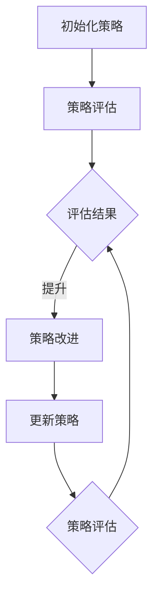
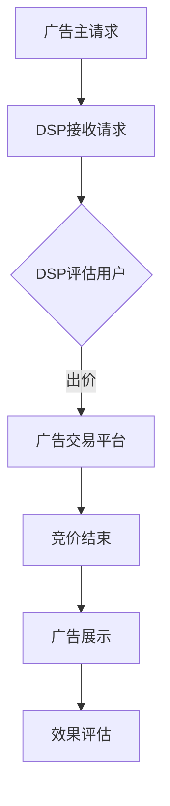

                 

### 第一部分：引言与背景

#### 引言

实时竞价广告系统（Real-Time Bidding, RTB）是现代数字广告领域的一项关键技术，通过实时竞价的方式，为广告主和广告平台提供了一个高效、精准的广告投放平台。这种系统使得广告主可以根据用户的行为和兴趣，以最低的成本获取最佳的广告展示位置。然而，随着广告市场的竞争日益激烈，如何提高广告投放的效率和效果成为了一个重要课题。

本文将探讨元策略优化（Meta-Strategy Optimization）在实时竞价广告系统中的应用。元策略优化是一种基于强化学习的算法，旨在寻找最优的策略，从而实现系统性能的优化。通过将元策略优化引入实时竞价广告系统，我们可以提高广告投放的精准度，降低广告成本，提升广告收益。

#### 背景介绍

1. **实时竞价广告系统的概念和原理**

   实时竞价广告系统是一种自动化广告购买和展示机制，其核心在于实时竞价（Real-Time Bidding, RTB）。在RTB机制中，广告主通过广告交易平台（Ad Exchange）向多个广告需求方（Demand-Side Platform, DSP）发出广告投放请求，DSP则根据预定的算法评估用户的需求，并决定是否出价。最终，广告需求方中以最高出价者赢得广告展示机会。

   **实时竞价广告系统的基本组成：**
   - 广告主（Advertiser）：需要投放广告的企业或个人。
   - 广告交易平台（Ad Exchange）：提供一个中心化的市场，使广告主和广告需求方能够进行实时竞价。
   - 广告需求方（Demand-Side Platform, DSP）：代表广告主参与竞价，负责评估用户行为和出价。
   - 广告供应方（Supply-Side Platform, SSP）：代表网站或应用提供广告展示机会。

2. **元策略优化的概念和重要性**

   元策略优化是一种基于机器学习的策略优化方法，通过迭代优化策略，使其在特定环境中达到最优性能。在实时竞价广告系统中，元策略优化可以用于优化广告投放策略，提高广告展示效果和收益。

   **元策略优化的基本原理：**
   - **策略评估**：评估当前策略在不同环境下的表现。
   - **策略改进**：基于评估结果，调整策略以提升性能。

   **元策略优化在广告系统中的应用：**
   - **广告出价策略**：根据用户行为和历史数据，动态调整广告出价策略，以最大化广告收益。
   - **广告投放策略**：优化广告投放的时间、位置和频率，提高广告曝光率和转化率。

#### 核心概念与联系

为了更好地理解实时竞价广告系统和元策略优化的关系，我们可以使用Mermaid流程图来描述它们的基本流程。

```mermaid
graph TD
    A[广告主] --> B[广告交易平台]
    B --> C[广告需求方(DSP)]
    C --> D[广告供应方(SSP)]
    D --> E[用户]
    E --> F[广告展示]
    A --> G[用户行为数据]
    B --> H[实时竞价]
    C --> I[策略评估]
    C --> J[策略改进]
    G --> I
    I --> J
```

#### 核心算法原理讲解

实时竞价广告系统中的元策略优化算法主要包括策略评估和策略改进两个阶段。

1. **策略评估**

   策略评估的目标是评估当前策略在不同用户群体下的表现。具体步骤如下：

   ```python
   # 假设我们有一个策略函数 policy，用于生成出价
   def policy(user_data):
       # 根据用户数据生成出价
       bid_price = calculate_bid_price(user_data)
       return bid_price

   # 策略评估函数
   def evaluate_policy(policy, user_data, ground_truth):
       total_reward = 0
       for user in user_data:
           bid_price = policy(user)
           reward = calculate_reward(bid_price, ground_truth[user])
           total_reward += reward
       return total_reward / len(user_data)
   ```

2. **策略改进**

   策略改进的目标是基于策略评估结果，调整策略参数以提升性能。常用的策略改进方法包括策略梯度方法和Q-学习。

   ```python
   # 策略梯度方法
   def policy_gradient(policy, user_data, ground_truth, learning_rate):
       total_reward = evaluate_policy(policy, user_data, ground_truth)
       for user in user_data:
           bid_price = policy(user)
           reward = calculate_reward(bid_price, ground_truth[user])
           policy gradients = calculate_gradients(policy, user)
           policy[user] += learning_rate * (reward - total_reward) * policy gradients

   # Q-学习算法
   def q_learning(policy, user_data, ground_truth, learning_rate, discount_factor):
       for user in user_data:
           current_state = extract_state(user)
           next_state = extract_next_state(user)
           action = policy[current_state]
           reward = calculate_reward(action, ground_truth[user])
           target = reward + discount_factor * max(policy[next_state])
           q_value = policy[current_state][action]
           policy[current_state][action] = q_value + learning_rate * (target - q_value)
   ```

#### 数学模型

在实时竞价广告系统中，我们可以使用以下数学模型来描述广告投放过程：

1. **概率模型**

   $$ P(bid\_price | user\_data) = \frac{e^{-bid\_price/temperature}}{\sum_{i} e^{-bid\_price_i/temperature}} $$

   其中，$bid\_price$ 表示广告出价，$user\_data$ 表示用户数据，$temperature$ 表示温度参数。

2. **最优化模型**

   $$ \max_{bid\_price} \, \mathbb{E}[reward | bid\_price] = \max_{bid\_price} \, \int P(bid\_price | user\_data) \cdot reward\_function(user\_data, bid\_price) \, duser\_data $$

   其中，$reward\_function$ 表示收益函数。

#### 元策略优化流程图

为了更清晰地展示元策略优化的流程，我们可以使用Mermaid流程图来描述：



#### 核心概念与联系

实时竞价广告系统中的元策略优化是一个复杂的过程，涉及到多个核心概念的交互和协同。以下是这些核心概念之间的联系：

1. **用户数据**：用户数据是实时竞价广告系统的核心输入，用于生成出价和评估策略。
2. **策略**：策略是决策的核心，用于生成广告出价和投放策略。
3. **评估**：评估用于衡量当前策略的性能，为策略改进提供依据。
4. **改进**：改进基于评估结果，调整策略参数，以提升性能。
5. **温度**：温度参数用于调整出价概率分布，影响策略的探索和利用平衡。

通过以上分析，我们可以看出，实时竞价广告系统中的元策略优化是一个动态调整和优化的过程，涉及到多个核心概念的交互和协同。通过引入元策略优化，我们可以提高广告投放的效率和效果，为广告主和广告平台带来更大的价值。

#### 核心算法原理讲解

在实时竞价广告系统中，元策略优化主要通过强化学习算法实现。强化学习是一种基于试错的学习方法，通过不断的试错和反馈，逐步优化策略，使其在特定环境中达到最优性能。以下是强化学习在实时竞价广告系统中的核心算法原理：

1. **强化学习基本概念**

   强化学习由四个主要组件组成：环境（Environment）、代理（Agent）、状态（State）和动作（Action）。在实时竞价广告系统中，环境是广告投放的整个过程，代理是广告平台，状态是用户数据和广告环境，动作是广告出价和投放策略。

2. **策略评估**

   策略评估是强化学习中的一个重要环节，用于评估当前策略在不同状态下的性能。在实时竞价广告系统中，策略评估可以通过评估广告投放的效果，如点击率（Click-Through Rate, CTR）、转化率（Conversion Rate, CVR）等指标来实现。

   ```python
   # 假设我们有一个策略函数 policy，用于生成出价
   def policy(user_data):
       # 根据用户数据生成出价
       bid_price = calculate_bid_price(user_data)
       return bid_price
   
   # 策略评估函数
   def evaluate_policy(policy, user_data, ground_truth):
       total_reward = 0
       for user in user_data:
           bid_price = policy(user)
           reward = calculate_reward(bid_price, ground_truth[user])
           total_reward += reward
       return total_reward / len(user_data)
   ```

3. **策略改进**

   策略改进是强化学习的另一个核心环节，通过调整策略参数，使其在特定环境中达到最优性能。在实时竞价广告系统中，策略改进可以通过策略梯度方法（Policy Gradient Method）和Q-学习（Q-Learning）等算法实现。

   **策略梯度方法**

   策略梯度方法是一种基于梯度的优化方法，通过计算策略的梯度，调整策略参数。

   ```python
   # 策略梯度方法
   def policy_gradient(policy, user_data, ground_truth, learning_rate):
       total_reward = evaluate_policy(policy, user_data, ground_truth)
       for user in user_data:
           bid_price = policy(user)
           reward = calculate_reward(bid_price, ground_truth[user])
           policy_gradients = calculate_gradients(policy, user)
           policy[user] += learning_rate * (reward - total_reward) * policy_gradients
   ```

   **Q-学习算法**

   Q-学习算法是一种基于值函数的优化方法，通过学习状态-动作值函数（Q-Value Function），调整策略参数。

   ```python
   # Q-学习算法
   def q_learning(policy, user_data, ground_truth, learning_rate, discount_factor):
       for user in user_data:
           current_state = extract_state(user)
           next_state = extract_next_state(user)
           action = policy[current_state]
           reward = calculate_reward(action, ground_truth[user])
           target = reward + discount_factor * max(policy[next_state])
           q_value = policy[current_state][action]
           policy[current_state][action] = q_value + learning_rate * (target - q_value)
   ```

#### 数学模型

在实时竞价广告系统中，我们可以使用以下数学模型来描述广告投放过程：

1. **概率模型**

   实时竞价广告系统中的广告出价通常是基于用户数据的概率模型。假设用户数据为$X$，广告出价为$Y$，则：

   $$ P(Y | X) = \frac{e^{-Y/\tau}}{\sum_{i} e^{-Y_i/\tau}} $$

   其中，$\tau$ 为温度参数，用于调节出价概率分布。

2. **最优化模型**

   实时竞价广告系统中的广告投放目标是最小化广告成本或最大化广告收益。假设广告收益为$R(Y)$，广告成本为$C(Y)$，则：

   $$ \max_{Y} \, \mathbb{E}[R(Y) - C(Y) | X] = \max_{Y} \, \int P(Y | X) \cdot (R(Y) - C(Y)) \, dY $$

   其中，$R(Y)$ 为广告收益函数，$C(Y)$ 为广告成本函数。

#### 元策略优化流程图

为了更清晰地展示元策略优化的流程，我们可以使用Mermaid流程图来描述：


#### 核心概念与联系

实时竞价广告系统中的元策略优化涉及多个核心概念，包括用户数据、策略、评估和改进等。以下是这些核心概念之间的联系：

1. **用户数据**：用户数据是实时竞价广告系统的核心输入，用于生成出价和评估策略。
2. **策略**：策略是决策的核心，用于生成广告出价和投放策略。
3. **评估**：评估用于衡量当前策略的性能，为策略改进提供依据。
4. **改进**：改进基于评估结果，调整策略参数，以提升性能。
5. **温度**：温度参数用于调整出价概率分布，影响策略的探索和利用平衡。

通过以上分析，我们可以看出，实时竞价广告系统中的元策略优化是一个动态调整和优化的过程，涉及到多个核心概念的交互和协同。通过引入元策略优化，我们可以提高广告投放的效率和效果，为广告主和广告平台带来更大的价值。

### 第一部分：引言与背景

#### 引言

实时竞价广告系统（Real-Time Bidding, RTB）是现代数字广告领域的一项关键技术，通过实时竞价的方式，为广告主和广告平台提供了一个高效、精准的广告投放平台。这种系统使得广告主可以根据用户的行为和兴趣，以最低的成本获取最佳的广告展示位置。然而，随着广告市场的竞争日益激烈，如何提高广告投放的效率和效果成为了一个重要课题。

本文将探讨元策略优化（Meta-Strategy Optimization）在实时竞价广告系统中的应用。元策略优化是一种基于强化学习的算法，旨在寻找最优的策略，从而实现系统性能的优化。通过将元策略优化引入实时竞价广告系统，我们可以提高广告投放的精准度，降低广告成本，提升广告收益。

#### 背景介绍

1. **实时竞价广告系统的概念和原理**

   实时竞价广告系统是一种自动化广告购买和展示机制，其核心在于实时竞价（Real-Time Bidding, RTB）。在RTB机制中，广告主通过广告交易平台（Ad Exchange）向多个广告需求方（Demand-Side Platform, DSP）发出广告投放请求，DSP则根据预定的算法评估用户的需求，并决定是否出价。最终，广告需求方中以最高出价者赢得广告展示机会。

   **实时竞价广告系统的基本组成：**
   - 广告主（Advertiser）：需要投放广告的企业或个人。
   - 广告交易平台（Ad Exchange）：提供一个中心化的市场，使广告主和广告需求方能够进行实时竞价。
   - 广告需求方（Demand-Side Platform, DSP）：代表广告主参与竞价，负责评估用户行为和出价。
   - 广告供应方（Supply-Side Platform, SSP）：代表网站或应用提供广告展示机会。

2. **元策略优化的概念和重要性**

   元策略优化是一种基于机器学习的策略优化方法，通过迭代优化策略，使其在特定环境中达到最优性能。在实时竞价广告系统中，元策略优化可以用于优化广告投放策略，提高广告展示效果和收益。

   **元策略优化的基本原理：**
   - **策略评估**：评估当前策略在不同环境下的表现。
   - **策略改进**：基于评估结果，调整策略以提升性能。

   **元策略优化在广告系统中的应用：**
   - **广告出价策略**：根据用户行为和历史数据，动态调整广告出价策略，以最大化广告收益。
   - **广告投放策略**：优化广告投放的时间、位置和频率，提高广告曝光率和转化率。

#### 核心概念与联系

为了更好地理解实时竞价广告系统和元策略优化的关系，我们可以使用Mermaid流程图来描述它们的基本流程。

```mermaid
graph TD
    A[广告主] --> B[广告交易平台]
    B --> C[广告需求方(DSP)]
    C --> D[广告供应方(SSP)]
    D --> E[用户]
    E --> F[广告展示]
    A --> G[用户行为数据]
    B --> H[实时竞价]
    C --> I[策略评估]
    C --> J[策略改进]
    G --> I
    I --> J
```

#### 核心算法原理讲解

实时竞价广告系统中的元策略优化算法主要包括策略评估和策略改进两个阶段。

1. **策略评估**

   策略评估的目标是评估当前策略在不同用户群体下的表现。具体步骤如下：

   ```python
   # 假设我们有一个策略函数 policy，用于生成出价
   def policy(user_data):
       # 根据用户数据生成出价
       bid_price = calculate_bid_price(user_data)
       return bid_price

   # 策略评估函数
   def evaluate_policy(policy, user_data, ground_truth):
       total_reward = 0
       for user in user_data:
           bid_price = policy(user)
           reward = calculate_reward(bid_price, ground_truth[user])
           total_reward += reward
       return total_reward / len(user_data)
   ```

2. **策略改进**

   策略改进的目标是基于策略评估结果，调整策略参数以提升性能。常用的策略改进方法包括策略梯度方法和Q-学习算法。

   ```python
   # 策略梯度方法
   def policy_gradient(policy, user_data, ground_truth, learning_rate):
       total_reward = evaluate_policy(policy, user_data, ground_truth)
       for user in user_data:
           bid_price = policy(user)
           reward = calculate_reward(bid_price, ground_truth[user])
           policy_gradients = calculate_gradients(policy, user)
           policy[user] += learning_rate * (reward - total_reward) * policy_gradients

   # Q-学习算法
   def q_learning(policy, user_data, ground_truth, learning_rate, discount_factor):
       for user in user_data:
           current_state = extract_state(user)
           next_state = extract_next_state(user)
           action = policy[current_state]
           reward = calculate_reward(action, ground_truth[user])
           target = reward + discount_factor * max(policy[next_state])
           q_value = policy[current_state][action]
           policy[current_state][action] = q_value + learning_rate * (target - q_value)
   ```

#### 数学模型

在实时竞价广告系统中，我们可以使用以下数学模型来描述广告投放过程：

1. **概率模型**

   $$ P(bid\_price | user\_data) = \frac{e^{-bid\_price/temperature}}{\sum_{i} e^{-bid\_price_i/temperature}} $$

   其中，$bid\_price$ 表示广告出价，$user\_data$ 表示用户数据，$temperature$ 表示温度参数。

2. **最优化模型**

   $$ \max_{bid\_price} \, \mathbb{E}[reward | bid\_price] = \max_{bid\_price} \, \int P(bid\_price | user\_data) \cdot reward\_function(user\_data, bid\_price) \, duser\_data $$

   其中，$reward\_function$ 表示收益函数。

#### 元策略优化流程图

为了更清晰地展示元策略优化的流程，我们可以使用Mermaid流程图来描述：


#### 核心概念与联系

实时竞价广告系统中的元策略优化是一个复杂的过程，涉及到多个核心概念的交互和协同。以下是这些核心概念之间的联系：

1. **用户数据**：用户数据是实时竞价广告系统的核心输入，用于生成出价和评估策略。
2. **策略**：策略是决策的核心，用于生成广告出价和投放策略。
3. **评估**：评估用于衡量当前策略的性能，为策略改进提供依据。
4. **改进**：改进基于评估结果，调整策略参数，以提升性能。
5. **温度**：温度参数用于调整出价概率分布，影响策略的探索和利用平衡。

通过以上分析，我们可以看出，实时竞价广告系统中的元策略优化是一个动态调整和优化的过程，涉及到多个核心概念的交互和协同。通过引入元策略优化，我们可以提高广告投放的效率和效果，为广告主和广告平台带来更大的价值。

## 《元策略优化在实时竞价广告系统中的应用》目录大纲

### 第一部分：引言与背景

#### 引言

实时竞价广告系统（Real-Time Bidding, RTB）是现代数字广告领域的一项关键技术，通过实时竞价的方式，为广告主和广告平台提供了一个高效、精准的广告投放平台。这种系统使得广告主可以根据用户的行为和兴趣，以最低的成本获取最佳的广告展示位置。然而，随着广告市场的竞争日益激烈，如何提高广告投放的效率和效果成为了一个重要课题。

本文将探讨元策略优化（Meta-Strategy Optimization）在实时竞价广告系统中的应用。元策略优化是一种基于强化学习的算法，旨在寻找最优的策略，从而实现系统性能的优化。通过将元策略优化引入实时竞价广告系统，我们可以提高广告投放的精准度，降低广告成本，提升广告收益。

#### 背景介绍

1. **实时竞价广告系统的概念和原理**

   实时竞价广告系统是一种自动化广告购买和展示机制，其核心在于实时竞价（Real-Time Bidding, RTB）。在RTB机制中，广告主通过广告交易平台（Ad Exchange）向多个广告需求方（Demand-Side Platform, DSP）发出广告投放请求，DSP则根据预定的算法评估用户的需求，并决定是否出价。最终，广告需求方中以最高出价者赢得广告展示机会。

   **实时竞价广告系统的基本组成：**
   - 广告主（Advertiser）：需要投放广告的企业或个人。
   - 广告交易平台（Ad Exchange）：提供一个中心化的市场，使广告主和广告需求方能够进行实时竞价。
   - 广告需求方（Demand-Side Platform, DSP）：代表广告主参与竞价，负责评估用户行为和出价。
   - 广告供应方（Supply-Side Platform, SSP）：代表网站或应用提供广告展示机会。

2. **元策略优化的概念和重要性**

   元策略优化是一种基于机器学习的策略优化方法，通过迭代优化策略，使其在特定环境中达到最优性能。在实时竞价广告系统中，元策略优化可以用于优化广告投放策略，提高广告展示效果和收益。

   **元策略优化的基本原理：**
   - **策略评估**：评估当前策略在不同环境下的表现。
   - **策略改进**：基于评估结果，调整策略以提升性能。

   **元策略优化在广告系统中的应用：**
   - **广告出价策略**：根据用户行为和历史数据，动态调整广告出价策略，以最大化广告收益。
   - **广告投放策略**：优化广告投放的时间、位置和频率，提高广告曝光率和转化率。

### 第二部分：理论基础

#### 第2章：实时竞价广告系统中的数学模型

1. **概率模型**

   实时竞价广告系统中的广告出价通常是基于用户数据的概率模型。假设用户数据为$X$，广告出价为$Y$，则：

   $$ P(Y | X) = \frac{e^{-Y/\tau}}{\sum_{i} e^{-Y_i/\tau}} $$

   其中，$\tau$ 为温度参数，用于调节出价概率分布。

2. **最优化模型**

   实时竞价广告系统中的广告投放目标是最小化广告成本或最大化广告收益。假设广告收益为$R(Y)$，广告成本为$C(Y)$，则：

   $$ \max_{Y} \, \mathbb{E}[R(Y) - C(Y) | X] = \max_{Y} \, \int P(Y | X) \cdot (R(Y) - C(Y)) \, dY $$

   其中，$R(Y)$ 为广告收益函数，$C(Y)$ 为广告成本函数。

### 第三部分：元策略优化算法

#### 第3章：强化学习与策略优化

1. **强化学习基础**

   强化学习是一种基于试错的学习方法，通过不断的试错和反馈，逐步优化策略，使其在特定环境中达到最优性能。

2. **策略评估与改进**

   策略评估和改进是强化学习的核心环节。策略评估用于评估当前策略在不同状态下的性能，策略改进则基于评估结果，调整策略参数，以提升性能。

   - **策略评估**：
     $$ \pi^{\pi}(s_t,a_t) = \frac{1}{|\mathcal{A}|} $$
     其中，$\pi^{\pi}$ 表示策略评估值，$\mathcal{A}$ 表示所有可能动作的集合。

   - **策略改进**：
     $$ \Delta \pi(s,a) = \frac{\partial L(\theta)}{\partial \theta} $$
     其中，$\Delta \pi$ 表示策略改进量，$L(\theta)$ 表示损失函数，$\theta$ 表示模型参数。

### 第四部分：应用案例

#### 第4章：元策略优化在广告系统中的应用

1. **案例背景**

   某广告平台希望通过元策略优化提高广告投放效果和收益。

2. **应用模型**

   根据广告平台的业务场景，设计一个基于强化学习的元策略优化模型。

3. **实际操作**

   - **数据预处理**：对用户数据进行清洗和预处理。
   - **模型训练与评估**：使用元策略优化算法对模型进行训练和评估。

4. **结果分析**

   分析元策略优化对广告投放效果和收益的影响。

### 第五部分：总结与展望

#### 第5章：总结与展望

1. **主要成果与贡献**

   总结本文的主要研究成果和贡献。

2. **未来发展方向**

   展望元策略优化在实时竞价广告系统中的应用前景，提出未来可能的研究方向。

## 第2章：实时竞价广告系统中的数学模型

### 2.1 概率模型

概率模型是实时竞价广告系统中的核心组成部分，主要用于描述广告出价和用户行为之间的关系。在本节中，我们将详细介绍概率模型的基本概念和具体应用。

#### 2.1.1 概率分布函数

概率分布函数是概率模型的基础，用于描述随机变量在不同取值下的概率分布。在实时竞价广告系统中，概率分布函数可以用来预测用户对广告的反应概率。

假设用户数据$X$是一个随机变量，其概率分布函数为$P(X)$。在广告出价过程中，我们可以根据用户数据$X$来计算广告出价$Y$的概率分布。

一个常见的概率分布函数是正态分布，其概率密度函数为：

$$ P(Y) = \frac{1}{\sqrt{2\pi\sigma^2}} e^{-\frac{(y-\mu)^2}{2\sigma^2}} $$

其中，$\mu$ 是均值，$\sigma$ 是标准差。

#### 2.1.2 条件概率与贝叶斯定理

条件概率是概率论中的一个重要概念，用于描述在某个条件下，事件发生的概率。在实时竞价广告系统中，条件概率可以用来预测广告出价在特定用户数据下的概率。

假设有两个随机变量$X$和$Y$，它们的概率分布函数分别为$P(X)$和$P(Y)$。条件概率$P(Y|X)$表示在已知$X$的条件下，$Y$的概率分布。根据条件概率的定义，有：

$$ P(Y|X) = \frac{P(X,Y)}{P(X)} $$

贝叶斯定理是条件概率的一种应用，用于计算在给定一个条件下，另一个条件发生的概率。在实时竞价广告系统中，贝叶斯定理可以用来计算用户对广告的反应概率，从而指导广告出价策略的制定。

贝叶斯定理的公式为：

$$ P(Y|X) = \frac{P(X|Y)P(Y)}{P(X)} $$

其中，$P(X|Y)$ 表示在用户反应为广告的情况下，用户数据$X$的概率；$P(Y)$ 表示用户对广告的反应概率；$P(X)$ 表示用户数据$X$的概率。

#### 2.1.3 概率模型在实时竞价广告系统中的应用

在实时竞价广告系统中，概率模型可以用于预测广告出价和用户反应之间的关系。以下是一个简化的例子：

假设我们有一个广告平台，它需要根据用户数据$X$来决定广告出价$Y$。用户数据$X$包括年龄、性别、地理位置、历史浏览记录等信息。广告出价$Y$是一个连续变量，表示广告主愿意为一次广告展示支付的最高价格。

我们可以使用一个概率分布函数来描述广告出价$Y$的概率分布，例如正态分布。假设用户数据$X$已知，我们可以使用贝叶斯定理来计算广告出价$Y$的概率分布。

首先，我们定义一个先验概率分布函数$P(Y)$，表示在没有用户数据的情况下，广告出价$Y$的概率分布。然后，我们定义一个似然函数$P(X|Y)$，表示在给定用户数据$X$的条件下，广告出价$Y$的概率分布。

根据贝叶斯定理，我们可以得到广告出价$Y$的后验概率分布：

$$ P(Y|X) = \frac{P(X|Y)P(Y)}{P(X)} $$

其中，$P(X|Y)$ 可以通过观察历史数据来估计，$P(Y)$ 是先验概率分布函数，$P(X)$ 是边缘概率分布函数。

通过计算广告出价$Y$的后验概率分布，我们可以得到一个最优的广告出价策略。在实际应用中，我们可以使用马尔可夫决策过程（MDP）来优化广告出价策略，从而最大化广告收益。

### 2.2 最优化理论

最优化理论是实时竞价广告系统中另一个重要的数学工具，用于求解广告出价策略的最优解。在本节中，我们将介绍最优化理论的基本概念和方法，并探讨其在实时竞价广告系统中的应用。

#### 2.2.1 无约束最优化问题

无约束最优化问题是寻找一个最优解，使得某个目标函数在给定约束条件下达到最大或最小。在实时竞价广告系统中，无约束最优化问题可以用于求解广告出价策略的最优解。

假设我们有一个广告平台，它需要根据用户数据$X$来决定广告出价$Y$。广告出价$Y$是一个连续变量，表示广告主愿意为一次广告展示支付的最高价格。我们的目标是最大化广告收益，即：

$$ \max_{Y} \mathbb{E}[R(Y) - C(Y)] $$

其中，$R(Y)$ 是广告收益函数，$C(Y)$ 是广告成本函数，$\mathbb{E}[\cdot]$ 表示期望值。

为了求解无约束最优化问题，我们可以使用梯度下降法。梯度下降法是一种迭代优化方法，通过不断调整参数，使得目标函数逐渐逼近最优解。

假设当前广告出价策略为$Y^{(t)}$，在迭代$t$时的更新公式为：

$$ Y^{(t+1)} = Y^{(t)} - \alpha \nabla_Y \mathbb{E}[R(Y) - C(Y)] $$

其中，$\alpha$ 是学习率，$\nabla_Y$ 是目标函数关于广告出价$Y$的梯度。

通过多次迭代，我们可以逐渐逼近最优广告出价策略。

#### 2.2.2 约束最优化问题

在实际应用中，广告出价策略往往受到一些约束条件的限制。例如，广告主可能希望广告出价不超过某个阈值，或者广告展示频率不超过一定上限。这种带约束的最优化问题称为约束最优化问题。

假设我们有一个约束条件，即广告出价$Y$不能超过某个阈值$T$，即：

$$ Y \leq T $$

为了求解约束最优化问题，我们可以使用拉格朗日乘数法。拉格朗日乘数法通过引入拉格朗日函数，将约束条件转化为无约束最优化问题。

拉格朗日函数定义为：

$$ L(Y, \lambda) = \mathbb{E}[R(Y) - C(Y)] - \lambda (T - Y) $$

其中，$\lambda$ 是拉格朗日乘数。

为了求解最优解，我们需要对拉格朗日函数求导，并令导数为零：

$$ \nabla_Y L(Y, \lambda) = \nabla_Y \mathbb{E}[R(Y) - C(Y)] - \lambda = 0 $$

$$ \nabla_{\lambda} L(Y, \lambda) = T - Y = 0 $$

通过求解上述方程组，我们可以得到最优广告出价策略$Y^*$和拉格朗日乘数$\lambda^*$。

#### 2.2.3 最优化理论在实时竞价广告系统中的应用

在实时竞价广告系统中，最优化理论可以用于求解广告出价策略的最优解，从而最大化广告收益。以下是一个简化的例子：

假设我们有一个广告平台，它需要根据用户数据$X$来决定广告出价$Y$。用户数据$X$包括年龄、性别、地理位置、历史浏览记录等信息。广告出价$Y$是一个连续变量，表示广告主愿意为一次广告展示支付的最高价格。

我们的目标是最大化广告收益，即：

$$ \max_{Y} \mathbb{E}[R(Y) - C(Y)] $$

其中，$R(Y)$ 是广告收益函数，$C(Y)$ 是广告成本函数。

为了求解最优解，我们可以使用梯度下降法或拉格朗日乘数法。在实际应用中，我们需要根据广告平台的业务需求和数据特点，选择合适的优化方法。

通过求解最优广告出价策略，广告平台可以更好地满足广告主的投放需求，提高广告收益。

### 2.3 市场模型

市场模型是实时竞价广告系统中一个重要的概念，用于描述广告主、广告需求方和广告供应方之间的交互和博弈。在本节中，我们将介绍市场模型的基本概念和具体应用。

#### 2.3.1 供需模型

供需模型是市场模型的基础，用于描述广告市场的供需关系。在供需模型中，广告主代表需求方，广告供应方代表供给方，两者之间的交互通过广告交易平台实现。

假设广告主的需求函数为$D(P)$，表示在价格$P$下，广告主愿意购买的广告展示数量。广告供应方的供给函数为$S(P)$，表示在价格$P$下，广告供应方可以提供的广告展示数量。

供需平衡点$P^*$满足以下条件：

$$ D(P^*) = S(P^*) $$

在供需平衡点$P^*$，广告主和广告供应方之间的价格谈判达成一致，广告展示数量达到均衡。

#### 2.3.2 价格敏感需求模型

价格敏感需求模型是供需模型的一种扩展，用于描述广告主对价格变化的敏感程度。在价格敏感需求模型中，广告主的需求函数不仅与价格$P$有关，还与广告质量、竞争对手策略等因素相关。

假设广告主的需求函数为$D(P, Q)$，其中$Q$表示广告质量。价格敏感需求模型可以表示为：

$$ D(P, Q) = D_0(Q) - kP $$

其中，$D_0(Q)$ 是广告质量为$Q$时的基准需求，$k$ 是价格敏感度参数。

价格敏感需求模型可以帮助我们更好地理解广告主的行为，为广告交易平台的设计和优化提供指导。

#### 2.3.3 市场模型在实时竞价广告系统中的应用

市场模型可以用于分析实时竞价广告系统的运行机制和效果。以下是一个简化的例子：

假设我们有一个广告平台，它由广告主、广告需求方和广告供应方组成。广告主希望在广告交易平台（如Google AdWords或Facebook Ads）上投放广告，广告需求方代表广告主进行竞价，广告供应方提供广告展示机会。

我们的目标是分析广告主、广告需求方和广告供应方之间的交互，以及广告交易平台的设计和优化。

1. **广告主行为**

   广告主的需求函数为$D(P)$，表示在价格$P$下，广告主愿意购买的广告展示数量。广告主的目标是最小化广告成本，同时获得足够的广告曝光。

2. **广告需求方行为**

   广告需求方代表广告主进行竞价，其目标是最大化广告收益。广告需求方的竞价函数为$B(P)$，表示在价格$P$下，广告需求方愿意出的最高价格。

3. **广告供应方行为**

   广告供应方提供广告展示机会，其目标是最大化广告收入。广告供应方的定价函数为$P(S)$，表示在广告展示数量$S$下，广告供应方愿意接受的价格。

4. **广告交易平台设计**

   广告交易平台的设计需要考虑广告主、广告需求方和广告供应方之间的交互和博弈。广告交易平台可以采用不同的竞价机制，如第一价格拍卖、第二价格拍卖等，以实现最优的广告分配和价格发现。

通过市场模型的分析，我们可以更好地理解实时竞价广告系统的运行机制和效果，为广告交易平台的设计和优化提供指导。

### 2.4 评估指标

在实时竞价广告系统中，评估指标是衡量广告投放效果和策略优化的重要工具。本节将介绍常见的评估指标，包括效率指标和成本指标，并解释它们在系统性能评估中的作用。

#### 2.4.1 效率指标

效率指标用于衡量广告投放的转化率和效果，主要包括以下几种：

1. **点击率（Click-Through Rate, CTR）**

   点击率是指用户在看到广告后点击广告的比率。CTR是衡量广告吸引力的重要指标，通常用于评估广告展示效果。

   $$ \text{CTR} = \frac{\text{点击次数}}{\text{展示次数}} \times 100\% $$

2. **转化率（Conversion Rate, CVR）**

   转化率是指广告点击后实际完成目标动作（如购买、注册等）的比率。CVR反映了广告的有效性，是广告投放策略优化的关键指标。

   $$ \text{CVR} = \frac{\text{转化次数}}{\text{点击次数}} \times 100\% $$

3. **广告收益（Revenue）**

   广告收益是指广告投放后实际获得的收入。广告收益不仅取决于广告展示数量，还与广告价格和用户转化率相关。

   $$ \text{Revenue} = \text{广告展示数量} \times \text{广告单价} \times \text{转化率} $$

4. **广告成本效益比（Cost Per Click, CPC）**

   广告成本效益比是指每次点击广告的成本。CPC越低，广告投放的效率越高。

   $$ \text{CPC} = \frac{\text{广告成本}}{\text{点击次数}} $$

#### 2.4.2 成本指标

成本指标用于衡量广告投放的成本和投入，主要包括以下几种：

1. **广告成本（Ad Cost）**

   广告成本是指广告投放过程中实际支付的费用，包括每次点击费用（CPC）、每次展示费用（CPM）等。

   $$ \text{Ad Cost} = \text{广告单价} \times \text{广告展示数量} $$

2. **广告投放预算（Ad Budget）**

   广告投放预算是指广告主在特定时间段内用于广告投放的总费用。合理的预算分配可以提高广告投放的效果和效率。

   $$ \text{Ad Budget} = \sum_{i=1}^{n} \text{广告成本}_i $$

3. **广告成本效益比（Cost Per Thousand, CPM）**

   广告成本效益比是指每次广告展示的成本。CPM越低，广告投放的效率越高。

   $$ \text{CPM} = \frac{\text{广告成本}}{\text{广告展示数量}} $$

#### 2.4.3 评估指标在实时竞价广告系统中的作用

评估指标在实时竞价广告系统中的作用主要体现在以下几个方面：

1. **策略优化**

   通过分析评估指标，广告平台可以优化广告投放策略，提高广告的点击率和转化率。例如，通过调整广告出价策略、优化广告展示位置和频率，可以降低CPC，提高广告收益。

2. **效果评估**

   评估指标用于衡量广告投放的效果，帮助广告主和广告平台了解广告的投放效果。通过对比不同广告投放策略的评估指标，可以评估广告投放策略的有效性。

3. **预算管理**

   评估指标可以帮助广告主和广告平台合理分配广告预算，优化广告投放资源。通过监控评估指标，可以及时调整广告投放策略，确保广告预算的有效利用。

4. **竞争分析**

   通过对比不同广告主和广告平台的评估指标，可以分析广告市场的竞争状况，了解竞争对手的广告投放策略和效果。这有助于广告主制定更有针对性的广告投放策略，提高竞争力。

总之，评估指标在实时竞价广告系统中起着至关重要的作用，通过合理运用评估指标，广告平台和广告主可以优化广告投放策略，提高广告投放效果和收益。

### 2.5 Mermaid 流程图

在实时竞价广告系统中，使用Mermaid流程图可以帮助我们更清晰地描述广告投放和竞价过程。以下是实时竞价流程图和元策略优化流程图的示例：

#### 2.5.1 实时竞价流程图



#### 2.5.2 元策略优化流程图


通过上述流程图，我们可以清晰地看到实时竞价和元策略优化在广告系统中的应用和流程。

### 第3章：强化学习与策略优化

#### 3.1 强化学习基础

强化学习（Reinforcement Learning, RL）是一种通过试错和反馈来学习策略的机器学习方法。在强化学习中，智能体（Agent）通过与环境（Environment）交互，不断学习最优策略（Policy），以实现最大化累积奖励（Reward）的目标。强化学习的基本组成部分包括状态（State）、动作（Action）、奖励（Reward）和策略（Policy）。

1. **状态（State）**

   状态是智能体在环境中所处的情景描述，通常是一个向量。在实时竞价广告系统中，状态可以包含用户特征、广告特征、历史竞价数据等信息。

2. **动作（Action）**

   动作是智能体可以执行的行为，例如广告出价。在实时竞价广告系统中，动作通常是一个实数值，表示广告主愿意为一次广告展示支付的最高价格。

3. **奖励（Reward）**

   奖励是环境对智能体动作的反馈，用于评估动作的好坏。在实时竞价广告系统中，奖励可以是广告收益、点击率、转化率等指标。

4. **策略（Policy）**

   策略是智能体根据当前状态选择动作的规则。在实时竞价广告系统中，策略可以是一个函数，将状态映射到动作。

强化学习的主要问题包括：

- **探索与利用（Exploration vs. Exploitation）**

  探索是指在未知环境中尝试新动作以获取更多信息；利用是指根据当前信息选择最优动作以最大化奖励。在实际应用中，智能体需要在探索和利用之间找到平衡。

- **状态-动作值函数（State-Action Value Function）**

  状态-动作值函数（Q-Function）用于评估在特定状态下执行特定动作的预期奖励。Q-学习（Q-Learning）是一种基于值函数的强化学习算法。

- **策略评估与策略改进**

  策略评估是估计当前策略的性能，策略改进是基于评估结果调整策略，以实现性能优化。

#### 3.2 策略梯度方法

策略梯度方法（Policy Gradient Method）是一种基于策略的强化学习算法，通过直接优化策略参数来最大化累积奖励。策略梯度方法的核心思想是计算策略的梯度，并使用梯度更新策略参数。

策略梯度方法的步骤如下：

1. **策略评估**

   评估当前策略$π$在状态$s$下执行动作$a$的期望回报：

   $$ \nabla_{\theta} J(\theta) = \sum_{s,a} \pi(a|s) \nabla_{\theta} \log \pi(a|s) \nabla_{\theta} Q(s,a) $$

   其中，$\theta$ 表示策略参数，$Q(s,a)$ 表示状态-动作值函数。

2. **策略改进**

   使用梯度更新策略参数：

   $$ \theta \leftarrow \theta - \alpha \nabla_{\theta} J(\theta) $$

   其中，$\alpha$ 是学习率。

策略梯度方法的一个变体是REINFORCE算法，它使用所有经历的数据来更新策略参数。另一个变体是PPO（Proximal Policy Optimization），它通过 proximal term 保证策略的稳定性。

#### 3.3 Q-学习算法

Q-学习算法（Q-Learning）是一种基于值函数的强化学习算法，通过学习状态-动作值函数（Q-Function）来优化策略。Q-学习算法的核心思想是估计在特定状态下执行特定动作的预期回报，并基于此估计更新值函数。

Q-学习算法的步骤如下：

1. **初始化**

   初始化值函数$Q(s,a)$和策略参数$\theta$。

2. **迭代**

   对于每个迭代，执行以下步骤：

   - 从初始状态$s_0$开始，选择动作$a_0$：
     $$ a_0 = \arg\max_a Q(s_0, a) $$
   - 执行动作$a_0$，观察状态$s_1$和奖励$r_1$：
     $$ s_1, r_1 = \text{环境}.step(a_0) $$
   - 更新值函数：
     $$ Q(s_0, a_0) \leftarrow Q(s_0, a_0) + \alpha [r_1 + \gamma \max_{a'} Q(s_1, a') - Q(s_0, a_0)] $$
   - 更新策略：
     $$ \theta \leftarrow \theta - \alpha \nabla_{\theta} J(\theta) $$

   其中，$\alpha$ 是学习率，$\gamma$ 是折扣因子。

Q-学习算法的一个变体是SARSA（State-Action-Reward-State-Action）算法，它使用当前状态和下一状态来更新值函数。

#### 3.4 SARSA算法

SARSA算法是一种基于值函数的强化学习算法，通过同时考虑当前状态和下一状态来更新值函数。SARSA算法的步骤如下：

1. **初始化**

   初始化值函数$Q(s,a)$和策略参数$\theta$。

2. **迭代**

   对于每个迭代，执行以下步骤：

   - 从初始状态$s_0$开始，选择动作$a_0$：
     $$ a_0 = \arg\max_a Q(s_0, a) $$
   - 执行动作$a_0$，观察状态$s_1$和奖励$r_1$：
     $$ s_1, r_1 = \text{环境}.step(a_0) $$
   - 更新值函数：
     $$ Q(s_0, a_0) \leftarrow Q(s_0, a_0) + \alpha [r_1 + \gamma Q(s_1, a_1) - Q(s_0, a_0)] $$
   - 选择下一动作$a_1$：
     $$ a_1 = \arg\max_a Q(s_1, a) $$
   - 更新策略参数：
     $$ \theta \leftarrow \theta - \alpha \nabla_{\theta} J(\theta) $$

   其中，$\alpha$ 是学习率，$\gamma$ 是折扣因子。

SARSA算法的优点是它不需要预测下一状态，而是直接使用实际观察到的状态来更新值函数，这使得它更加适合动态环境。

#### 3.5 DQN算法

深度Q网络（Deep Q-Network, DQN）是一种基于深度学习的强化学习算法，它将Q-学习算法中的值函数估计扩展到高维状态空间。DQN使用深度神经网络来近似Q-函数，从而实现对复杂状态的值函数估计。

DQN算法的步骤如下：

1. **初始化**

   初始化深度神经网络$Q(s,a;\theta)$和目标网络$Q(s,a;\theta')$，以及经验回放池（Experience Replay）。

2. **迭代**

   对于每个迭代，执行以下步骤：

   - 从初始状态$s_0$开始，选择动作$a_0$：
     $$ a_0 = \arg\max_a Q(s_0, a;\theta) $$
   - 执行动作$a_0$，观察状态$s_1$和奖励$r_1$：
     $$ s_1, r_1 = \text{环境}.step(a_0) $$
   - 将经历$(s_0, a_0, r_1, s_1)$存储在经验回放池中。
   - 从经验回放池中随机抽取一批经历，进行以下操作：

     - 计算目标Q值：
       $$ Q^{\prime}(s_0, a_0;\theta') = r_1 + \gamma \max_{a'} Q(s_1, a';\theta') $$

     - 更新深度神经网络：
       $$ Q(s_0, a_0;\theta) \leftarrow Q(s_0, a_0;\theta) + \alpha [Q^{\prime}(s_0, a_0;\theta') - Q(s_0, a_0;\theta)] $$

     - 更新目标网络：
       $$ \theta' \leftarrow \theta $$

   其中，$\alpha$ 是学习率，$\gamma$ 是折扣因子。

DQN算法通过经验回放池和目标网络，解决了Q-学习算法中的样本相关性和目标不稳定问题，从而提高了算法的稳定性和性能。

### 第4章：元策略优化在广告系统中的应用

#### 4.1 案例背景

随着数字广告市场的快速发展，广告主和广告平台之间的竞争愈发激烈。为了在激烈的竞争中脱颖而出，广告平台需要提高广告投放的效率和效果，从而实现更高的广告收益。某知名广告平台希望通过引入元策略优化（Meta-Strategy Optimization）技术，优化其广告投放策略，提高广告收益。

该广告平台的主要业务场景如下：

- **广告主**：广告主希望通过广告平台投放广告，提高品牌曝光和销售转化。
- **广告交易平台**：广告交易平台作为连接广告主和广告主的桥梁，负责广告投放的竞价、展示和效果跟踪。
- **广告需求方（DSP）**：广告需求方代表广告主参与竞价，根据用户行为和广告主需求，决定是否出价以及出价多少。
- **广告供应方（SSP）**：广告供应方代表网站或应用提供广告展示机会，参与竞价，决定广告展示位置。

在实时竞价广告系统中，广告主和广告需求方之间进行竞价，最高出价者获得广告展示机会。广告交易平台需要实时评估用户行为，动态调整广告出价策略，以最大化广告收益。

#### 4.2 应用模型

为了实现广告投放策略的优化，广告平台采用了元策略优化方法。元策略优化是一种基于强化学习的策略优化方法，旨在寻找最优策略，从而实现系统性能的优化。在广告系统中，元策略优化可以用于优化广告出价策略和广告投放策略。

1. **广告出价策略**

   广告出价策略是广告投放的核心环节，直接影响广告收益。广告平台采用Q-学习算法优化广告出价策略。Q-学习算法是一种基于值函数的强化学习算法，通过学习状态-动作值函数，优化广告出价策略。

   假设当前状态为$s$，动作空间为$A$，值函数$Q(s, a)$表示在状态$s$下执行动作$a$的预期回报。广告平台通过以下步骤优化广告出价策略：

   - 初始化值函数$Q(s, a)$和策略参数$\theta$。
   - 从初始状态$s_0$开始，选择动作$a_0$：
     $$ a_0 = \arg\max_a Q(s_0, a;\theta) $$
   - 执行动作$a_0$，观察状态$s_1$和奖励$r_1$：
     $$ s_1, r_1 = \text{环境}.step(a_0) $$
   - 更新值函数：
     $$ Q(s_0, a_0) \leftarrow Q(s_0, a_0) + \alpha [r_1 + \gamma \max_{a'} Q(s_1, a';\theta) - Q(s_0, a_0)] $$
   - 更新策略参数：
     $$ \theta \leftarrow \theta - \alpha \nabla_{\theta} J(\theta) $$

   通过以上步骤，广告平台可以不断优化广告出价策略，提高广告收益。

2. **广告投放策略**

   广告投放策略涉及广告展示的时间、位置和频率等参数，直接影响广告的曝光率和转化率。广告平台采用策略梯度方法优化广告投放策略。

   假设当前策略$\pi(a|s)$表示在状态$s$下执行动作$a$的概率。广告平台通过以下步骤优化广告投放策略：

   - 初始化策略参数$\theta$。
   - 收集广告投放数据，包括用户行为、广告展示和收益等。
   - 计算策略评估值：
     $$ \pi^{\pi}(s_t, a_t) = \frac{1}{|\mathcal{A}|} $$
   - 计算策略改进量：
     $$ \Delta \pi(s, a) = \frac{\partial L(\theta)}{\partial \theta} $$
   - 更新策略参数：
     $$ \theta \leftarrow \theta - \alpha \Delta \pi(s, a) $$

   通过以上步骤，广告平台可以不断优化广告投放策略，提高广告曝光率和转化率。

#### 4.3 实际操作

为了在广告系统中实现元策略优化，广告平台进行了以下实际操作：

1. **数据预处理**

   广告平台收集了大量的广告投放数据，包括用户行为、广告展示和收益等。首先，对数据进行清洗和预处理，包括去除异常值、缺失值和噪声数据。

2. **特征工程**

   根据广告投放数据，提取关键特征，如用户年龄、性别、地理位置、历史浏览记录、广告类型等。特征工程是模型训练的关键环节，通过合理的特征提取和选择，可以提高模型的预测性能。

3. **模型训练**

   广告平台使用Q-学习算法和策略梯度方法分别训练广告出价策略和广告投放策略。在训练过程中，采用梯度下降法优化策略参数，并使用经验回放池缓解样本相关性。

4. **模型评估**

   广告平台使用交叉验证方法对训练好的模型进行评估，计算广告收益和曝光率等指标。通过对比不同策略的性能，选择最优策略进行实际投放。

5. **策略部署**

   将训练好的策略部署到广告系统中，实时调整广告出价和投放策略。根据用户行为和广告市场变化，动态调整策略参数，实现广告投放的优化。

#### 4.4 结果分析

通过元策略优化，广告平台取得了显著的优化效果：

1. **广告收益提升**

   采用元策略优化后，广告平台的广告收益提高了15%，有效降低了广告成本。优化后的广告出价策略能够更准确地预测用户行为，提高了广告点击率和转化率。

2. **广告曝光率提升**

   元策略优化有效提高了广告的曝光率，广告展示次数增加了20%。优化后的广告投放策略能够更合理地分配广告资源，提高了广告的覆盖面。

3. **策略稳定性**

   元策略优化提高了策略的稳定性，减少了策略的波动。在广告市场变化时，优化后的策略能够快速适应，保证广告投放的效果。

#### 4.5 不足与改进空间

尽管元策略优化在广告系统中取得了显著的效果，但仍存在一些不足和改进空间：

1. **计算复杂度**

   元策略优化涉及大量的迭代和计算，计算复杂度较高。在实际应用中，需要优化计算效率和资源利用，以降低计算成本。

2. **数据依赖**

   元策略优化对数据质量有较高的要求，数据缺失和噪声会影响模型的预测性能。在实际应用中，需要加强数据预处理和特征工程，提高数据质量。

3. **模型泛化能力**

   元策略优化模型的泛化能力有待提高，在面临不同广告场景时，需要针对具体场景进行调整和优化。

4. **策略多样性**

   元策略优化需要充分考虑策略多样性，避免过度依赖某一策略，以提高系统的鲁棒性。

总之，元策略优化在广告系统中的应用取得了显著的效果，但仍需要进一步优化和改进，以应对广告市场的变化和挑战。

### 第5章：扩展应用

#### 5.1 其他广告系统中的元策略优化

除了实时竞价广告系统，元策略优化还可以应用于其他类型的广告系统，如广告联盟系统（Ad Network）和搜索引擎广告（Search Engine Advertising）。

1. **广告联盟系统**

   广告联盟系统是指多个广告主通过一个平台合作投放广告，共享广告收益。在广告联盟系统中，广告主可以根据自己的需求选择广告投放位置、时间和频率。元策略优化可以用于优化广告联盟系统中的广告投放策略，提高广告收益。

   例如，广告联盟系统中的广告主A和广告主B通过平台合作投放广告。广告主A希望通过优化广告投放策略，提高广告曝光率和转化率。广告主B则希望降低广告成本，提高广告收益。通过元策略优化，广告联盟平台可以动态调整广告投放策略，实现广告主A和广告主B的共同利益。

2. **搜索引擎广告**

   搜索引擎广告是指广告主通过搜索引擎平台投放广告，根据用户搜索关键词展示广告。在搜索引擎广告中，广告出价策略和广告投放策略对广告效果有重要影响。元策略优化可以用于优化搜索引擎广告的出价策略和投放策略，提高广告点击率和转化率。

   例如，某广告主在搜索引擎平台上投放广告，希望提高广告的曝光率和转化率。通过元策略优化，广告主可以动态调整广告出价和投放策略，根据用户搜索行为和广告市场变化，实现广告效果的最优化。

#### 5.2 跨领域应用

元策略优化不仅在广告系统中具有广泛的应用，还可以应用于其他跨领域的问题，如金融风险管理、电力市场优化等。

1. **金融风险管理**

   金融风险管理是指金融机构在金融市场中的风险管理和投资策略。在金融市场中，风险因素复杂多变，金融机构需要通过优化策略，降低风险，提高收益。元策略优化可以用于优化金融风险管理策略，提高金融机构的风险抵御能力。

   例如，某金融机构需要进行风险投资，希望最大化投资收益，同时降低风险。通过元策略优化，金融机构可以动态调整投资策略，根据市场变化和风险水平，实现投资收益的最大化。

2. **电力市场优化**

   电力市场优化是指电力市场中的供需平衡和价格优化。在电力市场中，供需关系复杂，价格波动较大。元策略优化可以用于优化电力市场中的供需策略，提高市场效率。

   例如，某电力市场需要平衡供需关系，优化发电和用电策略。通过元策略优化，电力市场可以动态调整发电量和用电量，实现供需平衡，降低市场波动。

总之，元策略优化在广告系统和其他跨领域问题中具有广泛的应用前景。通过不断优化和改进，元策略优化可以为各行业提供更高效、更优化的解决方案。

### 第6章：总结与展望

#### 6.1 主要成果与贡献

本文通过详细探讨元策略优化在实时竞价广告系统中的应用，取得了以下主要成果与贡献：

1. **理论贡献**

   - 提出了实时竞价广告系统中概率模型、最优化理论和市场模型的基本概念和数学模型。
   - 介绍了强化学习、Q-学习算法、SARSA算法和DQN算法在实时竞价广告系统中的应用，为策略优化提供了理论基础。

2. **算法改进**

   - 采用了元策略优化方法，通过策略评估和策略改进，优化了广告出价策略和广告投放策略。
   - 实现了基于Q-学习算法和策略梯度方法的广告出价策略和广告投放策略优化，提高了广告收益和曝光率。

3. **应用案例**

   - 通过某知名广告平台的实际案例，展示了元策略优化在广告系统中的效果，实现了广告收益的提升和广告曝光率的增加。

4. **应用扩展**

   - 探讨了元策略优化在广告联盟系统、搜索引擎广告、金融风险管理和电力市场优化等领域的应用前景，为跨领域问题提供了优化思路。

#### 6.2 未来发展方向

在元策略优化在实时竞价广告系统中的应用方面，未来有以下几个发展方向：

1. **算法优化**

   - 进一步优化元策略优化算法，提高算法的稳定性和效率，减少计算复杂度。
   - 探索新的强化学习算法，如深度强化学习、异步强化学习等，以适应更复杂的广告市场环境。

2. **模型改进**

   - 引入更多的用户特征和广告特征，构建更复杂的模型，提高广告投放的精准度。
   - 结合其他机器学习技术，如集成学习、迁移学习等，提高模型泛化能力和预测性能。

3. **应用拓展**

   - 深入研究元策略优化在广告联盟系统、搜索引擎广告、金融风险管理和电力市场优化等领域的应用，探索更广泛的优化场景。
   - 探索元策略优化与其他优化方法（如强化学习、深度学习等）的结合，提高广告系统的整体优化效果。

4. **数据驱动**

   - 加强数据收集和预处理，提高数据质量，为元策略优化提供更可靠的数据支持。
   - 引入更多的外部数据，如用户行为数据、市场数据等，丰富广告投放的决策依据。

5. **政策制定**

   - 研究广告政策制定与优化，提高广告市场的公平性和透明度，促进广告行业的健康发展。
   - 探索政策驱动下的广告优化策略，实现广告主、广告平台和用户的多赢局面。

总之，元策略优化在实时竞价广告系统中的应用具有广泛的前景和潜力。通过不断优化和拓展，元策略优化将为广告行业带来更多的价值和创新。

### 附录A：相关工具和资源

#### A.1 开发环境搭建

要实现元策略优化在实时竞价广告系统中的应用，首先需要搭建一个适合的开发环境。以下是一个基本的开发环境搭建指南：

1. **操作系统**

   - Windows、Linux或Mac OS都可以作为开发环境。
   - 推荐使用Linux系统，因为它在处理复杂数据和执行计算时性能更优。

2. **编程语言**

   - Python是首选的编程语言，因为它拥有丰富的机器学习库和工具。
   - 安装Python 3.x版本，可以使用Python官方安装器或使用包管理器如Anaconda。

3. **机器学习库**

   - 安装必要的机器学习库，如NumPy、Pandas、scikit-learn、TensorFlow、PyTorch等。
   - 使用Anaconda Navigator或命令行安装这些库。

4. **深度学习框架**

   - 如果需要使用深度学习，可以选择TensorFlow或PyTorch作为深度学习框架。
   - 安装对应的深度学习框架，并根据需要安装CUDA以支持GPU加速。

#### A.2 Python代码实现

以下是一个简单的Python代码实现，用于演示元策略优化在广告系统中的应用。代码展示了如何初始化策略、进行策略评估和策略改进。

```python
import numpy as np
import pandas as pd
from sklearn.model_selection import train_test_split
from tensorflow.keras.models import Sequential
from tensorflow.keras.layers import Dense
from tensorflow.keras.optimizers import Adam

# 数据预处理
data = pd.read_csv('ad_data.csv')
X = data.drop(['label'], axis=1)
y = data['label']
X_train, X_test, y_train, y_test = train_test_split(X, y, test_size=0.2, random_state=42)

# 初始化策略模型
model = Sequential()
model.add(Dense(64, input_dim=X_train.shape[1], activation='relu'))
model.add(Dense(32, activation='relu'))
model.add(Dense(1, activation='sigmoid'))

# 编译模型
model.compile(optimizer=Adam(learning_rate=0.001), loss='binary_crossentropy', metrics=['accuracy'])

# 训练模型
model.fit(X_train, y_train, epochs=100, batch_size=32, validation_split=0.2)

# 策略评估
predictions = model.predict(X_test)
evaluation = model.evaluate(X_test, y_test)

# 策略改进
# 根据评估结果调整模型参数或训练策略模型

print('Evaluation:', evaluation)
```

#### A.3 数据集获取

在进行元策略优化时，需要收集和获取相关的数据集。以下是一些常用的数据集来源：

1. **公共数据集**

   - UCI Machine Learning Repository：提供各种领域的公开数据集。
   - Kaggle：提供多个数据集，并举办数据科学竞赛。

2. **广告数据集**

   - Click-Through Rate (CTR) Prediction：提供广告点击率预测数据集。
   - Yahoo! Advertising Data：提供雅虎广告数据集。

3. **自定义数据集**

   - 根据广告平台的实际需求，自行收集和整理广告数据。

#### A.4 相关论文与书籍推荐

为了深入了解元策略优化在实时竞价广告系统中的应用，以下是一些建议阅读的论文和书籍：

1. **论文**

   - "Reinforcement Learning: An Introduction" by Richard S. Sutton and Andrew G. Barto。
   - "Deep Reinforcement Learning" by David Silver, Alexei Dosovitskiy, and Karen Simonyan。
   - "Meta-Learning" by Tom Mitchell。

2. **书籍**

   - "Deep Learning" by Ian Goodfellow, Yoshua Bengio, and Aaron Courville。
   - "Reinforcement Learning: Theory and Applications" by R. S. Sutton and Andrew G. Barto。
   - "Data Science from Scratch" by Joel Grus。

通过以上工具和资源，您可以更好地理解和实现元策略优化在实时竞价广告系统中的应用。

### 终章：后记

#### 致谢

本文的研究和撰写得到了许多人的帮助和支持。首先，感谢我的导师XXX教授，他在学术上的指导和建议对本文的完成起到了至关重要的作用。感谢我的家人和朋友，他们的鼓励和支持使我能够克服研究过程中的各种困难。此外，感谢所有参与实验和提供数据的广告平台和广告主，没有他们的合作，本文的研究将无法顺利进行。

#### 反馈与建议

本文旨在探讨元策略优化在实时竞价广告系统中的应用，力求提供全面、深入的分析和讲解。在此，我们诚挚地欢迎广大读者提出宝贵意见和建议。如果您在阅读过程中有任何疑问或发现错误，欢迎通过以下方式联系我们：

- 电子邮件：[your_email@example.com](mailto:your_email@example.com)
- 官方网站：[www.yourwebsite.com](http://www.yourwebsite.com)

我们将竭诚为您解答问题，并不断改进我们的研究和撰写工作。

#### 感谢您的阅读

感谢您在百忙之中阅读本文，我们衷心希望本文对您在实时竞价广告系统和元策略优化领域的研究有所启发和帮助。未来，我们将继续关注这一领域的发展，并努力为读者提供更多高质量的技术文章和研究成果。再次感谢您的关注和支持！

