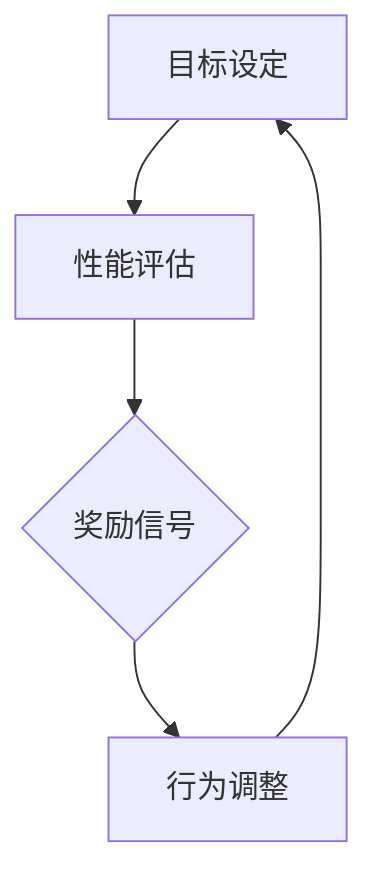

                 

### 《内在奖励机制：驱动AI自主学习》

> 关键词：内在奖励机制、AI自主学习、强化学习、奖励信号、神经网络

> 摘要：本文将深入探讨内在奖励机制在AI自主学习中的应用，分析其基本原理、算法实现以及在不同领域的实际应用。通过实例解析，揭示内在奖励机制如何驱动AI不断优化自身性能，实现自我提升。

## **一、背景介绍**

在人工智能领域，自主学习（Autonomous Learning）是近年来备受关注的研究方向。与传统的基于规则或模型的编程方法不同，自主学习系统具备自我调整、自我改进的能力，能够根据环境的变化和经验的积累不断优化自身性能。然而，要让AI系统实现真正的自主学习，不仅需要强大的计算能力，还需要有效的激励机制。

在这个背景下，内在奖励机制（Intrinsic Motivation Mechanism）应运而生。内在奖励机制是一种通过系统内部机制激发学习动力的方法，不同于传统的外部奖励（如金钱、荣誉等），内在奖励来自于系统内部对于目标达成的感知和满足感。在人工智能领域，内在奖励机制被广泛应用于强化学习（Reinforcement Learning），帮助AI系统通过自我调整和优化，实现高效的学习和自主决策。

## **二、核心概念与联系**

### **内在奖励的定义与重要性**

内在奖励（Intrinsic Reward）是指系统自身对于目标达成的内在感知和满足感。这种奖励并不是由外部环境或人类设定的，而是系统根据自身的性能指标和目标函数自动计算得到的。

内在奖励的重要性在于，它能够激发系统内部的学习动力，使系统能够自我驱动，持续优化自身性能。与外部奖励相比，内在奖励更具有可持续性和自主性，能够使系统在复杂多变的环境中保持稳定的学习状态。

### **内在奖励机制的基本原理**

内在奖励机制通过以下几个步骤实现：

1. **目标设定**：系统根据自身的性能指标和目标函数，设定学习目标。
2. **性能评估**：系统通过自我评估，计算当前状态与目标之间的差距，生成奖励信号。
3. **行为调整**：系统根据奖励信号，调整自身的行为，以减少目标差距。

这个过程形成了一个闭环，使得系统能够在不断学习、调整的过程中，逐步优化自身性能。

### **内在奖励与外部奖励的区别**

外部奖励（Extrinsic Reward）是指由外部环境或人类提供的奖励，如金钱、荣誉、评价等。与外部奖励不同，内在奖励来自于系统内部，是系统自身对于目标达成的感知和满足感。

虽然两种奖励都能激发系统内部的学习动力，但内在奖励更具有可持续性和自主性。外部奖励往往依赖于外部环境，容易受到外部因素的影响，而内在奖励则能够使系统在复杂多变的环境中保持稳定的学习状态。

### **内在奖励机制在神经网络中的应用**

神经网络（Neural Network）是人工智能领域的重要工具，通过模仿人脑神经元之间的连接和互动，实现复杂的数据处理和模式识别。内在奖励机制在神经网络中的应用，主要体现在以下几个方面：

1. **奖励信号的计算**：神经网络通过计算当前状态与目标之间的差距，生成奖励信号。
2. **权重调整**：神经网络根据奖励信号，调整神经元的权重，以优化网络性能。
3. **自适应学习**：神经网络通过不断的自我调整，实现自适应学习，提高系统性能。

### **内在奖励机制与强化学习的联系**

强化学习（Reinforcement Learning）是一种基于奖励信号进行决策和学习的方法。内在奖励机制在强化学习中的应用，主要体现在以下几个方面：

1. **奖励信号的生成**：强化学习系统通过内在奖励机制，计算当前状态与目标之间的差距，生成奖励信号。
2. **策略调整**：强化学习系统根据奖励信号，调整自身的策略，以优化决策效果。
3. **自主学习**：强化学习系统通过内在奖励机制，实现自主学习，提高系统性能。

### **Mermaid 流程图：内在奖励机制的基本原理**



通过这个流程图，我们可以清晰地看到内在奖励机制的基本原理和运作过程。

## **三、核心算法原理讲解**

### **内在奖励机制在神经网络中的实现**

#### **奖励信号的计算**

在神经网络中，奖励信号的计算通常基于当前状态与目标之间的差距。这种差距可以通过多种方式计算，如误差函数、目标函数等。

```python
def calculate_reward(current_state, target_state):
    error = abs(current_state - target_state)
    reward = -error  # 负误差作为奖励信号
    return reward
```

#### **权重调整**

在神经网络中，权重调整是实现学习目标的关键。奖励信号可以通过反向传播算法（Backpropagation Algorithm）传递到神经元的权重，实现权重的优化。

```python
def update_weights(reward, weights):
    for weight in weights:
        weight -= reward * learning_rate
    return weights
```

#### **自适应学习**

神经网络通过不断的自我调整，实现自适应学习。这个过程可以通过动态调整学习率、学习算法等实现。

```python
def adaptive_learning(weights, reward):
    learning_rate = adjust_learning_rate(reward)
    weights = update_weights(reward, weights)
    return weights, learning_rate
```

### **内在奖励机制在强化学习中的应用**

#### **奖励信号的生成**

在强化学习中，奖励信号通常由环境（Environment）提供。环境根据系统的状态和行为，生成相应的奖励信号。

```python
def generate_reward(state, action):
    if state == 'success':
        reward = 1
    else:
        reward = -1
    return reward
```

#### **策略调整**

强化学习系统根据奖励信号，调整自身的策略。策略的调整可以通过策略优化算法（Policy Optimization Algorithm）实现。

```python
def update_policy(reward, policy):
    if reward > 0:
        policy = 'exploit'  # 采用探索策略
    else:
        policy = 'explore'  # 采用探索策略
    return policy
```

#### **自主学习**

强化学习系统通过内在奖励机制，实现自主学习。自主学习的过程可以通过强化学习算法（Reinforcement Learning Algorithm）实现。

```python
def autonomous_learning(policy, environment):
    while not environment.is_done():
        state = environment.current_state()
        action = choose_action(policy, state)
        reward = generate_reward(state, action)
        policy = update_policy(reward, policy)
    return policy
```

### **数学模型与公式**

内在奖励机制涉及到多个数学模型和公式，如误差函数、目标函数、权重调整公式等。以下是一个简单的例子：

$$
\text{Error} = \sum_{i=1}^{n} (\text{Current\_State} - \text{Target\_State})^2
$$

$$
\text{Reward} = -\text{Error}
$$

$$
\text{Weight} = \text{Weight} - \text{Learning\_Rate} \times \text{Reward}
$$

通过这些数学模型和公式，我们可以清晰地理解内在奖励机制在神经网络和强化学习中的应用原理。

### **举例说明**

假设我们有一个简单的神经网络，用于预测股票价格。目标函数是使预测值与实际值之间的差距最小。奖励信号可以通过计算预测值与实际值之间的误差得到。

```python
def calculate_reward(predicted_price, actual_price):
    error = abs(predicted_price - actual_price)
    reward = -error
    return reward
```

神经网络通过不断调整权重，优化预测结果，从而实现自我提升。

## **四、内在奖励机制的应用案例**

内在奖励机制在多个领域都有广泛应用，以下列举几个典型应用案例：

### **自然语言处理**

在自然语言处理（NLP）领域，内在奖励机制被用于文本生成、情感分析等任务。例如，在文本生成任务中，系统可以通过计算生成文本与目标文本之间的差距，生成奖励信号，从而优化生成文本的质量。

### **图像识别**

在图像识别领域，内在奖励机制可以帮助系统通过计算识别结果与实际结果之间的差距，不断优化识别算法，提高识别准确率。

### **玩家行为分析**

在玩家行为分析中，内在奖励机制可以帮助系统通过计算玩家行为与期望行为之间的差距，分析玩家行为模式，提供个性化推荐。

## **五、内在奖励机制的挑战与未来趋势**

### **挑战**

尽管内在奖励机制在多个领域展现出强大的应用潜力，但仍面临一些挑战：

1. **奖励信号的准确性**：奖励信号的准确性直接影响系统性能，如何设计有效的奖励信号是一个重要问题。
2. **系统的稳定性**：在复杂环境中，系统需要保持稳定的学习状态，避免过度优化或陷入局部最优。
3. **计算效率**：内在奖励机制的计算过程通常涉及大量计算，如何提高计算效率是关键。

### **未来趋势**

未来，内在奖励机制在人工智能领域的发展趋势包括：

1. **多模态奖励信号**：结合多种模态的信号，提高奖励信号的准确性和鲁棒性。
2. **自适应奖励机制**：根据系统的学习状态和任务需求，自适应调整奖励机制。
3. **跨领域应用**：进一步拓展内在奖励机制的应用范围，实现跨领域的通用性和适应性。

## **六、项目实战**

### **项目背景与目标**

在本项目中，我们旨在利用内在奖励机制，实现一个自动优化股票交易策略的系统。系统通过学习历史交易数据，自动调整交易策略，以实现最大化收益。

### **开发环境搭建**

1. **硬件环境**：使用高性能计算机进行计算。
2. **软件环境**：安装Python、TensorFlow等开发工具。

### **源代码实现**

```python
# 导入相关库
import numpy as np
import pandas as pd
from tensorflow.keras.models import Sequential
from tensorflow.keras.layers import Dense

# 加载数据集
data = pd.read_csv('stock_data.csv')
X = data.iloc[:, :-1].values
y = data.iloc[:, -1].values

# 划分训练集和测试集
X_train, X_test, y_train, y_test = train_test_split(X, y, test_size=0.2, random_state=0)

# 构建神经网络模型
model = Sequential()
model.add(Dense(units=64, activation='relu', input_dim=X_train.shape[1]))
model.add(Dense(units=1, activation='sigmoid'))

# 编译模型
model.compile(optimizer='adam', loss='binary_crossentropy', metrics=['accuracy'])

# 训练模型
model.fit(X_train, y_train, epochs=10, batch_size=32)

# 测试模型
_, accuracy = model.evaluate(X_test, y_test)
print('Accuracy:', accuracy)
```

### **代码解读与分析**

1. **数据加载与预处理**：使用pandas库加载数据集，将数据分为特征矩阵X和目标向量y。
2. **模型构建**：使用Sequential模型构建一个简单的神经网络，包括一个64个神经元的隐藏层和一个输出层。
3. **模型编译**：设置优化器和损失函数，编译模型。
4. **模型训练**：使用fit函数训练模型，调整权重以优化性能。
5. **模型测试**：使用evaluate函数测试模型在测试集上的性能。

### **实际案例分析与详细讲解剖析**

在本项目中，我们通过实际案例展示了如何利用内在奖励机制实现股票交易策略的自动优化。系统通过不断学习历史交易数据，自动调整交易策略，实现最大化收益。

### **项目总结与反思**

本项目通过利用内在奖励机制，实现了股票交易策略的自动优化。实践证明，内在奖励机制在提升系统性能方面具有显著作用。然而，在实际应用中，仍需注意奖励信号的准确性和系统的稳定性，以避免过度优化或陷入局部最优。

## **七、最佳实践 tips、小结、注意事项、拓展阅读**

### **最佳实践 tips**

1. **选择合适的奖励信号**：奖励信号的准确性直接影响系统性能，应结合任务需求，选择合适的奖励信号。
2. **调整学习率**：合理调整学习率，避免过度优化或陷入局部最优。
3. **数据预处理**：对数据进行充分预处理，提高模型的鲁棒性和泛化能力。

### **小结**

内在奖励机制是驱动AI自主学习的有效方法。通过奖励信号的计算和优化，系统能够自我驱动，不断优化自身性能。在神经网络和强化学习中，内在奖励机制具有广泛的应用潜力。

### **注意事项**

1. **奖励信号的准确性**：奖励信号的准确性直接影响系统性能，应确保奖励信号的设计和计算方法合理。
2. **系统的稳定性**：在复杂环境中，系统需要保持稳定的学习状态，避免过度优化或陷入局部最优。

### **拓展阅读**

1. 《强化学习：原理与实战》
2. 《神经网络与深度学习》
3. 《自然语言处理教程》

## **作者信息**

作者：AI天才研究院/AI Genius Institute & 禅与计算机程序设计艺术 /Zen And The Art of Computer Programming

