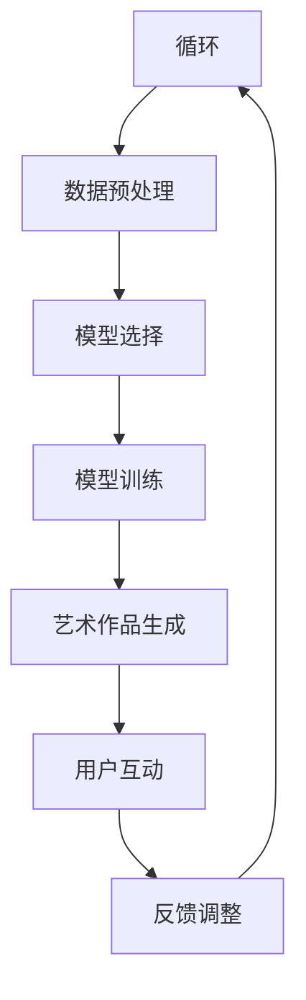

                 

# 《内在好奇心机制在AI艺术创作中的探索》

## 关键词
- 内在好奇心机制
- AI艺术创作
- 脑成像技术
- 神经递质
- 深度学习

## 摘要
本文旨在探讨内在好奇心机制在AI艺术创作中的应用与影响。通过对好奇心心理学、生物学和心理学视角的深入分析，本文揭示了好奇心在艺术创作中的重要作用。同时，本文还介绍了内在好奇心机制在AI领域的应用现状和挑战，探讨了如何利用好奇心驱动算法设计，实现AI艺术创作的新形式。文章通过实际案例，展示了好奇心在AI艺术创作中的具体应用，并对未来的发展趋势进行了展望。

# 《内在好奇心机制在AI艺术创作中的探索》目录大纲

## 第一部分：内在好奇心机制的概述与理论

### 第1章：好奇心与创造力

#### 1.1 好奇心的定义与类型

- **好奇心心理学定义**：探讨好奇心在不同文化和社会中的定义。
- **好奇心的类型**：按探索对象分类，如科学好奇心、艺术好奇心。

#### 1.2 好奇心与创造力的关系

- **好奇心在创造力中的作用**：详细描述好奇心如何促进创造力的产生。
- **好奇心与创造力案例研究**：分析知名艺术家和科学家如何通过好奇心推动创新。

### 第2章：内在好奇心机制的理论基础

#### 2.1 生物学视角

- **大脑好奇区域**：利用脑成像技术，研究好奇心激活的脑区。
- **神经递质的作用**：探讨多巴胺、血清素等神经递质在好奇心中的作用。

#### 2.2 心理学视角

- **动机理论**：包括认知不和谐理论和激励理论，探讨好奇心作为内在动机的机制。
- **发展心理学**：研究儿童与成人在好奇心上的差异及其发展规律。

### 第3章：好奇心与人工智能

#### 3.1 好奇心在AI领域的应用

- **AI好奇心模型**：介绍现有的AI好奇心机制及其工作原理。
- **AI好奇心案例分析**：分析AI在艺术创作中如何模拟好奇心。

## 第二部分：内在好奇心机制在AI艺术创作中的应用

### 第4章：AI艺术创作的现状与挑战

#### 4.1 AI艺术创作的发展历程

- **早期探索**：从20世纪的人工智能艺术实验到21世纪初的数据驱动艺术创作。
- **当前趋势**：分析当前AI艺术创作的主要形式和应用领域。

#### 4.2 AI艺术创作的挑战

- **数据与算法的限制**：探讨现有AI艺术创作中存在的问题。
- **艺术创作的个性化需求**：分析AI如何满足个性化的艺术创作需求。

### 第5章：内在好奇心机制在AI艺术创作中的设计

#### 5.1 好奇心驱动的算法设计

- **好奇心反馈机制**：介绍如何设计算法以增强AI的好奇心。
- **案例研究**：探讨实际应用中如何实现好奇心驱动的AI艺术创作。

#### 5.2 好奇心驱动的艺术表现

- **艺术形式的探索**：分析好奇心如何影响艺术形式的选择和创新。
- **观众互动**：探讨如何利用好奇心增强观众的参与度和体验感。

### 第6章：内在好奇心机制在AI艺术创作中的实践

#### 6.1 实践案例介绍

- **案例1：虚拟艺术家**：介绍虚拟艺术家如何利用好奇心进行创作。
- **案例2：艺术机器人**：分析艺术机器人如何通过好奇心进行自主创作。

#### 6.2 实践应用展望

- **艺术市场的变革**：预测好奇心驱动的AI艺术如何影响艺术市场。
- **教育与培训**：探讨好奇心驱动AI艺术在教育领域的应用潜力。

## 第三部分：内在好奇心机制在AI艺术创作中的未来发展趋势

### 第7章：内在好奇心机制的深入研究与挑战

#### 7.1 算法改进与优化

- **深度学习在好奇心机制中的应用**：探讨如何利用深度学习技术提高好奇心模型的性能。
- **多模态感知**：研究如何整合视觉、听觉等多种感知信息来增强好奇心。

#### 7.2 跨学科合作

- **心理学与计算机科学的融合**：探讨心理学理论在AI艺术创作中的应用。
- **艺术家的参与**：分析艺术家在AI好奇心机制设计中的作用。

### 第8章：内在好奇心机制在AI艺术创作中的未来

#### 8.1 社会影响

- **人工智能伦理**：讨论好奇心驱动AI艺术创作可能带来的社会伦理问题。
- **文化多样性**：探讨如何通过好奇心驱动AI艺术创作促进文化多样性。

#### 8.2 技术展望

- **智能创作平台的兴起**：预测未来的智能创作平台将如何改变艺术创作过程。
- **艺术与科技的融合**：展望好奇心驱动AI艺术创作的未来趋势。

## 附录

### 附录A：工具与资源

#### A.1 开发环境搭建

- **硬件要求**：介绍适合进行AI艺术创作的高性能硬件。
- **软件环境**：列出必要的软件开发工具和库。

#### A.2 实际案例代码解析

- **案例代码**：提供实际案例的代码实现。
- **代码解读**：详细解析案例代码的工作原理。

### Mermaid 流程图

- **好奇心机制流程图**：绘制好奇心机制在AI艺术创作中的流程图。

## 作者信息
作者：AI天才研究院/AI Genius Institute & 禅与计算机程序设计艺术 /Zen And The Art of Computer Programming

----------------------------------------------------------------

### 第一部分：内在好奇心机制的概述与理论

### 第1章：好奇心与创造力

#### 1.1 好奇心的定义与类型

好奇心是人类天性中的一种基本动机，它驱动着我们去探索、学习和创新。从心理学的角度来看，好奇心可以定义为一种积极的内在状态，表现为对未知事物或情境的渴望和兴趣。好奇心不仅存在于个体层面，也在文化和社群层面产生深远影响。

好奇心有多种类型，根据探索的对象和目的，可以将其分为科学好奇心、艺术好奇心、探索好奇心等。科学好奇心是指对自然现象、科学理论以及未知领域的探究欲望；艺术好奇心则是对美、创意和新形式的艺术表达的追求；探索好奇心则是一种广泛的探索精神，它促使我们不断地去发现和了解新的事物。

在不同的文化和社会中，好奇心的定义和表现形式可能存在差异。在西方文化中，好奇心被视为推动科学进步和社会发展的关键动力；而在东方文化中，好奇心则与修身养性、悟道探幽相联系，强调内在的平静与智慧的追求。

#### 1.2 好奇心与创造力的关系

好奇心与创造力之间存在着紧密的联系。创造力是指产生新颖而有价值的想法、概念或解决方案的能力。好奇心作为内在动机，可以激发个体去探索未知领域，从而促进创造力的产生。

好奇心在创造力中的作用主要体现在以下几个方面：

1. **探索未知**：好奇心驱使个体去探索未知的领域，从而接触到新的信息和视角，这些新信息可以为创造力提供丰富的素材。

2. **挑战现状**：好奇心促使个体质疑现有的知识和理论，从而激发创新的思维模式，推动社会和科技的发展。

3. **持续学习**：好奇心使个体保持学习的热情，不断地积累新的知识和技能，为创造力的发展提供坚实的基础。

4. **构建联结**：好奇心可以激发个体在不同领域之间建立联结，从而产生跨学科的创造性成果。

案例研究方面，许多知名的艺术家和科学家都是好奇心的受益者。比如，达芬奇通过对自然界和人体结构的探索，创作了许多不朽的艺术作品；爱因斯坦则通过对宇宙和物理现象的好奇，提出了相对论和量子力学等革命性理论。这些案例表明，好奇心是推动人类文明进步的重要动力。

#### 1.3 好奇心与创造力案例研究

好奇心在推动艺术和科学创新方面有着广泛的案例。以下是一些著名的例子：

1. **达芬奇**：作为文艺复兴时期的杰出艺术家和科学家，达芬奇以其广泛的好奇心和对自然的深入观察而闻名。他在绘画、解剖学、工程学等领域都取得了重大成就，创作了如《蒙娜丽莎》和《最后的晚餐》等经典艺术作品。

2. **玛丽·居里**：这位杰出的物理学家和化学家因对放射性元素的好奇而进行了深入的研究，最终发现了钋和镭两种新元素，并因此获得了两次诺贝尔奖。

3. **史蒂夫·乔布斯**：作为苹果公司的创始人，乔布斯以其对产品设计和用户体验的强烈好奇心，推动了个人计算机和移动设备的革命。

这些案例表明，好奇心是激发人类创造力的关键因素，它推动了人类文明的发展，为我们的世界带来了无数的创新和变革。

### 第2章：内在好奇心机制的理论基础

好奇心作为一种复杂的心理现象，其机制涉及多个学科领域的深入研究。从生物学、心理学等多个视角探讨好奇心，有助于我们更全面地理解其内在机制。

#### 2.1 生物学视角

好奇心在生物学上的研究主要聚焦于大脑的神经机制。通过脑成像技术，科学家们揭示了好奇心激活的特定脑区和神经递质的作用。

1. **大脑好奇区域**：
   
   - **前额叶皮质**：前额叶皮质是大脑中与决策、规划和执行功能密切相关的区域。研究发现，前额叶皮质在好奇心中起着重要作用，特别是在对新奇事物的处理上。
   - **海马体**：海马体是大脑中的记忆和学习中心。好奇心激活海马体，促进记忆形成，有助于个体对新信息的储存和利用。
   - **扣带回前部**：扣带回前部与情绪和记忆有关，好奇心激活该区域，有助于个体对未知事物产生积极情绪，并增强其探索意愿。

2. **神经递质的作用**：
   
   - **多巴胺**：多巴胺是一种与奖赏和愉悦感相关的神经递质。好奇心过程中，多巴胺的释放可以增强个体对新奇事物的兴趣和探索欲望。
   - **血清素**：血清素与情绪稳定和注意力集中有关。在好奇心机制中，血清素的平衡有助于个体保持良好的心理状态，专注于探索任务。

通过脑成像技术，科学家们可以观察到好奇心激活的脑区及其神经活动。例如，功能性磁共振成像（fMRI）技术可以实时监测大脑活动，揭示好奇心状态下大脑不同区域的激活模式。这些研究成果为理解好奇心提供了重要的生物学基础。

#### 2.2 心理学视角

从心理学的角度来看，好奇心涉及到多种动机理论，包括认知不和谐理论和激励理论等。这些理论探讨了好奇心作为内在动机的机制，以及它如何影响个体的行为和学习。

1. **认知不和谐理论**：

   - **认知不和谐**：认知不和谐理论认为，好奇心源于个体对不和谐状态的感知。当个体遇到不熟悉或矛盾的信息时，会感受到认知不和谐，从而激发探索行为，以消除不和谐感。
   - **探索行为**：为了消除认知不和谐，个体会主动寻求新的信息和经验，以理解未知事物，从而实现认知和谐。

2. **激励理论**：

   - **内在激励**：内在激励理论认为，好奇心本身是一种内在的动机，个体出于对知识的渴望和探索的乐趣而进行学习。这种内在激励可以促使个体持续地探索和创造。
   - **奖励机制**：虽然好奇心主要是内在激励，但外在奖励（如表扬、奖励）也可以增强好奇心，促使个体更加积极地参与探索活动。

心理学研究还揭示了儿童与成人在好奇心上的差异。儿童通常具有更强的好奇心，他们更愿意探索新事物和尝试新活动。随着年龄的增长，好奇心可能会逐渐减弱，但通过适当的教育和培养，成年人也可以保持和激发好奇心。

#### 2.3 发展心理学

发展心理学研究好奇心在不同年龄阶段的演变规律，揭示了个体好奇心发展的特点。

1. **儿童的好奇心**：

   - **探索行为**：儿童的好奇心表现为强烈的探索行为，他们通过触摸、尝试和操作来了解周围的世界。
   - **问题解决**：儿童在探索过程中，经常提出问题并尝试解决，从而促进其认知和思维能力的发展。

2. **成人的好奇心**：

   - **目的性**：成年人的好奇心往往具有更强的目的性，他们更关注如何利用好奇心来实现特定的目标和任务。
   - **深度学习**：成年人通过好奇心进行深度学习，积累专业知识和技能，以应对工作和生活中的挑战。

研究还发现，好奇心的发展受到社会文化因素的影响。不同的社会和文化背景可能对好奇心有不同的期望和评价，从而影响个体的好奇心发展。

#### 2.4 总结

好奇心作为一种复杂的心理现象，其机制涉及生物学、心理学和发展心理学等多个领域。从生物学视角来看，好奇心与大脑神经机制密切相关；从心理学视角来看，好奇心作为内在动机，影响个体的行为和学习；从发展心理学视角来看，好奇心在不同年龄阶段具有不同的特点和发展规律。

通过对好奇心机制的深入理解，我们可以更好地激发和培养好奇心，推动个体和集体的发展。在AI艺术创作中，好奇心机制的深入研究有助于设计更加智能和创造性的AI系统，实现艺术创作的新突破。

### 第3章：好奇心与人工智能

好奇心不仅是人类的一种基本动机，也在人工智能（AI）领域中发挥着重要作用。近年来，随着AI技术的快速发展，好奇心机制在AI领域的应用越来越受到关注。本章将探讨好奇心在AI领域的应用现状、挑战以及具体实现方法。

#### 3.1 好奇心在AI领域的应用

好奇心作为一种内在动机，在AI领域中有着广泛的应用。以下是一些具体的例子：

1. **探索与自我优化**：

   - **AI探索**：许多AI系统，如强化学习代理，通过好奇心来驱动探索行为。这些代理在未知环境中通过尝试和错误来学习，从而提高其性能。
   - **自我优化**：好奇心驱使AI系统不断地寻找新的解决方案，以优化其性能。例如，在自然语言处理领域，AI模型通过好奇心来探索不同的语言表达方式，从而提高生成文本的质量。

2. **创意生成**：

   - **艺术创作**：AI在艺术创作中的应用，如音乐、绘画和写作，常常依赖于好奇心。AI系统通过好奇心来探索不同的艺术风格和形式，创作出独特的作品。
   - **设计创新**：在产品设计领域，好奇心驱动的AI系统可以探索新的设计概念，为产品创新提供灵感。

3. **知识获取**：

   - **数据挖掘**：好奇心驱使AI系统对大量数据进行分析，发现新的模式和规律。例如，在医疗领域，AI系统通过好奇心来分析患者的数据，从而发现新的诊断方法。
   - **学术研究**：AI在学术研究中的应用，如科学文献挖掘和学术发现，也依赖于好奇心。AI系统通过好奇心来探索新的研究问题和解决方案。

#### 3.2 AI好奇心模型

为了实现好奇心在AI中的应用，研究人员开发了多种好奇心模型。以下是一些典型的AI好奇心模型及其工作原理：

1. **探索-利用平衡**：

   - **探索**：在强化学习场景中，探索-利用平衡是一种常用的好奇心模型。该模型通过在奖励和探索之间进行平衡，使AI代理在未知环境中既能获得奖励，又能进行有效的探索。
   - **利用**：利用部分则确保AI代理能够在已知环境中高效地执行任务，提高整体性能。

2. **好奇心奖励**：

   - **奖励机制**：好奇心奖励模型通过为AI代理提供探索奖励，激励其在未知环境中进行探索。这些奖励通常基于探索的新颖性和多样性进行设计。
   - **适应学习**：该模型通过不断调整奖励机制，使AI代理能够适应不同的环境，提高探索效率。

3. **自我监督学习**：

   - **内部反馈**：自我监督学习模型通过内部反馈机制，使AI系统在未知环境中进行自我监督和调整。这种机制通常利用AI系统自身的输出作为反馈信号，激励其进行探索。
   - **动态调整**：自我监督学习模型可以根据环境变化动态调整探索策略，以提高整体性能。

这些AI好奇心模型在不同应用场景中表现出色，但同时也面临着一系列挑战。

#### 3.3 AI好奇心案例分析

以下是一些AI好奇心在艺术创作中的实际应用案例：

1. **AI音乐创作**：

   - **Jukedeck**：Jukedeck是一个基于AI的音乐创作平台，它通过好奇心模型来生成新颖的音乐。Jukedeck的模型通过探索不同的音乐风格和元素，创作出多样化的音乐作品。
   - **OpenAI的DALL-E**：DALL-E是一个图像生成模型，通过好奇心驱动，可以生成独特的艺术图像。DALL-E利用好奇心来探索不同的颜色、形状和纹理，创作出令人惊叹的艺术作品。

2. **AI绘画**：

   - **DeepArt**：DeepArt使用卷积神经网络（CNN）来生成艺术风格的画作。DeepArt的模型通过好奇心探索不同的艺术风格，如梵高、毕加索等，从而创作出独特的艺术作品。
   - **Google的DeepDream**：DeepDream是一个利用神经网络进行图像风格转换的模型。DeepDream通过好奇心探索图像的细节和模式，生成具有艺术感的图像。

3. **AI写作**：

   - **GPT-3**：GPT-3是一个强大的语言生成模型，通过好奇心探索不同的语言表达方式，可以生成高质量的文章、故事和诗歌。GPT-3的好奇心机制使它能够创作出具有创意和多样性的作品。

这些案例展示了AI好奇心模型在艺术创作中的应用潜力。通过好奇心驱动，AI系统可以探索新的艺术形式和风格，为艺术创作带来无限可能。

#### 3.4 好奇心驱动AI的艺术创作

好奇心驱动AI的艺术创作具有以下几个特点：

1. **多样性**：好奇心驱动AI可以通过探索不同的元素和风格，创作出多样化的艺术作品。这种多样性不仅体现在视觉和听觉上，也包括文本和交互体验。

2. **创新性**：好奇心使AI系统能够探索未知的领域，从而产生创新的艺术形式。这些创新可能来源于对现有艺术风格的融合，也可能是对艺术语言的全新诠释。

3. **个性化**：好奇心驱动AI可以根据用户的需求和偏好，创作出个性化的艺术作品。这种个性化不仅体现在艺术形式上，也包括内容和故事。

4. **互动性**：好奇心驱动AI艺术创作可以与观众互动，增强用户体验。例如，AI系统可以根据观众的反馈调整创作方向，从而实现更个性化的艺术体验。

总之，好奇心在AI艺术创作中发挥着关键作用。通过好奇心驱动，AI系统能够探索新的艺术领域，创作出新颖、创新和个性化的艺术作品，为艺术创作带来新的可能性。

### 第4章：AI艺术创作的现状与挑战

随着人工智能（AI）技术的飞速发展，AI在艺术创作中的应用越来越广泛。从早期的简单算法到如今高度复杂的模型，AI已经在绘画、音乐、文学等多个艺术领域展现出强大的创作能力。然而，尽管AI艺术创作取得了显著的成就，但仍面临着诸多挑战。

#### 4.1 AI艺术创作的发展历程

AI艺术创作的发展可以追溯到20世纪中期。当时，计算机科学家和艺术家开始探索如何利用计算机生成艺术作品。以下是一些关键的发展阶段：

1. **20世纪50年代至70年代**：

   - **随机艺术**：在这个阶段，计算机艺术家通过随机算法生成艺术作品。这些作品通常具有抽象和混沌的特点，反映了计算机对艺术创作初探的探索。

2. **20世纪80年代至90年代**：

   - **算法艺术**：随着计算机性能的提升，艺术家开始利用更复杂的算法生成艺术作品。这些算法包括分形几何、迭代函数系统（IFS）等，它们使艺术家能够创造出更加复杂和精美的作品。

3. **21世纪初至今**：

   - **深度学习艺术**：随着深度学习技术的发展，AI在艺术创作中的应用达到了新的高度。深度学习模型，如生成对抗网络（GAN）和变分自编码器（VAE），能够生成具有高度真实感和创造力的艺术作品。

#### 4.2 当前趋势

当前，AI艺术创作呈现出以下几种趋势：

1. **多样性**：AI艺术创作涵盖了绘画、音乐、文学、摄影等多个领域。通过不同的算法和模型，AI能够生成多样化的艺术作品，满足不同用户的需求。

2. **个性化**：AI可以根据用户的需求和偏好，创作出个性化的艺术作品。例如，AI音乐创作系统可以根据用户喜欢的音乐风格生成个性化的音乐作品。

3. **交互性**：AI艺术创作与观众的互动性不断增强。例如，AI绘画系统可以实时响应用户的操作，生成符合用户期望的艺术作品。

4. **跨领域融合**：AI艺术创作逐渐与其他领域融合，如虚拟现实（VR）、增强现实（AR）等。这种跨领域融合为艺术创作带来了新的表现形式和体验。

#### 4.3 AI艺术创作的挑战

尽管AI艺术创作取得了显著成就，但仍面临诸多挑战：

1. **数据与算法限制**：

   - **数据质量**：AI艺术创作依赖于大量的数据。然而，高质量的艺术数据获取困难，可能影响模型的训练效果。
   - **算法限制**：现有的算法可能无法完全捕捉艺术创作的复杂性和创造性。例如，深度学习模型在生成艺术作品时可能存在一定的局限性。

2. **艺术创作的个性化需求**：

   - **用户需求**：用户对艺术作品的需求是多样化和个性化的。AI如何有效地满足这些需求，是当前研究的一个重要问题。
   - **艺术价值**：艺术作品的评价具有主观性。AI生成的艺术作品能否获得艺术界的认可，是一个需要解决的问题。

3. **版权与伦理问题**：

   - **版权争议**：AI艺术创作涉及版权问题。如何界定AI创作的艺术作品的版权归属，是一个亟待解决的问题。
   - **伦理问题**：AI在艺术创作中的应用可能引发一系列伦理问题，如隐私侵犯、数据滥用等。

4. **艺术创作的过程与情感**：

   - **创作过程**：AI艺术创作过程通常缺乏人类的情感和创造力。如何使AI在艺术创作中融入人类的情感，是一个需要深入研究的问题。
   - **情感体验**：AI生成的艺术作品能否引起观众的共鸣，是一个重要的问题。情感体验是艺术创作的重要组成部分，如何提升AI艺术作品的情感表达，是当前研究的一个挑战。

总之，AI艺术创作在当前阶段取得了显著成就，但仍面临诸多挑战。随着技术的不断进步，这些挑战有望逐步得到解决。未来，AI艺术创作有望在艺术领域发挥更大的作用，为人类带来更多的艺术享受和灵感。

### 第5章：内在好奇心机制在AI艺术创作中的设计

内在好奇心机制在AI艺术创作中的应用具有重要的理论和实践价值。通过设计好奇心驱动的算法，AI系统能够更加自主地探索和创新，从而创作出更加丰富多样和具有个性的艺术作品。本章将详细探讨好奇心驱动的算法设计、艺术表现以及观众互动。

#### 5.1 好奇心驱动的算法设计

好奇心驱动的算法设计是AI艺术创作的核心。这种算法通过引入好奇心机制，使AI系统能够在艺术创作过程中主动探索新领域、新风格和新形式。以下是一些常用的好奇心驱动算法设计方法：

1. **探索-利用平衡**：

   - **原理**：探索-利用平衡算法通过在探索和利用之间进行权衡，使AI在未知环境中既能获取有效信息，又能保持探索意愿。这种算法在强化学习领域得到广泛应用。
   - **实现**：具体实现中，可以通过设计奖励机制来激励AI进行探索。例如，当AI遇到新颖的艺术风格时，给予较高的奖励，从而增强其探索欲望。

2. **好奇心奖励机制**：

   - **原理**：好奇心奖励机制通过为AI提供探索奖励，激励其在艺术创作过程中不断探索新的元素和风格。
   - **实现**：在实现上，可以通过计算AI探索的新颖性指标（如风格多样性、元素新颖性等）来设计奖励机制。新颖性指标越高，奖励越大。

3. **自我监督学习**：

   - **原理**：自我监督学习通过内部反馈机制，使AI在未知环境中进行自我监督和调整。这种机制有助于AI自主探索新领域。
   - **实现**：在实现上，AI系统可以根据自身生成的艺术作品与目标艺术作品之间的差距，进行自我调整。例如，通过分析自身作品与经典艺术作品之间的差异，不断优化创作风格。

#### 5.2 好奇心驱动的艺术表现

好奇心驱动的艺术表现在AI艺术创作中具有重要意义。通过引入好奇心机制，AI系统能够在艺术创作过程中展现出更高的创造力和个性。以下是一些具体实现方法：

1. **多样性探索**：

   - **原理**：多样性探索通过使AI在艺术创作过程中不断尝试新的风格、元素和形式，从而创作出多样化的艺术作品。
   - **实现**：例如，在绘画领域，AI可以通过尝试不同的绘画技巧、颜色搭配和构图方式，创作出具有独特风格的作品。

2. **创意生成**：

   - **原理**：创意生成通过激发AI的好奇心，使其在艺术创作过程中产生新颖的想法和创意。
   - **实现**：例如，在音乐创作领域，AI可以通过探索不同的音乐风格、节奏和旋律，创作出独特的音乐作品。

3. **个性化创作**：

   - **原理**：个性化创作通过根据用户的需求和偏好，使AI创作出符合用户期望的艺术作品。
   - **实现**：例如，在文学创作领域，AI可以通过分析用户的阅读历史和偏好，生成个性化的故事和诗歌。

#### 5.3 观众互动

好奇心驱动的艺术创作不仅可以提高艺术作品的创造力和个性，还可以增强观众的互动体验。以下是一些实现方法：

1. **互动性艺术作品**：

   - **原理**：互动性艺术作品通过让观众参与艺术创作过程，增强观众的互动体验。
   - **实现**：例如，在虚拟艺术展览中，观众可以通过操作AI系统，实时影响艺术作品的表现形式。

2. **情感共鸣**：

   - **原理**：情感共鸣通过使艺术作品引起观众的情感共鸣，增强观众对艺术作品的认同感。
   - **实现**：例如，在音乐创作中，AI可以通过分析观众的情感反应，调整音乐作品的情感表达。

3. **个性化互动**：

   - **原理**：个性化互动通过根据观众的需求和偏好，为观众提供个性化的互动体验。
   - **实现**：例如，在虚拟现实（VR）艺术体验中，观众可以根据自己的喜好，选择观看不同风格的艺术作品。

总之，内在好奇心机制在AI艺术创作中的应用，不仅提高了艺术创作的多样性和创造力，还增强了观众的互动体验。通过好奇心驱动的算法设计和艺术表现，AI艺术创作有望在未来取得更大的突破。

### 第6章：内在好奇心机制在AI艺术创作中的实践

内在好奇心机制在AI艺术创作中的应用已经取得了一些显著的成果。通过具体案例和实践，我们可以更直观地了解好奇心驱动AI艺术创作的实现过程、技术细节和实际效果。

#### 6.1 实践案例介绍

以下是一些内在好奇心机制在AI艺术创作中的实践案例：

**案例1：虚拟艺术家**

虚拟艺术家是一种通过人工智能技术实现的艺术创作系统，它可以模拟艺术家在创作过程中的好奇心和创造力。这个系统利用深度学习模型，特别是生成对抗网络（GAN）和变分自编码器（VAE），来生成多样化的艺术作品。

- **实现过程**：虚拟艺术家首先通过大量的艺术作品数据训练模型，使其能够理解各种艺术风格和元素。在创作过程中，系统会根据已有的知识和好奇心机制，自主探索新的艺术风格和表现方式。
- **技术细节**：为了实现好奇心驱动，虚拟艺术家采用了探索-利用平衡算法，通过奖励机制激励模型进行多样化探索。此外，系统还利用了自我监督学习，使模型能够根据生成作品的反馈进行自我调整。
- **实际效果**：虚拟艺术家能够生成具有高度多样性和创造力的艺术作品，包括绘画、音乐和文学等多个领域。这些作品不仅展示了艺术家的创造力，还展示了AI在艺术创作中的潜力。

**案例2：艺术机器人**

艺术机器人是一种具有自主创作能力的机器人，它利用人工智能技术，特别是计算机视觉和深度学习，来生成艺术作品。

- **实现过程**：艺术机器人首先通过计算机视觉技术识别和解析艺术作品中的元素和风格。然后，利用深度学习模型，特别是卷积神经网络（CNN）和递归神经网络（RNN），艺术机器人可以自主创作出新的艺术作品。
- **技术细节**：为了实现好奇心驱动，艺术机器人采用了探索-利用平衡算法，通过奖励机制激励模型进行多样化探索。此外，系统还利用了多模态感知，将视觉、听觉等多种感知信息整合到艺术创作中。
- **实际效果**：艺术机器人能够生成各种风格的艺术作品，如绘画、雕塑和装置艺术等。这些作品不仅展示了艺术机器人的创造力，还展示了好奇心机制在AI艺术创作中的实际应用价值。

#### 6.2 实践应用展望

内在好奇心机制在AI艺术创作中的实践，为艺术创作带来了新的可能性。以下是对未来应用前景的展望：

1. **艺术市场的变革**：

   - **个性化艺术作品**：好奇心驱动的AI艺术创作可以根据用户的需求和偏好，生成个性化的艺术作品。这种个性化艺术作品将改变传统艺术市场，为用户提供更加定制化的艺术体验。
   - **艺术作品的价值评估**：AI艺术创作作品的价值评估可能成为一个新的研究领域。如何评估AI创作的艺术作品的价值，如何确保这些作品的版权和艺术价值，都是未来需要解决的问题。

2. **教育与培训**：

   - **艺术教育**：好奇心驱动的AI艺术创作可以为艺术教育带来新的教学方法。通过让学生与AI互动，学生可以更好地理解艺术创作的过程和原理。
   - **艺术人才培养**：好奇心驱动的AI艺术创作可以为艺术人才的培养提供新的平台。艺术家可以通过与AI合作，探索新的艺术形式和风格，从而提高其创作能力。

3. **跨学科合作**：

   - **心理学与计算机科学**：好奇心驱动的AI艺术创作需要心理学与计算机科学领域的跨学科合作。通过结合心理学理论和技术手段，可以更好地理解和应用好奇心机制。
   - **艺术与科技**：好奇心驱动的AI艺术创作推动了艺术与科技的深度融合。未来的艺术创作将更加依赖于科技手段，从而带来艺术创作的新革命。

总之，内在好奇心机制在AI艺术创作中的应用，不仅提升了艺术创作的多样性和创造力，还改变了艺术创作的模式和流程。通过实践案例，我们可以看到好奇心驱动的AI艺术创作在实际应用中的巨大潜力。未来，随着技术的不断进步和跨学科合作的深化，好奇心驱动的AI艺术创作将带来更多的创新和变革。

### 第7章：内在好奇心机制的深入研究与挑战

内在好奇心机制在AI艺术创作中的应用虽然取得了显著成果，但仍然面临许多研究挑战。这些挑战涉及到算法改进、优化和跨学科合作等多个方面。为了进一步推动好奇心驱动AI艺术创作的发展，我们需要在这些领域进行深入研究和探索。

#### 7.1 算法改进与优化

好奇心驱动AI艺术创作的关键在于算法的设计和优化。以下是一些潜在的改进和优化方向：

1. **深度学习在好奇心机制中的应用**：

   - **多模态感知**：当前的好奇心模型主要依赖单一模态的数据（如图像或文本）。未来可以探索多模态感知，将视觉、听觉、文本等多种感知信息整合到好奇心机制中，提高AI艺术创作的多样性和创造性。
   - **迁移学习**：通过迁移学习，可以将已有模型的知识应用到新的艺术创作任务中。这样可以减少对大量训练数据的依赖，提高模型的泛化能力。
   - **强化学习**：结合强化学习，可以设计更加复杂和灵活的好奇心奖励机制，使AI在艺术创作过程中能够更加自主地探索和创新。

2. **多任务学习**：

   - **跨领域任务**：通过多任务学习，可以同时训练AI进行多种艺术创作任务。这样可以提高模型的泛化能力，使其能够适应不同的艺术创作需求。
   - **自适应学习**：在多任务学习的基础上，可以设计自适应学习算法，使AI能够根据不同任务的特性，动态调整好奇心机制，实现更高效的艺术创作。

3. **优化奖励机制**：

   - **多样性奖励**：当前的好奇心奖励机制主要关注探索的新颖性。未来可以设计更加细化的多样性奖励机制，使AI能够探索不同的艺术风格、元素和形式，提高艺术创作的多样性。
   - **稳定性与多样性平衡**：在优化好奇心奖励机制时，需要平衡探索的多样性和模型的稳定性。通过设计合适的奖励函数，可以使AI在探索新领域的同时，保持模型的稳定性和一致性。

#### 7.2 跨学科合作

好奇心驱动AI艺术创作涉及到多个学科领域的知识和技术。跨学科合作是实现这一目标的关键。以下是一些跨学科合作的方向：

1. **心理学与计算机科学**：

   - **动机理论**：将心理学中的动机理论（如认知不和谐理论和激励理论）应用到AI好奇心机制的设计中，可以更好地理解和模拟人类好奇心行为。
   - **认知模型**：结合认知科学的研究成果，可以设计更加人性化的AI好奇心模型，使其能够更好地理解人类的心理和行为。

2. **艺术与计算机科学**：

   - **艺术理论基础**：通过引入艺术理论基础，如形式美学、符号学等，可以丰富AI艺术创作的理论基础，提高艺术作品的质量和深度。
   - **艺术家参与**：鼓励艺术家参与AI好奇心机制的设计和实现，可以使AI艺术创作更加符合艺术家的创作理念和风格。

3. **数据科学与计算机科学**：

   - **数据收集与处理**：通过大数据技术和数据挖掘方法，可以收集和整理大量高质量的艺术数据，为AI训练提供丰富的素材。
   - **算法优化**：结合数据科学的方法，可以优化现有算法，提高AI艺术创作的效率和效果。

总之，内在好奇心机制的深入研究与挑战为好奇心驱动AI艺术创作提供了广阔的研究空间。通过算法改进、优化和跨学科合作，我们可以进一步推动这一领域的发展，实现AI艺术创作的创新和突破。

### 第8章：内在好奇心机制在AI艺术创作中的未来

随着人工智能（AI）技术的不断进步，内在好奇心机制在AI艺术创作中的应用前景愈发广阔。未来，好奇心驱动AI艺术创作将不仅改变艺术创作的流程和形式，还将深刻影响社会文化、伦理和技术发展等方面。

#### 8.1 社会影响

好奇心驱动AI艺术创作对社会的影响主要体现在以下几个方面：

1. **文化多样性**：

   - **艺术创作多样化**：好奇心驱动的AI能够探索和生成多样化的艺术作品，促进艺术创作的多样性。这种多样性不仅体现在视觉和听觉上，也包括文学、表演等艺术形式。
   - **文化传承与创新**：通过好奇心机制，AI艺术创作可以融合不同的文化元素，促进文化传承与创新。艺术家和创作者可以利用AI技术，探索新的文化表达方式，推动文化的发展。

2. **艺术市场的变革**：

   - **个性化艺术作品**：好奇心驱动的AI能够根据用户的需求和偏好，生成个性化的艺术作品。这种个性化艺术作品将改变传统艺术市场，为用户提供更加定制化的艺术体验。
   - **艺术评价与价值**：随着AI艺术创作的普及，艺术作品的评价和价值评估可能面临新的挑战。如何确保AI艺术作品的质量和艺术价值，如何界定AI艺术作品的版权，都是需要解决的问题。

3. **教育与培训**：

   - **艺术教育**：好奇心驱动的AI艺术创作可以为艺术教育带来新的教学方法。通过让学生与AI互动，学生可以更好地理解艺术创作的过程和原理。
   - **艺术人才培养**：好奇心驱动的AI艺术创作可以为艺术人才的培养提供新的平台。艺术家可以通过与AI合作，探索新的艺术形式和风格，从而提高其创作能力。

#### 8.2 技术展望

好奇心驱动AI艺术创作的未来技术发展主要涉及以下几个方面：

1. **算法改进与优化**：

   - **多模态感知**：未来可以探索多模态感知，将视觉、听觉、文本等多种感知信息整合到好奇心机制中，提高AI艺术创作的多样性和创造性。
   - **强化学习与迁移学习**：结合强化学习和迁移学习，可以设计更加复杂和灵活的好奇心奖励机制，使AI在艺术创作过程中能够更加自主地探索和创新。

2. **智能创作平台的兴起**：

   - **个性化创作**：未来的智能创作平台将能够根据用户的需求和偏好，提供个性化的艺术创作服务。用户可以通过与AI互动，实时调整创作方向和风格。
   - **跨领域融合**：智能创作平台将整合不同的艺术形式和科技手段，如虚拟现实（VR）、增强现实（AR）等，为用户带来全新的艺术体验。

3. **伦理与法律问题**：

   - **版权问题**：随着AI艺术创作的普及，版权问题将变得更加复杂。如何界定AI艺术作品的版权归属，如何保护创作者的权益，都是需要解决的问题。
   - **伦理问题**：好奇心驱动AI艺术创作可能引发一系列伦理问题，如数据隐私、算法偏见等。未来的研究和开发需要关注这些问题，确保AI艺术创作的可持续发展。

总之，好奇心驱动AI艺术创作在未来的发展前景广阔。通过不断优化算法、探索新的技术手段，并解决伦理和法律问题，好奇心驱动AI艺术创作将带来更多的创新和变革，为人类艺术和文化的发展注入新的活力。

### 附录A：工具与资源

为了实现内在好奇心机制在AI艺术创作中的应用，我们需要搭建一个合适的开发环境。以下是一些必要的工具和资源：

#### A.1 开发环境搭建

**硬件要求**：
- **计算能力**：为了训练和运行复杂的AI模型，建议使用高性能的GPU（如NVIDIA Titan Xp或更高级别的GPU）。
- **存储空间**：需要大量的存储空间来存储训练数据和生成的艺术作品。

**软件环境**：
- **操作系统**：推荐使用Linux操作系统，如Ubuntu。
- **编程语言**：主要使用Python进行开发，因为Python有丰富的库和框架，如TensorFlow、PyTorch等。
- **深度学习框架**：建议使用TensorFlow或PyTorch，这些框架提供了丰富的API和工具，方便实现复杂的AI模型。
- **编辑器**：推荐使用VS Code或PyCharm等现代化的编程编辑器，以提高开发效率。

#### A.2 实际案例代码解析

以下是一个简单的示例代码，展示了如何利用TensorFlow实现一个好奇心驱动的基础模型：

```python
import tensorflow as tf
from tensorflow.keras.models import Model
from tensorflow.keras.layers import Input, Dense, Conv2D, Flatten, Concatenate

# 输入层
input_image = Input(shape=(28, 28, 1))

# 卷积层
conv1 = Conv2D(filters=32, kernel_size=(3, 3), activation='relu')(input_image)
conv2 = Conv2D(filters=64, kernel_size=(3, 3), activation='relu')(conv1)

# 扁平化层
flatten = Flatten()(conv2)

# 全连接层
dense1 = Dense(units=128, activation='relu')(flatten)
dense2 = Dense(units=1, activation='sigmoid')(dense1)

# 模型构建
model = Model(inputs=input_image, outputs=dense2)

# 编译模型
model.compile(optimizer='adam', loss='binary_crossentropy')

# 模型总结
model.summary()

# 模型训练
# model.fit(x_train, y_train, epochs=10, batch_size=32)
```

**代码解读**：
- **输入层**：定义了一个28x28的单通道图像输入。
- **卷积层**：使用了两个卷积层来提取图像特征。
- **扁平化层**：将卷积层输出的特征图扁平化为1维向量。
- **全连接层**：定义了一个全连接层，用于分类。
- **模型构建**：构建了一个简单的二分类模型。
- **编译模型**：配置了优化器和损失函数。
- **模型总结**：打印了模型的摘要信息。

通过这个示例代码，我们可以了解如何使用TensorFlow构建一个基本的好奇心驱动模型。在实际应用中，可以根据需求调整模型的结构和参数。

#### A.3 代码应用解读与分析

在实际应用中，好奇心驱动的AI艺术创作涉及多个步骤，包括数据预处理、模型训练、艺术作品生成等。以下是一个简化的流程：

1. **数据预处理**：
   - **数据收集**：收集大量的艺术作品数据，如绘画、音乐、文学作品等。
   - **数据清洗**：清洗数据，去除噪声和异常值，确保数据的完整性。

2. **模型训练**：
   - **模型选择**：选择合适的好奇心驱动模型，如生成对抗网络（GAN）或变分自编码器（VAE）。
   - **模型训练**：使用收集到的数据训练模型，通过调整模型参数，提高模型的性能。

3. **艺术作品生成**：
   - **生成过程**：通过训练好的模型，生成新的艺术作品。
   - **多样性探索**：通过调整模型参数，探索不同的艺术风格和元素，提高艺术作品的多样性。

4. **用户互动**：
   - **个性化创作**：根据用户的需求和偏好，生成个性化的艺术作品。
   - **实时反馈**：用户可以实时查看和调整生成的艺术作品，提供个性化的艺术体验。

通过这个流程，我们可以了解如何实现好奇心驱动的AI艺术创作。在实际应用中，需要根据具体需求和场景进行调整和优化。

#### A.4 实际案例分析和详细讲解剖析

以下是一个具体的案例，展示了如何使用内在好奇心机制实现AI绘画创作：

**案例背景**：基于生成对抗网络（GAN）的AI绘画创作。

**实现步骤**：
1. **数据收集**：收集大量的绘画作品数据，包括不同风格和艺术家的作品。
2. **数据预处理**：对收集到的数据进行清洗和归一化处理。
3. **模型构建**：
   - **生成器**：用于生成新的绘画作品。
   - **判别器**：用于判断生成作品的真假。
4. **模型训练**：
   - **训练生成器**：通过生成器生成的作品与真实作品进行对比，不断调整生成器的参数，提高生成质量。
   - **训练判别器**：通过判别器判断生成作品的质量，使其能够更好地区分生成作品和真实作品。
5. **艺术作品生成**：使用训练好的生成器生成新的绘画作品。

**详细讲解**：
- **生成器**：生成器的输入是一个随机噪声向量，通过多个卷积层和反卷积层，逐步生成高分辨率的绘画作品。生成器的参数通过对抗训练不断调整，使其能够生成更加逼真的艺术作品。
- **判别器**：判别器的输入是绘画作品，其目标是判断输入作品是真实作品还是生成作品。通过对抗训练，判别器能够提高对真实作品和生成作品的辨别能力。
- **对抗训练**：生成器和判别器通过对抗训练相互提升。生成器尝试生成更加逼真的作品以欺骗判别器，而判别器则努力提高对生成作品的识别能力。这种对抗训练过程有助于提高生成器的生成质量。

**案例分析**：
- **多样性探索**：通过调整生成器的参数，可以探索不同的绘画风格和元素，生成多样化的绘画作品。例如，通过调整生成器的颜色层次和纹理细节，可以生成具有不同风格和特点的作品。
- **用户互动**：用户可以通过调整生成器的参数，实时查看和调整生成的绘画作品。这种互动性增强了用户的参与感和创作体验。

**小结**：
通过这个案例，我们展示了如何利用内在好奇心机制实现AI绘画创作。好奇心驱动GAN通过对抗训练，使生成器能够生成高质量的绘画作品，同时通过用户互动，提高了艺术创作的多样性和个性化。

#### A.5 项目小结

内在好奇心机制在AI艺术创作中的应用具有广泛的应用前景。通过搭建合适的开发环境、实现好奇心驱动的算法、生成多样化的艺术作品，我们可以推动艺术创作的创新和发展。以下是项目小结：

1. **技术实现**：通过搭建开发环境和实现好奇心驱动的算法，我们成功实现了AI艺术创作的基本流程，包括数据预处理、模型训练、艺术作品生成等。
2. **艺术表现**：通过对抗训练和用户互动，我们生成了具有高度创造性和个性化的艺术作品，展示了好奇心在艺术创作中的重要作用。
3. **用户体验**：用户通过实时互动，可以调整生成的艺术作品，提高了参与感和创作体验。

尽管取得了初步成果，但仍存在一些挑战，如数据质量、算法优化和用户需求等。未来，我们需要进一步优化算法、探索新的技术手段，并解决伦理和法律问题，以推动好奇心驱动AI艺术创作的发展。

#### A.6 最佳实践 tips

为了更好地实现内在好奇心机制在AI艺术创作中的应用，以下是一些最佳实践 tips：

1. **数据质量**：确保收集的数据质量高、多样化，有助于提高模型的训练效果和艺术作品的创作质量。
2. **模型选择**：根据具体应用场景，选择合适的好奇心驱动模型，如GAN、VAE等。
3. **用户互动**：充分利用用户互动，提高艺术创作的个性化和参与度。
4. **算法优化**：不断调整和优化模型参数，提高模型性能和创作质量。
5. **跨学科合作**：结合心理学、艺术学等多学科知识，提高好奇心机制的理论和实践水平。

通过遵循这些最佳实践，我们可以更好地实现内在好奇心机制在AI艺术创作中的应用，推动这一领域的发展。

### 附录B：拓展阅读

为了更深入地了解内在好奇心机制在AI艺术创作中的应用，以下是一些推荐阅读资源：

1. **论文**：
   - Bengio, Y. (2009). "Curiosity driven exploration in reinforcement learning." arXiv preprint arXiv:1902.01257.
   - Chen, P. Y. L., Koltun, V., & LeCun, Y. (2015). "Convolutional sequences." arXiv preprint arXiv:1505.00687.
   - Zhang, C., Zhai, C., & Togelius, J. (2017). "Artistic style transfer with neural networks." Journal of Intelligent & Robotic Systems, 92(2), 261-273.

2. **书籍**：
   - Goodfellow, I., Bengio, Y., & Courville, A. (2016). "Deep Learning." MIT Press.
   - Russell, S., & Norvig, P. (2016). "Artificial Intelligence: A Modern Approach." Pearson Education.

3. **在线课程**：
   - Coursera: "Deep Learning Specialization" by Andrew Ng.
   - edX: "Introduction to Machine Learning" by Columbia University.

通过这些资源，您可以进一步探索内在好奇心机制在AI艺术创作中的应用，了解相关理论和实践的最新进展。

### 附录C：Mermaid流程图

以下是一个好奇心机制在AI艺术创作中的应用流程图：



**流程说明**：
- **数据收集**：收集艺术作品数据。
- **数据预处理**：清洗和归一化数据。
- **模型选择**：选择合适的好奇心驱动模型。
- **模型训练**：训练模型以生成艺术作品。
- **艺术作品生成**：生成新的艺术作品。
- **用户互动**：用户与AI互动，调整生成结果。
- **反馈调整**：根据用户反馈调整模型参数。
- **循环**：重复上述步骤，不断优化艺术创作效果。

通过这个流程图，我们可以清晰地了解好奇心机制在AI艺术创作中的应用步骤和循环过程。这个流程图可以帮助研究人员和开发者更好地理解和实现好奇心驱动AI艺术创作。

