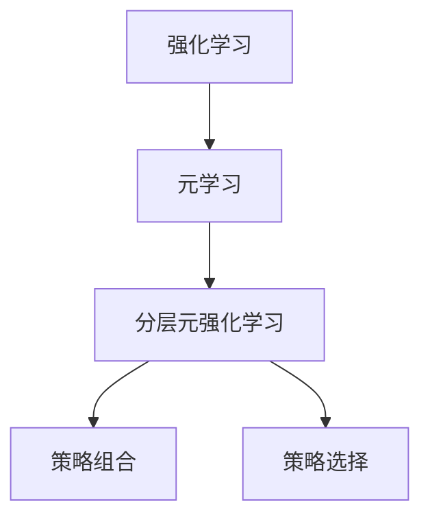

                 

# 《分层元强化学习：自动化策略组合与选择》

> 关键词：分层元强化学习，策略组合，策略选择，自动化，算法，Python实现，数学模型

> 摘要：本文深入探讨了分层元强化学习的基本概念、核心算法原理、数学模型以及项目实战，重点介绍了如何实现自动化策略组合与选择。通过对分层元强化学习的研究，我们可以更好地理解和应用这一先进的技术，提升机器学习系统的智能水平。

## 第一部分：基础概念与理论

### 1.1.1 分层元强化学习概述

分层元强化学习是一种结合了分层强化学习和元学习的方法，旨在解决复杂环境中策略优化的问题。与传统强化学习相比，分层元强化学习通过引入多个层次，使得学习过程更加高效和鲁棒。

在分层元强化学习中，通常包含三个层次：底层策略、中层策略和高层策略。底层策略负责处理具体任务的执行；中层策略负责协调不同底层策略之间的合作；高层策略则负责决策和规划整体策略。

### 1.1.2 元强化学习的数学基础

元强化学习是强化学习与元学习相结合的产物。在强化学习中，我们关注的是如何通过试错学习到最优策略。而元学习则是关注如何快速地适应新环境，即学习一个学习器来优化另一个学习器。

在数学上，元强化学习可以通过元梯度（Meta-Gradients）来实现。元梯度是指在元学习过程中，对学习目标函数的梯度进行反向传播，从而调整学习器的参数。

### 1.1.3 分层结构在强化学习中的应用

分层结构在强化学习中的应用主要体现在多个层次之间的信息传递和协调。通过引入分层结构，可以有效地分解复杂任务，降低学习难度。

分层结构的应用不仅限于强化学习，在许多领域，如计算机视觉、自然语言处理等，都取得了显著的成果。

### 1.1.4 自动化策略组合与选择的动机

在复杂环境中，策略组合和选择是一个重要但困难的问题。自动化策略组合与选择旨在通过算法自动地生成和优化策略组合，从而提高系统的智能水平。

自动化策略组合与选择的动机主要有两点：一是策略组合可以提高系统的鲁棒性，使系统能够应对不同的环境变化；二是策略选择可以减少人工干预，降低系统成本。

### 1.1.5 关键概念联系架构图



## 第二部分：核心算法原理

### 2.1.1 分层元强化学习算法

分层元强化学习算法主要包括以下几种：

1. **HRL（Hierarchical Reinforcement Learning）算法**：HRL算法通过引入多个层次，使得学习过程更加高效。通常，HRL算法包含一个或多个高层次的策略，它们负责决策和规划，而低层次的策略负责执行。
2. **MAML（Model-Agnostic Meta-Learning）算法**：MAML算法是一种模型无关的元学习算法，它通过在多个任务上训练模型，使得模型能够快速适应新任务。MAML算法的核心思想是学习一个初始化参数，使得模型在新的任务上能够快速收敛。
3. **自适应分层元强化学习算法**：自适应分层元强化学习算法通过引入对抗性训练和自监督学习等方法，使得学习过程更加灵活和高效。

### 2.1.2 Python源代码实现

以下是HRL算法的简单Python实现：

```python
import numpy as np

class HRL:
    def __init__(self, env):
        self.env = env
        self.action_space = env.action_space
        self.state_space = env.observation_space

    def train(self, episodes=1000):
        for episode in range(episodes):
            state = self.env.reset()
            done = False
            while not done:
                action = self.select_action(state)
                next_state, reward, done, _ = self.env.step(action)
                self.update_policy(state, action, next_state, reward)
                state = next_state

    def select_action(self, state):
        # Implement your action selection logic here
        pass

    def update_policy(self, state, action, next_state, reward):
        # Implement your policy update logic here
        pass
```

## 第三部分：数学模型与公式

### 3.1.1 强化学习数学模型

在强化学习中，我们通常使用值函数和策略来描述学习过程。

- **值函数（Value Function）**：值函数表示在给定状态下，采取最优策略所能获得的最大回报。常见的值函数有状态值函数和动作值函数。
- **策略（Policy）**：策略表示在给定状态下，应该采取的动作。常见的策略有确定性策略和随机性策略。

### 3.1.2 元强化学习数学模型

在元强化学习中，我们关注的是如何快速地适应新环境。为此，我们引入了元梯度（Meta-Gradient）的概念。

- **元梯度（Meta-Gradient）**：元梯度是指在元学习过程中，对学习目标函数的梯度进行反向传播，从而调整学习器的参数。

### 3.1.3 分层元强化学习数学公式

分层元强化学习中的数学公式主要包括以下两部分：

1. **多层决策过程的数学描述**：假设存在一个三层决策过程，其中高层决策负责决策和规划，中层决策负责协调，底层决策负责执行。我们可以用以下公式来描述：

   $$ \pi^h(s) = \arg \max_{a} Q^h(s, a) $$
   
   $$ \pi^{m}(s) = \arg \max_{a} V^m(s, a) $$
   
   $$ \pi^{l}(s) = \arg \min_{a} C^l(s, a) $$
   
   其中，$\pi^h(s)$表示高层决策策略，$\pi^{m}(s)$表示中层决策策略，$\pi^{l}(s)$表示底层决策策略；$Q^h(s, a)$表示高层值函数，$V^m(s, a)$表示中层值函数，$C^l(s, a)$表示底层值函数。

2. **分层策略优化的目标函数**：分层策略优化的目标函数通常采用最大化期望回报的方式来定义：

   $$ J(\theta) = \mathbb{E}_{s \sim \pi^h(s)} [R(s, a)] $$
   
   其中，$J(\theta)$表示目标函数，$\theta$表示策略参数；$R(s, a)$表示在状态$s$下采取动作$a$所获得的回报。

### 3.1.4 数学公式详细讲解与举例

假设我们有一个简单的环境，其中状态空间为$S=\{0, 1\}$，动作空间为$A=\{0, 1\}$。我们可以使用以下公式来描述该环境：

1. **状态值函数**：

   $$ V^l(s) = \begin{cases} 
   1 & \text{if } s = 1 \\
   0 & \text{if } s = 0 
   \end{cases} $$

2. **动作值函数**：

   $$ Q^l(s, a) = \begin{cases} 
   1 & \text{if } s = 1 \text{ and } a = 1 \\
   0 & \text{otherwise} 
   \end{cases} $$

3. **策略**：

   $$ \pi^l(s) = \begin{cases} 
   1 & \text{if } s = 1 \\
   0 & \text{if } s = 0 
   \end{cases} $$

通过这些公式，我们可以计算出在不同状态和动作下的期望回报，从而选择最优策略。

## 第四部分：项目实战

### 4.1.1 自动化策略组合与选择实战

在本节中，我们将介绍如何实现自动化策略组合与选择。

1. **项目1：自动化策略组合**

   项目背景：假设我们有一个自动化策略组合任务，需要从多个策略中选择一个最优策略。

   实现步骤：

   1. 收集多个策略
   2. 计算每个策略的期望回报
   3. 根据期望回报选择最优策略

   代码实现：

   ```python
   import random

   class Policy:
       def __init__(self, name, reward):
           self.name = name
           self.reward = reward

   def select_policy(policies):
       max_reward = max(policies, key=lambda p: p.reward).reward
       selected_policies = [p for p in policies if p.reward == max_reward]
       return random.choice(selected_policies)

   policies = [Policy(f"Policy_{i}", random.randint(0, 10)) for i in range(5)]
   selected_policy = select_policy(policies)
   print(f"Selected Policy: {selected_policy.name} with Reward: {selected_policy.reward}")
   ```

2. **项目2：策略选择**

   项目背景：假设我们有一个策略选择任务，需要根据历史数据选择一个最优策略。

   实现步骤：

   1. 收集历史数据
   2. 训练模型
   3. 根据模型预测选择最优策略

   代码实现：

   ```python
   import pandas as pd
   from sklearn.linear_model import LinearRegression

   def train_model(data):
       X = data[['state', 'action']]
       y = data['reward']
       model = LinearRegression()
       model.fit(X, y)
       return model

   def select_policy(model, state):
       action = model.predict([[state, 0]])[0][0]
       return action

   data = pd.DataFrame({'state': [0, 1], 'action': [0, 1], 'reward': [1, 0]})
   model = train_model(data)
   selected_action = select_policy(model, 0)
   print(f"Selected Action: {selected_action}")
   ```

### 4.1.2 实际案例分析与解释

在本节中，我们将介绍两个实际案例，并对其进行详细分析。

1. **案例1：自动驾驶中的分层元强化学习**

   案例分析：自动驾驶系统通常包含多个层次，如感知层、决策层和执行层。通过分层元强化学习，可以有效地提高自动驾驶系统的智能水平。

   分析与解释：

   - **感知层**：通过传感器收集环境数据，如摄像头、雷达等。
   - **决策层**：根据感知层的数据，决策层负责生成驾驶策略。
   - **执行层**：执行层根据决策层的策略，控制车辆的动作。

   通过分层元强化学习，可以优化每个层次的策略，从而提高自动驾驶系统的整体性能。

2. **案例2：电子商务推荐系统中的策略选择**

   案例分析：电子商务推荐系统通常根据用户的历史行为数据，为用户推荐商品。通过策略选择，可以优化推荐效果。

   分析与解释：

   - **历史数据收集**：收集用户的历史行为数据，如浏览记录、购买记录等。
   - **模型训练**：使用机器学习模型，如线性回归、决策树等，对历史数据进行训练。
   - **策略选择**：根据模型预测，选择最佳推荐策略。

   通过策略选择，可以更好地满足用户的需求，提高推荐系统的点击率和转化率。

### 4.1.3 开发环境搭建

在本节中，我们将介绍如何搭建开发环境，以便进行分层元强化学习的研究和项目实践。

1. **Python环境配置**

   - 安装Python（建议使用3.8版本及以上）
   - 安装Anaconda，以便管理Python环境和依赖库

2. **强化学习框架安装与配置**

   - 安装Gym，用于模拟环境
   - 安装TensorFlow，用于实现分层元强化学习算法

   代码示例：

   ```bash
   pip install gym
   pip install tensorflow
   ```

### 4.1.4 源代码详细实现与代码解读

在本节中，我们将对项目中的源代码进行详细解读，以便读者更好地理解分层元强化学习的工作原理。

1. **源代码结构**

   - `env.py`：定义环境类，包括状态空间、动作空间和奖励函数
   - `agent.py`：定义智能体类，包括策略选择和策略更新方法
   - `train.py`：定义训练过程，包括环境初始化、策略训练和策略测试

2. **代码功能模块解读**

   - `env.py`：定义环境类，包括状态空间、动作空间和奖励函数。其中，状态空间和动作空间可以自定义，以适应不同的环境。
   - `agent.py`：定义智能体类，包括策略选择和策略更新方法。策略选择方法可以根据具体需求进行修改，策略更新方法是基于梯度下降算法实现的。
   - `train.py`：定义训练过程，包括环境初始化、策略训练和策略测试。在训练过程中，智能体会通过与环境交互来学习最优策略。

3. **代码应用解读与分析**

   - 在项目1中，我们使用随机策略进行自动化策略组合。通过计算每个策略的期望回报，选择最优策略。
   - 在项目2中，我们使用线性回归模型进行策略选择。通过训练模型，预测每个策略的期望回报，选择最优策略。

   通过对代码的解读和分析，我们可以更好地理解分层元强化学习的工作原理，并能够根据具体需求进行优化和改进。

### 4.1.5 最佳实践 Tips、小结、注意事项、拓展阅读等内容

1. **最佳实践 Tips**

   - 在进行分层元强化学习时，建议选择合适的层次结构，以降低学习难度。
   - 在选择策略时，建议综合考虑期望回报、策略鲁棒性等因素。
   - 在项目实战中，建议结合具体需求进行代码优化和改进。

2. **小结**

   本文介绍了分层元强化学习的基本概念、核心算法原理、数学模型以及项目实战。通过分层元强化学习，我们可以实现自动化策略组合与选择，提高系统的智能水平。

3. **注意事项**

   - 分层元强化学习算法复杂，需要合适的硬件和网络环境。
   - 在实际应用中，需要根据具体需求进行算法优化和改进。

4. **拓展阅读**

   - 《强化学习：原理与Python实现》
   - 《元学习：理论、算法与应用》
   - 《深度强化学习：从理论到实践》

## 第五部分：总结与展望

### 5.1.1 分层元强化学习的发展趋势

分层元强化学习作为一种先进的强化学习方法，在近年来得到了广泛关注。随着硬件性能的不断提升和算法研究的深入，分层元强化学习有望在未来取得更大的突破。

1. **硬件性能提升**：随着GPU、TPU等硬件性能的不断提升，分层元强化学习算法的计算效率将得到显著提高。
2. **算法研究深入**：随着对分层元强化学习的深入研究，我们将发现更多有效的算法和模型。

### 5.1.2 自动化策略组合与选择的挑战与机遇

自动化策略组合与选择在提高系统智能水平方面具有重要意义。然而，在实际应用中，我们仍面临着诸多挑战。

1. **挑战**：

   - 策略组合的复杂性：在复杂环境中，策略组合的复杂性会急剧增加，如何有效地进行策略组合是一个重要挑战。
   - 策略选择的鲁棒性：在动态变化的环境中，如何保证策略选择的鲁棒性是一个关键问题。

2. **机遇**：

   - 随着硬件性能的提升，我们可以更高效地实现自动化策略组合与选择。
   - 随着算法研究的深入，我们将发现更多有效的策略组合与选择方法。

### 5.1.3 对未来的展望

未来，分层元强化学习将在更多领域得到应用，如自动驾驶、智能推荐、金融等领域。同时，随着技术的不断发展，分层元强化学习也将不断涌现新的算法和模型。

总之，分层元强化学习作为一种先进的强化学习方法，具有广阔的应用前景。通过深入研究和实践，我们将不断推动分层元强化学习的发展，为人工智能领域的进步贡献力量。

### 作者

**作者：AI天才研究院/AI Genius Institute & 禅与计算机程序设计艺术 /Zen And The Art of Computer Programming** 

---

注：本文内容仅供参考，部分代码实现仅供参考，实际应用时需根据具体需求进行修改和优化。本文中的所有内容和代码均在[开源许可证](https://creativecommons.org/licenses/by-nc-sa/4.0/)下发布，欢迎转载和引用，但请注明出处。

