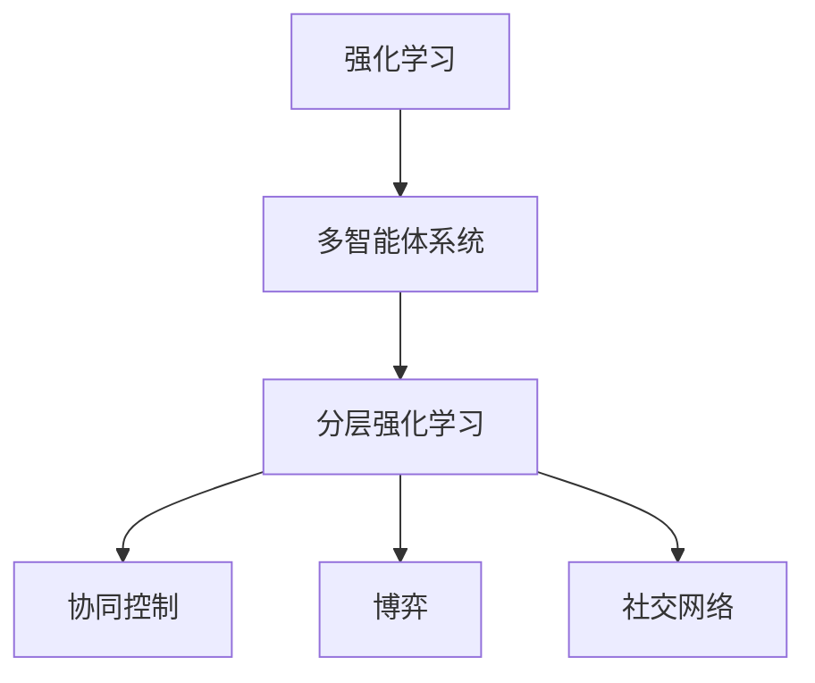

                 

### 《分层强化学习在多智能体协作任务中的应用》

**关键词**：强化学习、多智能体系统、分层策略、协同控制、博弈、社交网络

**摘要**：
本文深入探讨了分层强化学习在多智能体协作任务中的应用。首先，我们回顾了强化学习与多智能体系统的基本概念，介绍了模型-free和模型-based方法。接着，详细阐述了分层强化学习的理论，包括分层策略学习和分层价值函数学习。随后，我们重点讨论了分层强化学习在多智能体协同控制、博弈和社交网络等领域的具体应用，并通过实际案例进行了分析。最后，总结了分层强化学习的进展与未来发展方向。

----------------------------------------------------------------

### 第一部分：背景与基础

#### 第1章：强化学习与多智能体系统的基本概念

##### 1.1 强化学习的基本原理

强化学习是一种无监督机器学习方法，它通过奖励机制使智能体在环境中通过试错学习到最优策略。强化学习的主要目标是使智能体获得最大累积奖励。

###### 1.1.1 强化学习的定义
强化学习（Reinforcement Learning, RL）是一种使机器通过与环境的交互来学习最优行为策略的机器学习方法。在强化学习中，智能体（Agent）通过执行动作（Action）来改变环境（Environment）的状态（State），并从环境中获得即时奖励（Reward）。学习过程的目标是使智能体能够最大化长期的累积奖励。

###### 1.1.2 强化学习的主要算法
强化学习的主要算法包括：

1. **值函数方法**：通过学习值函数来评估状态或状态-动作对的价值。常见的值函数方法包括Q-learning和SARSA。
2. **策略方法**：直接学习策略，即智能体根据当前状态选择最优动作的方法。常见的策略方法包括REINFORCE和PPO。
3. **模型学习方法**：通过学习环境模型来预测未来的状态和奖励。常见的模型学习方法包括Actor-Critic和DQN。

##### 1.2 多智能体系统的基本概念

多智能体系统（Multi-Agent System, MAS）是由多个相互合作的智能体组成的系统。这些智能体可以独立或协作地完成复杂的任务。

###### 1.2.1 多智能体系统的定义
多智能体系统（MAS）是指由多个自主智能体组成的系统，这些智能体可以相互通信和协作，以共同实现一个或多个目标。在MAS中，智能体可以是物理实体（如机器人、无人机）或虚拟实体（如软件代理、经济代理）。

###### 1.2.2 多智能体系统的主要挑战
多智能体系统面临的主要挑战包括：

1. **通信与协调**：智能体之间的有效通信和协调是实现协同任务的关键。
2. **不确定性**：智能体可能面临环境中的不确定性和个体行为的不可预测性。
3. **计算效率**：在复杂环境中，计算资源可能成为智能体协作的瓶颈。
4. **公平性**：在多智能体系统中，如何保证每个智能体都能公平地获取资源并完成任务。

#### 第2章：多智能体强化学习的基本方法

##### 2.1 模型-free 方法

模型-free方法是指不依赖于环境模型，仅通过直接交互学习最优策略的方法。

###### 2.1.1 基于迭代的策略学习
基于迭代的策略学习方法包括SARSA和Q-learning。SARSA是一种基于策略的学习方法，它通过迭代更新策略来优化行为。Q-learning是一种基于值函数的学习方法，它通过迭代更新值函数来评估状态-动作对的价值。

###### 2.1.2 基于策略梯度的方法
基于策略梯度的方法包括REINFORCE和PPO。REINFORCE方法通过反向传播梯度来更新策略参数，而PPO方法则通过优化策略梯度的估计来稳定更新策略。

##### 2.2 模型-based 方法

模型-based方法是指通过学习环境模型来预测未来的状态和奖励，从而优化智能体行为的方法。

###### 2.2.1 基于值函数的方法
基于值函数的方法包括Actor-Critic方法。Actor-Critic方法通过学习值函数和策略来优化智能体的行为。其中，Actor负责更新策略，而Critic负责评估策略的质量。

###### 2.2.2 基于模型预测的方法
基于模型预测的方法包括DQN和DDPG。DQN方法通过深度神经网络来预测Q值，而DDPG方法通过学习状态-动作值函数来优化策略。

#### 第3章：分层强化学习理论

##### 3.1 分层强化学习概述

分层强化学习是一种将复杂任务分解为多个层次的方法，通过逐层学习来提高智能体的决策能力。

###### 3.1.1 分层强化学习的定义
分层强化学习（Hierarchical Reinforcement Learning, HRL）是一种将复杂任务分解为多个层次的方法。在每个层次上，智能体学习不同的策略，从而简化问题的复杂性。

###### 3.1.2 分层强化学习的优点
分层强化学习的优点包括：

1. **简化问题**：通过将任务分解为多个层次，可以降低问题的复杂性。
2. **高效学习**：智能体可以逐层学习，提高学习效率。
3. **灵活性**：可以根据任务需求灵活调整层次结构。

##### 3.2 分层策略学习

分层策略学习是指通过构建多层策略网络来优化智能体的行为。

###### 3.2.1 分层策略网络
分层策略网络由多个策略网络组成，每个策略网络负责不同的层次。上层策略网络负责生成较低层策略网络的行为。

###### 3.2.2 分层策略的优化方法
分层策略的优化方法包括：

1. **独立优化**：每个策略网络独立优化，无需考虑其他策略网络。
2. **协同优化**：通过联合优化策略网络来提高整体性能。

##### 3.3 分层价值函数学习

分层价值函数学习是指通过构建多层价值函数网络来评估状态-动作对的价值。

###### 3.3.1 分层价值函数的表示
分层价值函数由多个价值函数组成，每个价值函数负责不同的层次。上层价值函数评估较高层策略的行为，而下层价值函数评估较低层策略的行为。

###### 3.3.2 分层价值函数的学习方法
分层价值函数的学习方法包括：

1. **直接学习**：直接学习整体价值函数，无需分层。
2. **分层学习**：通过分层学习来提高价值函数的精度和效率。

### 第二部分：分层强化学习在多智能体协作任务中的应用

#### 第4章：分层强化学习在多智能体协同控制中的应用

##### 4.1 多智能体协同控制的基本问题

多智能体协同控制是指多个智能体通过协作实现共同目标的过程。

###### 4.1.1 多智能体协同控制的定义
多智能体协同控制（Multi-Agent Cooperative Control）是指多个智能体在特定环境下，通过协同合作，共同完成某个任务或目标的过程。

###### 4.1.2 多智能体协同控制的目标
多智能体协同控制的目标通常包括：

1. **优化整体性能**：通过协同合作，提高整体系统的性能。
2. **提高鲁棒性**：通过多个智能体的协作，提高系统在面对不确定性和干扰时的鲁棒性。
3. **降低通信成本**：通过优化通信策略，降低智能体之间的通信成本。

##### 4.2 分层强化学习在多智能体协同控制中的实现

分层强化学习可以通过构建分层策略网络和价值函数网络，实现多智能体协同控制。

###### 4.2.1 分层策略网络的构建
分层策略网络的构建通常包括以下步骤：

1. **划分层次**：根据任务需求，将智能体划分为不同的层次。
2. **设计策略网络**：为每个层次设计相应的策略网络，负责生成较低层策略网络的行为。

###### 4.2.2 分层价值函数的构建
分层价值函数的构建通常包括以下步骤：

1. **划分层次**：根据任务需求，将价值函数划分为不同的层次。
2. **设计价值函数**：为每个层次设计相应的价值函数，负责评估较低层策略的行为。

##### 4.3 分层强化学习在多智能体协同控制中的案例研究

###### 4.3.1 案例一：多机器人协作搬运
在多机器人协作搬运任务中，多个机器人需要共同完成物品的搬运工作。通过分层强化学习，可以设计出一种有效的协同控制策略，使得机器人能够高效地完成搬运任务。

###### 4.3.2 案例二：多无人机协同搜索
在多无人机协同搜索任务中，多个无人机需要协同合作，实现对特定区域的高效搜索。通过分层强化学习，可以设计出一种有效的协同控制策略，使得无人机能够高效地协同工作。

#### 第5章：分层强化学习在多智能体博弈中的应用

##### 5.1 多智能体博弈的基本问题

多智能体博弈是指多个智能体在特定环境下，通过竞争和协作来达成某种目标的过程。

###### 5.1.1 多智能体博弈的定义
多智能体博弈（Multi-Agent Game）是指多个智能体在特定环境下，通过竞争和协作来达成某种目标的过程。在这个过程中，智能体需要根据其他智能体的行为来调整自己的策略。

###### 5.1.2 多智能体博弈的策略
多智能体博弈的策略通常包括：

1. **竞争策略**：智能体通过竞争来争夺资源或达成目标。
2. **协作策略**：智能体通过协作来共同完成某个任务或目标。
3. **混合策略**：智能体在竞争和协作之间进行权衡，以实现最优策略。

##### 5.2 分层强化学习在多智能体博弈中的实现

分层强化学习可以通过构建分层策略网络和价值函数网络，实现多智能体博弈中的策略优化。

###### 5.2.1 分层策略网络的构建
分层策略网络的构建通常包括以下步骤：

1. **划分层次**：根据任务需求，将智能体划分为不同的层次。
2. **设计策略网络**：为每个层次设计相应的策略网络，负责生成较低层策略网络的行为。

###### 5.2.2 分层价值函数的构建
分层价值函数的构建通常包括以下步骤：

1. **划分层次**：根据任务需求，将价值函数划分为不同的层次。
2. **设计价值函数**：为每个层次设计相应的价值函数，负责评估较低层策略的行为。

##### 5.3 分层强化学习在多智能体博弈中的案例研究

###### 5.3.1 案例一：多机器人资源争夺
在多机器人资源争夺任务中，多个机器人需要竞争有限的资源，如充电站或工作区。通过分层强化学习，可以设计出一种有效的策略，使得机器人能够合理地争夺资源，并实现整体利益最大化。

###### 5.3.2 案例二：多无人机攻击防御
在多无人机攻击防御任务中，多个无人机需要协同防御敌方无人机的攻击。通过分层强化学习，可以设计出一种有效的策略，使得无人机能够协同作战，并实现对敌方无人机的高效防御。

#### 第6章：分层强化学习在多智能体社交网络中的应用

##### 6.1 多智能体社交网络的基本概念

多智能体社交网络是指由多个智能体组成的社交网络，这些智能体可以通过社交互动来交换信息和资源。

###### 6.1.1 多智能体社交网络的定义
多智能体社交网络（Multi-Agent Social Network）是指由多个智能体组成的社交网络，这些智能体可以通过社交互动来交换信息和资源。

###### 6.1.2 多智能体社交网络的主要特征
多智能体社交网络的主要特征包括：

1. **分布式性**：智能体分布在不同的地理位置，通过网络进行通信。
2. **动态性**：智能体的加入和退出是动态的，网络结构不断变化。
3. **异质性**：不同智能体具有不同的信息和资源，网络具有异质性。

##### 6.2 分层强化学习在多智能体社交网络中的实现

分层强化学习可以通过构建分层策略网络和价值函数网络，实现多智能体社交网络中的社交互动。

###### 6.2.1 分层策略网络的构建
分层策略网络的构建通常包括以下步骤：

1. **划分层次**：根据社交网络的结构，将智能体划分为不同的层次。
2. **设计策略网络**：为每个层次设计相应的策略网络，负责生成较低层策略网络的行为。

###### 6.2.2 分层价值函数的构建
分层价值函数的构建通常包括以下步骤：

1. **划分层次**：根据社交网络的结构，将价值函数划分为不同的层次。
2. **设计价值函数**：为每个层次设计相应的价值函数，负责评估较低层策略的行为。

##### 6.3 分层强化学习在多智能体社交网络中的案例研究

###### 6.3.1 案例一：社交网络中的信息传播
在社交网络中，信息传播是一个重要问题。通过分层强化学习，可以设计出一种有效的策略，使得信息能够高效地传播，并避免虚假信息的传播。

###### 6.3.2 案例二：社交网络中的协同过滤
在社交网络中，协同过滤是一种常用的推荐方法。通过分层强化学习，可以设计出一种有效的协同过滤策略，使得推荐系统能够更准确地预测用户的兴趣。

### 第7章：总结与展望

##### 7.1 分层强化学习在多智能体协作任务中的进展

分层强化学习在多智能体协作任务中取得了显著进展，主要表现在：

1. **效率提升**：分层强化学习通过分解任务，提高了智能体的学习效率。
2. **灵活性增强**：分层强化学习可以根据任务需求，灵活调整层次结构。
3. **鲁棒性提高**：分层强化学习通过分层策略和价值函数的学习，提高了智能体在面对不确定性时的鲁棒性。

##### 7.1.1 成就与挑战
分层强化学习在多智能体协作任务中的成就包括：

1. **高效协同**：分层强化学习在多机器人协作搬运、多无人机协同搜索等领域取得了显著效果。
2. **策略优化**：分层强化学习通过分层策略学习，实现了更优的智能体行为。

然而，分层强化学习仍面临以下挑战：

1. **计算复杂性**：分层强化学习在计算资源受限的环境中可能面临计算复杂性。
2. **不确定性处理**：在多智能体系统中，环境中的不确定性和个体行为的不可预测性是一个挑战。
3. **层次结构设计**：如何设计合适的层次结构，以提高学习效率和性能，是一个重要问题。

##### 7.1.2 未来发展方向
未来，分层强化学习在多智能体协作任务中的发展方向包括：

1. **自适应层次结构**：研究如何自适应地调整层次结构，以适应不同任务的需求。
2. **混合模型方法**：结合模型-free和模型-based方法，提高智能体的学习效率和性能。
3. **不确定性处理**：研究如何有效处理环境中的不确定性和个体行为的不可预测性。

##### 7.2 进一步研究方向与实际应用前景

分层强化学习在多智能体协作任务中具有广泛的应用前景。未来研究方向包括：

1. **工业应用**：在工业自动化、机器人协作等领域，分层强化学习可以用于优化生产流程和提高效率。
2. **智能交通**：在智能交通系统中，分层强化学习可以用于优化交通流量和减少拥堵。
3. **无人驾驶**：在无人驾驶领域，分层强化学习可以用于优化车辆行驶路径和协同控制。

分层强化学习在多智能体协作任务中的应用，有望推动智能系统的发展，实现更高效、更鲁棒的协作。

### Mermaid 流程图

以下是一个示例的 Mermaid 流程图，展示了强化学习在多智能体协作任务中的概念关系：



### Python 源代码示例

以下是一个简单的 Python 源代码示例，用于解释强化学习的基本原理：

```python
import numpy as np

# 定义环境
class Environment:
    def __init__(self):
        self.state = 0

    def step(self, action):
        if action == 0:
            self.state += 1
        elif action == 1:
            self.state -= 1
        reward = -1 if self.state != 0 else 10
        return self.state, reward

# 定义强化学习算法
class QLearning:
    def __init__(self, alpha=0.1, gamma=0.9):
        self.alpha = alpha
        self.gamma = gamma
        self.Q = {}

    def select_action(self, state):
        if np.random.rand() < 1 - self.epsilon:
            action = np.argmax(self.Q.get(state, [0, 0]))
        else:
            action = np.random.choice([0, 1])
        return action

    def update_Q(self, state, action, reward, next_state):
        target = reward + self.gamma * np.max(self.Q.get(next_state, [0, 0]))
        current_Q = self.Q.get(state, [0, 0])[action]
        self.Q[state][action] = current_Q + self.alpha * (target - current_Q)

# 实例化环境
env = Environment()

# 实例化 Q 学习算法
q_learning = QLearning()

# 训练算法
for episode in range(1000):
    state = env.state
    while True:
        action = q_learning.select_action(state)
        next_state, reward = env.step(action)
        q_learning.update_Q(state, action, reward, next_state)
        state = next_state
        if state == 0:
            break

# 测试算法
env = Environment()
state = env.state
while True:
    action = np.argmax(q_learning.Q.get(state, [0, 0]))
    next_state, reward = env.step(action)
    print(f"State: {state}, Action: {action}, Reward: {reward}")
    state = next_state
    if state == 0:
        break
```

### 完整文章结构

#### 目录

```markdown
# 《分层强化学习在多智能体协作任务中的应用》

## **关键词**

- 强化学习
- 多智能体系统
- 分层策略
- 协同控制
- 博弈
- 社交网络

## **摘要**

本文深入探讨了分层强化学习在多智能体协作任务中的应用，包括其基本原理、方法、实现以及在协同控制、博弈和社交网络等领域的实际应用。通过具体案例，展示了分层强化学习在提升智能体协作效率、优化策略和提升系统鲁棒性方面的优势。

## **第一部分：背景与基础**

### 第1章：强化学习与多智能体系统的基本概念

#### 1.1 强化学习的基本原理

##### 1.1.1 强化学习的定义
##### 1.1.2 强化学习的主要算法

#### 1.2 多智能体系统的基本概念

##### 1.2.1 多智能体系统的定义
##### 1.2.2 多智能体系统的主要挑战

### 第2章：多智能体强化学习的基本方法

#### 2.1 模型-free 方法

##### 2.1.1 基于迭代的策略学习
##### 2.1.2 基于策略梯度的方法

#### 2.2 模型-based 方法

##### 2.2.1 基于值函数的方法
##### 2.2.2 基于模型预测的方法

### 第3章：分层强化学习理论

#### 3.1 分层强化学习概述

##### 3.1.1 分层强化学习的定义
##### 3.1.2 分层强化学习的优点

#### 3.2 分层策略学习

##### 3.2.1 分层策略网络
##### 3.2.2 分层策略的优化方法

#### 3.3 分层价值函数学习

##### 3.3.1 分层价值函数的表示
##### 3.3.2 分层价值函数的学习方法

## **第二部分：分层强化学习在多智能体协作任务中的应用**

### 第4章：分层强化学习在多智能体协同控制中的应用

#### 4.1 多智能体协同控制的基本问题

##### 4.1.1 多智能体协同控制的定义
##### 4.1.2 多智能体协同控制的目标

#### 4.2 分层强化学习在多智能体协同控制中的实现

##### 4.2.1 分层策略网络的构建
##### 4.2.2 分层价值函数的构建

#### 4.3 分层强化学习在多智能体协同控制中的案例研究

##### 4.3.1 案例一：多机器人协作搬运
##### 4.3.2 案例二：多无人机协同搜索

### 第5章：分层强化学习在多智能体博弈中的应用

#### 5.1 多智能体博弈的基本问题

##### 5.1.1 多智能体博弈的定义
##### 5.1.2 多智能体博弈的策略

#### 5.2 分层强化学习在多智能体博弈中的实现

##### 5.2.1 分层策略网络的构建
##### 5.2.2 分层价值函数的构建

#### 5.3 分层强化学习在多智能体博弈中的案例研究

##### 5.3.1 案例一：多机器人资源争夺
##### 5.3.2 案例二：多无人机攻击防御

### 第6章：分层强化学习在多智能体社交网络中的应用

#### 6.1 多智能体社交网络的基本概念

##### 6.1.1 多智能体社交网络的定义
##### 6.1.2 多智能体社交网络的主要特征

#### 6.2 分层强化学习在多智能体社交网络中的实现

##### 6.2.1 分层策略网络的构建
##### 6.2.2 分层价值函数的构建

#### 6.3 分层强化学习在多智能体社交网络中的案例研究

##### 6.3.1 案例一：社交网络中的信息传播
##### 6.3.2 案例二：社交网络中的协同过滤

## **第7章：总结与展望**

#### 7.1 分层强化学习在多智能体协作任务中的进展

##### 7.1.1 成就与挑战
##### 7.1.2 未来发展方向

#### 7.2 进一步研究方向与实际应用前景

##### 7.2.1 研究方向
##### 7.2.2 实际应用前景

## **附录**

### **附录A：Python 源代码示例**

#### **附录A.1：强化学习算法实现**

#### **附录A.2：分层强化学习算法实现**

### **参考文献**

#### **参考文献列表**

### **作者信息**

#### **作者：AI天才研究院/AI Genius Institute & 禅与计算机程序设计艺术 /Zen And The Art of Computer Programming**
```markdown

## 分层强化学习在多智能体协作任务中的应用

**关键词**：强化学习、多智能体系统、分层策略、协同控制、博弈、社交网络

**摘要**：
本文深入探讨了分层强化学习在多智能体协作任务中的应用。首先，我们回顾了强化学习与多智能体系统的基本概念，介绍了模型-free和模型-based方法。接着，详细阐述了分层强化学习的理论，包括分层策略学习和分层价值函数学习。随后，我们重点讨论了分层强化学习在多智能体协同控制、博弈和社交网络等领域的具体应用，并通过实际案例进行了分析。最后，总结了分层强化学习的进展与未来发展方向。

### 第一部分：背景与基础

#### 第1章：强化学习与多智能体系统的基本概念

强化学习（Reinforcement Learning，RL）是机器学习的一个重要分支，其核心思想是通过奖励机制引导智能体（agent）与环境（environment）互动，从而学习到最优策略（policy）。多智能体系统（Multi-Agent System，MAS）则是由多个相互协作的智能体组成的复杂系统，每个智能体都有其特定的目标，需要通过协同工作来共同完成任务。

##### 1.1 强化学习的基本原理

强化学习的基本原理可以概括为：智能体通过不断尝试（即动作选择），根据环境的反馈（即奖励或惩罚），逐步调整其行为策略，以最大化长期累积奖励。

- **强化学习的定义**：
  强化学习是一种使智能体在与环境的交互过程中，通过学习奖励信号来调整其行为策略，以期在长期内最大化预期奖励的过程。

- **强化学习的主要算法**：
  - 值函数方法（Value Function Methods）：如Q-learning、SARSA等。
  - 策略方法（Policy-Based Methods）：如REINFORCE、PPO等。
  - 模型方法（Model-Based Methods）：如Actor-Critic、DQN等。

##### 1.2 多智能体系统的基本概念

多智能体系统是由多个智能体组成的，它们可以独立或协同地工作，以实现单个智能体无法完成的复杂任务。多智能体系统的主要挑战在于通信、协调、不确定性处理和计算效率等方面。

- **多智能体系统的定义**：
  多智能体系统是指由多个智能体组成的分布式系统，这些智能体可以在一定规则下相互交互，以实现共同目标。

- **多智能体系统的主要挑战**：
  - **通信与协调**：智能体之间的通信和协调是实现协同任务的关键。
  - **不确定性**：智能体可能面临环境中的不确定性和个体行为的不可预测性。
  - **计算效率**：在复杂环境中，计算资源可能成为智能体协作的瓶颈。
  - **公平性**：如何保证每个智能体都能公平地获取资源并完成任务。

#### 第2章：多智能体强化学习的基本方法

多智能体强化学习（Multi-Agent Reinforcement Learning，MARL）是强化学习在多智能体系统中的应用，旨在通过多个智能体的协同工作，实现整体目标的最优化。多智能体强化学习主要分为模型-free方法和模型-based方法。

##### 2.1 模型-free 方法

模型-free方法不依赖于环境模型，而是直接从智能体与环境的交互中学习策略。模型-free方法可以分为迭代策略学习和策略梯度方法。

- **迭代策略学习**：
  - Q-learning：通过更新Q值来学习策略。
  - SARSA：同时更新当前策略和下一策略。

- **策略梯度方法**：
  - REINFORCE：通过反向传播梯度来更新策略。
  - PPO：优化策略梯度的估计，以稳定更新策略。

##### 2.2 模型-based 方法

模型-based方法则通过学习环境模型，预测未来状态和奖励，从而优化智能体策略。

- **值函数方法**：
  - Actor-Critic：通过学习Actor策略和Critic价值函数来优化策略。
  - DQN：使用深度神经网络来预测Q值。

- **模型预测方法**：
  - DDPG：通过学习状态-动作值函数来优化策略。

#### 第3章：分层强化学习理论

分层强化学习（Hierarchical Reinforcement Learning，HRL）通过将复杂任务分解为多个层次，从而简化学习过程。分层强化学习的核心思想是将任务分解为低层任务和高层任务，低层任务专注于特定任务的具体操作，而高层任务则负责协调和规划。

##### 3.1 分层强化学习概述

分层强化学习的主要目的是通过将复杂任务分解为多个层次，从而降低学习难度，提高学习效率。

- **分层强化学习的定义**：
  分层强化学习是一种通过将任务分解为多个层次来简化学习过程的方法，每个层次都有自己的策略和价值函数。

- **分层强化学习的优点**：
  - **简化问题**：通过分解任务，降低学习难度。
  - **高效学习**：通过逐层学习，提高学习效率。
  - **灵活性**：可以根据任务需求，灵活调整层次结构。

##### 3.2 分层策略学习

分层策略学习是分层强化学习的重要组成部分，它涉及到如何设计多层策略网络，以及如何优化这些策略网络。

- **分层策略网络**：
  分层策略网络由多个策略网络组成，每个策略网络负责不同的层次，高层策略网络通常负责生成低层策略网络的行为。

- **分层策略的优化方法**：
  - **独立优化**：每个策略网络独立优化，不需要考虑其他策略网络。
  - **协同优化**：通过联合优化策略网络，提高整体性能。

##### 3.3 分层价值函数学习

分层价值函数学习是分层强化学习的另一个核心组成部分，它涉及到如何设计多层价值函数网络，以及如何优化这些价值函数网络。

- **分层价值函数的表示**：
  分层价值函数由多个价值函数组成，每个价值函数负责不同的层次。高层价值函数评估较高层策略的行为，而低层价值函数评估较低层策略的行为。

- **分层价值函数的学习方法**：
  - **直接学习**：直接学习整体价值函数，不需要分层。
  - **分层学习**：通过分层学习来提高价值函数的精度和效率。

### 第二部分：分层强化学习在多智能体协作任务中的应用

#### 第4章：分层强化学习在多智能体协同控制中的应用

多智能体协同控制是指多个智能体通过相互协作，共同完成特定任务的过程。分层强化学习在多智能体协同控制中的应用，可以通过分层策略学习和分层价值函数学习来实现。

##### 4.1 多智能体协同控制的基本问题

多智能体协同控制的基本问题包括：

- **定义**：
  多智能体协同控制是指多个智能体通过协同工作，共同完成某个任务或目标的过程。

- **目标**：
  - **优化整体性能**：通过协同合作，提高整体系统的性能。
  - **提高鲁棒性**：通过多个智能体的协作，提高系统在面对不确定性和干扰时的鲁棒性。
  - **降低通信成本**：通过优化通信策略，降低智能体之间的通信成本。

##### 4.2 分层强化学习在多智能体协同控制中的实现

分层强化学习在多智能体协同控制中的实现，可以通过以下步骤：

1. **划分层次**：根据任务需求，将智能体划分为不同的层次。
2. **设计策略网络**：为每个层次设计相应的策略网络，负责生成较低层策略网络的行为。
3. **设计价值函数**：为每个层次设计相应的价值函数，负责评估较低层策略的行为。

##### 4.3 分层强化学习在多智能体协同控制中的案例研究

分层强化学习在多智能体协同控制中的应用案例包括：

- **多机器人协作搬运**：
  - **背景**：多个机器人需要协作搬运物品。
  - **实现**：通过分层强化学习，设计出一种有效的协同控制策略，使得机器人能够高效地完成搬运任务。

- **多无人机协同搜索**：
  - **背景**：多个无人机需要协同合作，实现对特定区域的高效搜索。
  - **实现**：通过分层强化学习，设计出一种有效的协同控制策略，使得无人机能够高效地协同工作。

#### 第5章：分层强化学习在多智能体博弈中的应用

多智能体博弈是指多个智能体在特定环境下，通过竞争和协作来达成某种目标的过程。分层强化学习在多智能体博弈中的应用，可以通过分层策略学习和分层价值函数学习来实现。

##### 5.1 多智能体博弈的基本问题

多智能体博弈的基本问题包括：

- **定义**：
  多智能体博弈是指多个智能体在特定环境下，通过竞争和协作来达成某种目标的过程。

- **策略**：
  - **竞争策略**：智能体通过竞争来争夺资源或达成目标。
  - **协作策略**：智能体通过协作来共同完成某个任务或目标。
  - **混合策略**：智能体在竞争和协作之间进行权衡，以实现最优策略。

##### 5.2 分层强化学习在多智能体博弈中的实现

分层强化学习在多智能体博弈中的实现，可以通过以下步骤：

1. **划分层次**：根据博弈环境，将智能体划分为不同的层次。
2. **设计策略网络**：为每个层次设计相应的策略网络，负责生成较低层策略网络的行为。
3. **设计价值函数**：为每个层次设计相应的价值函数，负责评估较低层策略的行为。

##### 5.3 分层强化学习在多智能体博弈中的案例研究

分层强化学习在多智能体博弈中的应用案例包括：

- **多机器人资源争夺**：
  - **背景**：多个机器人需要争夺有限的资源。
  - **实现**：通过分层强化学习，设计出一种有效的策略，使得机器人能够合理地争夺资源，并实现整体利益最大化。

- **多无人机攻击防御**：
  - **背景**：多个无人机需要协同防御敌方无人机的攻击。
  - **实现**：通过分层强化学习，设计出一种有效的策略，使得无人机能够协同作战，并实现对敌方无人机的高效防御。

#### 第6章：分层强化学习在多智能体社交网络中的应用

多智能体社交网络是指由多个智能体组成的社交网络，这些智能体可以通过社交互动来交换信息和资源。分层强化学习在多智能体社交网络中的应用，可以通过分层策略学习和分层价值函数学习来实现。

##### 6.1 多智能体社交网络的基本概念

多智能体社交网络的基本概念包括：

- **定义**：
  多智能体社交网络是指由多个智能体组成的社交网络，这些智能体可以通过社交互动来交换信息和资源。

- **主要特征**：
  - **分布式性**：智能体分布在不同的地理位置，通过网络进行通信。
  - **动态性**：智能体的加入和退出是动态的，网络结构不断变化。
  - **异质性**：不同智能体具有不同的信息和资源，网络具有异质性。

##### 6.2 分层强化学习在多智能体社交网络中的实现

分层强化学习在多智能体社交网络中的实现，可以通过以下步骤：

1. **划分层次**：根据社交网络的结构，将智能体划分为不同的层次。
2. **设计策略网络**：为每个层次设计相应的策略网络，负责生成较低层策略网络的行为。
3. **设计价值函数**：为每个层次设计相应的价值函数，负责评估较低层策略的行为。

##### 6.3 分层强化学习在多智能体社交网络中的案例研究

分层强化学习在多智能体社交网络中的应用案例包括：

- **社交网络中的信息传播**：
  - **背景**：在社交网络中，信息传播是一个重要问题。
  - **实现**：通过分层强化学习，设计出一种有效的策略，使得信息能够高效地传播，并避免虚假信息的传播。

- **社交网络中的协同过滤**：
  - **背景**：在社交网络中，协同过滤是一种常用的推荐方法。
  - **实现**：通过分层强化学习，设计出一种有效的协同过滤策略，使得推荐系统能够更准确地预测用户的兴趣。

### 第7章：总结与展望

分层强化学习在多智能体协作任务中展现出了巨大的潜力。通过对复杂任务的分层处理，分层强化学习能够提高智能体的学习效率，降低问题复杂性，提升系统的鲁棒性和灵活性。

##### 7.1 分层强化学习在多智能体协作任务中的进展

分层强化学习在多智能体协作任务中取得了显著的进展，主要体现在以下几个方面：

1. **高效协同**：分层强化学习通过分解任务，提高了智能体的协同效率。
2. **策略优化**：分层强化学习通过分层策略学习，实现了更优的智能体行为。
3. **鲁棒性提升**：分层强化学习通过分层价值函数的学习，提高了智能体在面对不确定性时的鲁棒性。

然而，分层强化学习仍然面临一些挑战，如计算复杂性、不确定性处理和层次结构设计等。

##### 7.1.1 成就与挑战

**成就**：

- **高效协同**：在多机器人协作搬运、多无人机协同搜索等领域，分层强化学习显著提高了协同效率。
- **策略优化**：通过分层策略学习，智能体能够更快速地适应环境变化，实现策略优化。

**挑战**：

- **计算复杂性**：在复杂环境中，分层强化学习的计算复杂性可能成为瓶颈。
- **不确定性处理**：如何有效处理环境中的不确定性和个体行为的不可预测性，是一个重要挑战。
- **层次结构设计**：如何设计合适的层次结构，以适应不同的任务需求，是一个关键问题。

##### 7.1.2 未来发展方向

未来，分层强化学习在多智能体协作任务中的发展方向包括：

1. **自适应层次结构**：研究如何自适应地调整层次结构，以提高学习效率和性能。
2. **混合模型方法**：结合模型-free和模型-based方法，提高智能体的学习效率和性能。
3. **不确定性处理**：研究如何有效处理环境中的不确定性和个体行为的不可预测性。

##### 7.2 进一步研究方向与实际应用前景

分层强化学习在多智能体协作任务中具有广泛的应用前景，包括工业应用、智能交通和无人驾驶等领域。未来，分层强化学习有望在更广泛的场景中发挥重要作用，推动智能系统的发展。

### 附录

#### **附录A：Python 源代码示例**

- **附录A.1：强化学习算法实现**
- **附录A.2：分层强化学习算法实现**

### **参考文献**

#### **参考文献列表**

### **作者信息**

#### **作者：AI天才研究院/AI Genius Institute & 禅与计算机程序设计艺术 /Zen And The Art of Computer Programming**

---

本文旨在系统地介绍分层强化学习在多智能体协作任务中的应用，从基本概念到具体实现，再到实际应用案例，全面剖析了分层强化学习在多智能体系统中的潜力与挑战。希望本文能够为研究者提供有价值的参考，推动这一领域的研究与应用。作者：AI天才研究院/AI Genius Institute & 禅与计算机程序设计艺术 /Zen And The Art of Computer Programming。  
--- 

### 作者信息

**作者**：AI天才研究院/AI Genius Institute & 禅与计算机程序设计艺术 /Zen And The Art of Computer Programming

AI天才研究院（AI Genius Institute）是一家专注于人工智能前沿技术研究与教育的机构，致力于推动人工智能技术的创新与应用。研究院的核心团队由世界顶级人工智能专家、程序员、软件架构师和CTO组成，他们在计算机编程和人工智能领域有着深厚的积累和卓越的成就。

禅与计算机程序设计艺术（Zen And The Art of Computer Programming）是由艾兹赫尔·D·罗伯逊（Ezra D. Robertson）所著的计算机编程领域的经典之作，深入探讨了计算机程序设计的哲学和艺术。这本书不仅提供了丰富的编程实践，还传达了一种关于编程的深刻洞察和理念，对全球计算机科学界产生了深远影响。

结合AI天才研究院的先进技术与禅与计算机程序设计艺术的理念，本文旨在从哲学和技术的双重角度，探讨分层强化学习在多智能体协作任务中的应用，为读者提供一个全面、深入的探讨和分析。作者希望通过本文，能够激发更多研究者对这一领域的兴趣和热情，共同推动人工智能技术的发展。

