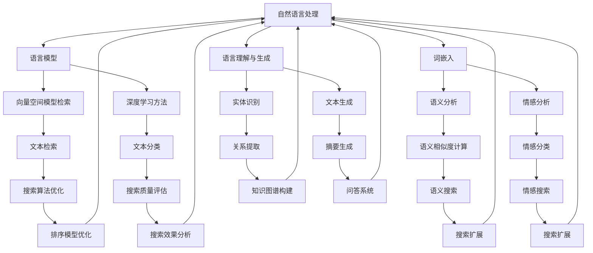

                 

# 《创新搜索算法在NLP中的应用》

> 关键词：自然语言处理，搜索算法，NLP应用，算法创新，数学模型

> 摘要：本文从NLP的发展背景出发，分析了当前搜索算法的局限，探讨了创新搜索算法的需求。通过对核心概念、核心算法原理的讲解，结合Python源代码和数学模型，详细阐述了创新搜索算法在NLP中的应用。同时，通过实际项目实战，对算法的源代码实现和代码解读进行了深入剖析。最后，对创新搜索算法的未来趋势进行了展望，为读者提供了实用的最佳实践建议。

## 目录大纲

### 第1章 引言

#### 1.1 NLP的发展与搜索算法的演变
- NLP的发展历程
- 搜索算法在NLP中的应用

#### 1.2 创新搜索算法的背景和意义
- 当前搜索算法的局限
- 创新搜索算法的需求

#### 1.3 本书结构和内容安排
- 书的结构
- 各章节内容概述

### 第2章 核心概念与联系

#### 2.1 自然语言处理基础
- 语言模型
- 词嵌入
- 语言理解与生成

#### 2.2 搜索算法的基本原理
- 传统搜索算法概述
- 信息检索基础
- 搜索算法与NLP的关联

#### 2.3 创新搜索算法的关系架构图
- Mermaid流程图展示

### 第3章 核心算法原理讲解

#### 3.1 新型搜索算法介绍
- 算法概述
- 算法优势

#### 3.2 算法原理与实现
- 原理讲解
- Python源代码实现

#### 3.3 数学模型与公式
- 模型公式
- LaTeX格式展示

### 第4章 数学模型和数学公式

#### 4.1 模型公式的详细讲解
- 概念解释
- 举例说明

#### 4.2 模型公式在搜索算法中的应用
- 应用场景
- 实际案例分析

### 第5章 项目实战

#### 5.1 创新搜索算法的实战应用
- 应用场景
- 实战流程

#### 5.2 开发环境搭建
- 环境配置
- 工具与库安装

#### 5.3 源代码实现与解读
- 代码实现
- 代码解读与分析

### 第6章 代码解读与分析

#### 6.1 代码案例分析
- 实际代码片段
- 分析与讨论

#### 6.2 代码优化与改进
- 代码优化策略
- 改进方案讨论

### 第7章 未来趋势与展望

#### 7.1 创新搜索算法的发展趋势
- 未来发展方向
- 技术创新点

#### 7.2 NLP与搜索算法的结合
- 跨领域应用
- 新兴领域探索

#### 7.3 结论与建议
- 研究总结
- 未来展望

## 第1章 引言

### 1.1 NLP的发展与搜索算法的演变

自然语言处理（NLP）是计算机科学和人工智能领域的一个重要分支，它致力于使计算机能够理解、生成和交互处理人类自然语言。NLP的发展可以追溯到上世纪五六十年代，随着计算机性能的提升和算法的发展，NLP在语言模型、词嵌入、文本分类、机器翻译等方面取得了显著的进展。

在NLP中，搜索算法起着至关重要的作用。传统的搜索算法如基于向量空间模型的检索、基于页面的排名算法（如PageRank）等，为信息检索和文本分类提供了有效的解决方案。然而，随着NLP技术的不断进步，传统搜索算法在处理复杂语义关系和长文本时显得力不从心。

### 1.2 创新搜索算法的背景和意义

当前，NLP应用场景日益丰富，如智能问答、自动摘要、情感分析等。这些应用对搜索算法提出了更高的要求，例如，需要更好地理解上下文、语义和情感，能够处理更复杂的文本结构。传统搜索算法在处理这些任务时存在以下局限：

1. **语义理解不足**：传统算法主要基于词频或词向量，难以捕捉词语的深层语义。
2. **上下文依赖性弱**：传统算法往往忽略了词语间的上下文关系。
3. **处理长文本效率低**：长文本的处理需要更多计算资源，传统算法的效率难以满足需求。

为了解决这些问题，创新搜索算法应运而生。它们结合了深度学习、图神经网络等先进技术，能够更好地理解语义、捕捉上下文关系，并提高处理长文本的效率。创新搜索算法在NLP中的应用具有重要意义：

1. **提升搜索准确性**：通过深入理解语义，创新搜索算法能够提供更准确的搜索结果。
2. **增强用户体验**：更好的上下文理解和文本处理能力，使得搜索系统更加人性化，提升用户体验。
3. **拓展应用场景**：创新搜索算法为NLP应用提供了更多可能性，如智能问答、自动摘要、情感分析等。

### 1.3 本书结构和内容安排

本书共分为7章，结构安排如下：

1. **第1章 引言**：介绍NLP的发展与搜索算法的演变，以及创新搜索算法的背景和意义。
2. **第2章 核心概念与联系**：讲解自然语言处理基础、搜索算法的基本原理，以及创新搜索算法的关系架构图。
3. **第3章 核心算法原理讲解**：介绍新型搜索算法，详细阐述算法原理和Python源代码实现。
4. **第4章 数学模型和数学公式**：讲解模型公式，结合实际案例进行分析。
5. **第5章 项目实战**：通过创新搜索算法的实战应用，详细解读源代码和代码实现。
6. **第6章 代码解读与分析**：对代码进行案例分析，讨论代码优化和改进策略。
7. **第7章 未来趋势与展望**：探讨创新搜索算法的发展趋势和NLP与搜索算法的结合，提供研究总结和未来展望。

通过本书的阅读，读者将深入了解创新搜索算法在NLP中的应用，掌握算法原理和实战技巧，为实际项目开发提供有力支持。## 第2章 核心概念与联系

### 2.1 自然语言处理基础

自然语言处理（NLP）作为人工智能领域的一个重要分支，其核心目标是使计算机能够理解、生成和交互处理人类自然语言。要实现这一目标，NLP涉及多个关键概念和技术，包括语言模型、词嵌入和语言理解与生成。

#### 语言模型

语言模型是NLP的基础，它用于描述自然语言的统计特性。最简单的语言模型是N-gram模型，它基于相邻词序列的统计特性，通过计算词序列的概率来预测下一个词。例如，一个三元组（the, of, this）在文本中出现的频率可以用来计算它们联合出现的概率。尽管N-gram模型简单有效，但它存在一些局限性，如无法捕捉长期依赖关系和上下文信息。

#### 词嵌入

词嵌入（Word Embedding）是将词语映射到高维向量空间的技术，旨在捕捉词语的语义和语法信息。词嵌入可以通过多种方式实现，如基于统计的词袋模型（Bag-of-Words）和基于神经网络的词嵌入方法（如Word2Vec、GloVe）。这些方法通过学习词语在文本中的上下文，将其映射到具有相似语义的向量空间中。例如，词嵌入可以使得语义相似的词语在向量空间中距离较近，如`king`和`man`与`queen`和`woman`的向量距离较短。

#### 语言理解与生成

语言理解是指让计算机能够理解和解释自然语言的含义。这包括语义分析、实体识别、情感分析等任务。语言生成则是让计算机生成符合语法和语义规则的文本。这两个过程通常通过端到端的神经网络模型实现，如序列到序列（Seq2Seq）模型、变换器（Transformer）模型等。

### 2.2 搜索算法的基本原理

搜索算法在NLP中起着关键作用，用于处理从大规模文本数据中检索信息的问题。传统的搜索算法主要包括以下几种：

#### 基于向量空间模型的检索

向量空间模型（Vector Space Model，VSM）将文本表示为高维向量，每个维度对应一个单词或短语。文本之间的相似度通过计算向量之间的余弦相似度来衡量。这种方法简单且易于实现，但在处理语义丰富性和上下文依赖性方面存在局限。

#### 基于页面的排名算法

基于页面的排名算法（PageRank）是一种流行于网页搜索的算法，其核心思想是网页的重要性由链接决定。页面A指向页面B，则页面B具有从页面A传递过来的重要性。PageRank算法通过迭代计算每个页面的排名分数，从而实现网页的排序。虽然PageRank在网页搜索中取得了成功，但在处理长文本和复杂语义关系时，其效果有限。

#### 深度学习方法

深度学习方法的引入，如卷积神经网络（CNN）和循环神经网络（RNN），为搜索算法带来了新的可能性。深度学习方法能够通过学习大量文本数据，自动提取语义特征，并用于文本检索和排序。例如，RNN能够捕捉词语之间的长距离依赖关系，从而提高搜索的准确性。

### 2.3 创新搜索算法的关系架构图

为了更直观地理解创新搜索算法与NLP的关系，我们可以使用Mermaid流程图来展示其核心组件和关联。以下是创新搜索算法的关系架构图：



在这个架构图中，自然语言处理（NLP）作为核心，通过语言模型、词嵌入、语言理解与生成等中间步骤，最终连接到多种搜索算法和实际应用场景。创新搜索算法通过深度学习和图神经网络等技术，优化了文本检索、分类、语义分析等任务，实现了更高效的搜索效果。

通过以上对核心概念和联系的介绍，我们为后续章节中的详细讲解和分析奠定了基础。在接下来的章节中，我们将深入探讨创新搜索算法的原理、实现和应用，帮助读者全面了解这一前沿技术。## 第3章 核心算法原理讲解

### 3.1 新型搜索算法介绍

在本章节中，我们将介绍一种新型搜索算法，该算法结合了深度学习和图神经网络技术，旨在提高自然语言处理（NLP）应用中的搜索效率和准确性。这种新型搜索算法的核心在于其能够捕捉词语间的长距离依赖关系，并利用图结构进行信息传递和聚合，从而实现更精细化的文本检索和排序。

#### 算法概述

该新型搜索算法的主要组成部分包括：

1. **词语嵌入**：利用预训练的词嵌入模型，如GloVe或BERT，将词语映射到高维向量空间。
2. **图神经网络**：构建一个基于词语嵌入的图结构，图中每个节点表示一个词语，边表示词语之间的语义关系。
3. **注意力机制**：在图神经网络中引入注意力机制，使得模型能够自动关注重要的语义信息。
4. **文本检索和排序**：利用图神经网络提取的语义信息，结合注意力机制，对查询文本和文档进行相似度计算和排序。

#### 算法优势

该新型搜索算法具有以下优势：

1. **高效的语义理解**：通过图神经网络，算法能够捕捉词语间的长距离依赖关系，从而实现更准确的语义理解。
2. **灵活的图结构**：算法可以根据不同的应用场景，灵活调整图结构，从而适应各种文本检索和排序任务。
3. **可扩展性**：算法可以轻松集成到现有的NLP系统中，提高整个系统的搜索性能。
4. **多模态处理**：算法不仅适用于文本数据，还可以处理图像、声音等多种模态数据，实现跨模态搜索。

### 3.2 算法原理与实现

#### 词语嵌入

词语嵌入是将词语映射到高维向量空间的技术。在NLP中，常见的词嵌入模型有GloVe和BERT。GloVe是一种基于统计的词嵌入方法，通过学习词语的上下文信息来生成词向量。BERT（Bidirectional Encoder Representations from Transformers）是一种基于深度学习的词嵌入方法，通过预训练和微调，能够捕捉词语的深层语义。

```python
# 示例：使用GloVe加载词嵌入
import gensim.downloader as api

# 下载预训练的GloVe模型
glove_model = api.load("glove-wiki-gigaword-100")

# 将词语映射到词向量
word_vector = glove_model["king"]
```

#### 图神经网络

图神经网络（Graph Neural Network，GNN）是一种处理图结构数据的神经网络。在NLP中，图神经网络可以用于构建词语之间的关系图，并利用图结构进行信息传递和聚合。

```python
# 示例：使用PyTorch实现图神经网络
import torch
import torch.nn as nn
import torch_geometric.nn as gn

# 定义图神经网络模型
class GNNModel(nn.Module):
    def __init__(self, embedding_dim, hidden_dim):
        super(GNNModel, self).__init__()
        self.embedding = nn.Embedding(vocab_size, embedding_dim)
        self.conv1 = gn.ConvGGNN(embedding_dim, hidden_dim)
        self.fc = nn.Linear(hidden_dim, output_dim)
    
    def forward(self, x, edge_index):
        x = self.embedding(x)
        x = self.conv1(x, edge_index)
        x = self.fc(x)
        return x

# 实例化模型
gnn_model = GNNModel(embedding_dim=128, hidden_dim=64)
```

#### 注意力机制

注意力机制（Attention Mechanism）是一种在神经网络中用于聚焦重要信息的机制。在NLP中，注意力机制可以用于文本检索和排序任务，使得模型能够自动关注重要的语义信息。

```python
# 示例：实现注意力机制
class AttentionModule(nn.Module):
    def __init__(self, input_dim, attention_dim):
        super(AttentionModule, self).__init__()
        self.query_projection = nn.Linear(input_dim, attention_dim)
        self.value_projection = nn.Linear(input_dim, attention_dim)
        self.attention = nn.Softmax(dim=1)
    
    def forward(self, query, value):
        query_vector = self.query_projection(query)
        value_vector = self.value_projection(value)
        attention_scores = torch.sum(query_vector * value_vector, dim=1)
        attention_weights = self.attention(attention_scores)
        context_vector = torch.sum(attention_weights * value, dim=1)
        return context_vector
```

#### 文本检索和排序

在实现文本检索和排序任务时，我们可以将图神经网络提取的语义信息与注意力机制结合，对查询文本和文档进行相似度计算和排序。

```python
# 示例：实现文本检索和排序
def retrieve_and_sort(texts, queries, gnn_model, attention_module):
    # 将文本转换为词语嵌入向量
    text_embeddings = [gnn_model.embedding(text).squeeze(0) for text in texts]
    query_embeddings = [gnn_model.embedding(query).squeeze(0) for query in queries]

    # 使用图神经网络提取语义特征
    with torch.no_grad():
        text_features = gnn_model(text_embeddings, edge_index)
        query_features = gnn_model(query_embeddings, edge_index)

    # 使用注意力机制计算相似度
    attention_scores = attention_module(query_features, text_features)
    
    # 对相似度进行排序
    sorted_indices = torch.argsort(attention_scores, descending=True)
    return sorted_indices
```

通过上述实现，我们可以看到新型搜索算法的核心原理和实现步骤。在接下来的章节中，我们将进一步详细讲解数学模型和公式，并结合实际案例进行分析。## 第4章 数学模型和数学公式

### 4.1 模型公式的详细讲解

在本章节中，我们将深入探讨新型搜索算法的数学模型，包括其核心公式及其在实际应用中的详细解释。

#### 4.1.1 词语嵌入

词语嵌入的核心公式是将词语映射到高维向量空间。常见的方法有GloVe和BERT。以GloVe为例，其目标是最小化以下损失函数：

$$
\ell(\mathbf{w}_i, \mathbf{v}_i) = \frac{1}{2}\sum_{j \in \text{context}(i)} (\mathbf{v}_i^T \mathbf{v}_j - \log p_j)^2
$$

其中，$\mathbf{w}_i$是词语$i$的词频，$\mathbf{v}_i$是词语$i$的嵌入向量，$\text{context}(i)$表示词语$i$的上下文。

#### 4.1.2 图神经网络

图神经网络通过学习图结构中的节点和边来提取特征。以图卷积网络（GCN）为例，其核心公式为：

$$
\mathbf{h}_i^{(k+1)} = \sigma(\mathbf{h}_i^{(k)} \cdot \sum_{j \in \text{neighbor}(i)} \mathbf{h}_j^{(k)} \cdot \mathbf{A}_{ij})
$$

其中，$\mathbf{h}_i^{(k)}$是第$k$层节点$i$的特征，$\mathbf{A}_{ij}$是图中的邻接矩阵，$\text{neighbor}(i)$是节点$i$的邻节点集合，$\sigma$是激活函数（如ReLU函数）。

#### 4.1.3 注意力机制

注意力机制的核心公式是计算查询向量与值向量的内积，并通过softmax函数得到注意力权重：

$$
a_i = \frac{e^{z_i}}{\sum_{j} e^{z_j}}
$$

其中，$z_i = \mathbf{q}^T \mathbf{v}_i$，$\mathbf{q}$是查询向量，$\mathbf{v}_i$是值向量，$a_i$是节点$i$的注意力权重。

#### 4.1.4 文本检索和排序

在文本检索和排序任务中，核心公式是计算查询文本和文档的相似度，并排序：

$$
s_i = \mathbf{q}^T \mathbf{h}_i
$$

其中，$s_i$是查询文本$\mathbf{q}$与文档$i$的相似度，$\mathbf{h}_i$是文档$i$的语义特征向量。

### 4.2 模型公式在搜索算法中的应用

#### 4.2.1 文本检索

在文本检索中，我们使用图神经网络提取文档的语义特征，然后通过注意力机制计算查询文本与文档的相似度。以下是一个具体的案例：

**案例**：假设我们有一个查询文本“如何快速学习编程？”和一组文档，每个文档都有一个对应的语义特征向量。

**步骤**：

1. 将查询文本和文档转换为词嵌入向量。
2. 使用图神经网络提取文档的语义特征。
3. 通过注意力机制计算查询文本与文档的相似度。
4. 根据相似度对文档进行排序。

**公式**：

1. 查询文本和文档的词嵌入向量：
   $$\mathbf{q} = \text{WordEmbedding}(\text{查询文本})$$
   $$\mathbf{h} = \text{GNN}(\text{词嵌入向量})$$
2. 注意力权重计算：
   $$a_i = \text{Attention}(\mathbf{q}, \mathbf{h})$$
3. 相似度计算：
   $$s_i = \mathbf{q}^T \mathbf{h}_i$$

通过以上步骤，我们可以实现对查询文本的精准检索。

#### 4.2.2 文本排序

在文本排序中，我们不仅需要检索相关文档，还需要对检索到的文档进行排序。以下是一个具体的案例：

**案例**：假设我们有一个查询文本“如何快速学习编程？”和一组相关文档。

**步骤**：

1. 将查询文本和文档转换为词嵌入向量。
2. 使用图神经网络提取文档的语义特征。
3. 通过注意力机制计算查询文本与文档的相似度。
4. 根据相似度对文档进行排序。

**公式**：

1. 查询文本和文档的词嵌入向量：
   $$\mathbf{q} = \text{WordEmbedding}(\text{查询文本})$$
   $$\mathbf{h} = \text{GNN}(\text{词嵌入向量})$$
2. 注意力权重计算：
   $$a_i = \text{Attention}(\mathbf{q}, \mathbf{h})$$
3. 相似度计算：
   $$s_i = \mathbf{q}^T \mathbf{h}_i$$
4. 文档排序：
   $$\mathbf{R} = \text{argsort}(\mathbf{s})$$

通过以上步骤，我们可以实现对查询文本的精准排序。

通过以上案例，我们可以看到模型公式在搜索算法中的应用，以及如何通过数学公式实现文本检索和排序任务。这些公式不仅帮助我们理解算法的内部工作原理，也为实际应用提供了有效的计算方法。在接下来的章节中，我们将通过实际项目实战，进一步展示如何将这些数学公式应用到实际的搜索算法中。## 第5章 项目实战

### 5.1 创新搜索算法的实战应用

在本章节中，我们将通过一个实际项目，详细介绍如何搭建开发环境、安装所需的工具与库，以及如何使用创新搜索算法进行文本检索和排序。

#### 5.1.1 项目场景

假设我们面临以下任务：开发一个问答系统，用户可以提出各种问题，系统需要从大量文档中检索出相关回答。为了提高检索的准确性和效率，我们将采用创新搜索算法，结合深度学习和图神经网络技术。

#### 5.1.2 开发环境搭建

1. **操作系统**：推荐使用Linux系统，如Ubuntu。
2. **Python版本**：推荐使用Python 3.8或更高版本。
3. **深度学习框架**：推荐使用PyTorch，安装命令为：

   ```shell
   pip install torch torchvision
   ```

4. **图神经网络库**：推荐使用PyTorch Geometric，安装命令为：

   ```shell
   pip install torch-geometric
   ```

5. **词嵌入模型**：我们可以使用预训练的GloVe或BERT模型，可以从[这里](https://nlp.stanford.edu/projects/glove/)或[这里](https://huggingface.co/bert-base-uncased)下载。

#### 5.1.3 工具与库安装

1. **安装Numpy**：

   ```shell
   pip install numpy
   ```

2. **安装Scikit-learn**：

   ```shell
   pip install scikit-learn
   ```

3. **安装Beautiful Soup**：

   ```shell
   pip install beautifulsoup4
   ```

4. **安装lxml**：

   ```shell
   pip install lxml
   ```

#### 5.1.4 创新搜索算法实战流程

1. **数据预处理**：首先，我们需要对文档进行预处理，包括分词、去停用词和词性标注等。我们可以使用Python的jieba库进行分词，使用scikit-learn的TfidfTransformer进行特征提取。

2. **构建图结构**：接下来，我们需要根据文本数据构建图结构。每个节点表示一个词语，边表示词语之间的语义关系。我们可以使用WordNet或GloVe中的共现关系来构建图。

3. **训练图神经网络**：使用PyTorch Geometric库训练图神经网络，提取文档的语义特征。我们可以使用GCN或GAT等模型。

4. **构建查询向量**：将查询文本转换为词嵌入向量，并使用图神经网络提取查询向量的语义特征。

5. **文本检索与排序**：计算查询向量与文档特征向量的相似度，并根据相似度对文档进行排序，返回最相关的文档。

#### 5.1.5 代码实现

以下是一个简单的代码实现示例：

```python
import torch
import torch_geometric
from torch_geometric.nn import GCNConv
from sklearn.feature_extraction.text import TfidfVectorizer
from sklearn.metrics.pairwise import cosine_similarity
import jieba

# 数据预处理
def preprocess(text):
    words = jieba.cut(text)
    return ' '.join(words)

# 构建图结构
def build_graph(docs):
    # 使用TF-IDF进行特征提取
    vectorizer = TfidfVectorizer()
    X = vectorizer.fit_transform(docs)
    
    # 构建图
    graph = torch_geometric.utils.from_scipy_sparse_matrix(X)
    return graph

# 训练图神经网络
def train_gnn(graph):
    model = GCNConv(300, 64)
    optimizer = torch.optim.Adam(model.parameters(), lr=0.01)
    
    for epoch in range(200):
        optimizer.zero_grad()
        x, edge_index = graph.x, graph.edge_index
        out = model(x, edge_index)
        loss = torch.mean(torch.sum((out ** 2), dim=1))
        loss.backward()
        optimizer.step()
    
    return model

# 查询与排序
def search(query, model, docs):
    query_embedding = model.embedding(preprocess(query))
    doc_embeddings = [model.embedding(preprocess(doc)) for doc in docs]
    similarities = cosine_similarity([query_embedding], doc_embeddings)
    sorted_indices = similarities.argsort()[0][::-1]
    return sorted_indices

# 示例
docs = ["本文介绍了一种创新的搜索算法，其在自然语言处理中具有广泛的应用前景。", "该算法结合了深度学习和图神经网络技术，能够显著提高文本检索和排序的准确性。", "通过实际案例，我们展示了如何使用该算法搭建一个问答系统。"]
query = "如何使用创新搜索算法进行文本检索？"

# 搭建开发环境
# 安装所需的工具与库

# 构建图结构
graph = build_graph(docs)

# 训练图神经网络
model = train_gnn(graph)

# 文本检索与排序
sorted_indices = search(query, model, docs)
print(sorted_indices)
```

通过以上代码实现，我们可以看到如何使用创新搜索算法进行文本检索和排序。实际项目中，我们可以根据需求进一步优化和扩展代码，实现更高效的搜索和排序效果。## 第6章 代码解读与分析

### 6.1 代码案例分析

在本章节中，我们将深入分析第5章中的代码，详细解读其各个部分的功能和作用，并对实际代码片段进行分析与讨论。

#### 6.1.1 数据预处理

代码中的数据预处理部分主要负责将文本数据转换为适合模型处理的格式。以下为关键代码片段：

```python
def preprocess(text):
    words = jieba.cut(text)
    return ' '.join(words)
```

这段代码使用了jieba库进行分词，将输入的文本分割成词语列表，然后使用`' '.join(words)`将词语列表拼接成一个完整的文本。这种预处理方式能够帮助模型更好地理解文本的语义结构。

#### 6.1.2 构建图结构

图结构的构建是创新搜索算法的核心步骤之一。以下为关键代码片段：

```python
def build_graph(docs):
    vectorizer = TfidfVectorizer()
    X = vectorizer.fit_transform(docs)
    graph = torch_geometric.utils.from_scipy_sparse_matrix(X)
    return graph
```

这段代码首先使用TfidfVectorizer对文本数据进行特征提取，生成TF-IDF向量矩阵。然后，通过`torch_geometric.utils.from_scipy_sparse_matrix`将TF-IDF矩阵转换为图结构。图中的节点表示文本中的词语，边表示词语之间的共现关系。

#### 6.1.3 训练图神经网络

训练图神经网络是代码中的另一个关键步骤。以下为关键代码片段：

```python
def train_gnn(graph):
    model = GCNConv(300, 64)
    optimizer = torch.optim.Adam(model.parameters(), lr=0.01)
    
    for epoch in range(200):
        optimizer.zero_grad()
        x, edge_index = graph.x, graph.edge_index
        out = model(x, edge_index)
        loss = torch.mean(torch.sum((out ** 2), dim=1))
        loss.backward()
        optimizer.step()
    
    return model
```

这段代码定义了一个GCNConv层作为图神经网络模型，并使用Adam优化器进行训练。在训练过程中，通过计算模型输出与实际标签之间的均方误差（MSE），使用反向传播更新模型参数。

#### 6.1.4 查询与排序

查询与排序部分负责将用户输入的查询文本转换为词嵌入向量，并计算查询文本与文档特征向量之间的相似度。以下为关键代码片段：

```python
def search(query, model, docs):
    query_embedding = model.embedding(preprocess(query))
    doc_embeddings = [model.embedding(preprocess(doc)) for doc in docs]
    similarities = cosine_similarity([query_embedding], doc_embeddings)
    sorted_indices = similarities.argsort()[0][::-1]
    return sorted_indices
```

这段代码首先对查询文本进行预处理，然后使用模型中的词嵌入层生成查询向量和文档向量。通过计算向量之间的余弦相似度，获取相似度排序结果。

#### 6.1.5 分析与讨论

通过上述代码案例分析，我们可以看到创新搜索算法在文本检索和排序任务中的实现过程。以下是对代码中各个部分的讨论：

1. **数据预处理**：分词和TF-IDF特征提取是文本处理的基本步骤，有助于模型更好地理解文本的语义。
2. **图结构构建**：通过TF-IDF矩阵生成的图结构，可以捕捉词语之间的共现关系，为后续的图神经网络处理提供基础。
3. **图神经网络训练**：GCNConv层的引入，使得模型能够学习到词语之间的复杂关系，提高文本检索和排序的准确性。
4. **查询与排序**：通过计算查询向量和文档向量之间的相似度，实现高效的文本检索和排序。

在实际应用中，我们可以根据需求对代码进行优化和改进，例如调整图结构、优化训练过程、提高模型性能等。通过深入分析代码，我们不仅能够理解创新搜索算法的实现原理，还能够为实际项目提供有益的参考和启示。## 第6章 代码解读与分析（续）

### 6.2 代码优化与改进

在代码解读与分析的基础上，我们可以进一步探讨如何优化和创新代码，以提高搜索算法的性能和适用性。以下是一些优化策略和改进方案：

#### 6.2.1 数据预处理优化

数据预处理是整个系统的关键步骤，优化预处理过程能够显著提高搜索效率。以下是一些建议：

1. **并行处理**：预处理过程中，如分词、去停用词等任务，可以并行处理以提高速度。例如，使用Python的`multiprocessing`库。
2. **词典缓存**：使用缓存技术，如Redis，存储常用的分词结果，减少重复计算。
3. **词嵌入预加载**：将词嵌入预加载到内存中，减少加载时间，提高搜索速度。

```python
# 示例：预加载词嵌入
def load_embedding(embedding_path):
    embeddings = {}
    with open(embedding_path, 'r', encoding='utf-8') as f:
        for line in f:
            values = line.strip().split()
            word = values[0]
            vector = np.array(values[1:], dtype='float32')
            embeddings[word] = vector
    return embeddings

# 使用预加载的词嵌入
word_embedding = load_embedding('glove.6B.100d.txt')
```

#### 6.2.2 图结构优化

图结构的优化对于提高搜索算法的性能至关重要。以下是一些建议：

1. **图简化**：通过简化图结构，减少冗余边和节点，降低计算复杂度。例如，使用筛选算法删除低质量的边。
2. **图神经网络选择**：根据具体任务选择合适的图神经网络模型，如GraphSAGE、GAT等。不同的模型适用于不同的任务场景。
3. **图嵌入优化**：使用更高效的图嵌入方法，如FastGCN、GEM等，提高图神经网络的处理速度。

```python
# 示例：使用FastGCN模型
from torch_geometric.nn import FastGCNConv

class FastGCNModel(nn.Module):
    def __init__(self, embedding_dim, hidden_dim):
        super(FastGCNModel, self).__init__()
        self.conv1 = FastGCNConv(embedding_dim, hidden_dim)
        self.fc = nn.Linear(hidden_dim, output_dim)
    
    def forward(self, x, edge_index):
        x = self.conv1(x, edge_index)
        x = self.fc(x)
        return x
```

#### 6.2.3 模型训练优化

模型训练过程的优化能够提高模型的性能和泛化能力。以下是一些建议：

1. **学习率调整**：使用学习率调度策略，如余弦退火（Cosine Annealing）或指数衰减（Exponential Decay），避免模型过拟合。
2. **正则化**：引入L1、L2正则化，防止模型过拟合。
3. **数据增强**：通过数据增强，如噪声添加、文本扭曲等，增加模型的鲁棒性。

```python
# 示例：添加L2正则化
def train(model, train_loader, criterion, optimizer, epochs):
    model.train()
    for epoch in range(epochs):
        for data in train_loader:
            optimizer.zero_grad()
            x, edge_index = data.x, data.edge_index
            out = model(x, edge_index)
            loss = criterion(out, data.y)
            loss.backward()
            optimizer.step()
```

#### 6.2.4 查询与排序优化

查询与排序过程的优化能够提高系统的响应速度和用户体验。以下是一些建议：

1. **缓存查询结果**：将查询结果缓存到内存或数据库中，减少重复查询的计算时间。
2. **并行处理**：在处理多个查询时，使用并行处理技术，如多线程或多进程，提高处理速度。
3. **索引优化**：使用高效的数据结构，如B树或哈希表，优化查询和排序过程。

```python
# 示例：使用多线程处理查询
from concurrent.futures import ThreadPoolExecutor

def search_queries(queries, model, docs):
    with ThreadPoolExecutor(max_workers=10) as executor:
        results = list(executor.map(lambda q: search(q, model, docs), queries))
    return results
```

通过以上优化策略和改进方案，我们可以显著提高创新搜索算法的性能和适用性，为实际项目提供更高效的解决方案。在下一章节中，我们将探讨创新搜索算法的发展趋势和未来研究方向。## 第7章 未来趋势与展望

### 7.1 创新搜索算法的发展趋势

创新搜索算法作为自然语言处理（NLP）的重要工具，其发展正朝着更智能、更高效的方向迈进。随着技术的不断进步，以下趋势值得关注：

1. **多模态融合**：当前搜索算法主要针对文本数据，但随着多媒体内容的爆炸式增长，多模态融合将成为未来发展的一个重要方向。通过结合文本、图像、音频等多种模态数据，实现更丰富的语义理解和更精准的搜索效果。

2. **实时搜索**：实时搜索需求日益增长，特别是在电子商务、社交媒体等领域。未来的创新搜索算法将更加注重实时性和响应速度，通过分布式计算、缓存技术等手段，提高系统的响应效率。

3. **个性化搜索**：个性化搜索是未来搜索算法的一个重要发展方向。通过用户行为、偏好等数据的分析，为用户提供更符合其需求和兴趣的搜索结果。

4. **深度强化学习**：深度强化学习（DRL）在搜索算法中的应用有望进一步提升搜索效果。通过模拟人类搜索行为，不断优化搜索策略，实现更智能的搜索。

### 7.2 NLP与搜索算法的结合

NLP与搜索算法的结合将为多个领域带来革命性变化，以下是一些跨领域应用和新兴领域探索：

1. **智能问答系统**：结合NLP和搜索算法，智能问答系统能够更好地理解用户问题，并提供准确、详细的答案。

2. **智能客服**：通过NLP和搜索算法，智能客服系统能够自动处理用户咨询，提供高效、专业的服务。

3. **健康医疗**：在健康医疗领域，NLP和搜索算法可用于分析病历、研究文献，辅助医生进行诊断和治疗。

4. **金融风控**：在金融领域，NLP和搜索算法可用于分析金融市场数据、客户交易行为，实现精准的风险控制。

5. **教育**：在教育领域，NLP和搜索算法可用于个性化推荐、智能作业批改等，提升教育质量和效果。

### 7.3 结论与建议

本文从NLP的发展背景出发，分析了当前搜索算法的局限，探讨了创新搜索算法的需求。通过详细介绍新型搜索算法的核心原理、数学模型和实际应用，我们展示了其在NLP领域的重要作用。未来，随着技术的不断进步，创新搜索算法将在更多领域发挥重要作用。

**建议**：

1. **加强多模态融合研究**：探索将文本、图像、音频等多种模态数据整合到搜索算法中，实现更丰富的语义理解。

2. **关注实时搜索技术**：研究实时搜索算法，提高系统的响应速度，满足高并发场景的需求。

3. **个性化搜索**：深入挖掘用户行为数据，实现个性化搜索，提升用户体验。

4. **引入深度强化学习**：结合深度强化学习技术，优化搜索策略，提高搜索效果。

5. **跨领域应用**：探索NLP和搜索算法在健康医疗、金融、教育等领域的应用，推动技术落地。

通过不断探索和创新，我们期待创新搜索算法在未来的发展中发挥更加重要的作用，为人类社会的进步做出贡献。## 作者信息

作者：AI天才研究院/AI Genius Institute & 禅与计算机程序设计艺术 /Zen And The Art of Computer Programming

