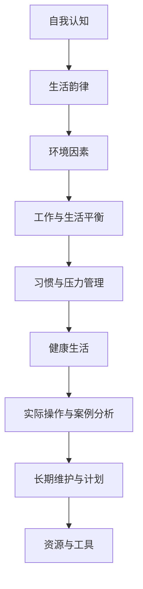

                 

### 文章标题

《创造个人生活韵律：找到最适合的节奏》

### 关键词

个人生活韵律、节奏、幸福感、自我认知、工作生活平衡、习惯、压力管理、健康生活、案例分析、长期维护、资源与工具

### 摘要

本文旨在探讨如何创造个人生活韵律，找到最适合的节奏，以提升个人幸福感和生活质量。文章从理解生活韵律的定义与重要性、自我认知与生活节奏、环境因素对生活节奏的影响、生活节奏的测量与评估等多个方面入手，逐步分析并提供了调整与优化个人生活节奏的策略，包括平衡工作与生活、习惯的力量、压力管理以及健康生活等。最后，通过实际案例和长期维护的方法，引导读者如何创建并维持个人生活韵律，以实现长期的生活品质提升。

## 第一部分：理解个人生活韵律

### 第1章：什么是生活韵律

#### 1.1 生活韵律的定义与重要性

生活韵律（Life Rhythm）指的是个体在日常生活中遵循的一种有规律、有节奏的生活方式。这种生活方式不仅包括日常活动的时间安排，还涉及到个体心理状态、生理状态和环境适应等多个层面。生活韵律的定义可以归纳为以下几个方面：

1. **时间安排**：个体按照一定的规律进行日常活动，如起床、工作、休息、娱乐等。
2. **心理状态**：个体在日常生活中保持相对稳定的情绪和心理状态，如愉悦、焦虑、平静等。
3. **生理状态**：个体保持良好的身体健康，如充足的睡眠、规律的饮食、适量的运动等。
4. **环境适应**：个体能够适应不同的环境和情境，如家庭、工作场所、社交场合等。

生活韵律的重要性在于它能够帮助个体提高生活质量，增强幸福感。具体而言，生活韵律的重要性体现在以下几个方面：

1. **提高工作效率**：规律的生活节奏有助于个体形成高效的工作模式，提高工作效率。
2. **促进身心健康**：规律的作息和良好的生活习惯有助于保持身体健康，减少疾病风险。
3. **提升情绪管理能力**：稳定的生活节奏有助于个体更好地管理情绪，减少焦虑和压力。
4. **增强社会适应能力**：适应不同环境的能力是生活韵律的重要组成部分，有助于个体更好地融入社会。

#### 1.2 生活韵律与个人幸福感的关系

个人幸福感（Subjective Well-being, SWB）是衡量个体生活质量的重要指标，它涵盖了情感幸福感、生活满意度和生活意义感等多个维度。生活韵律与个人幸福感之间存在密切的关系。

首先，规律的生活节奏有助于提升情感幸福感。研究表明，规律的生活作息能够降低焦虑和抑郁的发生率，提高个体的积极情感体验。例如，固定的作息时间有助于保持良好的睡眠质量，从而提升个体的精神状态和情感幸福感。

其次，生活韵律与生活满意度密切相关。一个稳定、有序的生活节奏有助于个体建立稳定的生活目标和价值观，提高对生活的整体满意度。例如，通过合理安排工作和休闲时间，个体能够更好地平衡工作与生活，从而提升生活满意度。

最后，生活韵律对于生活意义感也有重要影响。一个有规律的生活能够帮助个体找到自己的生活目标，提升对生活的使命感。例如，通过定期参与社区活动、志愿服务等，个体能够感受到自己对社会的贡献，从而提升生活意义感。

#### 1.3 生活节奏的多样性

生活节奏并不是一成不变的，它具有多样性。不同的个体、不同的文化背景和不同的生活环境都会影响个人的生活节奏。以下是几种常见的生活节奏类型：

1. **快节奏生活**：快节奏生活通常指的是工作紧张、生活节奏快速，如大城市中的白领。这类生活方式往往伴随着较高的压力和紧张感，但也可能带来丰富的社交体验和职业成就。

2. **慢节奏生活**：慢节奏生活强调生活的简单和宁静，如农村生活或退休后的生活。这类生活方式有助于减轻压力，提高生活质量，但也可能面临社交孤立和经济压力。

3. **平衡节奏生活**：平衡节奏生活追求工作与生活的平衡，如双职工家庭或自由职业者。这类生活方式有助于提高生活满意度，但需要良好的时间管理和规划能力。

生活节奏的多样性反映了个体在面对生活挑战时的不同选择和适应策略。了解自己的生活节奏类型，并根据个人情况进行调整，是实现个人生活韵律的关键。

### 第2章：自我认知与生活节奏

#### 2.1 自我认知的重要性

自我认知（Self-awareness）是指个体对自己内在心理状态和外在行为的感知和理解。自我认知的重要性在于它能够帮助个体更好地了解自己，从而更好地应对生活中的各种挑战。

首先，自我认知有助于个体识别自己的情绪和行为模式。通过自我观察，个体可以发现自己情绪波动的触发点，以及自己在不同情境下的行为反应。这种自我反思有助于个体更好地管理情绪，避免因情绪失控而导致的冲动行为。

其次，自我认知有助于个体建立自我认同。自我认同是指个体对自己身份和价值观的认同，它是心理健康的重要组成部分。通过自我认知，个体能够明确自己的价值观和目标，从而更有动力去追求自己的梦想。

最后，自我认知有助于个体进行自我调节。自我调节是指个体根据自身情况调整自己的行为和情绪，以达到更好的生活状态。例如，当个体意识到自己过度劳累时，可以通过休息和放松来调整自己的状态，避免因过度劳累而导致的心理和生理问题。

#### 2.2 了解自己的节奏

了解自己的节奏（Know Your Rhythm）是创造个人生活韵律的第一步。每个人的生活节奏都是独特的，了解自己的节奏有助于个体更好地适应生活，提高生活质量。

首先，个体可以通过自我观察来了解自己的节奏。例如，记录自己的日常作息，观察自己何时最清醒、何时最容易疲劳，以及自己喜欢什么样的工作和休息模式。这些观察可以帮助个体找到自己最舒适的生活节奏。

其次，个体可以通过实验来了解自己的节奏。例如，尝试调整自己的作息时间，观察这种变化对自己情绪和身体的影响。通过实验，个体可以找到最适合自己的作息模式，从而优化自己的生活节奏。

最后，个体可以通过求助专业人士来了解自己的节奏。心理咨询师和睡眠专家等专业人士可以提供科学的指导，帮助个体更好地了解自己的心理和生理状态，从而找到适合自己的生活节奏。

#### 2.3 自我认知工具与方法

为了更深入地了解自己，个体可以借助多种自我认知工具与方法。以下是一些常用的自我认知工具：

1. **日记法**：通过记录日记，个体可以反思自己的情绪和行为，了解自己在不同情境下的反应。这种方法有助于个体建立自我认知，发现自己的情绪和行为模式。

2. **冥想法**：冥想是一种通过专注呼吸和思维来放松身心、提高自我认知的练习。通过冥想，个体可以更好地了解自己的内在状态，从而更好地管理情绪和压力。

3. **心理测量工具**：如性格测试（MBTI、大五人格等）和情绪测量工具（情绪温度计等），这些工具可以帮助个体了解自己的性格特点和情绪状态，从而更好地调整自己的生活节奏。

4. **行动日志**：记录每天的行动和成果，分析自己的行为习惯和时间管理效果。这种方法有助于个体发现自己的行为模式，优化时间利用效率。

通过使用这些自我认知工具，个体可以更全面地了解自己，从而找到适合自己的生活节奏，提升生活质量。

### 第3章：环境因素对生活节奏的影响

#### 3.1 家庭环境

家庭环境是影响个人生活节奏的重要因素之一。家庭环境包括家庭成员之间的关系、家庭的文化氛围以及家庭的经济状况等。

首先，家庭成员之间的关系对生活节奏有直接影响。和谐的家庭关系有助于个体保持稳定的生活节奏，减少生活中的压力和冲突。例如，家庭成员之间的支持和理解可以帮助个体更好地应对日常生活中的挑战，从而维持良好的生活状态。

其次，家庭的文化氛围也影响着个人的生活节奏。家庭的文化氛围包括家庭的教育理念、价值观念和生活方式等。一个积极、健康的文化氛围有助于个体形成良好的生活习惯，保持稳定的生活节奏。

最后，家庭的经济状况也是影响生活节奏的重要因素。经济状况良好的家庭可以为个体提供更多的生活资源，如良好的居住环境、教育资源等，从而有助于个体维持稳定的生活节奏。

#### 3.2 社会文化背景

社会文化背景是指个体所处的社会环境和文化环境，包括社会规范、价值观、文化传统等。社会文化背景对个人的生活节奏有深远的影响。

首先，社会规范和价值观对个体的行为和生活方式有指导作用。不同的社会文化背景会对个体提出不同的生活期望和要求，从而影响个体的生活节奏。例如，在崇尚个人成就的文化背景下，个体可能更加注重工作效率和职业发展，生活节奏相对较快；而在重视家庭和社会和谐的文化背景下，个体可能更加注重家庭关系和社会责任，生活节奏相对较慢。

其次，文化传统对个体的生活习惯和节奏有深远影响。不同的文化传统有不同的生活习俗和节日庆典，这些习俗和庆典会影响个体的日常活动和生活方式。例如，在一些传统文化中，节日庆典是家庭团聚和社区互动的重要时刻，这会影响个体的作息时间和社交活动安排。

#### 3.3 工作环境

工作环境是影响个人生活节奏的重要因素之一。工作环境包括工作内容、工作时长、工作压力等。

首先，工作内容对个人的生活节奏有直接影响。不同类型的工作对个人的时间和精力要求不同，从而影响个体的生活节奏。例如，需要高度集中精力的工作可能要求个体保持较高的工作强度和紧张感，而轻松的工作环境则可能让个体有更多的时间进行休闲和娱乐。

其次，工作时长对个人的生活节奏也有重要影响。长时间的工作会导致个体疲劳，影响身心健康和生活质量。因此，合理安排工作时间和休息时间，对于维持良好的生活节奏至关重要。

最后，工作压力也是影响生活节奏的重要因素。高工作压力可能导致个体焦虑和抑郁，从而影响个体的情绪管理和生活满意度。因此，应对工作压力，保持心理健康，是实现良好生活节奏的关键。

### 第4章：生活节奏的测量与评估

#### 4.1 生活节奏测量方法

测量生活节奏的目的是了解个体在日常生活中的活动规律，从而评估其生活质量和幸福感。以下是一些常用的生活节奏测量方法：

1. **时间日志法**：时间日志法要求个体记录自己每天的活动和时间分配，包括起床、工作、休息、娱乐等。这种方法有助于全面了解个体的日常生活节奏。

2. **问卷调查法**：通过设计详细的问卷，调查个体对生活节奏的主观感受和评价。问卷可以涵盖时间管理、情绪状态、生活满意度等多个方面，从而提供多维度的生活节奏测量数据。

3. **生物钟测量法**：生物钟测量法通过测量个体的生物节律，如体温、心率等，来确定个体的作息规律。这种方法具有较高的科学性和准确性。

4. **行为观察法**：行为观察法是指通过观察个体在日常生活、工作环境中的行为表现，来评估其生活节奏。这种方法适用于难以通过自我报告获取准确数据的情境。

#### 4.2 生活节奏评估工具

为了更科学、系统地评估生活节奏，可以采用以下评估工具：

1. **生活节奏问卷**：这是一种广泛使用的评估工具，通过一系列问题了解个体的作息规律、生活满意度、工作压力等，从而评估其生活节奏。

2. **生活节奏分析软件**：这些软件通过收集和分析个体的日常活动数据，提供个性化的生活节奏评估报告，帮助个体了解自己的生活习惯和潜在问题。

3. **生物钟监测设备**：如智能手表、手环等可穿戴设备，这些设备能够实时监测个体的生理数据，帮助个体了解自己的生物节律。

#### 4.3 生活节奏评估的误区与挑战

尽管生活节奏评估有助于个体了解自己的生活状态，但在评估过程中也存在一些误区和挑战：

1. **主观偏见**：生活节奏评估依赖于个体的自我报告，这可能导致评估结果受到主观偏见的影响。例如，个体可能对自己的生活节奏过于乐观或悲观，从而影响评估结果的准确性。

2. **数据收集困难**：一些评估方法，如时间日志法，需要个体长期坚持记录，这可能导致数据收集困难。此外，个体可能由于记忆偏差而无法准确回忆过去的活动细节。

3. **评估工具的局限性**：现有的生活节奏评估工具和方法可能存在局限性，无法全面反映个体复杂的生活节奏。例如，一些工具可能无法充分考虑个体在不同情境下的行为变化。

为了克服这些误区和挑战，研究者们正在不断改进评估方法，开发更加科学、准确的生活节奏评估工具，以更好地帮助个体了解和管理自己的生活节奏。

### 第5章：调整与优化个人生活节奏

#### 5.1 工作时间管理

工作时间管理是调整和优化个人生活节奏的重要环节。合理的工作时间管理不仅能提高工作效率，还能确保工作和生活的平衡，从而提升个人幸福感。

首先，个体应明确自己的工作目标和任务。通过制定清晰的工作计划，个体可以更有针对性地安排工作时间，避免工作过程中的拖延和混乱。例如，可以使用“待办事项清单”来记录每天需要完成的任务，并按照优先级进行排序。

其次，个体应学会合理安排工作时间。这包括合理分配工作时间和休息时间，避免长时间连续工作导致的疲劳和效率下降。例如，可以使用“番茄工作法”来提高工作效率，即每工作25分钟后休息5分钟，每完成四个“番茄时间”后可以休息更长时间。

最后，个体应学会调整工作环境。一个良好的工作环境有助于提高工作效率，例如，保持工作区的整洁、避免过多干扰等。此外，个体还可以通过调整工作节奏，如适时休息和运动，来保持身心的健康。

#### 5.2 生活时间管理

生活时间管理是指对个人生活中的各项活动进行合理规划和安排，以实现生活节奏的平衡和优化。以下是一些有效的生活时间管理策略：

1. **设定优先级**：在日常生活中，个体应明确各项活动的优先级。可以通过“四象限法则”来划分任务的优先级，将重要的任务优先处理。这种方法有助于个体集中精力，避免因琐碎事务而浪费时间。

2. **制定日程表**：制定日程表是一种有效的管理时间的方法。通过将每天的日程具体化，个体可以更好地掌控自己的时间，避免遗漏重要任务。例如，可以使用日程管理软件或日历应用程序来制定和跟踪日程。

3. **利用碎片时间**：在生活中，我们经常会有一些零散的时间，如等车、排队等。利用这些碎片时间进行阅读、学习或完成一些小任务，可以有效地提高时间利用率。

4. **避免时间浪费**：个体应尽量避免无意义的时间浪费，如长时间刷社交媒体、玩游戏等。通过减少这些无效活动，个体可以更好地利用时间，实现生活时间的优化。

#### 5.3 工作与生活的平衡策略

工作与生活的平衡是许多人追求的目标，但往往难以实现。以下是一些有效的工作与生活平衡策略：

1. **设定工作边界**：明确工作时间和个人时间的界限，避免工作侵占个人时间。例如，可以在工作日结束后明确表示不回复工作邮件，以保护个人时间的完整性。

2. **合理分配时间**：在工作日中，个体应合理安排工作和个人时间。例如，可以将每天的一部分时间用于工作，另一部分时间用于个人爱好、运动、家庭等，以确保工作和生活的平衡。

3. **灵活调整工作时间**：有些工作具有灵活性，个体可以通过灵活调整工作时间来平衡工作和生活。例如，可以采用远程工作、弹性工作时间等方式，以适应个人需求。

4. **培养兴趣爱好**：兴趣爱好不仅能为生活增添乐趣，还能帮助个体放松身心，减轻工作压力。通过培养兴趣爱好，个体可以在工作中找到平衡点，实现工作与生活的和谐。

5. **寻求支持**：在实现工作与生活平衡的过程中，个体可以寻求家人、朋友或同事的支持。例如，与家人协商调整家庭责任分配，与朋友一起参与兴趣爱好活动等，都可以帮助个体更好地平衡工作与生活。

通过上述策略，个体可以逐步实现工作与生活的平衡，从而提高生活质量，实现个人幸福感的提升。

### 第6章：习惯的力量

#### 6.1 好习惯的培养

好习惯的培养是优化个人生活节奏的重要途径。好习惯不仅能够提升个体的自我管理能力，还能为日常生活带来秩序和效率。

首先，个体应明确好习惯的目标。通过设定明确的目标，个体可以更有动力去培养新习惯。例如，设定每天早上锻炼30分钟的目标，可以帮助个体养成良好的运动习惯。

其次，个体应逐步实现目标。习惯的培养需要时间和耐心，个体应逐步实现目标，避免一开始就设定过于苛刻的目标。例如，可以采用“小步前进”的策略，将每天锻炼30分钟的目标拆分为每天锻炼10分钟，逐步增加锻炼时间。

最后，个体应建立奖励机制。通过给予自己奖励，个体可以增强培养好习惯的动力。例如，每完成一周的锻炼目标，可以给自己安排一次喜欢的活动，如看电影或购物等。

#### 6.2 坏习惯的克服

坏习惯的克服是优化个人生活节奏的另一个重要方面。坏习惯如拖延、过度使用电子设备等，会对个体的生活节奏产生负面影响。

首先，个体应识别坏习惯。通过自我反思和观察，个体可以识别出自己存在的坏习惯。例如，可以通过记录日记来跟踪自己的行为，识别出哪些行为是习惯性的。

其次，个体应制定克服坏习惯的计划。制定计划包括设定具体的行动步骤和时间表，例如，逐步减少每天使用手机的时间，每天减少10分钟，直至达到理想的时间。

最后，个体应建立新的行为替代。为了克服坏习惯，个体可以建立新的行为替代。例如，将使用手机的时间替换为阅读或运动，从而减少对手机的依赖。

#### 6.3 习惯养成的技巧

习惯的养成需要一定的技巧和方法，以下是一些有效的习惯养成技巧：

1. **重复练习**：习惯的养成需要反复练习。个体应每天坚持练习，直到新习惯变成自然的行为。例如，每天早上起床后立即进行锻炼，直到这种习惯变得自然。

2. **环境设计**：环境对习惯的养成有重要影响。个体可以通过设计环境来促进新习惯的养成。例如，将运动装备放在显眼的位置，以提醒自己进行锻炼。

3. **社会支持**：社会支持有助于习惯的养成。个体可以寻求家人、朋友或同事的支持，共同培养新习惯。例如，与朋友一起参与健身活动，可以增加坚持锻炼的动力。

4. **自我激励**：自我激励是习惯养成的关键。个体可以通过给自己设定奖励，来增强培养新习惯的动力。例如，每完成一个习惯养成目标，可以给自己一个小奖励。

通过运用这些技巧，个体可以更有效地培养好习惯，克服坏习惯，从而优化个人生活节奏，提升生活质量。

### 第7章：压力管理

#### 7.1 压力的来源与类型

压力（Stress）是影响个人生活节奏的重要因素。了解压力的来源和类型，有助于个体更好地管理压力，保持良好的生活状态。

首先，压力的来源可以分为外部压力和内部压力。外部压力包括工作压力、生活压力、环境压力等。例如，工作负担过重、家庭纠纷、噪音污染等都可能导致外部压力。内部压力则主要来源于个体内心的期望和焦虑。例如，担心失业、害怕失败、自我要求过高等都可能导致内部压力。

其次，压力的类型可以分为以下几种：

1. **急性压力**：急性压力是指突然发生的、强烈的压力。例如，突然失业、意外事故等。急性压力通常会导致情绪激动、焦虑和恐慌。

2. **慢性压力**：慢性压力是指长期存在的、持续的压力。例如，长时间的工作压力、家庭纠纷等。慢性压力可能导致身体和心理健康的长期问题，如失眠、焦虑症、抑郁症等。

3. **生理性压力**：生理性压力是指由于生理变化而导致的压力。例如，睡眠不足、营养不良、身体疾病等。生理性压力会影响个体的生理功能，降低生活质量。

4. **心理性压力**：心理性压力是指由于心理问题而导致的压力。例如，焦虑、抑郁、压力感等。心理性压力会影响个体的情绪和心理状态，降低幸福感。

了解压力的来源和类型，有助于个体识别和应对不同类型的压力，从而更好地管理压力，维持良好的生活状态。

#### 7.2 压力管理策略

有效的压力管理策略可以帮助个体应对压力，保持心理健康。以下是一些常见的压力管理策略：

1. **时间管理**：合理的时间管理有助于减少工作压力和生活压力。通过制定时间表、设定优先级、避免拖延等，个体可以更好地控制时间，减少压力。

2. **运动锻炼**：运动锻炼有助于缓解压力，提高心理健康。定期进行有氧运动，如跑步、游泳等，可以帮助个体放松身心，减轻压力。

3. **放松技巧**：放松技巧，如深呼吸、冥想、瑜伽等，有助于缓解压力，提高情绪稳定性。通过这些技巧，个体可以学会在紧张或焦虑时进行自我放松，从而减轻压力。

4. **社交支持**：社交支持是应对压力的重要资源。通过与家人、朋友、同事交流，个体可以获得情感支持和实际帮助，减轻压力。

5. **自我调适**：自我调适是指个体通过调整心态和行为，来应对压力。通过积极的心态、乐观的情绪和健康的生活习惯，个体可以更好地应对压力，保持心理健康。

通过运用这些策略，个体可以更有效地管理压力，提高生活质量，实现良好的生活节奏。

#### 7.3 压力应对技巧

在日常生活中，学会应对压力是维护心理健康和生活质量的关键。以下是一些有效的压力应对技巧：

1. **时间管理技巧**：合理的时间管理是应对压力的重要手段。可以通过制定日程表、设定优先级、避免拖延等方式，提高时间利用率，减少工作压力。例如，每天早上制定当天的任务清单，并按照重要性和紧急性进行排序，确保重要任务优先完成。

2. **情绪调节技巧**：情绪调节技巧有助于个体在压力情况下保持冷静和稳定。可以通过深呼吸、冥想、渐进性肌肉放松等技巧，缓解紧张和焦虑。例如，在感到焦虑时，可以尝试进行深呼吸练习，每次吸气4秒，呼气6秒，重复几次，以缓解紧张情绪。

3. **认知重构技巧**：认知重构技巧是指通过改变对压力事件的认识和解释，来减轻压力。可以通过积极思维、理性分析等方式，改变对压力事件的不良认知。例如，当面对一项艰巨的任务时，可以将其视为一个挑战和成长的机会，而不是压力和负担。

4. **积极应对技巧**：积极应对技巧是指通过主动解决问题和寻求支持，来应对压力。可以通过寻求专业帮助、与朋友交流、参与社区活动等方式，获取支持和资源。例如，当感到压力过大时，可以寻求心理咨询师的帮助，或者与朋友分享自己的困扰，获得情感支持。

5. **健康生活技巧**：健康的生活习惯有助于缓解压力，提高心理健康。可以通过规律的运动、健康的饮食、充足的睡眠等方式，维持身体健康。例如，每天进行30分钟的有氧运动，如快走、跑步或游泳，可以释放压力，提高心情。

通过运用这些压力应对技巧，个体可以更好地管理压力，保持心理健康，实现良好的生活状态。

### 第8章：健康生活

#### 8.1 饮食与健康

饮食与健康密不可分。合理的饮食不仅能满足人体的营养需求，还能预防疾病，提高生活质量。以下是一些关于饮食和健康的建议：

首先，饮食应多样化，确保摄入各类营养素。每天应摄入适量的蛋白质、脂肪、碳水化合物、维生素和矿物质等。可以通过食用不同种类的食物，如谷物、蔬菜、水果、坚果、肉类等，来满足身体的营养需求。

其次，应控制饮食中的热量摄入，避免过度摄入导致体重增加。可以根据自己的身体状况和活动量，制定合理的饮食计划，确保摄入的热量与消耗的热量相匹配。

最后，应减少摄入高糖、高盐、高脂肪等不健康的食物。这些食物不仅容易导致肥胖，还可能增加患慢性疾病的风险。例如，减少饮用含糖饮料，减少食用油炸食品和加工食品等。

#### 8.2 运动与健康

运动是保持健康的重要方式。适量的运动不仅能增强体质，还能提高心理健康，预防多种疾病。以下是一些关于运动和健康的建议：

首先，个体应定期进行有氧运动，如快走、跑步、游泳、骑自行车等。这些运动有助于增强心肺功能，提高体能，减少慢性疾病的风险。建议每周至少进行150分钟的中等强度有氧运动，或75分钟的高强度有氧运动。

其次，应结合力量训练，如举重、俯卧撑、仰卧起坐等。这些运动有助于增强肌肉力量和耐力，提高日常活动的效率，预防骨质疏松等疾病。

最后，应避免过度运动和运动损伤。在运动前应做好热身和拉伸，选择适合自己的运动强度和方式。如果出现身体不适，应及时停止运动并寻求专业意见。

#### 8.3 心理健康

心理健康是健康生活的重要组成部分。保持良好的心理健康，不仅能提高生活质量，还能增强应对压力和困难的能力。以下是一些关于心理健康和健康的建议：

首先，应保持积极的情绪状态。可以通过参与喜欢的活动、与朋友交流、观看喜剧等方式，提高情绪幸福感。

其次，应学会应对压力和情绪波动。可以通过深呼吸、冥想、瑜伽等放松技巧，缓解压力和焦虑。此外，可以通过寻求心理咨询师的帮助，学习更有效的应对策略。

最后，应保持良好的社交关系。与家人、朋友和同事保持良好的沟通和互动，可以获得情感支持和社交满足，提高心理健康水平。

通过以上建议，个体可以更全面地关注自己的健康，实现健康生活，从而创造一个更美好的生活状态。

### 第9章：生活节奏调整的实战案例

#### 9.1 案例一：从忙碌到有序

小明是一位年轻的职场人士，工作繁忙，经常加班到深夜，导致生活节奏紊乱，身心健康受到影响。为了改善生活节奏，小明决定进行调整。

首先，小明制定了详细的日程表，将工作、休息和娱乐的时间进行合理安排。他每天早上固定起床时间，晚上设定睡前时间，确保有充足的休息。

其次，小明学会了时间管理技巧，通过“番茄工作法”提高工作效率。每工作25分钟后休息5分钟，每完成四个“番茄时间”后休息更长时间。这种方法帮助小明提高了工作效率，减少了加班时间。

最后，小明增加了运动和休闲活动的时间，如每天晚上散步30分钟，周末参加户外运动。通过这些调整，小明的生活节奏变得更加有序，身心健康得到了改善。

#### 9.2 案例二：从焦虑到放松

小芳是一位家庭主妇，家务繁重，照顾孩子，经常感到焦虑和疲惫。为了改善生活节奏，小芳决定采取一系列措施。

首先，小芳学会了放松技巧，如深呼吸、冥想和瑜伽。在感到焦虑时，她通过深呼吸练习来缓解紧张情绪，通过冥想和瑜伽来放松身心。

其次，小芳调整了家务分工，将一些家务任务分配给家人，减少自己的负担。例如，让丈夫和孩子参与家务，共同分担家庭责任。

最后，小芳增加了自我放松的时间，如每天晚上泡澡、阅读书籍或听音乐。这些活动帮助她缓解了焦虑，提高了生活质量。

#### 9.3 案例三：从疲惫到充满活力

小李是一位程序员，工作强度大，经常熬夜，导致身心疲惫。为了改善生活节奏，小李决定进行一系列调整。

首先，小李调整了作息时间，每天保证充足的睡眠，尽量不在晚上工作。他设置了规律的作息时间，早睡早起，确保有足够的休息时间。

其次，小李增加了运动时间，每天晚上进行30分钟的有氧运动，如跑步或骑自行车。这些运动帮助他提高身体素质，减轻疲劳感。

最后，小李学会了时间管理技巧，通过合理规划工作时间和休息时间，提高了工作效率，减少了加班。通过这些调整，小李的生活节奏变得更加健康，身心状态得到了明显改善。

通过这些实战案例，我们可以看到，通过合理调整生活节奏，每个人都可以找到适合自己的生活方式，提升生活质量和幸福感。

### 第10章：个人生活韵律的长期维护

#### 10.1 长期维护的重要性

长期维护个人生活韵律是实现可持续生活质量的关键。良好的生活节奏不仅能提升当下的幸福感，还能为未来的生活奠定坚实的基础。长期维护的重要性体现在以下几个方面：

首先，长期维护有助于形成稳定的生活习惯。习惯的形成需要时间和持续的努力，而稳定的习惯能够为日常生活提供秩序和效率。通过长期维护，个体可以巩固已有的好习惯，减少坏习惯的影响。

其次，长期维护有助于应对生活中的变化。人生充满了不确定性，个体需要具备适应变化的能力。通过长期维护生活节奏，个体可以培养出更强的适应能力，更好地应对生活中的各种挑战。

最后，长期维护有助于保持身心健康。规律的作息、合理的饮食、适量的运动等都是保持身心健康的重要因素。通过长期维护，个体可以持续保持良好的生活习惯，降低患病的风险，提高生活质量。

#### 10.2 适应变化的能力

适应变化是维护个人生活韵律的重要能力。生活节奏的稳定并不意味着一成不变，而是需要个体具备灵活应对变化的能力。以下是一些适应变化的方法：

首先，保持开放心态。面对变化，个体应保持积极开放的心态，接受新的事物和观念。通过学习新的知识和技能，个体可以更好地适应环境变化。

其次，灵活调整计划。在变化面前，个体应学会灵活调整计划。例如，当工作或家庭需求发生变化时，可以重新评估日程安排，合理调整时间分配，以适应新的生活节奏。

最后，培养弹性思维。弹性思维是指在面对困难和挑战时，能够灵活调整自己的思维方式和行为。通过培养弹性思维，个体可以更好地应对压力和挫折，保持心理平衡。

#### 10.3 持续自我反思

持续自我反思是维护个人生活韵律的关键。通过自我反思，个体可以深入了解自己的行为和情绪，从而发现和解决问题，优化生活节奏。以下是一些自我反思的方法：

首先，定期记录日记。通过记录日常生活，个体可以反思自己的行为模式和生活习惯。日记不仅可以帮助个体记录重要事件，还能提供情绪反馈，帮助个体更好地了解自己。

其次，进行心理测评。通过定期进行心理测评，个体可以了解自己的情绪状态和心理需求。这些测评工具可以帮助个体识别潜在的心理问题，并提供相应的解决方案。

最后，寻求反馈。个体可以寻求家人、朋友或同事的反馈，了解自己在不同情境下的行为表现。通过他人的视角，个体可以更全面地了解自己，从而进行有针对性的调整。

通过持续自我反思，个体可以不断优化自己的生活节奏，实现长期的幸福感和生活质量。

### 第11章：创建个人生活计划

#### 11.1 个人生活计划的重要性

个人生活计划是实现个人目标和提升生活质量的工具。一个精心设计的个人生活计划可以帮助个体明确目标、优化资源分配，从而实现更好的生活质量。以下是个人生活计划的重要性：

首先，个人生活计划有助于明确目标。通过制定生活计划，个体可以明确自己的短期和长期目标，例如职业发展、家庭建设、健康维护等。明确的目标有助于个体集中精力，有针对性地进行努力。

其次，个人生活计划有助于资源优化。通过计划，个体可以合理分配时间、精力和资源，避免资源浪费。例如，合理规划工作时间，确保工作和生活的平衡；合理安排财务预算，避免不必要的开支。

最后，个人生活计划有助于提高执行力。一个详细的计划提供了明确的行动步骤和时间表，帮助个体更好地执行任务，实现目标。通过定期评估和调整计划，个体可以不断优化生活节奏，提升生活质量。

#### 11.2 个人生活计划的制定

制定个人生活计划是一个系统性的过程，以下是一些关键步骤：

首先，目标设定。个体应明确自己的目标，包括职业、家庭、健康等各个方面。目标应具体、可衡量、可实现，并设定明确的时间期限。

其次，现状分析。个体应评估当前的生活状态，包括时间利用、资源分配、健康状况等。通过分析现状，个体可以了解自己的优点和不足，为制定计划提供依据。

第三，制定计划。根据目标设定和现状分析，个体应制定详细的计划，包括时间表、行动步骤和预期成果。计划应具有可操作性和灵活性，以应对可能的变化。

第四，资源分配。个体应合理分配时间、精力和财务资源，确保计划的实施。例如，为学习新技能分配特定的时间段，为家庭活动预留充足的预算。

第五，执行与监督。个体应严格执行计划，并定期进行监督和评估。通过记录进展和调整计划，个体可以确保目标的实现，并不断优化生活节奏。

#### 11.3 个人生活计划的执行与调整

执行个人生活计划是实现目标的关键。以下是一些执行和调整计划的策略：

首先，坚持执行。个体应养成良好的执行习惯，按照计划行事，避免拖延和敷衍。通过坚持执行，个体可以逐步实现目标，形成稳定的生活节奏。

其次，灵活调整。在执行计划的过程中，个体可能会遇到各种变化和挑战。通过灵活调整计划，个体可以应对不确定性，保持计划的适用性。例如，当工作负荷增加时，可以调整休闲时间，确保工作和生活的平衡。

最后，定期评估。个体应定期评估计划的执行情况和目标实现程度。通过评估，个体可以了解自己的进展，发现存在的问题，并制定相应的调整策略。例如，当发现某项任务进度缓慢时，可以重新评估任务的重要性和优先级，进行调整。

通过坚持执行、灵活调整和定期评估，个体可以更好地实现个人生活计划，提升生活质量。

### 附录A：生活节奏相关的资源与工具

#### A.1 优秀的日程管理工具

日程管理工具是帮助个体合理规划时间，提高生活节奏的有效工具。以下是一些优秀的日程管理工具：

1. **Google Calendar**：Google Calendar 是一款功能强大的在线日历工具，支持多设备同步，方便用户管理日程。用户可以创建事件、设置提醒，还能通过颜色编码来区分不同类别的日程。

2. **Microsoft Outlook**：Microsoft Outlook 是微软公司推出的一款综合性办公软件，其中包括日程管理功能。它支持与Exchange服务器集成，提供详细的日程视图和强大的提醒功能。

3. **Trello**：Trello 是一款基于看板（Kanban）方法的任务管理工具，适用于团队和个人。用户可以通过创建卡片、列表和标签，清晰地规划和管理任务和时间。

#### A.2 心理健康应用推荐

心理健康应用可以帮助个体管理压力、情绪，提升心理健康。以下是一些推荐的应用：

1. **Moodfit**：Moodfit 是一款基于认知行为疗法的心理健康应用，提供个性化的情绪管理方案。用户可以通过填写问卷，获取专业的情绪分析和建议。

2. **Headspace**：Headspace 是一款提供冥想和放松练习的应用，由专业冥想教练指导。用户可以通过日常练习，减轻压力，提高情绪稳定性。

3. **Calm**：Calm 是一款提供冥想、呼吸练习和放松音乐的应用。它还包含指导性冥想和睡眠故事，帮助用户改善睡眠质量。

#### A.3 压力管理资源

有效管理压力是维护生活节奏的关键。以下是一些压力管理资源：

1. **压力管理课程**：许多在线教育平台提供压力管理课程，如Coursera、edX等。这些课程由专业人士授课，内容涵盖压力来源、应对策略等。

2. **压力管理书籍**：一些经典的压力管理书籍，如《压力管理的艺术》（The Art of Stress Management）和《压力测试》（The Stress Test），提供了实用的方法和策略，帮助读者应对压力。

3. **压力管理研讨会**：参加压力管理研讨会可以获取专业的指导和建议。这些研讨会通常由心理学家、医学专家等专业人士主持，提供互动和实操性的内容。

通过使用这些资源和工具，个体可以更有效地管理时间、情绪和压力，从而优化个人生活节奏，提升生活质量。

### 个人生活韵律的Mermaid流程图

通过这个流程图，我们可以清晰地看到个人生活韵律的各个组成部分及其相互关系，有助于我们全面理解和优化个人生活节奏。

