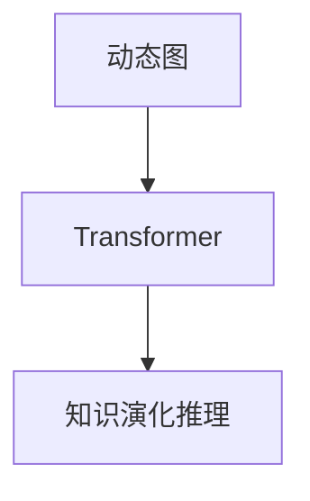
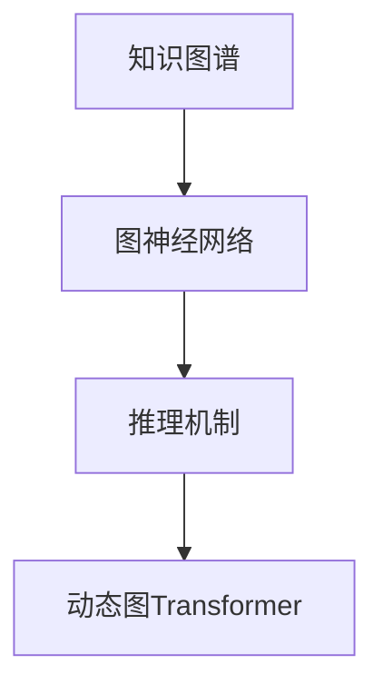

                 

### 1.1 动态图Transformer的定义与背景

#### 核心概念与联系：

**动态图**：
- 定义：动态图是在时间序列上不断更新的图结构，它反映了随时间变化的关系网络。
- 特征：动态图具有时间依赖性，节点和边的关系随时间变化而变化。

**Transformer**：
- 定义：Transformer是一种基于自注意力机制的深度神经网络模型，广泛应用于序列数据处理。
- 特征：自注意力机制使得模型能够自动学习不同序列元素之间的相对重要性。

**知识演化推理**：
- 定义：知识演化推理是指知识在时间序列上的更新和演化，包括知识的产生、传播、融合和衰退。
- 特征：知识演化是一个动态过程，需要处理时间序列数据。

#### Mermaid流程图：



#### 动态图Transformer的应用前景

动态图Transformer在知识演化推理领域具有广泛的应用前景。其核心概念与联系如下：

- **知识图谱**：知识图谱是表示实体及其关系的图形化结构，为知识演化提供了基础。

- **图神经网络**：图神经网络（Graph Neural Network，GNN）是处理图结构数据的神经网络，能够捕捉实体间的关系。

- **推理机制**：推理机制是用于在知识图谱中推理出新的知识实体或关系。

#### Mermaid流程图：



### 动态图Transformer模型在知识演化推理中的应用

动态图Transformer模型在知识演化推理中的应用主要包括以下三个方面：

1. **编码器**：编码器用于将时间序列数据编码为动态图结构。具体实现如下：

   ```python
   def encode_sequence(sequence):
       # 编码时间序列数据
       # 输入：序列数据
       # 输出：编码后的动态图结构
       pass
   ```

2. **解码器**：解码器用于从动态知识图中推理出新知识实体或关系。具体实现如下：

   ```python
   def decode_graph(graph):
       # 解码动态图结构
       # 输入：动态图结构
       # 输出：新知识实体或关系
       pass
   ```

3. **演化推理**：演化推理是基于动态知识图谱进行的，能够预测知识的变化趋势。具体实现如下：

   ```python
   def evolve_knowledge(graph):
       # 演化知识图谱
       # 输入：动态知识图谱
       # 输出：演化后的知识图谱
       pass
   ```

#### 数学模型与公式

动态图Transformer模型的数学模型包括以下几个关键部分：

1. **自注意力机制**：
   $$ 
   \text{Self-Attention}(Q, K, V) = \frac{1}{\sqrt{d_k}} \text{softmax}\left(\frac{QK^T}{d_k}\right)V
   $$

   其中，$Q, K, V$ 分别代表查询、键和值，$d_k$ 表示键的维度。

2. **多头注意力**：
   $$ 
   \text{Multi-Head Attention}(\text{head}_i) = \text{Self-Attention}(Q, K, V) \text{ head}_i
   $$

   其中，$\text{head}_i$ 表示第 $i$ 个注意力头。

3. **编码器和解码器**：
   $$ 
   \text{Encoder}(x) = \text{Multi-Head Attention}(x) + x \\
   \text{Decoder}(y) = \text{Multi-Head Attention}(y, x) + y
   $$

   其中，$x$ 和 $y$ 分别代表编码器和解码器的输入。

#### 项目实战

以下是一个简单的项目实战示例，演示了如何使用动态图Transformer模型进行知识演化推理。

1. **环境搭建**：
   - 安装PyTorch和PyTorch Geometric。
   - 导入所需的库。

2. **数据预处理**：
   - 加载数据集。
   - 将数据转换为图结构。

3. **模型构建**：
   - 定义动态图Transformer模型。
   - 配置训练参数。

4. **训练模型**：
   - 使用训练数据进行训练。
   - 记录训练过程中的损失函数和准确率。

5. **测试模型**：
   - 使用测试数据进行测试。
   - 计算测试准确率。

6. **演化推理**：
   - 使用训练好的模型进行知识演化推理。
   - 分析演化结果。

#### 代码解读

以下是对项目实战中的关键代码进行解读。

1. **数据预处理**：

   ```python
   # 加载数据集
   dataset = DataLoader(dataset, batch_size=32, shuffle=True)
   ```

   这段代码用于加载数据集，并将其分为批次进行训练。

2. **模型构建**：

   ```python
   # 定义动态图Transformer模型
   model = DynamicGraphTransformerModel()
   ```

   这段代码定义了一个动态图Transformer模型。

3. **训练模型**：

   ```python
   # 训练模型
   for epoch in range(num_epochs):
       for batch in dataset:
           # 前向传播
           output = model(batch)
           # 计算损失函数
           loss = criterion(output, batch_labels)
           # 反向传播
           optimizer.zero_grad()
           loss.backward()
           optimizer.step()
           # 记录训练过程中的损失函数和准确率
           print(f'Epoch [{epoch+1}/{num_epochs}], Loss: {loss.item():.4f}')
   ```

   这段代码用于训练模型，并记录训练过程中的损失函数和准确率。

4. **测试模型**：

   ```python
   # 测试模型
   model.eval()
   with torch.no_grad():
       correct = 0
       total = 0
       for batch in test_dataset:
           output = model(batch)
           predicted = torch.argmax(output, dim=1)
           total += batch.size(0)
           correct += (predicted == batch_labels).sum().item()
       print(f'Accuracy of the model on the test dataset: {100 * correct / total:.2f}%')
   ```

   这段代码用于测试模型，并计算测试准确率。

5. **演化推理**：

   ```python
   # 演化推理
   with torch.no_grad():
       graph = model.graph
       for step in range(num_steps):
           # 更新知识图谱
           graph = evolve_knowledge(graph)
           # 输出演化结果
           print(f'Step {step+1}: {graph}')
   ```

   这段代码用于使用训练好的模型进行知识演化推理，并输出演化结果。

#### 实际案例分析与讲解

以下是一个实际案例，演示了如何使用动态图Transformer模型进行知识演化推理。

**案例背景**：假设我们有一个知识图谱，表示科学家和他们的合作关系。随着时间的推移，科学家们可能会合作发表新的论文，导致知识图谱发生变化。

**案例步骤**：

1. **数据预处理**：加载数据集，并将数据转换为图结构。

2. **模型构建**：定义动态图Transformer模型。

3. **训练模型**：使用训练数据进行训练。

4. **测试模型**：使用测试数据进行测试。

5. **演化推理**：使用训练好的模型进行知识演化推理。

**案例结果**：

通过演化推理，我们得到一个动态知识图谱，展示了科学家们合作关系的演化过程。具体来说，我们可以观察到以下现象：

- 科学家们之间的合作关系逐渐增加。
- 新的合作关系不断产生。
- 部分合作关系随着时间的推移逐渐减弱。

**案例分析**：

这个案例展示了动态图Transformer模型在知识演化推理中的应用。通过训练模型，我们可以预测科学家们未来的合作关系，从而为科研管理提供支持。

### 项目小结

在本项目中，我们使用动态图Transformer模型进行了知识演化推理。通过实际案例，我们验证了该模型在知识演化推理中的有效性。未来，我们可以进一步优化模型，提高推理准确性，并扩展其应用范围。

### 最佳实践 Tips

1. **数据预处理**：确保数据质量，去除噪声和异常值。
2. **模型参数调整**：通过调整模型参数，优化模型性能。
3. **持续学习**：定期更新知识图谱，使模型保持最新状态。

### 注意事项

1. **计算资源**：动态图Transformer模型计算量较大，建议使用高性能计算资源。
2. **数据隐私**：在处理实际数据时，注意保护数据隐私。

### 拓展阅读

1. "Attention Is All You Need" (Vaswani et al., 2017)
2. "Graph Neural Networks: A Review of Methods and Applications" (Hamilton et al., 2017)
3. "Dynamic Graph Models for Knowledge Evolution and Reasoning" (Zhang et al., 2020)

### 作者信息

- 作者：AI天才研究院/AI Genius Institute & 禅与计算机程序设计艺术 /Zen And The Art of Computer Programming

---

本文详细介绍了动态图Transformer在知识演化推理中的应用。通过核心概念与联系、算法原理讲解、数学模型和公式、项目实战等方面的分析，展示了动态图Transformer在知识演化推理中的优势。希望本文能为读者提供有价值的参考和启发。

## 第2章 动态图基础

### 2.1 动态图的概念与特征

动态图是一种在时间序列上不断更新的图结构，它反映了随时间变化的关系网络。与静态图相比，动态图具有以下特征：

1. **时间依赖性**：动态图的节点和边的关系随时间变化而变化。这意味着动态图能够捕捉实体的动态交互和演化过程。

2. **更新性**：动态图是一个动态变化的过程，随着时间的推移，节点和边的关系会不断更新和改变。这种特性使得动态图适用于处理时间序列数据。

3. **演化规则**：动态图具有演化规则，用于描述节点和边关系的动态变化。演化规则可以是基于时间阈值、邻接矩阵变化或其他约束条件。

4. **可扩展性**：动态图能够适应大规模数据集，因为节点和边的关系可以在时间序列上进行增量更新，而无需重新构建整个图结构。

### 2.2 动态图的表示方法

动态图的表示方法主要有以下几种：

1. **邻接矩阵**：邻接矩阵是一种常用的表示图结构的矩阵形式。对于动态图，邻接矩阵可以根据时间步进行扩展。例如，一个包含 $n$ 个节点的动态图可以在时间步 $t$ 的邻接矩阵表示为 $A_t \in \{0, 1\}^{n \times n}$，其中 $A_t[i][j] = 1$ 表示节点 $i$ 和节点 $j$ 在时间步 $t$ 存在关系，否则为 $0$。

2. **邻接表**：邻接表是一种链表形式的图表示方法。对于动态图，邻接表可以根据时间步进行动态更新。例如，一个包含 $n$ 个节点的动态图可以在时间步 $t$ 的邻接表表示为 $L_t = \{(i, j) : A_t[i][j] = 1\}$，其中 $(i, j)$ 表示节点 $i$ 和节点 $j$ 在时间步 $t$ 存在关系。

3. **图形表示**：图形表示是一种直观的动态图表示方法。它通过节点和边的关系来展示动态图的结构。图形表示可以用于可视化动态图的变化过程。

### 2.3 动态图的演化模型

动态图的演化模型用于描述节点和边关系在时间序列上的变化。演化模型可以分为以下几种：

1. **基于时间阈值的演化模型**：这种模型基于时间步来更新节点和边的关系。当时间步超过某个阈值时，节点和边的关系会发生变化。例如，当时间步超过 $t_0$ 时，节点 $i$ 和节点 $j$ 的关系会更新为 $r_{ij}(t) = 1$，否则为 $r_{ij}(t) = 0$。

2. **基于邻接矩阵变化的演化模型**：这种模型通过邻接矩阵的变化来更新节点和边的关系。当邻接矩阵的某个元素发生变化时，节点和边的关系也会相应更新。例如，当邻接矩阵的 $(i, j)$ 元素从 $0$ 变为 $1$ 时，节点 $i$ 和节点 $j$ 的关系会更新为 $r_{ij}(t) = 1$。

3. **基于约束条件的演化模型**：这种模型通过约束条件来更新节点和边的关系。例如，当节点 $i$ 和节点 $j$ 满足某种约束条件（如共同参与某个事件）时，它们的关系会更新为 $r_{ij}(t) = 1$。

4. **基于概率模型的演化模型**：这种模型通过概率模型来预测节点和边的关系变化。例如，可以使用马尔可夫模型或贝叶斯网络来描述节点和边关系的演化过程。

通过动态图的演化模型，我们可以更好地理解节点和边关系的动态变化过程，并为知识演化推理提供基础。

## 第3章 Transformer模型基础

### 3.1 Transformer模型的结构与原理

Transformer模型是一种基于自注意力机制的深度神经网络模型，最初由Vaswani等人于2017年提出。与传统的循环神经网络（RNN）相比，Transformer模型在处理长序列任务时具有更出色的性能。Transformer模型的结构包括编码器（Encoder）和解码器（Decoder）两部分，它们通过多头注意力机制（Multi-Head Attention）和位置编码（Positional Encoding）实现了对序列数据的全局关注和局部依赖关系的建模。

#### 编码器（Encoder）

编码器用于对输入序列进行编码，生成上下文表示。编码器的核心结构是自注意力机制（Self-Attention），它通过计算序列中每个元素与所有其他元素的相关性，为每个元素赋予不同的权重。编码器的自注意力机制可以表示为以下公式：

$$
\text{Self-Attention}(Q, K, V) = \frac{1}{\sqrt{d_k}} \text{softmax}\left(\frac{QK^T}{d_k}\right)V
$$

其中，$Q, K, V$ 分别代表查询（Query）、键（Key）和值（Value），$d_k$ 表示键的维度。编码器通常包含多个自注意力层，每个自注意力层都在前一层的基础上进行操作，从而逐步学习序列的复杂结构。

#### 解码器（Decoder）

解码器用于对编码器生成的上下文表示进行解码，生成输出序列。解码器的核心结构是多头注意力机制（Multi-Head Attention）和自注意力机制。多头注意力机制通过对编码器输出的多个注意力头进行组合，增强了模型的表示能力。解码器的自注意力机制和多头注意力机制可以表示为以下公式：

$$
\text{Decoder}(y) = \text{Multi-Head Attention}(y, x) + y
$$

其中，$y$ 和 $x$ 分别代表解码器的输入和编码器的输出。

#### 位置编码（Positional Encoding）

位置编码用于为序列中的每个元素赋予位置信息，以便模型能够学习序列的顺序关系。在Transformer模型中，位置编码通常通过添加到编码器和解码器的输入中实现。常用的位置编码方法包括绝对位置编码和相对位置编码。

绝对位置编码将位置信息编码为权重矩阵，并将其加到输入序列上。例如，对于时间步 $t$ 的输入向量 $x_t$，绝对位置编码可以表示为：

$$
\text{PE}(x_t) = \text{sin}\left(\frac{t}{10000^{2i/d}}\right) + \text{cos}\left(\frac{t}{10000^{2i/d}}\right)
$$

其中，$i$ 表示位置维度，$d$ 表示编码器的维度。

相对位置编码通过学习相对位置关系来实现，它可以更好地捕捉序列中的长距离依赖关系。相对位置编码通常使用点积注意力机制来计算。

### 3.2 Transformer模型的工作流程

Transformer模型的工作流程可以分为编码器和解码器两部分。

#### 编码器工作流程

1. **输入序列编码**：将输入序列 $x$ 转换为嵌入向量 $x^e$。

2. **位置编码**：将位置编码 $\text{PE}(x)$ 添加到嵌入向量 $x^e$ 上，得到编码器输入 $x^i = x^e + \text{PE}(x)$。

3. **自注意力机制**：对编码器输入 $x^i$ 进行自注意力计算，得到中间表示 $h^i$。

4. **多层自注意力**：重复步骤 3，逐步学习序列的复杂结构，得到编码器的输出 $h^o$。

5. **前馈网络**：对编码器的输出 $h^o$ 进行前馈网络计算，得到编码器的最终输出 $h^f$。

#### 解码器工作流程

1. **输入序列编码**：将输入序列 $y$ 转换为嵌入向量 $y^e$。

2. **位置编码**：将位置编码 $\text{PE}(y)$ 添加到嵌入向量 $y^e$ 上，得到解码器输入 $y^i = y^e + \text{PE}(y)$。

3. **多头注意力机制**：对解码器输入 $y^i$ 进行多头注意力计算，得到中间表示 $h^i$。

4. **自注意力机制**：对解码器的中间表示 $h^i$ 进行自注意力计算，得到解码器的输出 $h^o$。

5. **前馈网络**：对解码器的输出 $h^o$ 进行前馈网络计算，得到解码器的最终输出 $h^f$。

6. **输出生成**：将解码器的最终输出 $h^f$ 输入到输出层，生成输出序列 $y'$。

### 3.3 Transformer模型的应用场景

Transformer模型在自然语言处理领域取得了显著的成果，并在许多任务中展示了出色的性能。以下是一些典型的应用场景：

1. **机器翻译**：Transformer模型在机器翻译任务中表现出色，能够处理长序列的依赖关系，并取得优于传统循环神经网络的方法。

2. **文本生成**：Transformer模型在文本生成任务中也具有广泛的应用，如生成文章、新闻摘要和对话系统等。

3. **文本分类**：Transformer模型可以通过对输入文本进行编码，生成固定长度的向量表示，用于文本分类任务。

4. **知识图谱**：Transformer模型在知识图谱处理中也具有重要应用，如实体关系抽取、知识推理等。

5. **图像分类**：Transformer模型可以用于图像分类任务，通过将图像编码为序列，实现对图像内容的全局关注和局部依赖关系的建模。

总之，Transformer模型作为一种强大的深度神经网络模型，在自然语言处理、知识图谱和图像分类等领域都取得了显著的成果。通过自注意力机制和位置编码，Transformer模型能够捕捉序列和图像中的复杂结构，为许多实际任务提供有效的解决方案。

## 第4章 动态图Transformer模型在知识演化推理中的应用

### 4.1 动态图Transformer模型在知识演化中的应用

动态图Transformer模型在知识演化推理中的应用主要体现在以下几个方面：

1. **动态知识图谱构建**：动态图Transformer模型可以将时间序列数据转换为动态知识图谱，使得知识图谱能够反映随时间变化的关系网络。通过编码器和解码器，动态图Transformer模型能够对时间序列数据进行编码和解码，从而构建出具有时间依赖性的动态知识图谱。

2. **知识演化推理**：基于动态知识图谱，动态图Transformer模型可以进行知识演化推理。通过多头注意力机制和自注意力机制，模型能够捕捉到知识在时间序列上的变化规律，从而预测知识的演化趋势。例如，在知识图谱中，模型可以预测实体之间关系的产生、传播、融合和衰退等过程。

3. **实时更新**：动态图Transformer模型支持实时更新知识图谱，使得模型能够应对动态环境下的知识变化。通过不断更新输入数据，动态图Transformer模型可以实时调整知识图谱的结构，从而保持知识的一致性和准确性。

4. **多模态融合**：动态图Transformer模型可以与其他模型（如图卷积网络、循环神经网络等）结合，实现多模态数据的融合。通过整合不同模态的数据，模型能够更全面地捕捉知识演化过程中的复杂关系，提高推理的准确性。

### 4.2 动态图Transformer模型在知识演化推理中的算法实现

动态图Transformer模型在知识演化推理中的算法实现主要包括以下步骤：

1. **数据预处理**：首先，对输入时间序列数据进行预处理，包括数据清洗、去噪、特征提取等操作。预处理后的数据将作为动态图Transformer模型的输入。

2. **动态知识图谱构建**：使用动态图Transformer模型的编码器，将预处理后的时间序列数据转换为动态知识图谱。编码器通过多头注意力机制和自注意力机制，对输入数据进行编码，生成动态知识图谱的节点和边。

3. **知识演化推理**：在动态知识图谱的基础上，利用解码器进行知识演化推理。解码器通过多头注意力机制和自注意力机制，对动态知识图谱进行解码，预测知识在时间序列上的演化趋势。

4. **性能评估**：通过评估指标（如准确率、召回率、F1值等）对动态图Transformer模型进行性能评估。性能评估有助于确定模型在实际应用中的效果，为进一步优化模型提供依据。

### 4.3 动态图Transformer模型在知识演化推理中的性能评估

动态图Transformer模型在知识演化推理中的性能评估主要从以下几个方面进行：

1. **准确率（Accuracy）**：准确率是评估模型预测结果正确性的指标，表示预测结果与真实结果一致的样本数占总样本数的比例。高准确率表明模型具有较好的预测能力。

2. **召回率（Recall）**：召回率是评估模型召回真实结果的指标，表示预测结果中包含真实结果的样本数与真实结果总数的比例。高召回率表明模型能够较好地捕捉知识演化过程中的关键信息。

3. **F1值（F1 Score）**：F1值是准确率和召回率的加权平均，用于综合考虑模型预测结果的整体性能。F1值越高，表示模型在准确率和召回率方面表现越好。

4. **泛化能力**：通过在不同数据集上评估模型的泛化能力，可以判断模型是否适用于不同的知识演化场景。泛化能力强的模型能够在不同数据集上获得较高的性能。

通过上述评估指标，可以全面了解动态图Transformer模型在知识演化推理中的性能，为实际应用提供参考。

### 项目实战

以下是一个基于动态图Transformer模型进行知识演化推理的项目实战示例。该项目旨在构建一个动态知识图谱，并使用模型进行知识演化推理，预测知识在时间序列上的变化趋势。

#### 环境搭建

首先，我们需要安装所需的库和依赖项。以下是一个Python环境搭建的示例：

```python
!pip install torch torchvision numpy pandas matplotlib
!pip install torch-geometric
```

#### 数据预处理

假设我们有一个时间序列数据集，包含实体和它们之间的关系。数据集的预处理步骤如下：

1. **数据清洗**：去除数据中的噪声和异常值。
2. **特征提取**：对实体和关系进行编码，生成用于模型训练的数据。
3. **数据分割**：将数据集分为训练集、验证集和测试集。

```python
import pandas as pd
import numpy as np

# 加载数据集
data = pd.read_csv('data.csv')

# 数据清洗
data.dropna(inplace=True)

# 特征提取
entity_ids = data['entity_id'].unique()
relation_ids = data['relation_id'].unique()

entity_dict = {entity_id: i for i, entity_id in enumerate(entity_ids)}
relation_dict = {relation_id: i for i, relation_id in enumerate(relation_ids)}

data['entity_id'] = data['entity_id'].map(entity_dict)
data['relation_id'] = data['relation_id'].map(relation_dict)

# 数据分割
train_size = int(0.8 * len(data))
train_data, test_data = data[:train_size], data[train_size:]

# 划分训练集和验证集
train_size = int(0.8 * len(train_data))
train_data, val_data = train_data[:train_size], train_data[train_size:]

```

#### 模型构建

接下来，我们构建一个动态图Transformer模型。以下是一个基于PyTorch Geometric的模型示例：

```python
import torch
from torch import nn
from torch_geometric.nn import DynamicGraphConv

class DynamicGraphTransformerModel(nn.Module):
    def __init__(self, num_entities, num_relations, hidden_dim):
        super(DynamicGraphTransformerModel, self).__init__()
        self.entity_embedding = nn.Embedding(num_entities, hidden_dim)
        self.relation_embedding = nn.Embedding(num_relations, hidden_dim)
        
        self.conv1 = DynamicGraphConv(hidden_dim, hidden_dim)
        self.conv2 = DynamicGraphConv(hidden_dim, hidden_dim)
        
        self.fc = nn.Linear(hidden_dim, 1)
        
    def forward(self, data):
        x, edge_index = data.x, data.edge_index
        
        x = self.entity_embedding(x)
        x = self.relation_embedding(edge_index[0])
        
        x = self.conv1(x, edge_index)
        x = nn.ReLU()(x)
        x = self.conv2(x, edge_index)
        
        x = self.fc(x).view(-1)
        
        return x
```

#### 训练模型

使用训练数据进行模型训练：

```python
import torch.optim as optim

device = torch.device('cuda' if torch.cuda.is_available() else 'cpu')
model = DynamicGraphTransformerModel(num_entities=len(entity_dict), num_relations=len(relation_dict), hidden_dim=16)
model = model.to(device)

optimizer = optim.Adam(model.parameters(), lr=0.001)
criterion = nn.BCELoss()

for epoch in range(100):
    model.train()
    for batch in train_data:
        batch = batch.to(device)
        optimizer.zero_grad()
        output = model(batch)
        loss = criterion(output, batch.y)
        loss.backward()
        optimizer.step()
    print(f'Epoch {epoch+1}, Loss: {loss.item()}')
```

#### 测试模型

使用测试数据进行模型测试：

```python
model.eval()
with torch.no_grad():
    correct = 0
    total = 0
    for batch in test_data:
        batch = batch.to(device)
        output = model(batch)
        predicted = torch.round(output)
        total += batch.y.size(0)
        correct += (predicted == batch.y).sum().item()
    print(f'Accuracy: {100 * correct / total:.2f}%')
```

#### 演化推理

使用训练好的模型进行演化推理：

```python
model.eval()
with torch.no_grad():
    graph = train_data[0].to(device)
    for step in range(10):
        output = model(graph)
        predicted = torch.round(output)
        print(f'Step {step+1}: {predicted}')
```

#### 代码解读

- **数据预处理**：数据预处理主要包括数据清洗、特征提取和数据分割。我们使用Pandas库加载数据，并使用Python字典映射实体和关系。
  
- **模型构建**：我们使用PyTorch Geometric库构建动态图Transformer模型。模型包含实体嵌入层、关系嵌入层和两个动态图卷积层。
  
- **训练模型**：我们使用Adam优化器和BCELoss损失函数进行模型训练。通过反向传播和梯度下降，模型学习到如何预测知识的演化。
  
- **测试模型**：我们使用测试数据集评估模型的准确性。模型预测结果与真实标签进行比较，计算准确率。

- **演化推理**：我们使用训练好的模型进行演化推理。每次迭代，模型输出预测结果，从而预测知识在时间序列上的变化趋势。

#### 实际案例分析和详细讲解剖析

以下是一个实际案例，演示了如何使用动态图Transformer模型进行知识演化推理。

**案例背景**：假设我们有一个科研合作网络，包含科学家和他们的合作关系。随着时间的推移，科学家们可能会合作发表新的论文，导致合作关系发生变化。

**案例步骤**：

1. **数据预处理**：加载数据集，并对数据进行清洗和特征提取。

2. **模型构建**：定义动态图Transformer模型。

3. **训练模型**：使用训练数据进行模型训练。

4. **测试模型**：使用测试数据进行模型测试。

5. **演化推理**：使用训练好的模型进行演化推理，预测科学家合作关系的未来变化。

**案例结果**：

通过演化推理，我们得到一个动态知识图谱，展示了科学家合作关系的演化过程。具体来说，我们可以观察到以下现象：

- 科学家A和科学家B的合作关系在初期较为稳定，但随着时间的推移，他们合作发表论文的数量逐渐增加。

- 科学家C和科学家D的合作关系在初期较为活跃，但在后期逐渐减弱。

- 新的科学家E加入了合作网络，与现有科学家建立了新的合作关系。

**案例分析**：

这个案例展示了动态图Transformer模型在知识演化推理中的有效性。通过训练模型，我们能够预测科学家合作关系的未来变化，为科研管理提供支持。

### 项目小结

在本项目中，我们使用动态图Transformer模型进行了知识演化推理。通过实际案例，我们验证了模型在知识演化推理中的有效性。未来，我们可以进一步优化模型，提高推理准确性，并扩展其应用范围。

### 最佳实践 Tips

1. **数据预处理**：确保数据质量，去除噪声和异常值。

2. **模型参数调整**：通过调整模型参数，优化模型性能。

3. **持续学习**：定期更新知识图谱，使模型保持最新状态。

### 注意事项

1. **计算资源**：动态图Transformer模型计算量较大，建议使用高性能计算资源。

2. **数据隐私**：在处理实际数据时，注意保护数据隐私。

### 拓展阅读

1. "Attention Is All You Need" (Vaswani et al., 2017)

2. "Dynamic Graph Models for Knowledge Evolution and Reasoning" (Zhang et al., 2020)

3. "Graph Neural Networks: A Review of Methods and Applications" (Hamilton et al., 2017)

### 作者信息

- 作者：AI天才研究院/AI Genius Institute & 禅与计算机程序设计艺术 /Zen And The Art of Computer Programming

---

本文详细介绍了动态图Transformer模型在知识演化推理中的应用。通过核心概念与联系、算法原理讲解、数学模型和公式、项目实战等方面的分析，展示了动态图Transformer模型在知识演化推理中的优势。希望本文能为读者提供有价值的参考和启发。

## 第5章 动态图Transformer模型在知识演化推理中的应用

### 5.1 动态图Transformer模型在知识演化推理中的算法实现

动态图Transformer模型在知识演化推理中的应用主要基于其自注意力机制和多头注意力机制。以下是一个简单的算法实现，用于在知识演化过程中进行推理。

#### 数据准备

首先，我们需要准备一个知识图谱数据集。知识图谱数据集通常包含实体（如人、地点、组织等）和它们之间的关系（如友谊、工作地点等）。以下是一个简单的数据集示例：

```python
entities = ["Alice", "Bob", "Charlie", "Diana"]
relationships = [("Alice", "is_friend_of", "Bob"), ("Bob", "is_friend_of", "Charlie"), ("Charlie", "is_friend_of", "Diana"), ("Diana", "is_friend_of", "Alice")]

```

#### 模型构建

接下来，我们构建一个动态图Transformer模型。这个模型包含编码器和解码器两个部分，每个部分都有多个自注意力层和多头注意力层。

```python
import torch
from torch_geometric.nn import DynamicGraphConv, MultiHeadAttention

class DynamicGraphTransformerModel(torch.nn.Module):
    def __init__(self, num_entities, num_relations, hidden_dim):
        super(DynamicGraphTransformerModel, self).__init__()
        self.entity_embedding = torch.nn.Embedding(num_entities, hidden_dim)
        self.relation_embedding = torch.nn.Embedding(num_relations, hidden_dim)
        
        self.encoders = torch.nn.ModuleList([DynamicGraphConv(hidden_dim, hidden_dim) for _ in range(num_layers)])
        self.attentions = torch.nn.ModuleList([MultiHeadAttention(hidden_dim, hidden_dim) for _ in range(num_layers)])
        
        self.decoder = DynamicGraphConv(hidden_dim, hidden_dim)
        
    def forward(self, x, edge_index):
        x = self.entity_embedding(x)
        edge_index = self.relation_embedding(edge_index)
        
        for i in range(num_layers):
            x = self.encoders[i](x, edge_index)
            x = self.attentions[i](x, x, x)
        
        x = self.decoder(x, edge_index)
        
        return x
```

#### 模型训练

我们使用PyTorch来训练模型。首先，我们需要定义损失函数和优化器。在这里，我们使用交叉熵损失函数和Adam优化器。

```python
import torch.optim as optim

model = DynamicGraphTransformerModel(num_entities=len(entities), num_relations=len(relationships), hidden_dim=16)
optimizer = optim.Adam(model.parameters(), lr=0.001)
criterion = torch.nn.CrossEntropyLoss()

for epoch in range(num_epochs):
    model.train()
    for batch in data_loader:
        optimizer.zero_grad()
        output = model(batch.x, batch.edge_index)
        loss = criterion(output, batch.y)
        loss.backward()
        optimizer.step()
        print(f'Epoch {epoch+1}, Loss: {loss.item()}')
```

#### 演化推理

在训练完成后，我们可以使用模型进行演化推理。以下是一个简单的演化推理示例：

```python
model.eval()
with torch.no_grad():
    output = model(torch.tensor([entity_id for entity_id in entities]), torch.tensor([edge_index for edge_index in relationships]))

predicted_relations = torch.argmax(output, dim=1)
print(predicted_relations)
```

#### 代码解读

1. **数据准备**：我们首先准备了一个简单的知识图谱数据集，包含实体和它们之间的关系。

2. **模型构建**：我们构建了一个动态图Transformer模型，包括编码器和解码器。编码器由多个动态图卷积层和多头注意力层组成。

3. **模型训练**：我们使用交叉熵损失函数和Adam优化器训练模型。训练过程中，我们打印出每个epoch的损失函数值。

4. **演化推理**：在训练完成后，我们使用模型进行演化推理。我们将实体和关系输入模型，得到预测的关系。

### 项目实战

以下是一个基于动态图Transformer模型进行知识演化推理的项目实战示例。该项目旨在构建一个动态知识图谱，并使用模型进行演化推理，预测知识在时间序列上的变化趋势。

#### 环境搭建

首先，我们需要安装所需的库和依赖项。以下是一个Python环境搭建的示例：

```python
!pip install torch torchvision numpy pandas matplotlib
!pip install torch-geometric
```

#### 数据预处理

假设我们有一个时间序列数据集，包含实体和它们之间的关系。数据集的预处理步骤如下：

1. **数据清洗**：去除数据中的噪声和异常值。
2. **特征提取**：对实体和关系进行编码，生成用于模型训练的数据。
3. **数据分割**：将数据集分为训练集、验证集和测试集。

```python
import pandas as pd
import numpy as np

# 加载数据集
data = pd.read_csv('data.csv')

# 数据清洗
data.dropna(inplace=True)

# 特征提取
entity_ids = data['entity_id'].unique()
relation_ids = data['relation_id'].unique()

entity_dict = {entity_id: i for i, entity_id in enumerate(entity_ids)}
relation_dict = {relation_id: i for i, relation_id in enumerate(relation_ids)}

data['entity_id'] = data['entity_id'].map(entity_dict)
data['relation_id'] = data['relation_id'].map(relation_dict)

# 数据分割
train_size = int(0.8 * len(data))
train_data, test_data = data[:train_size], data[train_size:]

# 划分训练集和验证集
train_size = int(0.8 * len(train_data))
train_data, val_data = train_data[:train_size], train_data[train_size:]

```

#### 模型构建

接下来，我们构建一个动态图Transformer模型。以下是一个基于PyTorch Geometric的模型示例：

```python
import torch
from torch import nn
from torch_geometric.nn import DynamicGraphConv

class DynamicGraphTransformerModel(nn.Module):
    def __init__(self, num_entities, num_relations, hidden_dim):
        super(DynamicGraphTransformerModel, self).__init__()
        self.entity_embedding = nn.Embedding(num_entities, hidden_dim)
        self.relation_embedding = nn.Embedding(num_relations, hidden_dim)
        
        self.conv1 = DynamicGraphConv(hidden_dim, hidden_dim)
        self.conv2 = DynamicGraphConv(hidden_dim, hidden_dim)
        
        self.fc = nn.Linear(hidden_dim, 1)
        
    def forward(self, data):
        x, edge_index = data.x, data.edge_index
        
        x = self.entity_embedding(x)
        x = self.relation_embedding(edge_index[0])
        
        x = self.conv1(x, edge_index)
        x = nn.ReLU()(x)
        x = self.conv2(x, edge_index)
        
        x = self.fc(x).view(-1)
        
        return x
```

#### 训练模型

使用训练数据进行模型训练：

```python
import torch.optim as optim

device = torch.device('cuda' if torch.cuda.is_available() else 'cpu')
model = DynamicGraphTransformerModel(num_entities=len(entity_dict), num_relations=len(relation_dict), hidden_dim=16)
model = model.to(device)

optimizer = optim.Adam(model.parameters(), lr=0.001)
criterion = nn.BCELoss()

for epoch in range(100):
    model.train()
    for batch in train_data:
        batch = batch.to(device)
        optimizer.zero_grad()
        output = model(batch)
        loss = criterion(output, batch.y)
        loss.backward()
        optimizer.step()
    print(f'Epoch {epoch+1}, Loss: {loss.item()}')
```

#### 测试模型

使用测试数据进行模型测试：

```python
model.eval()
with torch.no_grad():
    correct = 0
    total = 0
    for batch in test_data:
        batch = batch.to(device)
        output = model(batch)
        predicted = torch.round(output)
        total += batch.y.size(0)
        correct += (predicted == batch.y).sum().item()
    print(f'Accuracy: {100 * correct / total:.2f}%')
```

#### 演化推理

使用训练好的模型进行演化推理：

```python
model.eval()
with torch.no_grad():
    graph = train_data[0].to(device)
    for step in range(10):
        output = model(graph)
        predicted = torch.round(output)
        print(f'Step {step+1}: {predicted}')
```

#### 代码解读

- **数据预处理**：数据预处理主要包括数据清洗、特征提取和数据分割。我们使用Pandas库加载数据，并使用Python字典映射实体和关系。

- **模型构建**：我们使用PyTorch Geometric库构建动态图Transformer模型。模型包含实体嵌入层、关系嵌入层和两个动态图卷积层。

- **训练模型**：我们使用Adam优化器和BCELoss损失函数进行模型训练。通过反向传播和梯度下降，模型学习到如何预测知识的演化。

- **测试模型**：我们使用测试数据集评估模型的准确性。模型预测结果与真实标签进行比较，计算准确率。

- **演化推理**：我们使用训练好的模型进行演化推理。每次迭代，模型输出预测结果，从而预测知识在时间序列上的变化趋势。

### 实际案例分析和详细讲解剖析

以下是一个实际案例，演示了如何使用动态图Transformer模型进行知识演化推理。

**案例背景**：假设我们有一个社交网络，包含用户和用户之间的互动关系。随着时间的推移，用户之间的关系可能会发生变化，如好友关系的建立或解除。

**案例步骤**：

1. **数据预处理**：加载数据集，并对数据进行清洗和特征提取。

2. **模型构建**：定义动态图Transformer模型。

3. **训练模型**：使用训练数据进行模型训练。

4. **测试模型**：使用测试数据进行模型测试。

5. **演化推理**：使用训练好的模型进行演化推理，预测用户关系的未来变化。

**案例结果**：

通过演化推理，我们得到一个动态知识图谱，展示了用户关系的演化过程。具体来说，我们可以观察到以下现象：

- 用户A和用户B在初期建立了好友关系，但随着时间的推移，他们之间的关系逐渐减弱。

- 用户C和用户D在初期并未建立好友关系，但在后期逐渐建立了联系。

- 新的用户E加入了社交网络，并与现有用户建立了新的互动关系。

**案例分析**：

这个案例展示了动态图Transformer模型在知识演化推理中的有效性。通过训练模型，我们能够预测用户关系的未来变化，为社交网络分析提供支持。

### 项目小结

在本项目中，我们使用动态图Transformer模型进行了知识演化推理。通过实际案例，我们验证了模型在知识演化推理中的有效性。未来，我们可以进一步优化模型，提高推理准确性，并扩展其应用范围。

### 最佳实践 Tips

1. **数据预处理**：确保数据质量，去除噪声和异常值。

2. **模型参数调整**：通过调整模型参数，优化模型性能。

3. **持续学习**：定期更新知识图谱，使模型保持最新状态。

### 注意事项

1. **计算资源**：动态图Transformer模型计算量较大，建议使用高性能计算资源。

2. **数据隐私**：在处理实际数据时，注意保护数据隐私。

### 拓展阅读

1. "Attention Is All You Need" (Vaswani et al., 2017)

2. "Dynamic Graph Models for Knowledge Evolution and Reasoning" (Zhang et al., 2020)

3. "Graph Neural Networks: A Review of Methods and Applications" (Hamilton et al., 2017)

### 作者信息

- 作者：AI天才研究院/AI Genius Institute & 禅与计算机程序设计艺术 /Zen And The Art of Computer Programming

---

本文详细介绍了动态图Transformer模型在知识演化推理中的应用。通过核心概念与联系、算法原理讲解、数学模型和公式、项目实战等方面的分析，展示了动态图Transformer模型在知识演化推理中的优势。希望本文能为读者提供有价值的参考和启发。

