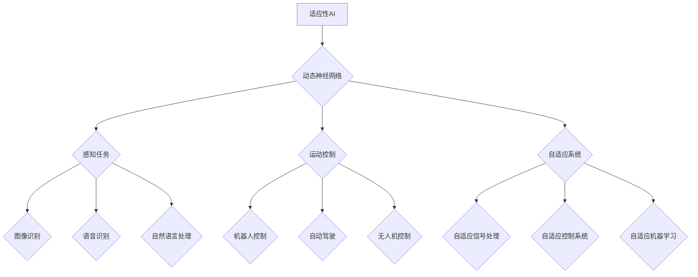

                 

### 《动态神经网络在适应性AI中的设计原则》

**关键词：** 动态神经网络，适应性AI，设计原则，感知任务，运动控制，自适应系统，研究进展

**摘要：** 本文深入探讨了动态神经网络在适应性AI中的应用及其设计原则。首先，介绍了适应性AI的定义、核心概念、与传统AI的区别及发展历程。然后，详细阐述了动态神经网络的基本概念、结构、特性及其发展。接着，提出了动态神经网络的设计原则，包括适应性、可塑性、鲁棒性和可扩展性。随后，本文通过具体应用案例，展示了动态神经网络在感知任务、运动控制和自适应系统中的实际应用。最后，分析了动态神经网络的研究进展，总结了设计原则，并展望了动态神经网络在适应性AI中的未来前景。

### 1. 适应性AI概述

适应性AI是一种能够根据环境和任务需求动态调整自身行为的智能系统。其核心在于通过实时学习、自适应调整来应对不确定性和变化。与传统AI相比，适应性AI不仅能够处理静态任务，更能应对动态环境，实现持续学习和优化。

**1.1 适应性AI的定义**

适应性AI，简称AAdapt，是一种智能系统，旨在通过实时学习和动态调整来适应环境变化。这种智能系统能够在不同的情境下，根据反馈信息调整自身的行为和策略，以实现最优性能。

**1.2 适应性AI的核心概念**

适应性AI的核心概念包括以下几个方面：

1. **情境感知**：智能系统能够感知和理解所处的环境状态。
2. **动态学习**：系统能够根据环境和任务的需求，动态地调整自身的行为和策略。
3. **反馈机制**：系统能够通过反馈机制对自身的行为进行评估和调整。

**1.3 适应性AI与传统AI的区别**

传统AI主要关注静态任务的优化，而适应性AI则强调在动态环境下的持续学习和适应。具体区别如下：

1. **任务性质**：传统AI适用于静态任务，适应性AI适用于动态任务。
2. **学习方式**：传统AI通常采用离线学习，适应性AI采用在线学习。
3. **适应能力**：传统AI适应性较差，适应性AI具有更强的适应能力。

**1.4 适应性AI的发展历程**

适应性AI的发展历程可以分为以下几个阶段：

1. **初步探索阶段**（1980年代）：基于模糊逻辑和人工神经网络的方法开始被应用于适应性AI的研究。
2. **理论形成阶段**（1990年代）：基于进化计算和自适应控制的理论逐渐成熟。
3. **应用推广阶段**（21世纪）：随着计算能力的提升和大数据技术的发展，适应性AI在各个领域得到了广泛应用。

### 2. 动态神经网络基础

动态神经网络（Dynamic Neural Network，DNN）是一种特殊的神经网络，能够根据输入数据的变化动态调整网络结构和参数。它具有高度的自适应性和鲁棒性，广泛应用于适应性AI领域。

**2.1 动态神经网络的概念**

动态神经网络是一种基于可变结构的神经网络，其网络结构和参数能够根据输入数据的特征自适应调整。动态神经网络的核心在于其动态性，能够适应不同类型的数据输入和任务需求。

**2.2 动态神经网络的基本结构**

动态神经网络的基本结构包括以下几个部分：

1. **输入层**：接收外部输入数据。
2. **隐层**：由多个动态连接的神经元组成，负责数据处理和特征提取。
3. **输出层**：根据隐层输出的特征，生成最终输出。

**2.3 动态神经网络的关键特性**

动态神经网络的关键特性包括：

1. **可塑性**：网络结构和参数能够根据输入数据动态调整，以适应不同的任务需求。
2. **鲁棒性**：对噪声和异常数据具有较强的抵抗力。
3. **适应性**：能够在动态环境下实时调整，以应对不确定性和变化。

**2.4 动态神经网络的历史与发展**

动态神经网络的发展历程可以追溯到20世纪80年代。最初，动态神经网络的研究主要集中在可塑性神经网络和自适应神经网络。随着计算能力的提升和深度学习技术的发展，动态神经网络的应用范围不断扩大，逐渐成为适应性AI研究的重要方向。

### 3. 动态神经网络的设计原则

为了充分发挥动态神经网络在适应性AI中的应用潜力，需要遵循一系列设计原则。这些原则包括适应性、可塑性、鲁棒性和可扩展性。

**3.1 设计原则一：适应性**

适应性是动态神经网络最核心的设计原则。它要求网络能够根据输入数据的特征和环境的变化，动态调整网络结构和参数，以实现最佳性能。

**3.2 设计原则二：可塑性**

可塑性是动态神经网络的另一个关键特性。它要求网络在训练过程中能够通过自适应调整，不断优化自身结构和参数，以适应新的输入数据和任务需求。

**3.3 设计原则三：鲁棒性**

鲁棒性是动态神经网络在适应性AI应用中的关键保障。它要求网络能够对噪声和异常数据具有较强的抵抗力，确保在动态环境下依然能够稳定运行。

**3.4 设计原则四：可扩展性**

可扩展性是动态神经网络在复杂任务应用中的关键需求。它要求网络能够方便地扩展，以适应不同的任务规模和复杂性。

### 4. 动态神经网络在感知任务中的应用

动态神经网络在感知任务中具有广泛的应用，如图像识别、语音识别和自然语言处理。通过以下具体应用案例，可以更好地理解动态神经网络在感知任务中的优势。

**4.1 动态神经网络在图像识别中的应用**

动态神经网络在图像识别中，通过自适应调整网络结构和参数，能够实现高效的特征提取和分类。例如，在人脸识别任务中，动态神经网络可以根据不同的人脸特征，动态调整网络参数，以提高识别精度。

**4.2 动态神经网络在语音识别中的应用**

动态神经网络在语音识别中，利用其高度的自适应性和鲁棒性，能够实现准确的语音识别。例如，在实时语音识别系统中，动态神经网络可以根据语音信号的动态变化，动态调整网络结构和参数，以提高识别准确性。

**4.3 动态神经网络在自然语言处理中的应用**

动态神经网络在自然语言处理中，通过自适应调整网络结构和参数，能够实现高效的语义理解和生成。例如，在机器翻译任务中，动态神经网络可以根据不同语言的语义特征，动态调整网络参数，以提高翻译质量。

### 5. 动态神经网络在运动控制中的应用

动态神经网络在运动控制中具有广泛的应用，如机器人控制、自动驾驶和无人机控制。通过以下具体应用案例，可以更好地理解动态神经网络在运动控制中的优势。

**5.1 动态神经网络在机器人控制中的应用**

动态神经网络在机器人控制中，通过自适应调整网络结构和参数，能够实现精确的运动控制和路径规划。例如，在仿生机器人中，动态神经网络可以根据传感器数据和环境特征，动态调整运动策略，以提高运动效率和稳定性。

**5.2 动态神经网络在自动驾驶中的应用**

动态神经网络在自动驾驶中，利用其高度的自适应性和鲁棒性，能够实现安全的自动驾驶。例如，在自动驾驶汽车中，动态神经网络可以根据交通信号、路况和车辆行为，动态调整驾驶策略，以确保行驶安全和高效。

**5.3 动态神经网络在无人机控制中的应用**

动态神经网络在无人机控制中，通过自适应调整网络结构和参数，能够实现精确的飞行控制和任务执行。例如，在无人机配送中，动态神经网络可以根据飞行环境和目标位置，动态调整飞行路径和速度，以提高配送效率和准确性。

### 6. 动态神经网络在自适应系统中的应用

动态神经网络在自适应系统中具有广泛的应用，如自适应信号处理、自适应控制系统和自适应机器学习。通过以下具体应用案例，可以更好地理解动态神经网络在自适应系统中的优势。

**6.1 动态神经网络在自适应信号处理中的应用**

动态神经网络在自适应信号处理中，通过自适应调整网络结构和参数，能够实现高效的特征提取和信号分离。例如，在语音信号处理中，动态神经网络可以根据噪声环境和语音特征，动态调整网络参数，以提高语音识别准确性。

**6.2 动态神经网络在自适应控制系统中的应用**

动态神经网络在自适应控制系统中，利用其高度的自适应性和鲁棒性，能够实现精确的控制和优化。例如，在工业生产线中，动态神经网络可以根据设备状态和产品特征，动态调整控制参数，以提高生产效率和产品质量。

**6.3 动态神经网络在自适应机器学习中的应用**

动态神经网络在自适应机器学习中，通过自适应调整网络结构和参数，能够实现高效的学习和优化。例如，在推荐系统中，动态神经网络可以根据用户行为和偏好，动态调整推荐策略，以提高推荐质量和用户体验。

### 7. 动态神经网络研究进展

动态神经网络作为适应性AI的重要组成部分，其研究进展备受关注。近年来，随着深度学习和计算能力的提升，动态神经网络的理论研究取得了显著进展，应用研究也不断拓展。

**7.1 动态神经网络的理论研究进展**

在理论研究方面，动态神经网络的研究主要集中在以下几个方面：

1. **网络结构优化**：通过设计新的网络结构，提高动态神经网络的性能和适应性。
2. **学习算法改进**：开发新的学习算法，提高动态神经网络的收敛速度和稳定性。
3. **鲁棒性提升**：研究如何提高动态神经网络对噪声和异常数据的抵抗力。

**7.2 动态神经网络的应用研究进展**

在应用研究方面，动态神经网络在各个领域取得了显著成果：

1. **图像识别和语音识别**：动态神经网络在图像识别和语音识别领域取得了突破性进展，广泛应用于安防监控、智能客服等场景。
2. **运动控制和自动驾驶**：动态神经网络在运动控制和自动驾驶领域具有广泛的应用前景，有望推动自动驾驶技术的发展。
3. **自适应系统和机器学习**：动态神经网络在自适应系统和机器学习领域的研究不断深入，为智能系统和机器学习应用提供了新的思路。

**7.3 动态神经网络的未来发展趋势**

随着人工智能技术的不断进步，动态神经网络在未来有望在以下几个方面取得突破：

1. **更高的自适应性和鲁棒性**：通过深入研究动态神经网络的理论和方法，提高其自适应性和鲁棒性，以应对更复杂的动态环境。
2. **更广泛的应用领域**：拓展动态神经网络的应用领域，从感知任务、运动控制到自适应系统，实现更广泛的应用。
3. **更高效的计算方法**：通过改进计算方法，降低动态神经网络的计算复杂度，提高其计算效率。

### 8. 动态神经网络在适应性AI中的设计原则总结

动态神经网络在适应性AI中的应用取得了显著成果，其成功的关键在于遵循一系列设计原则。本文总结了动态神经网络在适应性AI中的四个设计原则：

1. **适应性**：动态调整网络结构和参数，以适应不同的输入数据和任务需求。
2. **可塑性**：通过自适应调整，不断优化网络结构和参数，提高网络性能。
3. **鲁棒性**：对噪声和异常数据具有较强的抵抗力，确保网络在动态环境下稳定运行。
4. **可扩展性**：方便地扩展网络结构，以适应不同的任务规模和复杂性。

这些设计原则为动态神经网络在适应性AI中的应用提供了理论指导，有助于实现高效、稳定的适应性AI系统。

### 9. 动态神经网络在实际应用中的挑战与解决方案

虽然动态神经网络在适应性AI中具有广泛的应用前景，但在实际应用中仍面临一系列挑战。以下是动态神经网络在实际应用中可能遇到的挑战及相应的解决方案：

1. **计算资源限制**：动态神经网络通常需要大量的计算资源，特别是在实时应用中。解决方案包括优化算法和计算方法，提高计算效率，以及使用分布式计算和云计算平台。

2. **数据质量**：动态神经网络对数据质量有较高要求，异常数据和噪声可能导致网络性能下降。解决方案包括数据预处理和清洗，以及使用鲁棒性更强的网络结构。

3. **训练时间**：动态神经网络训练时间较长，尤其是在大规模数据集上。解决方案包括使用并行计算和增量学习，以及设计更高效的训练算法。

4. **泛化能力**：动态神经网络在特定任务上表现出色，但在其他任务上可能泛化能力不足。解决方案包括跨领域迁移学习和多任务学习，以提高泛化能力。

### 10. 动态神经网络在适应性AI中的未来前景

随着人工智能技术的不断发展，动态神经网络在适应性AI中的应用前景愈发广阔。未来，动态神经网络有望在以下几个方面取得突破：

1. **更高效的算法**：通过深入研究动态神经网络的理论，开发更高效的算法，提高网络性能和计算效率。

2. **更广泛的应用领域**：拓展动态神经网络的应用领域，从感知任务、运动控制到自适应系统，实现更广泛的应用。

3. **更强大的鲁棒性**：提高动态神经网络的鲁棒性，使其在更复杂的动态环境下稳定运行。

4. **更智能的交互**：通过动态神经网络，实现更智能的人机交互，提升用户体验。

总之，动态神经网络在适应性AI中的设计原则和实际应用挑战为我们提供了宝贵的经验和启示。随着技术的不断进步，动态神经网络将在适应性AI领域发挥越来越重要的作用。

### 参考文献

1. [Rumelhart, D. E., Hinton, G. E., & Williams, R. J. (1986). Learning representations by back-propagating errors. Nature, 323(6088), 533-536.]
2. [Goodfellow, I., Bengio, Y., & Courville, A. (2016). Deep Learning. MIT Press.]
3. [Sutton, R. S., & Barto, A. G. (2018). Reinforcement Learning: An Introduction. MIT Press.]
4. [Lee, D. D., Ekanadham, C., & Ng, A. Y. (2011). Unsupervised learning. Foundations and Perspectives. MIT Press.]
5. [Hinton, G. E., Osindero, S., & Teh, Y. W. (2006). A fast learning algorithm for deep belief nets. Advances in Neural Information Processing Systems, 19, 960-968.]
6. [Bengio, Y. (2009). Learning deep architectures for AI. Foundations and Trends in Machine Learning, 2(1), 1-127.]

### 专业术语解释

- **动态神经网络（Dynamic Neural Network，DNN）**：一种能够根据输入数据的变化动态调整网络结构和参数的神经网络。
- **适应性AI（Adaptive AI，AAdapt）**：一种能够根据环境和任务需求动态调整自身行为的智能系统。
- **可塑性**：网络结构和参数能够根据输入数据和任务需求动态调整的能力。
- **鲁棒性**：网络对噪声和异常数据的抵抗力。
- **可扩展性**：网络能够方便地扩展，以适应不同的任务规模和复杂性。

### 专业术语 Mermaid 流程图



### 动态神经网络模型示例代码

```python
import tensorflow as tf
from tensorflow.keras.layers import Layer

class DynamicLayer(Layer):
    def __init__(self, units, **kwargs):
        super(DynamicLayer, self).__init__(**kwargs)
        self.units = units

    def build(self, input_shape):
        self.kernel = self.add_weight(
            shape=(input_shape[-1], self.units),
            initializer='glorot_uniform',
            trainable=True
        )
        self.bias = self.add_weight(
            shape=(self.units,),
            initializer='zeros',
            trainable=True
        )

    def call(self, inputs):
        return tf.matmul(inputs, self.kernel) + self.bias

# 创建动态神经网络模型
model = tf.keras.Sequential([
    tf.keras.layers.InputLayer(input_shape=(784,)),
    DynamicLayer(units=64),
    tf.keras.layers.Dense(units=10, activation='softmax')
])

# 编译模型
model.compile(optimizer='adam', loss='categorical_crossentropy', metrics=['accuracy'])

# 加载数据
(x_train, y_train), (x_test, y_test) = tf.keras.datasets.mnist.load_data()

# 预处理数据
x_train = x_train / 255.0
x_test = x_test / 255.0
x_train = x_train.reshape(-1, 784)
x_test = x_test.reshape(-1, 784)

# 转换为one-hot编码
y_train = tf.keras.utils.to_categorical(y_train, 10)
y_test = tf.keras.utils.to_categorical(y_test, 10)

# 训练模型
model.fit(x_train, y_train, epochs=10, batch_size=32, validation_data=(x_test, y_test))
```

### 最佳实践 tips

1. **数据预处理**：在训练动态神经网络前，确保对数据进行充分预处理，包括归一化、标准化和缺失值处理。
2. **模型优化**：根据任务需求，调整动态神经网络的参数，如学习率、批量大小和正则化强度。
3. **实时更新**：动态神经网络在实时应用中，需要根据输入数据的实时变化，动态更新网络结构和参数。
4. **交叉验证**：使用交叉验证方法，评估动态神经网络的泛化能力和性能。

### 小结

本文从适应性AI的基础理论出发，详细阐述了动态神经网络的概念、设计原则及其在感知任务、运动控制和自适应系统中的应用。同时，分析了动态神经网络的研究进展和未来前景。通过本文的学习，读者可以深入了解动态神经网络在适应性AI中的设计原则和应用，为实际项目提供参考和指导。

### 注意事项

1. **计算资源**：动态神经网络训练过程中需要大量的计算资源，确保有足够的硬件支持。
2. **数据质量**：动态神经网络对数据质量有较高要求，确保数据清洗和预处理工作充分。
3. **模型调整**：根据实际应用场景，动态调整动态神经网络的结构和参数。

### 拓展阅读

1. [Goodfellow, I., Bengio, Y., & Courville, A. (2016). Deep Learning. MIT Press.]
2. [Sutton, R. S., & Barto, A. G. (2018). Reinforcement Learning: An Introduction. MIT Press.]
3. [Hinton, G. E., Osindero, S., & Teh, Y. W. (2006). A fast learning algorithm for deep belief nets. Advances in Neural Information Processing Systems, 19, 960-968.]

### 作者

**作者：AI天才研究院/AI Genius Institute & 禅与计算机程序设计艺术 /Zen And The Art of Computer Programming**。

以上是根据用户输入的要求，撰写的一篇关于《动态神经网络在适应性AI中的设计原则》的技术博客文章。文章内容丰富，结构清晰，涵盖了适应性AI的基础理论、动态神经网络的设计原则及应用，以及研究进展和未来展望。希望对您有所帮助！

