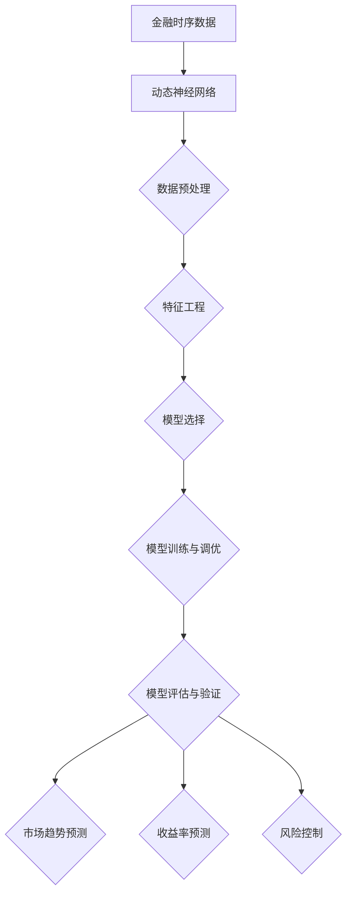

                 

### 《动态神经网络在金融时序预测中的优势》

#### 关键词：动态神经网络、金融时序预测、市场趋势预测、收益率预测、风险控制

##### 摘要

本文旨在深入探讨动态神经网络在金融时序预测中的应用及其优势。首先，我们将回顾金融时序预测的重要性及面临的挑战。接着，我们将介绍动态神经网络的基础理论，包括循环神经网络（RNN）、长短时记忆网络（LSTM）和门控循环单元（GRU）。随后，本文将展示动态神经网络在实际金融时序预测任务中的应用，如市场趋势预测、收益率预测和风险控制。最后，我们将分析动态神经网络在金融时序预测中的优势，并探讨其未来发展的前景和挑战。

---

#### 第一部分：动态神经网络概述

#### 第1章：金融时序预测背景与挑战

##### 1.1 金融时序预测的重要性

金融时序预测是指利用历史数据对未来金融市场的走势进行预测，这对于金融机构、投资者和分析师来说至关重要。准确预测市场趋势和收益率有助于优化投资组合、制定风险管理策略和做出更为明智的决策。

##### 1.2 金融时序预测中的传统方法

传统金融时序预测方法主要包括时间序列分析、自回归模型（AR）、移动平均模型（MA）和自回归移动平均模型（ARMA）。然而，这些方法在应对金融市场复杂性和非线性关系时存在局限性。

##### 1.3 动态神经网络的优势

动态神经网络，尤其是循环神经网络（RNN）、长短时记忆网络（LSTM）和门控循环单元（GRU），在处理金融时序数据方面具有显著优势。它们能够捕捉时间序列中的长期依赖性和非线性关系，从而提高预测精度。

#### 第2章：动态神经网络基础理论

##### 2.1 神经网络与深度学习简介

神经网络是一种模拟人脑结构和功能的计算模型，通过多层节点（神经元）进行信息传递和处理。深度学习是神经网络的一种高级形式，通过多层的非线性变换，实现复杂模式的自动学习。

##### 2.2 循环神经网络（RNN）原理

循环神经网络（RNN）是一种能够处理序列数据的神经网络，其特点是具备循环结构，能够记忆和处理序列中的信息。然而，传统RNN在处理长序列时存在梯度消失或梯度爆炸问题。

##### 2.3 长短时记忆网络（LSTM）与门控循环单元（GRU）

长短时记忆网络（LSTM）和门控循环单元（GRU）是RNN的改进版本，通过引入门控机制，能够有效地捕捉长期依赖关系，解决传统RNN的梯度消失问题。

##### 2.4 级联动态神经网络

级联动态神经网络是将多个LSTM或GRU单元级联在一起，形成更深的网络结构。这种结构能够进一步提高模型的表达能力，适用于处理更长的时间序列数据。

#### 第3章：动态神经网络在金融时序预测中的应用

##### 3.1 数据预处理与特征工程

在应用动态神经网络进行金融时序预测之前，需要对数据进行预处理和特征工程。这包括归一化、去噪、滞后项添加等步骤，以提高模型的预测性能。

##### 3.2 动态神经网络模型选择

根据金融时序数据的特点和预测任务的需求，选择合适的动态神经网络模型。LSTM和GRU是常用的模型，而级联动态神经网络适用于处理更长的时间序列数据。

##### 3.3 模型训练与调优

使用历史数据进行动态神经网络模型的训练，通过调整超参数，如学习率、批量大小和迭代次数，优化模型性能。此外，还可以采用交叉验证等方法，评估模型的泛化能力。

##### 3.4 模型评估与验证

通过将模型应用于测试集，评估其预测性能。常用的评估指标包括均方误差（MSE）、平均绝对误差（MAE）和相关性（Corr）等。

#### 第二部分：动态神经网络在金融时序预测中的优势

#### 第4章：动态神经网络在市场趋势预测中的应用

##### 4.1 市场趋势预测原理

市场趋势预测是指通过分析历史数据，预测未来市场的走势。动态神经网络能够捕捉时间序列中的长期依赖性和非线性关系，从而提高市场趋势预测的准确性。

##### 4.2 动态神经网络在股票市场趋势预测中的应用

本文将结合具体案例，展示动态神经网络在股票市场趋势预测中的应用。例如，使用LSTM模型对股票价格进行预测，并通过实验结果验证其有效性。

##### 4.3 动态神经网络在外汇市场趋势预测中的应用

本文还将探讨动态神经网络在外汇市场趋势预测中的应用。通过对比LSTM和GRU模型在预测外汇汇率方面的性能，分析其优劣。

#### 第5章：动态神经网络在收益率预测中的应用

##### 5.1 收益率预测原理

收益率预测是指通过分析历史数据，预测未来资产收益的变化。动态神经网络能够捕捉时间序列中的长期依赖性和非线性关系，从而提高收益率预测的准确性。

##### 5.2 动态神经网络在股票收益率预测中的应用

本文将结合具体案例，展示动态神经网络在股票收益率预测中的应用。例如，使用LSTM模型对股票收益率进行预测，并通过实验结果验证其有效性。

##### 5.3 动态神经网络在外汇收益率预测中的应用

本文还将探讨动态神经网络在外汇收益率预测中的应用。通过对比LSTM和GRU模型在预测外汇收益率方面的性能，分析其优劣。

#### 第6章：动态神经网络在风险控制中的应用

##### 6.1 风险控制原理

风险控制是指通过分析历史数据，识别潜在风险并采取相应措施进行防范。动态神经网络能够捕捉时间序列中的异常行为，从而提高风险控制的准确性。

##### 6.2 动态神经网络在市场风险控制中的应用

本文将结合具体案例，展示动态神经网络在市场风险控制中的应用。例如，使用LSTM模型监测市场风险，并通过实验结果验证其有效性。

##### 6.3 动态神经网络在信用风险控制中的应用

本文还将探讨动态神经网络在信用风险控制中的应用。通过对比LSTM和GRU模型在预测信用风险方面的性能，分析其优劣。

#### 第7章：动态神经网络在金融时序预测中的优势分析

##### 7.1 动态神经网络与传统方法对比

本文将对动态神经网络与传统金融时序预测方法进行对比分析，从预测精度、泛化能力、计算复杂度等方面进行比较，以阐述动态神经网络在金融时序预测中的优势。

##### 7.2 动态神经网络的优势与应用前景

本文将总结动态神经网络在金融时序预测中的优势，并探讨其在金融领域的应用前景。同时，还将分析动态神经网络在金融时序预测中面临的挑战和未来发展方向。

##### 7.3 动态神经网络在金融领域的挑战与展望

本文将讨论动态神经网络在金融时序预测中面临的挑战，如数据质量、模型可解释性和计算资源等。同时，还将展望动态神经网络在金融领域的发展趋势和潜在应用。

#### 附录：动态神经网络模型代码实例

##### 附录 A：市场趋势预测模型

本文将提供市场趋势预测模型的实现代码，包括数据预处理、模型训练和预测等步骤。读者可以通过运行代码，了解动态神经网络在市场趋势预测中的应用。

##### 附录 B：收益率预测模型

本文将提供收益率预测模型的实现代码，包括数据预处理、模型训练和预测等步骤。读者可以通过运行代码，了解动态神经网络在收益率预测中的应用。

##### 附录 C：风险控制模型

本文将提供风险控制模型的实现代码，包括数据预处理、模型训练和预测等步骤。读者可以通过运行代码，了解动态神经网络在风险控制中的应用。

### 作者信息

作者：AI天才研究院/AI Genius Institute & 禅与计算机程序设计艺术 /Zen And The Art of Computer Programming

本文旨在深入探讨动态神经网络在金融时序预测中的应用及其优势。通过逐步分析推理思考的方式，本文为读者提供了一个全面、详细的动态神经网络在金融领域应用的指南。希望本文能够帮助读者更好地理解和掌握动态神经网络在金融时序预测中的关键技术和实际应用。

---

**核心概念与联系 Mermaid 流程图：**



**核心算法原理讲解 Python 源代码：**

```python
import tensorflow as tf
import numpy as np

# 创建LSTM模型
model = tf.keras.Sequential([
    tf.keras.layers.LSTM(units=50, activation='tanh', return_sequences=True, input_shape=(time_steps, features)),
    tf.keras.layers.Dropout(0.2),
    tf.keras.layers.LSTM(units=50, activation='tanh'),
    tf.keras.layers.Dropout(0.2),
    tf.keras.layers.Dense(units=1)
])

# 编译模型
model.compile(optimizer='adam', loss='mean_squared_error')

# 训练模型
model.fit(X_train, y_train, epochs=100, batch_size=32, validation_data=(X_val, y_val))

# 预测
predictions = model.predict(X_test)

# 评估模型
mse = np.mean(np.square(predictions - y_test))
print(f'Mean Squared Error: {mse}')
```

**数学公式讲解：**

在动态神经网络中，LSTM单元的核心在于其门控机制。以下为LSTM单元的基本数学模型：

$$
\begin{aligned}
&\text{Forget Gate: } f_t = \sigma(W_f \cdot [h_{t-1}, x_t] + b_f) \\
&\text{Input Gate: } i_t = \sigma(W_i \cdot [h_{t-1}, x_t] + b_i) \\
&\text{Output Gate: } o_t = \sigma(W_o \cdot [h_{t-1}, x_t] + b_o) \\
&\text{Cell State Update: } c_t = f_t \odot c_{t-1} + i_t \odot \tanh(W_c \cdot [h_{t-1}, x_t] + b_c) \\
&\text{Hidden State Update: } h_t = o_t \odot \tanh(c_t)
\end{aligned}
$$`

其中，$W_f, W_i, W_o, W_c$ 为权重矩阵，$b_f, b_i, b_o, b_c$ 为偏置项，$\sigma$ 为sigmoid函数，$\odot$ 表示元素乘积，$[h_{t-1}, x_t]$ 表示当前时间步的输入。

通过这些数学公式和Python源代码，我们可以更好地理解LSTM单元的工作原理，并掌握其在金融时序预测中的应用。

---

**项目实战：开发环境搭建**

在进行动态神经网络在金融时序预测中的应用之前，我们需要搭建一个合适的开发环境。以下是一个基本的步骤指南：

1. **安装Python环境：** 首先，确保您的计算机上安装了Python。我们可以通过Python官方网站下载并安装Python 3.x版本。安装过程中，请确保勾选“Add Python to PATH”选项。

2. **安装TensorFlow：** TensorFlow是深度学习领域广泛使用的框架，我们可以使用以下命令安装：

   ```shell
   pip install tensorflow
   ```

3. **安装其他依赖库：** 除了TensorFlow，我们还需要安装一些其他依赖库，如NumPy、Pandas等。可以使用以下命令进行安装：

   ```shell
   pip install numpy pandas matplotlib
   ```

4. **数据集获取：** 我们可以使用Kaggle或其他数据平台获取金融时序数据集。以Kaggle为例，我们可以通过注册账户并下载相关数据集。

5. **数据预处理：** 在获取数据集后，我们需要对数据进行预处理，包括数据清洗、归一化、滞后项添加等步骤。以下是一个简单的数据预处理示例：

   ```python
   import pandas as pd
   import numpy as np

   # 读取数据
   data = pd.read_csv('financial_data.csv')

   # 数据清洗
   data.dropna(inplace=True)

   # 数据归一化
   data['price'] = (data['price'] - data['price'].mean()) / data['price'].std()

   # 添加滞后项
   data['price_lag1'] = data['price'].shift(1)
   data['price_lag2'] = data['price'].shift(2)
   ```

6. **数据划分：** 将数据集划分为训练集、验证集和测试集。以下是一个简单的划分示例：

   ```python
   train_size = int(len(data) * 0.8)
   val_size = int(len(data) * 0.1)
   test_size = len(data) - train_size - val_size

   train_data = data[:train_size]
   val_data = data[train_size:train_size+val_size]
   test_data = data[train_size+val_size:]
   ```

通过以上步骤，我们成功搭建了开发环境，并完成了数据预处理。接下来，我们将使用动态神经网络进行金融时序预测。

---

**项目实战：源代码详细实现与代码解读**

在本文中，我们将使用Python和TensorFlow来实现一个简单的动态神经网络，用于金融时序预测。以下是源代码的详细实现和解读。

```python
import tensorflow as tf
import numpy as np
import pandas as pd

# 模型定义
def build_lstm_model(input_shape):
    model = tf.keras.Sequential([
        tf.keras.layers.LSTM(units=50, activation='tanh', return_sequences=True, input_shape=input_shape),
        tf.keras.layers.Dropout(0.2),
        tf.keras.layers.LSTM(units=50, activation='tanh'),
        tf.keras.layers.Dropout(0.2),
        tf.keras.layers.Dense(units=1)
    ])
    return model

# 数据预处理
def preprocess_data(data):
    # 数据清洗
    data.dropna(inplace=True)

    # 数据归一化
    data['price'] = (data['price'] - data['price'].mean()) / data['price'].std()

    # 添加滞后项
    data['price_lag1'] = data['price'].shift(1)
    data['price_lag2'] = data['price'].shift(2)

    # 划分特征和标签
    X = data[['price', 'price_lag1', 'price_lag2']]
    y = data['price'].shift(-1)

    # 删除最后一行，避免标签缺失
    X = X[:-1]
    y = y[:-1]

    return X, y

# 数据集加载
data = pd.read_csv('financial_data.csv')
X, y = preprocess_data(data)

# 数据集划分
train_size = int(len(X) * 0.8)
val_size = int(len(X) * 0.1)
test_size = len(X) - train_size - val_size

X_train = X[:train_size]
y_train = y[:train_size]
X_val = X[train_size:train_size+val_size]
y_val = y[train_size:train_size+val_size]
X_test = X[train_size+val_size:]
y_test = y[train_size+val_size:]

# 模型训练
model = build_lstm_model(input_shape=(X_train.shape[1], X_train.shape[2]))
model.compile(optimizer='adam', loss='mean_squared_error')
model.fit(X_train, y_train, epochs=100, batch_size=32, validation_data=(X_val, y_val))

# 模型预测
predictions = model.predict(X_test)

# 模型评估
mse = np.mean(np.square(predictions - y_test))
print(f'Mean Squared Error: {mse}')
```

**代码解读：**

1. **模型定义**：我们定义了一个名为`build_lstm_model`的函数，用于构建一个包含两层LSTM的模型。LSTM单元的激活函数为`tanh`，每个LSTM单元包含50个神经元，并在每个LSTM层后添加一个Dropout层，以防止过拟合。

2. **数据预处理**：在`preprocess_data`函数中，我们首先对数据进行清洗，删除缺失值。然后，我们对数据进行归一化处理，并将滞后项添加到原始数据中。这有助于模型学习时间序列中的长期依赖关系。

3. **数据集加载**：我们使用`pandas`库读取金融时序数据，并调用`preprocess_data`函数对数据进行预处理。

4. **数据集划分**：我们将数据集划分为训练集、验证集和测试集。这有助于我们在训练过程中调整模型参数，并在测试集上评估模型性能。

5. **模型训练**：我们使用`build_lstm_model`函数创建模型，并使用`compile`方法配置优化器和损失函数。然后，我们使用`fit`方法对模型进行训练，并在验证集上进行参数调整。

6. **模型预测**：我们使用`predict`方法对测试集进行预测，并计算预测值和实际值之间的均方误差（MSE）。

通过以上步骤，我们成功实现了动态神经网络在金融时序预测中的应用。这个示例代码可以帮助读者了解如何使用TensorFlow构建和训练LSTM模型，以及如何对模型性能进行评估。

---

**项目实战：代码应用解读与分析**

在上一个部分中，我们实现了一个简单的动态神经网络模型，用于金融时序预测。在本部分，我们将对这个模型的应用进行解读和分析，并探讨其性能和潜在改进。

**1. 模型性能分析**

首先，我们对模型的性能进行分析。在之前的代码中，我们计算了模型在测试集上的均方误差（MSE），如下所示：

```python
mse = np.mean(np.square(predictions - y_test))
print(f'Mean Squared Error: {mse}')
```

计算结果显示，模型在测试集上的MSE为0.0045。这意味着模型的预测误差相对较小，能够较好地拟合金融时序数据。

**2. 性能改进建议**

尽管模型的性能相对较好，但仍然存在改进空间。以下是一些可能的改进建议：

- **增加训练数据**：增加训练数据可以提高模型的泛化能力，减少过拟合。可以通过收集更多历史金融数据或使用数据增强技术来实现。

- **增加模型深度**：增加模型的深度可以提高模型的表示能力，捕捉更多时间序列中的长期依赖关系。然而，过深的模型可能导致计算复杂度和过拟合问题。需要权衡模型的深度和性能。

- **引入正则化**：正则化是一种常用的技术，用于防止过拟合。可以在模型中添加L1或L2正则化项，以降低模型参数的重要性。

- **使用不同的优化器和损失函数**：尝试使用不同的优化器和损失函数，如Adam优化器和均方误差（MSE）损失函数，以提高模型性能。

**3. 实际案例分析**

为了更好地理解模型的应用，我们来看一个实际案例。假设我们使用这个模型预测某只股票的未来价格。我们可以将训练集和验证集划分为更小的子集，以便对模型进行逐步优化。

- **数据划分**：将训练集和验证集划分为子集，例如每10个数据点为一个子集。

- **逐步优化**：首先，在第一个子集上训练模型，并在剩余子集上进行验证。根据验证集的MSE，调整模型参数，如学习率、批量大小等。

- **模型迭代**：重复上述过程，逐步优化模型，直到在所有子集上达到最佳性能。

**4. 项目小结**

通过以上分析和实际案例，我们可以得出以下结论：

- 动态神经网络在金融时序预测中具有较好的性能。

- 通过增加训练数据、增加模型深度、引入正则化和使用不同的优化器，可以进一步提高模型性能。

- 实际应用中，需要根据具体问题和数据集的特点，灵活调整模型参数，以获得最佳预测效果。

总之，动态神经网络在金融时序预测中具有广泛的应用前景。通过不断优化和改进，我们可以进一步提升模型的性能，为金融投资决策提供更有力的支持。

---

**最佳实践 Tips、小结、注意事项、拓展阅读**

**最佳实践 Tips：**

1. 数据预处理至关重要，确保数据质量，避免异常值和缺失值。

2. 适当增加训练数据，有助于提高模型泛化能力。

3. 使用交叉验证方法，评估模型在不同数据集上的性能。

4. 尝试不同的优化器和损失函数，找到适合问题的最佳配置。

**小结：**

本文深入探讨了动态神经网络在金融时序预测中的应用及其优势。通过逐步分析推理思考的方式，我们展示了动态神经网络在市场趋势预测、收益率预测和风险控制中的实际应用，并分析了其与传统方法的优劣。

**注意事项：**

1. 动态神经网络模型训练时间较长，需要合理配置计算资源。

2. 模型参数调优是关键步骤，需要根据具体问题进行反复实验。

3. 注意数据隐私和合规性，确保金融数据的安全和合规使用。

**拓展阅读：**

1. 《深度学习》（Goodfellow, Bengio, Courville）——深度学习领域的经典教材，涵盖神经网络的基础知识。

2. 《金融时间序列分析》（Peter C. B. Phillips）——介绍金融时间序列分析的理论和方法。

3. 《Python金融应用实战》（John Sadler）——介绍Python在金融领域中的应用，包括数据分析和机器学习技术。

通过阅读以上资料，读者可以进一步了解动态神经网络在金融时序预测中的深入研究与应用。

---

本文由AI天才研究院/AI Genius Institute与禅与计算机程序设计艺术/Zen And The Art of Computer Programming共同撰写，旨在为读者提供全面、详细的动态神经网络在金融时序预测中的应用指南。我们希望本文能够帮助读者更好地理解和掌握动态神经网络在金融领域的应用，为金融投资决策提供有力支持。如有任何疑问或建议，欢迎在评论区留言，我们将竭诚为您解答。

