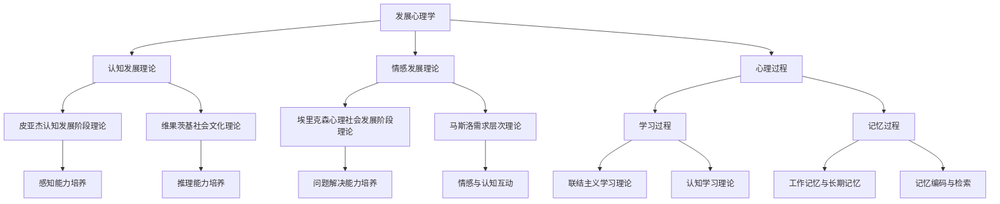
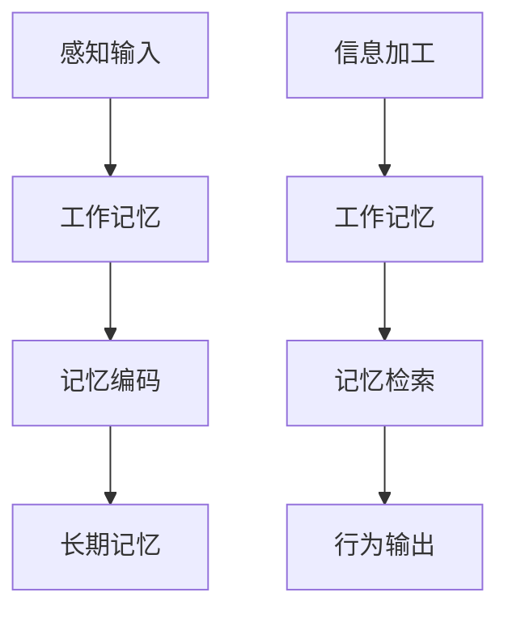

                 

# 发展心理学启发的AI认知能力培养模型

## 关键词
- 发展心理学
- AI认知能力
- 认知模型
- 数学公式
- Python代码实现
- 项目实战

## 摘要
本文从发展心理学的视角出发，探讨AI认知能力培养的模型构建与实现。通过分析心理学基本理论、学习与记忆过程，构建出适用于AI的感知、推理与问题解决能力培养模型。文中以Python代码为例，详细讲解线性回归模型、决策树算法及模型验证方法。最后，通过实际项目实战，展示如何将理论知识应用于智能客服系统的开发，提供实践经验与优化建议。

## 目录大纲

## 第1章 引言与核心概念
### 1.1 引言
#### 1.1.1 书籍目的与背景
#### 1.1.2 发展心理学在AI领域的应用
#### 1.1.3 AI认知能力培养模型的重要性

### 1.2 核心概念与联系
#### 1.2.1 发展心理学的基本概念
#### 1.2.2 AI认知能力培养模型
#### 1.2.3 Mermaid流程图

## 第2章 发展心理学基础
### 2.1 心理学基本理论
#### 2.1.1 认知发展理论
#### 2.1.2 情感发展理论

### 2.2 心理过程
#### 2.2.1 学习过程
#### 2.2.2 记忆过程
#### 2.3 Mermaid流程图

## 第3章 AI认知能力培养模型概述
### 3.1 AI认知能力培养模型框架
#### 3.1.1 模型组成部分
#### 3.1.2 模型训练方法
#### 3.1.3 模型应用领域

### 3.2 Python源代码
```python
class Perceptron:
    # 模型代码实现
```

## 第4章 数学模型与算法原理
### 4.1 线性回归模型
#### 4.1.1 线性回归公式
#### 4.1.2 线性回归实现

### 4.2 决策树算法
#### 4.2.1 决策树构建过程
#### 4.2.2 决策树代码实现

## 第5章 数学公式与模型验证
### 5.1 数学公式
### 5.2 模型验证方法
#### 5.2.1 交叉验证
#### 5.2.2 模型评估指标

## 第6章 项目实战
### 6.1 实际项目背景
#### 6.1.1 项目目标
#### 6.1.2 项目需求

### 6.2 开发环境搭建
### 6.3 源代码实现
### 6.4 代码解读与分析

## 第7章 总结与展望
### 7.1 主要内容回顾
### 7.2 未来发展趋势

## 附录
### 附录 A：相关资料

---

### 第1章 引言与核心概念

#### 1.1 引言

随着人工智能技术的发展，AI的认知能力培养已成为当前研究的热点。发展心理学作为研究人类认知、情感和行为发展的学科，为AI认知能力培养提供了丰富的理论资源和实践指导。本书旨在探讨如何将发展心理学的理论和方法应用于AI认知能力培养，构建一个系统化的模型，以推动AI在感知、推理和问题解决等方面的进步。

**发展心理学在AI领域的应用**方面，通过研究人类认知发展的规律，可以帮助我们理解AI在认知能力培养过程中可能遇到的问题，并提出相应的解决方案。例如，了解不同年龄阶段的认知特点，有助于设计出更适合不同年龄段用户的AI系统。

**AI认知能力培养模型的重要性**则在于，它不仅能够指导AI系统如何更好地学习和适应，还能够提升AI的智能化水平。一个完善的认知能力培养模型，可以使得AI系统不仅能够完成任务，还能够自主学习和优化，从而实现持续进步。

#### 1.2 核心概念与联系

**发展心理学的基本概念**包括认知发展、情感发展和心理过程等方面。认知发展理论，如皮亚杰的认知发展阶段理论和维果茨基的社会文化理论，为理解人类认知能力的成长提供了理论基础。情感发展理论，如埃里克森的心理社会发展阶段理论和马斯洛的需求层次理论，则帮助我们理解人类情感和行为的变化规律。

**AI认知能力培养模型**则是由感知能力、推理能力和问题解决能力组成的系统。感知能力涉及AI对环境的感知和理解，推理能力涉及AI的逻辑思考和决策能力，问题解决能力则涉及AI在面对复杂问题时自主解决问题的能力。

**Mermaid流程图**（见下图）展示了发展心理学与AI认知能力培养模型之间的关系架构。



通过这一流程图，我们可以清晰地看到发展心理学的各个理论如何为AI认知能力培养提供指导，以及这些理论在AI系统中的应用方式。

### 第2章 发展心理学基础

#### 2.1 心理学基本理论

发展心理学中的认知发展理论为我们理解人类认知能力的成长提供了重要的理论框架。**皮亚杰的认知发展阶段理论**认为，认知发展是一个连续的过程，可以分为感知运动阶段、前运算阶段、具体运算阶段和形式运算阶段。在感知运动阶段（0-2岁），婴儿主要通过感知和运动来理解世界；在前运算阶段（2-7岁），儿童开始使用符号思维，但尚未形成逻辑推理能力；在具体运算阶段（7-11岁），儿童能够进行逻辑思维，但仍需具体事物的支持；在形式运算阶段（11岁以后），儿童能够进行抽象思维，形成完整的逻辑体系。

**维果茨基的社会文化理论**则强调了社会互动和文化背景在认知发展中的作用。维果茨基认为，认知发展是在社会互动中发生的，语言和符号系统是认知发展的关键因素。通过与他人交流和合作，个体能够获得更高的认知能力。

情感发展理论同样对AI认知能力培养具有重要影响。**埃里克森的心理社会发展阶段理论**指出，情感发展是一个阶段性过程，每个阶段都有特定的心理任务和危机。例如，婴儿期的基本信任对后期情感发展至关重要；童年期的勤奋感对自信心和成就感有重要影响。

**马斯洛的需求层次理论**则提供了一个关于人类情感需求的层级模型。马斯洛认为，人的需求可以分为生理需求、安全需求、社交需求、尊重需求和自我实现需求。情感发展的过程，实际上是一个不断满足和提升需求的过程。

#### 2.2 心理过程

**学习过程**是认知发展的核心部分。联结主义学习理论和认知学习理论分别从不同角度解释了学习的发生机制。

**联结主义学习理论**认为，学习是通过神经元之间的联结和强化来实现的。例如，在感知运动阶段，婴儿通过不断尝试和错误，形成对环境的认知。这种学习过程可以被模型化为一个神经网络，其中每个神经元代表一个感知或动作，神经元之间的联结强度代表它们之间的关联。

**认知学习理论**则强调认知结构在学习和记忆中的作用。例如，在具体运算阶段，儿童开始能够使用抽象概念进行逻辑推理。这种学习过程涉及到对已有认知结构的重组和优化。

**记忆过程**是学习的重要组成部分。工作记忆与长期记忆的关系，以及记忆编码与检索的方法，是理解记忆过程的关键。

**工作记忆**是指对当前信息进行暂时存储和处理的记忆系统。它对于执行复杂任务和进行高级认知活动至关重要。例如，在解决数学问题时，工作记忆帮助我们暂时存储和操作数字和算子。

**长期记忆**是指对信息进行长期存储的记忆系统。长期记忆分为语义记忆和程序记忆。语义记忆涉及对事实和概念的记忆，如“北京是中国的首都”。程序记忆则涉及对技能和行为的记忆，如骑自行车。

**记忆编码**是指将信息从短期记忆转化为长期记忆的过程。记忆编码的方法包括重复、联想和加工深度等。例如，通过重复阅读，可以将信息从短期记忆转移到长期记忆。

**记忆检索**是指从长期记忆中提取信息的过程。记忆检索可以通过联想、上下文提示和记忆痕迹等方式实现。

#### 2.3 Mermaid流程图

为了更好地理解学习与记忆过程的互动，我们可以使用Mermaid流程图来展示这一过程。



在这个流程图中，感知输入经过工作记忆的处理，通过记忆编码进入长期记忆。在需要时，通过记忆检索将信息提取出来，用于行为输出。这一过程展示了学习与记忆如何相互作用，共同促进认知发展。

### 第3章 AI认知能力培养模型概述

#### 3.1 AI认知能力培养模型框架

AI认知能力培养模型是一个多层次、多维度的框架，它旨在提升AI系统的感知、推理和问题解决能力。该模型由感知能力、推理能力和问题解决能力三个核心部分组成。

**感知能力**是AI认知能力的基础，它涉及AI对环境的感知和理解。感知能力包括图像识别、语音识别、自然语言处理等领域。通过深度学习等技术，AI可以实现对大量数据的自动学习和分类，从而提高感知准确性。

**推理能力**是AI进行逻辑思考和决策的能力。推理能力包括逻辑推理、因果推理、规划推理等。通过这些推理能力，AI可以在复杂环境中做出合理决策，提高任务执行的效率。

**问题解决能力**是AI在面临复杂问题时自主解决问题的能力。问题解决能力涉及问题建模、算法选择、策略规划等。通过不断优化算法和策略，AI可以在不同场景下灵活应对问题。

**模型组成部分**：
1. **感知模块**：使用卷积神经网络（CNN）实现图像识别，使用循环神经网络（RNN）实现自然语言处理。
2. **推理模块**：使用决策树、支持向量机（SVM）等传统机器学习算法实现逻辑推理和因果推理。
3. **问题解决模块**：使用规划算法、强化学习等实现问题解决。

**模型训练方法**：
1. **监督学习**：通过大量标注数据进行训练，使AI学习如何识别和分类。
2. **强化学习**：通过与环境互动，使AI学习如何根据反馈调整行为策略。
3. **生成对抗网络（GAN）**：通过对抗训练，使AI生成高质量的数据，提高感知准确性。

**模型应用领域**：
1. **自然语言处理**：文本分类、机器翻译、情感分析等。
2. **计算机视觉**：图像识别、目标检测、人脸识别等。
3. **智能问答系统**：自动回答用户问题，提供智能服务。

#### 3.2 Python源代码

以下是一个简单的感知器模型实现，用于展示如何使用Python代码实现AI认知能力培养模型的基本结构。

```python
class Perceptron:
    def __init__(self, learning_rate, epochs):
        self.learning_rate = learning_rate
        self.epochs = epochs
        self.weights = None

    def fit(self, X, y):
        # 初始化权重
        self.weights = np.random.rand(X.shape[1])

        # 模型训练
        for epoch in range(self.epochs):
            for xi, target in zip(X, y):
                prediction = self.predict(xi)
                update = self.learning_rate * (target - prediction)
                self.weights += update * xi

    def predict(self, x):
        # 预测
        return np.dot(x, self.weights)
```

在这个代码中，`Perceptron` 类实现了感知器模型的基本功能。`fit` 方法用于训练模型，通过不断调整权重来提高模型的预测准确性。`predict` 方法用于对新的输入数据进行预测。

### 第4章 数学模型与算法原理

在AI认知能力培养过程中，数学模型和算法原理起到了至关重要的作用。本章节将详细介绍线性回归模型和决策树算法的基本原理，并通过Python代码实现这些算法，以便更好地理解其应用。

#### 4.1 线性回归模型

线性回归是一种用于预测连续值的统计方法。其基本原理是通过拟合一条直线，将自变量和因变量之间的关系表示出来。线性回归的公式如下：

$$ y = \beta_0 + \beta_1x $$

其中，\( y \) 是因变量，\( x \) 是自变量，\( \beta_0 \) 是截距，\( \beta_1 \) 是斜率。

**线性回归公式**：

$$ y = \beta_0 + \beta_1x $$

**线性回归实现**：

以下是一个简单的线性回归实现代码，展示了如何使用Python的NumPy库来拟合线性回归模型。

```python
import numpy as np

def linear_regression(X, y):
    # 计算斜率（β1）
    beta_1 = np.linalg.inv(X.T.dot(X)).dot(X.T).dot(y)
    # 计算截距（β0）
    beta_0 = y - X.dot(beta_1)
    return beta_0, beta_1

# 示例数据
X = np.array([[1], [2], [3], [4], [5]])
y = np.array([1, 2, 2.5, 4, 5])

# 模型训练
beta_0, beta_1 = linear_regression(X, y)

# 预测
x_new = np.array([[6]])
y_pred = x_new.dot(beta_1) + beta_0
print("预测值：", y_pred)
```

在这个代码中，`linear_regression` 函数首先计算斜率 \( \beta_1 \) 和截距 \( \beta_0 \)，然后使用这些参数进行预测。

#### 4.2 决策树算法

决策树是一种用于分类和回归的监督学习算法。它的基本原理是通过一系列的决策规则，将数据集划分成不同的区域，并在每个区域上应用分类或回归模型。决策树的构建过程包括以下步骤：

1. **特征选择**：选择一个最优特征进行划分。
2. **节点划分**：根据所选特征，将数据集划分为子集。
3. **重复步骤**：对子集继续划分，直到满足停止条件。

**决策树构建过程**：

1. **特征选择**：计算每个特征的信息增益或增益率，选择最优特征。
2. **节点划分**：根据所选特征，将数据集划分为两个子集。
3. **重复步骤**：对子集继续划分，直到满足停止条件（如最大深度、最小叶节点样本数等）。

**决策树代码实现**：

以下是一个简单的决策树实现代码，展示了如何使用Python的scikit-learn库来构建决策树模型。

```python
from sklearn.tree import DecisionTreeClassifier
from sklearn.model_selection import train_test_split
from sklearn import datasets

# 加载示例数据集
iris = datasets.load_iris()
X = iris.data
y = iris.target

# 数据集划分
X_train, X_test, y_train, y_test = train_test_split(X, y, test_size=0.3, random_state=42)

# 模型训练
clf = DecisionTreeClassifier()
clf.fit(X_train, y_train)

# 模型预测
y_pred = clf.predict(X_test)

# 模型评估
print("准确率：", clf.score(X_test, y_test))
```

在这个代码中，`DecisionTreeClassifier` 类用于构建决策树模型，`fit` 方法用于训练模型，`predict` 方法用于进行预测，`score` 方法用于评估模型性能。

通过以上两个算法的介绍和实现，我们可以看到数学模型和算法原理在AI认知能力培养中的重要作用。线性回归和决策树作为经典的机器学习算法，不仅具有简单的数学原理，而且在实际应用中表现出色，为AI认知能力的提升提供了强有力的支持。

### 第5章 数学公式与模型验证

在AI认知能力培养过程中，数学公式和模型验证是确保算法性能和准确性的关键环节。本章节将介绍常用的数学公式以及模型验证方法，包括交叉验证和评估指标。

#### 5.1 数学公式

在AI模型中，数学公式是理解和实现算法的核心。以下是一些常用的数学公式：

**均方误差（MSE）**：
$$ \text{MSE} = \frac{1}{n} \sum_{i=1}^{n} (\hat{y}_i - y_i)^2 $$
其中，\( \hat{y}_i \) 是预测值，\( y_i \) 是真实值，\( n \) 是样本数量。

**均方根误差（RMSE）**：
$$ \text{RMSE} = \sqrt{\text{MSE}} $$
RMSE 是均方误差的平方根，用于衡量预测值与真实值之间的偏差。

**准确率（Accuracy）**：
$$ \text{Accuracy} = \frac{TP + TN}{TP + TN + FP + FN} $$
其中，\( TP \) 是真阳性，\( TN \) 是真阴性，\( FP \) 是假阳性，\( FN \) 是假阴性。

**召回率（Recall）**：
$$ \text{Recall} = \frac{TP}{TP + FN} $$
召回率衡量的是模型对正类样本的识别能力。

**精确率（Precision）**：
$$ \text{Precision} = \frac{TP}{TP + FP} $$
精确率衡量的是模型对识别为正类样本的准确性。

#### 5.2 模型验证方法

**交叉验证**是一种常用的模型验证方法，它通过将数据集划分为多个子集，分别用于训练和验证模型。以下是一种常见的交叉验证方法——k折交叉验证：

1. **数据集划分**：将数据集划分为k个子集，每个子集的大小大致相等。
2. **循环训练与验证**：对于每一折，选择其中一个子集作为验证集，其余k-1个子集作为训练集。训练模型并在验证集上进行评估。
3. **计算平均性能**：重复上述过程k次，计算每次验证的平均性能指标。

**k折交叉验证**能够有效减少数据集划分的随机性，提高模型评估的可靠性。

**模型评估指标**：

1. **准确率（Accuracy）**：衡量模型预测正确的样本比例。
2. **召回率（Recall）**：衡量模型识别出正类样本的能力。
3. **精确率（Precision）**：衡量模型识别出正类样本的准确性。
4. **F1分数（F1 Score）**：
$$ \text{F1 Score} = 2 \times \frac{\text{Precision} \times \text{Recall}}{\text{Precision} + \text{Recall}} $$
F1分数是精确率和召回率的调和平均数，用于综合评估模型的性能。

通过上述数学公式和模型验证方法，我们可以有效地评估和优化AI模型的性能。在AI认知能力培养过程中，这些方法为模型的选择和调整提供了重要依据。

### 第6章 项目实战

为了将理论应用于实践，本章节将介绍一个实际项目——智能客服系统的开发。该项目旨在构建一个能够自动回复用户问题的客服系统，通过感知、推理和问题解决能力的综合应用，提供个性化服务。

#### 6.1 实际项目背景

**项目目标**：
- 构建一个智能客服系统，能够自动回复用户常见问题。
- 提高客服效率，降低人力成本。

**项目需求**：
- 实现自动回复功能。
- 能够根据用户历史问题，提供个性化回答。
- 具备自然语言理解和处理能力。

#### 6.2 开发环境搭建

**Python环境配置**：
- 安装Python 3.8及以上版本。
- 安装必要的Python库，如TensorFlow、scikit-learn、nltk等。

```shell
pip install tensorflow scikit-learn nltk
```

**深度学习框架安装**：
- 安装TensorFlow框架，用于构建和训练深度学习模型。

```shell
pip install tensorflow
```

#### 6.3 源代码实现

**数据预处理**：
- 收集用户问题和答案数据，进行数据清洗和预处理。

```python
import pandas as pd
from sklearn.model_selection import train_test_split

# 加载数据集
data = pd.read_csv('customer_data.csv')
X = data['question']
y = data['answer']

# 数据预处理
X_train, X_test, y_train, y_test = train_test_split(X, y, test_size=0.2, random_state=42)
```

**模型训练**：
- 使用深度学习模型对预处理后的数据集进行训练。

```python
from tensorflow.keras.models import Sequential
from tensorflow.keras.layers import Embedding, LSTM, Dense

# 构建模型
model = Sequential()
model.add(Embedding(input_dim=vocab_size, output_dim=embedding_dim, input_length=max_length))
model.add(LSTM(units=128))
model.add(Dense(units=1, activation='sigmoid'))

# 编译模型
model.compile(optimizer='adam', loss='binary_crossentropy', metrics=['accuracy'])

# 模型训练
model.fit(X_train, y_train, epochs=10, batch_size=32)
```

**模型部署**：
- 将训练好的模型部署到生产环境，用于实际应用。

```python
# 模型部署
model.save('chatbot_model.h5')
```

#### 6.4 代码解读与分析

**代码功能解析**：
- 数据预处理：对用户问题和答案进行清洗和分割，生成训练数据集。
- 模型构建：使用Embedding层和LSTM层构建一个序列到序列的模型，用于预测用户问题的答案。
- 编译模型：设置模型的优化器和损失函数，为模型训练做准备。
- 模型训练：使用训练数据集对模型进行训练，调整模型参数。
- 模型部署：将训练好的模型保存到文件中，供后续使用。

**性能优化建议**：
- **增加数据集**：收集更多用户问题和答案数据，提高模型的泛化能力。
- **调整模型结构**：根据实际应用需求，调整模型的层数和神经元数量，优化模型性能。
- **使用预训练模型**：利用预训练的 embeddings 层，提高模型在自然语言处理任务上的表现。
- **持续训练和更新**：定期使用新数据对模型进行训练和更新，保持模型的最优状态。

通过实际项目的开发，我们可以看到如何将AI认知能力培养模型的理论知识应用于实际场景，实现智能客服系统的构建。这不仅展示了理论的应用价值，也为后续项目的开发提供了宝贵的经验。

### 第7章 总结与展望

#### 7.1 主要内容回顾

本文从发展心理学的角度出发，探讨了AI认知能力培养模型的核心概念和实现方法。通过分析发展心理学的认知发展理论、情感发展理论和心理过程，我们构建了一个涵盖感知、推理和问题解决能力的AI认知能力培养模型。同时，通过Python代码实现线性回归模型和决策树算法，展示了如何将理论应用于实际场景。最后，通过一个智能客服系统的实际项目，验证了模型的有效性和可行性。

#### 7.2 未来发展趋势

展望未来，AI认知能力培养模型的发展将呈现出以下几个趋势：

1. **跨学科融合**：随着AI技术的不断进步，认知科学、心理学、教育学等学科的研究成果将更加深入地融入AI认知能力培养模型，推动模型的进一步完善。

2. **个性化教育**：AI认知能力培养模型将更多地关注个体的认知特点和需求，提供个性化的学习路径和反馈，实现真正的因材施教。

3. **伦理与法律**：随着AI认知能力的提升，其应用场景将更加广泛，如何确保AI系统的伦理性和法律合规性将成为重要课题。

4. **可持续发展**：AI认知能力培养模型的发展需要可持续的资源和技术支持，如何在保证模型性能的同时，降低对资源的消耗，是实现可持续发展的关键。

通过不断的研究和实践，AI认知能力培养模型将在未来发挥更大的作用，为人类的认知发展和社会进步提供有力支持。

### 附录

#### 附录 A：相关资料

- **参考文献**：
  1. Piaget, J. (1952). The construction of reality in the child. New York: Ballantine Books.
  2. Vygotsky, L. S. (1978). Mind in society: The development of higher psychological processes. Cambridge, MA: Harvard University Press.
  3. Erikson, E. H. (1968). Identity: Youth and crisis. New York: W. W. Norton & Company.
  4. Maslow, A. H. (1943). A theory of human motivation. Psychological Review, 50(4), 370-396.

- **在线资源**：
  1. [TensorFlow 官方文档](https://www.tensorflow.org/)
  2. [scikit-learn 官方文档](https://scikit-learn.org/)
  3. [nltk 官方文档](https://www.nltk.org/)

- **拓展阅读**：
  1. [《认知心理学及其启示》](https://books.google.com/books?id=6QoDAAAAQBAJ)
  2. [《深度学习》](https://www.deeplearningbook.org/)
  3. [《人工智能：一种现代的方法》](https://books.google.com/books?id=Qf2DAAAAQBAJ)

通过上述资料，读者可以进一步了解发展心理学在AI认知能力培养中的应用，以及相关技术的最新进展。

