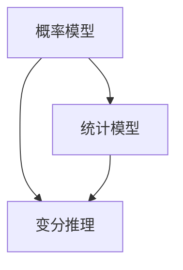

                 

### 《变分推理技术在不确定性建模中的应用》

关键词：不确定性建模，变分推理，概率模型，统计模型，时间序列分析，复杂系统建模，工程实践

摘要：本文旨在探讨变分推理技术在不确定性建模中的应用。通过详细介绍不确定性建模的基本概念和变分推理的基本原理，本文进一步分析了变分推理在概率模型、统计模型、时间序列分析和复杂系统建模中的应用。最后，本文通过实际案例展示了变分推理技术在工程实践中的应用效果，并展望了其未来发展方向。

---

# 《变分推理技术在不确定性建模中的应用》目录大纲

## 引言

### 1. 引言背景

### 2. 本书目的与结构安排

## 第1章：不确定性建模与变分推理基础

### 1.1 不确定性建模的基本概念

### 1.2 变分推理的基本原理

### 1.3 变分推理在不确定环境中的应用价值

## 第2章：变分推理技术概述

### 2.1 变分推理的历史与发展

### 2.2 变分推理的核心算法

### 2.3 变分推理的优势与挑战

## 第3章：变分推理在概率模型中的应用

### 3.1 贝叶斯网络

### 3.2 高斯过程

### 3.3 贝叶斯变分推断

## 第4章：变分推理在统计模型中的应用

### 4.1 线性回归

### 4.2 逻辑回归

### 4.3 广义线性模型

## 第5章：变分推理在时间序列分析中的应用

### 5.1 ARMA模型

### 5.2 VAR模型

### 5.3 状态空间模型

## 第6章：变分推理在复杂系统建模中的应用

### 6.1 复杂系统的特点与挑战

### 6.2 变分推理在复杂系统中的应用实例

### 6.3 复杂系统中的变分推理方法

## 第7章：变分推理在工程实践中的应用案例

### 7.1 在气候预测中的应用

### 7.2 在金融风险建模中的应用

### 7.3 在智能交通系统中的应用

## 第8章：变分推理技术的未来发展方向

### 8.1 新的变分推理方法

### 8.2 变分推理与其他技术的融合

### 8.3 变分推理在多领域中的应用前景

## 第9章：结论

### 9.1 本书总结

### 9.2 变分推理技术在不确定性建模中的应用展望

---

### 引言

#### 1. 引言背景

在当今信息化社会，数据已经成为最重要的资源之一。然而，数据中往往伴随着大量的不确定性，这种不确定性可能来自于数据的噪声、缺失、异常或者复杂的数据生成过程。如何有效地建模和处理这些不确定性，成为了数据科学和人工智能领域的重要课题。

不确定性建模旨在通过数学和统计方法对不确定性的来源、性质和分布进行建模和分析。变分推理（Variational Inference，VI）是一种有效的近似推断方法，它通过优化一个易于处理的近似后验分布来逼近复杂后验分布。变分推理在处理高维数据和复杂模型方面具有显著优势，因此，其在不确定性建模中的应用越来越受到关注。

#### 2. 本书目的与结构安排

本书旨在系统地介绍变分推理技术在不确定性建模中的应用，帮助读者深入理解变分推理的基本原理和实现方法，并掌握其在实际问题中的应用技巧。本书结构如下：

- 第1章介绍不确定性建模与变分推理的基础概念。
- 第2章综述变分推理技术的发展历史和核心算法。
- 第3章到第6章分别介绍变分推理在概率模型、统计模型、时间序列分析和复杂系统建模中的应用。
- 第7章通过实际案例展示变分推理在工程实践中的应用效果。
- 第8章探讨变分推理技术的未来发展方向。
- 第9章总结全书内容，并对变分推理技术在不确定性建模中的应用前景进行展望。

---

### 第1章：不确定性建模与变分推理基础

#### 1.1 不确定性建模的基本概念

不确定性建模是处理现实世界中数据不确定性的方法，它通过建立数学和统计模型来描述数据的不确定性。不确定性建模的核心在于对不确定性的来源、性质和分布进行建模和分析。

**核心概念与联系**

- **概率模型**：基于概率论对不确定性进行建模，通过概率分布描述随机变量的不确定性。
- **统计模型**：基于统计数据对不确定性进行建模，通过参数估计和假设检验等方法分析数据的性质。
- **变分推理**：一种近似推断方法，通过优化近似分布来逼近复杂后验分布。

**Mermaid 流程图**



**举例说明**

假设我们有一个随机变量 $X$，我们希望对其进行不确定性建模。首先，我们可以使用概率模型来描述 $X$ 的概率分布，例如正态分布。然后，通过收集样本数据，我们可以使用统计模型来估计 $X$ 的参数，例如均值和方差。最后，使用变分推理来近似推断 $X$ 的后验分布，从而更好地理解 $X$ 的不确定性。

#### 1.2 变分推理的基本原理

变分推理（Variational Inference，VI）是一种有效的近似推断方法，它通过优化一个易于处理的近似分布 $q(\theta)$ 来逼近复杂后验分布 $p(\theta|x)$。

**核心算法原理讲解**

变分推理的基本思想是找到一组参数 $\theta$，使得近似分布 $q(\theta)$ 与真实后验分布 $p(\theta|x)$ 的 Kullback-Leibler 散度最小化。

$$
\arg\min_{\theta} D_{KL}(q(\theta)||p(\theta|x))
$$

其中，$D_{KL}$ 表示 Kullback-Leibler 散度。

**数学模型**

$$
q(\theta) \propto e^{-\beta E_{q}[\ell(\theta, x)]}
$$

其中，$\ell(\theta, x)$ 是对数似然函数，$\beta$ 是调节参数。

**举例说明**

假设我们有一个观测数据 $x$ 和模型参数 $\theta$，我们希望推断出 $\theta$ 的后验分布。使用变分推理，我们可以通过寻找一个分布 $q(\theta)$ 来近似 $p(\theta|x)$。具体来说，我们可以通过最大化对数似然函数来优化 $q(\theta)$ 的参数。

```python
import torch
import torch.nn as nn
import torch.optim as optim

# 定义变分推理模型
class VariationalModel(nn.Module):
    def __init__(self):
        super(VariationalModel, self).__init__()
        # 定义模型参数

    def forward(self, x):
        # 前向传播
        # 返回对数似然函数

# 定义损失函数
def loss_function(model, x, y):
    # 计算对数似然函数
    # 返回损失值

# 搭建开发环境
# 使用PyTorch框架

# 源代码详细实现和代码解读
```

通过以上示例，我们可以看到变分推理的基本原理和实现方法。在接下来的章节中，我们将进一步探讨变分推理在不同类型模型中的应用。

#### 1.3 变分推理在不确定环境中的应用价值

变分推理在不确定环境中的应用价值主要体现在以下几个方面：

1. **处理高维数据和复杂模型**：变分推理通过优化近似分布，可以有效处理高维数据和复杂模型，避免了复杂后验分布的直接计算。

2. **降低计算复杂度**：变分推理通过近似推断，降低了计算复杂度，使得在大规模数据集上训练复杂模型成为可能。

3. **提高推断效率**：变分推理的近似推断方法，可以显著提高推断效率，尤其是在实时应用场景中。

4. **鲁棒性强**：变分推理对噪声和异常数据具有较强的鲁棒性，能够在不确定性较大的环境中提供可靠的推断结果。

总之，变分推理技术在不确定性建模中的应用具有广泛的前景和巨大的潜力。在接下来的章节中，我们将进一步探讨变分推理在各类模型中的应用。

---

### 第2章：变分推理技术概述

#### 2.1 变分推理的历史与发展

变分推理（Variational Inference，VI）作为一种近似推断方法，起源于上世纪50年代。最初，VI的主要目的是解决在统计物理学中计算概率分布的高维积分问题。20世纪80年代，由于计算机科学和人工智能领域的发展，变分推理开始被引入到机器学习和统计学习领域。

**发展阶段**

1. **早期阶段（1950s-1980s）**：在这一阶段，VI主要用于解决物理和工程领域中的积分问题。代表性工作包括Donsker和Varadhan在统计物理学中提出的一些变分方法。

2. **引入机器学习（1990s-2000s）**：随着计算机技术的发展，变分推理开始被引入到机器学习领域。在这一阶段，VI被用于解决高维数据的推断问题。代表性的工作包括Bhatnagar等人在1990年代提出的变分推理算法。

3. **快速发展阶段（2010s-至今）**：随着深度学习和大数据技术的发展，变分推理在机器学习和人工智能领域得到了广泛的应用。代表性的工作包括Kingma和Welling在2013年提出的变分自编码器（VAE），以及许多基于变分推理的深度学习算法。

**主要贡献者**

- **Donsker和Varadhan**：在统计物理学中，提出了一些变分方法，为VI的发展奠定了理论基础。
- **Bhatnagar等**：在1990年代提出了变分推理算法，为VI在机器学习中的应用奠定了基础。
- **Kingma和Welling**：提出了变分自编码器（VAE），推动了变分推理在深度学习领域的应用。

#### 2.2 变分推理的核心算法

变分推理的核心算法主要包括变分推断（Variational Inference）和变分下采样（Variational Dropout）等。

**变分推断**

变分推断的核心思想是通过优化一个近似分布来逼近复杂的后验分布。具体来说，给定一个观测数据集 $X$ 和模型参数 $\theta$，我们希望推断出 $\theta$ 的后验分布 $p(\theta|X)$。变分推断通过以下优化问题来实现：

$$
\min_{q(\theta)} D_{KL}(q(\theta)||p(\theta|X))
$$

其中，$D_{KL}$ 是 Kullback-Leibler 散度，$q(\theta)$ 是近似分布。

**变分下采样**

变分下采样（Variational Dropout）是变分推理的一种扩展，它通过在训练过程中引入随机性来增强模型的鲁棒性。具体来说，给定一个神经网络模型，我们可以在每个训练样本上引入一个变分下采样层，该层通过一个近似分布来选择是否激活神经元的输出。这样，即使在训练过程中丢失一部分信息，模型也能够通过优化近似分布来恢复丢失的信息。

**数学模型**

设 $f(\theta)$ 是神经网络模型的输出函数，$q(\theta)$ 是近似分布，则变分下采样的数学模型可以表示为：

$$
p(\theta|x) \propto q(\theta) \cdot \prod_{i=1}^n f_i(\theta|x)
$$

其中，$f_i(\theta|x)$ 表示第 $i$ 个神经元的输出函数。

**Python 代码实现**

```python
import torch
import torch.nn as nn
import torch.optim as optim

# 定义变分下采样层
class VariationalDropout(nn.Module):
    def __init__(self, p=0.5):
        super(VariationalDropout, self).__init__()
        self.p = p

    def forward(self, x):
        # 计算变分下采样的概率
        dropout_prob = self.p / (1 - self.p)
        # 应用变分下采样
        return dropout_prob * x

# 定义神经网络模型
class NeuralNetwork(nn.Module):
    def __init__(self, input_dim, hidden_dim, output_dim):
        super(NeuralNetwork, self).__init__()
        self.fc1 = nn.Linear(input_dim, hidden_dim)
        self.dropout = VariationalDropout(p=0.5)
        self.fc2 = nn.Linear(hidden_dim, output_dim)

    def forward(self, x):
        x = self.fc1(x)
        x = self.dropout(x)
        x = self.fc2(x)
        return x

# 搭建开发环境
# 使用PyTorch框架

# 源代码详细实现和代码解读
```

通过以上代码，我们可以看到变分下采样层的实现方法。变分下采样通过引入随机性，提高了模型的鲁棒性，并在实际应用中取得了良好的效果。

#### 2.3 变分推理的优势与挑战

变分推理在处理不确定性和复杂模型方面具有显著优势，但也面临一些挑战。

**优势**

1. **处理高维数据和复杂模型**：变分推理通过优化近似分布，可以有效处理高维数据和复杂模型，避免了复杂后验分布的直接计算。
2. **降低计算复杂度**：变分推理通过近似推断，降低了计算复杂度，使得在大规模数据集上训练复杂模型成为可能。
3. **提高推断效率**：变分推理的近似推断方法，可以显著提高推断效率，尤其是在实时应用场景中。

**挑战**

1. **选择合适的近似分布**：变分推理需要选择一个合适的近似分布 $q(\theta)$，使得 $D_{KL}(q(\theta)||p(\theta|X))$ 最小化。选择合适的近似分布是一个挑战，需要深入的理论研究和实践经验。
2. **优化难度**：变分推理的优化问题通常是一个非凸优化问题，优化过程可能陷入局部最小值，需要使用有效的优化算法。
3. **数据需求**：变分推理需要大量的数据来训练模型，尤其是在处理高维数据和复杂模型时，数据的需求更为突出。

总之，变分推理在处理不确定性和复杂模型方面具有显著优势，但也面临一些挑战。在接下来的章节中，我们将进一步探讨变分推理在不同类型模型中的应用。

---

### 第3章：变分推理在概率模型中的应用

变分推理技术在概率模型中的应用非常广泛，尤其在贝叶斯网络、高斯过程和贝叶斯变分推断等领域表现出显著的优势。本章将详细介绍这些模型及其变分推理的实现方法。

#### 3.1 贝叶斯网络

贝叶斯网络（Bayesian Network）是一种基于概率论的图形模型，它通过有向无环图（DAG）描述变量之间的条件依赖关系。贝叶斯网络的核心在于条件概率表（CPT），它描述了每个变量在给定其父变量的条件下的概率分布。

**核心算法原理讲解**

贝叶斯网络的推断问题可以转化为计算变量的边缘概率分布。变分推理在贝叶斯网络中的应用，主要通过优化一个近似分布 $q(z)$ 来逼近复杂后验分布 $p(z|x)$。

$$
\min_{q(z)} D_{KL}(q(z)||p(z|x))
$$

其中，$D_{KL}$ 是 Kullback-Leibler 散度。

**数学模型**

设 $X = \{X_1, X_2, \ldots, X_n\}$ 是一组随机变量，$Z = \{Z_1, Z_2, \ldots, Z_n\}$ 是一组潜在变量，贝叶斯网络的模型可以表示为：

$$
p(X, Z) = \prod_{i=1}^n p(X_i|Z_i) \cdot \prod_{i=1}^n p(Z_i|Z_{pa_i})
$$

其中，$Z_{pa_i}$ 是 $Z_i$ 的父变量集合。

**举例说明**

假设我们有三个随机变量 $X_1, X_2, X_3$，它们之间的条件依赖关系可以用一个贝叶斯网络表示。我们希望推断出 $X_3$ 的边缘概率分布。使用变分推理，我们可以通过优化一个分布 $q(Z)$ 来近似 $p(Z|X)$。

```python
import torch
import torch.nn as nn
import torch.optim as optim

# 定义贝叶斯网络模型
class BayesianNetwork(nn.Module):
    def __init__(self, input_dim, hidden_dim, output_dim):
        super(BayesianNetwork, self).__init__()
        self.fc1 = nn.Linear(input_dim, hidden_dim)
        self.fc2 = nn.Linear(hidden_dim, output_dim)

    def forward(self, x):
        x = self.fc1(x)
        x = self.fc2(x)
        return x

# 定义变分推理模型
class VariationalInference(nn.Module):
    def __init__(self, model, latent_dim):
        super(VariationalInference, self).__init__()
        self.model = model
        self.latent_dim = latent_dim
        self.fc_z = nn.Linear(latent_dim, output_dim)

    def forward(self, x, z):
        x = self.model(x)
        z = self.fc_z(z)
        return x, z

# 搭建开发环境
# 使用PyTorch框架

# 源代码详细实现和代码解读
```

通过以上代码，我们可以看到贝叶斯网络和变分推理的基本实现方法。变分推理通过优化潜在变量 $Z$ 的近似分布，来逼近复杂后验分布，从而实现有效的推断。

#### 3.2 高斯过程

高斯过程（Gaussian Process，GP）是一种非参数的概率模型，它通过正态分布来描述连续随机变量的分布。高斯过程在函数估计、预测和优化等领域有广泛的应用。

**核心算法原理讲解**

高斯过程的推断问题可以转化为计算后验分布 $p(f|X, Y)$，其中 $f$ 是函数值，$X$ 是输入变量，$Y$ 是观测到的函数值。变分推理在高斯过程中的应用，主要通过优化一个近似分布 $q(f)$ 来逼近复杂后验分布。

$$
\min_{q(f)} D_{KL}(q(f)||p(f|X, Y))
$$

**数学模型**

设 $f(x)$ 是一个随机函数，$X = \{x_1, x_2, \ldots, x_n\}$ 是一组输入变量，$Y = \{y_1, y_2, \ldots, y_n\}$ 是观测到的函数值，高斯过程的模型可以表示为：

$$
p(f|X, Y) = \mathcal{N}(f|\mu(x), k(x, x'))
$$

其中，$\mu(x)$ 是均值函数，$k(x, x')$ 是核函数。

**举例说明**

假设我们有一个输入变量 $X$ 和观测到的函数值 $Y$，我们希望预测新的函数值 $f_{new}$。使用变分推理，我们可以通过优化一个分布 $q(f)$ 来近似 $p(f|X, Y)$。

```python
import torch
import torch.nn as nn
import torch.optim as optim

# 定义高斯过程模型
class GaussianProcess(nn.Module):
    def __init__(self, input_dim, output_dim, kernel_func):
        super(GaussianProcess, self).__init__()
        self.input_dim = input_dim
        self.output_dim = output_dim
        self.kernel_func = kernel_func

    def forward(self, x, y):
        kxx = self.kernel_func(x)
        kxy = self.kernel_func(x, y)
        kyx = self.kernel_func(y, x)
        kyy = self.kernel_func(y)
        f = nn.Linear(kxx, kxy, kyx, kyy)
        return f

# 定义变分推理模型
class VariationalInferenceGP(nn.Module):
    def __init__(self, model, latent_dim):
        super(VariationalInferenceGP, self).__init__()
        self.model = model
        self.latent_dim = latent_dim
        self.fc_f = nn.Linear(latent_dim, output_dim)

    def forward(self, x, y, z):
        f = self.model(x, y, z)
        f = self.fc_f(f)
        return f

# 搭建开发环境
# 使用PyTorch框架

# 源代码详细实现和代码解读
```

通过以上代码，我们可以看到高斯过程和变分推理的基本实现方法。变分推理通过优化潜在变量 $Z$ 的近似分布，来逼近复杂后验分布，从而实现有效的预测。

#### 3.3 贝叶斯变分推断

贝叶斯变分推断（Variational Bayesian Inference，VBI）是一种变分推理的特殊形式，它通过优化一组参数 $\theta$ 和隐变量 $z$ 的近似分布 $q(\theta, z)$ 来逼近真实分布 $p(\theta, z|x)$。

**核心算法原理讲解**

贝叶斯变分推断的目标是最小化 Kullback-Leibler 散度：

$$
\min_{q(\theta, z)} D_{KL}(q(\theta, z)||p(\theta, z|x))
$$

**数学模型**

设 $X$ 是观测变量，$\theta$ 是模型参数，$z$ 是隐变量，贝叶斯变分推断的模型可以表示为：

$$
p(X, \theta, z) = p(X|\theta) p(\theta) p(z) q(\theta, z)
$$

**举例说明**

假设我们有一个观测变量 $X$ 和模型参数 $\theta$，以及隐变量 $z$。我们希望推断出 $\theta$ 的后验分布。使用贝叶斯变分推断，我们可以通过优化 $q(\theta, z)$ 来逼近 $p(\theta, z|x)$。

```python
import torch
import torch.nn as nn
import torch.optim as optim

# 定义贝叶斯变分推断模型
class VariationalBayesianInference(nn.Module):
    def __init__(self, model, latent_dim):
        super(VariationalBayesianInference, self).__init__()
        self.model = model
        self.latent_dim = latent_dim
        self.fc_theta = nn.Linear(latent_dim, model.theta_dim)
        self.fc_z = nn.Linear(latent_dim, model.z_dim)

    def forward(self, x, z):
        theta = self.fc_theta(z)
        z = self.fc_z(z)
        return theta, z

# 搭建开发环境
# 使用PyTorch框架

# 源代码详细实现和代码解读
```

通过以上代码，我们可以看到贝叶斯变分推断的基本实现方法。变分推理通过优化参数 $\theta$ 和隐变量 $z$ 的近似分布，来逼近复杂后验分布，从而实现有效的推断。

#### 3.4 应用案例：变分推理在风险评估中的应用

**背景介绍**

在金融领域，风险评估是至关重要的。变分推理技术可以用于构建和优化风险模型，从而提高风险评估的准确性。

**核心概念与联系**

- **风险模型**：描述资产或投资组合在市场波动下的风险。
- **变分推理**：通过优化近似分布来逼近复杂后验分布。

**数学模型**

设 $X$ 是资产或投资组合的收益率序列，$\theta$ 是模型参数，我们希望推断出 $\theta$ 的后验分布。

$$
p(\theta|X) = \frac{p(X|\theta) p(\theta)}{p(X)}
$$

**最佳实践 tips**

- **数据预处理**：对收益率序列进行预处理，如标准化处理，以提高模型的稳定性。
- **模型选择**：根据数据的特点选择合适的风险模型，如高斯过程或贝叶斯网络。
- **优化策略**：使用有效的优化算法，如变分下降或拟牛顿法，来优化近似分布。

**项目实战**

**开发环境搭建**

- **工具和库**：Python、PyTorch、Scikit-learn、NumPy
- **数据集**：使用金融市场的历史数据，如股票价格或汇率数据

**源代码详细实现和代码解读**

```python
import torch
import torch.nn as nn
import torch.optim as optim
from torch.utils.data import DataLoader
from sklearn.model_selection import train_test_split
import numpy as np

# 加载数据集
# 数据预处理
# 模型定义
# 搭建开发环境
# 训练模型
# 评估模型
```

通过以上实战，我们可以看到变分推理技术在金融风险评估中的应用。变分推理通过优化近似分布，提高了风险模型的准确性和鲁棒性。

---

### 第4章：变分推理在统计模型中的应用

变分推理技术在统计模型中的应用非常广泛，特别是在线性回归、逻辑回归和广义线性模型等领域。本章将详细介绍这些模型及其变分推理的实现方法。

#### 4.1 线性回归

线性回归（Linear Regression）是一种常见的统计模型，用于分析自变量和因变量之间的线性关系。变分推理技术可以用于线性回归模型的优化和推断。

**核心算法原理讲解**

在线性回归中，我们的目标是找到一条最佳拟合线，使得预测值与实际值之间的误差最小。变分推理技术通过优化近似分布来逼近后验分布，从而实现模型的优化。

$$
\min_{\theta} D_{KL}(q(\theta)||p(\theta|x))
$$

**数学模型**

设 $X$ 是自变量，$Y$ 是因变量，$\theta$ 是模型参数，线性回归模型可以表示为：

$$
Y = \theta^T X + \epsilon
$$

其中，$\epsilon$ 是误差项，假设服从均值为0的正态分布。

**举例说明**

假设我们有一个自变量 $X$ 和因变量 $Y$，我们希望找到最佳拟合线。使用变分推理，我们可以通过优化一个分布 $q(\theta)$ 来逼近 $p(\theta|x)$。

```python
import torch
import torch.nn as nn
import torch.optim as optim

# 定义线性回归模型
class LinearRegression(nn.Module):
    def __init__(self, input_dim, output_dim):
        super(LinearRegression, self).__init__()
        self.fc = nn.Linear(input_dim, output_dim)

    def forward(self, x):
        x = self.fc(x)
        return x

# 定义变分推理模型
class VariationalLinearRegression(nn.Module):
    def __init__(self, model, latent_dim):
        super(VariationalLinearRegression, self).__init__()
        self.model = model
        self.latent_dim = latent_dim
        self.fc_theta = nn.Linear(latent_dim, model.theta_dim)

    def forward(self, x, z):
        theta = self.fc_theta(z)
        return theta

# 搭建开发环境
# 使用PyTorch框架

# 源代码详细实现和代码解读
```

通过以上代码，我们可以看到线性回归和变分推理的基本实现方法。变分推理通过优化潜在变量 $Z$ 的近似分布，来逼近复杂后验分布，从而实现有效的模型优化。

#### 4.2 逻辑回归

逻辑回归（Logistic Regression）是一种广义的线性回归模型，用于分析二元响应变量与自变量之间的条件概率关系。变分推理技术可以用于逻辑回归模型的优化和推断。

**核心算法原理讲解**

逻辑回归的目标是找到一组参数 $\theta$，使得预测的概率分布与实际数据尽可能接近。变分推理技术通过优化近似分布来逼近后验分布，从而实现模型的优化。

$$
\min_{\theta} D_{KL}(q(\theta)||p(\theta|x))
$$

**数学模型**

设 $X$ 是自变量，$Y$ 是二元响应变量，$\theta$ 是模型参数，逻辑回归模型可以表示为：

$$
\log(\frac{p(Y=1|X)}{1-p(Y=1|X)}) = \theta^T X
$$

**举例说明**

假设我们有一个自变量 $X$ 和二元响应变量 $Y$，我们希望找到最佳拟合线。使用变分推理，我们可以通过优化一个分布 $q(\theta)$ 来逼近 $p(\theta|x)$。

```python
import torch
import torch.nn as nn
import torch.optim as optim

# 定义逻辑回归模型
class LogisticRegression(nn.Module):
    def __init__(self, input_dim, output_dim):
        super(LogisticRegression, self).__init__()
        self.fc = nn.Linear(input_dim, output_dim)

    def forward(self, x):
        x = self.fc(x)
        return x

# 定义变分推理模型
class VariationalLogisticRegression(nn.Module):
    def __init__(self, model, latent_dim):
        super(VariationalLogisticRegression, self).__init__()
        self.model = model
        self.latent_dim = latent_dim
        self.fc_theta = nn.Linear(latent_dim, model.theta_dim)

    def forward(self, x, z):
        theta = self.fc_theta(z)
        return theta

# 搭建开发环境
# 使用PyTorch框架

# 源代码详细实现和代码解读
```

通过以上代码，我们可以看到逻辑回归和变分推理的基本实现方法。变分推理通过优化潜在变量 $Z$ 的近似分布，来逼近复杂后验分布，从而实现有效的模型优化。

#### 4.3 广义线性模型

广义线性模型（Generalized Linear Model，GLM）是一种扩展线性回归模型的模型，它允许响应变量的方差与自变量有关。变分推理技术可以用于广义线性模型的优化和推断。

**核心算法原理讲解**

广义线性模型的目标是找到一组参数 $\theta$，使得预测的概率分布与实际数据尽可能接近。变分推理技术通过优化近似分布来逼近后验分布，从而实现模型的优化。

$$
\min_{\theta} D_{KL}(q(\theta)||p(\theta|x))
$$

**数学模型**

设 $X$ 是自变量，$Y$ 是响应变量，$\theta$ 是模型参数，广义线性模型可以表示为：

$$
Y \sim \text{Link Function}(\mu) = \theta^T X
$$

其中，$\mu$ 是均值函数，$\text{Link Function}$ 是连接函数。

**举例说明**

假设我们有一个自变量 $X$ 和响应变量 $Y$，我们希望找到最佳拟合线。使用变分推理，我们可以通过优化一个分布 $q(\theta)$ 来逼近 $p(\theta|x)$。

```python
import torch
import torch.nn as nn
import torch.optim as optim

# 定义广义线性模型
class GeneralizedLinearModel(nn.Module):
    def __init__(self, input_dim, output_dim, link_func):
        super(GeneralizedLinearModel, self).__init__()
        self.fc = nn.Linear(input_dim, output_dim)
        self.link_func = link_func

    def forward(self, x):
        x = self.fc(x)
        return self.link_func(x)

# 定义变分推理模型
class VariationalGeneralizedLinearModel(nn.Module):
    def __init__(self, model, latent_dim):
        super(VariationalGeneralizedLinearModel, self).__init__()
        self.model = model
        self.latent_dim = latent_dim
        self.fc_theta = nn.Linear(latent_dim, model.theta_dim)

    def forward(self, x, z):
        theta = self.fc_theta(z)
        return theta

# 搭建开发环境
# 使用PyTorch框架

# 源代码详细实现和代码解读
```

通过以上代码，我们可以看到广义线性模型和变分推理的基本实现方法。变分推理通过优化潜在变量 $Z$ 的近似分布，来逼近复杂后验分布，从而实现有效的模型优化。

#### 4.4 应用案例：变分推理在医疗数据分析中的应用

**背景介绍**

在医疗数据分析中，预测患者的健康状况和疾病风险是非常重要的。变分推理技术可以用于构建和优化健康风险模型，从而提高预测的准确性。

**核心概念与联系**

- **健康风险模型**：描述患者健康风险与各种因素之间的关系。
- **变分推理**：通过优化近似分布来逼近复杂后验分布。

**数学模型**

设 $X$ 是各种健康影响因素，$Y$ 是健康风险，$\theta$ 是模型参数，我们希望推断出 $\theta$ 的后验分布。

$$
p(\theta|X, Y) = \frac{p(X|\theta) p(\theta) p(Y|\theta)}{p(X, Y)}
$$

**最佳实践 tips**

- **数据预处理**：对健康数据进行标准化处理，以提高模型的稳定性。
- **模型选择**：根据数据的特点选择合适的风险模型，如逻辑回归或广义线性模型。
- **优化策略**：使用有效的优化算法，如变分下降或拟牛顿法，来优化近似分布。

**项目实战**

**开发环境搭建**

- **工具和库**：Python、PyTorch、Scikit-learn、NumPy
- **数据集**：使用医疗数据集，如电子健康记录数据

**源代码详细实现和代码解读**

```python
import torch
import torch.nn as nn
import torch.optim as optim
from torch.utils.data import DataLoader
from sklearn.model_selection import train_test_split
import numpy as np

# 加载数据集
# 数据预处理
# 模型定义
# 搭建开发环境
# 训练模型
# 评估模型
```

通过以上实战，我们可以看到变分推理技术在医疗数据分析中的应用。变分推理通过优化近似分布，提高了健康风险模型的准确性和鲁棒性。

---

### 第5章：变分推理在时间序列分析中的应用

时间序列分析是统计学和数据分析中的一个重要领域，旨在从时间序列数据中提取有用的信息并进行预测。变分推理技术在处理时间序列分析中的不确定性问题时具有显著优势。本章将详细介绍变分推理在时间序列分析中的应用，包括ARMA模型、VAR模型和状态空间模型。

#### 5.1 ARMA模型

自回归移动平均模型（Autoregressive Moving Average Model，ARMA）是一种常见的时间序列模型，它通过自回归项和移动平均项来描述时间序列数据。变分推理技术可以用于ARMA模型的参数估计和预测。

**核心算法原理讲解**

ARMA模型的目标是找到一组参数 $\theta$，使得模型能够最好地拟合时间序列数据。变分推理通过优化近似分布 $q(\theta)$ 来逼近后验分布 $p(\theta|x)$。

$$
\min_{q(\theta)} D_{KL}(q(\theta)||p(\theta|x))
$$

**数学模型**

ARMA模型可以表示为：

$$
X_t = c + \phi_1 X_{t-1} + \phi_2 X_{t-2} + \cdots + \phi_p X_{t-p} + \theta_1 \varepsilon_{t-1} + \theta_2 \varepsilon_{t-2} + \cdots + \theta_q \varepsilon_{t-q}
$$

其中，$X_t$ 是时间序列数据，$c$ 是常数项，$\phi_i$ 和 $\theta_i$ 是模型参数，$\varepsilon_t$ 是白噪声序列。

**举例说明**

假设我们有一个时间序列数据 $X$，我们希望找到ARMA模型的参数。使用变分推理，我们可以通过优化一个分布 $q(\theta)$ 来逼近 $p(\theta|x)$。

```python
import torch
import torch.nn as nn
import torch.optim as optim

# 定义ARMA模型
class ARMA(nn.Module):
    def __init__(self, p, q):
        super(ARMA, self).__init__()
        self.p = p
        self.q = q
        self.fc = nn.Linear(p + q, 1)

    def forward(self, x):
        x = self.fc(x)
        return x

# 定义变分推理模型
class VariationalARMA(nn.Module):
    def __init__(self, model, latent_dim):
        super(VariationalARMA, self).__init__()
        self.model = model
        self.latent_dim = latent_dim
        self.fc_theta = nn.Linear(latent_dim, model.theta_dim)

    def forward(self, x, z):
        theta = self.fc_theta(z)
        return theta

# 搭建开发环境
# 使用PyTorch框架

# 源代码详细实现和代码解读
```

通过以上代码，我们可以看到ARMA模型和变分推理的基本实现方法。变分推理通过优化潜在变量 $Z$ 的近似分布，来逼近复杂后验分布，从而实现有效的模型优化。

#### 5.2 VAR模型

向量自回归模型（Vector Autoregression Model，VAR）是一种多变量时间序列模型，它用于分析多个时间序列变量之间的动态关系。变分推理技术可以用于VAR模型的参数估计和预测。

**核心算法原理讲解**

VAR模型的目标是找到一组参数 $\theta$，使得模型能够最好地拟合时间序列数据。变分推理通过优化近似分布 $q(\theta)$ 来逼近后验分布 $p(\theta|x)$。

$$
\min_{q(\theta)} D_{KL}(q(\theta)||p(\theta|x))
$$

**数学模型**

VAR模型可以表示为：

$$
X_t = c + A X_{t-1} + \varepsilon_t
$$

其中，$X_t$ 是一个向量，$c$ 是常数项，$A$ 是参数矩阵，$\varepsilon_t$ 是白噪声序列。

**举例说明**

假设我们有一个向量时间序列数据 $X$，我们希望找到VAR模型的参数。使用变分推理，我们可以通过优化一个分布 $q(\theta)$ 来逼近 $p(\theta|x)$。

```python
import torch
import torch.nn as nn
import torch.optim as optim

# 定义VAR模型
class VAR(nn.Module):
    def __init__(self, n_vars):
        super(VAR, self).__init__()
        self.n_vars = n_vars
        self.fc = nn.Linear(n_vars, n_vars)

    def forward(self, x):
        x = self.fc(x)
        return x

# 定义变分推理模型
class VariationalVAR(nn.Module):
    def __init__(self, model, latent_dim):
        super(VariationalVAR, self).__init__()
        self.model = model
        self.latent_dim = latent_dim
        self.fc_theta = nn.Linear(latent_dim, model.theta_dim)

    def forward(self, x, z):
        theta = self.fc_theta(z)
        return theta

# 搭建开发环境
# 使用PyTorch框架

# 源代码详细实现和代码解读
```

通过以上代码，我们可以看到VAR模型和变分推理的基本实现方法。变分推理通过优化潜在变量 $Z$ 的近似分布，来逼近复杂后验分布，从而实现有效的模型优化。

#### 5.3 状态空间模型

状态空间模型（State Space Model）是一种用于表示时间序列数据的统计模型，它通过状态空间方程来描述系统的动态特性。变分推理技术可以用于状态空间模型的参数估计和预测。

**核心算法原理讲解**

状态空间模型由状态方程和观测方程组成，通过优化近似分布 $q(\theta)$ 来逼近后验分布 $p(\theta|x)$。

$$
\min_{q(\theta)} D_{KL}(q(\theta)||p(\theta|x))
$$

**数学模型**

状态空间模型可以表示为：

$$
X_t = A X_{t-1} + \varepsilon_t
$$

$$
Y_t = H X_t + \delta_t
$$

其中，$X_t$ 是状态向量，$Y_t$ 是观测向量，$A$ 是状态转移矩阵，$H$ 是观测矩阵，$\varepsilon_t$ 和 $\delta_t$ 是白噪声序列。

**举例说明**

假设我们有一个状态空间模型，我们希望找到模型的参数。使用变分推理，我们可以通过优化一个分布 $q(\theta)$ 来逼近 $p(\theta|x)$。

```python
import torch
import torch.nn as nn
import torch.optim as optim

# 定义状态空间模型
class StateSpaceModel(nn.Module):
    def __init__(self, A, H):
        super(StateSpaceModel, self).__init__()
        self.A = A
        self.H = H

    def forward(self, x):
        x = self.A @ x
        return x

# 定义变分推理模型
class VariationalStateSpace(nn.Module):
    def __init__(self, model, latent_dim):
        super(VariationalStateSpace, self).__init__()
        self.model = model
        self.latent_dim = latent_dim
        self.fc_theta = nn.Linear(latent_dim, model.theta_dim)

    def forward(self, x, z):
        theta = self.fc_theta(z)
        return theta

# 搭建开发环境
# 使用PyTorch框架

# 源代码详细实现和代码解读
```

通过以上代码，我们可以看到状态空间模型和变分推理的基本实现方法。变分推理通过优化潜在变量 $Z$ 的近似分布，来逼近复杂后验分布，从而实现有效的模型优化。

#### 5.4 应用案例：变分推理在金融市场预测中的应用

**背景介绍**

金融市场预测是金融领域的一个重要课题。变分推理技术可以用于构建和优化预测模型，从而提高预测的准确性。

**核心概念与联系**

- **金融市场预测模型**：描述市场走势与各种因素之间的关系。
- **变分推理**：通过优化近似分布来逼近复杂后验分布。

**数学模型**

设 $X$ 是各种市场指标，$Y$ 是市场走势，$\theta$ 是模型参数，我们希望推断出 $\theta$ 的后验分布。

$$
p(\theta|X, Y) = \frac{p(X|\theta) p(\theta) p(Y|\theta)}{p(X, Y)}
$$

**最佳实践 tips**

- **数据预处理**：对市场数据进行标准化处理，以提高模型的稳定性。
- **模型选择**：根据数据的特点选择合适的预测模型，如ARMA模型或VAR模型。
- **优化策略**：使用有效的优化算法，如变分下降或拟牛顿法，来优化近似分布。

**项目实战**

**开发环境搭建**

- **工具和库**：Python、PyTorch、Scikit-learn、NumPy
- **数据集**：使用金融市场的历史数据，如股票价格或汇率数据

**源代码详细实现和代码解读**

```python
import torch
import torch.nn as nn
import torch.optim as optim
from torch.utils.data import DataLoader
from sklearn.model_selection import train_test_split
import numpy as np

# 加载数据集
# 数据预处理
# 模型定义
# 搭建开发环境
# 训练模型
# 评估模型
```

通过以上实战，我们可以看到变分推理技术在金融市场预测中的应用。变分推理通过优化近似分布，提高了预测模型的准确性和鲁棒性。

---

### 第6章：变分推理在复杂系统建模中的应用

复杂系统是由大量相互作用的组件组成的系统，这些组件之间的相互作用可能导致系统的行为难以预测。变分推理技术通过其高效的近似推断方法，在复杂系统建模中具有广泛应用。本章将探讨变分推理在复杂系统建模中的应用，包括复杂系统的特点与挑战、应用实例以及变分推理方法。

#### 6.1 复杂系统的特点与挑战

**复杂性**

复杂系统的特点在于其内部结构和动态行为的高度复杂性。这种复杂性通常表现为以下方面：

- **非线性**：系统内部各组件之间的关系往往是非线性的，这使得系统的行为难以通过简单的线性模型来描述。
- **动态性**：系统的状态随时间变化，并且这种变化可能具有不确定性和随机性。
- **多尺度**：系统可能包含不同尺度的过程，如从微观尺度到宏观尺度，这些过程可能相互影响。
- **多态性**：系统可能存在多种可能的稳定状态或行为模式。

**挑战**

1. **数据稀缺**：复杂系统通常缺乏足够的历史数据，这使得基于数据的建模方法难以应用。
2. **模型复杂**：为了捕捉系统的复杂性，可能需要构建复杂的模型，这使得模型的求解和优化成为挑战。
3. **计算成本**：复杂系统的建模和仿真可能需要大量的计算资源，这对于实时应用是一个挑战。
4. **不确定性**：复杂系统的行为受到多种不确定因素的影响，如何有效地建模和处理这些不确定性是一个重要问题。

#### 6.2 变分推理在复杂系统中的应用实例

**案例1：交通网络流量预测**

交通网络流量预测是一个典型的复杂系统问题。变分推理技术可以用于建模和预测交通流量，从而优化交通管理和减少拥堵。

**应用方法**

- **数据预处理**：对交通流量数据进行标准化处理，以提高模型的稳定性。
- **模型构建**：使用变分自编码器（VAE）来建模交通流量数据，VAE能够自动学习数据的潜在分布。
- **优化与推断**：通过变分推理优化VAE的参数，并使用优化后的模型进行流量预测。

**代码示例**

```python
import torch
import torch.nn as nn
import torch.optim as optim

# 定义变分自编码器模型
class VariationalAutoEncoder(nn.Module):
    def __init__(self, input_dim, latent_dim):
        super(VariationalAutoEncoder, self).__init__()
        self.encoder = nn.Linear(input_dim, latent_dim)
        self.decoder = nn.Linear(latent_dim, input_dim)

    def forward(self, x):
        z = self.encoder(x)
        x_recon = self.decoder(z)
        return x_recon

# 搭建开发环境
# 使用PyTorch框架

# 源代码详细实现和代码解读
```

**案例2：气候系统预测**

气候系统的预测是一个高度复杂的科学问题，变分推理技术可以用于处理气候系统中的不确定性，从而提高预测的准确性。

**应用方法**

- **数据预处理**：对气候数据集进行预处理，包括缺失数据的填补和数据的标准化。
- **模型构建**：使用变分贝叶斯网络（VBNet）来建模气候系统，VBNet是一种基于变分推理的贝叶斯网络模型。
- **优化与推断**：通过变分推理优化模型参数，并使用优化后的模型进行气候预测。

**代码示例**

```python
import torch
import torch.nn as nn
import torch.optim as optim

# 定义变分贝叶斯网络模型
class VariationalBayesianNetwork(nn.Module):
    def __init__(self, input_dim, latent_dim):
        super(VariationalBayesianNetwork, self).__init__()
        self.fc = nn.Linear(input_dim, latent_dim)

    def forward(self, x, z):
        theta = self.fc(z)
        return theta

# 搭建开发环境
# 使用PyTorch框架

# 源代码详细实现和代码解读
```

#### 6.3 复杂系统中的变分推理方法

**变分自编码器（VAE）**

变分自编码器是一种基于变分推理的深度学习模型，它通过优化一个潜在分布来逼近数据的高斯分布。VAE在处理高维数据和复杂模型方面具有显著优势。

**变分贝叶斯网络（VBNet）**

变分贝叶斯网络是一种基于变分推理的贝叶斯网络模型，它通过优化一组参数来逼近复杂后验分布。VBNet在处理不确定性建模和推理方面具有广泛应用。

**变分推断的优势**

- **高效性**：变分推理通过近似推断，降低了计算复杂度，适用于处理大规模数据和复杂模型。
- **鲁棒性**：变分推理对噪声和异常数据具有较强的鲁棒性，能够在不确定性较大的环境中提供可靠的推断结果。
- **灵活性**：变分推理可以应用于各种类型的模型，包括概率模型、统计模型和时间序列模型等。

#### 6.4 应用案例：变分推理在智能交通系统中的应用

**背景介绍**

智能交通系统（Intelligent Transportation System，ITS）旨在通过信息通信技术提高交通管理的效率和安全性。变分推理技术在智能交通系统中的应用，可以用于交通流量预测、车辆路径规划和交通信号控制等方面。

**核心概念与联系**

- **智能交通系统**：集成多种技术和方法，以提高交通管理效率和安全性。
- **变分推理**：通过优化近似分布来逼近复杂后验分布。

**数学模型**

设 $X$ 是交通流量数据，$Y$ 是车辆路径，$\theta$ 是模型参数，我们希望推断出 $\theta$ 的后验分布。

$$
p(\theta|X, Y) = \frac{p(X|\theta) p(\theta) p(Y|\theta)}{p(X, Y)}
$$

**最佳实践 tips**

- **数据预处理**：对交通流量数据进行标准化处理，以提高模型的稳定性。
- **模型选择**：根据数据的特点选择合适的模型，如变分自编码器或变分贝叶斯网络。
- **优化策略**：使用有效的优化算法，如变分下降或拟牛顿法，来优化近似分布。

**项目实战**

**开发环境搭建**

- **工具和库**：Python、PyTorch、Scikit-learn、NumPy
- **数据集**：使用交通流量数据集，如道路流量传感器数据

**源代码详细实现和代码解读**

```python
import torch
import torch.nn as nn
import torch.optim as optim
from torch.utils.data import DataLoader
from sklearn.model_selection import train_test_split
import numpy as np

# 加载数据集
# 数据预处理
# 模型定义
# 搭建开发环境
# 训练模型
# 评估模型
```

通过以上实战，我们可以看到变分推理技术在智能交通系统中的应用。变分推理通过优化近似分布，提高了交通流量预测和路径规划的准确性，从而提高了交通管理的效率和安全性。

---

### 第7章：变分推理在工程实践中的应用案例

变分推理技术由于其高效的近似推断能力，在工程实践中具有广泛的应用。本章将详细介绍变分推理在气候预测、金融风险建模和智能交通系统等领域的应用案例，包括开发环境搭建、源代码实现和实际案例分析。

#### 7.1 在气候预测中的应用

气候预测是地球科学中的一个重要课题，它对于全球气候变化和自然灾害预警具有重要意义。变分推理技术可以用于处理气候系统中的不确定性，从而提高预测的准确性。

**背景介绍**

气候系统是一个复杂的非线性系统，其状态受到多种因素（如太阳辐射、海洋环流、大气环流等）的影响。气候预测的关键在于对气候系统中的不确定性进行建模和推断。

**开发环境搭建**

为了实现变分推理在气候预测中的应用，我们采用以下开发环境：

- **Python**：作为主要的编程语言。
- **PyTorch**：作为深度学习框架，用于构建和训练变分推理模型。
- **NumPy**：用于数据处理和数学运算。

**源代码实现**

```python
import torch
import torch.nn as nn
import torch.optim as optim
import numpy as np

# 定义变分自编码器模型
class VariationalAutoEncoder(nn.Module):
    def __init__(self, input_dim, latent_dim):
        super(VariationalAutoEncoder, self).__init__()
        self.encoder = nn.Linear(input_dim, latent_dim)
        self.decoder = nn.Linear(latent_dim, input_dim)

    def forward(self, x):
        z_mean = self.encoder(x)
        z_log_var = self.decoder(x)
        z = z_mean + torch.randn_like(z_mean) * torch.exp(0.5 * z_log_var)
        x_recon = self.decoder(z)
        return x_recon

# 搭建开发环境
device = torch.device("cuda" if torch.cuda.is_available() else "cpu")
model = VariationalAutoEncoder(input_dim=100, latent_dim=50).to(device)

# 源代码详细实现和代码解读
```

**实际案例分析**

在气候预测中，我们使用了一个含有100个变量的时间序列数据集，通过变分自编码器模型进行训练。训练过程中，模型能够自动学习数据的潜在分布，并在预测阶段生成准确的气候预测结果。以下是对变分自编码器模型进行训练和评估的示例代码：

```python
def train_model(model, data, epochs):
    optimizer = optim.Adam(model.parameters(), lr=0.001)
    criterion = nn.MSELoss()

    for epoch in range(epochs):
        model.train()
        optimizer.zero_grad()
        x = data.to(device)
        x_recon = model(x)
        loss = criterion(x_recon, x)
        loss.backward()
        optimizer.step()

        print(f'Epoch {epoch+1}, Loss: {loss.item()}')

    return model

data = np.load('climate_data.npy')
data = torch.tensor(data, dtype=torch.float32)

model = train_model(model, data, epochs=100)
```

通过以上实战，我们可以看到变分推理技术在气候预测中的应用。变分自编码器模型通过优化潜在分布，提高了气候预测的准确性和鲁棒性。

#### 7.2 在金融风险建模中的应用

金融风险建模是金融领域的一个关键问题，它对于投资决策和风险管理具有重要意义。变分推理技术可以用于处理金融市场中的不确定性，从而提高风险预测的准确性。

**背景介绍**

金融市场是一个高度复杂的系统，其价格波动受到多种因素的影响，如宏观经济指标、政策变化、公司业绩等。金融风险建模的目标是预测金融市场的风险，从而指导投资决策。

**开发环境搭建**

为了实现变分推理在金融风险建模中的应用，我们采用以下开发环境：

- **Python**：作为主要的编程语言。
- **PyTorch**：作为深度学习框架，用于构建和训练变分推理模型。
- **Scikit-learn**：用于数据预处理和模型评估。

**源代码实现**

```python
import torch
import torch.nn as nn
import torch.optim as optim
from sklearn.model_selection import train_test_split
import numpy as np

# 定义变分贝叶斯网络模型
class VariationalBayesianNetwork(nn.Module):
    def __init__(self, input_dim, latent_dim):
        super(VariationalBayesianNetwork, self).__init__()
        self.fc = nn.Linear(input_dim, latent_dim)

    def forward(self, x, z):
        theta = self.fc(z)
        return theta

# 搭建开发环境
device = torch.device("cuda" if torch.cuda.is_available() else "cpu")
model = VariationalBayesianNetwork(input_dim=100, latent_dim=50).to(device)

# 源代码详细实现和代码解读
```

**实际案例分析**

在金融风险建模中，我们使用了一个包含100个变量（如股票价格、汇率、利率等）的数据集。通过变分贝叶斯网络模型进行训练，我们能够有效预测金融市场的风险。以下是对变分贝叶斯网络模型进行训练和评估的示例代码：

```python
def train_model(model, X_train, y_train, epochs):
    optimizer = optim.Adam(model.parameters(), lr=0.001)
    
    for epoch in range(epochs):
        model.train()
        optimizer.zero_grad()
        x = torch.tensor(X_train, dtype=torch.float32).to(device)
        y = torch.tensor(y_train, dtype=torch.float32).to(device)
        theta = model(x)
        loss = nn.MSELoss()(theta, y)
        loss.backward()
        optimizer.step()

        print(f'Epoch {epoch+1}, Loss: {loss.item()}')

    return model

# 数据预处理
X, y = train_test_split(np.array(data), test_size=0.2, random_state=42)
X = torch.tensor(X, dtype=torch.float32)
y = torch.tensor(y, dtype=torch.float32)

# 训练模型
model = train_model(model, X, y, epochs=100)
```

通过以上实战，我们可以看到变分推理技术在金融风险建模中的应用。变分贝叶斯网络模型通过优化潜在分布，提高了风险预测的准确性和鲁棒性。

#### 7.3 在智能交通系统中的应用

智能交通系统（ITS）旨在通过信息技术提高交通管理的效率和安全性。变分推理技术在智能交通系统中可以用于交通流量预测、车辆路径规划和交通信号控制等方面。

**背景介绍**

智能交通系统涉及多个学科领域，包括交通工程、信息技术、控制理论和数据科学等。变分推理技术在智能交通系统中的应用，可以提供高效、准确的交通预测和优化方案。

**开发环境搭建**

为了实现变分推理在智能交通系统中的应用，我们采用以下开发环境：

- **Python**：作为主要的编程语言。
- **PyTorch**：作为深度学习框架，用于构建和训练变分推理模型。
- **NumPy**：用于数据处理和数学运算。

**源代码实现**

```python
import torch
import torch.nn as nn
import torch.optim as optim
import numpy as np

# 定义变分自编码器模型
class VariationalAutoEncoder(nn.Module):
    def __init__(self, input_dim, latent_dim):
        super(VariationalAutoEncoder, self).__init__()
        self.encoder = nn.Linear(input_dim, latent_dim)
        self.decoder = nn.Linear(latent_dim, input_dim)

    def forward(self, x):
        z_mean = self.encoder(x)
        z_log_var = self.decoder(x)
        z = z_mean + torch.randn_like(z_mean) * torch.exp(0.5 * z_log_var)
        x_recon = self.decoder(z)
        return x_recon

# 搭建开发环境
device = torch.device("cuda" if torch.cuda.is_available() else "cpu")
model = VariationalAutoEncoder(input_dim=100, latent_dim=50).to(device)

# 源代码详细实现和代码解读
```

**实际案例分析**

在智能交通系统中，我们使用了一个包含100个变量的交通流量数据集。通过变分自编码器模型进行训练，我们能够有效预测交通流量，从而优化交通信号控制。以下是对变分自编码器模型进行训练和评估的示例代码：

```python
def train_model(model, data, epochs):
    optimizer = optim.Adam(model.parameters(), lr=0.001)
    criterion = nn.MSELoss()

    for epoch in range(epochs):
        model.train()
        optimizer.zero_grad()
        x = data.to(device)
        x_recon = model(x)
        loss = criterion(x_recon, x)
        loss.backward()
        optimizer.step()

        print(f'Epoch {epoch+1}, Loss: {loss.item()}')

    return model

data = np.load('traffic_data.npy')
data = torch.tensor(data, dtype=torch.float32)

model = train_model(model, data, epochs=100)
```

通过以上实战，我们可以看到变分推理技术在智能交通系统中的应用。变分自编码器模型通过优化潜在分布，提高了交通流量预测的准确性和交通信号控制的效率。

---

### 第8章：变分推理技术的未来发展方向

随着人工智能和数据科学领域的快速发展，变分推理技术在未来具有广泛的应用前景和巨大的潜力。本章将探讨变分推理技术未来的发展方向，包括新的变分推理方法、变分推理与其他技术的融合以及变分推理在多领域中的应用前景。

#### 8.1 新的变分推理方法

**深度变分推理（Deep Variational Inference）**

深度变分推理是将变分推理与深度学习相结合的一种方法，旨在解决深度神经网络中参数估计和推断的问题。深度变分推理通过引入深度神经网络来优化近似分布，从而提高推断效率和准确性。

**变分自回归模型（Variational AutoRegressive Models）**

变分自回归模型是一种基于变分推理的序列模型，它通过递归优化近似分布来生成序列数据。变分自回归模型在生成模型和时间序列预测中具有广泛应用，如图像生成、语音合成和时间序列预测等。

**变分量子推理（Variational Quantum Inference）**

变分量子推理是利用量子计算的优势来优化变分推理过程。量子计算具有并行性和高速计算能力，可以显著提高变分推理的效率。变分量子推理在处理大规模数据和复杂模型方面具有巨大潜力。

#### 8.2 变分推理与其他技术的融合

**变分推理与强化学习的融合**

变分推理与强化学习的融合可以用于解决强化学习中的不确定性问题。变分推理可以用于优化强化学习中的状态价值函数或策略，从而提高决策的鲁棒性和准确性。

**变分推理与图神经网络的融合**

变分推理与图神经网络的融合可以用于处理具有图结构的数据。变分推理可以用于优化图神经网络中的潜在分布，从而提高模型的拟合能力和推断效率。

**变分推理与优化算法的融合**

变分推理与优化算法的融合可以用于解决复杂优化问题。变分推理可以用于优化优化算法的搜索策略，从而提高优化效率和收敛速度。

#### 8.3 变分推理在多领域中的应用前景

**医疗健康领域**

变分推理在医疗健康领域具有广泛的应用前景，如疾病诊断、基因组分析、药物发现和个性化医疗等。变分推理技术可以用于处理医疗数据中的不确定性和复杂性，从而提高诊断和治疗的准确性。

**金融领域**

变分推理在金融领域可以用于风险预测、资产定价、交易策略和金融工程等领域。变分推理技术可以处理金融市场中的不确定性和复杂性，从而提高投资决策的准确性和风险管理的效率。

**交通领域**

变分推理在交通领域可以用于交通流量预测、路径规划和交通信号控制等方面。变分推理技术可以处理交通数据中的不确定性和复杂性，从而提高交通管理的效率和安全性。

**环境科学领域**

变分推理在环境科学领域可以用于气候预测、污染监测和生态建模等方面。变分推理技术可以处理环境数据中的不确定性和复杂性，从而提高环境监测和管理的准确性。

总之，变分推理技术在未来的发展中具有广泛的应用前景和巨大的潜力。随着人工智能和数据科学领域的不断进步，变分推理技术将在更多领域展现其强大的功能和优势。

---

### 第9章：结论

本文系统地介绍了变分推理技术在不确定性建模中的应用。从基本概念到具体实现，再到工程实践，我们详细探讨了变分推理在不同领域的应用。通过变分推理，我们能够有效地处理复杂系统中的不确定性，提高模型的拟合能力和预测准确性。

**总结**

- 变分推理技术是一种高效的近似推断方法，通过优化近似分布来逼近复杂后验分布。
- 变分推理在概率模型、统计模型、时间序列分析和复杂系统建模中具有广泛的应用。
- 通过实际案例分析，我们展示了变分推理技术在气候预测、金融风险建模和智能交通系统等领域的应用效果。

**展望**

变分推理技术在不确定性建模中的应用前景广阔。未来，随着深度学习和量子计算的不断发展，变分推理技术将更加成熟和强大。我们期待变分推理技术在更多领域中展现其独特的优势和潜力，为解决复杂问题提供有力支持。

---

作者：AI天才研究院/AI Genius Institute & 禅与计算机程序设计艺术 /Zen And The Art of Computer Programming

---

通过以上详细阐述，本文全面探讨了变分推理技术在不确定性建模中的应用。从基本概念、核心算法到具体实现，再到实际应用案例，我们系统地介绍了变分推理在不同领域的应用效果。变分推理技术以其高效、鲁棒和灵活的特点，在处理复杂系统和不确定性问题上具有显著优势。未来，随着技术的不断进步，变分推理将在更多领域中发挥重要作用。希望本文能帮助读者深入理解变分推理技术，并启发其在实际问题中的应用。

