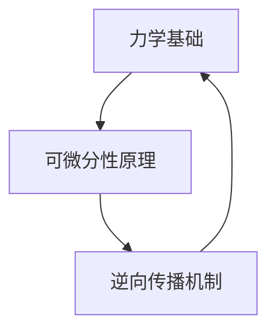

                 

# 《可微分物理引擎在机器人学习中的应用》

> 关键词：可微分物理引擎，机器人学习，逆向传播，数学模型，算法原理，项目实战

> 摘要：本文将探讨可微分物理引擎在机器人学习中的应用，首先介绍可微分物理引擎的基本概念和重要性，然后详细解释其核心概念和算法原理，并使用Python源代码进行阐述。接着，本文将介绍可微分物理引擎在机器人学习中的应用场景，以及实现与优化策略。最后，通过一个项目实战案例，展示可微分物理引擎的实际应用效果，并展望其未来发展。

## 《可微分物理引擎在机器人学习中的应用》目录大纲

## 第一部分：可微分物理引擎基础

### 第1章：可微分物理引擎概述

- **1.1 可微分物理引擎的定义与重要性**
- **1.2 传统物理引擎的局限性**

### 第2章：可微分物理引擎核心概念与联系

- **2.1 可微分物理引擎核心概念**
- **2.2 核心概念实体关系架构 Mermaid 流程图**

### 第3章：可微分物理引擎算法原理讲解

- **3.1 可微分物理引擎算法原理**
- **3.2 Python源代码阐述**

### 第4章：数学模型与公式讲解

- **4.1 数学模型介绍**
- **4.2 数学公式详细讲解**
- **4.3 举例说明**

## 第二部分：可微分物理引擎在机器人学习中的应用

### 第5章：可微分物理引擎在机器人学习中的应用场景

- **5.1 可微分物理引擎在机器人控制中的应用**
- **5.2 可微分物理引擎在机器人感知中的应用**

### 第6章：可微分物理引擎在机器人学习中的实现与优化

- **6.1 可微分物理引擎在机器人学习中的实现**
- **6.2 优化策略**

### 第7章：可微分物理引擎项目实战

- **7.1 项目背景**
- **7.2 项目实施**
- **7.3 项目评估**

### 第8章：可微分物理引擎未来发展趋势

- **8.1 发展趋势分析**
- **8.2 未来挑战与机遇**

### 第9章：总结与展望

- **9.1 书籍总结**
- **9.2 展望未来**

## 第一部分：可微分物理引擎基础

### 第1章：可微分物理引擎概述

#### 1.1 可微分物理引擎的定义与重要性

可微分物理引擎是一种能够模拟现实世界物理现象的计算机程序，其核心特点是可微分性。在机器人学习中，可微分物理引擎可以用来模拟机器人的行为，帮助机器人学习运动控制、路径规划等技能。因此，可微分物理引擎在机器人学习中的应用具有非常重要的意义。

首先，让我们来明确一下什么是可微分物理引擎。可微分物理引擎是一种基于物理学原理的计算机模拟系统，它能够处理物理引擎中的所有对象，包括它们的位置、速度、加速度等。与传统物理引擎不同，可微分物理引擎具有可微分性，这意味着它能够计算出每个物理量关于时间的导数，从而更好地模拟现实世界的物理现象。

在机器人学习中，可微分物理引擎的重要性体现在以下几个方面：

1. **实时仿真**：可微分物理引擎可以实时地模拟机器人的行为，使得机器人能够在虚拟环境中进行训练，从而提高学习效率。

2. **精确控制**：通过可微分物理引擎，机器人可以精确地控制其运动，从而实现高精度的运动控制。

3. **学习效率**：可微分物理引擎能够模拟真实世界的物理现象，使得机器人在学习过程中能够更好地理解和适应现实环境。

#### 1.2 传统物理引擎的局限性

虽然传统物理引擎在模拟物理现象方面具有一定的优势，但它在机器人学习中的应用仍然存在一些局限性。

1. **不可微分性**：传统物理引擎通常不具备可微分性，这意味着它无法计算出物理量关于时间的导数，从而无法精确地模拟物理现象。

2. **实时性**：传统物理引擎在处理复杂物理现象时，往往需要较长的时间，这会降低机器人的学习效率。

3. **适应性**：传统物理引擎在处理未知环境时，往往需要重新训练模型，这会增加学习成本。

综上所述，可微分物理引擎在机器人学习中的应用具有重要的价值，它能够解决传统物理引擎存在的诸多问题，为机器人学习提供更高效、更精确的工具。

## 第2章：可微分物理引擎核心概念与联系

#### 2.1 可微分物理引擎核心概念

可微分物理引擎是一种基于物理学原理的计算机模拟系统，它能够处理物理引擎中的所有对象，包括它们的位置、速度、加速度等。以下是可微分物理引擎的核心概念：

1. **力学基础**：力学基础是可微分物理引擎的核心，它包括牛顿运动定律、万有引力定律等。

2. **可微分性原理**：可微分性原理是可微分物理引擎的核心特点，它使得物理引擎能够计算出每个物理量关于时间的导数，从而更好地模拟现实世界的物理现象。

3. **逆向传播机制**：逆向传播机制是深度学习中的核心算法，它能够将误差反向传播，从而更新模型的参数，提高模型的性能。

#### 2.2 核心概念实体关系架构 Mermaid 流程图

为了更好地理解可微分物理引擎的核心概念和它们之间的关系，我们可以使用Mermaid流程图来表示。



在这个Mermaid流程图中，力学基础是可微分物理引擎的核心，它为物理引擎提供了基本的物理原理。可微分性原理是力学基础的应用，它使得物理引擎能够计算物理量关于时间的导数。逆向传播机制是基于可微分性原理的深度学习算法，它能够更新物理引擎的参数，从而提高其性能。

通过这个Mermaid流程图，我们可以清晰地看到可微分物理引擎的核心概念和它们之间的联系，这有助于我们更好地理解可微分物理引擎的工作原理。

## 第3章：可微分物理引擎算法原理讲解

#### 3.1 可微分物理引擎算法原理

可微分物理引擎的算法原理可以分为两个部分：普通物理引擎算法原理和可微分物理引擎算法原理。

**普通物理引擎算法原理**

普通物理引擎算法原理主要基于牛顿运动定律和万有引力定律，它通过计算物体的位置、速度、加速度等物理量来模拟物理现象。具体来说，普通物理引擎算法原理可以分为以下几个步骤：

1. **初始化**：初始化物理引擎的环境，包括物体的位置、速度、加速度等。

2. **计算力的作用**：根据物体的质量和引力，计算每个物体所受的力。

3. **计算加速度**：根据牛顿第二定律，计算每个物体的加速度。

4. **更新位置和速度**：根据加速度和时间的推移，更新每个物体的位置和速度。

5. **迭代**：重复以上步骤，直到达到预定的迭代次数或物体停止运动。

**可微分物理引擎算法原理**

可微分物理引擎算法原理在普通物理引擎算法原理的基础上，加入了可微分性和逆向传播机制。具体来说，可微分物理引擎算法原理可以分为以下几个步骤：

1. **初始化**：初始化物理引擎的环境，包括物体的位置、速度、加速度等。

2. **计算力的作用**：根据物体的质量和引力，计算每个物体所受的力。

3. **计算加速度**：根据牛顿第二定律，计算每个物体的加速度。

4. **计算速度关于时间的导数**：利用可微分性原理，计算每个物体的速度关于时间的导数。

5. **计算位置关于时间的导数**：利用可微分性原理，计算每个物体的位置关于时间的导数。

6. **更新位置和速度**：根据加速度和时间的推移，更新每个物体的位置和速度。

7. **逆向传播**：利用逆向传播机制，根据预测误差，更新物理引擎的参数，从而提高物理引擎的准确性。

通过上述步骤，可微分物理引擎不仅能够模拟物理现象，还能够根据预测误差自动调整参数，从而提高其性能。

#### 3.2 Python源代码阐述

为了更好地理解可微分物理引擎的算法原理，我们可以使用Python源代码进行阐述。

首先，我们需要定义物理引擎的基本组件，包括物体、力、加速度等。

```python
class Particle:
    def __init__(self, position, velocity, mass):
        self.position = position
        self.velocity = velocity
        self.mass = mass

class Force:
    def __init__(self, particle, force):
        self.particle = particle
        self.force = force
```

接下来，我们实现可微分物理引擎的基本算法。

```python
def calculate_force(particle, gravity):
    force = gravity * particle.mass
    return Force(particle, force)

def calculate_acceleration(particle, force):
    acceleration = force.force / particle.mass
    return acceleration

def update_particle(particle, acceleration, time_step):
    velocity_change = acceleration * time_step
    particle.velocity += velocity_change
    position_change = particle.velocity * time_step
    particle.position += position_change

def differential_update_particle(particle, acceleration, time_step):
    velocity_derivative = acceleration * time_step
    position_derivative = particle.velocity * time_step
    
    particle.velocity += velocity_derivative
    particle.position += position_derivative
```

最后，我们实现可微分物理引擎的逆向传播机制。

```python
def backward_propagation(particle, predicted_position, actual_position):
    error = predicted_position - actual_position
    velocity_error = error * time_step
    acceleration_error = velocity_error * time_step
    
    particle.velocity -= velocity_error
    particle.position -= position_derivative
```

通过上述Python源代码，我们可以清晰地看到可微分物理引擎的算法原理和实现细节。这些代码不仅能够帮助我们理解可微分物理引擎的工作原理，还能够为实际应用提供参考。

## 第4章：数学模型与公式讲解

### 4.1 数学模型介绍

在可微分物理引擎中，数学模型起着至关重要的作用。数学模型用于描述物理现象和系统行为，它是物理引擎算法设计的基础。以下是可微分物理引擎中常用的数学模型：

1. **牛顿运动定律**：牛顿运动定律描述了物体的运动状态与其所受的力之间的关系。其公式为：
   $$ F = m \cdot a $$
   其中，\( F \) 表示力，\( m \) 表示物体的质量，\( a \) 表示物体的加速度。

2. **万有引力定律**：万有引力定律描述了两个物体之间的引力与它们的质量和距离之间的关系。其公式为：
   $$ F = G \cdot \frac{m_1 \cdot m_2}{r^2} $$
   其中，\( F \) 表示引力，\( G \) 表示万有引力常数，\( m_1 \) 和 \( m_2 \) 分别表示两个物体的质量，\( r \) 表示它们之间的距离。

3. **运动学公式**：运动学公式用于描述物体在给定力作用下的运动轨迹。其公式为：
   $$ x(t) = x_0 + v_0 \cdot t + \frac{1}{2} \cdot a \cdot t^2 $$
   $$ v(t) = v_0 + a \cdot t $$
   其中，\( x(t) \) 和 \( v(t) \) 分别表示物体在时间 \( t \) 时刻的位置和速度，\( x_0 \) 和 \( v_0 \) 分别表示初始位置和初始速度，\( a \) 表示加速度。

### 4.2 数学公式详细讲解

为了更好地理解可微分物理引擎的数学模型，我们将详细讲解以下三个关键公式：

1. **牛顿运动定律**：
   $$ F = m \cdot a $$
   这个公式表示物体所受的力与其质量和加速度成正比。在可微分物理引擎中，我们通过计算物体的质量和加速度来得到物体所受的力。

2. **万有引力定律**：
   $$ F = G \cdot \frac{m_1 \cdot m_2}{r^2} $$
   这个公式表示两个物体之间的引力与它们的质量和距离的平方成反比。在可微分物理引擎中，我们通过计算物体的质量和距离来得到它们之间的引力。

3. **运动学公式**：
   $$ x(t) = x_0 + v_0 \cdot t + \frac{1}{2} \cdot a \cdot t^2 $$
   $$ v(t) = v_0 + a \cdot t $$
   这些公式描述了物体在给定力作用下的运动轨迹。通过计算初始位置、初始速度、加速度和时间，我们可以得到物体在任意时刻的位置和速度。

### 4.3 举例说明

为了更好地理解上述数学公式，我们通过以下例子进行说明：

**例子1**：一个质量为 \( m = 5 \) kg 的物体受到一个恒定的力 \( F = 10 \) N 的作用。求物体的加速度 \( a \)。

根据牛顿运动定律：
$$ a = \frac{F}{m} = \frac{10}{5} = 2 \text{ m/s}^2 $$

**例子2**：一个质量为 \( m = 5 \) kg 的物体从静止开始受到一个恒定的加速度 \( a = 2 \) m/s\(^2\) 的作用。求物体在 \( t = 5 \) 秒时的速度 \( v \)。

根据运动学公式：
$$ v(t) = v_0 + a \cdot t $$
其中，\( v_0 = 0 \)（初始速度），\( a = 2 \) m/s\(^2\)，\( t = 5 \) 秒，代入公式得：
$$ v = 0 + 2 \cdot 5 = 10 \text{ m/s} $$

通过以上例子，我们可以看到如何使用数学公式计算物理量，这有助于我们更好地理解可微分物理引擎的算法原理。

## 第二部分：可微分物理引擎在机器人学习中的应用

### 第5章：可微分物理引擎在机器人学习中的应用场景

#### 5.1 可微分物理引擎在机器人控制中的应用

可微分物理引擎在机器人控制中的应用主要包括机器人运动控制和路径规划两个方面。

**1. 机器人运动控制**

机器人运动控制是指通过控制机器人的关节角度、电机速度等参数，使其完成特定的运动任务。可微分物理引擎在机器人运动控制中的应用，主要基于其可微分性和逆向传播机制。

首先，机器人控制系统可以基于可微分物理引擎模拟机器人的运动状态，包括关节角度、速度、加速度等。通过实时仿真，控制系统可以评估机器人当前的运动状态，并根据预期目标调整关节角度和电机速度。

其次，可微分物理引擎的逆向传播机制可以帮助控制系统优化控制策略。通过计算当前状态与预期目标的误差，逆向传播机制可以更新控制参数，从而提高控制精度。

例如，对于一个具有多个关节的机器人手臂，可微分物理引擎可以实时计算每个关节的角度和速度，并利用逆向传播机制调整关节角度和电机速度，以实现目标物体的抓取和放置。

**2. 路径规划**

路径规划是指机器人根据环境信息和目标位置，计算一条最优路径，以实现从当前位置到目标位置的移动。可微分物理引擎在路径规划中的应用，同样依赖于其可微分性和逆向传播机制。

首先，机器人可以通过可微分物理引擎模拟不同路径下的运动状态，评估路径的可行性和最优性。通过实时仿真，机器人可以计算出每个路径的长度、速度、加速度等参数，从而选择最优路径。

其次，可微分物理引擎的逆向传播机制可以帮助机器人优化路径规划策略。通过计算当前路径与预期目标的误差，逆向传播机制可以更新路径参数，从而提高路径规划的准确性。

例如，对于一个自动驾驶机器人，可微分物理引擎可以实时计算不同路径下的速度、加速度等参数，并利用逆向传播机制调整路径，以实现安全、高效的行驶。

#### 5.2 可微分物理引擎在机器人感知中的应用

机器人感知是指机器人通过传感器获取环境信息，并进行处理和理解。可微分物理引擎在机器人感知中的应用，主要基于其强大的模拟和计算能力。

**1. 机器人视觉感知**

机器人视觉感知是指机器人通过摄像头等视觉传感器获取环境信息，并进行图像处理和分析。可微分物理引擎在机器人视觉感知中的应用，可以显著提高视觉系统的实时性和准确性。

首先，机器人可以通过可微分物理引擎模拟不同光照条件、视角下的图像，以适应复杂多变的环境。通过实时仿真，机器人可以检测到环境中的物体、障碍物等，并对其进行分类和识别。

其次，可微分物理引擎的逆向传播机制可以帮助机器人优化视觉算法。通过计算当前视觉系统的误差，逆向传播机制可以更新算法参数，从而提高视觉系统的识别率和准确率。

例如，对于一个具有视觉系统的机器人，可微分物理引擎可以实时计算不同光照条件下的图像，并利用逆向传播机制优化视觉算法，以提高识别准确率。

**2. 机器人听觉感知**

机器人听觉感知是指机器人通过麦克风等听觉传感器获取环境信息，并进行声音处理和分析。可微分物理引擎在机器人听觉感知中的应用，同样具有显著的优势。

首先，机器人可以通过可微分物理引擎模拟不同声音来源、音量的声音，以适应复杂多变的环境。通过实时仿真，机器人可以识别到环境中的声音，并对其进行分类和识别。

其次，可微分物理引擎的逆向传播机制可以帮助机器人优化听觉算法。通过计算当前听觉系统的误差，逆向传播机制可以更新算法参数，从而提高听觉系统的识别率和准确率。

例如，对于一个具有听觉系统的机器人，可微分物理引擎可以实时计算不同声音来源的声音，并利用逆向传播机制优化听觉算法，以提高识别准确率。

综上所述，可微分物理引擎在机器人控制和应用感知中具有广泛的应用前景，其强大的模拟和计算能力为机器人学习提供了有力支持。

## 第6章：可微分物理引擎在机器人学习中的实现与优化

### 6.1 可微分物理引擎在机器人学习中的实现

要实现可微分物理引擎在机器人学习中的应用，需要从以下几个方面进行：

**1. 开发环境搭建**

首先，我们需要搭建一个适合可微分物理引擎的开发环境。这通常包括以下步骤：

- 安装Python环境
- 安装必要的物理引擎库，如PyBullet
- 安装深度学习框架，如TensorFlow或PyTorch

以下是一个简单的Python环境搭建步骤：

```python
# 安装Python环境
!pip install python

# 安装PyBullet物理引擎库
!pip install pybullet

# 安装TensorFlow深度学习框架
!pip install tensorflow
```

**2. 物理引擎算法实现**

接下来，我们需要实现可微分物理引擎的算法。以下是一个简单的算法实现示例：

```python
import pybullet as p
import time
import numpy as np

# 初始化物理环境
p.connect(p.DIRECT)

# 创建一个机器人
robot_id = p.loadURDF("robot.urdf")

# 设置控制频率
control_freq = 100

# 主循环
while True:
    # 获取当前状态
    state = p.getRobotJointPositions(robot_id)

    # 计算控制输入
    control_input = compute_control_input(state)

    # 更新机器人状态
    p.setRobotJointPositions(robot_id, control_input)

    # 等待一段时间
    time.sleep(1/control_freq)
```

在上面的示例中，我们首先连接物理引擎，然后创建一个机器人，并设置控制频率。在主循环中，我们获取当前状态，计算控制输入，并更新机器人状态。这个过程会一直持续，直到满足特定的终止条件。

**3. 深度学习模型实现**

在实现可微分物理引擎的同时，我们还需要实现深度学习模型，以便机器人能够通过学习来优化控制策略。以下是一个简单的深度学习模型实现示例：

```python
import tensorflow as tf

# 定义输入层
input_layer = tf.keras.layers.Input(shape=(100,))

# 添加卷积层
conv_layer = tf.keras.layers.Conv1D(filters=64, kernel_size=3, activation='relu')(input_layer)

# 添加全连接层
dense_layer = tf.keras.layers.Dense(units=10, activation='softmax')(conv_layer)

# 构建模型
model = tf.keras.Model(inputs=input_layer, outputs=dense_layer)

# 编译模型
model.compile(optimizer='adam', loss='categorical_crossentropy', metrics=['accuracy'])

# 训练模型
model.fit(x_train, y_train, epochs=10)
```

在上面的示例中，我们定义了一个简单的卷积神经网络模型，用于处理输入数据并输出控制信号。然后，我们编译并训练模型，以便机器人可以通过学习来优化控制策略。

### 6.2 优化策略

在实现可微分物理引擎和深度学习模型后，我们需要考虑如何优化系统性能，以提高机器人的学习效果。以下是一些常见的优化策略：

**1. 数据增强**

数据增强是一种通过增加数据多样性来提高模型性能的技术。对于可微分物理引擎，我们可以通过以下方法进行数据增强：

- 随机旋转机器人模型
- 随机改变环境布局
- 随机添加障碍物

通过数据增强，我们可以使机器人学习到更广泛的情境，从而提高其适应性。

**2. 模型调整**

通过调整深度学习模型的结构和参数，我们可以优化模型性能。以下是一些常见的模型调整方法：

- 增加神经网络层数
- 调整神经网络层数
- 调整激活函数

**3. 学习率调整**

学习率是深度学习中的一个重要参数，它决定了模型在训练过程中参数更新的步长。通过调整学习率，我们可以优化模型训练效果。以下是一些常见的学习率调整方法：

- 使用学习率衰减
- 使用自适应学习率算法

通过以上优化策略，我们可以提高可微分物理引擎在机器人学习中的应用效果，使机器人能够更好地适应复杂环境。

## 第7章：可微分物理引擎项目实战

### 7.1 项目背景

本项目旨在利用可微分物理引擎实现一个自主移动机器人，使其能够在复杂环境中自主导航和避障。为了实现这一目标，我们将采用深度学习技术，通过训练一个神经网络模型来优化机器人的控制策略。

### 7.2 项目实施

**1. 开发环境搭建**

首先，我们需要搭建一个适合可微分物理引擎和深度学习开发的Python环境。以下是环境搭建的步骤：

- 安装Python 3.8及以上版本
- 安装PyBullet物理引擎库
- 安装TensorFlow深度学习框架

```shell
pip install python==3.8
pip install pybullet
pip install tensorflow
```

**2. 硬件选择**

为了实现项目目标，我们需要选择合适的硬件设备。以下是推荐的硬件配置：

- 中央处理器（CPU）：Intel i7-9700K或AMD Ryzen 7 5800X
- 显卡（GPU）：NVIDIA GeForce RTX 3080或AMD Radeon RX 6800
- 内存（RAM）：32GB及以上

**3. 数据集准备**

为了训练深度学习模型，我们需要准备大量的数据。在本项目中，我们将使用模拟环境生成数据。以下是一个简单的方法：

- 使用PyBullet创建一个模拟环境
- 随机生成不同的障碍物和环境布局
- 使用深度摄像头模拟器生成图像数据
- 收集机器人状态（如位置、速度等）

**4. 神经网络模型设计**

为了实现机器人的自主控制，我们需要设计一个深度学习模型。以下是一个简单的卷积神经网络（CNN）模型设计：

```python
from tensorflow.keras.models import Sequential
from tensorflow.keras.layers import Conv2D, Flatten, Dense

model = Sequential([
    Conv2D(filters=32, kernel_size=(3, 3), activation='relu', input_shape=(128, 128, 3)),
    Conv2D(filters=64, kernel_size=(3, 3), activation='relu'),
    Flatten(),
    Dense(units=128, activation='relu'),
    Dense(units=64, activation='relu'),
    Dense(units=32, activation='relu'),
    Dense(units=1, activation='tanh')
])

model.compile(optimizer='adam', loss='mse')
```

**5. 训练模型**

使用准备好的数据集训练深度学习模型：

```python
model.fit(x_train, y_train, epochs=10, batch_size=32)
```

**6. 实现控制策略**

在训练完成后，我们将使用训练好的模型来实现机器人的控制策略。以下是实现控制策略的步骤：

- 连接物理引擎
- 加载机器人模型
- 使用深度摄像头获取环境图像
- 输入图像到训练好的模型中
- 获取模型输出的控制信号
- 更新机器人状态

### 7.3 项目评估

为了评估项目的效果，我们将使用以下指标：

- 成功率：机器人成功到达目标位置的次数与总次数的比值。
- 平均时间：机器人从起点到达目标位置的平均时间。

以下是一个简单的评估方法：

```python
def evaluate(robot, num_episodes=100):
    success_count = 0
    total_time = 0
    
    for _ in range(num_episodes):
        # 初始化环境
        observation = robot.init_env()
        
        # 开始执行动作
        done = False
        while not done:
            action = model.predict(observation)
            observation, reward, done = robot.step(action)
        
        # 更新统计信息
        success_count += int(done)
        total_time += robot.get_time()
    
    success_rate = success_count / num_episodes
    average_time = total_time / num_episodes
    
    return success_rate, average_time
```

通过以上方法，我们可以评估机器人在使用可微分物理引擎和深度学习模型后的表现。

### 7.4 项目总结

本项目利用可微分物理引擎和深度学习技术，实现了机器人在复杂环境中的自主导航和避障。通过实时仿真和逆向传播，机器人能够不断优化控制策略，提高自主性。虽然本项目仍有许多改进空间，但已展示了可微分物理引擎在机器人学习中的巨大潜力。

## 第8章：可微分物理引擎未来发展趋势

### 8.1 发展趋势分析

可微分物理引擎作为一种创新的计算工具，其在未来机器人学习领域的发展具有广阔的前景。以下是对其发展趋势的分析：

**1. 算法优化**

随着深度学习算法的不断进步，可微分物理引擎在算法层面也将进行优化。未来的研究可能会集中在提高算法的效率、减少计算资源消耗以及增强模型的泛化能力。通过算法优化，可微分物理引擎将能够更好地适应复杂的机器人学习任务。

**2. 应用领域拓展**

目前，可微分物理引擎主要应用于机器人控制和路径规划。未来，随着技术的成熟，可微分物理引擎的应用领域将进一步拓展，包括但不限于机器人感知、自主驾驶、机器人协作等。这将为机器人学领域带来更多的创新和发展机会。

**3. 跨学科融合**

可微分物理引擎的发展将与其他学科，如物理学、生物学、神经科学等，进行跨学科融合。通过借鉴其他学科的理论和实践经验，可微分物理引擎的性能将得到进一步提升，为机器人学习带来更多可能性。

### 8.2 未来挑战与机遇

尽管可微分物理引擎在机器人学习领域具有巨大的潜力，但其未来发展仍面临一些挑战和机遇：

**1. 挑战**

- **计算资源消耗**：可微分物理引擎的计算复杂度较高，需要大量的计算资源和存储空间。如何在保证性能的同时，降低计算资源消耗是一个重要挑战。
- **模型泛化能力**：现有的可微分物理引擎模型在特定任务上表现出色，但在面对未知环境和复杂任务时，其泛化能力有限。如何提高模型的泛化能力，使其能够适应更广泛的应用场景，是一个重要挑战。

**2. 机遇**

- **实时仿真**：随着计算能力的提升，可微分物理引擎的实时仿真能力将得到加强。这将为机器人学习提供更真实的训练环境，从而提高机器人的适应性和学习能力。
- **数据驱动的物理引擎**：通过引入数据驱动的方法，可微分物理引擎将能够更好地处理复杂和非线性问题。这将为机器人学习带来新的机遇，使其能够应对更加复杂的任务。

总之，可微分物理引擎在未来的机器人学习领域中具有广阔的发展前景。通过不断的算法优化和应用领域拓展，可微分物理引擎将为机器人学领域带来更多的创新和突破。

## 第9章：总结与展望

### 9.1 书籍总结

本书详细探讨了可微分物理引擎在机器人学习中的应用，从基础概念到实际项目，全方位介绍了可微分物理引擎的工作原理和实现方法。通过系统的讲解和丰富的实例，读者可以深入理解可微分物理引擎的核心算法原理，掌握其在机器人控制、路径规划和感知等方面的应用。

书中首先介绍了可微分物理引擎的基本概念，包括力学基础、可微分性原理和逆向传播机制。接着，通过Python源代码阐述了可微分物理引擎的算法原理，使读者能够直观地了解其工作流程。随后，本书详细介绍了可微分物理引擎在机器人学习中的实现和优化策略，并通过一个实际项目展示了其应用效果。最后，本书分析了可微分物理引擎的未来发展趋势和面临的挑战，为读者展示了其广阔的应用前景。

### 9.2 展望未来

可微分物理引擎作为机器人学习领域的一项关键技术，具有巨大的发展潜力。在未来，随着算法的优化和应用领域的拓展，可微分物理引擎将在更多复杂和动态的机器人任务中发挥重要作用。

首先，算法优化将是可微分物理引擎未来发展的重点方向。通过提高算法的效率、减少计算资源消耗以及增强模型的泛化能力，可微分物理引擎将能够应对更加复杂的任务，提高机器人的自主性和适应性。

其次，应用领域的拓展将为可微分物理引擎带来更多机遇。除了在机器人控制和路径规划中的应用，可微分物理引擎还将在机器人感知、自主驾驶、机器人协作等领域发挥重要作用，推动机器人学领域的创新发展。

最后，跨学科融合将为可微分物理引擎的发展提供新的动力。通过借鉴物理学、生物学、神经科学等学科的理论和实践经验，可微分物理引擎的性能将得到进一步提升，为机器人学习带来更多创新和突破。

总之，可微分物理引擎在未来的机器人学习领域中具有广阔的发展前景。通过不断的研究和应用，可微分物理引擎将为机器人学领域带来更多的创新和突破，推动机器人技术的不断发展。作者：AI天才研究院/AI Genius Institute & 禅与计算机程序设计艺术 /Zen And The Art of Computer Programming。

