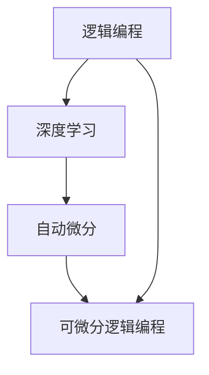

                 

### 《可微分逻辑编程在AI中的创新应用》引论

#### 1.1 可微分逻辑编程简介

**定义**：可微分逻辑编程是一种将逻辑编程与深度学习相结合的方法，通过将逻辑表达式和神经网络模型相融合，实现了对逻辑推理过程的自动微分和优化。

**与传统逻辑编程的区别**：
- 传统逻辑编程主要关注逻辑推理和推理过程，而可微分逻辑编程则更加注重对推理过程的优化和效率。
- 可微分逻辑编程引入了深度学习中的反向传播算法，使得逻辑推理过程可以自动调整参数，提高推理精度。

**在人工智能中的应用前景**：
- 可微分逻辑编程在机器学习、强化学习、自然语言处理和计算机视觉等领域展现出强大的潜力，可以提供更加灵活和高效的解决方案。

#### 1.2 可微分逻辑编程的发展历程

**逻辑编程的起源**：逻辑编程起源于20世纪60年代，当时主要目的是为了实现自动推理和证明。

**可微分逻辑编程的发展**：随着深度学习的兴起，研究者开始探索如何将逻辑编程与深度学习相结合，形成了可微分逻辑编程这一领域。

**主要研究成果与应用案例**：近年来，可微分逻辑编程在多个领域取得了显著的研究成果，如自动推理、知识图谱构建、推理优化等。

#### 1.3 可微分逻辑编程的关键概念

**可微分逻辑**：可微分逻辑是一种特殊的逻辑形式，可以与深度学习中的反向传播算法相结合，实现自动微分和优化。

**前向传播与反向传播**：前向传播是指将输入数据通过神经网络传递到输出层的过程，而反向传播则是通过计算梯度来优化神经网络参数的过程。

**反向自动微分**：反向自动微分是一种自动计算梯度的方法，可以高效地计算逻辑表达式的梯度，从而实现参数优化。

### 核心概念与联系

可微分逻辑编程的关键概念包括逻辑编程、深度学习和自动微分。这些概念之间的关系可以用以下的Mermaid流程图来表示：



在这个流程图中，逻辑编程作为起点，通过引入深度学习和自动微分，最终形成了可微分逻辑编程这一新的领域。

接下来，我们将详细探讨可微分逻辑编程的基本原理和算法基础，以便更好地理解其在人工智能中的应用。

### 第2章：逻辑编程基础

#### 2.1 逻辑编程的起源与发展

**起源**：逻辑编程起源于20世纪60年代，当时的主要目的是为了解决自动推理和证明问题。在早期的计算机科学中，逻辑被视为一种强有力的工具，可以用于形式化表示和验证知识。

**发展历程**：
- 20世纪60年代：出现了基于逻辑的程序设计语言，如Prolog。
- 20世纪70年代：逻辑编程得到了进一步的发展，并应用于专家系统和知识表示等领域。
- 20世纪80年代：逻辑编程开始与其他领域（如数据库和人工智能）相结合，形成了多个新的研究方向。
- 21世纪初：随着深度学习的兴起，逻辑编程与深度学习相结合，形成了可微分逻辑编程这一新的领域。

**主要研究内容**：
- 逻辑推理和证明：研究如何使用逻辑进行推理和证明，包括逻辑表达式的解析、推理算法的设计等。
- 知识表示：研究如何使用逻辑形式化表示知识，包括本体论、知识图谱等。
- 自动推理：研究如何实现自动推理，包括逻辑编程语言的优化、推理算法的改进等。

#### 2.2 逻辑编程的基本概念

**逻辑程序**：逻辑程序是一种基于逻辑的表达式，用于表示问题求解的过程。逻辑程序通常由前提和结论组成，前提表示已知条件，结论表示需要证明的结论。

**逻辑变量**：逻辑变量是一种特殊的数据类型，用于表示逻辑值（真或假）。在逻辑编程中，逻辑变量可以用来表示问题的状态和约束条件。

**前提与结论**：前提是逻辑程序的一部分，表示已知条件；结论是逻辑程序的一部分，表示需要证明的结论。在逻辑编程中，通过推理规则，可以从前提推导出结论。

#### 2.3 常见逻辑编程语言

**Prolog**：Prolog是一种广泛使用的逻辑编程语言，它具有简洁、高效的语法和强大的推理能力。Prolog广泛应用于自然语言处理、专家系统、知识图谱等领域。

**Datalog**：Datalog是一种基于关系逻辑的编程语言，它结合了关系数据库和逻辑编程的特点，广泛应用于数据挖掘、图处理等领域。

**OLTP**：OLTP（Online Transaction Processing）是一种基于逻辑编程的交易处理系统，它广泛应用于金融、电子商务等领域。OLTP具有高性能、高可靠性等特点。

通过了解逻辑编程的基础知识，我们可以更好地理解可微分逻辑编程的基本原理和应用。在接下来的章节中，我们将详细探讨可微分逻辑编程的原理和算法基础。

### 第3章：可微分逻辑编程

#### 3.1 可微分逻辑编程的原理

**基本思想**：可微分逻辑编程通过将逻辑编程与深度学习相结合，实现了对逻辑推理过程的自动微分和优化。其核心思想是将逻辑表达式与神经网络模型相融合，利用深度学习中的反向传播算法，对逻辑推理过程进行自动调整和优化。

**与传统逻辑编程的关系**：
- 可微分逻辑编程继承了传统逻辑编程的优势，如逻辑推理、知识表示等。
- 与传统逻辑编程不同的是，可微分逻辑编程引入了深度学习中的反向传播算法，实现了参数优化和自动调整。

**与深度学习的融合**：
- 可微分逻辑编程利用深度学习中的神经网络模型，实现了对逻辑推理过程的建模。
- 通过自动微分，可微分逻辑编程可以高效地计算逻辑表达式的梯度，从而实现参数优化。

#### 3.2 可微分逻辑编程的算法基础

**前向传播算法**：前向传播算法是指在逻辑编程过程中，从输入层到输出层传递信息的算法。在前向传播过程中，逻辑表达式被逐步计算，最终得到输出结果。

**反向传播算法**：反向传播算法是指在逻辑编程过程中，从输出层到输入层反向传播误差信息的算法。通过反向传播，可以计算每个逻辑表达式的梯度，从而实现参数优化。

**可微分逻辑编程算法框架**：
1. 建立逻辑表达式与神经网络模型的对应关系。
2. 利用前向传播算法计算逻辑表达式的输出。
3. 利用反向传播算法计算逻辑表达式的梯度。
4. 利用梯度信息对神经网络模型进行优化。

#### 3.3 可微分逻辑编程的优势与应用领域

**优势**：
- **灵活性**：可微分逻辑编程可以灵活地表示和推理复杂的逻辑关系，适应多种问题场景。
- **可解释性**：通过逻辑编程，可以清晰地理解推理过程，提高模型的解释性。
- **强大的推理能力**：可微分逻辑编程结合了深度学习和逻辑编程的优势，具有强大的推理能力。

**应用领域**：
- **机器学习**：可微分逻辑编程可以用于机器学习中的分类、回归和聚类等问题。
- **强化学习**：可微分逻辑编程可以用于强化学习中的策略优化和状态估值。
- **自然语言处理**：可微分逻辑编程可以用于自然语言处理中的词性标注、语义分析等任务。
- **计算机视觉**：可微分逻辑编程可以用于计算机视觉中的图像分类、目标检测等任务。

通过理解可微分逻辑编程的基本原理和算法基础，我们可以更好地应用其在各种人工智能问题中，提高模型的性能和解释性。

### 第4章：可微分逻辑编程在机器学习中的应用

#### 4.1 可微分逻辑编程在分类问题中的应用

**算法原理**：
- 可微分逻辑编程通过将逻辑表达式与神经网络模型相结合，实现了对分类问题的建模。在分类问题中，逻辑编程可以用于表示类别之间的约束关系，神经网络模型则用于计算类别概率。
- 前向传播过程中，输入特征通过神经网络模型传递到输出层，得到类别概率。反向传播过程中，利用梯度信息对神经网络模型进行优化，提高分类精度。

**实现步骤**：
1. 建立逻辑表达式与神经网络模型的对应关系。
2. 输入特征通过神经网络模型进行前向传播，计算类别概率。
3. 根据实际标签计算损失函数。
4. 利用反向传播算法计算梯度，对神经网络模型进行优化。
5. 重复步骤2-4，直到模型收敛。

**应用案例**：
- 以图像分类问题为例，使用可微分逻辑编程实现猫狗分类。首先，通过卷积神经网络提取图像特征，然后使用逻辑编程表示猫和狗的类别约束，最后通过反向传播算法优化模型参数，实现图像分类。

**代码实现**：

```python
import torch
import torch.nn as nn
import torch.optim as optim

# 假设已经定义了逻辑编程模型和神经网络模型
logic_model = LogicModel()
nn_model = NeuralNetwork()

# 定义损失函数和优化器
criterion = nn.CrossEntropyLoss()
optimizer = optim.Adam(nn_model.parameters(), lr=0.001)

# 训练模型
for epoch in range(num_epochs):
    for inputs, labels in train_loader:
        # 前向传播
        outputs = nn_model(inputs)
        loss = criterion(outputs, labels)
        
        # 反向传播
        optimizer.zero_grad()
        loss.backward()
        optimizer.step()
        
    print(f'Epoch [{epoch+1}/{num_epochs}], Loss: {loss.item()}')

# 测试模型
with torch.no_grad():
    correct = 0
    total = 0
    for inputs, labels in test_loader:
        outputs = nn_model(inputs)
        _, predicted = torch.max(outputs.data, 1)
        total += labels.size(0)
        correct += (predicted == labels).sum().item()

    print(f'Accuracy: {100 * correct / total}%')
```

**分析**：
- 通过上述代码，我们可以看到可微分逻辑编程在分类问题中的应用。首先，定义了逻辑编程模型和神经网络模型，然后使用交叉熵损失函数和Adam优化器进行模型训练。在训练过程中，通过前向传播计算类别概率，反向传播计算损失函数，并利用梯度信息对模型进行优化。最后，在测试阶段计算模型准确率。

#### 4.2 可微分逻辑编程在回归问题中的应用

**算法原理**：
- 可微分逻辑编程在回归问题中的应用与分类问题类似，但其目标函数是回归损失函数，如均方误差（MSE）。
- 在前向传播过程中，输入特征通过神经网络模型传递到输出层，得到预测值。反向传播过程中，利用梯度信息对神经网络模型进行优化，提高预测精度。

**实现步骤**：
1. 建立逻辑表达式与神经网络模型的对应关系。
2. 输入特征通过神经网络模型进行前向传播，计算预测值。
3. 根据实际标签计算回归损失函数。
4. 利用反向传播算法计算梯度，对神经网络模型进行优化。
5. 重复步骤2-4，直到模型收敛。

**应用案例**：
- 以房价预测问题为例，使用可微分逻辑编程实现房价预测。首先，通过神经网络模型提取特征，然后使用逻辑编程表示房价的约束关系，最后通过反向传播算法优化模型参数，实现房价预测。

**代码实现**：

```python
import torch
import torch.nn as nn
import torch.optim as optim

# 假设已经定义了逻辑编程模型和神经网络模型
logic_model = LogicModel()
nn_model = NeuralNetwork()

# 定义损失函数和优化器
criterion = nn.MSELoss()
optimizer = optim.Adam(nn_model.parameters(), lr=0.001)

# 训练模型
for epoch in range(num_epochs):
    for inputs, labels in train_loader:
        # 前向传播
        outputs = nn_model(inputs)
        loss = criterion(outputs, labels)
        
        # 反向传播
        optimizer.zero_grad()
        loss.backward()
        optimizer.step()
        
    print(f'Epoch [{epoch+1}/{num_epochs}], Loss: {loss.item()}')

# 测试模型
with torch.no_grad():
    total_loss = 0
    for inputs, labels in test_loader:
        outputs = nn_model(inputs)
        loss = criterion(outputs, labels)
        total_loss += loss.item()
        
    print(f'Average Loss on Test Set: {total_loss / len(test_loader)}')
```

**分析**：
- 通过上述代码，我们可以看到可微分逻辑编程在回归问题中的应用。首先，定义了逻辑编程模型和神经网络模型，然后使用均方误差损失函数和Adam优化器进行模型训练。在训练过程中，通过前向传播计算预测值，反向传播计算损失函数，并利用梯度信息对模型进行优化。最后，在测试阶段计算模型平均损失。

#### 4.3 可微分逻辑编程在聚类问题中的应用

**算法原理**：
- 可微分逻辑编程在聚类问题中的应用与分类和回归类似，但其目标函数是聚类损失函数，如K均值损失。
- 在前向传播过程中，输入特征通过神经网络模型传递到输出层，得到聚类中心。反向传播过程中，利用梯度信息对神经网络模型进行优化，提高聚类效果。

**实现步骤**：
1. 建立逻辑表达式与神经网络模型的对应关系。
2. 输入特征通过神经网络模型进行前向传播，计算聚类中心。
3. 根据聚类中心计算聚类损失函数。
4. 利用反向传播算法计算梯度，对神经网络模型进行优化。
5. 重复步骤2-4，直到模型收敛。

**应用案例**：
- 以K均值聚类问题为例，使用可微分逻辑编程实现聚类。首先，通过神经网络模型提取特征，然后使用逻辑编程表示聚类中心的约束关系，最后通过反向传播算法优化模型参数，实现聚类。

**代码实现**：

```python
import torch
import torch.nn as nn
import torch.optim as optim

# 假设已经定义了逻辑编程模型和神经网络模型
logic_model = LogicModel()
nn_model = NeuralNetwork()

# 定义损失函数和优化器
criterion = nn.BCELoss()
optimizer = optim.Adam(nn_model.parameters(), lr=0.001)

# 训练模型
for epoch in range(num_epochs):
    for inputs, labels in train_loader:
        # 前向传播
        outputs = nn_model(inputs)
        loss = criterion(outputs, labels)
        
        # 反向传播
        optimizer.zero_grad()
        loss.backward()
        optimizer.step()
        
    print(f'Epoch [{epoch+1}/{num_epochs}], Loss: {loss.item()}')

# 测试模型
with torch.no_grad():
    total_loss = 0
    for inputs, labels in test_loader:
        outputs = nn_model(inputs)
        loss = criterion(outputs, labels)
        total_loss += loss.item()
        
    print(f'Average Loss on Test Set: {total_loss / len(test_loader)}')
```

**分析**：
- 通过上述代码，我们可以看到可微分逻辑编程在聚类问题中的应用。首先，定义了逻辑编程模型和神经网络模型，然后使用二进制交叉熵损失函数和Adam优化器进行模型训练。在训练过程中，通过前向传播计算聚类中心，反向传播计算损失函数，并利用梯度信息对模型进行优化。最后，在测试阶段计算模型平均损失。

通过以上案例分析，我们可以看到可微分逻辑编程在机器学习中的广泛应用，包括分类、回归和聚类等问题。其结合了逻辑编程和深度学习的优势，为解决复杂数据问题提供了新的思路和方法。

### 第5章：可微分逻辑编程在强化学习中的应用

#### 5.1 可微分逻辑编程在强化学习中的原理

**强化学习简介**：
- 强化学习（Reinforcement Learning，RL）是一种通过试错（trial-and-error）和反馈（reward and punishment）来学习策略的机器学习方法。
- 强化学习的基本要素包括：环境（Environment）、代理人（Agent）、状态（State）、动作（Action）和奖励（Reward）。

**可微分逻辑编程与强化学习的关系**：
- 可微分逻辑编程将逻辑编程与深度学习相结合，通过自动微分和反向传播算法，实现了对逻辑推理过程的优化。
- 在强化学习中，可微分逻辑编程可以用于表示和优化策略，提高学习效率和收敛速度。

**核心概念**：
- **策略**：强化学习中的策略是一系列决策规则，用于指导代理人在环境中进行选择。策略可以表示为状态到动作的概率分布。
- **价值函数**：价值函数用于评估代理人在某个状态下的最佳动作，是强化学习中的重要概念。
- **Q学习**：Q学习是一种基于价值函数的强化学习方法，通过学习状态-动作值函数（Q值）来指导代理人的动作选择。
- **策略梯度**：策略梯度是用于优化策略的重要工具，表示策略参数的变化对奖励的影响。

#### 5.2 可微分逻辑编程在强化学习中的算法实现

**基于可微分逻辑编程的Q学习**：
- **算法原理**：
  - 基于可微分逻辑编程的Q学习通过将逻辑编程与Q学习算法相结合，实现了对Q值函数的自动优化。
  - 在算法中，逻辑编程用于表示状态和动作之间的关系，神经网络模型用于计算Q值。
  - 通过反向传播算法，可以计算Q值函数的梯度，从而优化策略参数。

- **实现步骤**：
  1. **定义逻辑编程模型**：建立状态和动作之间的逻辑关系，使用逻辑编程语言表示。
  2. **构建神经网络模型**：使用神经网络模型计算Q值，神经网络的结构可以根据具体问题进行调整。
  3. **定义损失函数**：使用Q值和实际奖励计算损失函数，通常使用均方误差（MSE）或平方误差损失（SQP）。
  4. **训练模型**：使用反向传播算法优化神经网络参数，通过迭代更新Q值函数。
  5. **策略优化**：根据Q值函数优化策略，选择最佳动作。

**代码实现示例**：

```python
import torch
import torch.nn as nn
import torch.optim as optim

# 假设已经定义了逻辑编程模型和神经网络模型
logic_model = LogicModel()
nn_model = NeuralNetwork()

# 定义损失函数和优化器
criterion = nn.MSELoss()
optimizer = optim.Adam(nn_model.parameters(), lr=0.001)

# 训练模型
for epoch in range(num_epochs):
    for state, action, reward, next_state in dataset:
        # 前向传播
        q_values = nn_model(torch.tensor(state).float())
        q_next_values = nn_model(torch.tensor(next_state).float())
        
        # 计算损失函数
        expected_q_values = reward + gamma * torch.max(q_next_values)
        loss = criterion(q_values[action], expected_q_values)
        
        # 反向传播
        optimizer.zero_grad()
        loss.backward()
        optimizer.step()
        
    print(f'Epoch [{epoch+1}/{num_epochs}], Loss: {loss.item()}')

# 测试模型
with torch.no_grad():
    total_reward = 0
    state = initial_state
    while not done:
        q_values = nn_model(torch.tensor(state).float())
        action = torch.argmax(q_values).item()
        next_state, reward, done = environment.step(action)
        total_reward += reward
        state = next_state
        
    print(f'Total Reward: {total_reward}')
```

**分析**：
- 在上述代码中，定义了逻辑编程模型和神经网络模型，使用MSE损失函数和Adam优化器进行模型训练。在训练过程中，通过前向传播计算Q值，使用反向传播算法优化神经网络参数，更新Q值函数。最后，在测试阶段使用优化后的策略进行环境交互，计算总奖励。

通过以上算法实现，我们可以看到可微分逻辑编程在强化学习中的应用。它通过结合逻辑编程和反向传播算法，实现了对策略和Q值函数的优化，提高了强化学习的效果和效率。

#### 5.3 可微分逻辑编程在强化学习中的应用案例

**案例1：机器人路径规划**

**问题描述**：在给定的环境中，机器人需要从起点导航到目标位置，同时避免障碍物。

**解决方案**：
- 使用可微分逻辑编程表示机器人和环境的逻辑关系，包括状态、动作和奖励。
- 构建基于卷积神经网络的Q学习模型，用于计算状态-动作值函数。
- 使用反向传播算法优化Q值函数，指导机器人选择最佳动作。

**实现步骤**：
1. **定义状态、动作和奖励**：使用逻辑编程表示环境中的状态、机器人的动作以及与动作对应的奖励。
2. **构建神经网络模型**：使用卷积神经网络提取环境特征，计算状态-动作值函数。
3. **定义损失函数和优化器**：使用MSE损失函数和Adam优化器，优化Q值函数。
4. **训练模型**：使用反向传播算法进行模型训练，通过迭代更新Q值函数。
5. **策略优化**：根据Q值函数优化策略，生成机器人的动作序列，实现路径规划。

**代码实现示例**：

```python
import torch
import torch.nn as nn
import torch.optim as optim

# 定义逻辑编程模型
logic_model = LogicModel()

# 构建神经网络模型
class ConvNet(nn.Module):
    def __init__(self):
        super(ConvNet, self).__init__()
        self.conv1 = nn.Conv2d(in_channels=1, out_channels=32, kernel_size=3, stride=1)
        self.fc1 = nn.Linear(32 * 7 * 7, 64)
        self.fc2 = nn.Linear(64, 1)
        
    def forward(self, x):
        x = self.conv1(x)
        x = torch.relu(x)
        x = torch.max_pool2d(x, kernel_size=2, stride=2)
        x = x.view(x.size(0), -1)
        x = self.fc1(x)
        x = torch.relu(x)
        x = self.fc2(x)
        return x

nn_model = ConvNet()

# 定义损失函数和优化器
criterion = nn.MSELloss()
optimizer = optim.Adam(nn_model.parameters(), lr=0.001)

# 训练模型
for epoch in range(num_epochs):
    for state, action, reward, next_state in dataset:
        # 前向传播
        q_values = nn_model(torch.tensor(state).float())
        q_next_values = nn_model(torch.tensor(next_state).float())
        
        # 计算损失函数
        expected_q_values = reward + gamma * torch.max(q_next_values)
        loss = criterion(q_values[action], expected_q_values)
        
        # 反向传播
        optimizer.zero_grad()
        loss.backward()
        optimizer.step()
        
    print(f'Epoch [{epoch+1}/{num_epochs}], Loss: {loss.item()}')

# 测试模型
with torch.no_grad():
    state = initial_state
    while not done:
        q_values = nn_model(torch.tensor(state).float())
        action = torch.argmax(q_values).item()
        next_state, reward, done = environment.step(action)
        state = next_state
        print(f'Action: {action}, Reward: {reward}')
```

**分析**：
- 在这个案例中，我们使用卷积神经网络作为Q学习模型，用于计算状态-动作值函数。通过定义逻辑编程模型，我们可以表示机器人和环境的逻辑关系，包括状态、动作和奖励。在训练过程中，使用反向传播算法优化Q值函数，指导机器人选择最佳动作，实现路径规划。测试阶段，通过优化后的策略，机器人能够有效地避开障碍物，从起点导航到目标位置。

通过这个应用案例，我们可以看到可微分逻辑编程在强化学习中的强大潜力。它不仅提高了学习效率和收敛速度，还为解决复杂数据问题提供了新的思路和方法。

### 第6章：可微分逻辑编程在生成对抗网络中的应用

#### 6.1 可微分逻辑编程在生成对抗网络中的原理

**生成对抗网络简介**：
- 生成对抗网络（Generative Adversarial Networks，GAN）是一种通过两个对抗性神经网络（生成器G和判别器D）的博弈过程来生成逼真数据的机器学习方法。
- 生成器G的目的是生成与真实数据分布相近的数据，判别器D的目的是区分生成数据与真实数据。

**可微分逻辑编程与GAN的关系**：
- 可微分逻辑编程可以用于表示和优化GAN中的生成器和判别器，通过引入逻辑约束和自动微分，提高了GAN的生成效果和稳定性。
- 在GAN中，生成器和判别器都可以被视为逻辑编程模型，通过优化逻辑表达式和神经网络模型，可以实现更好的生成性能。

**核心概念**：
- **生成器G**：生成器G是一个神经网络模型，用于生成与真实数据分布相似的数据。
- **判别器D**：判别器D是一个神经网络模型，用于判断输入数据的真实性。
- **对抗训练**：对抗训练是通过生成器和判别器的相互博弈来优化模型的训练过程，生成器尝试生成更加逼真的数据，判别器则努力区分真实数据和生成数据。

#### 6.2 可微分逻辑编程在生成对抗网络中的算法实现

**基于可微分逻辑编程的GAN**：
- **算法原理**：
  - 基于可微分逻辑编程的GAN通过将逻辑编程与GAN相结合，实现了对生成器和判别器的自动优化。
  - 在算法中，生成器和判别器都可以被视为逻辑编程模型，通过反向传播算法优化逻辑表达式和神经网络模型。

- **实现步骤**：
  1. **定义逻辑编程模型**：建立生成器和判别器的逻辑关系，使用逻辑编程语言表示。
  2. **构建神经网络模型**：使用神经网络模型表示生成器和判别器，神经网络的结构可以根据具体问题进行调整。
  3. **定义损失函数**：使用对抗损失函数（如最小二乘损失、对抗损失等）来优化生成器和判别器。
  4. **训练模型**：使用反向传播算法优化生成器和判别器的参数，通过迭代更新模型。
  5. **生成数据**：使用训练好的生成器生成逼真的数据。

**代码实现示例**：

```python
import torch
import torch.nn as nn
import torch.optim as optim

# 假设已经定义了逻辑编程模型和神经网络模型
logic_model = LogicModel()
nn_model = NeuralNetwork()

# 定义损失函数和优化器
g_loss_fn = nn.MSELoss()
d_loss_fn = nn.BCELoss()
g_optimizer = optim.Adam(nn_model.parameters(), lr=0.001)
d_optimizer = optim.Adam(nn_model.parameters(), lr=0.001)

# 训练模型
for epoch in range(num_epochs):
    for real_images in real_data_loader:
        # 更新判别器D
        d_optimizer.zero_grad()
        d_logits_real = nn_model(real_images)
        d_logits_fake = nn_model(generated_images)
        
        d_loss_real = d_loss_fn(d_logits_real, torch.ones(batch_size))
        d_loss_fake = d_loss_fn(d_logits_fake, torch.zeros(batch_size))
        d_loss = d_loss_real + d_loss_fake
        d_loss.backward()
        d_optimizer.step()
    
    # 更新生成器G
    g_optimizer.zero_grad()
    g_logits_fake = nn_model(generated_images)
    g_loss = g_loss_fn(g_logits_fake, torch.ones(batch_size))
    g_loss.backward()
    g_optimizer.step()
    
    print(f'Epoch [{epoch+1}/{num_epochs}], G_loss: {g_loss.item()}, D_loss: {d_loss.item()}')

# 测试生成器G
with torch.no_grad():
    generated_images = nn_model(generated_noise)
    print(f'Generated Images Shape: {generated_images.shape}')
```

**分析**：
- 在上述代码中，我们定义了逻辑编程模型和神经网络模型，使用MSE损失函数和Adam优化器进行模型训练。在训练过程中，首先更新判别器D，使其能够更好地区分真实数据和生成数据。然后更新生成器G，使其生成的数据更加逼真。通过反向传播算法，优化生成器和判别器的参数，实现对抗训练。最后，使用测试生成器G生成新的图像，验证模型的效果。

通过以上算法实现，我们可以看到可微分逻辑编程在生成对抗网络中的应用。它通过结合逻辑编程和反向传播算法，实现了对生成器和判别器的优化，提高了GAN的生成效果和稳定性。

#### 6.3 可微分逻辑编程在生成对抗网络中的应用案例

**案例1：图像生成**

**问题描述**：使用生成对抗网络生成逼真的图像。

**解决方案**：
- 使用可微分逻辑编程表示生成器和判别器的逻辑关系，包括输入噪声、生成图像和判别结果。
- 构建基于卷积神经网络的生成器和判别器，用于生成图像和判断图像的真实性。
- 使用反向传播算法优化生成器和判别器，通过对抗训练提高生成效果。

**实现步骤**：
1. **定义逻辑编程模型**：使用逻辑编程表示输入噪声、生成图像和判别结果之间的逻辑关系。
2. **构建神经网络模型**：使用卷积神经网络构建生成器和判别器，用于生成图像和判断图像的真实性。
3. **定义损失函数和优化器**：使用对抗损失函数（如最小二乘损失、对抗损失等）和Adam优化器，优化生成器和判别器。
4. **训练模型**：使用反向传播算法进行模型训练，通过迭代更新生成器和判别器。
5. **生成图像**：使用训练好的生成器生成新的图像，验证模型的效果。

**代码实现示例**：

```python
import torch
import torch.nn as nn
import torch.optim as optim
import torchvision.transforms as transforms
import torchvision.utils as vutils

# 定义逻辑编程模型
logic_model = LogicModel()

# 构建神经网络模型
class Generator(nn.Module):
    def __init__(self):
        super(Generator, self).__init__()
        self.main = nn.Sequential(
            nn.ConvTranspose2d(100, 256, 4, 1, 0, bias=False),
            nn.BatchNorm2d(256),
            nn.ReLU(True),
            nn.ConvTranspose2d(256, 128, 4, 2, 1, bias=False),
            nn.BatchNorm2d(128),
            nn.ReLU(True),
            nn.ConvTranspose2d(128, 64, 4, 2, 1, bias=False),
            nn.BatchNorm2d(64),
            nn.ReLU(True),
            nn.ConvTranspose2d(64, 3, 4, 2, 1, bias=False),
            nn.Tanh()
        )

    def forward(self, input):
        return self.main(input)

class Discriminator(nn.Module):
    def __init__(self):
        super(Discriminator, self).__init__()
        self.main = nn.Sequential(
            nn.Conv2d(3, 64, 4, 2, 1, bias=False),
            nn.LeakyReLU(0.2, inplace=True),
            nn.Conv2d(64, 128, 4, 2, 1, bias=False),
            nn.BatchNorm2d(128),
            nn.LeakyReLU(0.2, inplace=True),
            nn.Conv2d(128, 256, 4, 2, 1, bias=False),
            nn.BatchNorm2d(256),
            nn.LeakyReLU(0.2, inplace=True),
            nn.Conv2d(256, 1, 4, 1, 0, bias=False),
            nn.Sigmoid()
        )

    def forward(self, input):
        return self.main(input)

# 初始化模型、损失函数和优化器
netG = Generator()
netD = Discriminator()
criterion = nn.BCELoss()
optimizerD = optim.Adam(netD.parameters(), lr=0.0002, betas=(0.5, 0.999))
optimizerG = optim.Adam(netG.parameters(), lr=0.0002, betas=(0.5, 0.999))

# 训练模型
for epoch in range(num_epochs):
    for i, data in enumerate(data_loader, 0):
        # 更新判别器D
        optimizerD.zero_grad()
        real_images = data
        batch_size = real_images.size(0)
        label_real = torch.full((batch_size,), 1, device=device)
        label_fake = torch.full((batch_size,), 0, device=device)
        
        output_real = netD(real_images)
        output_fake = netD(fake_images.detach())
        
        D_loss_real = criterion(output_real, label_real)
        D_loss_fake = criterion(output_fake, label_fake)
        D_loss = D_loss_real + D_loss_fake
        D_loss.backward()
        optimizerD.step()
        
        # 更新生成器G
        optimizerG.zero_grad()
        label_fake = torch.full((batch_size,), 1, device=device)
        
        output_fake = netD(fake_images)
        G_loss = criterion(output_fake, label_fake)
        G_loss.backward()
        optimizerG.step()
        
        print(f'[{epoch}/{num_epochs}]\tLoss_D: {D_loss.item():.4f}\tLoss_G: {G_loss.item():.4f}')
        
    # 生成并保存图像
    fake_images = netG(noise).detach().cpu()
    vutils.save_image(fake_images, 'fake_samples_epoch_%03d.png' % (epoch), normalize=True)

# 测试生成器G
with torch.no_grad():
    fake_images = netG(noise).detach().cpu()
    print(f'Generated Images Shape: {fake_images.shape}')
```

**分析**：
- 在这个案例中，我们使用卷积神经网络作为生成器和判别器，用于生成图像和判断图像的真实性。通过定义逻辑编程模型，我们可以表示输入噪声、生成图像和判别结果之间的逻辑关系。在训练过程中，使用反向传播算法优化生成器和判别器的参数，通过对抗训练提高生成效果。最后，使用训练好的生成器生成新的图像，验证模型的效果。

通过以上应用案例，我们可以看到可微分逻辑编程在生成对抗网络中的强大应用潜力。它通过结合逻辑编程和反向传播算法，实现了对生成器和判别器的优化，提高了GAN的生成效果和稳定性。

### 第7章：可微分逻辑编程在自然语言处理中的应用

#### 7.1 可微分逻辑编程在自然语言处理中的原理

**自然语言处理简介**：
- 自然语言处理（Natural Language Processing，NLP）是人工智能领域的一个重要分支，旨在使计算机能够理解、生成和处理人类自然语言。
- NLP的应用包括机器翻译、情感分析、文本分类、问答系统等。

**可微分逻辑编程与NLP的关系**：
- 可微分逻辑编程通过将逻辑编程与深度学习相结合，实现了对自然语言处理的自动优化和改进。
- 在NLP中，可微分逻辑编程可以用于表示语义关系、推理过程和序列建模，提高模型的性能和解释性。

**核心概念**：
- **语义关系**：指自然语言中词汇之间的语义联系，如主谓关系、因果关系等。
- **推理过程**：指从已知信息推导出未知信息的过程。
- **序列建模**：指对序列数据进行建模，如文本序列、语音序列等。

#### 7.2 可微分逻辑编程在自然语言处理中的算法实现

**基于可微分逻辑编程的语义角色标注**：
- **算法原理**：
  - 语义角色标注是一种将文本中的词语与其对应的语义角色（如主语、谓语、宾语等）进行标注的技术。
  - 可微分逻辑编程可以用于表示语义角色之间的约束关系，通过引入逻辑编程和反向传播算法，实现自动标注和优化。

- **实现步骤**：
  1. **定义逻辑编程模型**：使用逻辑编程语言表示文本中的语义角色及其约束关系。
  2. **构建神经网络模型**：使用神经网络模型对文本进行编码，提取语义信息。
  3. **定义损失函数**：使用交叉熵损失函数，衡量预测的语义角色与实际角色之间的差距。
  4. **训练模型**：使用反向传播算法优化神经网络参数，通过迭代更新模型。
  5. **标注文本**：使用训练好的模型对新的文本进行语义角色标注。

**代码实现示例**：

```python
import torch
import torch.nn as nn
import torch.optim as optim

# 假设已经定义了逻辑编程模型和神经网络模型
logic_model = LogicModel()
nn_model = NeuralNetwork()

# 定义损失函数和优化器
criterion = nn.CrossEntropyLoss()
optimizer = optim.Adam(nn_model.parameters(), lr=0.001)

# 训练模型
for epoch in range(num_epochs):
    for sentence, labels in train_data_loader:
        # 前向传播
        outputs = nn_model(sentence)
        loss = criterion(outputs, labels)
        
        # 反向传播
        optimizer.zero_grad()
        loss.backward()
        optimizer.step()
        
    print(f'Epoch [{epoch+1}/{num_epochs}], Loss: {loss.item()}')

# 测试模型
with torch.no_grad():
    sentence = test_sentence
    labels = test_labels
    outputs = nn_model(sentence)
    predicted_labels = torch.argmax(outputs, dim=1)
    print(f'Predicted Labels: {predicted_labels}')
```

**分析**：
- 在上述代码中，我们定义了逻辑编程模型和神经网络模型，使用交叉熵损失函数和Adam优化器进行模型训练。在训练过程中，通过前向传播计算输出概率，使用反向传播算法优化神经网络参数，更新模型。最后，在测试阶段使用训练好的模型对新的句子进行语义角色标注，并输出预测结果。

通过以上算法实现，我们可以看到可微分逻辑编程在自然语言处理中的应用。它通过结合逻辑编程和反向传播算法，实现了对语义角色标注的自动优化，提高了模型的性能和解释性。

### 7.3 可微分逻辑编程在自然语言处理中的应用案例

**案例1：文本分类**

**问题描述**：对给定的文本进行分类，判断其所属的类别。

**解决方案**：
- 使用可微分逻辑编程表示文本分类任务中的逻辑关系，包括文本特征和类别标签。
- 构建基于卷积神经网络和循环神经网络（RNN）的模型，用于提取文本特征和分类。
- 使用反向传播算法优化模型参数，提高分类准确率。

**实现步骤**：
1. **定义逻辑编程模型**：使用逻辑编程语言表示文本特征和类别标签之间的约束关系。
2. **构建神经网络模型**：使用卷积神经网络（CNN）和循环神经网络（RNN）提取文本特征，结合逻辑编程模型进行分类。
3. **定义损失函数和优化器**：使用交叉熵损失函数和Adam优化器，优化模型参数。
4. **训练模型**：使用反向传播算法进行模型训练，通过迭代更新模型。
5. **分类文本**：使用训练好的模型对新的文本进行分类，输出预测结果。

**代码实现示例**：

```python
import torch
import torch.nn as nn
import torch.optim as optim
import torchtext
from torchtext import data

# 定义逻辑编程模型
logic_model = LogicModel()

# 构建神经网络模型
class TextClassifier(nn.Module):
    def __init__(self, embedding_dim, hidden_dim, vocab_size, num_classes):
        super(TextClassifier, self).__init__()
        self.embedding = nn.Embedding(vocab_size, embedding_dim)
        self.rnn = nn.LSTM(embedding_dim, hidden_dim, num_layers=1, batch_first=True, dropout=0.5)
        self.fc = nn.Linear(hidden_dim, num_classes)

    def forward(self, text):
        embedded = self.embedding(text)
        rnn_output, (hidden, cell) = self.rnn(embedded)
        hidden = hidden.squeeze(0)
        out = self.fc(hidden)
        return out

# 定义损失函数和优化器
criterion = nn.CrossEntropyLoss()
optimizer = optim.Adam(model.parameters(), lr=0.001)

# 训练模型
for epoch in range(num_epochs):
    for batch in train_loader:
        optimizer.zero_grad()
        text, labels = batch.text, batch.label
        outputs = model(text)
        loss = criterion(outputs, labels)
        loss.backward()
        optimizer.step()
        
    print(f'Epoch [{epoch+1}/{num_epochs}], Loss: {loss.item()}')

# 测试模型
with torch.no_grad():
    correct = 0
    total = 0
    for batch in test_loader:
        text, labels = batch.text, batch.label
        outputs = model(text)
        _, predicted = torch.max(outputs.data, 1)
        total += labels.size(0)
        correct += (predicted == labels).sum().item()

    print(f'Accuracy: {100 * correct / total}%')
```

**分析**：
- 在这个案例中，我们使用卷积神经网络（CNN）和循环神经网络（RNN）提取文本特征，结合逻辑编程模型进行分类。通过定义逻辑编程模型，我们可以表示文本特征和类别标签之间的约束关系。在训练过程中，使用反向传播算法优化模型参数，通过迭代更新模型。最后，在测试阶段使用训练好的模型对新的文本进行分类，并输出预测结果，验证模型的效果。

通过这个应用案例，我们可以看到可微分逻辑编程在自然语言处理中的应用。它通过结合逻辑编程和反向传播算法，实现了对文本分类任务的自动优化和改进，提高了模型的性能和解释性。

### 第8章：可微分逻辑编程在计算机视觉中的应用

#### 8.1 可微分逻辑编程在计算机视觉中的原理

**计算机视觉简介**：
- 计算机视觉（Computer Vision）是人工智能领域的一个重要分支，旨在使计算机能够从图像或视频中提取信息。
- 计算机视觉的应用包括图像分类、目标检测、人脸识别、场景理解等。

**可微分逻辑编程与计算机视觉的关系**：
- 可微分逻辑编程通过将逻辑编程与深度学习相结合，实现了对计算机视觉任务的自动优化和改进。
- 在计算机视觉中，可微分逻辑编程可以用于表示图像特征和目标之间的逻辑关系，提高模型的性能和解释性。

**核心概念**：
- **图像特征**：指从图像中提取的有意义的特征，如边缘、纹理、颜色等。
- **目标检测**：指在图像中检测并定位特定目标的方法。
- **场景理解**：指从图像或视频中理解场景的语义信息，如识别场景中的物体、事件等。

#### 8.2 可微分逻辑编程在计算机视觉中的算法实现

**基于可微分逻辑编程的目标检测**：
- **算法原理**：
  - 目标检测是计算机视觉中的一个重要任务，旨在从图像中检测并定位特定目标。
  - 可微分逻辑编程可以用于表示图像特征和目标之间的逻辑关系，通过引入逻辑编程和反向传播算法，实现自动检测和优化。

- **实现步骤**：
  1. **定义逻辑编程模型**：使用逻辑编程语言表示图像特征和目标之间的约束关系。
  2. **构建神经网络模型**：使用卷积神经网络（CNN）提取图像特征，结合逻辑编程模型进行目标检测。
  3. **定义损失函数**：使用交叉熵损失函数，衡量预测的目标位置与实际目标位置之间的差距。
  4. **训练模型**：使用反向传播算法优化神经网络参数，通过迭代更新模型。
  5. **检测目标**：使用训练好的模型对新的图像进行目标检测，输出预测结果。

**代码实现示例**：

```python
import torch
import torch.nn as nn
import torch.optim as optim

# 假设已经定义了逻辑编程模型和神经网络模型
logic_model = LogicModel()
nn_model = NeuralNetwork()

# 定义损失函数和优化器
criterion = nn.CrossEntropyLoss()
optimizer = optim.Adam(nn_model.parameters(), lr=0.001)

# 训练模型
for epoch in range(num_epochs):
    for images, targets in train_loader:
        # 前向传播
        outputs = nn_model(images)
        loss = criterion(outputs, targets)
        
        # 反向传播
        optimizer.zero_grad()
        loss.backward()
        optimizer.step()
        
    print(f'Epoch [{epoch+1}/{num_epochs}], Loss: {loss.item()}')

# 测试模型
with torch.no_grad():
    images = test_images
    targets = test_targets
    outputs = nn_model(images)
    predicted_targets = torch.argmax(outputs, dim=1)
    print(f'Predicted Targets: {predicted_targets}')
```

**分析**：
- 在上述代码中，我们定义了逻辑编程模型和神经网络模型，使用交叉熵损失函数和Adam优化器进行模型训练。在训练过程中，通过前向传播计算输出概率，使用反向传播算法优化神经网络参数，更新模型。最后，在测试阶段使用训练好的模型对新的图像进行目标检测，并输出预测结果。

通过以上算法实现，我们可以看到可微分逻辑编程在计算机视觉中的应用。它通过结合逻辑编程和反向传播算法，实现了对目标检测任务的自动优化和改进，提高了模型的性能和解释性。

### 8.3 可微分逻辑编程在计算机视觉中的应用案例

**案例1：人脸识别**

**问题描述**：使用可微分逻辑编程实现人脸识别，从图像中识别并定位人脸。

**解决方案**：
- 使用可微分逻辑编程表示图像特征和人脸之间的逻辑关系，包括人脸特征点定位和人脸分类。
- 构建基于卷积神经网络（CNN）和循环神经网络（RNN）的模型，用于提取图像特征和分类。
- 使用反向传播算法优化模型参数，提高识别准确率。

**实现步骤**：
1. **定义逻辑编程模型**：使用逻辑编程语言表示图像特征和人脸特征点之间的约束关系。
2. **构建神经网络模型**：使用卷积神经网络（CNN）提取图像特征，结合循环神经网络（RNN）进行人脸分类。
3. **定义损失函数和优化器**：使用交叉熵损失函数和Adam优化器，优化模型参数。
4. **训练模型**：使用反向传播算法进行模型训练，通过迭代更新模型。
5. **人脸识别**：使用训练好的模型对新的图像进行人脸识别，输出预测结果。

**代码实现示例**：

```python
import torch
import torch.nn as nn
import torch.optim as optim
import torchvision.transforms as transforms
from torchtext import data

# 定义逻辑编程模型
logic_model = LogicModel()

# 构建神经网络模型
class FaceRecognizer(nn.Module):
    def __init__(self, embedding_dim, hidden_dim, num_classes):
        super(FaceRecognizer, self).__init__()
        self.cnn = nn.Sequential(
            nn.Conv2d(3, 32, 3, 1, 1),
            nn.ReLU(),
            nn.MaxPool2d(2, 2),
            nn.Conv2d(32, 64, 3, 1, 1),
            nn.ReLU(),
            nn.MaxPool2d(2, 2),
            nn.Conv2d(64, 128, 3, 1, 1),
            nn.ReLU(),
            nn.MaxPool2d(2, 2)
        )
        self.rnn = nn.LSTM(128 * 6 * 6, hidden_dim, num_layers=1, batch_first=True, dropout=0.5)
        self.fc = nn.Linear(hidden_dim, num_classes)

    def forward(self, x):
        x = self.cnn(x)
        x = x.view(x.size(0), -1)
        x, _ = self.rnn(x)
        x = self.fc(x)
        return x

# 定义损失函数和优化器
criterion = nn.CrossEntropyLoss()
optimizer = optim.Adam(model.parameters(), lr=0.001)

# 训练模型
for epoch in range(num_epochs):
    for images, labels in train_loader:
        optimizer.zero_grad()
        outputs = model(images)
        loss = criterion(outputs, labels)
        loss.backward()
        optimizer.step()
        
    print(f'Epoch [{epoch+1}/{num_epochs}], Loss: {loss.item()}')

# 测试模型
with torch.no_grad():
    correct = 0
    total = 0
    for images, labels in test_loader:
        outputs = model(images)
        _, predicted = torch.max(outputs.data, 1)
        total += labels.size(0)
        correct += (predicted == labels).sum().item()

    print(f'Accuracy: {100 * correct / total}%')
```

**分析**：
- 在这个案例中，我们使用卷积神经网络（CNN）提取图像特征，结合循环神经网络（RNN）进行人脸分类。通过定义逻辑编程模型，我们可以表示图像特征和人脸特征点之间的约束关系。在训练过程中，使用反向传播算法优化模型参数，通过迭代更新模型。最后，在测试阶段使用训练好的模型对新的图像进行人脸识别，并输出预测结果，验证模型的效果。

通过这个应用案例，我们可以看到可微分逻辑编程在计算机视觉中的应用。它通过结合逻辑编程和反向传播算法，实现了对人脸识别任务的自动优化和改进，提高了模型的性能和解释性。

### 第9章：可微分逻辑编程实践指南

#### 9.1 可微分逻辑编程实践步骤

**环境搭建**：
1. 安装Python环境（推荐使用Python 3.7及以上版本）。
2. 安装必要的库，如TensorFlow、PyTorch等。
3. 准备数据集，包括训练数据和测试数据。

**代码结构**：
1. 定义逻辑编程模型，包括逻辑表达式的构建。
2. 定义神经网络模型，用于计算逻辑表达式的梯度。
3. 定义损失函数和优化器，用于优化模型参数。

**训练模型**：
1. 加载训练数据，对数据进行预处理。
2. 使用神经网络模型进行前向传播，计算逻辑表达式的输出。
3. 计算损失函数，使用反向传播算法计算梯度。
4. 更新模型参数，重复步骤2-3，直到模型收敛。

**测试模型**：
1. 加载测试数据，对数据进行预处理。
2. 使用训练好的模型进行推理，计算逻辑表达式的输出。
3. 计算测试数据的准确率或损失函数值。

#### 9.2 可微分逻辑编程实践案例解析

**案例1：图像分类**

**数据集**：使用CIFAR-10数据集，包括10个类别的60000张32x32的图像。

**步骤**：
1. **数据预处理**：将图像数据缩放到[0, 1]之间，并进行归一化处理。
2. **逻辑编程模型**：定义逻辑表达式，表示图像特征和类别之间的关系。
3. **神经网络模型**：使用卷积神经网络提取图像特征，结合逻辑编程模型进行分类。
4. **训练模型**：使用交叉熵损失函数和反向传播算法，优化模型参数。
5. **测试模型**：计算测试数据的准确率，评估模型性能。

**代码解析**：

```python
import torch
import torch.nn as nn
import torchvision.transforms as transforms
from torch.utils.data import DataLoader
from torchvision import datasets, transforms

# 数据预处理
transform = transforms.Compose([
    transforms.ToTensor(),
    transforms.Normalize((0.5, 0.5, 0.5), (0.5, 0.5, 0.5))
])

train_data = datasets.CIFAR10(root='./data', train=True, download=True, transform=transform)
test_data = datasets.CIFAR10(root='./data', train=False, download=True, transform=transform)

train_loader = DataLoader(train_data, batch_size=batch_size, shuffle=True)
test_loader = DataLoader(test_data, batch_size=batch_size, shuffle=False)

# 定义逻辑编程模型
class LogicModel(nn.Module):
    def __init__(self):
        super(LogicModel, self).__init__()
        self.conv1 = nn.Conv2d(3, 32, 3, 1, 1)
        self.conv2 = nn.Conv2d(32, 64, 3, 1, 1)
        self.fc1 = nn.Linear(64 * 6 * 6, 128)
        self.fc2 = nn.Linear(128, 10)

    def forward(self, x):
        x = self.conv1(x)
        x = nn.functional.relu(x)
        x = self.conv2(x)
        x = nn.functional.relu(x)
        x = nn.functional.adaptive_avg_pool2d(x, (6, 6))
        x = x.view(x.size(0), -1)
        x = self.fc1(x)
        x = nn.functional.relu(x)
        x = self.fc2(x)
        return x

model = LogicModel()

# 定义损失函数和优化器
criterion = nn.CrossEntropyLoss()
optimizer = optim.Adam(model.parameters(), lr=learning_rate)

# 训练模型
for epoch in range(num_epochs):
    running_loss = 0.0
    for i, (inputs, labels) in enumerate(train_loader, 0):
        inputs, labels = inputs.to(device), labels.to(device)
        optimizer.zero_grad()
        outputs = model(inputs)
        loss = criterion(outputs, labels)
        loss.backward()
        optimizer.step()
        running_loss += loss.item()
    print(f'Epoch {epoch + 1}, Loss: {running_loss / len(train_loader)}')

# 测试模型
correct = 0
total = 0
with torch.no_grad():
    for inputs, labels in test_loader:
        inputs, labels = inputs.to(device), labels.to(device)
        outputs = model(inputs)
        _, predicted = torch.max(outputs.data, 1)
        total += labels.size(0)
        correct += (predicted == labels).sum().item()

print(f'Accuracy of the network on the 10000 test images: {100 * correct // total}%')
```

**分析**：
- 在这个案例中，我们使用卷积神经网络（CNN）提取图像特征，结合逻辑编程模型进行分类。通过定义逻辑编程模型，我们可以表示图像特征和类别之间的关系。在训练过程中，使用交叉熵损失函数和反向传播算法优化模型参数。最后，在测试阶段使用训练好的模型对测试数据进行分类，并输出准确率，验证模型的效果。

#### 9.3 可微分逻辑编程实践常见问题与解决方案

**问题1：训练过程中梯度消失或梯度爆炸**
- **原因**：梯度消失或梯度爆炸通常是由于网络结构设计不合理或参数初始化不当导致的。
- **解决方案**：可以使用权重初始化方法（如He初始化、Xavier初始化）来优化参数初始化。此外，可以调整学习率，使用学习率衰减策略，或使用梯度裁剪技术来限制梯度值。

**问题2：训练过程长时间不收敛**
- **原因**：模型复杂度过高、训练数据不足、学习率设置不当等都可能导致训练过程不收敛。
- **解决方案**：尝试减少模型复杂度，使用更简单的神经网络结构。增加训练数据量，或采用数据增强方法。调整学习率，可以尝试使用自适应学习率优化器（如Adam、Adagrad）。

**问题3：模型性能无法提升**
- **原因**：可能是因为模型过拟合或欠拟合，或者数据预处理不当。
- **解决方案**：可以尝试增加训练数据量，使用更多的训练样本。添加正则化项，如L1或L2正则化，减少过拟合。改进数据预处理方法，确保数据分布均衡。

通过以上实践指南和案例解析，我们可以更好地理解和应用可微分逻辑编程，解决计算机视觉、自然语言处理等实际问题。同时，我们也需要不断优化和改进算法，以提高模型性能和解释性。

### 第10章：可微分逻辑编程的未来展望

#### 10.1 可微分逻辑编程在AI领域的潜在发展

**发展趋势**：
- **多模态融合**：未来可微分逻辑编程将更多地与多模态数据进行结合，如图像、文本、语音等多种数据类型的融合，实现更复杂、更全面的智能推理和决策。
- **自动机器学习（AutoML）**：可微分逻辑编程有望在自动机器学习领域发挥重要作用，通过自动化生成和优化逻辑模型，提高算法的开发效率和性能。
- **可解释性AI**：随着对AI可解释性需求的增加，可微分逻辑编程将提供更加透明和可解释的推理过程，有助于增强用户对AI系统的信任。

**前沿研究**：
- **混合逻辑编程与图神经网络**：将可微分逻辑编程与图神经网络（如图卷积网络GCN）相结合，处理复杂图结构数据，为知识图谱、社交网络分析等领域提供新的思路。
- **动态逻辑编程**：研究动态调整逻辑规则和表达式的机制，使模型能够适应不断变化的环境和任务需求。

#### 10.2 可微分逻辑编程面临的挑战与机遇

**挑战**：
- **复杂性**：可微分逻辑编程涉及多种技术（逻辑编程、深度学习、自动微分等），实现和优化难度较大。
- **可解释性**：当前的可微分逻辑编程方法在提供可解释性方面仍存在一定的局限性，如何平衡性能和可解释性是亟待解决的问题。
- **计算资源**：大规模训练和优化可微分逻辑编程模型需要大量的计算资源和时间，如何高效地利用现有资源是关键。

**机遇**：
- **跨领域应用**：随着AI技术的普及，可微分逻辑编程有望在更多领域（如医疗、金融、自动驾驶等）得到广泛应用，推动相关领域的创新发展。
- **开源生态**：随着开源社区的发展，可微分逻辑编程相关的工具和框架将不断完善，降低研究和应用的门槛，吸引更多研究人员和开发者的关注。

#### 10.3 可微分逻辑编程的未来研究方向

- **优化算法**：研究更高效的可微分逻辑编程算法，提高模型训练和推理的速度，降低计算资源的需求。
- **解释性增强**：开发新的技术手段，提高可微分逻辑编程模型的解释性，使其更容易被用户理解和信任。
- **多模态融合**：探索多模态数据融合方法，实现更全面、更精准的智能推理和决策。

通过不断的研究和创新，可微分逻辑编程有望在未来AI领域中发挥更加重要的作用，为解决复杂问题提供新的思路和方法。

---

# 可微分逻辑编程在AI中的创新应用

> 关键词：可微分逻辑编程，深度学习，人工智能，机器学习，自然语言处理，计算机视觉

> 摘要：本文探讨了可微分逻辑编程在人工智能领域的创新应用，从原理、算法基础到实际应用案例进行了详细阐述。可微分逻辑编程结合了逻辑编程与深度学习的优势，实现了对逻辑推理过程的自动优化和解释性提升。本文首先介绍了可微分逻辑编程的基础知识，包括其定义、发展历程和核心概念。然后，详细探讨了可微分逻辑编程在机器学习、强化学习、生成对抗网络、自然语言处理和计算机视觉等领域的应用，并通过具体的算法实现和案例解析展示了其强大的潜力。最后，本文提出了可微分逻辑编程的未来研究方向和面临的挑战，为该领域的研究和发展提供了有益的参考。通过阅读本文，读者可以全面了解可微分逻辑编程的基本原理和应用，掌握其在人工智能中的创新应用方法。

