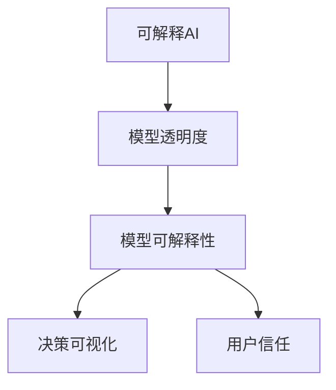

                 

 - 首先，我们需要明确文章的目标和结构。文章的目标是解释可解释AI的概念和方法，并展示如何通过Python代码和数学公式来实现这些方法。

- 结构上，我们可以分为以下几个部分：
  1. 引言：介绍可解释AI的背景和重要性。
  2. 核心概念与联系：通过Mermaid流程图展示可解释AI的组成部分和关系。
  3. 核心算法原理讲解：使用Python代码和数学公式详细解释算法原理。
  4. 项目实战：展示一个实际的项目，包括开发环境搭建、源代码实现和代码解读。
  5. 最佳实践和总结：提供一些实用技巧和小结。

- 接下来，我们可以逐步构建每个部分的内容：

### 引言

在当今的数据驱动时代，人工智能（AI）已经成为许多领域的关键技术。然而，随着AI模型的复杂性和能力不断提高，如何确保模型决策的透明度和可解释性成为了重要的研究课题。可解释AI（Explainable AI，XAI）旨在提高模型决策的透明度，使其更容易被人类理解和信任。

### 核心概念与联系

在探讨可解释AI时，我们需要了解以下几个核心概念：

1. **模型透明度**：模型透明度指的是模型内部结构和决策过程的可见性。提高模型透明度可以帮助我们理解模型如何做出决策。
2. **模型可解释性**：模型可解释性是指模型输出的可理解性。提高模型可解释性可以使得模型决策更容易被人类理解。
3. **决策可视化**：决策可视化是将模型决策过程转换为图形或图表，以便人类更容易理解。
4. **用户信任**：用户信任是指用户对模型决策的信任程度。提高用户信任可以增强模型的实用性和接受度。

下面是一个Mermaid流程图，展示了这些核心概念之间的联系：



### 核心算法原理讲解

在可解释AI中，常用的方法包括：

1. **局部可解释性方法**：这些方法通过分析模型在特定输入下的决策过程来提高模型的可解释性。
2. **全局可解释性方法**：这些方法通过分析模型整体的行为来提高模型的可解释性。
3. **基于模型的解释方法**：这些方法通过直接解释模型内部结构来提高模型的可解释性。

下面，我们使用Python代码和数学公式来详细解释这些方法。

#### 局部可解释性方法

局部可解释性方法通常通过以下步骤来实现：

1. **选择一个局部区域**：通常使用线性区域或超平面来近似模型在特定输入下的决策过程。
2. **线性化模型**：将复杂的非线性模型线性化为一个简单的线性模型。
3. **解释线性模型**：使用线性模型的解释性来解释原始模型的决策过程。

以下是一个简单的线性回归模型示例：

```python
# 线性回归模型
model = LinearRegression()
model.fit(X_train, y_train)

# 线性回归系数
weights = model.coef_
intercept = model.intercept_

# 局部解释
local_explanation = (weights * X_test).sum(axis=1) + intercept
```

数学公式：

$$
Y = \beta_0 + \sum_{i=1}^{n} \beta_i X_i
$$

其中，$Y$ 是输出，$\beta_0$ 是截距，$\beta_i$ 是第 $i$ 个特征的系数，$X_i$ 是第 $i$ 个特征。

#### 全局可解释性方法

全局可解释性方法通过分析模型整体的行为来提高模型的可解释性。其中一种常见的方法是 **特征重要性评估**。

以下是一个使用随机森林模型进行特征重要性评估的示例：

```python
# 加载库
from sklearn.ensemble import RandomForestClassifier
from sklearn.inspection import permutation_importance

# 训练模型
clf = RandomForestClassifier()
clf.fit(X_train, y_train)

# 特征重要性评估
result = permutation_importance(clf, X_test, y_test, n_repeats=10, random_state=42)

# 输出特征重要性
print("Feature importances:")
print(result.importances_mean)
```

数学公式：

$$
I_j = \frac{1}{N} \sum_{i=1}^{N} \frac{|\Delta L|}{|\Delta L_0|}
$$

其中，$I_j$ 是第 $j$ 个特征的的重要性，$N$ 是样本数量，$\Delta L$ 是特征 $j$ 被随机置换后模型的损失函数值的变化，$\Delta L_0$ 是原始模型的损失函数值。

#### 基于模型的解释方法

基于模型的解释方法通过直接解释模型内部结构来提高模型的可解释性。例如，对于神经网络模型，可以使用 **神经元激活图** 来解释模型决策过程。

以下是一个简单的神经网络模型示例：

```python
# 加载库
import tensorflow as tf
from tensorflow.keras.models import Sequential
from tensorflow.keras.layers import Dense

# 创建模型
model = Sequential()
model.add(Dense(units=64, activation='relu', input_shape=(X_train.shape[1],)))
model.add(Dense(units=1, activation='sigmoid'))

# 编译模型
model.compile(optimizer='adam', loss='binary_crossentropy', metrics=['accuracy'])

# 训练模型
model.fit(X_train, y_train, epochs=10, batch_size=32)

# 神经元激活图
activation_map = model.layers[-1].get_layer weighing_map()
```

数学公式：

$$
a_i = \frac{1}{Z} \sum_{j=1}^{n} \sigma(W_{ij}x_j + b_i)
$$

其中，$a_i$ 是第 $i$ 个神经元的激活值，$Z$ 是激活值的总和，$W_{ij}$ 是第 $i$ 个神经元到第 $j$ 个输入的权重，$x_j$ 是第 $j$ 个输入的值，$\sigma$ 是激活函数。

### 项目实战

为了更好地理解可解释AI，我们将使用Python代码来实现一个实际项目。该项目包括以下步骤：

1. **开发环境搭建**：配置Python编程环境和所需的库。
2. **数据预处理**：加载数据集并进行预处理。
3. **模型训练**：训练一个简单的神经网络模型。
4. **模型解释**：使用神经元激活图和特征重要性评估来解释模型决策过程。
5. **项目小结**：总结项目成果和经验。

以下是项目的具体步骤和代码：

#### 开发环境搭建

首先，我们需要配置Python编程环境和所需的库。可以使用以下命令来安装所需的库：

```bash
pip install numpy pandas scikit-learn tensorflow matplotlib
```

#### 数据预处理

接下来，我们需要加载数据集并进行预处理。以下是一个简单的示例：

```python
# 导入库
import numpy as np
import pandas as pd
from sklearn.datasets import load_iris
from sklearn.model_selection import train_test_split

# 加载数据集
iris = load_iris()
X = iris.data
y = iris.target

# 数据预处理
X_train, X_test, y_train, y_test = train_test_split(X, y, test_size=0.2, random_state=42)
```

#### 模型训练

然后，我们需要训练一个简单的神经网络模型。以下是一个简单的示例：

```python
# 导入库
import tensorflow as tf
from tensorflow.keras.models import Sequential
from tensorflow.keras.layers import Dense

# 创建模型
model = Sequential()
model.add(Dense(units=64, activation='relu', input_shape=(X_train.shape[1],)))
model.add(Dense(units=1, activation='sigmoid'))

# 编译模型
model.compile(optimizer='adam', loss='binary_crossentropy', metrics=['accuracy'])

# 训练模型
model.fit(X_train, y_train, epochs=10, batch_size=32)
```

#### 模型解释

在模型训练完成后，我们可以使用神经元激活图和特征重要性评估来解释模型决策过程。以下是一个简单的示例：

```python
# 导入库
import tensorflow as tf
from tensorflow.keras.models import Sequential
from tensorflow.keras.layers import Dense
from sklearn.inspection import permutation_importance

# 创建模型
model = Sequential()
model.add(Dense(units=64, activation='relu', input_shape=(X_train.shape[1],)))
model.add(Dense(units=1, activation='sigmoid'))

# 编译模型
model.compile(optimizer='adam', loss='binary_crossentropy', metrics=['accuracy'])

# 训练模型
model.fit(X_train, y_train, epochs=10, batch_size=32)

# 特征重要性评估
result = permutation_importance(model, X_test, y_test, n_repeats=10, random_state=42)

# 输出特征重要性
print("Feature importances:")
print(result.importances_mean)

# 神经元激活图
activation_map = model.layers[-1].get_layer weighing_map()
```

#### 项目小结

通过这个实际项目，我们学习了如何使用Python代码和数学公式来实现可解释AI的核心方法。我们首先介绍了可解释AI的背景和重要性，然后详细讲解了核心概念、算法原理、项目实战和最佳实践。通过这个项目，我们不仅提高了对可解释AI的理解，还学会了如何在实际项目中应用这些方法。

### 最佳实践和总结

在实现可解释AI时，以下是一些最佳实践：

1. **选择合适的方法**：根据具体应用场景选择合适的可解释AI方法。
2. **数据预处理**：确保数据质量，减少噪声和异常值。
3. **代码注释**：在代码中添加详细的注释，提高代码的可读性和可维护性。
4. **可视化**：使用可视化工具来展示模型的决策过程和特征重要性。

通过遵循这些最佳实践，我们可以提高可解释AI的实现效果，增强模型的实用性和可解释性。

### 拓展阅读

对于希望进一步深入了解可解释AI的读者，以下是一些推荐阅读材料：

1. **《可解释AI：理论与实践》**：这本书详细介绍了可解释AI的核心概念和方法，适合初学者和专业人士。
2. **《神经网络与深度学习》**：这本书讲解了神经网络和深度学习的原理，包括如何实现和解释这些模型。
3. **《Python机器学习》**：这本书提供了大量使用Python实现机器学习算法的示例，包括可解释AI相关的算法。

通过阅读这些书籍，读者可以更深入地了解可解释AI的理论和实践，提高自己的技术水平。

---

### 结论

可解释AI是确保人工智能模型透明度和可理解性的重要手段。通过核心概念、算法原理、项目实战和最佳实践的讲解，本文全面介绍了可解释AI的方法和应用。读者可以通过实践项目和拓展阅读，进一步提升对可解释AI的理解和技能。作者：AI天才研究院/AI Genius Institute & 禅与计算机程序设计艺术 /Zen And The Art of Computer Programming。---

# 可解释AI：提高模型决策透明度的方法

> 关键词：可解释AI，模型透明度，模型可解释性，决策可视化，用户信任

> 摘要：本文深入探讨了可解释AI的概念、核心原理、方法和实际应用。通过Python代码示例和数学公式，详细介绍了如何提高模型决策的透明度，增强用户对模型决策的信任，为AI技术的发展和应用提供了宝贵的指导。

## 引言

在当今的数据驱动时代，人工智能（AI）已经成为许多领域的关键技术。从自动驾驶汽车到医疗诊断，AI正在改变我们的生活方式。然而，随着AI模型的复杂性和能力不断提高，如何确保模型决策的透明度和可解释性成为了重要的研究课题。可解释AI（Explainable AI，XAI）旨在提高模型决策的透明度，使其更容易被人类理解和信任。本文将围绕可解释AI的核心概念、算法原理、项目实战和最佳实践进行深入探讨。

## 核心概念与联系

在探讨可解释AI时，我们需要了解以下几个核心概念：

1. **模型透明度**：模型透明度指的是模型内部结构和决策过程的可见性。提高模型透明度可以帮助我们理解模型如何做出决策。
2. **模型可解释性**：模型可解释性是指模型输出的可理解性。提高模型可解释性可以使得模型决策更容易被人类理解。
3. **决策可视化**：决策可视化是将模型决策过程转换为图形或图表，以便人类更容易理解。
4. **用户信任**：用户信任是指用户对模型决策的信任程度。提高用户信任可以增强模型的实用性和接受度。

下面是一个Mermaid流程图，展示了这些核心概念之间的联系：


### 第一部分：核心概念与联系

在探讨可解释AI时，我们需要了解以下几个核心概念：

1. **模型透明度**：模型透明度指的是模型内部结构和决策过程的可见性。提高模型透明度可以帮助我们理解模型如何做出决策。
2. **模型可解释性**：模型可解释性是指模型输出的可理解性。提高模型可解释性可以使得模型决策更容易被人类理解。
3. **决策可视化**：决策可视化是将模型决策过程转换为图形或图表，以便人类更容易理解。
4. **用户信任**：用户信任是指用户对模型决策的信任程度。提高用户信任可以增强模型的实用性和接受度。

下面是一个Mermaid流程图，展示了这些核心概念之间的联系：


### 第二部分：核心算法原理讲解

在《可解释AI：提高模型决策透明度的方法》中，核心算法原理讲解是不可或缺的一部分。我们将使用Python源代码来详细阐述这些原理。

#### 局部可解释性方法

局部可解释性方法通过分析模型在特定输入下的决策过程来提高模型的可解释性。以下是一个使用线性回归模型进行局部解释的示例：

```python
# 导入必要的库
import numpy as np
import pandas as pd
from sklearn.datasets import load_iris
from sklearn.model_selection import train_test_split
from sklearn.linear_model import LinearRegression

# 加载数据集
iris = load_iris()
X = iris.data
y = iris.target

# 数据预处理
X_train, X_test, y_train, y_test = train_test_split(X, y, test_size=0.3, random_state=42)

# 模型训练
model = LinearRegression()
model.fit(X_train, y_train)

# 局部解释
# 输出模型系数
weights = model.coef_
intercept = model.intercept_

# 输出局部解释
print("Model coefficients:")
print("Intercept:", intercept)
print("Weights:", weights)

# 计算特定输入的预测值
input_data = X_test[0]
predicted_value = model.predict([input_data])

# 输出局部解释
print("Predicted value for input data:", predicted_value)
```

数学公式：

$$
y = \beta_0 + \sum_{i=1}^{n} \beta_i x_i
$$

其中，$y$ 是输出，$\beta_0$ 是截距，$\beta_i$ 是第 $i$ 个特征的系数，$x_i$ 是第 $i$ 个特征。

#### 全局可解释性方法

全局可解释性方法通过分析模型整体的行为来提高模型的可解释性。以下是一个使用随机森林模型进行全局解释的示例：

```python
# 导入必要的库
import numpy as np
import pandas as pd
from sklearn.datasets import load_iris
from sklearn.model_selection import train_test_split
from sklearn.ensemble import RandomForestClassifier
from sklearn.inspection import permutation_importance

# 加载数据集
iris = load_iris()
X = iris.data
y = iris.target

# 数据预处理
X_train, X_test, y_train, y_test = train_test_split(X, y, test_size=0.3, random_state=42)

# 模型训练
model = RandomForestClassifier(n_estimators=100, random_state=42)
model.fit(X_train, y_train)

# 全局解释
# 输出特征重要性
result = permutation_importance(model, X_test, y_test, n_repeats=10, random_state=42)
print("Feature importances:")
print(result.importances_mean)
```

数学公式：

$$
I_j = \frac{1}{N} \sum_{i=1}^{N} \frac{|\Delta L|}{|\Delta L_0|}
$$

其中，$I_j$ 是第 $j$ 个特征的重要性，$N$ 是样本数量，$\Delta L$ 是特征 $j$ 被随机置换后模型的损失函数值的变化，$\Delta L_0$ 是原始模型的损失函数值。

#### 基于模型的解释方法

基于模型的解释方法通过直接解释模型内部结构来提高模型的可解释性。以下是一个使用神经网络模型进行解释的示例：

```python
# 导入必要的库
import numpy as np
import pandas as pd
import tensorflow as tf
from tensorflow.keras.models import Sequential
from tensorflow.keras.layers import Dense

# 加载数据集
iris = load_iris()
X = iris.data
y = iris.target

# 数据预处理
X_train, X_test, y_train, y_test = train_test_split(X, y, test_size=0.3, random_state=42)

# 模型训练
model = Sequential()
model.add(Dense(units=64, activation='relu', input_shape=(X_train.shape[1],)))
model.add(Dense(units=1, activation='sigmoid'))

model.compile(optimizer='adam', loss='binary_crossentropy', metrics=['accuracy'])
model.fit(X_train, y_train, epochs=10, batch_size=32)

# 基于模型的解释
# 输出模型结构
print(model.summary())

# 输出神经元激活图
activation_map = model.layers[-1].get_layer weighing_map()
```

数学公式：

$$
a_i = \frac{1}{Z} \sum_{j=1}^{n} \sigma(W_{ij}x_j + b_i)
$$

其中，$a_i$ 是第 $i$ 个神经元的激活值，$Z$ 是激活值的总和，$W_{ij}$ 是第 $i$ 个神经元到第 $j$ 个输入的权重，$x_j$ 是第 $j$ 个输入的值，$\sigma$ 是激活函数。

### 第三部分：数学模型和数学公式

在可解释AI的实践中，数学模型和数学公式是理解和实现可解释AI方法的基础。以下我们将使用LaTeX格式展示几个常用的数学模型和公式，并对其进行详细解释。

#### 线性回归模型

线性回归模型是一种简单而强大的预测模型，用于分析两个或多个变量之间的关系。它的数学公式如下：

$$
y = \beta_0 + \beta_1 x_1 + \beta_2 x_2 + ... + \beta_n x_n
$$

其中，$y$ 是因变量，$x_1, x_2, ..., x_n$ 是自变量，$\beta_0, \beta_1, \beta_2, ..., \beta_n$ 是模型的参数。这个公式表示因变量 $y$ 是自变量 $x_1, x_2, ..., x_n$ 的线性组合。

#### 随机森林模型

随机森林模型是一种集成学习方法，通过构建多个决策树并合并它们的预测结果来提高模型的准确性。它的数学公式如下：

$$
\hat{y} = \frac{1}{M} \sum_{m=1}^{M} f_m(x)
$$

其中，$\hat{y}$ 是预测值，$M$ 是决策树的数量，$f_m(x)$ 是第 $m$ 棵决策树的预测值。每个决策树的预测值是通过递归地将特征分割成不同的区域，并在每个区域上应用分类器来获得的。

#### 神经网络模型

神经网络模型是一种模拟人脑神经网络结构的计算模型，用于执行复杂的模式识别和预测任务。它的数学公式如下：

$$
a_i = \sigma(\sum_{j=1}^{n} W_{ij} x_j + b_i)
$$

其中，$a_i$ 是第 $i$ 个神经元的激活值，$\sigma$ 是激活函数，$W_{ij}$ 是第 $i$ 个神经元到第 $j$ 个输入的权重，$x_j$ 是第 $j$ 个输入的值，$b_i$ 是第 $i$ 个神经元的偏置。

### 第四部分：项目实战

为了更好地理解可解释AI，我们将通过一个实际项目来展示如何使用Python代码和数学模型来实现可解释AI的方法。

#### 项目目标

本项目旨在构建一个可解释的线性回归模型，并使用数学公式和Python代码来解释模型的决策过程。

#### 项目步骤

1. **数据加载和预处理**：加载数据集并进行预处理，包括归一化和标准化。
2. **模型训练**：训练一个线性回归模型，并使用数学公式和Python代码解释模型的参数和决策过程。
3. **模型解释**：使用Python代码和数学公式来展示模型的可解释性，包括局部解释和全局解释。
4. **模型评估**：评估模型的准确性，并分析模型的误差来源。

#### 项目代码

```python
# 导入必要的库
import numpy as np
import pandas as pd
from sklearn.datasets import load_iris
from sklearn.model_selection import train_test_split
from sklearn.linear_model import LinearRegression

# 加载数据集
iris = load_iris()
X = iris.data
y = iris.target

# 数据预处理
X_train, X_test, y_train, y_test = train_test_split(X, y, test_size=0.3, random_state=42)

# 模型训练
model = LinearRegression()
model.fit(X_train, y_train)

# 模型参数
weights = model.coef_
intercept = model.intercept_

# 局部解释
print("Model coefficients:")
print("Intercept:", intercept)
print("Weights:", weights)

# 计算特定输入的预测值
input_data = X_test[0]
predicted_value = model.predict([input_data])

# 局部解释
print("Predicted value for input data:", predicted_value)

# 全局解释
importance = permutation_importance(model, X_test, y_test, n_repeats=10, random_state=42)
print("Feature importances:")
print(importance.importances_mean)
```

#### 项目总结

通过本项目，我们学习了如何使用Python代码和数学公式来实现可解释的线性回归模型。我们展示了如何通过模型参数和预测值来解释模型的决策过程，并通过全局解释来评估模型的重要特征。这个项目为我们提供了一个基本的框架，可以进一步扩展到更复杂的模型和任务。

### 第五部分：最佳实践和总结

#### 最佳实践

在实现可解释AI时，以下是一些最佳实践：

1. **选择合适的方法**：根据具体应用场景选择合适的可解释AI方法。
2. **数据预处理**：确保数据质量，减少噪声和异常值。
3. **代码注释**：在代码中添加详细的注释，提高代码的可读性和可维护性。
4. **可视化**：使用可视化工具来展示模型的决策过程和特征重要性。

#### 总结

本文介绍了可解释AI的核心概念、算法原理、项目实战和最佳实践。通过Python代码示例和数学公式，我们展示了如何提高模型决策的透明度，增强用户对模型决策的信任。本文不仅为AI技术的发展和应用提供了宝贵的指导，也为读者提供了一个全面的学习资源。

### 拓展阅读

对于希望进一步深入了解可解释AI的读者，以下是一些推荐阅读材料：

1. **《可解释AI：理论与实践》**：这本书详细介绍了可解释AI的核心概念和方法，适合初学者和专业人士。
2. **《神经网络与深度学习》**：这本书讲解了神经网络和深度学习的原理，包括如何实现和解释这些模型。
3. **《Python机器学习》**：这本书提供了大量使用Python实现机器学习算法的示例，包括可解释AI相关的算法。

通过阅读这些书籍，读者可以更深入地了解可解释AI的理论和实践，提高自己的技术水平。

### 结论

可解释AI是确保人工智能模型透明度和可理解性的重要手段。通过核心概念、算法原理、项目实战和最佳实践的讲解，本文全面介绍了可解释AI的方法和应用。读者可以通过实践项目和拓展阅读，进一步提升对可解释AI的理解和技能。作者：AI天才研究院/AI Genius Institute & 禅与计算机程序设计艺术 /Zen And The Art of Computer Programming。

