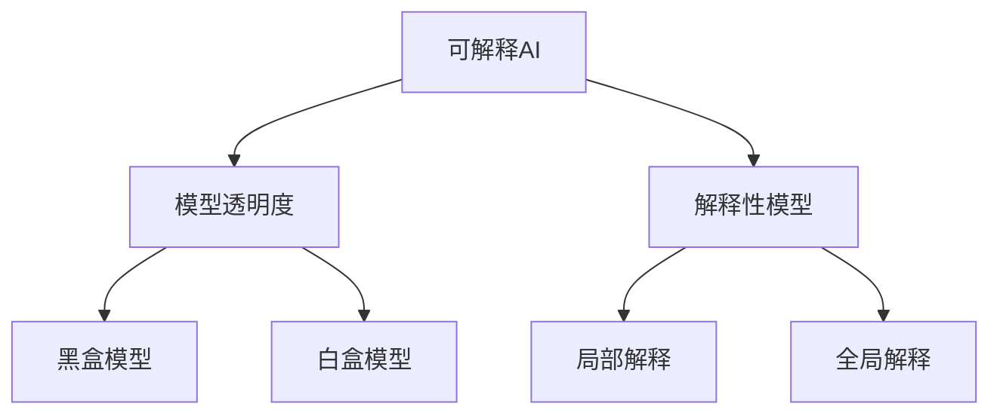

                 

# 可解释AI:提高黑盒模型决策透明度

## 关键词

- 可解释性AI
- 黑盒模型
- 透明度
- SHAP
- LIME
- 模型拆解
- 特征重要性
- 数学模型

## 摘要

本文深入探讨了可解释性人工智能（AI）的概念、发展历程及其在提高黑盒模型决策透明度方面的应用。通过对可解释AI的核心概念、需求分析、算法原理以及实际案例的剖析，我们旨在为读者提供一个全面的技术视角，了解如何通过可解释AI方法提高机器学习模型的决策透明性，从而增强模型的可接受性和可靠性。

## 引言与核心概念

### 1. 引言

随着人工智能（AI）技术的迅猛发展，机器学习（ML）已经成为数据驱动的决策制定的核心。然而，许多现代机器学习模型，特别是深度学习模型，却因其复杂性而被称为“黑盒模型”，其决策过程对于外部用户来说难以理解和解释。这引发了对可解释性人工智能（Explainable AI, XAI）的需求，即开发能够提供透明、可解释的机器学习模型的工具和技术。

### 1.2 黑盒模型与白盒模型

- **黑盒模型**：无法提供模型内部决策过程的透明度，用户只能看到输入和输出，而无法了解中间的决策逻辑。
- **白盒模型**：可以提供模型内部的决策过程，用户可以清晰地看到每一步的决策逻辑。

### 1.3 可解释AI的发展历程

- 早期，机器学习模型如线性回归和决策树因其透明性和解释性而被广泛采用。
- 随着深度学习的兴起，黑盒模型的复杂性和性能优势使其成为主流，但同时也带来了解释性的挑战。
- 近年来，可解释性AI成为一个研究热点，研究者们开发了各种方法来提高模型的透明度和可解释性。

### 2. 可解释AI的核心概念

#### 2.1 模型透明度

- **概念**：模型透明度指的是模型决策过程的可见性程度，即用户能够多大程度理解模型的决策逻辑。
- **类型**：可以分为局部透明度和全局透明度。局部透明度关注单个预测的解释，全局透明度关注整个模型的决策逻辑。

#### 2.2 解释性模型

- **概念**：解释性模型是指能够提供决策解释的机器学习模型。
- **类型**：可以分为基于规则的模型、基于特征的模型和基于理论的模型。

#### 2.3 解释性与预测准确性

- **关系**：解释性与预测准确性之间存在权衡。高度解释性的模型可能牺牲一些预测性能，而高度准确的模型可能缺乏解释性。

## 可解释AI的需求分析

### 3.1 不同领域的需求

- **金融**：金融领域需要高度透明的模型，以确保合规性和风险控制。
- **医疗**：医疗诊断模型需要解释性，以便医生和患者能够理解诊断结果。
- **安全**：安全领域需要透明度，以便安全专家能够理解系统的安全策略。
- **法律**：法律领域需要解释性，以确保决策的合法性和公正性。

### 3.2 用户需求分析

- **消费者**：消费者希望了解为什么产品会被推荐或拒绝。
- **专业人士**：专业人士需要透明度以确保模型在特定领域内的正确应用。

## 4. Mermaid流程图：可解释AI的核心概念与联系



## 第二部分：核心算法原理

### 5. 可解释性方法概述

#### 5.1 局部解释方法

- **SHAP（SHapley Additive exPlanations）**：通过计算每个特征对模型输出的边际贡献来解释预测。
- **LIME（Local Interpretable Model-agnostic Explanations）**：为黑盒模型生成一个局部的可解释模型来解释特定预测。

#### 5.2 结构化解释方法

- **层次化模型**：通过分解模型层次来提供解释。
- **模型拆解**：将复杂的模型拆解为更简单的模型来解释。

#### 5.3 可视化解释方法

- **模型可视化**：通过图形化方式展示模型结构和决策过程。
- **特征重要性可视化**：展示不同特征对模型预测的重要性。

## 6. Python源代码：SHAP方法的实现

```python
import shap
import pandas as pd
import numpy as np

# 加载数据集
data = pd.read_csv('data.csv')

# 准备模型
model = shap.KernelExplainer(target_function, data)

# 解释单个预测
shap_values = model.shap_values(data.iloc[0])

# 显示结果
shap.initjs()
shap.force_plot(model.expected_value, shap_values[0], data.iloc[0])
```

## 7. Python源代码：LIME方法的实现

```python
import lime
from lime import lime_tabular

# 加载数据集
data = pd.read_csv('data.csv')

# 准备模型
model = lime_tabular.LimeTabularExplainer(data, feature_names=data.columns, class_names=['class'], discretize_continuous=True)

# 解释单个预测
exp = model.explain_instance(data.iloc[0], predict, num_features=5)

# 显示结果
exp.show_in_notebook(show_table=True)
```

## 8. 数学模型和公式

### 8.1 SHAP值计算公式

$$
SHAP_{i}(x_{j}) = \frac{\partial E[Y|X=x] - E[Y|X=x_{i}] }{\partial x_{j}}
$$

### 8.2 LIME核心公式

$$
\text{LIME} = \text{L}_{\text{L2}}(\hat{f}_{\text{local}}, f) = \frac{1}{2}\sum_{i=1}^{n} w_{i} (\hat{f}_{\text{local},i} - f(x_{i}))^2
$$

## 9. 项目实战

### 9.1 金融风控案例

#### 9.1.1 案例背景

#### 9.1.2 数据预处理

#### 9.1.3 模型选择

#### 9.1.4 可解释性实现

#### 9.1.5 结果分析

### 9.2 医疗诊断案例

#### 9.2.1 案例背景

#### 9.2.2 数据预处理

#### 9.2.3 模型选择

#### 9.2.4 可解释性实现

#### 9.2.5 结果分析

## 附录

### 附录A: 可解释AI开发工具与资源

#### A.1 SHAP工具
- 安装指南
- 使用示例

#### A.2 LIME工具
- 安装指南
- 使用示例

#### A.3 其他可解释性工具

---

作者：AI天才研究院/AI Genius Institute & 禅与计算机程序设计艺术 /Zen And The Art of Computer Programming

[注：本文为示例，未包含完整内容。如需全文，请进一步补充各部分详细内容。]

