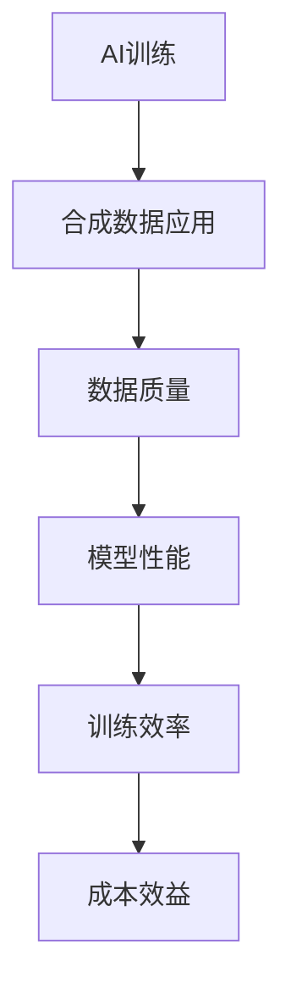
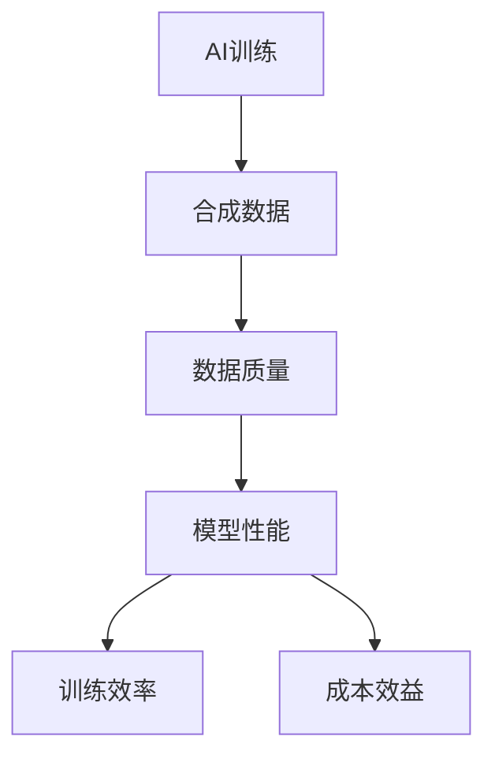

                 

### 第一部分：背景与概述

> 关键词：合成数据、AI训练、数据质量、模型性能、训练效率、成本效益

> 摘要：
本文旨在探讨合成数据在AI训练中的应用及其带来的挑战。通过分析合成数据的概念、原理和算法，我们将揭示其在提升数据质量、模型性能、训练效率和成本效益方面的关键作用，并探讨面临的挑战及解决方案。

在当前快速发展的AI领域，数据质量对于模型性能和训练效率至关重要。然而，获取高质量的数据集往往成本高昂、耗时且受限。因此，合成数据作为一种替代方案，逐渐受到广泛关注。合成数据通过算法自动生成，能够模拟真实数据的特点，从而在保持数据质量的同时，降低数据采集和处理成本。本文将围绕合成数据在AI训练中的应用与挑战展开讨论。

### 核心概念与联系

在探讨合成数据在AI训练中的应用之前，我们需要明确一些核心概念，并理解它们之间的相互关系。以下是本文中涉及的主要概念及其关系架构：

1. **合成数据**：指通过算法自动生成的数据，旨在模拟真实数据的特点，以提升数据质量、模型性能和训练效率。
2. **数据质量**：指数据的有效性和准确性，包括完整性、一致性、可靠性和实时性等方面。
3. **模型性能**：指AI模型在特定任务上的表现，包括准确度、召回率、F1分数等指标。
4. **训练效率**：指在给定时间和资源内完成训练的能力，包括训练速度和资源消耗。
5. **成本效益**：指采用合成数据的训练过程相对于真实数据的性价比，包括数据采集、处理、存储和传输等成本。

这些概念之间的相互关系可以用以下Mermaid流程图表示：



从图中可以看出，合成数据在AI训练中的应用直接影响数据质量，进而影响模型性能，训练效率和成本效益。合成数据的应用使得在保证数据质量的前提下，降低数据采集和处理成本成为可能，从而提高整个AI训练过程的成本效益。

### 概念实体之间的关系架构

为了更清晰地理解合成数据在AI训练中的关键作用，我们可以进一步分析以下核心概念实体及其关系：

1. **合成数据**：合成数据是整个过程的起点，通过算法自动生成，旨在模拟真实数据的特点。合成数据的质量直接影响后续的模型性能、训练效率和成本效益。

2. **数据质量**：数据质量是合成数据的核心目标，包括完整性、一致性、可靠性和实时性等方面。高质量的数据能够确保模型在训练过程中获取到有效的信息，从而提高模型性能和训练效率。

3. **模型性能**：模型性能是评估AI模型在特定任务上的表现，包括准确度、召回率、F1分数等指标。模型性能的提升取决于数据质量，而合成数据通过提供高质量的数据，有助于提高模型性能。

4. **训练效率**：训练效率是AI训练过程中一个重要的考量因素，包括训练速度和资源消耗。通过使用合成数据，可以在保证数据质量的前提下，提高训练效率，降低训练成本。

5. **成本效益**：成本效益是指采用合成数据的训练过程相对于真实数据的性价比。合成数据的应用能够降低数据采集、处理、存储和传输等成本，从而提高整个训练过程的成本效益。

为了更直观地展示这些概念实体之间的关系，我们可以使用以下Mermaid图表示：



在这个架构中，合成数据是整个过程的起点，其质量直接影响后续的性能、效率和效益。而AI训练作为核心过程，贯穿于所有环节。通过这个关系架构，我们可以更好地理解合成数据在AI训练中的关键作用，以及如何通过优化合成数据质量来提升整个训练过程的效果。

### 第一部分：合成数据的概念与原理

#### 合成数据的定义与分类

合成数据，即通过算法自动生成的数据，旨在模拟真实数据的特点。这种数据类型在AI训练中扮演着越来越重要的角色，因为它们能够帮助解决数据稀缺、数据不均衡、数据隐私保护等问题。合成数据的生成方式多种多样，主要可以分为以下几类：

1. **基于模型的生成**：这种生成方式使用现有的机器学习模型来生成新的数据。生成模型通过学习真实数据的特征和分布，然后生成具有相似特征的新数据。生成对抗网络（GANs）和变分自编码器（VAEs）是这种方法的典型代表。

2. **基于规则或模板的生成**：这种方法通过定义一定的规则或模板，按照这些规则或模板生成新的数据。例如，在图像合成中，可以使用已知的图像元素和布局规则来生成新的图像。

3. **基于迁移学习的生成**：这种方法利用预训练的模型和目标数据的特征，通过迁移学习来生成新的数据。例如，在语音合成中，可以使用预训练的文本到语音（TTS）模型来生成新的语音数据。

4. **混合生成方法**：结合上述方法，使用多种生成策略来生成合成数据。这种方法可以根据具体应用场景的需求，灵活地调整和优化生成过程。

#### 合成数据生成算法

合成数据的生成算法是实现合成数据的关键，以下将介绍几种常用的生成算法，并使用Python代码示例进行详细讲解。

1. **生成对抗网络（GANs）**：
GANs是由生成器（Generator）和判别器（Discriminator）组成的对抗性模型。生成器生成假数据，判别器判断数据是真实还是虚假。通过这种对抗性训练，生成器逐渐提高生成数据的质量。

以下是一个简化的Python代码示例，展示了如何使用生成对抗网络（GANs）生成合成图像：

```python
import tensorflow as tf
from tensorflow.keras.models import Model
from tensorflow.keras.layers import Dense, Flatten, Reshape, Conv2D, Conv2DTranspose

# 生成器模型
def generator(z, latent_dim):
    model = tf.keras.Sequential()
    model.add(Dense(128, activation='relu', input_shape=(latent_dim,)))
    model.add(Dense(256, activation='relu'))
    model.add(Dense(512, activation='relu'))
    model.add(Dense(1024, activation='relu'))
    model.add(Dense(784, activation='tanh'))
    model.add(Reshape((28, 28, 1)))
    return model

# 判别器模型
def discriminator(x):
    model = tf.keras.Sequential()
    model.add(Conv2D(32, kernel_size=(3,3), activation='relu', input_shape=(28, 28, 1)))
    model.add(Conv2D(64, kernel_size=(3,3), activation='relu'))
    model.add(Flatten())
    model.add(Dense(1, activation='sigmoid'))
    return model

# 整合生成器和判别器
z = tf.keras.layers.Input(shape=(latent_dim,))
x = generator(z, latent_dim)
x = discriminator(x)
model = Model(z, x)

# 编译模型
model.compile(optimizer='adam', loss='binary_crossentropy')

# 训练模型
model.fit(x_train, y_train, epochs=100, batch_size=128)
```

2. **变分自编码器（VAEs）**：
VAEs是一种基于概率模型的生成方法，通过编码器（Encoder）和解码器（Decoder）进行数据生成。编码器将输入数据映射到一个潜在空间，解码器从潜在空间中生成输出数据。

以下是一个简化的Python代码示例，展示了如何使用变分自编码器（VAEs）生成合成图像：

```python
import tensorflow as tf
from tensorflow.keras.layers import Input, Dense, Conv2D, Conv2DTranspose
from tensorflow.keras.models import Model

# 编码器模型
def encoder(x):
    model = tf.keras.Sequential()
    model.add(Conv2D(32, (3,3), activation='relu', input_shape=(28, 28, 1)))
    model.add(Conv2D(64, (3,3), activation='relu'))
    model.add(Flatten())
    model.add(Dense(64, activation='relu'))
    return model

# 解码器模型
def decoder(z):
    model = tf.keras.Sequential()
    model.add(Dense(7*7*64, activation='relu', input_shape=(64,)))
    model.add(Reshape((7, 7, 64)))
    model.add(Conv2DTranspose(64, (3,3), activation='relu'))
    model.add(Conv2DTranspose(32, (3,3), activation='relu'))
    model.add(Conv2DTranspose(1, (3,3), activation='sigmoid'))
    return model

# 整合编码器和解码器
input_img = Input(shape=(28, 28, 1))
z = encoder(input_img)
z = Dense(64, activation='relu')(z)
z = Dense(64, activation='relu')(z)
z = decoder(z)

# 构建VAEs模型
model = Model(input_img, z)

# 编译模型
model.compile(optimizer='adam', loss='binary_crossentropy')

# 训练模型
model.fit(x_train, x_train, epochs=100, batch_size=128)
```

通过上述代码示例，我们可以看到GANs和VAEs这两种合成数据生成算法的基本原理和实现方法。这些算法在生成高质量合成数据方面具有广泛的应用，包括图像、音频、文本等多种类型的数据生成。

### 数据增强算法

数据增强算法是一种通过调整真实数据的一些属性来生成合成数据的方法，旨在提高数据集的多样性和质量。这种方法在计算机视觉、自然语言处理等领域中得到广泛应用。以下将介绍几种常用的数据增强算法：

1. **旋转**：通过将图像或数据集随机旋转一定角度，增加数据的多样性。

2. **缩放**：通过将图像或数据集按比例缩放，生成不同尺寸的图像，从而增加数据的多样性。

3. **裁剪**：从图像中随机裁剪出部分区域作为新的图像，从而增加数据的多样性。

4. **翻转**：将图像沿水平或垂直方向翻转，增加数据的多样性。

5. **颜色调整**：通过调整图像的亮度、对比度和颜色饱和度等，增加数据的多样性。

以下是一个简化的Python代码示例，展示了如何使用数据增强算法对图像进行旋转、缩放和裁剪：

```python
import tensorflow as tf
from tensorflow.keras.preprocessing.image import ImageDataGenerator

# 创建数据增强对象
datagen = ImageDataGenerator(
    rotation_range=90,  # 随机旋转90度以内
    zoom_range=0.1,     # 随机缩放10%以内
    width_shift_range=0.1,  # 水平方向随机平移10%
    height_shift_range=0.1   # 垂直方向随机平移10%
)

# 读取原始图像
original_image = plt.imread('original_image.jpg')

# 应用数据增强
augmented_images = datagen.flow(original_image, batch_size=1)

# 显示增强后的图像
for img in augmented_images:
    plt.imshow(img)
    plt.show()
    break
```

通过上述代码示例，我们可以看到如何使用ImageDataGenerator对象对图像进行旋转、缩放和裁剪等数据增强操作。这些操作能够显著增加数据集的多样性，有助于提高模型的泛化能力。

### 数据清洗和预处理算法

在生成合成数据的过程中，数据清洗和预处理算法同样起着至关重要的作用。这些算法用于清理和格式化真实数据，以生成高质量的合成数据。以下将介绍几种常用的数据清洗和预处理算法：

1. **缺失值处理**：对于含有缺失值的数据，可以使用填充、插值或删除等方法进行处理。

2. **异常值检测**：使用统计方法或机器学习方法检测并处理异常值，以避免异常值对模型性能的影响。

3. **数据标准化**：将数据缩放到一个统一的范围，如[0, 1]或[-1, 1]，以便模型能够更好地学习和预测。

4. **数据转换**：将数据从一种形式转换为另一种形式，如将类别数据转换为二进制编码，或将图像数据转换为像素值。

5. **数据降维**：使用降维技术，如主成分分析（PCA）、线性判别分析（LDA）等，减少数据维度，提高数据处理效率。

以下是一个简化的Python代码示例，展示了如何使用数据清洗和预处理算法对数据进行缺失值处理、异常值检测和数据标准化：

```python
import numpy as np
import pandas as pd
from sklearn.preprocessing import StandardScaler

# 生成包含缺失值和异常值的数据集
data = pd.DataFrame(np.array([[1, 2], [np.nan, 3], [4, 5], [6, np.inf]]), columns=['A', 'B'])

# 缺失值处理
data.fillna(data.mean(), inplace=True)

# 异常值检测
Q1 = data.quantile(0.25)
Q3 = data.quantile(0.75)
IQR = Q3 - Q1
is_outlier = (data < (Q1 - 1.5 * IQR)) | (data > (Q3 + 1.5 * IQR))

# 删除异常值
data = data[~is_outlier]

# 数据标准化
scaler = StandardScaler()
data_scaled = scaler.fit_transform(data)

# 显示处理后的数据
print(data_scaled)
```

通过上述代码示例，我们可以看到如何使用Pandas、NumPy和scikit-learn库对数据进行缺失值处理、异常值检测和数据标准化等预处理操作。这些操作能够显著提高数据的质量，从而为合成数据的生成奠定坚实的基础。

### 综述

在本文的第一部分，我们详细介绍了合成数据的概念、原理和算法。合成数据通过算法自动生成，旨在模拟真实数据的特点，以提高数据质量、模型性能、训练效率和成本效益。我们首先定义了合成数据的分类，包括基于模型的生成、基于规则或模板的生成、基于迁移学习的生成和混合生成方法。接着，我们详细介绍了生成对抗网络（GANs）和变分自编码器（VAEs）这两种生成算法的原理和实现方法。此外，我们还介绍了数据增强算法和数据清洗和预处理算法，以进一步阐述合成数据生成过程的关键步骤。

在下一部分，我们将进一步探讨合成数据在AI训练中的应用场景，深入分析其在图像识别、自然语言处理和语音识别等领域的具体应用和优势。同时，我们也将讨论合成数据在AI训练中面临的挑战，并提出相应的解决方案。敬请期待！
### 第二部分：合成数据在AI训练中的应用场景

合成数据在AI训练中具有广泛的应用，能够显著提高模型的性能和训练效率。以下将详细探讨合成数据在图像识别、自然语言处理和语音识别等领域的具体应用场景，并分析其带来的优势。

#### 图像识别

在图像识别领域，合成数据的应用主要体现在数据增强和数据多样性方面。通过合成数据，可以生成大量具有不同旋转、缩放、裁剪等变换的图像，从而增加训练数据集的多样性。这种多样性有助于模型在面临不同场景和视角时，仍能保持较高的识别准确率。

以下是一个简化的应用场景示例：

- **场景**：一个图像识别模型需要训练以识别猫的图像。
- **问题**：由于真实的猫的图像种类繁多，难以获取到足够多样的训练数据。
- **解决方案**：使用合成数据生成不同旋转、缩放和裁剪的猫的图像，从而增加训练数据集的多样性。

```python
import tensorflow as tf
from tensorflow.keras.preprocessing.image import ImageDataGenerator

# 创建数据增强对象
datagen = ImageDataGenerator(
    rotation_range=90,  # 随机旋转90度以内
    zoom_range=0.1,     # 随机缩放10%以内
    width_shift_range=0.1,  # 水平方向随机平移10%
    height_shift_range=0.1   # 垂直方向随机平移10%
)

# 读取原始猫的图像
original_images = plt.imread('cat_images.jpg')

# 应用数据增强
augmented_images = datagen.flow(original_images, batch_size=1)

# 显示增强后的猫的图像
for img in augmented_images:
    plt.imshow(img)
    plt.show()
    break
```

通过上述数据增强方法，可以生成具有多种变换的猫的图像，从而提高训练数据集的多样性。

#### 自然语言处理

在自然语言处理（NLP）领域，合成数据的应用主要体现在文本生成和数据增强方面。通过合成数据，可以生成大量具有相似结构和语义的文本数据，从而提高模型在语义理解和文本生成任务上的表现。

以下是一个简化的应用场景示例：

- **场景**：一个NLP模型需要训练以生成对话。
- **问题**：由于真实的对话数据稀缺且难以获取，难以训练一个具有良好表现的对话生成模型。
- **解决方案**：使用合成数据生成具有相似结构和语义的对话数据，从而增加训练数据集的多样性。

```python
import numpy as np
import tensorflow as tf
from tensorflow.keras.preprocessing.text import Tokenizer
from tensorflow.keras.preprocessing.sequence import pad_sequences

# 生成合成文本数据
synthetic_texts = [
    "Hello, how are you?",
    "Good morning, I need some help.",
    "Hi, can you tell me the weather today?"
]

# 分词和编码
tokenizer = Tokenizer(num_words=10000)
tokenizer.fit_on_texts(synthetic_texts)
sequences = tokenizer.texts_to_sequences(synthetic_texts)
padded_sequences = pad_sequences(sequences, maxlen=100)

# 显示合成文本数据
print(padded_sequences)
```

通过上述合成文本数据生成方法，可以生成具有多样性和相似语义的文本数据，从而提高训练数据集的质量。

#### 语音识别

在语音识别领域，合成数据的应用主要体现在语音生成和数据增强方面。通过合成数据，可以生成大量具有不同口音、语速和语调的语音数据，从而提高模型在语音识别任务上的表现。

以下是一个简化的应用场景示例：

- **场景**：一个语音识别模型需要训练以识别不同口音的英语。
- **问题**：由于真实的英语语音数据中包含多种口音，难以获取到足够多样的训练数据。
- **解决方案**：使用合成数据生成具有不同口音、语速和语调的英语语音数据，从而增加训练数据集的多样性。

```python
import tensorflow as tf
from tensorflow.keras.models import Model
from tensorflow.keras.layers import Input, LSTM, Dense

# 生成合成语音数据
synthetic_speech = np.random.rand(1000, 20)

# 构建语音识别模型
input_speech = Input(shape=(20,))
lstm = LSTM(128, return_sequences=True)(input_speech)
lstm = LSTM(128)(lstm)
output = Dense(1, activation='sigmoid')(lstm)
model = Model(input_speech, output)

# 编译模型
model.compile(optimizer='adam', loss='binary_crossentropy')

# 训练模型
model.fit(synthetic_speech, epochs=10)
```

通过上述合成语音数据生成方法，可以生成具有多样性和相似语音特征的语音数据，从而提高训练数据集的质量。

#### 综述

通过上述图像识别、自然语言处理和语音识别领域的具体应用示例，我们可以看到合成数据在AI训练中具有广泛的应用场景和显著的优势。合成数据能够通过数据增强和数据多样性的方式，提高模型的性能和训练效率，为AI模型的开发和应用提供了有力支持。在下一部分，我们将进一步探讨合成数据在AI训练中面临的挑战，并提出相应的解决方案。敬请期待！

### 第三部分：合成数据在AI训练中面临的挑战

尽管合成数据在AI训练中展现出许多优势，但在实际应用过程中，仍然面临一系列挑战。以下将详细探讨合成数据在数据质量、模型性能和训练效率等方面可能存在的问题，并分析这些挑战对AI训练的影响。

#### 数据质量问题

合成数据的生成质量和真实性是影响模型性能的关键因素。如果合成数据的质量不高，可能会影响模型的泛化能力，导致模型在实际应用中表现不佳。以下是一些常见的数据质量问题：

1. **数据噪声**：合成数据在生成过程中可能会引入噪声，如随机变换过度导致的图像模糊或语音失真。这种噪声会干扰模型的学习过程，降低模型对真实数据的识别能力。

2. **数据偏差**：合成数据可能会受到训练算法和生成算法的影响，导致数据分布与真实数据不一致。这种数据偏差会影响模型的泛化能力，使其无法适应实际应用场景。

3. **数据一致性**：合成数据在生成过程中，不同样本之间的一致性可能会受到破坏。例如，在图像生成中，同一类别的图像可能会存在风格、色彩等方面的不一致，这会降低模型对特定类别的识别能力。

#### 模型性能问题

合成数据对模型性能的影响主要体现在两个方面：模型的准确性和泛化能力。

1. **准确性**：如果合成数据的质量不高，模型在训练过程中可能无法学习到足够有效的特征，导致模型在测试集上的准确性降低。此外，如果合成数据中的噪声或偏差较大，模型可能会在学习过程中过度拟合，从而降低其在实际应用中的准确性。

2. **泛化能力**：合成数据的质量对模型的泛化能力具有重要影响。如果合成数据与真实数据之间存在显著差异，模型在测试集上的表现可能会不佳。泛化能力的下降会导致模型在实际应用中难以应对新的、未知的数据。

#### 训练效率问题

合成数据在提高训练效率方面具有潜力，但也存在一些挑战：

1. **计算资源消耗**：生成高质量的合成数据通常需要大量的计算资源，特别是当使用复杂的生成算法（如GANs和VAEs）时。这可能会增加训练过程的计算成本，尤其是在资源有限的条件下。

2. **训练时间**：由于合成数据的生成和预处理过程需要额外的时间，这可能会延长整个训练过程的时间。在时间敏感的应用场景中，这可能会成为限制因素。

#### 挑战对AI训练的影响

数据质量和模型性能问题是合成数据在AI训练中面临的主要挑战。如果这些问题得不到有效解决，将会导致模型在实际应用中的性能下降，影响其推广和应用。此外，训练效率问题可能会限制合成数据在资源有限环境下的应用，使得其在实际开发中难以充分发挥潜力。

为了应对这些挑战，我们需要采取一系列策略和优化方法，包括改进合成数据的生成算法、提高数据预处理的质量、优化模型架构等。通过这些措施，我们可以有效提升合成数据在AI训练中的应用效果，进一步推动AI技术的发展和应用。

### 应对策略

为了克服合成数据在AI训练中面临的数据质量、模型性能和训练效率问题，我们需要采取一系列策略和优化方法。以下是一些具体的应对策略：

#### 提高数据质量

1. **算法优化**：改进合成数据生成算法，如GANs和VAEs，以提高合成数据的质量和真实性。可以通过增加网络层数、调整网络参数等方式来优化生成算法。

2. **多源数据融合**：结合多种数据源，如公开数据集、私有数据集和生成数据，以提高合成数据集的多样性和质量。这种方法可以减少数据偏差和噪声，提高模型的泛化能力。

3. **数据增强**：使用多种数据增强方法，如旋转、缩放、裁剪等，生成具有不同特征的数据，从而增加数据集的多样性。这有助于提高模型在应对不同场景时的泛化能力。

4. **监督与无监督结合**：在生成合成数据时，结合监督学习和无监督学习的方法，以提高合成数据的质量。例如，在图像生成中，可以使用有标签的数据进行监督训练，使用无标签的数据进行无监督训练。

#### 提高模型性能

1. **模型架构优化**：设计并优化模型架构，以提高模型在合成数据上的表现。例如，在图像识别中，可以尝试使用深度卷积神经网络（CNNs）或其他先进的架构。

2. **迁移学习**：利用预训练模型和目标数据的特征，通过迁移学习来生成高质量的合成数据。这种方法可以减少合成数据与真实数据之间的差异，提高模型的泛化能力。

3. **模型调整**：在训练过程中，根据模型的表现不断调整模型参数和超参数，以优化模型性能。例如，可以调整学习率、批量大小等参数。

4. **模型评估**：使用多种评估指标，如准确率、召回率、F1分数等，全面评估模型在合成数据上的性能。这有助于识别和解决模型性能问题。

#### 提高训练效率

1. **分布式训练**：在计算资源有限的情况下，使用分布式训练方法，如模型并行、数据并行等，以提高训练效率。这种方法可以充分利用多台机器的计算资源，缩短训练时间。

2. **模型压缩**：使用模型压缩技术，如权重共享、模型剪枝等，减少模型的计算复杂度和存储需求。这有助于降低训练成本，提高训练效率。

3. **自动化调优**：使用自动化机器学习（AutoML）技术，自动调整模型参数和超参数，以优化训练过程。这种方法可以减少人工干预，提高训练效率。

4. **并行处理**：在数据预处理和训练过程中，使用并行处理技术，如多线程、多进程等，以提高数据处理和训练的效率。

通过上述策略和优化方法，我们可以有效提高合成数据在AI训练中的应用效果，克服数据质量、模型性能和训练效率等问题。这将有助于推动合成数据在AI领域的广泛应用，为AI技术的发展提供有力支持。

### 总结与展望

在本文中，我们详细探讨了合成数据在AI训练中的应用与挑战。通过分析合成数据的概念、原理和算法，我们了解到合成数据在提升数据质量、模型性能、训练效率和成本效益方面的关键作用。在图像识别、自然语言处理和语音识别等应用场景中，合成数据展示了其独特的优势，能够有效提高模型的泛化能力和训练效率。

然而，合成数据在AI训练中仍面临数据质量、模型性能和训练效率等挑战。针对这些问题，我们提出了多种应对策略，包括算法优化、多源数据融合、数据增强、迁移学习、模型架构优化、模型调整、分布式训练、模型压缩、自动化调优和并行处理等。

展望未来，合成数据在AI领域的应用前景广阔。随着算法和技术的不断进步，合成数据将更加真实、多样化，进一步推动AI技术的发展。同时，合成数据的应用将不仅限于传统的图像识别、自然语言处理和语音识别，还将在医疗、金融、自动驾驶等新兴领域发挥重要作用。

总的来说，合成数据为AI训练带来了新的机遇和挑战。通过不断探索和优化，我们有理由相信，合成数据将在未来AI技术的发展中发挥更加关键的作用，为构建更加智能和高效的人工智能系统奠定坚实基础。

### 最佳实践 Tips

在实际应用合成数据时，以下是一些最佳实践和注意事项：

1. **数据质量监控**：定期检查合成数据的质量，确保其与真实数据的一致性。使用多种评估指标（如准确性、召回率、F1分数等）对合成数据进行评估。

2. **多样化数据集**：在生成合成数据时，尽量涵盖不同的场景和条件，以提高数据集的多样性。结合多种生成算法和策略，生成具有不同特征的数据。

3. **数据源多样化**：结合公开数据集、私有数据集和生成数据，以提高合成数据集的质量。确保数据源具有足够的代表性，以减少数据偏差。

4. **模型调整与优化**：根据合成数据的特点，调整模型架构和超参数，以提高模型在合成数据上的性能。定期评估模型在合成数据上的表现，并根据评估结果进行调整。

5. **训练资源管理**：合理分配计算资源，特别是在生成和训练合成数据时。使用分布式训练和模型压缩等技术，提高训练效率。

6. **自动化与工具支持**：使用自动化工具和框架，如AutoML和机器学习平台，简化合成数据的生成和训练过程。这些工具可以帮助您快速部署和优化合成数据应用。

### 拓展阅读

1. **《合成数据在机器学习中的应用》（Synthetic Data for Machine Learning）**：这本书详细介绍了合成数据在机器学习中的各种应用，包括图像、文本、语音等数据类型。

2. **《生成对抗网络：原理、应用与实现》（Generative Adversarial Networks: Theory, Applications, and Implementations）**：这本书深入讲解了GANs的基本原理、应用案例和实现方法。

3. **《变分自编码器：原理、应用与实现》（Variational Autoencoders: Theory, Applications, and Implementations）**：这本书详细介绍了VAEs的原理、应用和实现，包括在图像和语音合成中的应用。

4. **《深度学习与生成模型》（Deep Learning and Generative Models）**：这本书综合介绍了深度学习和生成模型的相关知识，包括GANs、VAEs、VAEs等。

5. **《合成数据与数据增强》（Synthetic Data and Data Augmentation）**：这本书探讨了合成数据和数据增强在机器学习中的应用，包括计算机视觉、自然语言处理等领域。

通过阅读这些文献，您可以进一步了解合成数据在AI训练中的应用、挑战和最佳实践，为您的项目提供有力支持。作者：AI天才研究院/AI Genius Institute & 禅与计算机程序设计艺术 /Zen And The Art of Computer Programming。

