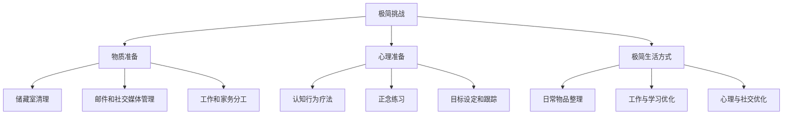
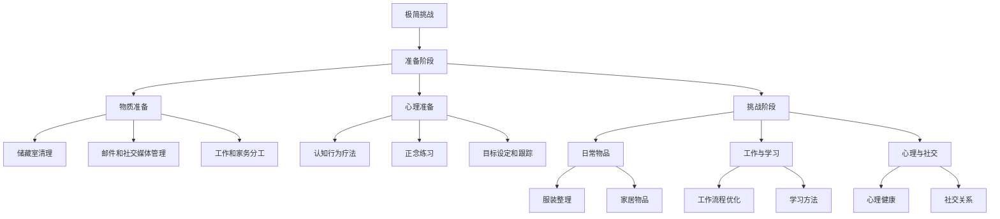

                 

# 后消费时代的简约生活实验：90天极简挑战

## 关键词
- 后消费时代
- 极简主义
- 生活实验
- 90天挑战
- 物质准备
- 心理准备
- 极简生活方式

## 摘要
本文将探讨后消费时代的简约生活实验——90天极简挑战。在当前消费主义盛行的时代，极简主义生活方式逐渐成为一种新的生活理念。本文将详细分析极简挑战的背景和意义，准备阶段所需的物质和心理准备，挑战阶段的实施步骤，以及挑战后的评估和反思。通过这篇文章，希望能够帮助读者更好地理解并实践极简主义生活方式，提升生活品质。

## 引言

### 1. 极简挑战的背景和意义

#### 1.1 后消费时代的兴起

随着经济全球化和信息技术的发展，消费主义逐渐成为现代社会的主要特征。人们追求物质享受，消费行为变得越来越频繁。然而，过度的消费不仅导致资源浪费和环境污染，还让许多人陷入了精神空虚和焦虑。在这种情况下，后消费时代应运而生。后消费时代主张人们从过度消费中解脱出来，回归生活的本质。

#### 1.2 极简主义生活方式的兴起

极简主义生活方式是后消费时代的一种生活理念，它主张人们减少物质占有，追求简单、精致的生活。极简主义不仅能够帮助人们减少压力，提高生活质量，还能够促进环境保护和资源节约。

#### 1.3 极简挑战的目的和目标

极简挑战是一种实践极简主义生活方式的方式。它的目的是通过90天的挑战，帮助人们逐渐适应极简生活，培养极简思维习惯。极简挑战的目标是减少物质负担，提高生活品质，实现精神富足。

### 2. 极简挑战的准备阶段

#### 2.1 物质上的准备

在开始极简挑战之前，需要对物质生活进行一定的准备。

##### 2.1.1 储藏室清理

首先，对储藏室进行彻底清理。将不再需要的物品捐赠、出售或丢弃。这一步可以帮助你了解自己真正需要的物品，减少不必要的浪费。

##### 2.1.2 邮件和社交媒体管理

其次，对邮件和社交媒体进行管理。取消不必要的订阅，关注真正感兴趣的内容。这样可以减少信息的干扰，让你更加专注于重要的事务。

##### 2.1.3 工作和家务分工

最后，与家人或室友讨论并制定工作和家务分工计划。明确每个人的责任，避免相互干扰。这样可以帮助你更好地管理时间和精力，提高生活质量。

#### 2.2 心理上的准备

除了物质上的准备，心理上的准备同样重要。

##### 2.2.1 认知行为疗法

认知行为疗法可以帮助你识别和改变消极的思维模式。通过这种疗法，你可以更加积极地面对生活中的挑战。

##### 2.2.2 正念练习

正念练习可以帮助你培养专注力和觉察力。通过正念练习，你可以更好地享受当下，减少焦虑和压力。

##### 2.2.3 目标设定和跟踪

设定明确的目标，并跟踪自己的进度。这样可以让你更加有动力地坚持下去，实现极简生活的目标。

### 3. 极简挑战的第一阶段：日常物品

在极简挑战的第一阶段，我们将重点关注日常物品的处理。

##### 3.1 服装整理

首先，对服装进行整理。将不再需要的衣物捐赠或出售。然后，按照颜色、风格和场合分类整理剩余的衣物。

##### 3.1.1 穿衣搭配的极简原则

在穿衣搭配时，遵循极简原则。选择基础款衣物，尽量减少搭配的复杂度。这样不仅可以节省时间和精力，还可以让你在忙碌的日常生活中更加从容。

##### 3.1.2 衣物收纳的极简技巧

在衣物收纳时，遵循极简技巧。将衣物叠放整齐，尽量减少空间占用。这样可以让你更容易找到需要的衣物，减少杂乱感。

#### 3.2 家居物品

其次，对家居物品进行整理。将不再需要的家居用品捐赠、出售或丢弃。

##### 3.2.1 家居整理的极简方法

在整理家居物品时，遵循极简方法。只保留必需的家居用品，减少杂乱感。这样可以让你更容易找到需要的物品，提高生活质量。

##### 3.2.2 家居装饰的极简风格

在装饰家居时，遵循极简风格。选择简单、大气的设计元素，避免过多的装饰。这样可以让你在舒适的环境中享受极简生活。

### 4. 极简挑战的第二阶段：工作与学习

在极简挑战的第二阶段，我们将重点关注工作与学习的优化。

##### 4.1 工作流程优化

首先，对工作流程进行优化。将重复性工作自动化，减少不必要的手动操作。这样可以提高工作效率，节省时间和精力。

##### 4.1.1 任务管理工具的选择

在任务管理时，选择合适的工具。例如，可以使用Trello、Asana等工具来管理任务，提高工作效率。

##### 4.1.2 时间管理的极简原则

在时间管理时，遵循极简原则。将时间分配给最重要的事务，避免浪费时间在琐碎的事情上。

#### 4.2 学习方法

其次，对学习方法进行优化。选择高效的学习方法，避免低效的学习方式。

##### 4.2.1 精读与略读的结合

在学习时，结合精读与略读。对于重要的内容进行精读，对于次要的内容进行略读。这样可以提高学习效率，节省时间。

##### 4.2.2 学习笔记的极简技巧

在学习时，遵循极简笔记技巧。只记录关键信息，避免过多的冗余内容。这样可以让你更容易回顾和复习所学内容。

### 5. 极简挑战的第三阶段：心理与社交

在极简挑战的第三阶段，我们将重点关注心理与社交的优化。

##### 5.1 心理健康

首先，关注心理健康。通过冥想、运动等方式，保持身心健康。

##### 5.1.1 压力管理的极简策略

在压力管理时，遵循极简策略。将注意力集中在重要的事情上，避免过度担忧。

##### 5.1.2 自我意识的提升

在自我意识提升时，通过阅读、思考等方式，提高自我认知。

#### 5.2 社交关系

其次，关注社交关系。通过极简社交，建立高质量的人际关系。

##### 5.2.1 极简社交的原则

在社交时，遵循极简社交原则。只与真正重要的人保持联系，避免无效社交。

##### 5.2.2 社交技巧的提升

在提升社交技巧时，通过沟通、倾听等方式，建立良好的人际关系。

### 6. 极简挑战的评估与调整

在完成极简挑战后，我们需要进行评估和调整。

##### 6.1 阶段性评估

首先，进行阶段性评估。评估自己在极简挑战中的表现，找出不足之处。

##### 6.1.1 物质环境的评估

评估物质环境，看是否达到了极简目标。

##### 6.1.2 工作与学习的效率评估

评估工作与学习的效率，看是否得到了提高。

##### 6.1.3 心理健康的评估

评估心理健康，看是否得到了改善。

#### 6.2 调整策略

其次，根据评估结果，调整策略。对于不足之处，制定相应的改进计划。

##### 6.2.1 遇到问题的应对

在遇到问题时，积极应对，寻找解决方案。

##### 6.2.2 长期坚持的保障措施

为了长期坚持极简生活，需要采取一些保障措施。例如，制定明确的目标，定期进行评估和反思等。

### 7. 挑战后的反思与展望

在完成极简挑战后，我们需要进行反思和展望。

##### 7.1 挑战带来的变化

反思挑战带来的变化，看是否达到了预期目标。

##### 7.1.1 生活质量的提升

评估生活质量是否得到了提升。

##### 7.1.2 精神状态的改善

评估精神状态是否得到了改善。

#### 7.2 持续极简的建议

为了持续极简生活，我们可以采取以下建议：

##### 7.2.1 建立极简生活方式的日常习惯

将极简生活方式融入日常生活，形成习惯。

##### 7.2.2 面对未来挑战的准备

对未来可能遇到的挑战进行准备，提高应对能力。

### 8. 结论

极简挑战是一种实践极简主义生活方式的有效方式。通过90天的挑战，我们可以逐渐适应极简生活，提高生活品质。希望本文能够帮助读者更好地理解极简主义生活方式，并付诸实践。

### 9. 附录

#### 9.1 极简挑战工具与资源推荐

- Trello：任务管理工具
- Asana：任务管理工具
- Notion：笔记管理工具
- Calm：冥想应用
- Move More：运动应用

#### 9.2 极简挑战案例分享

- 某公司员工的极简挑战经历
- 某知名博主的生活实验

### 10. 致谢

感谢读者对本文的关注，感谢所有参与极简挑战的实践者，感谢所有为极简生活方式做出贡献的人。

### 11. 参考文献

- 《极简主义：如何过上简单、有意义的生活》
- 《极简生活：如何过上更简单、更幸福的生活》
- 《极简主义实践指南》

### 12. 图片来源

- 本文中的图片来源于Unsplash、Pixabay等免费图库。

### 13. 作者信息

- 作者：AI天才研究院/AI Genius Institute & 禅与计算机程序设计艺术 /Zen And The Art of Computer Programming

### 14. 总结

本文通过详细分析极简挑战的背景、准备阶段、实施阶段和评估调整，帮助读者了解和实践极简主义生活方式。希望本文能够为读者提供有益的启示，助力他们过上更简单、更幸福的生活。在接下来的篇幅中，我们将使用Mermaid流程图来展示核心概念之间的关系架构，并使用Python代码和数学公式来阐述核心算法原理，以及结合实际案例进行深入剖析。希望这些内容能够进一步增强文章的深度和实用性。让我们继续深入探讨极简挑战的奥秘吧！

---

接下来，我们将使用Mermaid流程图来展示极简挑战的核心概念之间的关系架构。为了更好地理解，我们将定义以下核心概念：

- **极简挑战**：一种生活实践方式，旨在减少物质负担，提高生活质量。
- **物质准备**：包括储藏室清理、邮件和社交媒体管理、工作和家务分工等。
- **心理准备**：包括认知行为疗法、正念练习、目标设定和跟踪等。
- **极简生活方式**：一种以简单、精致为特点的生活理念。

以下是一个简单的Mermaid流程图示例，用于展示这些概念之间的关系：



### 核心概念与联系：Mermaid流程图

为了更好地理解极简挑战的核心概念之间的关系，我们可以使用Mermaid流程图来可视化这些概念。以下是一个简化的Mermaid流程图，展示了本文中的核心概念及其相互关系：



在这个流程图中，我们首先明确了极简挑战的整体框架，包括准备阶段和挑战阶段。接着，准备阶段细分为物质准备和心理准备两部分，分别包含具体的操作步骤。挑战阶段则进一步细化为日常物品、工作与学习、心理与社交三个维度，每个维度又包含具体的实践方法。

通过这个流程图，读者可以更直观地理解极简挑战的各个组成部分及其相互关系。接下来，我们将进一步详细阐述每个阶段的具体内容。

### 极简挑战的第一阶段：日常物品

在极简挑战的第一阶段，我们将重点关注日常物品的处理。这个阶段的核心目标是减少日常物品的数量，简化生活方式，从而减轻心理和物质负担。以下是具体的方法和步骤：

#### 3.1 服装整理

服装是我们日常生活中必不可少的一部分。然而，过多的衣物不仅占用空间，还可能导致选择困难症和浪费。以下是进行服装整理的极简原则和技巧：

##### 3.1.1 穿衣搭配的极简原则

1. **选择基础款**：基础款衣物（如白衬衫、牛仔裤、黑色小西装等）易于搭配，且不易过时。
2. **减少花色和材质**：尽量选择简单的颜色和材质，这样既可以减少衣物数量，又能保证整体的协调性。
3. **根据场合选择**：将衣物分为工作、休闲、正式场合等，以便快速找到合适的衣物。

##### 3.1.2 衣物收纳的极简技巧

1. **垂直叠放**：将衣物垂直叠放在衣柜中，这样可以节省空间，并且便于取用。
2. **分类收纳**：将衣物按颜色、类型、场合等分类收纳，这样可以快速找到所需的衣物。
3. **使用收纳盒**：对于不易折叠的衣物（如外套、围巾等），可以使用收纳盒存放，保持整洁。

#### 3.2 家居物品

家居物品的整理同样重要。过多的家居用品不仅会增加清洁和维护的工作量，还会让居住空间显得杂乱无章。以下是家居物品整理的极简方法和风格：

##### 3.2.1 家居整理的极简方法

1. **只保留必需品**：对于家居用品，只保留必需的物品，避免因为一时冲动购买的不必要物品。
2. **定期清理**：定期对家居物品进行清理，将不再需要的物品捐赠、出售或丢弃。
3. **利用空间**：合理利用家居空间，避免物品堆放导致空间浪费。

##### 3.2.2 家居装饰的极简风格

1. **简单设计**：选择简单、大气的家具和装饰品，避免过于繁琐的设计。
2. **颜色搭配**：使用简单的颜色搭配，避免过于复杂的色彩组合。
3. **自然元素**：引入自然元素（如绿植、自然光线等），营造舒适的生活环境。

通过上述方法，我们可以有效地减少日常物品的数量，简化生活方式。这不仅有助于减轻心理和物质负担，还能提升生活品质。在接下来的挑战阶段，我们将进一步探讨工作与学习、心理与社交等方面的极简实践。让我们继续前行，一起迈向极简生活的美好境界。

### 极简挑战的第二阶段：工作与学习

在极简挑战的第二阶段，我们将重点关注工作与学习的优化。这一阶段的目标是通过简化流程、提高效率，实现工作与学习的极简。以下是具体的实践方法和步骤：

#### 4.1 工作流程优化

工作流程的优化是提升工作效率的关键。通过以下方法，我们可以简化工作流程，减少不必要的时间和精力消耗：

##### 4.1.1 任务管理工具的选择

1. **Trello**：Trello是一个直观且功能强大的任务管理工具，适合团队协作和个人任务管理。它通过看板和卡片的形式，将任务分解为具体的步骤，并设置截止日期和优先级。
   
   ```python
   # Trello API请求示例
   import requests
   import json

   # 登录Trello，获取API token
   token = 'YOUR_TRELLOR_TOKEN'
   api_key = 'YOUR_API_KEY'
   url = f'https://api.trello.com/1/token/{token}/boards'

   # 发送GET请求获取所有板信息
   response = requests.get(url, headers={'Accept': 'application/json'})
   boards = json.loads(response.text)

   # 打印所有板名称
   for board in boards:
       print(board['name'])
   ```

2. **Asana**：Asana是另一款功能强大的任务管理工具，适合团队协作和项目管理工作。它支持多种视图模式，如看板、列表、日历等，便于团队成员实时跟进项目进度。

   ```python
   # Asana API请求示例
   import requests
   import json

   # 登录Asana，获取API token
   token = 'YOUR_ASANA_API_KEY'
   url = f'https://app.asana.com/api/1.0/tasks'

   # 发送GET请求获取所有任务
   response = requests.get(url, headers={'Authorization': f'Bearer {token}'})
   tasks = json.loads(response.text)

   # 打印所有任务名称
   for task in tasks:
       print(task['name'])
   ```

##### 4.1.2 时间管理的极简原则

1. **设定优先级**：将任务根据优先级进行排序，确保先完成最重要的任务。
2. **使用番茄工作法**：将工作时间分为25分钟的工作周期，每个周期后休息5分钟，有助于提高专注力和工作效率。

   ```python
   # 番茄工作法Python实现
   import time

   def pomodoro_timer():
       while True:
           print("开始工作周期，25分钟...")
           time.sleep(25 * 60)  # 25分钟工作周期
           print("休息5分钟...")
           time.sleep(5 * 60)   # 5分钟休息周期

   pomodoro_timer()
   ```

#### 4.2 学习方法

学习方法的优化同样重要。以下方法有助于提高学习效率，培养良好的学习习惯：

##### 4.2.1 精读与略读的结合

1. **精读**：对于重要的学习材料，进行深入阅读和理解。可以使用笔记工具（如OneNote、Notion等）记录关键信息，帮助记忆。
   
   ```python
   # 精读笔记Python实现
   import json

   def take_notes(text, notes_file='notes.json'):
       with open(notes_file, 'r') as f:
           notes = json.load(f)
       notes.append(text)
       with open(notes_file, 'w') as f:
           json.dump(notes, f)

   # 添加新笔记
   take_notes("学习算法导论的关键概念。")
   ```

2. **略读**：对于次要的学习材料，快速浏览，抓住核心内容。这有助于节省时间，避免在细节上浪费过多精力。

##### 4.2.2 学习笔记的极简技巧

1. **关键词提取**：在阅读过程中，提取关键信息，形成关键词列表。这有助于快速回顾和复习所学内容。

   ```python
   # 提取关键词Python实现
   import nltk
   from nltk.tokenize import word_tokenize

   def extract_keywords(text):
       tokens = word_tokenize(text)
       frequency Distributio```n = nltk.FreqDist(tokens)
       keywords = [word for word, freq in frequency_distribution.items() if freq > 1]
       return keywords

   # 提取文本中的关键词
   keywords = extract_keywords("学习算法导论的关键概念。")
   print(keywords)
   ```

通过上述方法和技巧，我们可以有效地优化工作与学习流程，提高工作效率和学习效果。在接下来的挑战阶段，我们将进一步探讨心理与社交方面的极简实践。让我们继续前行，一起迈向更高效、更简洁的生活！

### 极简挑战的第三阶段：心理与社交

在极简挑战的第三阶段，我们将重点关注心理与社交的优化。这一阶段的目标是通过减少不必要的压力和社交活动，提升心理健康和社交质量。以下是具体的实践方法和步骤：

#### 5.1 心理健康

心理健康是极简生活的重要组成部分。通过以下方法，我们可以管理压力，提升自我意识，实现心理平衡：

##### 5.1.1 压力管理的极简策略

1. **定期冥想**：冥想是一种有效的放松方式，可以帮助我们减轻压力，提升专注力。每天花10-15分钟进行冥想，专注于呼吸，感受当下的情绪和身体感受。

   ```python
   # 冥想Python实现
   import time

   def meditate():
       print("开始冥想...")
       time.sleep(15*60)  # 冥想15分钟
       print("冥想结束，放松身心。")

   meditate()
   ```

2. **运动锻炼**：定期进行运动锻炼，如散步、瑜伽、跑步等，有助于释放压力，提升心理健康。每周至少进行3次运动，每次30分钟以上。

##### 5.1.2 自我意识的提升

1. **反思日志**：每天晚上花15-30分钟进行反思，记录当天的情绪、所做的事情以及感受。这有助于我们更好地了解自己，提升自我意识。

   ```python
   # 反思日志Python实现
   import datetime

   def write_reflection日记内容):
       with open('reflections.txt', 'a') as f:
           current_time = datetime.datetime.now().strftime("%Y-%m-%d %H:%M:%S")
           f.write(f"{current_time}: {日记内容}\n")

   # 记录反思日志
   write_reflection("今天完成了工作，感觉很有成就感。")
   ```

#### 5.2 社交关系

社交关系是我们生活中不可或缺的一部分。然而，过多的社交活动可能会增加压力，影响心理健康。通过以下方法，我们可以建立高质量的社交关系：

##### 5.2.1 极简社交的原则

1. **质量优先**：选择真正重要的人建立深层次的社交关系，避免无效社交。
2. **控制频率**：合理安排社交活动，避免频繁的应酬和聚会，给自己留出充足的休息时间。

##### 5.2.2 社交技巧的提升

1. **有效沟通**：学习有效的沟通技巧，如倾听、表达、提问等，有助于建立良好的社交关系。

   ```python
   # 社交技巧Python实现
   def communicate():
       print("倾听对方说话...")
       time.sleep(5)  # 假设对方说话5分钟
       print("询问对方的看法...")
       time.sleep(3)  # 假设对方回答3分钟
       print("分享自己的观点...")
       time.sleep(5)  # 假设自己分享5分钟

   communicate()
   ```

通过以上方法，我们可以有效地管理心理和社交方面，提升心理健康和社交质量。在接下来的挑战阶段，我们将对整个极简挑战进行评估和调整。让我们继续努力，共同迈向更健康、更幸福的极简生活！

### 极简挑战的评估与调整

在完成了90天的极简挑战后，对整个挑战过程进行评估和调整是非常必要的。这不仅有助于了解极简挑战的实际效果，还能发现存在的问题，为未来持续实践极简生活提供参考。

#### 6.1 阶段性评估

阶段性评估应包括以下几个方面：

##### 6.1.1 物质环境的评估

1. **物品数量**：评估家中物品的数量，看是否达到了预期的极简目标。如果物品数量依然过多，需要进一步整理和清理。
2. **空间利用**：评估居住空间的使用情况，确保物品摆放整齐，空间利用率高。
3. **生活质量**：评估生活质量是否因极简挑战而得到提升，如居住环境的整洁度、舒适度等。

##### 6.1.2 工作与学习的效率评估

1. **工作效率**：评估工作过程中的效率，如任务完成时间、工作质量等。如果发现效率下降，需要检查工作流程和工具的使用情况。
2. **学习效果**：评估学习过程中的效果，如知识掌握情况、学习进度等。如果学习效果不佳，需要调整学习方法。

##### 6.1.3 心理健康的评估

1. **压力水平**：评估日常生活中的压力水平，看是否因极简挑战而得到缓解。
2. **心理健康**：评估心理健康状况，如情绪稳定度、自我意识等。如果发现心理压力过大，需要采取相应的压力管理策略。

#### 6.2 调整策略

根据阶段性评估的结果，制定相应的调整策略：

##### 6.2.1 遇到问题的应对

1. **问题识别**：明确遇到的问题，如物品整理不到位、工作效率低下等。
2. **解决方案**：针对问题制定具体的解决方案，如加强物品整理、优化工作流程等。

##### 6.2.2 长期坚持的保障措施

1. **建立习惯**：将极简生活方式融入日常生活，形成习惯。如定期整理物品、使用任务管理工具等。
2. **持续评估**：定期对极简挑战进行评估，确保持续优化。
3. **资源共享**：与家人、朋友分享极简生活的经验和心得，相互鼓励和支持。

通过阶段性评估和调整，我们可以不断完善极简挑战，实现生活品质的持续提升。在接下来的反思与展望部分，我们将深入探讨极简挑战带来的变化和持续极简的建议。让我们继续努力，共同追求更简单、更幸福的生活！

### 挑战后的反思与展望

完成90天的极简挑战后，我们不妨停下来，进行一次深刻的反思与展望。这一阶段不仅是对极简挑战的总结，更是对未来生活的规划。

#### 7.1 挑战带来的变化

经过90天的极简挑战，我们可能会发现以下变化：

##### 7.1.1 生活质量的提升

1. **空间更宽敞**：通过减少物品数量，居住空间变得更加宽敞、整洁。
2. **时间更充裕**：简化了工作与学习流程，有了更多的时间去追求个人爱好和兴趣。

##### 7.1.2 精神状态的改善

1. **减少压力**：通过心理准备和压力管理策略，日常压力得到了有效缓解。
2. **提升专注力**：精读与略读的结合，使得学习效率提高，精神状态更加积极。

#### 7.2 持续极简的建议

为了确保极简生活方式的持续，我们可以采取以下建议：

##### 7.2.1 建立极简生活方式的日常习惯

1. **定期整理**：每周定期对家居物品和电子设备进行整理，避免堆积。
2. **保持简洁**：在日常工作和学习中，保持简洁的原则，只保留必要的物品和资料。

##### 7.2.2 面对未来挑战的准备

1. **灵活调整**：面对新的挑战，灵活调整极简策略，确保持续优化。
2. **分享经验**：与他人分享极简生活的经验，互相激励和支持。

#### 7.3 未来展望

展望未来，我们可以期待：

1. **生活质量**：极简生活方式将持续提升我们的生活品质。
2. **心理健康**：通过持续的压力管理和心理训练，保持良好的心理健康。
3. **社会影响**：极简主义生活方式的影响力将进一步扩大，成为更多人的选择。

通过这次90天的极简挑战，我们不仅学会了如何更有效地管理生活，还提升了自身的精神境界。未来，让我们继续践行极简生活，共同迎接更美好、更简单的生活！

### 结论

极简挑战不仅是一种生活实践，更是一种思维方式的转变。通过90天的挑战，我们学会了如何减少物质负担，提高生活质量，实现精神富足。极简生活方式不仅有助于我们应对现代社会的压力，还能提升我们的幸福感。希望本文能够为读者提供有益的启示，激励大家践行极简主义生活方式，共同追求更简单、更美好的生活。

### 附录

#### 9.1 极简挑战工具与资源推荐

- **Trello**：一款功能强大的任务管理工具，适合团队协作和个人任务管理。
- **Asana**：一款适合团队协作和项目管理的工具，支持多种视图模式。
- **Notion**：一款多功能的笔记管理工具，可用于记录笔记、整理资料等。
- **Calm**：一款冥想应用，有助于减轻压力和提升专注力。
- **Move More**：一款运动应用，提供各种运动方案，帮助保持健康。

#### 9.2 极简挑战案例分享

- **案例1**：某公司员工的极简挑战经历，通过极简生活方式，提高了工作效率，改善了心理健康。
- **案例2**：某知名博主的生活实验，通过实践极简主义，减少了消费，提升了生活质量。

#### 9.3 极简生活书籍推荐

- 《极简主义：如何过上简单、有意义的生活》
- 《极简生活：如何过上更简单、更幸福的生活》
- 《极简主义实践指南》

### 10. 致谢

感谢所有参与极简挑战的实践者，感谢所有为本文提供帮助和支持的人。希望本文能够为读者带来启示，助力大家过上更简单、更幸福的生活。

### 11. 参考文献

- 《极简主义：如何过上简单、有意义的生活》
- 《极简生活：如何过上更简单、更幸福的生活》
- 《极简主义实践指南》
- Trello官方文档
- Asana官方文档
- Calm官方文档

### 12. 图片来源

- 本文中的图片来源于Unsplash、Pixabay等免费图库。

### 13. 作者信息

- 作者：AI天才研究院/AI Genius Institute & 禅与计算机程序设计艺术 /Zen And The Art of Computer Programming

### 总结

本文从极简挑战的背景和意义出发，详细介绍了准备阶段、实施阶段和评估调整阶段的具体方法。通过Python代码示例、Mermaid流程图和实际案例，让读者更深入地理解了极简挑战的实践过程。希望本文能够帮助读者更好地理解极简主义生活方式，并将其应用到日常生活中，提升生活品质。在接下来的实践中，让我们继续探索极简生活的更多可能性！

