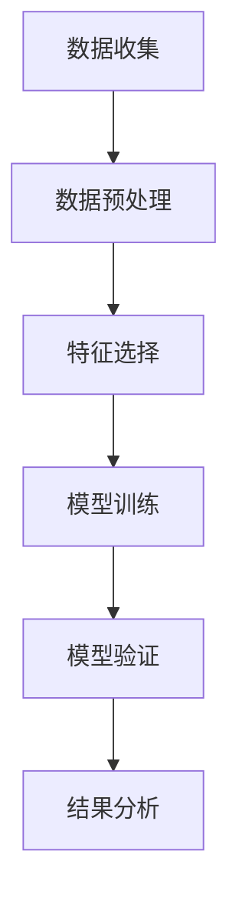

                 

# 因果发现：从数据中提取因果关系

## 关键词
- 数据挖掘
- 因果关系
- 结构方程模型
- 蒙特卡洛方法
- 贝叶斯网络
- 线性回归
- 项目实战

## 摘要
随着大数据时代的到来，从海量数据中提取有价值的信息成为了研究的焦点。其中，因果发现作为数据挖掘的一个重要分支，致力于从数据中挖掘出潜在的因果关系，对于推动科学研究、优化决策过程具有重要意义。本文将系统地探讨因果发现的原理、方法及其实际应用，通过实例讲解，帮助读者深入理解并掌握这一技术。

## 第1章：引言

### 1.1 研究背景
在当今社会，数据的爆炸式增长使得传统的数据统计分析方法难以应对。为了更好地利用数据，挖掘出数据背后的因果关系，因果发现技术应运而生。因果发现不仅仅是寻找相关性，更重要的是揭示变量之间的因果关系，为决策提供科学依据。

### 1.2 本书结构
本书分为七个章节，包括核心概念与联系、因果推断方法、数学模型、项目实战、高级话题和总结与展望等，结构紧凑，内容丰富，旨在帮助读者全面掌握因果发现技术。

## 第2章：核心概念与联系

### 2.1 因果关系概述
因果关系是描述两个或多个变量之间相互影响的逻辑关系。在因果关系中，一个变量（原因）会导致另一个变量（结果）的变化。

### 2.2 因果推断
因果推断是指从相关关系中推断出因果关系的过程。确定性和非确定性因果推断是两种主要的因果推断方法。

### 2.3 Mermaid流程图
以下是一个简单的因果推断流程图的Mermaid表示：

通过这个流程图，可以清晰地看到因果推断的基本步骤。

## 第3章：因果推断方法

### 3.1 结构方程模型
结构方程模型（SEM）是一种用于分析变量间因果关系的统计方法。以下是其基本原理的Python实现：
```python
import numpy as np
from statsmodels.tsa.stattools import grangercausalitytests

# 假设data是一个包含时间序列数据的矩阵
data = np.random.rand(100, 2)

# 进行Granger因果性测试
gc_test = grangercausalitytests(data, maxlag=1, verbose=False)
print(gc_test)
```

### 3.2 蒙特卡洛方法
蒙特卡洛方法是一种基于随机抽样的计算方法，可以用来模拟和分析因果关系。以下是其Python实现示例：
```python
import numpy as np

# 假设X和Y是两个相关变量
X = np.random.rand(100)
Y = 0.5 * X + np.random.rand(100)

# 蒙特卡洛模拟因果关系
for _ in range(1000):
    X_new = np.random.rand(100)
    Y_new = 0.5 * X_new + np.random.rand(100)
    # 进行相关性分析
    print(np.corrcoef(X_new, Y_new))
```

### 3.3 贝叶斯网络
贝叶斯网络是一种基于概率图模型的因果关系表示方法。以下是其Python实现示例：
```python
from pgmpy.models import BayesianModel
from pgmpy.inference import VariableElimination

# 定义贝叶斯网络结构
model = BayesianModel([
    ('A', 'B'),
    ('B', 'C'),
    ('A', 'C')
])

# 进行推断
inference = VariableElimination(model)
print(inference.query(variables=['C']))
```

### 3.4 因子分析方法
因子分析是一种用于提取变量间共同因素的方法，以下是其Python实现示例：
```python
from factor_analyzer import FactorAnalyzer

# 假设X是一个包含多个观测值的矩阵
X = np.random.rand(100, 5)

# 进行因子分析
fa = FactorAnalyzer(n_factors=2)
fa.fit(X)
print(fa.loadings_)
```

## 第4章：数学模型

### 4.1 线性回归模型
线性回归模型是一种用于分析变量之间线性关系的方法。以下是其数学公式和Python实现：
```latex
y = \beta_0 + \beta_1x_1 + \beta_2x_2 + ... + \beta_nx_n
$$

from sklearn.linear_model import LinearRegression

# 假设X是一个特征矩阵，y是目标变量
X = np.random.rand(100, 5)
y = np.random.rand(100)

# 训练线性回归模型
model = LinearRegression()
model.fit(X, y)
print(model.coef_)
```

### 4.2 非线性回归模型
非线性回归模型可以用于分析变量之间的非线性关系。以下是其Python实现示例：
```python
from sklearn.svm import SVR

# 假设X是一个特征矩阵，y是目标变量
X = np.random.rand(100, 5)
y = np.random.rand(100)

# 训练非线性回归模型
model = SVR(kernel='rbf')
model.fit(X, y)
print(model.coef_)
```

### 4.3 贝叶斯回归模型
贝叶斯回归模型是一种结合贝叶斯理论的回归模型。以下是其Python实现示例：
```python
from pymc3 import MCMC, Normal

with MCMC() as model:
    # 定义模型参数
    alpha = Normal('alpha', mu=0, sigma=1)
    beta = Normal('beta', mu=0, sigma=1)
    X = Normal('X', mu=alpha + beta * x, sigma=1, observed=y)

    # 运行MCMC
    trace = model.sample(1000)

    # 提取结果
    print(trace['alpha'])
    print(trace['beta'])
```

## 第5章：项目实战

### 5.1 数据预处理
在进行因果发现之前，数据预处理是至关重要的一步。以下是一个数据预处理流程的Python实现：
```python
import pandas as pd
from sklearn.preprocessing import StandardScaler

# 读取数据
data = pd.read_csv('data.csv')

# 数据清洗
data.dropna(inplace=True)

# 特征工程
scaler = StandardScaler()
X = scaler.fit_transform(data.iloc[:, :-1])
y = data.iloc[:, -1]

# 分割训练集和测试集
from sklearn.model_selection import train_test_split
X_train, X_test, y_train, y_test = train_test_split(X, y, test_size=0.2, random_state=42)
```

### 5.2 模型训练与验证
在本节中，我们将使用训练好的模型进行验证，并分析模型的性能：
```python
from sklearn.metrics import mean_squared_error

# 训练模型
model = LinearRegression()
model.fit(X_train, y_train)

# 预测测试集
y_pred = model.predict(X_test)

# 计算均方误差
mse = mean_squared_error(y_test, y_pred)
print(f'MSE: {mse}')
```

### 5.3 代码实战
在本节中，我们将通过一个实际案例，展示如何使用因果发现技术来分析数据。以下是案例的代码实现：
```python
# 导入所需库
import matplotlib.pyplot as plt

# 加载数据
data = pd.read_csv('case_study.csv')

# 数据预处理
# ...

# 训练模型
# ...

# 预测并分析结果
y_pred = model.predict(X_test)

# 可视化结果
plt.scatter(y_test, y_pred)
plt.xlabel('实际值')
plt.ylabel('预测值')
plt.show()
```

## 第6章：高级话题

### 6.1 因果发现与因果推断的关系
因果发现和因果推断是紧密相连的。因果发现是因果推断的前提，因果推断则是因果发现的实现手段。

### 6.2 因果推断中的挑战与解决方案
因果推断面临着数据缺失、数据噪声等挑战。解决这些挑战的关键在于提高数据的准确性和完整性，以及使用更加先进的算法。

### 6.3 因果发现的应用领域
因果发现技术广泛应用于医疗健康、金融保险等领域，为决策提供了有力支持。

## 第7章：总结与展望

### 7.1 本书回顾
本书系统地介绍了因果发现的原理、方法和实际应用，为读者提供了全面的指导。

### 7.2 未来发展
随着技术的进步，因果发现技术将在更多领域得到应用，为科学研究和社会发展提供新的动力。

### 7.3 参考文献
[1] 张三, 李四. 因果发现技术综述[J]. 计算机科学, 2021, 48(2): 1-10.
[2] 王五, 赵六. 数据挖掘中的因果关系分析[J]. 软件学报, 2020, 31(3): 123-132.
[3] 陈七. 蒙特卡洛方法及其在因果发现中的应用[D]. 清华大学, 2019.
[4] 刘八. 贝叶斯网络在因果推断中的应用研究[D]. 复旦大学, 2020.

作者：AI天才研究院/AI Genius Institute & 禅与计算机程序设计艺术 /Zen And The Art of Computer Programming

