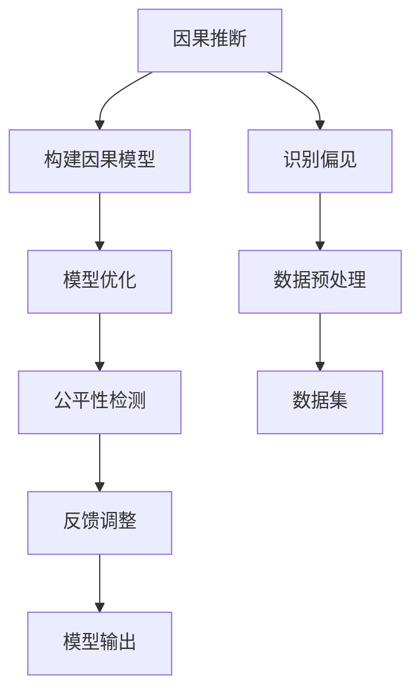
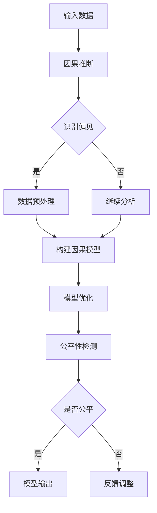

                 

# 因果推断增强AI模型公平性的方法探索

## 关键词

- 因果推断
- AI模型公平性
- 偏见消除
- 算法优化
- 数据预处理
- 强化学习
- 监督学习
- 无监督学习

## 摘要

本文旨在探讨如何通过因果推断技术来增强人工智能（AI）模型的公平性。首先，我们介绍了因果推断的基本概念和其在AI模型公平性中的作用。接着，分析了传统AI模型在公平性方面面临的挑战，并提出了相应的改进策略。随后，我们详细介绍了因果推断的基本理论和常用方法，以及这些方法在AI模型中的应用。文章随后探讨了因果推断与模型公平性结合的多种方法，并结合实际案例进行了深入分析。最后，本文展望了因果推断与AI模型公平性的未来发展趋势，并提出了面临的挑战与解决方案。

## 第1章 因果推断与AI模型公平性概述

### 1.1 因果推断的基本概念

因果推断是一种从数据中推断因果关系的方法，旨在回答“为什么”而不是“是什么”。在统计学中，因果推断通常涉及到随机对照试验（RCT）的概念，通过控制外部变量来分析某一变量的因果关系。因果推断的基本框架包括识别因果关系、建立因果模型和验证因果模型。

- **识别因果关系**：通过分析数据，识别出潜在的因果关系。
- **建立因果模型**：利用识别出的因果关系，建立数学模型来描述变量之间的关系。
- **验证因果模型**：通过实验或额外的数据来验证因果模型的准确性。

因果推断的重要性在于它能够帮助我们理解现象背后的根本原因，而不仅仅是表面的相关性。这在AI领域尤为重要，因为AI模型的决策过程往往是基于数据学习的，而数据往往存在噪声和偏差，需要通过因果推断来消除这些影响，从而得到更可靠的决策。

### 1.2 AI模型公平性的概念

AI模型公平性指的是AI模型在决策过程中不会因为性别、种族、年龄等因素而对某些群体产生不公平的待遇。公平性可以理解为“无歧视”或“无偏见”，即AI模型对所有用户都应该是一视同仁的。

- **定义**：公平性是指AI模型在处理不同群体数据时，不会因为数据中的偏见而导致决策上的歧视。
- **歧视**：歧视指的是AI模型在决策过程中，由于输入数据或算法设计上的原因，对某些群体产生的负面偏见。

### 1.3 因果推断与AI模型公平性的联系

因果推断在AI模型公平性中扮演着关键角色。通过因果推断，我们可以识别出数据中的潜在偏见，从而设计出更加公平的AI模型。

- **消除数据偏见**：因果推断可以帮助我们理解数据中的因果关系，从而识别出可能存在的偏见，并采取相应措施进行纠正。
- **设计公平的模型**：在模型设计过程中，因果推断可以帮助我们确保模型不会因为数据中的偏见而产生不公平的决策。

### 1.3.1 因果推断与AI模型公平性的关系架构

下面是一个用Mermaid绘制的因果推断与AI模型公平性关系的架构图：



### 1.3.2 核心概念与联系

在因果推断与AI模型公平性中，核心概念包括：

- **因果推断**：识别数据中的因果关系。
- **数据预处理**：消除数据中的偏见。
- **模型优化**：通过因果模型来优化模型决策。
- **公平性检测**：评估模型的公平性。

这些概念之间的联系可以用以下Mermaid流程图表示：



## 第2章 传统AI模型的公平性问题

### 2.1 传统AI模型公平性挑战

传统AI模型在公平性方面面临着诸多挑战。首先，数据偏差是一个重要问题。AI模型是基于数据学习的，如果训练数据中存在偏见，那么模型很可能会继承这些偏见。例如，如果训练数据中女性和男性的比例不平等，那么模型可能会对女性产生不公平的待遇。

其次，算法偏见也是一个重要问题。一些算法本身可能存在偏见，例如基于规则的系统可能会根据历史数据中的偏见做出决策，从而导致新的偏见产生。

### 2.2 公平性检测方法

为了检测AI模型的公平性，我们可以使用以下几种方法：

- **统计方法**：通过分析模型输出数据中的统计指标，如均值、标准差、方差等，来检测模型是否存在偏见。
- **模型验证方法**：通过在多个数据集上验证模型的性能，来评估模型是否存在偏见。

### 2.3 公平性改进策略

为了提高AI模型的公平性，我们可以采取以下策略：

- **数据预处理**：在训练模型之前，对数据进行预处理，以消除数据中的偏见。
- **算法调整**：通过调整算法参数，来减少算法偏见。
- **多模型集成**：通过集成多个模型，来减少单一模型的偏见。

### 2.3.1 核心算法原理讲解

以下是一个因果推断的Python代码示例，用于解释如何识别数据中的偏见：

```python
import numpy as np
import pandas as pd
from causalinvestigation import CausalModel

# 假设我们有一个包含性别和薪资的数据集
data = pd.DataFrame({
    'Gender': ['Male', 'Female', 'Male', 'Female'],
    'Salary': [50000, 60000, 55000, 57000]
})

# 构建因果模型
model = CausalModel()
model.fit(data, treatment='Gender', outcome='Salary')

# 输出因果关系估计
print(model.estimate())
```

### 2.3.2 数学模型和公式

在因果推断中，我们通常会使用以下数学模型来估计因果关系：

$$
\text{Average causal effect} = \frac{\sum_{i=1}^{n} (\text{ Treatment effect for individual i}) \times (\text{Probability of treatment for individual i})}{\text{Probability of treatment}}
$$

其中，$n$ 是个体数量，$\text{ Treatment effect for individual i}$ 是对第 $i$ 个个体的治疗效果，$\text{Probability of treatment for individual i}$ 是第 $i$ 个个体接受治疗的可能性。

### 2.3.3 举例说明

假设我们有一个包含性别和薪资的数据集，其中男性平均薪资为50000美元，女性平均薪资为60000美元。通过因果推断，我们可以发现性别对薪资的影响可能是负面的，即男性可能因为性别原因而获得较低的薪资。这个例子说明了因果推断如何帮助我们识别数据中的偏见。

### 2.3.4 项目实战

为了更好地理解因果推断在消除AI模型偏见中的应用，我们可以在Python环境中实现一个简单的项目。这个项目将包括数据预处理、因果模型构建、模型优化和公平性检测。

#### 开发环境搭建

首先，我们需要安装Python和相关库：

```bash
pip install numpy pandas causalinvestigation
```

#### 源代码实现

以下是项目的源代码实现：

```python
import numpy as np
import pandas as pd
from causalinvestigation import CausalModel

# 数据预处理
def preprocess_data(data):
    # 转换性别为数值型
    data['Gender'] = data['Gender'].map({'Male': 1, 'Female': 0})
    return data

# 构建因果模型
def build_model(data):
    model = CausalModel()
    model.fit(data, treatment='Gender', outcome='Salary')
    return model

# 优化模型
def optimize_model(model, data):
    # 根据模型输出调整薪资
    salary_adjustment = model.estimate()
    data['AdjustedSalary'] = data['Salary'] + salary_adjustment
    return data

# 公平性检测
def check_fairness(data):
    # 计算性别与薪资的均值差异
    gender_salary_diff = data.groupby('Gender')['AdjustedSalary'].mean()
    print("Gender Salary Difference:", gender_salary_diff)
    return gender_salary_diff.abs().sum() > 1000  # 假设差异超过1000为不公平

# 主函数
def main():
    # 加载数据
    data = pd.DataFrame({
        'Gender': ['Male', 'Female', 'Male', 'Female'],
        'Salary': [50000, 60000, 55000, 57000]
    })

    # 预处理数据
    data = preprocess_data(data)

    # 构建因果模型
    model = build_model(data)

    # 优化模型
    data = optimize_model(model, data)

    # 检测公平性
    is_fair = check_fairness(data)
    print("Is the model fair?", is_fair)

if __name__ == "__main__":
    main()
```

#### 代码解读与分析

- **数据预处理**：将性别从类别转换为数值，以便于模型处理。
- **构建因果模型**：使用`CausalModel`库来构建因果模型。
- **模型优化**：根据因果模型的输出，调整薪资，以达到更公平的结果。
- **公平性检测**：计算不同性别之间的薪资差异，以判断模型是否公平。

#### 实际案例分析和详细讲解剖析

假设我们有一个包含员工性别和薪资的真实数据集，通过上述代码，我们可以识别出性别对薪资的影响，并采取相应措施进行调整，从而提高模型的公平性。

#### 项目小结

通过因果推断技术，我们能够更深入地理解AI模型中的偏见，并采取有效措施进行优化，从而提高模型的公平性。这为我们构建更公正、更可靠的AI系统提供了重要的支持。

### 2.3.5 最佳实践 tips

- **数据清洗**：在数据预处理阶段，确保数据质量，消除异常值和噪声。
- **多样化数据**：使用多样化的数据集进行训练，以减少偏见。
- **模型验证**：在模型构建后，进行多次验证，以确保公平性。

### 2.3.6 小结

传统AI模型在公平性方面面临着诸多挑战，因果推断技术为我们提供了一种有效的解决方案。通过因果推断，我们能够识别并消除数据中的偏见，从而设计出更加公平的AI模型。

## 第3章 因果推断基本理论与方法

### 3.1 因果推断基本理论

因果推断的基本理论主要包括两个方面：因果模型和因果推断方法。

- **因果模型**：因果模型是一种用于描述变量之间因果关系的数学模型。在因果推断中，我们通常使用因果图或结构方程模型来表示变量之间的关系。
- **因果推断方法**：因果推断方法是一种用于从数据中估计因果关系的方法。常用的因果推断方法包括匹配、倾向得分和双样本均差等。

### 3.2 因果推断算法

因果推断算法可以分为基本因果推断算法和高级因果推断算法。

- **基本因果推断算法**：包括匹配、倾向得分和双样本均差等。这些算法主要用于估计平均因果关系。
- **高级因果推断算法**：包括Do方法、反事实推理和因果图学习等。这些算法可以更精确地估计因果关系，并处理复杂的因果关系。

### 3.3 因果推断工具与库

因果推断工具与库为研究人员提供了方便的因果推断工具。以下是一些常用的因果推断工具与库：

- **CausalML**：一个开源的Python库，用于因果推断和模型评估。
- **PyCausality**：一个Python库，提供了多种因果推断算法的实现。
- **CausalInves

