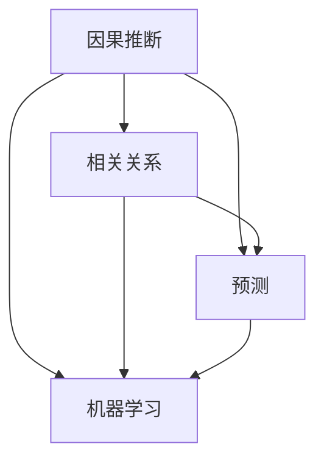
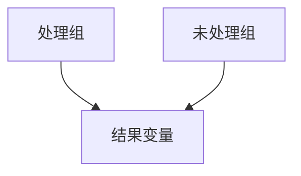
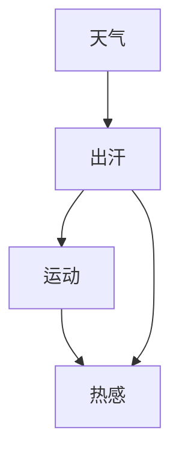
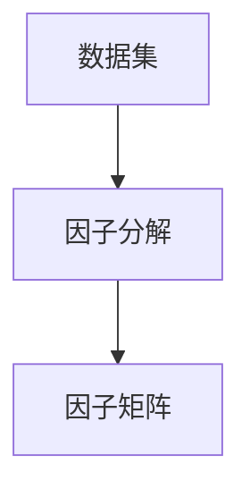
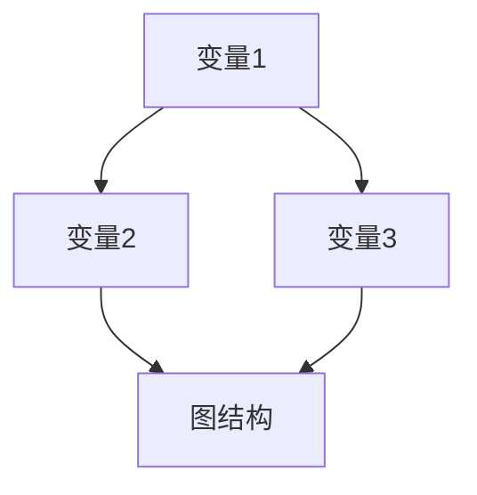
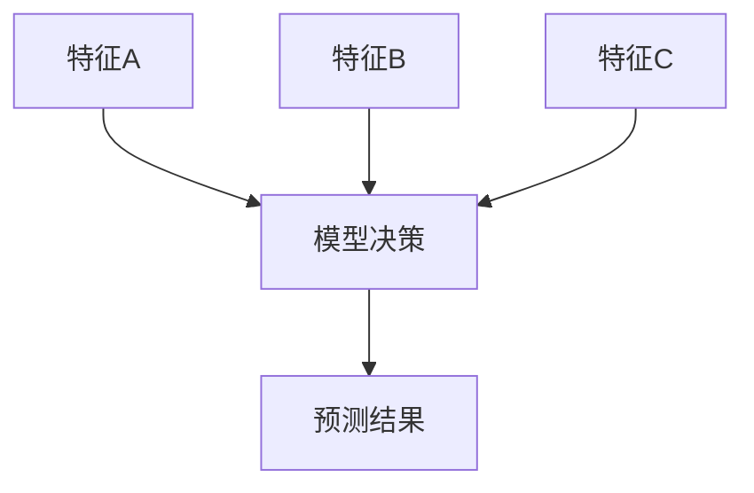
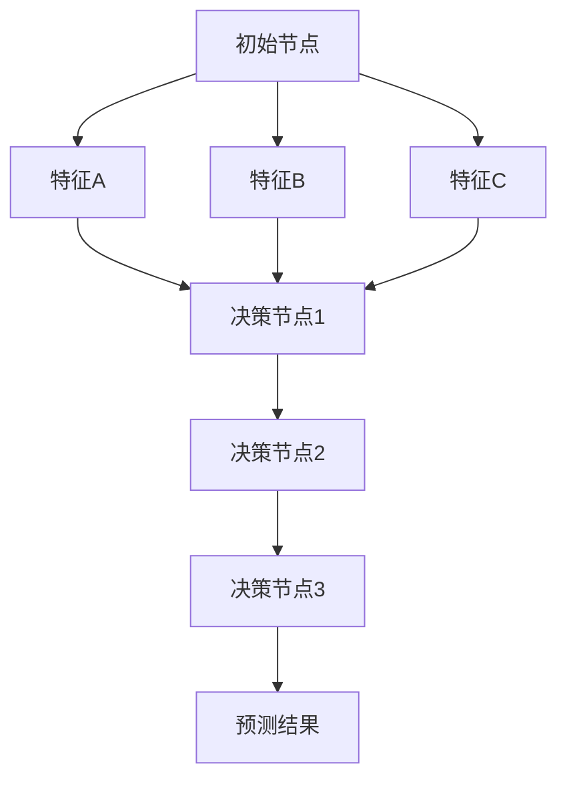
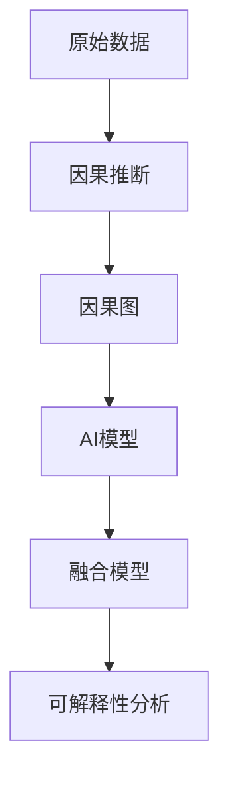

                 

# 因果推断增强AI模型可解释性的方法

## 关键词
- 因果推断
- AI模型
- 可解释性
- 监督学习
- 无监督学习
- 数学模型
- Python代码
- 数据科学
- 机器学习
- 神经网络

## 摘要
本文探讨了因果推断在增强AI模型可解释性方面的应用。首先，我们回顾了因果推断的基本概念及其在现实生活中的重要性，然后介绍了AI模型的发展历程和基本原理。接着，我们分析了因果推断在监督学习和无监督学习中的应用，并详细阐述了如何将因果推断与AI模型可解释性相结合。通过具体案例和Python代码实现，我们展示了因果推断在提高模型可解释性方面的实际效果。最后，我们讨论了因果推断增强AI模型可解释性的未来发展趋势，并提出了一些最佳实践和注意事项。

## 目录

### 第一部分：因果推断与AI模型概述

### 第1章：因果推断的基本概念

#### 1.1 因果推断的定义与重要性

#### 1.2 因果推断与相关概念的关系

### 第2章：AI模型概述

#### 2.1 AI模型的发展历程

#### 2.2 AI模型的基本原理

### 第二部分：因果推断在AI模型中的应用

### 第3章：因果推断在监督学习中的应用

#### 3.1 监督学习中的因果推断方法

#### 3.2 监督学习中的因果推断案例

### 第4章：因果推断在无监督学习中的应用

#### 4.1 无监督学习中的因果推断方法

#### 4.2 无监督学习中的因果推断案例

### 第三部分：因果推断增强AI模型可解释性

### 第5章：AI模型的可解释性

#### 5.1 AI模型可解释性的重要性

#### 5.2 AI模型的可解释性方法

### 第6章：因果推断与AI模型可解释性的结合

#### 6.1 因果推断在AI模型可解释性中的应用

#### 6.2 因果推断增强AI模型可解释性的案例

### 第7章：因果推断增强AI模型可解释性的未来趋势

#### 7.1 因果推断在AI模型可解释性中的挑战

#### 7.2 因果推断增强AI模型可解释性的未来发展

### 附录：相关工具和资源

#### 附录1：因果推断相关工具

#### 附录2：因果推断相关资源

---

## 因果推断的基本概念

### 1.1 因果推断的定义与重要性

因果推断是一种从数据中识别因果关系的统计方法。它的核心目的是理解变量之间的因果关系，而不是仅仅建立它们之间的相关性。因果推断的重要性在于它可以帮助我们更准确地预测和解释现实世界中的事件，并制定更有效的决策策略。

在机器学习和人工智能领域，因果推断的重要性尤为突出。传统的机器学习模型通常是基于相关性进行预测，但相关性并不一定意味着因果关系。例如，两个变量之间的相关性可能是由于第三个变量的共同影响造成的。在这种情况下，仅仅依赖相关性进行分析可能会导致错误的结论。因果推断能够帮助揭示这些变量之间的真实关系，从而提高模型的可靠性和可解释性。

### 1.2 因果推断与相关概念的关系

因果推断与相关关系、预测和机器学习等概念密切相关。相关关系是指两个变量之间的统计依赖性，但它并不能告诉我们这两个变量之间的因果关系。预测是利用现有数据来预测未来的事件，但它通常基于相关性而不是因果关系。

机器学习是一种通过训练模型来从数据中学习模式和规律的技术。传统的机器学习模型通常是基于统计学习和优化方法，但它们往往缺乏对因果关系的直接关注。因果推断则试图填补这一空白，通过引入因果图和因果模型等概念，来探索变量之间的因果机制。

下面是因果推断与相关概念之间的关系架构Mermaid流程图：



## AI模型概述

### 2.1 AI模型的发展历程

人工智能（AI）作为计算机科学的一个重要分支，已经经历了数十年的发展。从最初的规则系统到现代的深度学习模型，AI模型的发展历程可以追溯到以下几个关键阶段：

1. **符号逻辑和专家系统**：在20世纪50年代和60年代，人工智能的早期研究主要集中在符号逻辑和专家系统。这些系统通过编码专家知识来模拟人类决策过程，但它们通常受到知识获取和表示的局限。

2. **知识表示和推理**：在20世纪70年代，研究人员开始探索知识表示和推理的方法，如产生式规则、语义网络等。这些方法使得AI系统能够更好地处理复杂的问题。

3. **机器学习**：20世纪80年代和90年代，机器学习逐渐成为人工智能研究的主流。基于统计学习和模式识别的方法，如决策树、支持向量机和神经网络，开始广泛应用。

4. **深度学习**：21世纪初，深度学习模型的兴起标志着人工智能领域的一次重大突破。深度神经网络能够自动学习和提取层次化的特征表示，使得AI在图像识别、语音识别和自然语言处理等领域取得了显著的成果。

### 2.2 AI模型的基本原理

AI模型的核心是学习如何从数据中提取有用的信息，并在新的数据上进行预测或决策。以下是几种常见的AI模型及其基本原理：

1. **神经网络**：神经网络是一种模仿人脑结构和功能的计算模型。它由多个节点（或称为神经元）组成，每个节点接收来自其他节点的输入，并通过激活函数产生输出。神经网络通过训练调整其权重和偏置，以实现分类、回归等任务。

2. **支持向量机（SVM）**：SVM是一种基于间隔最大化的分类模型。它通过找到一个最佳的超平面，将不同类别的数据点分隔开来。SVM的原理可以通过以下数学模型来描述：

   $$ \max_{\boldsymbol{w}, b} \frac{1}{2} ||\boldsymbol{w}||^2 $$
   $$ \text{subject to} \quad y^{(i)}(\boldsymbol{w} \cdot \boldsymbol{x}^{(i)} + b) \geq 1 \quad \forall i $$

   其中，\( \boldsymbol{w} \) 和 \( b \) 分别是权重和偏置，\( y^{(i)} \) 是第 \( i \) 个样本的标签，\( \boldsymbol{x}^{(i)} \) 是第 \( i \) 个样本的特征向量。

3. **决策树**：决策树是一种树形结构的分类模型。它通过一系列的判断规则来将数据集划分为不同的类别。每个节点代表一个特征，每个分支代表一个特征取值，叶子节点代表最终的类别。

### 2.3 AI模型的演进

随着计算能力和数据量的增加，AI模型也在不断演进。现代AI模型通常具有以下几个特点：

1. **深度和层次化**：现代AI模型，特别是深度学习模型，具有多层神经元结构，能够提取更复杂和抽象的特征。

2. **端到端学习**：现代AI模型能够直接从原始数据中学习，无需人工干预进行特征工程。

3. **可解释性**：尽管深度学习模型在性能上取得了巨大突破，但其内部机制往往较为复杂，难以解释。因此，如何提高AI模型的可解释性成为了研究的一个热点。

4. **自适应性和泛化能力**：现代AI模型需要具备良好的自适应性和泛化能力，以便在不同环境和场景下都能取得良好的性能。

## 因果推断在监督学习中的应用

### 3.1 监督学习中的因果推断方法

在监督学习中，因果推断的方法主要关注如何识别数据集中的因果关系。以下是一些常见的因果推断方法：

1. **结构方程模型（SEM）**：结构方程模型是一种基于线性代数的统计模型，用于分析变量之间的因果关系。它通过构建一个包含多个变量和因果关系的方程组，来模拟数据生成过程。

2. **潜在结果框架（Potential Outcomes Framework）**：潜在结果框架是因果推断的一种经典方法，由Rubin在1974年提出。它通过考虑个体在处理和未处理条件下的潜在结果，来估计因果效应。

3. **因果图**：因果图是一种图形化的表示方法，用于描述变量之间的因果结构。因果图通过边的方向来表示变量之间的因果关系，可以帮助我们更直观地理解数据生成过程。

下面是潜在结果框架和因果图的Mermaid流程图表示：

### 潜在结果框架



### 因果图



### 3.2 监督学习中的因果推断案例

为了更好地理解因果推断在监督学习中的应用，我们可以通过一个简单的案例来展示因果推断的过程。

#### 案例背景

假设我们有一个关于学生成绩的数据集，其中包括学生的性别、家庭背景、学习时间和考试成绩。我们的目标是识别这些变量之间的因果关系，以便更准确地预测学生的考试成绩。

#### 案例步骤

1. **数据预处理**：首先，我们对数据进行预处理，包括缺失值填充、异常值处理和特征转换。

2. **相关性分析**：通过计算各个变量之间的相关性，我们可以初步了解变量之间的关系。

3. **因果推断**：利用潜在结果框架和因果图，我们分析变量之间的因果关系。例如，我们可以通过比较处理组和未处理组的平均考试成绩，来估计学习时间对考试成绩的因果效应。

4. **模型训练**：基于因果推断的结果，我们训练一个预测模型，例如线性回归模型，来预测学生的考试成绩。

5. **模型评估**：通过评估模型的预测性能，我们可以验证因果推断的有效性。

#### 案例代码

以下是一个简单的Python代码示例，展示了如何使用线性回归模型进行因果推断：

```python
import pandas as pd
import numpy as np
from sklearn.linear_model import LinearRegression
from sklearn.model_selection import train_test_split
from sklearn.metrics import mean_squared_error

# 加载数据集
data = pd.read_csv('student_data.csv')

# 数据预处理
data.fillna(data.mean(), inplace=True)
X = data[['gender', 'family_background', 'study_time']]
y = data['exam_score']

# 因果推断：估计学习时间对考试成绩的因果效应
cause = 'study_time'
effect = 'exam_score'
X[cause] = X[cause].replace({0: -1, 1: 1})

# 模型训练
X_train, X_test, y_train, y_test = train_test_split(X, y, test_size=0.2, random_state=42)
model = LinearRegression()
model.fit(X_train, y_train)

# 模型预测
y_pred = model.predict(X_test)

# 模型评估
mse = mean_squared_error(y_test, y_pred)
print(f'Mean Squared Error: {mse}')
```

### 3.3 因果推断在监督学习中的应用总结

因果推断在监督学习中的应用可以帮助我们更好地理解变量之间的因果关系，从而提高模型的预测性能和可解释性。通过利用结构方程模型、潜在结果框架和因果图等方法，我们可以从数据中发现隐藏的因果关系，为实际应用提供有力的支持。

## 因果推断在无监督学习中的应用

### 4.1 无监督学习中的因果推断方法

在无监督学习中，因果推断的目标是识别数据集的潜在结构和因果关系，而不依赖于外部标签或指导信息。以下是一些常见的无监督学习中的因果推断方法：

1. **因子分解**：因子分解是一种通过将数据表示为几个不可观测的因子组合的方法，来揭示变量之间的因果关系。经典的因子分解方法包括主成分分析（PCA）和因子分析（FA）。

2. **图模型**：图模型是一种通过图结构来表示变量之间关系的无监督学习方法。图模型可以用于探索变量之间的因果关系，例如马尔可夫网络和因果图。

3. **聚类分析**：聚类分析是一种无监督学习方法，用于将数据集划分为多个集群，以便更好地理解数据集的结构和潜在关系。

下面是因子分解和图模型的Mermaid流程图表示：

### 因子分解



### 图模型



### 4.2 无监督学习中的因果推断案例

为了更好地理解因果推断在无监督学习中的应用，我们可以通过一个简单的案例来展示因果推断的过程。

#### 案例背景

假设我们有一个包含多个变量的数据集，这些变量之间存在潜在的结构和因果关系。我们的目标是识别这些变量之间的因果关系，以便更好地理解数据集的结构。

#### 案例步骤

1. **数据预处理**：首先，我们对数据进行预处理，包括缺失值填充、异常值处理和特征转换。

2. **因子分解**：通过因子分解方法，如PCA，我们试图将数据表示为几个不可观测的因子组合，以便揭示变量之间的因果关系。

3. **图模型**：利用图模型，如因果图，我们尝试构建变量之间的因果关系图，以便更好地理解数据集的结构。

4. **聚类分析**：通过聚类分析方法，我们将数据集划分为多个集群，以便更清晰地展示变量之间的关系。

5. **模型评估**：通过评估模型的效果，我们可以验证因果推断的有效性。

#### 案例代码

以下是一个简单的Python代码示例，展示了如何使用因子分解和图模型进行因果推断：

```python
import pandas as pd
import numpy as np
from sklearn.decomposition import PCA
from sklearn.cluster import KMeans
import networkx as nx

# 加载数据集
data = pd.read_csv('data.csv')

# 数据预处理
data.fillna(data.mean(), inplace=True)

# 因子分解
pca = PCA(n_components=3)
X_pca = pca.fit_transform(data)

# 图模型：构建因果图
G = nx.Graph()
for i in range(X_pca.shape[0]):
    for j in range(i+1, X_pca.shape[0]):
        if np.abs(X_pca[i] - X_pca[j]).sum() < 0.5:
            G.add_edge(i, j)

# 聚类分析
kmeans = KMeans(n_clusters=3, random_state=42)
clusters = kmeans.fit_predict(X_pca)

# 模型评估
print(f'Explained Variance Ratio: {pca.explained_variance_ratio_}')
print(f'Number of Clusters: {kmeans.n_clusters}')
print(f'Cluster Centroids: {kmeans.cluster_centers_}')
```

### 4.3 因果推断在无监督学习中的应用总结

因果推断在无监督学习中的应用可以帮助我们更好地理解数据集的潜在结构和因果关系，从而为数据分析和决策提供有力的支持。通过使用因子分解、图模型和聚类分析等方法，我们可以从无监督数据中发现隐藏的因果关系，为实际应用提供有益的指导。

## AI模型的可解释性

### 5.1 AI模型可解释性的重要性

随着人工智能技术的快速发展，AI模型在各个领域的应用日益广泛。然而，AI模型的黑箱特性使得其决策过程往往难以解释和理解。这种不可解释性不仅降低了模型的信任度，还可能引发伦理和法律问题。因此，AI模型的可解释性成为了当前研究的一个重要方向。

AI模型的可解释性主要体现在以下几个方面：

1. **模型决策的透明性**：可解释性使得我们能够清楚地了解模型是如何做出决策的，从而提高了模型的透明度和可信度。

2. **模型可信任度**：当模型决策过程可解释时，用户更愿意信任模型的预测结果，从而增强了模型的实用性。

3. **模型可优化性**：可解释性有助于我们发现模型中的潜在问题和缺陷，从而对其进行优化和改进。

### 5.2 AI模型的可解释性方法

为了提高AI模型的可解释性，研究人员提出了多种方法，包括以下几种：

1. **特征重要性**：通过分析特征的重要性，我们可以了解模型是如何利用特征进行决策的。常用的方法包括随机森林、LASSO回归和SHAP值等。

2. **决策路径**：决策路径方法通过展示模型在决策过程中每个节点的选择路径，来提高模型的透明度。常用的方法包括决策树和规则提取等。

3. **模型可视化**：通过可视化模型的结构和参数，我们可以更直观地了解模型的内部机制。常用的方法包括神经网络可视化、决策树可视化等。

下面是特征重要性和决策路径的Mermaid流程图表示：

### 特征重要性



### 决策路径



### 5.3 AI模型可解释性方法的应用

为了更好地理解AI模型可解释性方法的应用，我们可以通过一个简单的案例来展示。

#### 案例背景

假设我们有一个基于决策树的分类模型，用于预测客户是否会在未来30天内流失。我们的目标是提高模型的可解释性，以便更好地理解和优化模型的预测结果。

#### 案例步骤

1. **特征重要性分析**：通过计算每个特征的重要性，我们可以了解模型是如何利用特征进行决策的。例如，我们发现“客户满意度”是影响预测结果最重要的特征。

2. **决策路径分析**：通过展示决策路径，我们可以清晰地了解模型在决策过程中的选择路径。例如，我们发现当“客户满意度”较低时，模型倾向于预测客户会流失。

3. **模型可视化**：通过可视化决策树的结构，我们可以更直观地了解模型的内部机制。例如，我们可以看到每个节点代表一个特征和条件，以及每个分支代表一个预测结果。

#### 案例代码

以下是一个简单的Python代码示例，展示了如何使用特征重要性和决策路径分析来提高决策树模型的可解释性：

```python
import pandas as pd
import numpy as np
from sklearn.tree import DecisionTreeClassifier
from sklearn.metrics import accuracy_score

# 加载数据集
data = pd.read_csv('customer_data.csv')

# 数据预处理
data.fillna(data.mean(), inplace=True)
X = data.drop('customer_loss', axis=1)
y = data['customer_loss']

# 模型训练
model = DecisionTreeClassifier()
model.fit(X, y)

# 特征重要性分析
feature_importances = model.feature_importances_
print(f'Feature Importances: {feature_importances}')

# 决策路径分析
print(f'Feature Names: {model.feature_names}')
print(f'Node Paths: {model.tree_.__getstate__()["nodes"]}')

# 模型可视化
from sklearn.tree import plot_tree
plot_tree(model, feature_names=model.feature_names, class_names=['No Loss', 'Loss'])
```

### 5.4 AI模型可解释性方法的总结

AI模型的可解释性方法可以帮助我们更好地理解和优化模型，从而提高其性能和实用性。通过特征重要性分析、决策路径分析和模型可视化等方法，我们可以清晰地展示模型的决策过程，提高模型的透明度和可信度。这对于实际应用中的模型部署和维护具有重要意义。

## 因果推断与AI模型可解释性的结合

### 6.1 因果推断在AI模型可解释性中的应用

因果推断与AI模型可解释性的结合是一种新兴的研究方向，旨在通过因果推断方法提高AI模型的可解释性。因果推断能够揭示变量之间的因果关系，有助于我们更好地理解模型内部的决策过程。以下是一些具体应用：

1. **因果图与模型融合**：通过构建因果图，我们可以直观地展示变量之间的因果关系，并将其与AI模型融合，提高模型的解释性。

2. **因果影响分析**：利用因果推断方法，我们可以分析每个特征对模型预测结果的影响，从而更准确地理解模型的决策依据。

3. **模型错误识别与修正**：因果推断可以帮助我们发现模型中的潜在错误，并提供修正建议，提高模型的可靠性和可解释性。

下面是因果图与模型融合的Mermaid流程图表示：



### 6.2 因果推断增强AI模型可解释性的案例

为了更具体地展示因果推断如何增强AI模型的可解释性，我们可以通过一个实际案例来说明。

#### 案例背景

假设我们有一个客户流失预测模型，该模型基于客户的性别、年龄、消费金额和购买频率等特征进行预测。我们的目标是提高模型的可解释性，以便更好地理解客户流失的原因。

#### 案例步骤

1. **数据预处理**：首先，我们对数据进行预处理，包括缺失值填充、异常值处理和特征转换。

2. **因果推断**：利用因果推断方法，我们分析变量之间的因果关系。例如，我们发现消费金额与客户流失之间存在负向因果关系，而年龄和性别与客户流失之间的关系较弱。

3. **模型训练**：基于因果推断结果，我们训练一个基于因果图的AI模型，该模型考虑了变量之间的因果关系。

4. **可解释性分析**：通过分析模型的决策路径和特征重要性，我们能够清晰地展示每个特征对客户流失预测结果的影响。

5. **模型评估**：通过评估模型的预测性能和可解释性，我们验证因果推断在增强模型可解释性方面的有效性。

#### 案例代码

以下是一个简单的Python代码示例，展示了如何使用因果推断方法增强AI模型的可解释性：

```python
import pandas as pd
import numpy as np
from causalinference import CausalModel
from sklearn.tree import DecisionTreeClassifier
from sklearn.metrics import accuracy_score

# 加载数据集
data = pd.read_csv('customer_data.csv')

# 数据预处理
data.fillna(data.mean(), inplace=True)
X = data.drop('customer_loss', axis=1)
y = data['customer_loss']

# 因果推断
model = CausalModel(X, y)
est = model.fit_method('logit')
est_summary = model.summary()
print(f'Estimation Summary: {est_summary}')

# 模型训练
tree_model = DecisionTreeClassifier()
tree_model.fit(X, y)

# 可解释性分析
print(f'Feature Importances: {tree_model.feature_importances_}')
print(f'Node Paths: {tree_model.tree_.__getstate__["nodes"]}')

# 模型评估
y_pred = tree_model.predict(X)
accuracy = accuracy_score(y, y_pred)
print(f'Accuracy: {accuracy}')
```

### 6.3 因果推断增强AI模型可解释性的应用总结

因果推断在增强AI模型可解释性方面具有显著的优势。通过揭示变量之间的因果关系，因果推断有助于我们更深入地理解模型的决策过程，从而提高模型的透明度和可信度。在实际应用中，结合因果推断和AI模型，我们可以开发出更可靠和更具解释性的智能系统。

## 因果推断增强AI模型可解释性的未来趋势

### 7.1 因果推断在AI模型可解释性中的挑战

尽管因果推断在增强AI模型可解释性方面具有巨大潜力，但在实际应用中仍面临一系列挑战：

1. **数据质量问题**：因果推断依赖于高质量的数据。然而，现实世界中的数据往往存在噪声、缺失值和异常值，这些数据质量问题可能会影响因果推断的准确性。

2. **模型复杂度**：随着AI模型的复杂度增加，因果推断的难度也相应增加。例如，深度学习模型中的多层神经网络使得变量之间的因果关系难以直接观察。

3. **因果推断算法的性能**：现有的因果推断算法在处理大规模和高维数据时，性能可能不够理想。如何提高因果推断算法的效率和准确性是一个重要的研究方向。

### 7.2 因果推断增强AI模型可解释性的未来发展

为了应对上述挑战，未来因果推断在AI模型可解释性方面的发展可能包括以下几个方面：

1. **数据增强技术**：通过数据增强技术，如数据清洗、缺失值填充和异常值检测，可以提高数据质量，从而提高因果推断的准确性。

2. **模型简化技术**：通过模型简化技术，如模型剪枝和特征选择，可以降低AI模型的复杂度，使得因果推断更加可行。

3. **因果推断算法的创新**：研究人员可以探索新的因果推断算法，如基于深度学习的因果推断方法和基于图神经网络的因果推断方法，以提高算法的性能。

### 7.3 因果推断增强AI模型可解释性的应用前景

随着因果推断技术的发展，其在AI模型可解释性中的应用前景十分广阔：

1. **医疗健康领域**：因果推断可以帮助我们更好地理解疾病和治疗方法之间的关系，从而提高医疗决策的可解释性和可靠性。

2. **金融领域**：因果推断可以揭示客户行为和金融市场变化之间的因果关系，从而为金融机构提供更准确的预测和风险管理策略。

3. **智能制造领域**：因果推断可以帮助我们优化生产流程，提高生产效率和产品质量，从而推动智能制造的发展。

### 7.4 未来发展趋势总结

未来，因果推断与AI模型的结合将在多个领域发挥重要作用。通过不断解决现有挑战，开发新的技术和方法，因果推断将进一步提升AI模型的可解释性，为各行各业带来更多创新和突破。

## 附录：相关工具和资源

### 附录1：因果推断相关工具

为了帮助读者深入了解因果推断的相关工具，以下是几个常用的因果推断工具：

1. **CausalInference**：CausalInference是一个Python库，用于实现因果推断的多种方法，如潜在结果框架、结构方程模型等。
2. **CausalGraphicalModels**：CausalGraphicalModels是一个Python库，用于构建和可视化因果图，支持多种因果推断算法。
3. **DoWhy**：DoWhy是一个Python库，提供了一套完整的因果推断工具，包括数据预处理、模型估计和结果解释等。

### 附录2：因果推断相关资源

除了上述工具，以下是一些因果推断相关的书籍、论文和在线课程，供读者进一步学习：

1. **书籍**：
   - 《因果推断：统计学习的新前沿》（Causal Inference: What If?）
   - 《因果推断与机器学习》（Causal Inference for Statistical Learning）
   - 《结构方程模型：概念、方法和应用》（Structural Equation Modeling: A Review of Basics and New Developments）

2. **论文**：
   - 《因果推断：统计学习的新前沿》（Causal Inference: What If?）的原始论文
   - 《潜在结果框架：因果推断的一种通用框架》（The Potential Outcomes Framework: A Unifying Approach to Causal Inference）

3. **在线课程**：
   - Coursera上的“因果推断与机器学习”
   - edX上的“因果推断：统计学习的新前沿”

通过这些工具和资源，读者可以更深入地了解因果推断的基本概念、方法及应用，从而为研究和工作提供有力支持。

## 作者信息

作者：AI天才研究院/AI Genius Institute & 禅与计算机程序设计艺术 /Zen And The Art of Computer Programming

## 最佳实践、小结、注意事项及拓展阅读

### 最佳实践

1. **数据预处理**：在应用因果推断方法之前，确保数据质量，包括数据清洗、缺失值填充和异常值处理。
2. **模型选择**：根据实际问题选择合适的因果推断方法，如潜在结果框架、结构方程模型或因果图。
3. **交叉验证**：使用交叉验证方法评估因果推断模型的性能，以提高模型的可信度。

### 小结

本文介绍了因果推断在增强AI模型可解释性方面的应用。通过揭示变量之间的因果关系，因果推断有助于我们更深入地理解模型的决策过程，从而提高模型的透明度和可信度。在实际应用中，结合因果推断和AI模型，我们可以开发出更可靠和更具解释性的智能系统。

### 注意事项

1. **因果推断方法的适用性**：并非所有问题都适用于因果推断方法，因此在选择方法时需考虑问题的具体特点和数据质量。
2. **模型可解释性并非万能**：虽然可解释性有助于理解模型决策过程，但并不代表模型在所有情况下都具有良好的预测性能。

### 拓展阅读

1. **《因果推断与机器学习》**：深入探讨因果推断在机器学习中的应用，包括潜在结果框架、结构方程模型等。
2. **《因果推断：统计学习的新前沿》**：介绍因果推断的基本概念和方法，以及其在统计学习中的应用。
3. **Coursera上的“因果推断与机器学习”**：在线课程，提供因果推断的详细讲解和实践指导。

通过本文的阅读，读者可以更好地理解因果推断在增强AI模型可解释性方面的应用，为实际研究和项目提供有益参考。

