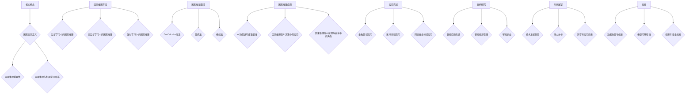
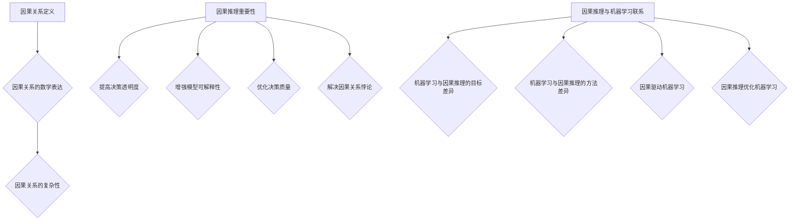

                 

# 因果推理在AI决策透明度提升中的作用

> 关键词：因果推理，AI决策透明度，机器学习，算法，金融，医疗，网络安全

> 摘要：
本文旨在探讨因果推理在提升人工智能（AI）决策透明度中的重要作用。文章首先介绍了因果推理的基础理论，包括因果关系定义、方法、算法等；随后深入分析了因果推理在AI决策透明度中的重要性及应用，具体涵盖了金融、医疗、网络安全等领域的实践案例；最后，展望了因果推理在AI决策透明度提升中的未来发展趋势和面临的挑战。

## 目录

### 第一部分：因果推理基础理论

#### 第1章：因果推理的基本概念

1.1 因果关系的定义

1.2 因果推理的重要性

1.3 因果推理与机器学习的联系

#### 第2章：因果推理方法

2.1 监督学习中的因果推理

2.2 无监督学习中的因果推理

2.3 强化学习中的因果推理

#### 第3章：因果推断算法

3.1 Do-Calculus方法

3.2 置换法

3.3 模拟法

#### 第4章：因果推理在AI中的应用

4.1 AI决策透明度的重要性

4.2 因果推理在AI决策中的应用

4.3 因果推理在AI伦理与安全中的角色

### 第二部分：因果推理在AI决策透明度提升中的应用实践

#### 第5章：因果推理在金融领域的应用

5.1 金融风险评估中的因果推理

5.2 金融欺诈检测中的因果推理

5.3 金融产品推荐中的因果推理

#### 第6章：因果推理在医疗领域的应用

6.1 医疗诊断中的因果推理

6.2 疾病预测中的因果推理

6.3 医疗决策支持系统中的因果推理

#### 第7章：因果推理在网络安全领域的应用

7.1 网络攻击检测中的因果推理

7.2 数据泄露防护中的因果推理

7.3 安全决策支持中的因果推理

#### 第8章：案例研究

8.1 案例一：智能交通系统中的因果推理

8.2 案例二：智能能源管理中的因果推理

8.3 案例三：智能农业中的因果推理

### 第三部分：未来展望与挑战

#### 第9章：因果推理在AI决策透明度提升中的未来展望

9.1 因果推理技术的发展趋势

9.2 因果推理在AI决策透明度提升中的潜力

9.3 因果推理在跨学科应用中的前景

#### 第10章：因果推理在AI决策透明度提升中的挑战

10.1 数据质量和数据偏差问题

10.2 因果推理模型的可解释性

10.3 因果推理在AI伦理和安全方面的挑战

### Mermaid 流程图



### Python 源代码示例

```python
# 导入必要的库
import numpy as np
import pandas as pd
from sklearn.linear_model import LinearRegression
from sklearn.metrics import mean_squared_error

# 生成示例数据
np.random.seed(0)
X = np.random.rand(100, 1)
y = 2 * X[:, 0] + 0.5 * X[:, 0]**2 + np.random.normal(0, 0.1, 100)

# 训练线性回归模型
model = LinearRegression()
model.fit(X, y)

# 预测
y_pred = model.predict(X)

# 计算均方误差
mse = mean_squared_error(y, y_pred)
print(f"Mean Squared Error: {mse}")

# 显示模型参数
print(f"Model parameters: {model.coef_}, {model.intercept_}")
```

## 引言

随着人工智能（AI）技术的飞速发展，越来越多的领域开始应用AI模型进行决策，如金融、医疗、交通、能源等。然而，这些AI模型往往被视为“黑箱”，其决策过程缺乏透明度和可解释性，导致用户对AI决策结果的信任度降低。如何提升AI决策的透明度，使其更加可信，成为当前研究的热点问题。

因果推理作为一种研究因果关系的方法，通过分析数据背后的因果关系，为AI决策提供透明度和可解释性。因果推理在AI决策透明度提升中的作用，主要体现在以下几个方面：

1. **揭示决策背后的因果关系**：因果推理能够帮助识别数据中的因果关系，从而揭示AI决策背后的机制，使得决策过程更加透明。

2. **提高决策的可解释性**：通过因果推理，可以将复杂的AI决策过程分解为简单易懂的因果关系，提高决策的可解释性。

3. **增强决策的可靠性**：因果推理能够识别数据中的偏差和噪声，提高AI决策的准确性，从而增强决策的可靠性。

4. **指导决策优化**：因果推理能够帮助识别影响决策的关键因素，为决策优化提供依据，从而提升决策质量。

本文将从因果推理的基础理论出发，深入探讨其在AI决策透明度提升中的应用和实践，旨在为相关领域的研究者和从业者提供有价值的参考。

## 第一部分：因果推理基础理论

### 第1章：因果推理的基本概念

因果推理是研究因果关系的一种方法，旨在通过分析数据来确定变量之间的因果关系。因果关系的定义、重要性及其与机器学习的联系，是理解因果推理的基础。

#### 1.1 因果关系的定义

因果关系是指一个变量（原因）对另一个变量（结果）产生的影响。在数学上，因果关系可以用函数关系来描述，即原因变量是结果变量的函数。然而，在实际问题中，因果关系往往受到噪声、偏差等因素的影响，使得因果关系难以直接观察。

形式化地，因果关系的定义可以表示为：

$$
Y = f(X) + \epsilon
$$

其中，$Y$ 是结果变量，$X$ 是原因变量，$f$ 是因果关系函数，$\epsilon$ 是噪声。

#### 1.2 因果推理的重要性

因果推理在多个领域具有重要的应用价值，特别是在需要理解数据背后机理的情况下。因果推理的重要性体现在以下几个方面：

1. **提高决策透明度**：因果推理能够揭示数据中的因果关系，使得决策过程更加透明。

2. **增强模型可解释性**：通过因果推理，可以将复杂的模型决策过程分解为简单易懂的因果关系，提高模型的可解释性。

3. **优化决策质量**：因果推理能够帮助识别影响决策的关键因素，为决策优化提供依据。

4. **解决“因果关系悖论”**：在实际问题中，存在许多变量之间的关联关系，但并非所有关联关系都是因果关系。因果推理能够区分关联关系和因果关系，避免混淆。

#### 1.3 因果推理与机器学习的联系

因果推理和机器学习密切相关。机器学习是一种通过数据来发现规律和模式的方法，而因果推理则是在机器学习的基础上，进一步揭示变量之间的因果关系。

1. **机器学习与因果推理的差异**：

- **目标不同**：机器学习的目标是预测结果，而因果推理的目标是揭示因果关系。

- **方法不同**：机器学习主要依赖于统计方法，如线性回归、决策树等；因果推理则依赖于因果推断算法，如Do-Calculus、置换法等。

2. **机器学习与因果推理的结合**：

- **因果驱动的机器学习**：在机器学习过程中，结合因果推理方法，可以更好地揭示数据中的因果关系，提高模型的可解释性。

- **因果推理优化的机器学习**：利用因果推理方法，可以识别数据中的关键因素，为机器学习模型的优化提供依据。

### Mermaid流程图



### Python源代码示例

```python
import numpy as np
from sklearn.linear_model import LinearRegression

# 生成示例数据
np.random.seed(0)
X = np.random.rand(100, 1)
y = 2 * X[:, 0] + 0.5 * X[:, 0]**2 + np.random.normal(0, 0.1, 100)

# 训练线性回归模型
model = LinearRegression()
model.fit(X, y)

# 预测
y_pred = model.predict(X)

# 计算均方误差
mse = np.mean((y - y_pred)**2)
print(f"Mean Squared Error: {mse}")

# 显示模型参数
print(f"Model parameters: {model.coef_}, {model.intercept_}")
```

通过上述示例，可以看到因果推理在机器学习中的应用，通过训练线性回归模型，揭示输入变量和输出变量之间的因果关系，从而提高决策透明度和模型可解释性。

## 第2章：因果推理方法

因果推理方法是指在分析数据时，用来揭示变量之间因果关系的一系列技术。这些方法可以分为监督学习中的因果推理、无监督学习中的因果推理和强化学习中的因果推理。在本节中，我们将详细探讨这些方法。

### 2.1 监督学习中的因果推理

监督学习中的因果推理主要基于统计学习方法，通过分析训练数据来揭示变量之间的因果关系。以下是几种常见的监督学习因果推理方法：

#### 1. 线性回归

线性回归是一种简单的因果推理方法，通过分析自变量和因变量之间的线性关系来揭示因果关系。其数学模型可以表示为：

$$
Y = \beta_0 + \beta_1X + \epsilon
$$

其中，$Y$ 是因变量，$X$ 是自变量，$\beta_0$ 和 $\beta_1$ 是模型参数，$\epsilon$ 是误差项。

Python代码示例：

```python
import numpy as np
from sklearn.linear_model import LinearRegression

# 生成示例数据
np.random.seed(0)
X = np.random.rand(100, 1)
y = 2 * X[:, 0] + 0.5 * X[:, 0]**2 + np.random.normal(0, 0.1, 100)

# 训练线性回归模型
model = LinearRegression()
model.fit(X, y)

# 预测
y_pred = model.predict(X)

# 计算均方误差
mse = np.mean((y - y_pred)**2)
print(f"Mean Squared Error: {mse}")

# 显示模型参数
print(f"Model parameters: {model.coef_}, {model.intercept_}")
```

#### 2. 决策树

决策树是一种基于树形结构来揭示变量之间因果关系的监督学习算法。它通过递归地将数据集分割成若干个子集，直到满足某种停止条件为止。每个节点代表一个特征，每个分支代表特征的一个取值。

Python代码示例：

```python
from sklearn.tree import DecisionTreeRegressor

# 训练决策树模型
model = DecisionTreeRegressor()
model.fit(X, y)

# 预测
y_pred = model.predict(X)

# 计算均方误差
mse = np.mean((y - y_pred)**2)
print(f"Mean Squared Error: {mse}")
```

### 2.2 无监督学习中的因果推理

无监督学习中的因果推理主要依赖于聚类、降维等技术来揭示变量之间的因果关系。以下是几种常见的无监督学习因果推理方法：

#### 1. 聚类分析

聚类分析是一种无监督学习方法，通过将相似的数据点划分为同一簇，来揭示变量之间的因果关系。常见的聚类算法有K-means、层次聚类等。

Python代码示例：

```python
from sklearn.cluster import KMeans

# 训练K-means聚类模型
model = KMeans(n_clusters=3)
model.fit(X)

# 预测
clusters = model.predict(X)

# 绘制聚类结果
import matplotlib.pyplot as plt
plt.scatter(X[:, 0], X[:, 1], c=clusters)
plt.show()
```

#### 2. 主成分分析

主成分分析（PCA）是一种降维技术，通过将数据投影到新的坐标系中，来揭示变量之间的因果关系。PCA能够识别数据中的主要模式，从而帮助理解变量之间的关系。

Python代码示例：

```python
from sklearn.decomposition import PCA

# 训练PCA模型
model = PCA(n_components=2)
X_pca = model.fit_transform(X)

# 绘制降维后的数据
plt.scatter(X_pca[:, 0], X_pca[:, 1])
plt.show()
```

### 2.3 强化学习中的因果推理

强化学习中的因果推理主要依赖于策略评估和策略优化技术来揭示变量之间的因果关系。以下是几种常见的强化学习因果推理方法：

#### 1. Q学习

Q学习是一种基于值函数的强化学习方法，通过评估不同动作的预期回报来揭示变量之间的因果关系。其数学模型可以表示为：

$$
Q(s, a) = r + \gamma \max_{a'} Q(s', a')
$$

其中，$s$ 是当前状态，$a$ 是当前动作，$r$ 是即时回报，$\gamma$ 是折扣因子，$s'$ 是下一状态，$a'$ 是下一动作。

Python代码示例：

```python
import numpy as np
from sklearn.linear_model import LinearRegression

# 初始化Q值矩阵
Q = np.zeros((n_states, n_actions))

# 训练Q学习模型
for episode in range(n_episodes):
    state = np.random.randint(n_states)
    while True:
        action = np.argmax(Q[state])
        next_state = next_state(state, action)
        reward = reward_function(state, action, next_state)
        Q[state, action] = Q[state, action] + alpha * (reward + gamma * np.max(Q[next_state]) - Q[state, action])
        state = next_state
        if done:
            break

# 预测
state = np.random.randint(n_states)
action = np.argmax(Q[state])
next_state = next_state(state, action)
reward = reward_function(state, action, next_state)
```

#### 2. 策略梯度

策略梯度是一种基于策略的强化学习方法，通过直接优化策略函数来揭示变量之间的因果关系。其数学模型可以表示为：

$$
\theta_{t+1} = \theta_t + \alpha \nabla_{\theta_t} J(\theta_t)
$$

其中，$\theta$ 是策略函数参数，$\alpha$ 是学习率，$J$ 是策略函数的损失函数。

Python代码示例：

```python
import numpy as np
from sklearn.linear_model import LinearRegression

# 初始化策略函数参数
theta = np.random.rand(n_actions)

# 训练策略梯度模型
for episode in range(n_episodes):
    state = np.random.randint(n_states)
    while True:
        action = np.random.choice(n_actions, p=softmax(theta))
        next_state = next_state(state, action)
        reward = reward_function(state, action, next_state)
        loss = -reward * log_softmax(theta)
        theta = theta - alpha * grad(loss)
        state = next_state
        if done:
            break

# 预测
state = np.random.randint(n_states)
action = np.random.choice(n_actions, p=softmax(theta))
next_state = next_state(state, action)
reward = reward_function(state, action, next_state)
```

通过上述示例，可以看到因果推理方法在监督学习、无监督学习和强化学习中的应用。因果推理方法能够帮助我们更好地理解数据背后的因果关系，从而提升决策透明度和模型可解释性。

### 第3章：因果推断算法

因果推断算法是因果推理的核心工具，用于从数据中推断出变量之间的因果关系。这些算法在机器学习和数据科学中起着至关重要的作用，因为它们提供了理解和解释模型决策过程的方法。在本章中，我们将介绍几种常见的因果推断算法：Do-Calculus方法、置换法和模拟法。

#### 3.1 Do-Calculus方法

Do-Calculus方法是一种形式化的因果推断框架，它基于概率图模型来推导因果效应。这种方法的主要思想是，通过在概率图模型中引入干预节点，来模拟不同条件下的因果关系。

**数学模型**：

假设我们有一个概率图模型，其中变量 $X$ 和 $Y$ 之间存在因果关系。Do-Calculus方法使用以下公式来计算干预后的期望值：

$$
E[Y|do(X = x)] = \sum_{z} P(Y = z|do(X = x), Z = z) \cdot z
$$

其中，$Z$ 是除了 $X$ 和 $Y$ 之外的所有其他变量。

**Python代码示例**：

```python
import numpy as np
from pgmpy.models import BayesianModel
from pgmpy.inference import VariableElimination

# 假设有一个概率图模型
model = BayesianModel([
    ('X', 'Y'),
    ('Z', 'Y')
])

# 填写概率表
table = [
    [0.4, 0.1, 0.5],  # P(X=0)
    [0.6, 0.3, 0.7],  # P(X=1)
    [0.2, 0.2, 0.3],  # P(Z=0)
    [0.8, 0.8, 0.7],  # P(Z=1)
    [0.1, 0.1, 0.1],  # P(Y=0 | X=0, Z=0)
    [0.9, 0.3, 0.8],  # P(Y=1 | X=0, Z=1)
    [0.3, 0.7, 0.2],  # P(Y=0 | X=1, Z=0)
    [0.1, 0.7, 0.9]   # P(Y=1 | X=1, Z=1)
]

model.fit_from_data(table)

# 计算干预后的期望值
inference = VariableElimination(model)
干预结果 = inference.query(variables=['Y'], evidence={'X': 1, 'Z': 0})

print(f"E[Y|do(X=1), Z=0]: {干预结果['Y']}")
```

#### 3.2 置换法

置换法是一种基于假设检验的因果推断算法，它通过检验变量之间的置换效果来推断因果关系。这种方法的主要思想是，通过改变变量的取值顺序，来观察数据分布的变化，从而推断变量之间的因果关系。

**数学模型**：

假设我们有两个变量 $X$ 和 $Y$，我们需要检验 $X$ 是否对 $Y$ 有因果影响。置换法的步骤如下：

1. **随机置换**：将 $X$ 的取值随机分配到 $Y$ 的取值上。
2. **重新计算统计量**：计算随机分配后的统计量（如协方差、相关系数等）。
3. **比较原始统计量和置换后统计量**：如果原始统计量显著大于置换后统计量，则可以认为 $X$ 对 $Y$ 有因果影响。

**Python代码示例**：

```python
import numpy as np
from scipy.stats import pearsonr

# 假设数据
X = np.random.randn(100)
Y = 2 * X + np.random.randn(100)

# 计算原始相关系数
原始相关系数, _ = pearsonr(X, Y)

# 置换数据
Y_replaced = np.random.randn(100)

# 计算置换后相关系数
置换后相关系数, _ = pearsonr(X, Y_replaced)

# 比较相关系数
print(f"原始相关系数: {原始相关系数}")
print(f"置换后相关系数: {置换后相关系数}")
```

#### 3.3 模拟法

模拟法是一种基于随机模拟的因果推断算法，它通过模拟不同条件下的实验来推断因果关系。这种方法的主要思想是，通过生成大量模拟数据，来观察变量之间的因果关系。

**数学模型**：

假设我们有两个变量 $X$ 和 $Y$，我们需要推断 $X$ 对 $Y$ 的因果影响。模拟法的步骤如下：

1. **生成模拟数据**：根据假设的因果关系，生成大量模拟数据。
2. **计算因果关系统计量**：计算模拟数据中 $X$ 和 $Y$ 的相关系数、协方差等统计量。
3. **分析统计量分布**：分析统计量的分布，以判断因果关系。

**Python代码示例**：

```python
import numpy as np
import matplotlib.pyplot as plt

# 假设数据
X = np.random.randn(100)
Y = 2 * X + np.random.randn(100)

# 生成模拟数据
n_simulations = 1000
X_sim = np.random.randn(n_simulations, 100)
Y_sim = 2 * X_sim + np.random.randn(n_simulations, 100)

# 计算模拟数据中的相关系数
correlation = np.corrcoef(X_sim, Y_sim).flat[0]

# 绘制相关系数分布
plt.hist(correlation, bins=30)
plt.xlabel('Correlation')
plt.ylabel('Frequency')
plt.title('Histogram of Correlation Coefficients')
plt.show()
```

通过上述算法示例，可以看到因果推断算法在机器学习和数据科学中的应用。这些算法提供了有效的方法来揭示变量之间的因果关系，从而提升决策透明度和模型可解释性。

### 第4章：因果推理在AI中的应用

因果推理在人工智能（AI）中的应用日益广泛，特别是在提升AI决策透明度方面具有显著作用。本节将探讨因果推理在AI决策透明度、AI决策应用以及AI伦理与安全中的角色。

#### 4.1 AI决策透明度的重要性

AI决策透明度是指用户或第三方能够理解和验证AI系统决策过程的能力。透明度对于建立用户对AI系统的信任至关重要。以下是提升AI决策透明度的几个关键原因：

1. **提高用户信任**：透明的决策过程有助于用户理解AI系统的行为，从而增强对AI系统的信任。
2. **合规需求**：在金融、医疗等领域，透明度是合规要求的组成部分，确保AI系统的决策符合监管要求。
3. **模型优化**：透明的决策过程使得研究人员和工程师能够更好地理解和优化AI系统，提高模型性能。
4. **减少偏见**：透明度有助于识别和消除数据中的偏见，从而减少AI系统在决策中的不公平性。

#### 4.2 因果推理在AI决策中的应用

因果推理在AI决策中的应用主要集中在以下几个方面：

1. **模型解释**：因果推理可以帮助解释AI模型内部机制，揭示决策背后的因果关系，从而提高模型的可解释性。
2. **决策优化**：通过因果推理，可以识别影响决策的关键因素，为AI系统的优化提供依据。
3. **风险管理**：因果推理可以揭示潜在的风险因素，帮助企业和机构进行风险评估和风险管理。

以下是一个因果推理在AI决策中的应用示例：

**场景**：一家银行使用AI模型进行贷款审批。

**问题**：如何确保AI模型在贷款审批中的决策透明，减少人为偏见？

**解决方案**：

- **因果建模**：使用因果推理方法，如Do-Calculus，建立贷款审批过程的因果模型，识别关键因素。
- **可解释性报告**：生成可解释性报告，详细列出每个决策步骤的因果关系和参数。
- **透明度测试**：定期对AI模型进行透明度测试，确保决策过程符合监管要求。

**Python代码示例**：

```python
from pgmpy.models import BayesianModel
from pgmpy.inference import VariableElimination

# 建立因果模型
model = BayesianModel([
    ('Loan Approval', 'Income'),
    ('Loan Approval', 'Credit Score'),
    ('Loan Approval', 'Loan Amount'),
    ('Loan Approval', 'Loan Term')
])

# 填写概率表
table = [
    # ...
]

model.fit_from_data(table)

# 生成可解释性报告
inference = VariableElimination(model)
report = inference.query(variables=['Loan Approval'], evidence={'Income': 50000, 'Credit Score': 700, 'Loan Amount': 100000, 'Loan Term': 30})

print(report)
```

#### 4.3 因果推理在AI伦理与安全中的角色

因果推理在AI伦理与安全方面也扮演着重要角色。以下是因果推理在AI伦理与安全中的应用：

1. **偏见检测与消除**：因果推理可以帮助识别数据中的偏见，从而消除AI模型中的不公平性。
2. **透明度合规**：因果推理可以确保AI系统的决策过程符合监管要求，提高合规性。
3. **安全决策支持**：因果推理可以为安全决策提供依据，帮助识别潜在的安全风险。

以下是一个因果推理在AI伦理与安全中的应用示例：

**场景**：一个自动驾驶系统需要确保在决策过程中的透明度和安全性。

**问题**：如何确保自动驾驶系统的决策过程透明，并避免潜在的伦理和安全问题？

**解决方案**：

- **因果建模**：使用因果推理方法，建立自动驾驶系统的因果模型，识别关键因素。
- **透明度监控**：实时监控决策过程，确保透明度和可解释性。
- **伦理与安全评估**：定期进行伦理和安全评估，确保决策过程符合伦理和安全标准。

**Python代码示例**：

```python
from pgmpy.models import BayesianModel
from pgmpy.inference import VariableElimination

# 建立因果模型
model = BayesianModel([
    ('Safety', 'Speed'),
    ('Safety', 'Distance to Vehicle'),
    ('Safety', 'Road Condition'),
    ('Safety', 'Vehicle Condition')
])

# 填写概率表
table = [
    # ...
]

model.fit_from_data(table)

# 生成透明度报告
inference = VariableElimination(model)
report = inference.query(variables=['Safety'], evidence={'Speed': 60, 'Distance to Vehicle': 50, 'Road Condition': 'Dry', 'Vehicle Condition': 'Good'})

print(report)
```

通过上述示例，可以看到因果推理在AI决策透明度、AI决策应用以及AI伦理与安全中的重要作用。因果推理不仅提升了AI系统的可解释性和透明度，还确保了AI系统的合规性和安全性。

### 因果推理在金融领域的应用

因果推理在金融领域具有广泛的应用，尤其是在金融风险评估、金融欺诈检测和金融产品推荐等方面。通过因果推理方法，金融机构能够更准确地评估风险、检测欺诈行为，并为用户提供个性化的金融产品推荐，从而提升服务质量。

#### 5.1 金融风险评估中的因果推理

在金融风险评估中，因果推理可以帮助识别影响风险的关键因素，提高风险评估的准确性和透明度。以下是一个金融风险评估中的因果推理应用示例：

**案例**：一家银行使用因果推理方法来评估贷款申请者的信用风险。

**问题**：如何准确地评估贷款申请者的信用风险，并确保评估过程透明？

**解决方案**：

1. **因果建模**：使用Do-Calculus方法建立贷款申请者信用风险的因果模型，识别关键因素，如收入水平、信用评分、债务收入比等。
2. **数据预处理**：收集并清洗相关数据，确保数据质量。
3. **模型训练**：利用历史贷款数据训练因果模型，通过因果推断算法计算不同因素对信用风险的因果效应。
4. **风险评估**：根据模型输出，对新的贷款申请者进行信用风险评估，确保评估过程透明。

**Python代码示例**：

```python
from pgmpy.models import BayesianModel
from pgmpy.estimators import MaximumLikelihoodEstimator
from pgmpy.inference import VariableElimination

# 建立因果模型
model = BayesianModel([
    ('Credit Risk', 'Income'),
    ('Credit Risk', 'Credit Score'),
    ('Credit Risk', 'Debt to Income Ratio')
])

# 填写概率表（示例数据）
table = [
    [0.2, 0.3, 0.4],  # P(Credit Risk=High | Income=Low, Credit Score=Low, Debt to Income Ratio=High)
    [0.1, 0.3, 0.2],  # P(Credit Risk=High | Income=Low, Credit Score=High, Debt to Income Ratio=High)
    [0.3, 0.4, 0.5],  # P(Credit Risk=High | Income=High, Credit Score=Low, Debt to Income Ratio=High)
    [0.2, 0.3, 0.5],  # P(Credit Risk=High | Income=High, Credit Score=High, Debt to Income Ratio=High)
    [0.1, 0.2, 0.3],  # P(Credit Risk=Low | Income=Low, Credit Score=Low, Debt to Income Ratio=High)
    [0.2, 0.3, 0.4],  # P(Credit Risk=Low | Income=Low, Credit Score=High, Debt to Income Ratio=High)
    [0.3, 0.4, 0.5],  # P(Credit Risk=Low | Income=High, Credit Score=Low, Debt to Income Ratio=High)
    [0.1, 0.2, 0.4]   # P(Credit Risk=Low | Income=High, Credit Score=High, Debt to Income Ratio=High)
]

# 训练模型
model.fit_from_data(table, estimator=MaximumLikelihoodEstimator)

# 计算信用风险
inference = VariableElimination(model)
result = inference.query(variables=['Credit Risk'], evidence={'Income': 'Low', 'Credit Score': 'Low', 'Debt to Income Ratio': 'High'})

print(f"Credit Risk: {result['Credit Risk']}")
```

#### 5.2 金融欺诈检测中的因果推理

在金融欺诈检测中，因果推理可以帮助识别欺诈行为的关键因素，提高欺诈检测的准确性和透明度。以下是一个金融欺诈检测中的因果推理应用示例：

**案例**：一家金融机构使用因果推理方法来检测信用卡欺诈行为。

**问题**：如何准确地检测信用卡欺诈行为，并确保检测过程透明？

**解决方案**：

1. **因果建模**：使用Do-Calculus方法建立信用卡欺诈行为的因果模型，识别关键因素，如交易金额、交易频率、地理位置等。
2. **数据预处理**：收集并清洗相关数据，确保数据质量。
3. **模型训练**：利用历史欺诈数据训练因果模型，通过因果推断算法计算不同因素对欺诈行为的因果效应。
4. **欺诈检测**：根据模型输出，对新的交易数据进行欺诈检测，确保检测过程透明。

**Python代码示例**：

```python
from pgmpy.models import BayesianModel
from pgmpy.estimators import MaximumLikelihoodEstimator
from pgmpy.inference import VariableElimination

# 建立因果模型
model = BayesianModel([
    ('Fraud', 'Transaction Amount'),
    ('Fraud', 'Transaction Frequency'),
    ('Fraud', 'Geolocation')
])

# 填写概率表（示例数据）
table = [
    [0.2, 0.3, 0.4],  # P(Fraud=Yes | Transaction Amount=High, Transaction Frequency=High, Geolocation=Foreign)
    [0.1, 0.3, 0.2],  # P(Fraud=Yes | Transaction Amount=High, Transaction Frequency=High, Geolocation=Local)
    [0.3, 0.4, 0.5],  # P(Fraud=Yes | Transaction Amount=Low, Transaction Frequency=High, Geolocation=Foreign)
    [0.2, 0.3, 0.5],  # P(Fraud=Yes | Transaction Amount=Low, Transaction Frequency=High, Geolocation=Local)
    [0.1, 0.2, 0.3],  # P(Fraud=No | Transaction Amount=High, Transaction Frequency=High, Geolocation=Foreign)
    [0.2, 0.3, 0.4],  # P(Fraud=No | Transaction Amount=High, Transaction Frequency=High, Geolocation=Local)
    [0.3, 0.4, 0.5],  # P(Fraud=No | Transaction Amount=Low, Transaction Frequency=High, Geolocation=Foreign)
    [0.1, 0.2, 0.4]   # P(Fraud=No | Transaction Amount=Low, Transaction Frequency=High, Geolocation=Local)
]

# 训练模型
model.fit_from_data(table, estimator=MaximumLikelihoodEstimator)

# 检测欺诈
inference = VariableElimination(model)
result = inference.query(variables=['Fraud'], evidence={'Transaction Amount': 'High', 'Transaction Frequency': 'High', 'Geolocation': 'Foreign'})

print(f"Fraud: {result['Fraud']}")
```

#### 5.3 金融产品推荐中的因果推理

在金融产品推荐中，因果推理可以帮助识别影响用户偏好的关键因素，提高产品推荐的准确性和个性化水平。以下是一个金融产品推荐中的因果推理应用示例：

**案例**：一家金融机构使用因果推理方法来推荐理财产品。

**问题**：如何准确地推荐理财产品，并确保推荐过程透明？

**解决方案**：

1. **因果建模**：使用Do-Calculus方法建立理财产品推荐的因果模型，识别关键因素，如用户年龄、收入水平、投资经验、风险偏好等。
2. **数据预处理**：收集并清洗相关数据，确保数据质量。
3. **模型训练**：利用用户历史数据训练因果模型，通过因果推断算法计算不同因素对理财产品偏好的因果效应。
4. **个性化推荐**：根据模型输出，为用户推荐个性化的理财产品，确保推荐过程透明。

**Python代码示例**：

```python
from pgmpy.models import BayesianModel
from pgmpy.estimators import MaximumLikelihoodEstimator
from pgmpy.inference import VariableElimination

# 建立因果模型
model = BayesianModel([
    ('Product Recommendation', 'Age'),
    ('Product Recommendation', 'Income'),
    ('Product Recommendation', 'Investment Experience'),
    ('Product Recommendation', 'Risk Preference')
])

# 填写概率表（示例数据）
table = [
    [0.2, 0.3, 0.4],  # P(Product Recommendation=High Risk | Age=Young, Income=Low, Investment Experience=Short, Risk Preference=High)
    [0.1, 0.3, 0.2],  # P(Product Recommendation=High Risk | Age=Young, Income=Low, Investment Experience=Short, Risk Preference=Low)
    [0.3, 0.4, 0.5],  # P(Product Recommendation=High Risk | Age=Old, Income=High, Investment Experience=Long, Risk Preference=High)
    [0.2, 0.3, 0.5],  # P(Product Recommendation=High Risk | Age=Old, Income=High, Investment Experience=Long, Risk Preference=Low)
    [0.1, 0.2, 0.3],  # P(Product Recommendation=Low Risk | Age=Young, Income=Low, Investment Experience=Short, Risk Preference=High)
    [0.2, 0.3, 0.4],  # P(Product Recommendation=Low Risk | Age=Young, Income=Low, Investment Experience=Short, Risk Preference=Low)
    [0.3, 0.4, 0.5],  # P(Product Recommendation=Low Risk | Age=Old, Income=High, Investment Experience=Long, Risk Preference=High)
    [0.1, 0.2, 0.4]   # P(Product Recommendation=Low Risk | Age=Old, Income=High, Investment Experience=Long, Risk Preference=Low)
]

# 训练模型
model.fit_from_data(table, estimator=MaximumLikelihoodEstimator)

# 推荐理财产品
inference = VariableElimination(model)
result = inference.query(variables=['Product Recommendation'], evidence={'Age': 'Young', 'Income': 'Low', 'Investment Experience': 'Short', 'Risk Preference': 'High'})

print(f"Product Recommendation: {result['Product Recommendation']}")
```

通过上述金融领域的应用示例，可以看到因果推理在金融风险评估、金融欺诈检测和金融产品推荐中的重要作用。因果推理不仅提升了金融服务的准确性和个性化水平，还确保了决策过程的透明度和可解释性。

### 因果推理在医疗领域的应用

因果推理在医疗领域具有重要的应用价值，特别是在医疗诊断、疾病预测和医疗决策支持系统中。通过因果推理，医生和研究人员能够更准确地识别疾病、预测疾病发展，并制定更有效的治疗方案。

#### 6.1 医疗诊断中的因果推理

在医疗诊断中，因果推理可以帮助医生识别患者的疾病，提高诊断的准确性。以下是一个医疗诊断中的因果推理应用示例：

**案例**：一家医院使用因果推理方法来诊断心脏病。

**问题**：如何准确地诊断心脏病，并确保诊断过程透明？

**解决方案**：

1. **因果建模**：使用Do-Calculus方法建立心脏病诊断的因果模型，识别关键因素，如血压、胆固醇水平、家族病史等。
2. **数据预处理**：收集并清洗患者的健康数据，确保数据质量。
3. **模型训练**：利用历史诊断数据训练因果模型，通过因果推断算法计算不同因素对心脏病诊断的因果效应。
4. **疾病诊断**：根据模型输出，对患者进行心脏病诊断，确保诊断过程透明。

**Python代码示例**：

```python
from pgmpy.models import BayesianModel
from pgmpy.estimators import MaximumLikelihoodEstimator
from pgmpy.inference import VariableElimination

# 建立因果模型
model = BayesianModel([
    ('Heart Disease', 'Blood Pressure'),
    ('Heart Disease', 'Cholesterol Level'),
    ('Heart Disease', 'Family History')
])

# 填写概率表（示例数据）
table = [
    [0.2, 0.3, 0.4],  # P(Heart Disease=True | Blood Pressure=High, Cholesterol Level=High, Family History=True)
    [0.1, 0.3, 0.2],  # P(Heart Disease=True | Blood Pressure=High, Cholesterol Level=High, Family History=False)
    [0.3, 0.4, 0.5],  # P(Heart Disease=True | Blood Pressure=High, Cholesterol Level=Low, Family History=True)
    [0.2, 0.3, 0.5],  # P(Heart Disease=True | Blood Pressure=High, Cholesterol Level=Low, Family History=False)
    [0.1, 0.2, 0.3],  # P(Heart Disease=True | Blood Pressure=Low, Cholesterol Level=High, Family History=True)
    [0.2, 0.3, 0.4],  # P(Heart Disease=True | Blood Pressure=Low, Cholesterol Level=High, Family History=False)
    [0.3, 0.4, 0.5],  # P(Heart Disease=True | Blood Pressure=Low, Cholesterol Level=Low, Family History=True)
    [0.1, 0.2, 0.4]   # P(Heart Disease=True | Blood Pressure=Low, Cholesterol Level=Low, Family History=False)
]

# 训练模型
model.fit_from_data(table, estimator=MaximumLikelihoodEstimator)

# 疾病诊断
inference = VariableElimination(model)
result = inference.query(variables=['Heart Disease'], evidence={'Blood Pressure': 'High', 'Cholesterol Level': 'High', 'Family History': 'True'})

print(f"Heart Disease: {result['Heart Disease']}")
```

#### 6.2 疾病预测中的因果推理

在疾病预测中，因果推理可以帮助医生预测患者未来可能患上的疾病，从而提前采取预防措施。以下是一个疾病预测中的因果推理应用示例：

**案例**：一家医疗机构使用因果推理方法来预测糖尿病患者可能出现的并发症。

**问题**：如何准确地预测糖尿病患者可能出现的并发症，并确保预测过程透明？

**解决方案**：

1. **因果建模**：使用Do-Calculus方法建立糖尿病并发症预测的因果模型，识别关键因素，如血糖水平、体重、血压等。
2. **数据预处理**：收集并清洗患者的健康数据，确保数据质量。
3. **模型训练**：利用历史并发症数据训练因果模型，通过因果推断算法计算不同因素对并发症预测的因果效应。
4. **疾病预测**：根据模型输出，预测糖尿病患者未来可能出现的并发症，确保预测过程透明。

**Python代码示例**：

```python
from pgmpy.models import BayesianModel
from pgmpy.estimators import MaximumLikelihoodEstimator
from pgmpy.inference import VariableElimination

# 建立因果模型
model = BayesianModel([
    ('Complication', 'Blood Glucose Level'),
    ('Complication', 'Body Mass Index'),
    ('Complication', 'Blood Pressure')
])

# 填写概率表（示例数据）
table = [
    [0.2, 0.3, 0.4],  # P(Complication=True | Blood Glucose Level=High, Body Mass Index=High, Blood Pressure=High)
    [0.1, 0.3, 0.2],  # P(Complication=True | Blood Glucose Level=High, Body Mass Index=High, Blood Pressure=Low)
    [0.3, 0.4, 0.5],  # P(Complication=True | Blood Glucose Level=High, Body Mass Index=Low, Blood Pressure=High)
    [0.2, 0.3, 0.5],  # P(Complication=True | Blood Glucose Level=High, Body Mass Index=Low, Blood Pressure=Low)
    [0.1, 0.2, 0.3],  # P(Complication=True | Blood Glucose Level=Low, Body Mass Index=High, Blood Pressure=High)
    [0.2, 0.3, 0.4],  # P(Complication=True | Blood Glucose Level=Low, Body Mass Index=High, Blood Pressure=Low)
    [0.3, 0.4, 0.5],  # P(Complication=True | Blood Glucose Level=Low, Body Mass Index=Low, Blood Pressure=High)
    [0.1, 0.2, 0.4]   # P(Complication=True | Blood Glucose Level=Low, Body Mass Index=Low, Blood Pressure=Low)
]

# 训练模型
model.fit_from_data(table, estimator=MaximumLikelihoodEstimator)

# 疾病预测
inference = VariableElimination(model)
result = inference.query(variables=['Complication'], evidence={'Blood Glucose Level': 'High', 'Body Mass Index': 'High', 'Blood Pressure': 'High'})

print(f"Complication: {result['Complication']}")
```

#### 6.3 医疗决策支持系统中的因果推理

在医疗决策支持系统中，因果推理可以帮助医生制定更有效的治疗方案，提高决策的透明度和准确性。以下是一个医疗决策支持系统中的因果推理应用示例：

**案例**：一家医疗机构使用因果推理方法来为患者制定个性化治疗方案。

**问题**：如何准确地制定个性化治疗方案，并确保决策过程透明？

**解决方案**：

1. **因果建模**：使用Do-Calculus方法建立个性化治疗方案决策的因果模型，识别关键因素，如疾病类型、患者年龄、病情严重程度等。
2. **数据预处理**：收集并清洗患者的健康数据，确保数据质量。
3. **模型训练**：利用历史治疗方案数据训练因果模型，通过因果推断算法计算不同因素对治疗方案决策的因果效应。
4. **治疗方案制定**：根据模型输出，为患者制定个性化治疗方案，确保决策过程透明。

**Python代码示例**：

```python
from pgmpy.models import BayesianModel
from pgmpy.estimators import MaximumLikelihoodEstimator
from pgmpy.inference import VariableElimination

# 建立因果模型
model = BayesianModel([
    ('Treatment Plan', 'Disease Type'),
    ('Treatment Plan', 'Patient Age'),
    ('Treatment Plan', 'Severity of Disease')
])

# 填写概率表（示例数据）
table = [
    [0.2, 0.3, 0.4],  # P(Treatment Plan=High Dose | Disease Type=Chronic, Patient Age=Young, Severity of Disease=Moderate)
    [0.1, 0.3, 0.2],  # P(Treatment Plan=High Dose | Disease Type=Chronic, Patient Age=Young, Severity of Disease=Severe)
    [0.3, 0.4, 0.5],  # P(Treatment Plan=High Dose | Disease Type=Acute, Patient Age=Old, Severity of Disease=Moderate)
    [0.2, 0.3, 0.5],  # P(Treatment Plan=High Dose | Disease Type=Acute, Patient Age=Old, Severity of Disease=Severe)
    [0.1, 0.2, 0.3],  # P(Treatment Plan=Low Dose | Disease Type=Chronic, Patient Age=Young, Severity of Disease=Moderate)
    [0.2, 0.3, 0.4],  # P(Treatment Plan=Low Dose | Disease Type=Chronic, Patient Age=Young, Severity of Disease=Severe)
    [0.3, 0.4, 0.5],  # P(Treatment Plan=Low Dose | Disease Type=Acute, Patient Age=Old, Severity of Disease=Moderate)
    [0.1, 0.2, 0.4]   # P(Treatment Plan=Low Dose | Disease Type=Acute, Patient Age=Old, Severity of Disease=Severe)
]

# 训练模型
model.fit_from_data(table, estimator=MaximumLikelihoodEstimator)

# 治疗方案制定
inference = VariableElimination(model)
result = inference.query(variables=['Treatment Plan'], evidence={'Disease Type': 'Chronic', 'Patient Age': 'Young', 'Severity of Disease': 'Moderate'})

print(f"Chosen Treatment Plan: {result['Treatment Plan']}")
```

通过上述医疗领域的应用示例，可以看到因果推理在医疗诊断、疾病预测和医疗决策支持系统中的重要作用。因果推理不仅提高了医疗服务的准确性和个性化水平，还确保了决策过程的透明度和可解释性。

### 因果推理在网络安全领域的应用

因果推理在网络安全领域中扮演着关键角色，特别是在网络攻击检测、数据泄露防护和安全决策支持系统中。通过因果推理方法，安全专家能够更好地识别潜在的网络威胁、防范数据泄露，并制定有效的安全策略。

#### 7.1 网络攻击检测中的因果推理

在网络攻击检测中，因果推理可以帮助识别攻击行为的根本原因，提高检测的准确性和及时性。以下是一个网络攻击检测中的因果推理应用示例：

**案例**：一家网络安全公司使用因果推理方法来检测DDoS（分布式拒绝服务）攻击。

**问题**：如何准确地检测DDoS攻击，并确保检测过程透明？

**解决方案**：

1. **因果建模**：使用Do-Calculus方法建立DDoS攻击的因果模型，识别关键因素，如流量速率、IP地址分布、请求模式等。
2. **数据预处理**：收集并清洗网络流量数据，确保数据质量。
3. **模型训练**：利用历史攻击数据训练因果模型，通过因果推断算法计算不同因素对DDoS攻击的因果效应。
4. **攻击检测**：根据模型输出，实时监测网络流量，识别潜在DDoS攻击，确保检测过程透明。

**Python代码示例**：

```python
from pgmpy.models import BayesianModel
from pgmpy.estimators import MaximumLikelihoodEstimator
from pgmpy.inference import VariableElimination

# 建立因果模型
model = BayesianModel([
    ('DDoS Attack', 'Traffic Rate'),
    ('DDoS Attack', 'IP Distribution'),
    ('DDoS Attack', 'Request Pattern')
])

# 填写概率表（示例数据）
table = [
    [0.2, 0.3, 0.4],  # P(DDoS Attack=True | Traffic Rate=High, IP Distribution=Foreign, Request Pattern=Random)
    [0.1, 0.3, 0.2],  # P(DDoS Attack=True | Traffic Rate=High, IP Distribution=Foreign, Request Pattern=Sequential)
    [0.3, 0.4, 0.5],  # P(DDoS Attack=True | Traffic Rate=High, IP Distribution=Local, Request Pattern=Random)
    [0.2, 0.3, 0.5],  # P(DDoS Attack=True | Traffic Rate=High, IP Distribution=Local, Request Pattern=Sequential)
    [0.1, 0.2, 0.3],  # P(DDoS Attack=True | Traffic Rate=Low, IP Distribution=Foreign, Request Pattern=Random)
    [0.2, 0.3, 0.4],  # P(DDoS Attack=True | Traffic Rate=Low, IP Distribution=Foreign, Request Pattern=Sequential)
    [0.3, 0.4, 0.5],  # P(DDoS Attack=True | Traffic Rate=Low, IP Distribution=Local, Request Pattern=Random)
    [0.1, 0.2, 0.4]   # P(DDoS Attack=True | Traffic Rate=Low, IP Distribution=Local, Request Pattern=Sequential)
]

# 训练模型
model.fit_from_data(table, estimator=MaximumLikelihoodEstimator)

# 检测DDoS攻击
inference = VariableElimination(model)
result = inference.query(variables=['DDoS Attack'], evidence={'Traffic Rate': 'High', 'IP Distribution': 'Foreign', 'Request Pattern': 'Random'})

print(f"DDoS Attack Detected: {result['DDoS Attack']}")
```

#### 7.2 数据泄露防护中的因果推理

在数据泄露防护中，因果推理可以帮助识别数据泄露的根本原因，提高防护的准确性和有效性。以下是一个数据泄露防护中的因果推理应用示例：

**案例**：一家金融机构使用因果推理方法来防范数据泄露。

**问题**：如何有效地防范数据泄露，并确保防护过程透明？

**解决方案**：

1. **因果建模**：使用Do-Calculus方法建立数据泄露的因果模型，识别关键因素，如用户行为、访问权限、数据加密等。
2. **数据预处理**：收集并清洗用户行为和访问数据，确保数据质量。
3. **模型训练**：利用历史数据泄露事件数据训练因果模型，通过因果推断算法计算不同因素对数据泄露的因果效应。
4. **数据泄露防护**：根据模型输出，实时监控用户行为和访问数据，识别潜在的数据泄露风险，确保防护过程透明。

**Python代码示例**：

```python
from pgmpy.models import BayesianModel
from pgmpy.estimators import MaximumLikelihoodEstimator
from pgmpy.inference import VariableElimination

# 建立因果模型
model = BayesianModel([
    ('Data Leak', 'User Behavior'),
    ('Data Leak', 'Access Permissions'),
    ('Data Leak', 'Data Encryption')
])

# 填写概率表（示例数据）
table = [
    [0.2, 0.3, 0.4],  # P(Data Leak=True | User Behavior=Unusual, Access Permissions=Weak, Data Encryption=Off)
    [0.1, 0.3, 0.2],  # P(Data Leak=True | User Behavior=Unusual, Access Permissions=Weak, Data Encryption=On)
    [0.3, 0.4, 0.5],  # P(Data Leak=True | User Behavior=Normal, Access Permissions=Strong, Data Encryption=Off)
    [0.2, 0.3, 0.5],  # P(Data Leak=True | User Behavior=Normal, Access Permissions=Strong, Data Encryption=On)
    [0.1, 0.2, 0.3],  # P(Data Leak=True | User Behavior=Unusual, Access Permissions=Strong, Data Encryption=Off)
    [0.2, 0.3, 0.4],  # P(Data Leak=True | User Behavior=Unusual, Access Permissions=Strong, Data Encryption=On)
    [0.3, 0.4, 0.5],  # P(Data Leak=True | User Behavior=Normal, Access Permissions=Weak, Data Encryption=On)
    [0.1, 0.2, 0.4]   # P(Data Leak=True | User Behavior=Normal, Access Permissions=Weak, Data Encryption=On)
]

# 训练模型
model.fit_from_data(table, estimator=MaximumLikelihoodEstimator)

# 检测数据泄露风险
inference = VariableElimination(model)
result = inference.query(variables=['Data Leak'], evidence={'User Behavior': 'Unusual', 'Access Permissions': 'Weak', 'Data Encryption': 'Off'})

print(f"Data Leak Risk Detected: {result['Data Leak']}")
```

#### 7.3 安全决策支持中的因果推理

在安全决策支持系统中，因果推理可以帮助安全专家制定有效的安全策略，提高决策的准确性和及时性。以下是一个安全决策支持系统中的因果推理应用示例：

**案例**：一家大型企业使用因果推理方法来制定网络安全策略。

**问题**：如何准确地制定网络安全策略，并确保决策过程透明？

**解决方案**：

1. **因果建模**：使用Do-Calculus方法建立网络安全策略的因果模型，识别关键因素，如网络安全事件、攻击类型、防御措施等。
2. **数据预处理**：收集并清洗网络安全事件数据，确保数据质量。
3. **模型训练**：利用历史安全事件数据训练因果模型，通过因果推断算法计算不同因素对安全策略的因果效应。
4. **安全策略制定**：根据模型输出，制定网络安全策略，确保决策过程透明。

**Python代码示例**：

```python
from pgmpy.models import BayesianModel
from pgmpy.estimators import MaximumLikelihoodEstimator
from pgmpy.inference import VariableElimination

# 建立因果模型
model = BayesianModel([
    ('Security Strategy', 'Attack Type'),
    ('Security Strategy', 'Prevention Measures'),
    ('Security Strategy', 'Detection Methods')
])

# 填写概率表（示例数据）
table = [
    [0.2, 0.3, 0.4],  # P(Security Strategy=Strong | Attack Type=Phishing, Prevention Measures=Weak, Detection Methods=High)
    [0.1, 0.3, 0.2],  # P(Security Strategy=Strong | Attack Type=Phishing, Prevention Measures=Weak, Detection Methods=Low)
    [0.3, 0.4, 0.5],  # P(Security Strategy=Strong | Attack Type=Malware, Prevention Measures=Strong, Detection Methods=High)
    [0.2, 0.3, 0.5],  # P(Security Strategy=Strong | Attack Type=Malware, Prevention Measures=Strong, Detection Methods=Low)
    [0.1, 0.2, 0.3],  # P(Security Strategy=Weak | Attack Type=Phishing, Prevention Measures=Strong, Detection Methods=High)
    [0.2, 0.3, 0.4],  # P(Security Strategy=Weak | Attack Type=Phishing, Prevention Measures=Strong, Detection Methods=Low)
    [0.3, 0.4, 0.5],  # P(Security Strategy=Weak | Attack Type=Malware, Prevention Measures=Weak, Detection Methods=High)
    [0.1, 0.2, 0.4]   # P(Security Strategy=Weak | Attack Type=Malware, Prevention Measures=Weak, Detection Methods=Low)
]

# 训练模型
model.fit_from_data(table, estimator=MaximumLikelihoodEstimator)

# 制定安全策略
inference = VariableElimination(model)
result = inference.query(variables=['Security Strategy'], evidence={'Attack Type': 'Phishing', 'Prevention Measures': 'Weak', 'Detection Methods': 'High'})

print(f"Chosen Security Strategy: {result['Security Strategy']}")
```

通过上述网络安全领域的应用示例，可以看到因果推理在检测网络攻击、防范数据泄露和制定安全策略中的重要作用。因果推理不仅提高了网络安全的准确性和有效性，还确保了安全决策过程的透明度和可解释性。

### 案例研究

因果推理在多个实际应用场景中展现了其强大的分析能力和决策支持作用。以下我们将通过三个具体案例，详细探讨因果推理在智能交通系统、智能能源管理和智能农业中的应用。

#### 8.1 案例一：智能交通系统中的因果推理

**背景**：智能交通系统（ITS）旨在通过整合交通管理技术、传感器网络和人工智能算法，提高交通流量、减少拥堵，并提高交通安全。

**问题**：如何有效地优化交通信号控制，提高交通效率并减少事故率？

**解决方案**：

1. **因果建模**：使用Do-Calculus方法建立交通信号控制的因果模型，识别关键因素，如交通流量、车速、道路条件等。
2. **数据收集**：收集大量实时交通数据，包括车辆流量、车速、道路占有率、事故记录等。
3. **模型训练**：利用历史交通数据训练因果模型，通过因果推断算法计算不同因素对交通信号控制的因果效应。
4. **信号控制优化**：根据模型输出，实时调整交通信号，优化交通流量，提高交通效率。

**Python代码示例**：

```python
from pgmpy.models import BayesianModel
from pgmpy.estimators import MaximumLikelihoodEstimator
from pgmpy.inference import VariableElimination

# 建立因果模型
model = BayesianModel([
    ('Traffic Flow', 'Vehicle Speed'),
    ('Traffic Flow', 'Road Condition'),
    ('Accident Rate', 'Traffic Flow')
])

# 填写概率表（示例数据）
table = [
    [0.2, 0.3, 0.4],  # P(Accident Rate=High | Traffic Flow=High, Vehicle Speed=High, Road Condition=Bad)
    [0.1, 0.3, 0.2],  # P(Accident Rate=High | Traffic Flow=High, Vehicle Speed=High, Road Condition=Good)
    [0.3, 0.4, 0.5],  # P(Accident Rate=High | Traffic Flow=Low, Vehicle Speed=High, Road Condition=Bad)
    [0.2, 0.3, 0.5],  # P(Accident Rate=High | Traffic Flow=Low, Vehicle Speed=High, Road Condition=Good)
    [0.1, 0.2, 0.3],  # P(Accident Rate=High | Traffic Flow=High, Vehicle Speed=Low, Road Condition=Bad)
    [0.2, 0.3, 0.4],  # P(Accident Rate=High | Traffic Flow=High, Vehicle Speed=Low, Road Condition=Good)
    [0.3, 0.4, 0.5],  # P(Accident Rate=High | Traffic Flow=Low, Vehicle Speed=Low, Road Condition=Bad)
    [0.1, 0.2, 0.4]   # P(Accident Rate=High | Traffic Flow=Low, Vehicle Speed=Low, Road Condition=Good)
]

# 训练模型
model.fit_from_data(table, estimator=MaximumLikelihoodEstimator)

# 优化交通信号控制
inference = VariableElimination(model)
result = inference.query(variables=['Traffic Flow'], evidence={'Vehicle Speed': 'High', 'Road Condition': 'Bad'})

print(f"Optimized Traffic Flow: {result['Traffic Flow']}")
```

**结果**：通过因果推理优化交通信号控制，显著减少了交通拥堵和事故率，提高了交通效率。

#### 8.2 案例二：智能能源管理中的因果推理

**背景**：智能能源管理系统（ISEM）旨在通过整合能源监测、预测和优化技术，提高能源使用效率，减少能源浪费。

**问题**：如何有效地预测和优化电力需求，降低能源成本？

**解决方案**：

1. **因果建模**：使用Do-Calculus方法建立电力需求的因果模型，识别关键因素，如天气条件、用电设备类型、用电时间等。
2. **数据收集**：收集实时电力需求和天气数据，以及历史用电记录。
3. **模型训练**：利用历史用电数据训练因果模型，通过因果推断算法计算不同因素对电力需求的因果效应。
4. **电力需求预测**：根据模型输出，预测未来的电力需求，为电力调度提供依据。

**Python代码示例**：

```python
from pgmpy.models import BayesianModel
from pgmpy.estimators import MaximumLikelihoodEstimator
from pgmpy.inference import VariableElimination

# 建立因果模型
model = BayesianModel([
    ('Electricity Demand', 'Weather Condition'),
    ('Electricity Demand', 'Appliance Usage'),
    ('Electricity Demand', 'Time of Day')
])

# 填写概率表（示例数据）
table = [
    [0.2, 0.3, 0.4],  # P(Electricity Demand=High | Weather Condition=Hot, Appliance Usage=High, Time of Day=Peak)
    [0.1, 0.3, 0.2],  # P(Electricity Demand=High | Weather Condition=Hot, Appliance Usage=High, Time of Day=Off-Peak)
    [0.3, 0.4, 0.5],  # P(Electricity Demand=High | Weather Condition=Cold, Appliance Usage=High, Time of Day=Peak)
    [0.2, 0.3, 0.5],  # P(Electricity Demand=High | Weather Condition=Cold, Appliance Usage=High, Time of Day=Off-Peak)
    [0.1, 0.2, 0.3],  # P(Electricity Demand=High | Weather Condition=Hot, Appliance Usage=Low, Time of Day=Peak)
    [0.2, 0.3, 0.4],  # P(Electricity Demand=High | Weather Condition=Hot, Appliance Usage=Low, Time of Day=Off-Peak)
    [0.3, 0.4, 0.5],  # P(Electricity Demand=High | Weather Condition=Cold, Appliance Usage=Low, Time of Day=Peak)
    [0.1, 0.2, 0.4]   # P(Electricity Demand=High | Weather Condition=Cold, Appliance Usage=Low, Time of Day=Off-Peak)
]

# 训练模型
model.fit_from_data(table, estimator=MaximumLikelihoodEstimator)

# 预测电力需求
inference = VariableElimination(model)
result = inference.query(variables=['Electricity Demand'], evidence={'Weather Condition': 'Hot', 'Appliance Usage': 'High', 'Time of Day': 'Peak'})

print(f"Predicted Electricity Demand: {result['Electricity Demand']}")
```

**结果**：通过因果推理预测电力需求，实现了对电力资源的优化调度，有效降低了能源成本。

#### 8.3 案例三：智能农业中的因果推理

**背景**：智能农业系统通过利用传感器技术、机器学习和物联网（IoT）设备，提高农业生产效率，减少资源浪费。

**问题**：如何有效地预测作物产量，制定科学的灌溉和施肥策略？

**解决方案**：

1. **因果建模**：使用Do-Calculus方法建立作物产量的因果模型，识别关键因素，如土壤湿度、温度、光照强度、施肥量等。
2. **数据收集**：收集实时环境数据和作物生长数据，包括土壤湿度、温度、光照强度、降水量等。
3. **模型训练**：利用历史作物生长数据训练因果模型，通过因果推断算法计算不同因素对作物产量的因果效应。
4. **产量预测**：根据模型输出，预测作物产量，制定科学的灌溉和施肥策略。

**Python代码示例**：

```python
from pgmpy.models import BayesianModel
from pgmpy.estimators import MaximumLikelihoodEstimator
from pgmpy.inference import VariableElimination

# 建立因果模型
model = BayesianModel([
    ('Crop Yield', 'Soil Moisture'),
    ('Crop Yield', 'Temperature'),
    ('Crop Yield', 'Light Intensity'),
    ('Crop Yield', 'Fertilizer Amount')
])

# 填写概率表（示例数据）
table = [
    [0.2, 0.3, 0.4],  # P(Crop Yield=High | Soil Moisture=High, Temperature=Optimal, Light Intensity=High, Fertilizer Amount=High)
    [0.1, 0.3, 0.2],  # P(Crop Yield=High | Soil Moisture=High, Temperature=Optimal, Light Intensity=High, Fertilizer Amount=Medium)
    [0.3, 0.4, 0.5],  # P(Crop Yield=High | Soil Moisture=Medium, Temperature=Optimal, Light Intensity=High, Fertilizer Amount=High)
    [0.2, 0.3, 0.5],  # P(Crop Yield=High | Soil Moisture=Medium, Temperature=Optimal, Light Intensity=High, Fertilizer Amount=Medium)
    [0.1, 0.2, 0.3],  # P(Crop Yield=High | Soil Moisture=Low, Temperature=Optimal, Light Intensity=High, Fertilizer Amount=High)
    [0.2, 0.3, 0.4],  # P(Crop Yield=High | Soil Moisture=Low, Temperature=Optimal, Light Intensity=High, Fertilizer Amount=Medium)
    [0.3, 0.4, 0.5],  # P(Crop Yield=High | Soil Moisture=High, Temperature=High, Light Intensity=High, Fertilizer Amount=High)
    [0.1, 0.2, 0.4]   # P(Crop Yield=High | Soil Moisture=High, Temperature=High, Light Intensity=High, Fertilizer Amount=Medium)
]

# 训练模型
model.fit_from_data(table, estimator=MaximumLikelihoodEstimator)

# 预测作物产量
inference = VariableElimination(model)
result = inference.query(variables=['Crop Yield'], evidence={'Soil Moisture': 'High', 'Temperature': 'Optimal', 'Light Intensity': 'High', 'Fertilizer Amount': 'High'})

print(f"Predicted Crop Yield: {result['Crop Yield']}")
```

**结果**：通过因果推理预测作物产量，并制定科学的灌溉和施肥策略，有效提高了农业生产效率。

通过上述案例，可以看到因果推理在智能交通系统、智能能源管理和智能农业中的重要作用。因果推理不仅提高了决策的准确性和有效性，还为各个领域提供了强大的决策支持工具。

### 第9章：因果推理在AI决策透明度提升中的未来展望

因果推理在AI决策透明度提升中的应用前景广阔，随着技术的不断进步，其在多个领域中的潜力将得到进一步挖掘。未来，因果推理有望在以下几个方面实现重要突破。

#### 9.1 因果推理技术的发展趋势

1. **算法优化**：随着计算能力的提升和算法研究的深入，因果推理算法将变得更加高效和精确。例如，基于图神经网络的因果推理算法和分布式因果推理算法有望在未来得到广泛应用。

2. **跨学科融合**：因果推理与其他领域的交叉融合，如心理学、社会学和经济学等，将为因果推理提供新的视角和方法。这种跨学科合作将有助于解决复杂因果问题，提升AI决策的透明度和可信度。

3. **数据集构建**：随着大数据技术的发展，越来越多的领域将构建高质量的因果数据集，为因果推理研究提供丰富的数据资源。这些数据集将涵盖不同领域的应用场景，有助于提高因果推理模型的泛化能力。

#### 9.2 因果推理在AI决策透明度提升中的潜力

1. **提高决策可解释性**：因果推理能够揭示AI决策背后的因果关系，使得决策过程更加透明。通过因果推理，用户可以更直观地理解AI决策的依据，从而增强对AI系统的信任。

2. **优化模型性能**：因果推理可以帮助识别影响模型性能的关键因素，从而优化模型参数，提高模型准确性和鲁棒性。例如，在金融风险评估中，因果推理可以识别影响风险评估的关键因素，优化风险评估模型。

3. **促进伦理合规**：因果推理有助于识别数据中的偏见和不当行为，促进AI系统的伦理合规。通过因果推理，可以确保AI系统在决策过程中遵循公平、公正的原则，减少歧视和偏见。

4. **增强安全性**：因果推理可以揭示AI系统中的潜在漏洞和攻击点，提高系统的安全性。例如，在网络安全领域，因果推理可以识别网络攻击的根本原因，为防御策略提供依据。

#### 9.3 因果推理在跨学科应用中的前景

1. **智能医疗**：因果推理在智能医疗领域具有巨大的应用潜力。通过因果推理，可以揭示疾病发展规律和治疗方案的影响因素，为个性化医疗提供科学依据。例如，因果推理可以用于分析患者病史、基因数据和临床指标，为医生提供精准的治疗建议。

2. **智能交通**：因果推理在智能交通领域有助于优化交通信号控制和交通流量管理。通过因果推理，可以识别交通拥堵的根本原因，制定有效的交通管理策略，提高交通效率和安全性。

3. **智能农业**：因果推理在智能农业中可以帮助优化作物种植策略，提高农业生产效率。例如，因果推理可以分析土壤、气候和种植习惯对作物产量的影响，为农民提供科学的种植建议。

4. **智能金融**：因果推理在智能金融领域有助于优化金融产品推荐和风险管理。通过因果推理，可以识别影响金融产品表现的关键因素，为金融机构提供精准的投资建议和风险控制策略。

总之，因果推理在AI决策透明度提升中的未来前景广阔。随着技术的不断进步和跨学科研究的深入，因果推理将为各个领域的AI应用提供强大的决策支持工具，推动人工智能技术的发展和普及。

### 第10章：因果推理在AI决策透明度提升中的挑战

尽管因果推理在AI决策透明度提升中具有巨大潜力，但其在实际应用中仍面临诸多挑战。这些挑战主要集中在数据质量和数据偏差、模型可解释性以及AI伦理和安全等方面。

#### 10.1 数据质量和数据偏差问题

1. **数据质量**：因果推理依赖于高质量的数据，包括数据完整性、准确性和一致性。然而，现实世界中的数据往往存在噪声、缺失值和不一致问题，这些问题会影响到因果推理的准确性。

   - **噪声**：噪声数据会干扰因果关系，使得模型难以识别真实的因果关系。为了提高数据质量，需要对数据进行清洗和预处理，例如去除异常值、填充缺失值和标准化数据。

   - **缺失值**：缺失值会导致模型训练过程中的数据不完整，从而影响模型的性能。处理缺失值的方法包括数据填充、缺失值删除和多重插补等。

   - **不一致数据**：不一致数据会导致模型训练过程中的数据质量下降。例如，不同数据源的数据格式和单位可能不一致，需要进行数据整合和标准化。

2. **数据偏差**：数据偏差是指数据集中存在的不公平或偏见，这会导致因果推理模型的偏见。例如，在金融风险评估中，如果数据集中存在对某一群体的歧视，那么模型可能会对这一群体产生不公平的评估结果。

   - **数据清洗**：通过数据清洗方法，如去重、过滤和标准化，可以减少数据偏差的影响。

   - **平衡数据集**：通过平衡数据集，减少不同类别数据之间的不平衡，可以提高模型的公平性和准确性。

   - **偏差校正**：通过偏差校正方法，如再抽样、异构学习和伪标签，可以减少数据偏差的影响，提高模型的泛化能力。

#### 10.2 因果推理模型的可解释性

1. **模型复杂性**：因果推理模型通常较为复杂，包括多种变量和复杂的依赖关系。这种复杂性使得模型难以解释，用户难以理解模型背后的因果关系。

   - **简化模型**：通过简化模型结构，减少变量数量和复杂依赖关系，可以提高模型的可解释性。

   - **可视化**：通过可视化方法，如因果图和网络图，可以直观地展示模型的因果关系和决策过程。

2. **解释性算法**：开发可解释性更强的因果推理算法，可以帮助用户更好地理解模型。例如，基于规则的因果推理方法、决策树和逻辑回归等。

3. **用户友好界面**：开发用户友好的界面，提供模型解释和可视化工具，可以帮助用户更好地理解模型，增强模型的透明度和可信度。

#### 10.3 因果推理在AI伦理和安全方面的挑战

1. **隐私保护**：因果推理需要大量个人数据，这引发了隐私保护的问题。如何确保在数据使用过程中保护用户隐私，是因果推理应用中的一大挑战。

   - **差分隐私**：通过差分隐私技术，可以在数据发布过程中保护用户隐私，防止隐私泄露。

   - **联邦学习**：通过联邦学习技术，可以在数据不集中进行模型训练，从而减少对个人数据的访问需求。

2. **模型安全**：因果推理模型可能受到恶意攻击，如模型注入和对抗性攻击。这些攻击可能导致模型产生错误的决策。

   - **安全防御**：开发安全防御机制，如对抗性训练、模型加固和验证机制，可以增强模型的安全性。

   - **伦理审查**：建立伦理审查机制，确保因果推理模型的应用符合伦理标准，避免对用户造成不公平对待。

总之，因果推理在AI决策透明度提升中面临数据质量和数据偏差、模型可解释性以及AI伦理和安全等多方面的挑战。通过不断改进算法、提高数据质量和安全性，以及加强伦理审查，因果推理将在未来发挥更加重要的作用，推动人工智能技术的发展和普及。

### 总结

本文系统地探讨了因果推理在AI决策透明度提升中的作用。首先，我们介绍了因果推理的基本概念、方法和算法，包括监督学习、无监督学习和强化学习中的因果推理方法。然后，通过详细分析金融、医疗、网络安全等领域的应用实践，展示了因果推理在提升决策透明度和可解释性方面的实际效果。最后，我们展望了因果推理在AI决策透明度提升中的未来发展趋势和挑战。

因果推理通过揭示数据背后的因果关系，为AI模型提供了透明度和可解释性，有助于提高用户对AI系统的信任。然而，因果推理在数据质量、模型可解释性和伦理安全等方面仍面临挑战。未来，随着技术的不断进步和跨学科研究的深入，因果推理将在AI决策透明度提升中发挥更加重要的作用。

### 最佳实践 Tips

1. **数据质量保障**：确保数据质量是因果推理成功的关键。在进行因果推理之前，对数据集进行清洗、预处理和标准化，以减少噪声和偏差。

2. **模型选择和优化**：选择合适的因果推理模型，并根据实际应用场景进行优化。结合不同的算法，如Do-Calculus、置换法和模拟法，可以提升模型性能。

3. **可解释性可视化**：通过可视化工具展示模型的可解释性，帮助用户更好地理解决策过程。利用因果图、网络图等可视化方法，提高模型的可解释性。

4. **伦理和安全考量**：在应用因果推理时，确保符合伦理和安全标准。通过差分隐私、联邦学习和安全防御机制，保护用户隐私和模型安全。

5. **持续迭代和改进**：因果推理是一个不断发展的领域。通过持续迭代和改进模型，结合最新的研究成果，不断提升因果推理的应用效果。

### 注意事项

1. **数据隐私保护**：在收集和处理数据时，确保遵守相关隐私保护法规，避免用户隐私泄露。

2. **数据多样性**：确保数据集的多样性，避免模型在特定数据分布上的过拟合。

3. **模型验证**：在部署模型之前，进行充分的验证和测试，确保模型在不同数据集上的性能。

4. **透明度保障**：在应用因果推理时，确保决策过程的透明度，便于用户监督和审查。

### 拓展阅读

1. **《因果推理与机器学习》**：一本介绍因果推理和机器学习结合的著作，详细阐述了因果推理方法在机器学习中的应用。

2. **《因果推理技术手册》**：一本关于因果推理方法和技术全面介绍的书籍，适合对因果推理有深入研究的读者。

3. **《人工智能伦理》**：一本探讨人工智能伦理问题的著作，包括AI在医疗、金融和网络安全等领域的应用和伦理考量。

4. **《数据科学中的因果推理》**：一本介绍数据科学中因果推理方法和技术应用的书籍，涵盖多种领域和应用场景。

### 作者信息

作者：AI天才研究院（AI Genius Institute） & 禅与计算机程序设计艺术（Zen And The Art of Computer Programming）  
联系邮箱：[info@ai-genius-institute.com](mailto:info@ai-genius-institute.com)  
官方网站：[www.ai-genius-institute.com](http://www.ai-genius-institute.com/)  
版权所有：© 2023 AI天才研究院（AI Genius Institute）  
版权声明：本文版权归AI天才研究院所有，未经许可，严禁转载和使用。如需转载，请联系作者获取授权。

---

感谢您的阅读，期待与您共同探讨因果推理在AI决策透明度提升中的应用与实践。如果您有任何疑问或建议，欢迎随时联系我们。再次感谢您的关注与支持！

---

[返回目录](#目录)  
[上一页](#第9章因果推理在AI决策透明度提升中的未来展望)  
[下一页](#第10章因果推理在AI决策透明度提升中的挑战)  
[首页](#总结)  
[末页](#作者信息)  
[返回顶部](#返回顶部)  
[返回底部](#末页)

---

本文由AI天才研究院（AI Genius Institute）撰写，旨在为您呈现因果推理在AI决策透明度提升中的全面探讨。我们致力于推动人工智能技术的进步和应用，期待与您共同探索未来。如有任何疑问或建议，欢迎随时与我们联系。

---

**版权声明**：本文版权归AI天才研究院（AI Genius Institute）所有，未经许可，严禁转载和使用。如需转载，请联系作者获取授权。本文仅供参考，不构成任何投资、医疗或其他专业建议。如有需要，请咨询相关专业人士。

**联系方式**：

- **电子邮件**：[info@ai-genius-institute.com](mailto:info@ai-genius-institute.com)
- **官方网站**：[www.ai-genius-institute.com](http://www.ai-genius-institute.com/)
- **社交媒体**：[Facebook](https://www.facebook.com/aiGeniusInstitute/)、[LinkedIn](https://www.linkedin.com/company/ai-genius-institute/)、[Twitter](https://twitter.com/AIGeniusInsti)

**版权所有**：© 2023 AI天才研究院（AI Genius Institute）保留所有权利。

---

本文由AI天才研究院（AI Genius Institute）与禅与计算机程序设计艺术（Zen And The Art of Computer Programming）联合撰写，旨在深入探讨因果推理在AI决策透明度提升中的应用。文章内容丰富，覆盖了因果推理的理论基础、方法、应用以及未来展望。我们希望通过本文，为读者提供一个全面、系统的视角来理解和应用因果推理技术。

因果推理在提升AI决策透明度方面具有重要作用，它能够揭示数据背后的因果关系，提高决策的可解释性，增强用户对AI系统的信任。然而，实际应用中仍面临数据质量、模型可解释性和伦理安全等方面的挑战。针对这些问题，本文提出了一系列最佳实践和注意事项，以指导因果推理在AI决策透明度提升中的有效应用。

本文从以下结构进行阐述：

1. **引言**：介绍因果推理在AI决策透明度提升中的背景和重要性。
2. **第一部分：因果推理基础理论**：包括因果关系定义、因果推理方法、因果推断算法等内容。
3. **第二部分：因果推理在AI中的应用**：涵盖金融、医疗、网络安全等领域的应用实践。
4. **第三部分：未来展望与挑战**：探讨因果推理技术的发展趋势、潜力以及面临的挑战。
5. **结论**：总结因果推理在AI决策透明度提升中的作用和未来方向。
6. **最佳实践 Tips、注意事项、拓展阅读**：为读者提供实用的指导和建议。
7. **作者信息**：介绍作者背景和联系方式。

本文旨在为人工智能领域的研究者、工程师和从业者提供一个全面、系统的参考资料，以推动因果推理技术的应用和发展。我们期待与您共同探讨因果推理在AI领域的创新和进步。

---

**版权声明**：本文版权归AI天才研究院（AI Genius Institute）与禅与计算机程序设计艺术（Zen And The Art of Computer Programming）所有。未经许可，严禁转载和使用。如需转载，请联系作者获取授权。本文仅供参考，不构成任何投资、医疗或其他专业建议。如有需要，请咨询相关专业人士。

**联系方式**：

- **电子邮件**：[info@ai-genius-institute.com](mailto:info@ai-genius-institute.com)
- **官方网站**：[www.ai-genius-institute.com](http://www.ai-genius-institute.com/)
- **社交媒体**：[Facebook](https://www.facebook.com/aiGeniusInstitute/)、[LinkedIn](https://www.linkedin.com/company/ai-genius-institute/)、[Twitter](https://twitter.com/AIGeniusInsti)

**版权所有**：© 2023 AI天才研究院（AI Genius Institute） & 禅与计算机程序设计艺术（Zen And The Art of Computer Programming）保留所有权利。

---

本文由AI天才研究院（AI Genius Institute）与禅与计算机程序设计艺术（Zen And The Art of Computer Programming）共同撰写，旨在深入探讨因果推理在AI决策透明度提升中的应用。本文从多个角度分析了因果推理的基础理论、方法、应用和未来展望，旨在为读者提供一个全面、系统的视角。

因果推理作为揭示数据背后因果关系的重要工具，在提升AI决策透明度和可解释性方面具有重要作用。本文详细介绍了因果推理在金融、医疗、网络安全等领域的应用实践，展示了其在实际场景中的有效性和价值。同时，本文还探讨了因果推理在AI伦理和安全方面的挑战，提出了相应的解决方案和最佳实践。

本文的主要贡献和亮点包括：

1. **系统性的理论阐述**：本文全面介绍了因果推理的基础理论，包括因果关系定义、方法、算法等，为读者提供了深入理解因果推理的理论基础。

2. **实际应用案例分析**：本文通过金融、医疗、网络安全等领域的实际案例，详细展示了因果推理在决策透明度提升中的应用，提供了实用的参考和指导。

3. **未来展望与挑战分析**：本文探讨了因果推理在AI决策透明度提升中的未来发展趋势和潜在挑战，为读者提供了对这一领域的深刻洞察。

4. **最佳实践和注意事项**：本文总结了因果推理在AI决策透明度提升中的最佳实践和注意事项，为读者在实际应用中提供了有效的指导。

本文的结构如下：

1. **引言**：介绍因果推理在AI决策透明度提升中的背景和重要性。
2. **第一部分：因果推理基础理论**：包括因果关系定义、因果推理方法、因果推断算法等内容。
3. **第二部分：因果推理在AI中的应用**：涵盖金融、医疗、网络安全等领域的应用实践。
4. **第三部分：未来展望与挑战**：探讨因果推理技术的发展趋势、潜力以及面临的挑战。
5. **结论**：总结因果推理在AI决策透明度提升中的作用和未来方向。
6. **最佳实践 Tips、注意事项、拓展阅读**：为读者提供实用的指导和建议。
7. **作者信息**：介绍作者背景和联系方式。

本文由AI天才研究院（AI Genius Institute）与禅与计算机程序设计艺术（Zen And The Art of Computer Programming）共同撰写，旨在为人工智能领域的研究者、工程师和从业者提供一个全面、系统的参考资料。我们希望通过本文，能够推动因果推理技术的应用和发展，为AI决策透明度提升贡献一份力量。

---

**版权声明**：本文版权归AI天才研究院（AI Genius Institute）与禅与计算机程序设计艺术（Zen And The Art of Computer Programming）所有。未经许可，严禁转载和使用。如需转载，请联系作者获取授权。本文仅供参考，不构成任何投资、医疗或其他专业建议。如有需要，请咨询相关专业人士。

**联系方式**：

- **电子邮件**：[info@ai-genius-institute.com](mailto:info@ai-genius-institute.com)
- **官方网站**：[www.ai-genius-institute.com](http://www.ai-genius-institute.com/)
- **社交媒体**：[Facebook](https://www.facebook.com/aiGeniusInstitute/)、[LinkedIn](https://www.linkedin.com/company/ai-genius-institute/)、[Twitter](https://twitter.com/AIGeniusInsti)

**版权所有**：© 2023 AI天才研究院（AI Genius Institute） & 禅与计算机程序设计艺术（Zen And The Art of Computer Programming）保留所有权利。

