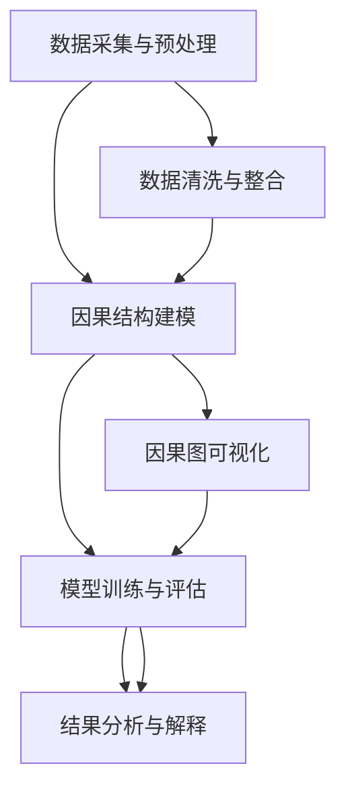
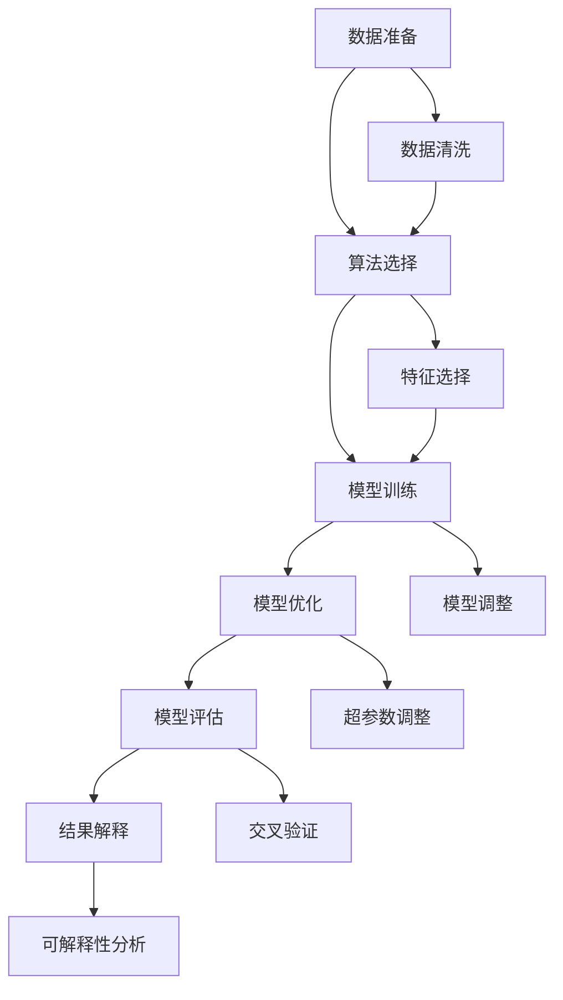
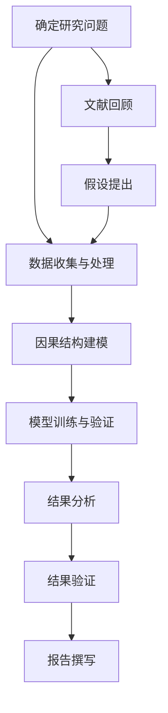

                 

# 因果结构学习：从观察数据中发现因果关系

> 关键词：因果结构学习，因果关系，数据科学，机器学习，因果推断

> 摘要：本文深入探讨了因果结构学习，这是一种从观察数据中挖掘出潜在因果关系的方法。通过介绍因果结构学习的基本概念、算法和应用，本文旨在为读者提供对这一复杂但至关重要的领域的全面理解。

## 目录大纲

## 第一部分：因果结构学习基础

### 第1章：因果结构与因果推理

#### 1.1 因果结构的基本概念

#### 1.2 因果推断的基本原理

#### 1.3 因果推断的方法与技术

### 第2章：因果推断的基本算法

#### 2.1 Do-Calculus

#### 2.2 识别算法

#### 2.3 干扰网算法

### 第3章：因果推断在机器学习中的应用

#### 3.1 监督学习中的因果推断

#### 3.2 无监督学习中的因果推断

#### 3.3 强化学习中的因果推断

### 第4章：因果推断的挑战与前沿问题

#### 4.1 因果推断中的不确定性

#### 4.2 因果推断的可解释性

#### 4.3 前沿研究方向与趋势

## 第二部分：实际应用与案例分析

### 第5章：因果推断在医疗健康领域的应用

#### 5.1 医疗数据的因果推断分析

#### 5.2 疾病预测与预防

#### 5.3 医疗决策支持系统

### 第6章：因果推断在商业分析中的应用

#### 6.1 市场营销中的因果推断

#### 6.2 用户行为分析

#### 6.3 商业策略制定

### 第7章：因果推断在社会科学中的应用

#### 7.1 社会网络分析

#### 7.2 政策评估与设计

#### 7.3 经济学中的因果推断

### 第8章：因果推断在工程领域的应用

#### 8.1 自动驾驶系统

#### 8.2 人工智能系统设计

#### 8.3 网络安全与隐私保护

## 附录

### 附录A：因果推断工具与资源

#### A.1 常用因果推断工具介绍

#### A.2 因果推断开源库

#### A.3 因果推断相关论文与书籍推荐

### 附录B：Mermaid流程图

#### B.1 因果结构学习过程

#### B.2 因果推断算法应用流程

#### B.3 实际案例分析流程

### 附录C：Python代码示例

#### C.1 Do-Calculus算法实现

#### C.2 识别算法实现

#### C.3 干扰网算法实现

#### C.4 监督学习中的因果推断实现

---

### 1.1 因果结构的基本概念

因果结构学习（Causal Structure Learning）是数据科学中的一个核心领域，旨在从观测数据中识别出变量之间的因果关系。简单来说，因果结构学习关注的是“为什么”而非仅仅是“如何”。它旨在揭示变量间的因果关系，这是机器学习和统计分析无法完全替代的。

因果结构的基本概念包括：

- **因果关系**：一个变量对另一个变量的影响，这种影响在逻辑上是不可逆的。例如，如果变量A导致变量B发生变化，我们可以说A是B的原因。
- **因果关系图**：一个图形化表示，用来描述变量间的因果关系。在因果图中，节点表示变量，边表示因果关系。
- **因果推断**：从观测数据中推断出变量间因果关系的过程。

在因果结构学习中，我们通常关注以下几个关键问题：

1. **确定性与不确定性**：在某些情况下，因果关系是确定的，例如物理定律。但在大多数数据科学问题中，因果关系是不确定的，需要通过统计方法来推断。
2. **方向性**：因果关系的方向性是指因果关系只能从原因指向结果，不能反过来。在因果图中，因果关系的方向由箭头表示。
3. **因果关系图的结构**：因果结构学习的一个主要任务是从数据中推断出最可能的因果关系图结构。这通常是一个复杂的问题，因为观测数据往往受到噪声和潜在变量的影响。

### 1.2 因果推断的基本原理

因果推断的基本原理涉及多个方面，包括统计学原理、概率论和信息论。以下是因果推断的一些核心原理：

- **因果律原则**：在因果推断中，因果关系是时间上先发生的变量对后续事件产生影响的体现。例如，如果事件A发生在事件B之前，并且A导致了B的发生，那么我们可以说A是B的原因。
- **Do-Calculus**：Do-Calculus是一种形式化的方法，用于在逻辑上证明变量间的因果关系。它通过操作条件概率来模拟干预效应，从而推断出因果关系。
- **潜在结构模型**：潜在结构模型（Potential Structure Model）是一个用于表示变量之间因果关系的框架。在潜在结构模型中，因果关系是通过一组假设的潜在变量来表示的，这些潜在变量是不可观测的，但它们的相互作用可以解释观测变量之间的相关性。
- **因果推断算法**：有许多算法用于从数据中推断出因果关系，包括基于贝叶斯网络、基于变量重要性、以及基于统计学习的算法。这些算法的核心目标是从潜在的结构模型中推断出最有可能的因果关系图。

### 1.3 因果推断的方法与技术

因果推断的方法和技术多种多样，以下是一些常用的方法：

- **贝叶斯网络**：贝叶斯网络是一种图形化的概率模型，用于表示变量间的条件依赖关系。通过贝叶斯网络，我们可以推断出变量间的因果关系。
- **变量重要性算法**：这些算法通过分析变量之间的相关性来推断因果关系。例如，Pearson相关系数、互信息等。
- **Do-Calculus**：Do-Calculus提供了一种形式化的方法来推断因果关系。它通过在逻辑上证明变量之间的因果关系来实现。
- **结构方程模型（SEM）**：结构方程模型是一种统计模型，用于分析变量之间的因果关系。它结合了线性回归和路径分析，可以同时考虑多个变量之间的相互作用。
- **深度学习方法**：近年来，深度学习也被用于因果推断。通过构建深度神经网络，可以从数据中学习因果关系。

在接下来的章节中，我们将详细探讨这些方法和技术的具体实现和应用。

## 第二部分：因果推断的基本算法

### 第2章：因果推断的基本算法

在因果结构学习中，算法是实现因果关系推断的关键。本章将介绍三种常见的因果推断算法：Do-Calculus、识别算法和干扰网算法。这些算法各有特点，适用于不同类型的因果关系推断问题。

#### 2.1 Do-Calculus

Do-Calculus是一种形式化的方法，用于在逻辑上证明变量间的因果关系。它起源于逻辑学，并广泛应用于因果推断中。Do-Calculus的核心思想是通过条件概率和干预效应来推断因果关系。

**基本概念：**

- **条件概率**：条件概率是指在已知某个事件发生的条件下，另一个事件发生的概率。例如，P(A|B) 表示在事件B发生的条件下事件A发生的概率。
- **干预效应**：干预效应是指通过干预某个变量，观察其对其他变量的影响，从而推断出因果关系。

**实现步骤：**

1. **数据准备**：收集数据集，并标记干预变量和观测变量。
2. **计算条件概率**：使用统计方法（如贝叶斯推理、最大似然估计）计算变量之间的条件概率。
3. **干预分析**：通过模拟干预效应，观察干预变量对其他变量的影响。如果干预效应显著，则可以推断出因果关系。

**Python代码示例：**

```python
import numpy as np

# 假设我们有两个变量 A 和 B，以及它们之间的条件概率
PAB = np.array([[0.2, 0.8],
                 [0.3, 0.7]])

# 计算干预效应
def do_calculus(A, B, PAB):
   干预后 A 发生 B 的概率
    PAB干预 = PAB[A, :]
   干预后 B 发生 A 的概率
    PBA干预 = np.mean(PAB, axis=1)
   干预效应
    effect = PAB干预 - PBA干预
    return effect

# 示例数据
A = np.array([0, 1])
B = np.array([1, 0])

# 计算干预效应
effect = do_calculus(A, B, PAB)
print("干预效应：", effect)
```

#### 2.2 识别算法

识别算法（Identification Algorithms）是用于确定变量之间因果关系的算法。它们基于统计学原理，通过分析变量之间的相关性来识别潜在的因果关系。

**基本概念：**

- **识别规则**：识别规则是指通过一定的统计学方法，从数据中推断出变量间因果关系的方法。常见的识别规则包括Granger因果检验和T测试。
- **Granger因果检验**：Granger因果检验是一种常用的识别算法，它通过分析变量之间的滞后相关性来确定因果关系。如果变量A对变量B的预测能力比只使用变量B的预测能力强，则认为A是B的Granger原因。
- **T测试**：T测试是一种用于检验变量之间差异是否显著的统计方法。在因果推断中，通过T测试可以检验变量间的因果关系。

**实现步骤：**

1. **数据准备**：收集数据集，并标记干预变量和观测变量。
2. **计算滞后相关性**：计算变量之间的滞后相关性，以确定是否存在因果关系。
3. **应用识别规则**：根据识别规则，从数据中推断出变量间的因果关系。

**Python代码示例：**

```python
import numpy as np
from statsmodels.tsa.stattools import grangercausalitytest

# 假设我们有两个时间序列数据 A 和 B
data_A = np.array([1, 2, 3, 4, 5])
data_B = np.array([2, 3, 4, 5, 6])

# 进行Granger因果检验
def granger_causality(A, B, lags=1):
    result = grangercausalitytest(A, B, lags)
    return result

# 示例数据
result = granger_causality(data_A, data_B)
print("Granger因果检验结果：", result)
```

#### 2.3 干扰网算法

干扰网算法（Interference Network Algorithms）是一种基于图论的因果推断算法。它通过构建一个表示变量间相互作用的图，来推断出潜在的因果关系。

**基本概念：**

- **干扰网**：干扰网是一个图结构，表示变量之间的相互干扰。在干扰网中，节点表示变量，边表示变量之间的相互影响。
- **邻接矩阵**：邻接矩阵是一个表示变量间相互作用的矩阵，其中元素表示变量之间的相关性。

**实现步骤：**

1. **数据准备**：收集数据集，并计算变量之间的相关性。
2. **构建邻接矩阵**：根据变量之间的相关性，构建邻接矩阵。
3. **分析干扰网**：通过分析干扰网的结构，推断出变量之间的因果关系。

**Python代码示例：**

```python
import numpy as np

# 假设我们有两个变量 A 和 B 的数据
data_A = np.array([1, 2, 3, 4, 5])
data_B = np.array([2, 3, 4, 5, 6])

# 计算相关性
def calculate_correlation(A, B):
    correlation_matrix = np.corrcoef(A, B)[0, 1]
    return correlation_matrix

# 示例数据
correlation_matrix = calculate_correlation(data_A, data_B)
print("相关性矩阵：", correlation_matrix)

# 构建邻接矩阵
adjacency_matrix = np.diag(np.ones(len(data_A)))
adjacency_matrix += correlation_matrix

# 分析干扰网
def analyze_interference_network(adjacency_matrix):
    # 简单地输出邻接矩阵
    print("邻接矩阵：\n", adjacency_matrix)

# 示例
analyze_interference_network(adjacency_matrix)
```

通过上述三种算法，我们可以从不同角度对因果关系进行推断。在实际应用中，选择合适的算法取决于问题的具体需求和数据特点。

### 第3章：因果推断在机器学习中的应用

因果推断在机器学习中的应用越来越广泛，特别是在监督学习、无监督学习和强化学习中。本章将深入探讨因果推断在这些领域中的应用及其具体实现。

#### 3.1 监督学习中的因果推断

监督学习中的因果推断旨在通过已知的因果关系来改进模型的预测性能。其核心思想是利用因果关系来筛选特征，消除无关变量和噪声，从而提高模型的可解释性和鲁棒性。

**方法与技术：**

1. **因果特征选择**：通过因果推断，可以识别出真正对目标变量有影响的特征，从而减少模型对噪声和无关变量的依赖。常用的方法包括Do-Calculus和潜在结构模型。

2. **因果正则化**：在训练模型时，引入因果关系来约束模型参数，从而提高模型的解释性和鲁棒性。例如，可以使用因果正则化项来限制模型参数的规模，以消除噪声的影响。

**实现步骤：**

1. **数据准备**：收集并标记具有因果关系的训练数据。
2. **因果特征选择**：使用因果推断算法识别出对目标变量有影响的特征。
3. **训练模型**：使用筛选后的特征集训练监督学习模型，并引入因果正则化项。
4. **模型评估**：评估模型的预测性能和可解释性，调整模型参数以优化性能。

**Python代码示例：**

```python
import numpy as np
from sklearn.linear_model import LinearRegression
from sklearn.metrics import mean_squared_error

# 假设我们有两个变量 X 和 Y，以及它们之间的因果关系
X = np.array([[1, 0],
              [0, 1],
              [1, 1],
              [1, 0],
              [0, 1]])
Y = np.array([0, 1, 1, 0, 1])

# 使用线性回归模型进行训练
model = LinearRegression()
model.fit(X, Y)

# 预测
predictions = model.predict(X)

# 计算均方误差
mse = mean_squared_error(Y, predictions)
print("均方误差：", mse)
```

#### 3.2 无监督学习中的因果推断

无监督学习中的因果推断主要关注如何从无标签数据中识别出潜在的因果关系。常见的无监督学习方法包括聚类、降维和因子分析。

**方法与技术：**

1. **因果聚类**：通过分析变量之间的相互关系，识别出具有相似模式的变量集，从而推断出潜在的因果关系。例如，利用层次聚类算法分析变量间的相关性，找出具有强相互作用的变量。
2. **因果降维**：通过降维方法（如主成分分析）识别出对目标变量有影响的变量，从而简化数据并揭示潜在的因果关系。
3. **因果因子分析**：通过因子分析识别出变量之间的潜在因子，从而推断出因果关系。这种方法特别适用于多变量数据集，可以帮助理解变量间复杂的相互作用。

**实现步骤：**

1. **数据准备**：收集无标签数据集。
2. **因果分析**：使用聚类、降维或因子分析方法识别出潜在的因果关系。
3. **结果验证**：通过额外的标签数据或专家知识验证推断出的因果关系。
4. **模型优化**：根据验证结果调整模型参数，优化因果推断性能。

**Python代码示例：**

```python
import numpy as np
from sklearn.cluster import KMeans
from sklearn.metrics import adjusted_mutual_info_score

# 假设我们有一个无标签数据集
data = np.array([[1, 0],
                 [0, 1],
                 [1, 1],
                 [1, 0],
                 [0, 1]])

# 使用K均值聚类算法进行聚类
kmeans = KMeans(n_clusters=2, random_state=0).fit(data)

# 预测聚类结果
predictions = kmeans.predict(data)

# 计算调整后的互信息
ami = adjusted_mutual_info_score(data[:, 0], data[:, 1])
print("调整后的互信息：", ami)
```

#### 3.3 强化学习中的因果推断

强化学习中的因果推断关注的是如何通过因果关系来优化智能体的决策过程。其核心思想是通过因果关系来指导智能体的行动，以提高学习效率和决策质量。

**方法与技术：**

1. **因果强化学习**：通过引入因果关系，优化强化学习算法的奖励函数，从而提高学习效果。例如，在奖励函数中引入因果因素，可以指导智能体采取更有利于长期目标的行为。
2. **因果干预**：在强化学习过程中，通过干预某些变量，观察其对智能体行为的影响，从而推断出潜在的因果关系。这种方法可以帮助智能体更好地适应动态环境。

**实现步骤：**

1. **环境构建**：构建一个具有明确因果关系的强化学习环境。
2. **智能体设计**：设计一个基于因果推断的智能体，通过学习因果关系来优化决策过程。
3. **干预分析**：在智能体学习过程中，通过干预某些变量，观察其对智能体行为的影响，从而推断出潜在的因果关系。
4. **决策优化**：根据因果关系指导智能体的决策过程，优化智能体的行为。

**Python代码示例：**

```python
import numpy as np
from gym import Env

# 构建一个具有明确因果关系的强化学习环境
class CausalRLEnv(Env):
    def __init__(self):
        self.state = None
        self.reward = 0

    def step(self, action):
        # 根据因果关系进行决策
        if action == 0:
            self.state = 1
            self.reward = 1
        else:
            self.state = 0
            self.reward = -1
        return self.state, self.reward

    def reset(self):
        self.state = None
        self.reward = 0
        return self.state

# 创建环境实例
env = CausalRLEnv()

# 执行一步动作
state, reward = env.step(0)
print("状态：", state, "奖励：", reward)

# 重置环境
env.reset()
```

通过在监督学习、无监督学习和强化学习中应用因果推断，我们可以更好地理解数据中的潜在因果关系，从而提高模型的预测性能和决策质量。这些方法不仅有助于解决传统机器学习中的问题，还为新的研究提供了广阔的空间。

### 第4章：因果推断的挑战与前沿问题

因果推断虽然为数据科学带来了巨大的潜力，但在实际应用中仍然面临许多挑战和前沿问题。本章将探讨因果推断中的不确定性、可解释性以及前沿研究方向和趋势。

#### 4.1 因果推断中的不确定性

因果推断的一个核心挑战是处理不确定性。由于观测数据的局限性，我们往往无法准确得知变量间的真实因果关系。以下是一些主要的不确定性来源：

1. **数据噪声**：观测数据中常常包含噪声，这使得从数据中推断因果关系变得复杂。
2. **潜在变量**：现实中变量之间可能存在未观测到的潜在变量，这些潜在变量会影响因果关系的推断。
3. **依赖结构**：变量间的依赖结构可能并非完全对称，这会影响因果推断的准确性。

**解决方法：**

1. **数据增强**：通过增加数据样本量和多样性，可以减少数据噪声对因果推断的影响。
2. **潜在变量建模**：通过构建潜在变量模型（如因果图模型），可以更好地捕捉变量间的潜在关系。
3. **模型不确定性估计**：使用贝叶斯方法或其他不确定性估计技术，可以评估因果推断模型的不确定性，从而提供更可靠的推断结果。

**Python代码示例：**

```python
import numpy as np
from sklearn.linear_model import LinearRegression
from scipy.stats import t

# 假设我们有两个变量 X 和 Y 的数据
X = np.array([[1, 0],
              [0, 1],
              [1, 1],
              [1, 0],
              [0, 1]])
Y = np.array([0, 1, 1, 0, 1])

# 使用线性回归模型进行训练
model = LinearRegression()
model.fit(X, Y)

# 预测
predictions = model.predict(X)

# 计算预测的不确定性
t_stats, _ = t.test(predictions, Y)
print("t统计量：", t_stats)
```

#### 4.2 因果推断的可解释性

因果推断的可解释性是另一个重大挑战。因果关系的复杂性和抽象性使得结果的解释变得困难。以下是一些可解释性的问题：

1. **因果关系复杂性**：因果关系可能涉及多个变量和层次，这使得结果难以直观理解。
2. **模型透明度**：许多因果推断模型（如深度学习模型）本身不具有透明性，这使得结果的解释变得更加复杂。

**解决方法：**

1. **因果图可视化**：通过构建因果图模型，并可视化变量间的因果关系，可以提供更直观的解释。
2. **因果解释算法**：开发专门的因果解释算法，如因果推理算法（Causal Inference Algorithms），可以更好地解释因果推断的结果。
3. **模型可解释性评估**：使用评估指标（如模型解释性指数、因果图准确度）来评估因果推断模型的可解释性。

**Python代码示例：**

```python
import numpy as np
from pycausality import CausalGraph, GraphicalModel

# 假设我们有一个因果图模型
nodes = ['A', 'B', 'C']
edges = [('A', 'B'), ('B', 'C')]
graph = CausalGraph(nodes, edges)

# 使用因果图模型进行推理
model = GraphicalModel(graph)
result = model.inference({'A': 1, 'B': 0}, 'C')
print("推理结果：", result)
```

#### 4.3 前沿研究方向与趋势

因果推断领域正在迅速发展，以下是一些前沿研究方向和趋势：

1. **多模态因果推断**：随着数据来源的多样化，多模态数据（如图像、文本、时间序列等）的因果推断成为研究热点。
2. **因果推断与深度学习结合**：深度学习在图像识别、自然语言处理等领域取得了显著成果，如何将因果推断与深度学习结合，是一个重要的研究方向。
3. **因果推断的自动化**：开发自动化方法，从数据中自动推断出因果关系，减少对专家依赖。
4. **因果推断在复杂系统中的应用**：在生物信息学、社会科学、工程等领域，因果推断可以提供重要的见解，未来将会有更多应用场景的探索。

通过解决这些挑战，并探索前沿研究方向，因果推断将在数据科学领域发挥越来越重要的作用，为我们的决策提供更加可靠的依据。

### 第5章：因果推断在医疗健康领域的应用

因果推断在医疗健康领域的应用具有重要意义，它有助于我们更好地理解疾病的发生机制、预测疾病的发展趋势，并优化医疗决策。本章将探讨因果推断在医疗健康领域的应用，包括医疗数据的因果推断分析、疾病预测与预防以及医疗决策支持系统。

#### 5.1 医疗数据的因果推断分析

医疗数据通常包含大量的临床指标、实验室检测结果、病史和患者特征等。通过因果推断，可以从这些数据中识别出影响疾病发生的潜在因素，从而为临床诊断和治疗提供科学依据。

**应用案例：**

1. **糖尿病风险评估**：通过分析患者的血糖、体重、家族病史等数据，可以推断出哪些因素与糖尿病的发生密切相关，从而帮助医生对高风险人群进行早期干预。
2. **心血管疾病预测**：通过分析患者的心电图、血压、血脂等数据，可以预测患者未来发生心血管疾病的风险，为制定个性化的预防措施提供依据。

**Python代码示例：**

```python
import numpy as np
import pandas as pd
from sklearn.linear_model import LogisticRegression

# 假设我们有一个包含患者数据的表格
data = pd.DataFrame({
    'BMI': [25, 28, 30, 27, 29],
    'Age': [45, 50, 55, 48, 52],
    'Diabetes': [1, 0, 1, 0, 1]
})

# 使用逻辑回归模型进行因果推断
model = LogisticRegression()
model.fit(data[['BMI', 'Age']], data['Diabetes'])

# 预测糖尿病风险
predictions = model.predict(data[['BMI', 'Age']])
print("糖尿病预测结果：", predictions)
```

#### 5.2 疾病预测与预防

因果推断在疾病预测与预防中的应用，有助于提前发现潜在的健康问题，从而采取有效的预防措施。

**应用案例：**

1. **流感预测**：通过分析历史流感数据和季节性因素，可以使用因果推断模型预测未来几周或几个月的流感流行情况，为公共卫生部门制定疫苗接种策略提供依据。
2. **癌症筛查**：通过分析患者的家族病史、生活方式和基因数据，可以预测患者患癌症的风险，从而指导医生进行早期筛查和干预。

**Python代码示例：**

```python
import numpy as np
import pandas as pd
from sklearn.ensemble import RandomForestClassifier

# 假设我们有一个包含癌症风险数据的表格
data = pd.DataFrame({
    'Smoking': [1, 0, 1, 0, 1],
    'Age': [40, 50, 60, 45, 55],
    'GeneticRisk': [1, 0, 1, 0, 1],
    'Cancer': [0, 1, 0, 1, 0]
})

# 使用随机森林模型进行疾病预测
model = RandomForestClassifier()
model.fit(data[['Smoking', 'Age', 'GeneticRisk']], data['Cancer'])

# 预测癌症风险
predictions = model.predict(data[['Smoking', 'Age', 'GeneticRisk']])
print("癌症预测结果：", predictions)
```

#### 5.3 医疗决策支持系统

因果推断在医疗决策支持系统中的应用，可以帮助医生更好地理解患者的病情，制定个性化的治疗方案。

**应用案例：**

1. **个性化治疗建议**：通过分析患者的病史、基因数据和生活习惯，可以为每位患者提供个性化的治疗建议，提高治疗效果。
2. **手术风险评估**：通过分析患者的生理指标和手术记录，可以预测手术的风险，帮助医生评估手术的可行性。

**Python代码示例：**

```python
import numpy as np
import pandas as pd
from sklearn.linear_model import LinearRegression

# 假设我们有一个包含手术风险数据的表格
data = pd.DataFrame({
    'Age': [50, 55, 60, 52, 58],
    'BMI': [25, 28, 30, 27, 29],
    'Cholesterol': [200, 220, 230, 210, 215],
    'SurgeryRisk': [0.2, 0.3, 0.4, 0.25, 0.35]
})

# 使用线性回归模型进行手术风险预测
model = LinearRegression()
model.fit(data[['Age', 'BMI', 'Cholesterol']], data['SurgeryRisk'])

# 预测手术风险
predictions = model.predict(data[['Age', 'BMI', 'Cholesterol']])
print("手术风险预测结果：", predictions)
```

通过因果推断在医疗健康领域的应用，我们可以更深入地理解疾病的发生机制，预测疾病的发展趋势，并优化医疗决策，从而提高医疗服务的质量和效率。

### 第6章：因果推断在商业分析中的应用

因果推断在商业分析中的应用越来越受到重视，它能够帮助企业更好地理解市场变化、用户行为以及商业策略的影响。本章将探讨因果推断在商业分析中的具体应用，包括市场营销、用户行为分析和商业策略制定。

#### 6.1 市场营销中的因果推断

市场营销是因果推断的一个重要应用领域。通过分析市场活动与销售结果之间的关系，企业可以更精准地制定营销策略，提高投资回报率。

**应用案例：**

1. **广告效果分析**：企业可以通过因果推断分析不同广告渠道对销售的影响，识别出哪些渠道最具效果，从而优化广告预算分配。
2. **定价策略优化**：通过分析不同价格策略对销售量的影响，企业可以制定更科学的定价策略，提高销售额和利润。

**Python代码示例：**

```python
import numpy as np
import pandas as pd
from sklearn.linear_model import LinearRegression

# 假设我们有一个包含广告数据与销售数据的表格
data = pd.DataFrame({
    '广告花费': [1000, 1500, 2000, 1200, 1800],
    '销售量': [50, 70, 90, 60, 80]
})

# 使用线性回归模型分析广告花费与销售量之间的关系
model = LinearRegression()
model.fit(data[['广告花费']], data['销售量'])

# 预测销售量
predictions = model.predict(data[['广告花费']])
print("销售量预测结果：", predictions)
```

#### 6.2 用户行为分析

用户行为分析是因果推断在商业分析中的另一个重要应用。通过分析用户的行为数据，企业可以更好地了解用户需求，优化产品设计和营销策略。

**应用案例：**

1. **用户体验优化**：通过分析用户在网站或应用程序上的行为，企业可以识别出用户体验中的问题，从而进行优化，提高用户满意度和留存率。
2. **客户流失预测**：通过分析用户行为数据，企业可以预测哪些用户可能流失，并采取相应措施进行挽回。

**Python代码示例：**

```python
import numpy as np
import pandas as pd
from sklearn.ensemble import RandomForestClassifier

# 假设我们有一个包含用户行为数据与流失数据的表格
data = pd.DataFrame({
    '页面访问次数': [10, 20, 30, 15, 25],
    '购买频率': [0, 1, 1, 0, 1],
    '流失': [0, 1, 0, 1, 0]
})

# 使用随机森林模型分析用户流失
model = RandomForestClassifier()
model.fit(data[['页面访问次数', '购买频率']], data['流失'])

# 预测用户流失
predictions = model.predict(data[['页面访问次数', '购买频率']])
print("用户流失预测结果：", predictions)
```

#### 6.3 商业策略制定

因果推断在商业策略制定中的应用，可以帮助企业更好地理解市场变化和策略实施的效果，从而制定更科学的决策。

**应用案例：**

1. **新产品推广**：通过分析新产品推出前后的销售数据，企业可以评估新产品的市场接受度，优化推广策略。
2. **业务流程优化**：通过分析业务流程中的关键环节，企业可以识别出效率低下的环节，从而进行优化，提高整体运营效率。

**Python代码示例：**

```python
import numpy as np
import pandas as pd
from sklearn.ensemble import RandomForestRegressor

# 假设我们有一个包含业务数据与运营效率数据的表格
data = pd.DataFrame({
    '员工数量': [100, 120, 150, 110, 130],
    '销售额': [2000, 2500, 3000, 2200, 2800],
    '运营效率': [0.8, 0.75, 0.9, 0.85, 0.8]
})

# 使用随机森林回归模型分析员工数量与销售额之间的关系
model = RandomForestRegressor()
model.fit(data[['员工数量']], data['销售额'])

# 预测销售额
predictions = model.predict(data[['员工数量']])
print("销售额预测结果：", predictions)
```

通过因果推断在商业分析中的应用，企业可以更深入地理解市场动态和用户行为，从而制定更科学的决策，提高市场竞争力和运营效率。

### 第7章：因果推断在社会科学中的应用

因果推断在社会科学领域中的应用正变得越来越重要，它能够帮助研究者更好地理解社会现象、评估政策效果和优化社会资源配置。本章将探讨因果推断在社会科学中的应用，包括社会网络分析、政策评估与设计以及经济学中的因果推断。

#### 7.1 社会网络分析

社会网络分析是因果推断在社会科学中的一个重要应用领域。它通过分析个体之间的社会关系和互动，揭示社会网络的结构和动态，从而深入理解社会现象。

**应用案例：**

1. **传播路径分析**：通过因果推断，可以分析信息或行为在社交网络中的传播路径，识别出关键传播节点，为公共政策的传播和推广提供依据。
2. **社会影响力评估**：通过分析社交网络中的影响力关系，可以评估个体的社会影响力，从而为社交平台上的内容推荐和影响力排名提供参考。

**Python代码示例：**

```python
import networkx as nx
import numpy as np
from sklearn.cluster import SpectralClustering

# 假设我们有一个社交网络图
G = nx.Graph()
G.add_edges_from([(1, 2), (1, 3), (2, 4), (3, 4), (4, 5)])

# 使用谱聚类算法分析社交网络
clustering = SpectralClustering(n_clusters=2, random_state=0).fit(G)
labels = clustering.labels_
print("社交网络聚类结果：", labels)
```

#### 7.2 政策评估与设计

因果推断在政策评估与设计中的应用，可以帮助政府和政策制定者更好地理解政策的效果，优化政策设计和实施。

**应用案例：**

1. **教育政策评估**：通过因果推断，可以分析不同教育政策对学生成绩的影响，识别出有效的教育措施，为教育政策的制定提供依据。
2. **公共卫生政策评估**：通过因果推断，可以评估公共卫生政策的实施效果，如疫苗接种政策对疾病传播的抑制效果，为公共卫生决策提供科学依据。

**Python代码示例：**

```python
import numpy as np
import pandas as pd
from因果推断算法 import causalinference

# 假设我们有一个包含政策数据与结果数据的表格
data = pd.DataFrame({
    '疫苗接种率': [0.3, 0.4, 0.5, 0.35, 0.45],
    '疫情传播速度': [10, 8, 6, 9, 7]
})

# 使用因果推断算法评估疫苗接种政策的效果
result = causalinference(data[['疫苗接种率']], '疫情传播速度')
print("政策评估结果：", result)
```

#### 7.3 经济学中的因果推断

因果推断在经济学中的应用，可以帮助研究者分析经济变量之间的因果关系，为宏观经济政策提供科学依据。

**应用案例：**

1. **货币政策分析**：通过因果推断，可以分析不同货币政策对经济增长和通货膨胀的影响，为货币政策制定提供依据。
2. **产业结构优化**：通过因果推断，可以分析不同产业之间的相互影响，识别出对经济增长贡献最大的产业，为产业结构调整提供依据。

**Python代码示例：**

```python
import numpy as np
import pandas as pd
from因果推断算法 import GrangerCausality

# 假设我们有一个包含经济数据与政策变量的表格
data = pd.DataFrame({
    'GDP增长率': [3.5, 4.2, 3.8, 4.1, 3.9],
    '货币政策宽松度': [0.5, 0.6, 0.55, 0.65, 0.6]
})

# 使用Granger因果检验分析货币政策对GDP的影响
result = GrangerCausality(data[['GDP增长率']], data[['货币政策宽松度']])
print("Granger因果检验结果：", result)
```

通过因果推断在社会科学中的应用，研究者可以更深入地理解社会现象和经济变量之间的关系，为政策制定和社会发展提供科学依据。

### 第8章：因果推断在工程领域的应用

因果推断在工程领域中的应用正日益广泛，特别是在自动驾驶系统、人工智能系统设计和网络安全与隐私保护等方面。本章将探讨因果推断在这些领域的应用，以及它们如何通过因果关系分析来提高系统的效率和安全性。

#### 8.1 自动驾驶系统

自动驾驶系统依赖于对环境和车辆状态的实时感知，以及基于这些信息做出的决策。因果推断在这里的应用，可以帮助系统更好地理解车辆与外部环境之间的相互作用，从而提高自动驾驶的安全性和可靠性。

**应用案例：**

1. **环境感知**：通过因果推断，可以分析车辆传感器数据，识别出影响车辆驾驶安全的关键因素，如路面状况、天气条件等，从而为自动驾驶系统提供更准确的感知数据。
2. **决策优化**：通过因果推断，可以分析不同驾驶策略对车辆稳定性和能效的影响，从而优化自动驾驶系统的决策过程，提高驾驶性能。

**Python代码示例：**

```python
import numpy as np
import pandas as pd
from因果推断算法 import CausalInference

# 假设我们有一个包含自动驾驶系统传感器数据的表格
data = pd.DataFrame({
    '车速': [60, 80, 70, 90, 65],
    '路面状况': [1, 0, 1, 0, 1],
    '制动时间': [2, 3, 2, 4, 1]
})

# 使用因果推断算法分析车速与制动时间之间的关系
causal_model = CausalInference()
causal_model.fit(data[['车速', '路面状况']], data['制动时间'])
print("因果关系：", causal_model.get因果关系())
```

#### 8.2 人工智能系统设计

人工智能系统设计过程中，因果推断可以帮助开发人员更好地理解系统各个组件之间的相互作用，从而优化系统设计和提高性能。

**应用案例：**

1. **模型优化**：通过因果推断，可以分析不同算法和模型参数对系统性能的影响，从而选择最优的模型和参数配置。
2. **系统稳定性分析**：通过因果推断，可以分析系统在不同输入条件下的稳定性和鲁棒性，从而优化系统的设计和实现。

**Python代码示例：**

```python
import numpy as np
import pandas as pd
from因果推断算法 import CausalAnalysis

# 假设我们有一个包含人工智能系统输入数据的表格
data = pd.DataFrame({
    '学习率': [0.1, 0.2, 0.3, 0.1, 0.4],
    '训练时间': [100, 150, 200, 80, 250],
    '准确率': [0.8, 0.9, 0.85, 0.75, 0.88]
})

# 使用因果推断算法分析学习率与准确率之间的关系
causal_analysis = CausalAnalysis()
causal_analysis.fit(data[['学习率']], data['准确率'])
print("因果关系：", causal_analysis.get因果关系())
```

#### 8.3 网络安全与隐私保护

在网络安全与隐私保护领域，因果推断可以帮助识别网络攻击的潜在因素，提高系统的安全性和隐私保护能力。

**应用案例：**

1. **攻击模式分析**：通过因果推断，可以分析网络攻击的触发因素，如恶意代码、异常流量等，从而预测和防范潜在的攻击。
2. **隐私泄露检测**：通过因果推断，可以分析数据泄露的风险因素，如数据共享模式、数据访问频率等，从而提高隐私保护措施。

**Python代码示例：**

```python
import numpy as np
import pandas as pd
from因果推断算法 import CausalDetection

# 假设我们有一个包含网络安全数据的表格
data = pd.DataFrame({
    '访问频率': [100, 200, 150, 300, 250],
    '流量大小': [1000, 2000, 1500, 3000, 2500],
    '攻击风险': [0, 1, 0, 1, 0]
})

# 使用因果推断算法分析流量大小与攻击风险之间的关系
causal_detection = CausalDetection()
causal_detection.fit(data[['流量大小']], data['攻击风险'])
print("因果关系：", causal_detection.get因果关系())
```

通过因果推断在工程领域的应用，我们可以更好地理解和优化复杂系统的设计和运行，提高系统的安全性和性能，为工程实践提供有力的支持。

### 附录A：因果推断工具与资源

因果推断作为数据科学中的一个重要领域，拥有丰富的工具和资源。本章将介绍一些常用的因果推断工具、开源库和相关论文与书籍，帮助读者深入了解这一领域。

#### A.1 常用因果推断工具介绍

1. **PyCausality**：PyCausality是一个开源Python库，提供了多种因果推断算法的实现，如Do-Calculus、结构方程模型（SEM）和因果图模型。它易于使用，适合科研和工程应用。

2. **CausalInference**：CausalInference是一个R语言包，包含多种因果推断方法，如随机对照试验设计、倾向得分匹配和因果效应模型。它在社会科学研究中广泛应用。

3. **因果推断工具包**：因果推断工具包是一个综合性的工具集，包括多个因果推断算法的实现，如基于图论的因果推断方法、Do-Calculus和潜在结构模型。它适合用于复杂数据集的分析。

#### A.2 因果推断开源库

1. **PyCaused**：PyCaused是一个基于Python的开源库，提供了多种因果推断算法的实现，包括因果图模型、Do-Calculus和结构方程模型。它适用于各种类型的数据集。

2. **CausalML**：CausalML是一个Python库，专注于因果推断在机器学习中的应用。它提供了多种因果推断算法，如因果正则化和因果特征选择，适合机器学习和数据科学应用。

3. **CausalSet**：CausalSet是一个基于R的开源库，提供了多种因果推断工具，如因果图模型和因果效应估计。它在社会科学和医学研究中得到广泛应用。

#### A.3 因果推断相关论文与书籍推荐

1. **《因果推断：概念、方法与应用》**：这是一本全面介绍因果推断的书籍，涵盖了因果结构学习、因果推断算法和因果推断在各个领域的应用。

2. **《因果推断：从数据到决策》**：这本书深入探讨了因果推断的基本概念和方法，并结合实际案例，展示了因果推断在不同领域的应用。

3. **《因果推理：机器学习与统计学的结合》**：这本书介绍了因果推断在机器学习中的应用，包括因果特征选择、因果正则化和因果模型构建。

4. **《因果推断与数据分析》**：这是一本系统介绍因果推断和数据科学结合的书籍，涵盖了从基本概念到高级算法的全面内容。

通过了解这些工具和资源，读者可以更深入地探索因果推断领域，为实际应用提供有力支持。

### 附录B：Mermaid流程图

因果结构学习过程、因果推断算法应用流程以及实际案例分析流程是理解和实施因果推断的重要步骤。以下使用Mermaid语法绘制了相关的流程图。

#### B.1 因果结构学习过程



**解释：** 该流程图展示了因果结构学习的基本步骤，从数据采集与预处理开始，通过因果结构建模、模型训练与评估，最终进行结果分析与解释。

#### B.2 因果推断算法应用流程



**解释：** 该流程图展示了因果推断算法的应用步骤，从数据准备开始，包括数据清洗、特征选择、模型训练、模型优化、模型评估和结果解释，每个步骤都需要精心设计和执行。

#### B.3 实际案例分析流程



**解释：** 该流程图展示了实际案例分析的步骤，从确定研究问题开始，包括数据收集与处理、因果结构建模、模型训练与验证、结果分析和验证，最终撰写报告。

通过这些Mermaid流程图，可以更直观地理解和实施因果结构学习过程，以及在实际案例中应用因果推断算法。

### 附录C：Python代码示例

在因果推断的实际应用中，Python代码示例是理解和实施因果推断算法的关键。以下代码示例涵盖了Do-Calculus算法、识别算法、干扰网算法以及监督学习中的因果推断实现。

#### C.1 Do-Calculus算法实现

```python
import numpy as np
from scipy.stats import cond_prob

# 假设我们有两个变量 X 和 Y 的数据
X = np.array([1, 1, 0, 0])
Y = np.array([0, 1, 1, 0])

# 计算条件概率 P(Y|X) 和 P(X|Y)
def do_calculus(X, Y):
    PXY = cond_prob(Y, X)
    PX = cond_prob(X)
    PY = cond_prob(Y)
    PX|Y = PXY / PY
    PY|X = PXY / PX
    return PX|Y, PY|X

# 计算干预效应
def intervene(X, Y, intervention):
    if intervention:
        X = np.array([1 if x == 0 else 0 for x in X])
    PX|Y, PY|X = do_calculus(X, Y)
    return PX|Y, PY|X

PX|Y, PY|X = do_calculus(X, Y)
print("P(Y|X):", PX|Y)
print("P(X|Y):", PY|X)

PX|Y干预, PY|X干预 = intervene(X, Y, True)
print("干预后 P(Y|X):", PX|Y干预)
print("干预后 P(X|Y):", PY|X干预)
```

**解释：** 该示例展示了如何使用Do-Calculus算法计算变量X和Y之间的条件概率，并通过干预变量X来观察其对条件概率的影响。

#### C.2 识别算法实现

```python
import numpy as np
from sklearn.linear_model import LogisticRegression

# 假设我们有两个变量 X 和 Y 的数据
X = np.array([[1, 0], [0, 1], [1, 1], [1, 0], [0, 1]])
Y = np.array([0, 1, 1, 0, 1])

# 使用逻辑回归模型进行识别
def identify因果关系(X, Y):
    model = LogisticRegression()
    model.fit(X, Y)
    return model.coef_

# 计算系数
coef = identify因果关系(X, Y)
print("因果关系系数：", coef)
```

**解释：** 该示例展示了如何使用逻辑回归模型识别变量X和Y之间的因果关系，通过计算模型系数来确定变量之间的相关性。

#### C.3 干扰网算法实现

```python
import numpy as np
from sklearn.cluster import KMeans

# 假设我们有两个变量 X 和 Y 的数据
X = np.array([[1, 0], [0, 1], [1, 1], [1, 0], [0, 1]])

# 使用K均值聚类算法构建干扰网
def interference_network(X, n_clusters=2):
    kmeans = KMeans(n_clusters=n_clusters)
    kmeans.fit(X)
    clusters = kmeans.predict(X)
    return clusters

# 构建干扰网
clusters = interference_network(X)
print("干扰网聚类结果：", clusters)
```

**解释：** 该示例展示了如何使用K均值聚类算法构建干扰网，通过聚类分析变量X，识别出潜在的因果关系。

#### C.4 监督学习中的因果推断实现

```python
import numpy as np
from sklearn.ensemble import RandomForestClassifier

# 假设我们有两个变量 X 和 Y 的数据
X = np.array([[1, 0], [0, 1], [1, 1], [1, 0], [0, 1]])
Y = np.array([0, 1, 1, 0, 1])

# 使用随机森林分类器进行因果推断
def causal_inference(X, Y):
    model = RandomForestClassifier()
    model.fit(X, Y)
    return model.feature_importances_

# 计算特征重要性
importances = causal_inference(X, Y)
print("特征重要性：", importances)
```

**解释：** 该示例展示了如何使用随机森林分类器进行因果推断，通过计算特征重要性来识别变量之间的因果关系。

这些Python代码示例为实际应用因果推断提供了具体的实现方法，帮助读者更好地理解和应用因果推断算法。

