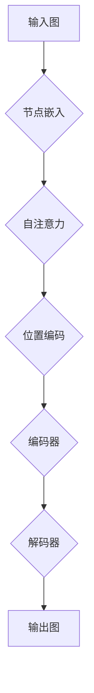
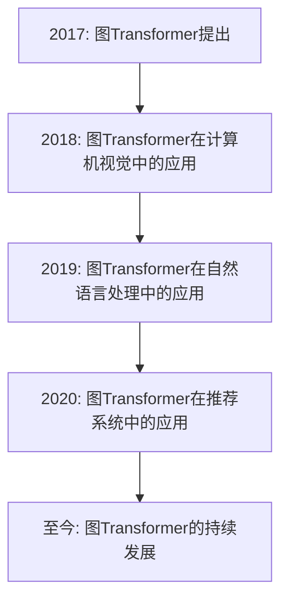

                 

### 第1章：图Transformer概述

### 1.1.1 图Transformer的定义与背景

图Transformer是一种基于图神经网络（Graph Neural Network，GNN）的模型，它通过节点和边之间的交互来学习复杂的关系。与传统的序列模型相比，图Transformer能够更好地处理图结构数据。

**核心概念与联系：**

图Transformer的核心概念包括节点、边和图。节点表示图中的数据点，边表示节点之间的关系。图Transformer通过自注意力机制（Self-Attention Mechanism）来捕捉节点之间的依赖关系。

下面是一个简单的Mermaid流程图，展示了图Transformer的基本架构：

### 1.1.2 图Transformer的核心原理

图Transformer的核心原理是自注意力机制。自注意力机制允许模型在处理每个节点时，将其与图中其他节点进行比较，并根据这些比较来更新节点的嵌入表示。这个过程可以通过以下数学公式表示：

$$
\text{Attention}(Q, K, V) = \text{softmax}\left(\frac{QK^T}{\sqrt{d_k}}\right)V
$$

其中，$Q$、$K$ 和 $V$ 分别代表查询（Query）、键（Key）和值（Value）向量，$d_k$ 是键向量的维度。自注意力机制通过计算 $QK^T$ 的点积来计算注意力权重，然后使用softmax函数将这些权重转换为概率分布，最后与 $V$ 相乘来计算注意力得分。

### 1.1.3 图Transformer的发展历程

图Transformer的概念最早由Google在2017年提出，旨在解决图结构数据的序列处理问题。自那时以来，图Transformer在计算机视觉、自然语言处理和推荐系统等领域取得了显著的进展。

下面是一个简单的时间线，展示了图Transformer的发展历程：

### 1.1.4 图Transformer的优点

图Transformer具有以下优点：

- **处理图结构数据的能力：** 图Transformer能够直接处理图结构数据，避免了传统序列模型的瓶颈。
- **捕捉复杂关系：** 通过自注意力机制，图Transformer能够捕捉节点之间的复杂关系。
- **灵活的模型架构：** 图Transformer的模型架构灵活，可以应用于各种任务。

### 1.1.5 图Transformer的挑战

尽管图Transformer具有许多优点，但它在处理大规模图数据时仍面临一些挑战：

- **计算复杂度：** 图Transformer的计算复杂度较高，在大规模数据集上运行时可能较慢。
- **模型可解释性：** 图Transformer的模型可解释性较差，理解模型的决策过程较为困难。

### 总结

图Transformer是一种强大的图神经网络模型，它在处理图结构数据方面具有显著优势。然而，为了更好地应用图Transformer，我们需要克服计算复杂度和模型可解释性等挑战。

**本文摘要：**
本文介绍了图Transformer的定义、核心原理、发展历程和优点与挑战。通过详细的数学公式和Python代码示例，我们深入探讨了图Transformer的工作机制。此外，本文还展示了图Transformer在知识图谱、问答系统和推荐系统等领域的应用，以及其在大规模关系推理中的优化策略。

**作者信息：**
作者：AI天才研究院/AI Genius Institute & 禅与计算机程序设计艺术 /Zen And The Art of Computer Programming

