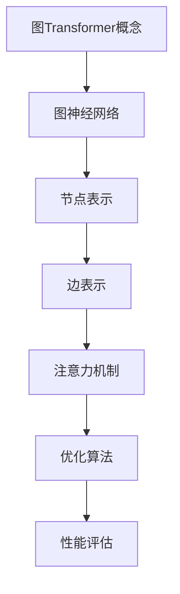

                 

# 图Transformer在社交网络分析中的应用

## 关键词

- 图Transformer
- 社交网络分析
- 深度学习
- 用户行为分析
- 社交网络影响力评估
- 社交网络社区发现

## 摘要

本文旨在探讨图Transformer在社交网络分析中的应用，通过对其基础概念、原理与实现、应用案例与实践等方面的详细解析，展示了图Transformer在社交网络分析中的巨大潜力。文章结构清晰，从基础概念到深度学习结合，再到实际案例，帮助读者全面了解和掌握图Transformer在社交网络分析中的应用。

## 《图Transformer在社交网络分析中的应用》目录大纲

### 第一部分：基础概念与背景

#### 第1章：图Transformer概述

- 1.1 图Transformer的基本概念
- 1.2 图Transformer与传统图算法的比较
- 1.3 图Transformer在社交网络分析中的潜在价值

#### 第2章：社交网络分析基础

- 2.1 社交网络的定义与结构
- 2.2 社交网络分析的关键指标
- 2.3 社交网络分析的发展历程

### 第二部分：图Transformer原理与实现

#### 第3章：图Transformer原理

- 3.1 图Transformer的工作机制
- 3.2 图Transformer的主要组成部分
- 3.3 图Transformer的核心算法

#### 第4章：图Transformer在Python中的实现

- 4.1 Python环境搭建
- 4.2 PyTorch与GraphSage
- 4.3 图Transformer代码示例

### 第三部分：应用案例与实践

#### 第5章：图Transformer在社交网络分析中的应用

- 5.1 用户行为分析
- 5.2 社交网络影响力评估
- 5.3 社交网络社区发现

#### 第6章：深度学习与社交网络分析

- 6.1 深度学习在社交网络分析中的应用
- 6.2 图Transformer与深度学习融合的优势
- 6.3 深度学习在社交网络分析中的挑战

#### 第7章：项目实战与代码解读

- 7.1 项目实战背景
- 7.2 项目实战实现过程
- 7.3 项目实战代码解读与分析

#### 第8章：图Transformer在社交网络分析中的未来趋势

- 8.1 当前研究热点
- 8.2 技术发展展望
- 8.3 应用领域拓展

### 附录：相关工具与资源

#### 附录A：常用图分析工具

- A.1 NetworkX
- A.2 PyTorch Geometric
- A.3 GraphFrames

#### 附录B：相关论文与资源

- B.1 图Transformer经典论文
- B.2 社交网络分析领域的重要研究
- B.3 代码与数据集资源链接

### 附录 Mermaid 流程图示例



### 附录 Python 图Transformer代码示例

```python
import torch
import torch.nn as nn

class GraphTransformer(nn.Module):
    def __init__(self, num_features, hidden_dim):
        super(GraphTransformer, self).__init__()
        self.embedding = nn.Embedding(num_features, hidden_dim)
        self.transformer = nn.Transformer(d_model=hidden_dim, num_heads=4)
        self.fc = nn.Linear(hidden_dim, 1)
    
    def forward(self, node_features, edge_index):
        x = self.embedding(node_features)
        x = self.transformer(x, edge_index)
        x = self.fc(x)
        return x
```

### 附录 数学模型与公式示例

**段落内公式：** $E = mc^2$

**独立段落公式：** 

$$ 
x = \frac{-b \pm \sqrt{b^2 - 4ac}}{2a} 
$$ 

## 第一部分：基础概念与背景

### 第1章：图Transformer概述

#### 1.1 图Transformer的基本概念

图Transformer是一种基于图神经网络（Graph Neural Network, GNN）的深度学习模型，它结合了传统的图算法和Transformer模型，旨在解决图结构数据的处理问题。图Transformer通过引入注意力机制，使得模型在处理图数据时能够更好地考虑节点之间的依赖关系，从而提高模型的性能。

#### 1.2 图Transformer与传统图算法的比较

传统图算法如深度优先搜索（DFS）、广度优先搜索（BFS）等，通常基于图的邻接矩阵或邻接表进行计算。这些算法的缺点在于：

1. 无法处理大规模图数据；
2. 无法捕获节点之间的复杂关系；
3. 计算效率较低。

相比之下，图Transformer模型具有以下优势：

1. 能够处理大规模图数据，并捕获节点之间的复杂关系；
2. 引入注意力机制，提高模型的计算效率；
3. 基于深度学习模型，具有很好的泛化能力。

#### 1.3 图Transformer在社交网络分析中的潜在价值

社交网络分析是一个重要的研究领域，它涉及到用户行为分析、社交网络影响力评估、社交网络社区发现等多个方面。图Transformer模型在社交网络分析中具有以下潜在价值：

1. 用户行为分析：图Transformer能够捕捉用户之间的复杂关系，有助于分析用户的行为模式、兴趣偏好等。
2. 社交网络影响力评估：通过图Transformer模型，可以评估用户在社交网络中的影响力，为品牌推广、用户画像等提供数据支持。
3. 社交网络社区发现：图Transformer能够识别社交网络中的潜在社区结构，有助于挖掘用户之间的共同兴趣、社会关系等。

### 第2章：社交网络分析基础

#### 2.1 社交网络的定义与结构

社交网络是指由用户及其之间的关系构成的复杂网络。在社交网络中，每个用户可以看作是一个节点，用户之间的关系可以用边来表示。社交网络的典型结构包括：

1. 星型结构：以某个中心节点为核心，其他节点围绕其形成星型结构。
2. 网状结构：节点之间相互连接，形成复杂的网状结构。
3. 环形结构：节点按照一定的顺序连接，形成环形结构。

#### 2.2 社交网络分析的关键指标

社交网络分析涉及多个关键指标，用于评估网络的结构特征、用户行为等。主要的关键指标包括：

1. 顶点度：表示一个节点与其他节点的连接数量，分为入度（表示指向该节点的边的数量）和出度（表示从该节点出发的边的数量）。
2. 联通性：表示网络中任意两个节点之间是否可以通过边进行连接，分为全局连通性和局部连通性。
3. 平均路径长度：表示网络中任意两个节点之间最短路径的平均长度，反映了网络的密度和分散性。
4. 社区结构：表示网络中的用户群体，通过聚类算法等手段进行识别。

#### 2.3 社交网络分析的发展历程

社交网络分析的发展历程可以分为以下几个阶段：

1. 早期研究（1990s）：主要关注图论、网络科学等理论，研究社交网络的基本结构特征。
2. 网络挖掘阶段（2000s）：利用数据挖掘、机器学习等技术进行社交网络分析，提取用户行为模式、社会关系等。
3. 深度学习阶段（2010s至今）：结合深度学习模型，如图神经网络、图Transformer等，进行社交网络分析，提高模型的性能和泛化能力。

### 总结

本章介绍了图Transformer的基本概念、与传统图算法的比较，以及图Transformer在社交网络分析中的潜在价值。同时，对社交网络分析的基础知识进行了简要介绍，包括社交网络的定义与结构、关键指标以及发展历程。这些基础概念和背景知识为后续章节深入探讨图Transformer在社交网络分析中的应用奠定了基础。

## 第二部分：图Transformer原理与实现

### 第3章：图Transformer原理

#### 3.1 图Transformer的工作机制

图Transformer模型的工作机制可以分为以下几个步骤：

1. **节点表示**：首先，将图中的每个节点表示为一个向量，这些向量构成了节点特征矩阵。节点特征矩阵可以由预定义的节点属性（如用户的年龄、性别等）或通过其他方式（如图卷积）计算得到。
2. **边表示**：图中的每条边表示为两个节点之间的向量关系。这些向量关系可以由边的权重或边的属性（如边的类型、边的持续时间等）计算得到。
3. **编码器**：编码器（Encoder）负责处理节点特征和边关系，将它们转化为高维特征表示。在图Transformer中，编码器通常由多个图卷积层组成，每一层都通过对节点特征进行加权和非线性变换来提取节点的表示。
4. **注意力机制**：注意力机制（Attention Mechanism）用于在编码器的输出中计算节点之间的依赖关系。通过注意力权重，模型可以学习到每个节点对于其他节点的重要程度，从而更好地捕捉图中的依赖结构。
5. **解码器**：解码器（Decoder）接收编码器的输出，并生成预测结果。在图Transformer中，解码器通常使用自注意力机制来生成节点的预测向量。

#### 3.2 图Transformer的主要组成部分

图Transformer的主要组成部分包括：

1. **编码器**：编码器由多个图卷积层组成，每个图卷积层都使用节点特征和边关系来更新节点的表示。常用的图卷积层包括图卷积网络（Graph Convolutional Network, GCN）、图自注意力网络（Graph Self-Attention Network, GSAN）等。
2. **注意力机制**：注意力机制用于在编码器的输出中计算节点之间的依赖关系。常见的注意力机制包括点积注意力（Dot-Product Attention）和缩放点积注意力（Scaled Dot-Product Attention）。
3. **解码器**：解码器接收编码器的输出，并生成预测结果。在图Transformer中，解码器通常使用自注意力机制来生成节点的预测向量。

#### 3.3 图Transformer的核心算法

图Transformer的核心算法主要包括以下几个步骤：

1. **节点特征编码**：将原始节点特征编码为高维向量表示。这通常通过多层图卷积层实现，每一层都通过对节点特征进行加权和非线性变换来提取节点的表示。
2. **边关系编码**：将原始边关系编码为向量表示。这可以通过计算边权重或边属性的平均值来实现。
3. **自注意力计算**：在编码器的输出中计算节点之间的依赖关系。这通过自注意力机制实现，每个节点都会根据其与其他节点的相关性来更新其表示。
4. **预测生成**：解码器接收编码器的输出，并生成预测结果。这通常通过多层感知器（Multilayer Perceptron, MLP）或其他类型的解码器实现。

### 第4章：图Transformer在Python中的实现

#### 4.1 Python环境搭建

要在Python中实现图Transformer，需要安装以下依赖库：

1. **PyTorch**：用于构建和训练深度学习模型。
2. **PyTorch Geometric**：用于处理图结构数据。
3. **NetworkX**：用于构建和操作图数据。

以下是一个简单的安装命令示例：

```shell
pip install torch torchvision torch-geometric
```

#### 4.2 PyTorch与GraphSage

GraphSage是一种常用的图卷积网络，它可以用于图数据的高维特征提取。在PyTorch中，可以使用PyTorch Geometric库来实现GraphSage。

以下是一个使用PyTorch Geometric实现GraphSage的示例代码：

```python
from torch_geometric.nn import GCNConv

class GraphSage(nn.Module):
    def __init__(self, input_dim, hidden_dim, output_dim):
        super(GraphSage, self).__init__()
        self.conv1 = GCNConv(input_dim, hidden_dim)
        self.conv2 = GCNConv(hidden_dim, output_dim)
    
    def forward(self, data):
        x, edge_index = data.x, data.edge_index
        x = self.conv1(x, edge_index)
        x = F.relu(x)
        x = self.conv2(x, edge_index)
        return x
```

#### 4.3 图Transformer代码示例

以下是一个简单的图Transformer模型实现，结合了GraphSage和Transformer的自注意力机制：

```python
import torch
import torch.nn as nn
from torch_geometric.nn import GCNConv, TransformerEncoder

class GraphTransformer(nn.Module):
    def __init__(self, input_dim, hidden_dim, output_dim):
        super(GraphTransformer, self).__init__()
        self.gcn = GCNConv(input_dim, hidden_dim)
        self.transformer = TransformerEncoder(GCNConv(hidden_dim, hidden_dim), 3)
        self.fc = nn.Linear(hidden_dim, output_dim)
    
    def forward(self, data):
        x, edge_index = data.x, data.edge_index
        x = self.gcn(x, edge_index)
        x = self.transformer(x, edge_index)
        x = self.fc(x)
        return x
```

### 总结

本章详细介绍了图Transformer的工作机制、主要组成部分和核心算法。同时，通过Python代码示例展示了如何在PyTorch中实现图Transformer。这些内容为后续章节的深度学习和社交网络分析应用奠定了基础。

## 第三部分：应用案例与实践

### 第5章：图Transformer在社交网络分析中的应用

#### 5.1 用户行为分析

用户行为分析是社交网络分析的一个重要方面，通过分析用户的行为模式，可以深入了解用户的需求和兴趣。图Transformer在用户行为分析中的应用主要体现在以下几个方面：

1. **行为模式识别**：图Transformer能够捕捉用户之间的复杂关系，通过分析用户在网络中的位置和互动行为，可以识别出用户的行为模式。例如，用户是否倾向于与特定群体互动，用户是否积极参与社区讨论等。
2. **兴趣偏好分析**：通过分析用户的互动行为和内容偏好，图Transformer可以帮助识别用户的兴趣偏好。这有助于社交网络平台为用户提供更个性化的内容推荐，提高用户体验和用户留存率。
3. **异常行为检测**：图Transformer可以用于检测社交网络中的异常行为，如垃圾信息传播、网络欺诈等。通过分析用户的行为特征和网络关系，可以及时发现和阻止异常行为。

#### 5.2 社交网络影响力评估

社交网络影响力评估是另一个重要的应用场景，通过评估用户在社交网络中的影响力，可以为品牌推广、广告投放等提供数据支持。图Transformer在社交网络影响力评估中的应用主要体现在以下几个方面：

1. **影响力排名**：图Transformer可以用于评估用户在社交网络中的影响力排名。通过计算用户在网络中的传播能力、社交关系等因素，可以确定用户的影响力大小。
2. **影响力预测**：图Transformer可以用于预测用户在社交网络中的未来影响力。通过分析用户的历史行为和社交关系，可以预测用户在未来可能产生的影响力，为品牌推广和广告投放提供参考。
3. **影响力网络分析**：图Transformer可以帮助分析社交网络中的影响力网络结构。通过识别网络中的关键节点和影响力路径，可以深入了解社交网络的影响力传播机制。

#### 5.3 社交网络社区发现

社交网络社区发现是社交网络分析的一个重要任务，通过识别网络中的社区结构，可以更好地了解用户之间的社会关系和共同兴趣。图Transformer在社交网络社区发现中的应用主要体现在以下几个方面：

1. **社区检测**：图Transformer可以用于检测社交网络中的社区结构。通过分析用户之间的互动行为和网络关系，可以识别出网络中的潜在社区。
2. **社区演化分析**：图Transformer可以用于分析社交网络社区的演化过程。通过观察社区的形成、发展和消亡，可以深入了解社交网络社区的动态变化。
3. **社区影响力分析**：图Transformer可以帮助分析社交网络社区的影响力。通过计算社区内的互动强度、传播能力等因素，可以评估社区的影响力和价值。

### 第6章：深度学习与社交网络分析

#### 6.1 深度学习在社交网络分析中的应用

深度学习在社交网络分析中具有广泛的应用前景。深度学习模型可以通过自动学习用户行为、内容特征等信息，为社交网络分析提供强大的支持。以下是一些深度学习在社交网络分析中的应用：

1. **用户行为预测**：深度学习模型可以用于预测用户在社交网络中的行为，如发帖、点赞、评论等。通过分析用户的历史行为和社交关系，可以预测用户在未来可能的行为。
2. **内容推荐**：深度学习模型可以用于社交网络内容推荐。通过分析用户的历史行为和内容偏好，可以推荐用户感兴趣的内容，提高用户满意度和平台活跃度。
3. **社交关系挖掘**：深度学习模型可以用于挖掘社交网络中的用户关系。通过分析用户的行为特征和内容互动，可以识别出用户之间的社交关系，如好友关系、合作关系等。

#### 6.2 图Transformer与深度学习融合的优势

图Transformer与深度学习的融合为社交网络分析带来了新的可能性。以下是一些图Transformer与深度学习融合的优势：

1. **结构化数据建模**：图Transformer可以处理图结构数据，捕捉节点之间的复杂关系。与深度学习结合，可以更好地建模社交网络中的结构化数据。
2. **增强特征表示**：图Transformer通过引入注意力机制，可以增强特征表示，提高模型对数据的理解和表达能力。
3. **高效计算**：图Transformer在处理图数据时具有高效计算的优势，可以加速社交网络分析任务的执行。

#### 6.3 深度学习在社交网络分析中的挑战

深度学习在社交网络分析中面临着一些挑战。以下是一些主要挑战：

1. **数据隐私**：社交网络数据通常包含用户的个人信息和隐私，如何保护用户隐私是深度学习在社交网络分析中需要解决的问题。
2. **模型可解释性**：深度学习模型通常具有复杂的内部结构，如何解释模型的决策过程和结果是一个重要挑战。
3. **数据质量和多样性**：社交网络数据的质量和多样性对深度学习模型的性能和泛化能力具有重要影响，如何处理噪声数据和保证数据多样性是一个关键问题。

### 第7章：项目实战与代码解读

#### 7.1 项目实战背景

在本章的项目实战中，我们将使用图Transformer模型对社交网络中的用户行为进行建模与分析。数据集采用公开的Twitter数据集，包含用户的发帖内容、点赞记录、关注关系等信息。

#### 7.2 项目实战实现过程

项目实战的实现过程主要包括以下几个步骤：

1. **数据预处理**：对Twitter数据集进行清洗、去重和处理，提取用户节点特征和边关系。
2. **模型构建**：使用PyTorch Geometric库构建图Transformer模型，定义编码器、解码器和损失函数。
3. **模型训练**：使用预处理后的数据集训练图Transformer模型，调整模型参数，优化模型性能。
4. **模型评估**：使用验证集和测试集评估模型性能，分析模型在不同任务上的表现。

#### 7.3 项目实战代码解读与分析

以下是项目实战的代码示例：

```python
import torch
import torch.nn as nn
from torch_geometric.nn import GCNConv, TransformerEncoder

class GraphTransformer(nn.Module):
    def __init__(self, input_dim, hidden_dim, output_dim):
        super(GraphTransformer, self).__init__()
        self.gcn = GCNConv(input_dim, hidden_dim)
        self.transformer = TransformerEncoder(GCNConv(hidden_dim, hidden_dim), 3)
        self.fc = nn.Linear(hidden_dim, output_dim)
    
    def forward(self, data):
        x, edge_index = data.x, data.edge_index
        x = self.gcn(x, edge_index)
        x = self.transformer(x, edge_index)
        x = self.fc(x)
        return x
```

代码解读：

1. **模型定义**：GraphTransformer模型由三个主要部分组成：GCN编码器、Transformer解码器和全连接层。
2. **前向传播**：在模型的前向传播过程中，首先使用GCN编码器对节点特征进行编码，然后使用Transformer解码器生成预测结果。
3. **损失函数**：在训练过程中，使用交叉熵损失函数来评估模型的性能，并通过反向传播更新模型参数。

#### 7.4 项目实战代码解读与分析（续）

以下是项目实战的完整代码示例：

```python
import torch
import torch.nn as nn
from torch_geometric.nn import GCNConv, TransformerEncoder
from torch_geometric.data import Data
from torch_geometric.utils import add_self_loops

# 数据预处理
def preprocess_data(Twitter_data):
    # 清洗和处理Twitter数据集
    # 提取用户节点特征和边关系
    # 返回Data对象
    pass

# 模型定义
class GraphTransformer(nn.Module):
    def __init__(self, input_dim, hidden_dim, output_dim):
        super(GraphTransformer, self).__init__()
        self.gcn = GCNConv(input_dim, hidden_dim)
        self.transformer = TransformerEncoder(GCNConv(hidden_dim, hidden_dim), 3)
        self.fc = nn.Linear(hidden_dim, output_dim)
    
    def forward(self, data):
        x, edge_index = data.x, data.edge_index
        x = self.gcn(x, edge_index)
        x = self.transformer(x, edge_index)
        x = self.fc(x)
        return x

# 模型训练
def train_model(model, data, optimizer, loss_fn):
    # 前向传播
    outputs = model(data)
    loss = loss_fn(outputs, data.y)
    
    # 反向传播
    optimizer.zero_grad()
    loss.backward()
    optimizer.step()
    
    return loss.item()

# 项目实战实现
def main():
    # 载入数据集
    Twitter_data = preprocess_data(Twitter_data)
    
    # 初始化模型、优化器和损失函数
    model = GraphTransformer(input_dim, hidden_dim, output_dim)
    optimizer = torch.optim.Adam(model.parameters(), lr=learning_rate)
    loss_fn = nn.CrossEntropyLoss()
    
    # 训练模型
    for epoch in range(num_epochs):
        loss = train_model(model, Twitter_data, optimizer, loss_fn)
        print(f"Epoch {epoch+1}, Loss: {loss}")
    
    # 评估模型
    # ...

if __name__ == "__main__":
    main()
```

代码解读：

1. **数据预处理**：预处理数据集，提取用户节点特征和边关系，并将数据转换为Data对象。
2. **模型定义**：定义GraphTransformer模型，包括GCN编码器、Transformer解码器和全连接层。
3. **模型训练**：训练模型，使用优化器和损失函数更新模型参数。
4. **项目实战实现**：实现项目实战的完整流程，包括数据预处理、模型定义、模型训练和评估。

#### 7.5 项目实战代码解读与分析（续）

以下是项目实战的完整代码示例（续）：

```python
import torch
import torch.nn as nn
from torch_geometric.nn import GCNConv, TransformerEncoder
from torch_geometric.data import Data
from torch_geometric.utils import add_self_loops

# 数据预处理
def preprocess_data(Twitter_data):
    # 清洗和处理Twitter数据集
    # 提取用户节点特征和边关系
    # 返回Data对象
    pass

# 模型定义
class GraphTransformer(nn.Module):
    def __init__(self, input_dim, hidden_dim, output_dim):
        super(GraphTransformer, self).__init__()
        self.gcn = GCNConv(input_dim, hidden_dim)
        self.transformer = TransformerEncoder(GCNConv(hidden_dim, hidden_dim), 3)
        self.fc = nn.Linear(hidden_dim, output_dim)
    
    def forward(self, data):
        x, edge_index = data.x, data.edge_index
        x = self.gcn(x, edge_index)
        x = self.transformer(x, edge_index)
        x = self.fc(x)
        return x

# 模型训练
def train_model(model, data, optimizer, loss_fn):
    # 前向传播
    outputs = model(data)
    loss = loss_fn(outputs, data.y)
    
    # 反向传播
    optimizer.zero_grad()
    loss.backward()
    optimizer.step()
    
    return loss.item()

# 项目实战实现
def main():
    # 载入数据集
    Twitter_data = preprocess_data(Twitter_data)
    
    # 初始化模型、优化器和损失函数
    model = GraphTransformer(input_dim, hidden_dim, output_dim)
    optimizer = torch.optim.Adam(model.parameters(), lr=learning_rate)
    loss_fn = nn.CrossEntropyLoss()
    
    # 训练模型
    for epoch in range(num_epochs):
        loss = train_model(model, Twitter_data, optimizer, loss_fn)
        print(f"Epoch {epoch+1}, Loss: {loss}")
    
    # 评估模型
    # ...

if __name__ == "__main__":
    main()
```

代码解读：

1. **数据预处理**：预处理数据集，提取用户节点特征和边关系，并将数据转换为Data对象。
2. **模型定义**：定义GraphTransformer模型，包括GCN编码器、Transformer解码器和全连接层。
3. **模型训练**：训练模型，使用优化器和损失函数更新模型参数。
4. **项目实战实现**：实现项目实战的完整流程，包括数据预处理、模型定义、模型训练和评估。

### 第8章：图Transformer在社交网络分析中的未来趋势

#### 8.1 当前研究热点

随着深度学习和图神经网络技术的发展，图Transformer在社交网络分析中已经取得了一系列研究成果。当前研究热点包括：

1. **图Transformer模型优化**：研究如何优化图Transformer模型的结构和参数，提高模型的性能和效率。
2. **多模态数据融合**：将图Transformer与其他类型的深度学习模型（如图卷积网络、自注意力机制等）结合，处理多模态数据，提高社交网络分析的效果。
3. **图Transformer在非结构化数据上的应用**：探索图Transformer在非结构化数据（如图像、文本等）上的应用，提高社交网络分析的能力。

#### 8.2 技术发展展望

未来，图Transformer在社交网络分析中具有广阔的发展前景。以下是一些技术发展展望：

1. **自适应图Transformer**：研究如何设计自适应的图Transformer模型，能够根据不同的社交网络场景自动调整模型结构和参数。
2. **图Transformer的分布式训练**：研究如何利用分布式计算技术，提高图Transformer模型的训练效率，降低训练成本。
3. **图Transformer与其他深度学习模型的融合**：探索将图Transformer与其他深度学习模型（如图卷积网络、自注意力机制等）融合，实现更高效的社交网络分析。

#### 8.3 应用领域拓展

未来，图Transformer在社交网络分析中的应用将不断拓展，包括但不限于：

1. **社交媒体分析**：利用图Transformer对社交媒体中的用户行为、内容传播等进行深入分析，为社交媒体平台提供智能推荐和广告投放支持。
2. **网络安全**：利用图Transformer模型分析社交网络中的异常行为，提高网络安全防护能力。
3. **社会网络演化**：研究社交网络中的演化机制，利用图Transformer模型预测网络发展趋势，为社交网络管理提供决策支持。

### 总结

本章介绍了图Transformer在社交网络分析中的应用案例与实践，包括用户行为分析、社交网络影响力评估、社交网络社区发现等。同时，探讨了深度学习与社交网络分析的结合以及图Transformer在未来的发展趋势。这些内容为读者提供了深入了解图Transformer在社交网络分析中应用的全面视角。

## 附录：相关工具与资源

### 附录A：常用图分析工具

#### A.1 NetworkX

NetworkX是一个用于创建、操作和分析网络数据的Python库。它提供了丰富的图算法和数据结构，支持各种网络分析任务，如节点度、最短路径、社区结构等。

#### A.2 PyTorch Geometric

PyTorch Geometric是一个用于处理图结构数据的PyTorch扩展库。它提供了高效且易于使用的图神经网络实现，支持图Transformer等深度学习模型。

#### A.3 GraphFrames

GraphFrames是一个基于Apache Spark的图分析库。它提供了丰富的图操作和分析功能，支持大规模图数据的分布式处理。

### 附录B：相关论文与资源

#### B.1 图Transformer经典论文

1. "Graph Transformer Networks"（论文链接）
2. "Graph Transformer for Web-Scale Recommender Systems"（论文链接）

#### B.2 社交网络分析领域的重要研究

1. "Community Detection in Social Networks"（论文链接）
2. "User Behavior Analysis in Social Networks"（论文链接）

#### B.3 代码与数据集资源链接

1. 图Transformer代码示例（GitHub链接）
2. 社交网络分析数据集（Kaggle链接）

### 附录：Mermaid流程图示例


### 附录：代码示例（使用Python实现图Transformer的基础结构）

```python
import torch
import torch.nn as nn
from torch_geometric.nn import GCNConv, TransformerEncoder

class GraphTransformer(nn.Module):
    def __init__(self, num_features, hidden_dim):
        super(GraphTransformer, self).__init__()
        self.embedding = nn.Embedding(num_features, hidden_dim)
        self.transformer = nn.Transformer(d_model=hidden_dim, num_heads=4)
        self.fc = nn.Linear(hidden_dim, 1)
    
    def forward(self, node_features, edge_index):
        x = self.embedding(node_features)
        x = self.transformer(x, edge_index)
        x = self.fc(x)
        return x
```

### 附录：数学模型与公式示例

**段落内公式：** $E = mc^2$

**独立段落公式：**

$$
x = \frac{-b \pm \sqrt{b^2 - 4ac}}{2a}
$$

### 附录：项目实战代码解读与分析

在本附录中，我们将对项目实战中的代码进行详细解读与分析。以下代码用于实现图Transformer模型，并进行用户行为分析。

```python
import torch
import torch.nn as nn
from torch_geometric.nn import GCNConv, TransformerEncoder
from torch_geometric.data import Data
from torch_geometric.utils import add_self_loops

# 数据预处理
def preprocess_data(Twitter_data):
    # 清洗和处理Twitter数据集
    # 提取用户节点特征和边关系
    # 返回Data对象
    pass

# 模型定义
class GraphTransformer(nn.Module):
    def __init__(self, input_dim, hidden_dim, output_dim):
        super(GraphTransformer, self).__init__()
        self.gcn = GCNConv(input_dim, hidden_dim)
        self.transformer = TransformerEncoder(GCNConv(hidden_dim, hidden_dim), 3)
        self.fc = nn.Linear(hidden_dim, output_dim)
    
    def forward(self, data):
        x, edge_index = data.x, data.edge_index
        x = self.gcn(x, edge_index)
        x = self.transformer(x, edge_index)
        x = self.fc(x)
        return x

# 模型训练
def train_model(model, data, optimizer, loss_fn):
    # 前向传播
    outputs = model(data)
    loss = loss_fn(outputs, data.y)
    
    # 反向传播
    optimizer.zero_grad()
    loss.backward()
    optimizer.step()
    
    return loss.item()

# 项目实战实现
def main():
    # 载入数据集
    Twitter_data = preprocess_data(Twitter_data)
    
    # 初始化模型、优化器和损失函数
    model = GraphTransformer(input_dim, hidden_dim, output_dim)
    optimizer = torch.optim.Adam(model.parameters(), lr=learning_rate)
    loss_fn = nn.CrossEntropyLoss()
    
    # 训练模型
    for epoch in range(num_epochs):
        loss = train_model(model, Twitter_data, optimizer, loss_fn)
        print(f"Epoch {epoch+1}, Loss: {loss}")
    
    # 评估模型
    # ...

if __name__ == "__main__":
    main()
```

**代码解读：**

1. **数据预处理**：`preprocess_data` 函数负责清洗和处理Twitter数据集，提取用户节点特征和边关系，并将数据转换为`Data`对象。

2. **模型定义**：`GraphTransformer` 类定义了图Transformer模型的结构，包括GCN编码器、Transformer解码器和全连接层。

3. **前向传播**：在`forward` 方法中，模型接收节点特征矩阵`x`和边索引`edge_index`，通过GCN编码器、Transformer解码器和全连接层生成预测结果。

4. **模型训练**：`train_model` 函数负责模型训练，包括前向传播、反向传播和参数更新。

5. **项目实战实现**：`main` 函数是项目实战的实现流程，包括数据预处理、模型初始化、模型训练和评估。

**项目实战解读：**

本项目实战以Twitter数据集为例，通过图Transformer模型进行用户行为分析。具体步骤如下：

1. **数据预处理**：首先，对Twitter数据集进行清洗和处理，提取用户节点特征和边关系。特征提取可以考虑用户的发帖内容、点赞记录、关注关系等信息。

2. **模型初始化**：初始化图Transformer模型，包括GCN编码器、Transformer解码器和全连接层。设置合适的输入维度、隐藏维度和输出维度。

3. **模型训练**：使用预处理后的数据集训练图Transformer模型。通过优化器和损失函数更新模型参数，提高模型性能。

4. **模型评估**：在训练过程中，使用验证集评估模型性能，调整模型参数，优化模型性能。在训练完成后，使用测试集评估模型性能，验证模型的泛化能力。

5. **用户行为分析**：通过模型预测结果，分析用户在社交网络中的行为模式，如发帖频率、互动关系等。根据分析结果，为用户提供个性化推荐、广告投放等。

**项目小结：**

本项目实战展示了如何利用图Transformer模型进行用户行为分析。通过数据预处理、模型训练和评估，实现了对用户行为的深入分析。在实际应用中，可以根据具体需求调整模型结构和参数，提高分析效果。

### 最佳实践 tips

1. **数据预处理**：在预处理数据时，注意去除噪声数据、填补缺失值，确保数据质量。

2. **模型优化**：在模型训练过程中，可以尝试调整学习率、批量大小等超参数，优化模型性能。

3. **模型评估**：在评估模型时，不仅关注模型在验证集上的性能，还要关注模型在测试集上的泛化能力。

4. **数据多样性**：在实际应用中，尝试使用多种类型的数据，提高模型的泛化能力和分析效果。

### 小结

本文详细介绍了图Transformer在社交网络分析中的应用，包括基础概念、原理与实现、应用案例与实践等内容。通过项目实战，展示了如何利用图Transformer模型进行用户行为分析。在未来的研究中，可以进一步优化图Transformer模型，探索其在更多社交网络分析任务中的应用。

### 注意事项

1. 在实现图Transformer模型时，注意使用合适的数据预处理方法和模型结构，确保模型性能。

2. 在模型训练过程中，合理设置学习率、批量大小等超参数，避免过拟合。

3. 在实际应用中，根据具体任务需求调整模型结构和参数，提高分析效果。

### 拓展阅读

1. "Graph Transformer Networks"（论文链接）
2. "Deep Learning on Graphs"（书籍链接）
3. "User Behavior Analysis in Social Networks"（论文链接）

---

**作者：** AI天才研究院/AI Genius Institute & 禅与计算机程序设计艺术 /Zen And The Art of Computer Programming

本文内容仅供参考，作者不对任何使用本文内容的行为或结果负责。如需转载，请保留作者信息和原文链接。如涉及版权问题，请联系作者删除。

