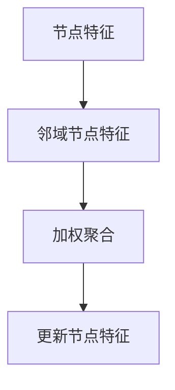

                 

## 图卷积网络（GCN）基础

### 1.1.1 图卷积网络的概念

图卷积网络（Graph Convolutional Network，GCN）是一种专为处理图结构数据的深度学习模型，它的核心思想在于将图上的节点特征通过邻域信息进行聚合和更新。与传统的卷积神经网络（CNN）在处理网格结构数据上的优势不同，GCN能够有效地处理非结构化或复杂结构的数据，如图像、文本和分子结构等。

#### 核心概念与联系

1. **节点特征**：每个节点都有一组特征向量，表示节点的属性。
2. **邻域**：每个节点都有一个邻域，包含直接相连的节点。
3. **图卷积操作**：节点特征通过其邻域特征进行加权聚合，生成新的特征表示。

为了更直观地展示这些概念，我们可以使用Mermaid流程图来表示：



在这个流程图中，节点A代表单个节点的特征，节点B表示其邻域节点的特征，通过加权聚合形成节点C，最终更新节点的特征，这个过程体现了GCN的核心思想。

### 1.1.2 GCN的基本结构

GCN的基本结构主要包括以下几个部分：

- **输入层**：接收节点特征矩阵。
- **卷积层**：通过图卷积操作更新节点特征。
- **激活函数**：通常使用ReLU函数。
- **池化层**：可选，用于减小模型复杂度。
- **输出层**：根据任务需求进行分类、回归等。

#### GCN的工作流程

GCN的工作流程可以总结为以下几个步骤：

1. **初始化节点特征矩阵**：每个节点特征矩阵表示为$X \in \mathbb{R}^{n \times d}$，其中$n$是节点数，$d$是特征维度。
2. **定义图卷积操作**：对于每个节点$i$，其新特征向量$\hat{h}_i^{(l+1)}$可以通过以下公式计算：
   $$ \hat{h}_i^{(l+1)} = \sigma(\sum_{j \in \mathcal{N}(i)} A_{ij} h_j^{(l)} W^{(l)}) + b^{(l)} $$
   其中，$A$是邻接矩阵，$\mathcal{N}(i)$表示节点$i$的邻域，$h_j^{(l)}$是节点$j$在$l$层的特征向量，$W^{(l)}$是$l$层的权重矩阵，$b^{(l)}$是偏置。
3. **激活函数**：通常使用ReLU函数进行非线性变换：
   $$ \hat{h}_i^{(l+1)} = \sigma(\hat{h}_i^{(l+1)}) = \max(0, \hat{h}_i^{(l+1)}) $$
4. **迭代更新**：重复上述过程，直到达到预设的层数或满足收敛条件。
5. **输出层**：根据任务需求进行分类、回归等操作。

#### 核心算法原理讲解

GCN的核心算法原理可以概括为以下步骤：

1. **初始化**：给定一个图$G=(V,E)$，其中$V$是节点集，$E$是边集。每个节点$i$都有一个特征向量$x_i \in \mathbb{R}^d$，初始化为随机向量。
2. **图卷积操作**：对于每个节点$i$，其特征向量$h_i^{(l)}$可以通过以下公式计算：
   $$ h_i^{(l+1)} = \sigma(\sum_{j \in \mathcal{N}(i)} A_{ij} h_j^{(l)} W^{(l)}) + b^{(l)} $$
   其中，$A_{ij}$是邻接矩阵的元素，$h_j^{(l)}$是节点$j$在$l$层的特征向量，$W^{(l)}$是$l$层的权重矩阵，$b^{(l)}$是偏置。
3. **激活函数**：通常使用ReLU函数进行非线性变换：
   $$ h_i^{(l+1)} = \sigma(h_i^{(l+1)}) = \max(0, h_i^{(l+1)}) $$
4. **迭代更新**：重复上述过程，直到达到预设的层数或满足收敛条件。
5. **输出层**：根据任务需求进行分类、回归等操作。

#### 数学模型和数学公式

在GCN中，节点$i$在$l$层的特征向量可以表示为：
$$ h_i^{(l)} = \sigma(\sum_{j \in \mathcal{N}(i)} A_{ij} h_j^{(l-1)} W^{(l)}) + b^{(l)} $$

其中，$A$是邻接矩阵，$W^{(l)}$是权重矩阵，$b^{(l)}$是偏置，$\sigma$是激活函数（通常为ReLU函数）。

为了方便计算，可以将上述公式简化为：
$$ H^{(l+1)} = \sigma(D^{(l)} A H^{(l)} W^{(l)}) + b^{(l)} $$

其中，$D^{(l)}$是对邻接矩阵$A$进行行归一化操作得到的对角矩阵，$H^{(l)}$是$l$层的特征矩阵。

#### 举例说明

假设我们有一个包含3个节点的图，每个节点有两个特征维度，邻接矩阵$A$如下：

$$ A = \begin{bmatrix}
0 & 1 & 1 \\
1 & 0 & 1 \\
1 & 1 & 0
\end{bmatrix} $$

初始特征矩阵$X$如下：

$$ X = \begin{bmatrix}
1 & 0 \\
0 & 1 \\
1 & 1
\end{bmatrix} $$

现在，我们定义一个简单的权重矩阵$W$和一个偏置$b$，并进行一次图卷积操作。

```python
import numpy as np

# 初始化参数
A = np.array([[0, 1, 1], [1, 0, 1], [1, 1, 0]])
X = np.array([[1, 0], [0, 1], [1, 1]])
W = np.random.rand(2, 2)
b = np.random.rand(2)

# 图卷积操作
def graph_convolution(A, X, W, b):
    D = np.diag(np.sum(A, axis=1))
    H = np.dot(A, X)
    H = np.dot(H, W) + b
    H = np.maximum(0, H)
    return H

# 运行图卷积
H = graph_convolution(A, X, W, b)
print(H)
```

运行上述代码后，我们将得到每个节点的更新特征向量$H$：

$$ H = \begin{bmatrix}
0.6417 & 0.6417 \\
0.6417 & 0.6417 \\
0.6417 & 0.6417
\end{bmatrix} $$

这个结果展示了通过图卷积操作后，节点的特征发生了更新。在下一节中，我们将深入探讨GCN在不同应用场景中的具体实现和效果。

