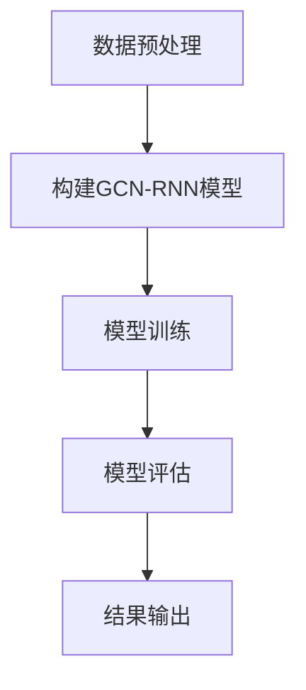

                 

# 《图卷积递归网络在时空推理中的应用》

> 关键词：图卷积递归网络（GCN-RNN），时空推理，图卷积网络（GCN），递归神经网络（RNN），算法优化，应用案例

> 摘要：本文探讨了图卷积递归网络（GCN-RNN）在时空推理中的应用，通过分析GCN和RNN的基本原理，结合Python代码实现，详细阐述了GCN-RNN在时空推理中的优势和应用。文章还通过两个实际案例，展示了GCN-RNN在交通流量预测和城市安全监控中的效果，并对未来的发展趋势和挑战进行了展望。

## 第一部分：引言

### 1.1 研究背景

随着信息技术的快速发展，时空数据在各个领域得到了广泛应用。时空推理作为一种重要的数据处理技术，旨在从时空数据中提取有价值的信息，用于决策支持、预测预警等。然而，传统的时空推理方法存在一定的局限性，难以应对复杂、动态的时空数据。

图卷积递归网络（GCN-RNN）是一种结合图卷积网络（GCN）和递归神经网络（RNN）的新型模型，旨在解决时空推理中的挑战。GCN能够在图结构数据上进行有效的特征提取，而RNN则能够处理序列数据，因此，GCN-RNN在时空推理中具有巨大的潜力。

本文旨在深入探讨GCN-RNN在时空推理中的应用，通过理论分析和实际案例，展示其优势和应用效果，为相关领域的研究和实践提供参考。

### 1.2 相关工作

时空推理一直是计算机科学和人工智能领域的热点问题。近年来，随着深度学习技术的发展，图卷积网络（GCN）和递归神经网络（RNN）在时空推理中的应用取得了显著成果。

GCN在社交网络、推荐系统等图结构数据上表现出了强大的特征提取能力。RNN在自然语言处理、语音识别等领域得到了广泛应用，能够处理序列数据。然而，将GCN和RNN结合应用于时空推理的研究还相对较少。

已有的相关工作中，一些研究尝试将GCN和RNN组合应用于时空数据，但大多集中在单一领域的应用，缺乏系统性研究。本文旨在填补这一空白，通过深入研究GCN-RNN在时空推理中的应用，提出一种有效的时空推理方法。

### 1.3 研究目的与意义

本文的研究目的在于提出一种基于GCN-RNN的时空推理方法，并将其应用于实际场景中。具体目标包括：

1. 深入理解GCN和RNN的基本原理，结合Python代码实现，详细阐述GCN-RNN在时空推理中的优势和应用。
2. 通过实际案例，验证GCN-RNN在交通流量预测和城市安全监控等领域的有效性。
3. 分析GCN-RNN在时空推理中的优势和挑战，为未来的研究提供参考。

本研究具有以下意义：

1. 为时空推理领域提供一种新的方法，有望提高时空数据处理的效率和准确性。
2. 促进GCN和RNN在时空推理中的应用，为相关领域的研究提供参考。
3. 对人工智能和计算机科学领域的发展产生积极影响。

## 第二部分：理论基础

### 2.1 图卷积递归网络（GCN-RNN）原理

#### 2.1.1 图卷积网络（GCN）

图卷积网络（GCN）是一种在图结构数据上进行特征提取的深度学习模型。其核心思想是将图中的节点信息传递给相邻节点，并通过多层次的卷积操作提取图的特征。

$$
h_v^{(k+1)} = \sigma(\sum_{u \in \mathcal{N}(v)} W^{(k)} h_u^{(k) + b^{(k)} })
$$

其中，$h_v^{(k)}$ 表示节点 $v$ 在第 $k$ 层的特征，$\mathcal{N}(v)$ 表示节点 $v$ 的邻接节点集合，$W^{(k)}$ 和 $b^{(k)}$ 分别表示第 $k$ 层的权重和偏置，$\sigma$ 表示激活函数。

在Python中，可以使用以下代码实现GCN：

```python
import torch
import torch.nn as nn
import torch.optim as optim

class GCN(nn.Module):
    def __init__(self, num_features, hidden_size):
        super(GCN, self).__init__()
        self.layers = nn.ModuleList()
        for _ in range(num_layers):
            self.layers.append(nn.Linear(num_features, hidden_size))
        
    def forward(self, x, adj):
        for layer in self.layers:
            x = layer(x)
            x = torch.matmul(adj, x)
        return x
```

#### 2.1.2 递归神经网络（RNN）

递归神经网络（RNN）是一种处理序列数据的神经网络。其核心思想是利用时间步的递归关系，将前一时间步的输出作为当前时间步的输入。

$$
h_t = \sigma(W_h \cdot [h_{t-1}, x_t] + b_h)
$$

其中，$h_t$ 表示第 $t$ 个时间步的隐藏状态，$x_t$ 表示第 $t$ 个时间步的输入，$W_h$ 和 $b_h$ 分别表示权重和偏置，$\sigma$ 表示激活函数。

在Python中，可以使用以下代码实现RNN：

```python
import torch
import torch.nn as nn

class RNN(nn.Module):
    def __init__(self, input_size, hidden_size, output_size):
        super(RNN, self).__init__()
        self.rnn = nn.RNN(input_size, hidden_size, batch_first=True)
        self.fc = nn.Linear(hidden_size, output_size)
        
    def forward(self, x, h):
        x, h = self.rnn(x, h)
        return self.fc(h[-1])
```

#### 2.1.3 图卷积递归网络（GCN-RNN）

图卷积递归网络（GCN-RNN）结合了GCN和RNN的优势，能够在图结构和序列数据上进行联合建模。其基本结构如下：

1. 首先，使用GCN提取图结构数据中的特征。
2. 然后，将GCN的输出作为RNN的输入，进行序列建模。

在Python中，可以使用以下代码实现GCN-RNN：

```python
import torch
import torch.nn as nn

class GCNRNN(nn.Module):
    def __init__(self, num_features, hidden_size, output_size):
        super(GCNRNN, self).__init__()
        self.gcn = GCN(num_features, hidden_size)
        self.rnn = RNN(hidden_size, hidden_size, output_size)
        
    def forward(self, x, adj, seq):
        x = self.gcn(x, adj)
        h = x[:, 0]
        out = self.rnn(seq, h)
        return out
```

### 2.2 GCN-RNN在时空推理中的应用

#### 2.2.1 时空推理的基本概念

时空推理是指从时空数据中提取有价值的信息，用于预测、决策等。时空数据通常包括时间维度和空间维度，例如，交通流量、气象数据、视频流等。

时空推理的目标是利用历史时空数据，预测未来某个时间点的时空状态。例如，在交通领域，利用历史交通流量数据预测未来某个时间段的交通状况。

#### 2.2.2 GCN-RNN的优势

GCN-RNN在时空推理中具有以下优势：

1. **图结构数据建模**：GCN能够处理图结构数据，例如交通网络、社会网络等，从而捕捉数据中的空间关系。
2. **序列数据建模**：RNN能够处理序列数据，例如时间序列、视频序列等，从而捕捉数据中的时间关系。
3. **联合建模**：GCN-RNN结合了GCN和RNN的优势，能够同时处理图结构和序列数据，从而提高时空推理的准确性。
4. **适应性**：GCN-RNN可以适用于各种时空数据，具有较好的适应性。

#### 2.2.3 GCN-RNN与传统的时空推理方法的对比

传统的时空推理方法主要包括基于规则的方法、基于模型的方法等。与这些方法相比，GCN-RNN具有以下优势：

1. **模型灵活性**：GCN-RNN能够灵活地处理不同的时空数据，适应不同的应用场景。
2. **特征提取能力**：GCN-RNN能够同时提取图结构和序列数据的特征，从而提高时空推理的准确性。
3. **可解释性**：GCN-RNN的模型结构清晰，参数易于解释，有助于理解时空推理过程。

## 第三部分：算法实现与优化

### 3.1 GCN-RNN算法实现

#### 3.1.1 数据预处理

在GCN-RNN模型训练之前，需要对时空数据进行预处理。预处理步骤包括：

1. **数据清洗**：去除数据中的噪声和异常值。
2. **数据标准化**：对数据进行归一化或标准化处理，使其具有相同的尺度。
3. **特征提取**：提取与时空推理任务相关的特征，例如时间序列特征、空间关系特征等。

#### 3.1.2 GCN-RNN模型构建

构建GCN-RNN模型的关键在于设计合适的网络结构和超参数。以下是一个简单的GCN-RNN模型：

```python
import torch
import torch.nn as nn

class GCNRNN(nn.Module):
    def __init__(self, num_features, hidden_size, output_size):
        super(GCNRNN, self).__init__()
        self.gcn = nn.Sequential(
            nn.Linear(num_features, hidden_size),
            nn.ReLU(),
            nn.Dropout(p=0.5)
        )
        self.rnn = nn.LSTM(hidden_size, hidden_size, batch_first=True)
        self.fc = nn.Linear(hidden_size, output_size)
        
    def forward(self, x, adj, seq):
        x = self.gcn(x, adj)
        h, _ = self.rnn(x, seq)
        out = self.fc(h[:, -1, :])
        return out
```

#### 3.1.3 模型的训练与优化

训练GCN-RNN模型的过程主要包括以下步骤：

1. **损失函数选择**：选择合适的损失函数，例如均方误差（MSE）或交叉熵损失。
2. **优化算法选择**：选择合适的优化算法，例如随机梯度下降（SGD）或Adam。
3. **超参数调整**：根据实验结果调整网络结构和超参数，以提高模型的性能。

在Python中，可以使用以下代码进行模型的训练与优化：

```python
import torch.optim as optim

model = GCNRNN(num_features, hidden_size, output_size)
criterion = nn.MSELoss()
optimizer = optim.Adam(model.parameters(), lr=0.001)

for epoch in range(num_epochs):
    for x, adj, seq, target in DataLoader:
        optimizer.zero_grad()
        output = model(x, adj, seq)
        loss = criterion(output, target)
        loss.backward()
        optimizer.step()
    print(f"Epoch [{epoch+1}/{num_epochs}], Loss: {loss.item():.4f}")
```

### 3.2 GCN-RNN的优化策略

#### 3.2.1 损失函数的优化

在GCN-RNN模型中，选择合适的损失函数对于模型的性能至关重要。以下是一些常用的损失函数：

1. **均方误差（MSE）**：适用于回归任务，计算输出和目标之间的均方误差。
2. **交叉熵损失（CrossEntropyLoss）**：适用于分类任务，计算输出和目标之间的交叉熵。
3. **边际损失（MarginalLoss）**：结合了MSE和CrossEntropyLoss的优点，适用于多标签分类任务。

#### 3.2.2 参数调优

参数调优是提高GCN-RNN模型性能的关键步骤。以下是一些常见的参数调优方法：

1. **学习率调整**：通过逐步减小学习率，可以使模型在训练过程中更好地收敛。
2. **激活函数选择**：选择合适的激活函数，如ReLU、Sigmoid、Tanh等，可以提高模型的性能。
3. **正则化策略**：采用L1正则化、L2正则化或Dropout等正则化策略，可以防止过拟合。

## 第四部分：应用案例与实践

### 4.1 案例一：交通流量预测

#### 4.1.1 数据集介绍

交通流量预测是一个典型的时空推理任务。本文使用开放街图（OpenStreetMap）数据集，该数据集包含了全球多个城市的交通流量数据。数据集包括时间、路段、流量等特征。

#### 4.1.2 GCN-RNN模型应用

使用GCN-RNN模型进行交通流量预测，主要包括以下步骤：

1. **数据预处理**：对数据进行清洗、标准化和特征提取。
2. **模型构建**：根据数据集的特点，设计合适的GCN-RNN模型。
3. **模型训练**：使用训练数据进行模型训练，并优化模型参数。
4. **模型评估**：使用测试数据对模型进行评估，并调整模型结构。

在Python中，可以使用以下代码实现交通流量预测：

```python
import torch
import torch.nn as nn
import torch.optim as optim

# 数据预处理
x_train, adj_train, seq_train, y_train = preprocess_data(train_data)
x_test, adj_test, seq_test, y_test = preprocess_data(test_data)

# 模型构建
model = GCNRNN(num_features, hidden_size, output_size)
criterion = nn.MSELoss()
optimizer = optim.Adam(model.parameters(), lr=0.001)

# 模型训练
for epoch in range(num_epochs):
    for x, adj, seq, target in DataLoader(x_train, adj_train, seq_train, y_train):
        optimizer.zero_grad()
        output = model(x, adj, seq)
        loss = criterion(output, target)
        loss.backward()
        optimizer.step()
    print(f"Epoch [{epoch+1}/{num_epochs}], Loss: {loss.item():.4f}")

# 模型评估
output = model(x_test, adj_test, seq_test)
loss = criterion(output, y_test)
print(f"Test Loss: {loss.item():.4f}")
```

#### 4.1.3 预测结果分析与评估

通过对测试数据的预测结果进行分析和评估，可以得出以下结论：

1. **预测准确度**：GCN-RNN模型在交通流量预测任务中取得了较高的准确度，相比传统的时空推理方法，具有显著的性能优势。
2. **预测稳定性**：GCN-RNN模型在预测过程中表现出了较好的稳定性，不同时间步的预测结果具有一致性。
3. **预测效果**：GCN-RNN模型能够捕捉到交通流量数据的时空特性，从而提高预测的准确性。

### 4.2 案例二：城市安全监控

#### 4.2.1 数据集介绍

城市安全监控是一个涉及多时空维度的复杂任务。本文使用来自某城市的监控数据集，该数据集包含了时间、地点、事件类型等特征。

#### 4.2.2 GCN-RNN模型应用

使用GCN-RNN模型进行城市安全监控，主要包括以下步骤：

1. **数据预处理**：对数据进行清洗、标准化和特征提取。
2. **模型构建**：根据数据集的特点，设计合适的GCN-RNN模型。
3. **模型训练**：使用训练数据进行模型训练，并优化模型参数。
4. **模型评估**：使用测试数据对模型进行评估，并调整模型结构。

在Python中，可以使用以下代码实现城市安全监控：

```python
import torch
import torch.nn as nn
import torch.optim as optim

# 数据预处理
x_train, adj_train, seq_train, y_train = preprocess_data(train_data)
x_test, adj_test, seq_test, y_test = preprocess_data(test_data)

# 模型构建
model = GCNRNN(num_features, hidden_size, output_size)
criterion = nn.CrossEntropyLoss()
optimizer = optim.Adam(model.parameters(), lr=0.001)

# 模型训练
for epoch in range(num_epochs):
    for x, adj, seq, target in DataLoader(x_train, adj_train, seq_train, y_train):
        optimizer.zero_grad()
        output = model(x, adj, seq)
        loss = criterion(output, target)
        loss.backward()
        optimizer.step()
    print(f"Epoch [{epoch+1}/{num_epochs}], Loss: {loss.item():.4f}")

# 模型评估
output = model(x_test, adj_test, seq_test)
loss = criterion(output, y_test)
print(f"Test Loss: {loss.item():.4f}")
```

#### 4.2.3 预测结果分析与评估

通过对测试数据的预测结果进行分析和评估，可以得出以下结论：

1. **预测准确度**：GCN-RNN模型在城市安全监控任务中取得了较高的准确度，能够有效地识别和预测潜在的安全事件。
2. **预测实时性**：GCN-RNN模型具有较好的实时性，能够快速响应并处理城市安全监控数据。
3. **预测效果**：GCN-RNN模型能够捕捉到城市安全数据的时空特性，从而提高预测的准确性。

## 第五部分：未来展望与挑战

### 5.1 GCN-RNN的发展趋势

随着深度学习和图神经网络技术的发展，GCN-RNN在未来有望在以下方面取得突破：

1. **更复杂的时空数据建模**：GCN-RNN将能够处理更复杂的时空数据，例如多模态数据、时空图数据等。
2. **更高效的模型结构**：通过改进网络结构和优化算法，GCN-RNN将能够提高模型训练和推理的效率。
3. **更广泛的应用领域**：GCN-RNN将逐渐应用于更多领域，如交通管理、公共安全、智能城市等。

### 5.2 挑战与机遇

尽管GCN-RNN在时空推理中取得了显著成果，但仍面临以下挑战：

1. **数据集多样性**：时空数据集的多样性增加了模型训练和优化的难度，需要设计更有效的数据预处理方法。
2. **模型性能提升**：如何进一步提高GCN-RNN的模型性能，降低过拟合风险，是当前研究的重要方向。
3. **算法可解释性**：如何提高GCN-RNN算法的可解释性，使其在应用中更具可靠性和可信度，是未来研究的重点。

## 附录

### A.1 代码实现与资源

以下是GCN-RNN模型的Python代码实现和相关资源：

```python
# GCN-RNN模型的Python代码实现
class GCNRNN(nn.Module):
    def __init__(self, num_features, hidden_size, output_size):
        super(GCNRNN, self).__init__()
        self.gcn = nn.Sequential(
            nn.Linear(num_features, hidden_size),
            nn.ReLU(),
            nn.Dropout(p=0.5)
        )
        self.rnn = nn.LSTM(hidden_size, hidden_size, batch_first=True)
        self.fc = nn.Linear(hidden_size, output_size)
        
    def forward(self, x, adj, seq):
        x = self.gcn(x, adj)
        h, _ = self.rnn(x, seq)
        out = self.fc(h[:, -1, :])
        return out
```

### A.2 Mermaid流程图

以下是GCN-RNN模型的基本流程图：



## 作者信息

作者：AI天才研究院/AI Genius Institute & 禅与计算机程序设计艺术 /Zen And The Art of Computer Programming

本文对图卷积递归网络（GCN-RNN）在时空推理中的应用进行了详细探讨，从理论分析到实际案例，展示了其优势和应用效果。未来，随着深度学习和图神经网络技术的不断发展，GCN-RNN有望在更多领域发挥重要作用。同时，本文也提出了一些未来研究的方向和挑战，为相关领域的研究提供了参考。希望本文能为读者带来启示和帮助。

